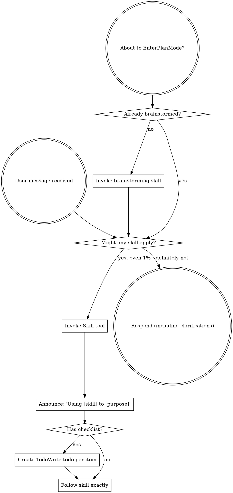
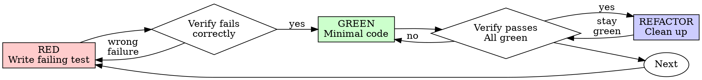

2026-07-22T17:18:44.428039Z ERROR codex_models_manager::cache: failed to load models cache: missing field `supports_reasoning_summaries` at line 88 column 5
OpenAI Codex v0.144.6
--------
workdir: C:\experiments\ssc
model: gpt-5.5
provider: openai
approval: never
sandbox: workspace-write [workdir, /tmp, $TMPDIR]
reasoning effort: medium
reasoning summaries: none
session id: 019f8ad6-441a-7e11-8278-351fbbbf871c
--------
user
Read docs/agent_workorders/2026-07-22-atlas-stage2-embedding-classifier-workorder.md fully and execute it. This mutates the live study database - follow the mandatory safety checks exactly. A backup already exists at data/backups/study-pre-atlas-stage2-20260722-224830.db. Follow the report format at the end exactly.

hook: SessionStart
hook: SessionStart Completed
hook: UserPromptSubmit
hook: UserPromptSubmit Completed
codex
I’ll use the required superpowers bootstrap first, then read the workorder and the project continuity notes before touching the database. After that I’ll follow the workorder’s safety checks in order.
hook: PreToolUse
hook: PreToolUse Completed
exec
"C:\\WINDOWS\\System32\\WindowsPowerShell\\v1.0\\powershell.exe" -Command "Get-Content -Raw C:\\Users\\srika\\.codex\\superpowers\\skills\\using-superpowers\\SKILL.md" in C:\experiments\ssc
 succeeded in 87277ms:
---
name: using-superpowers
description: Use when starting any conversation - establishes how to find and use skills, requiring Skill tool invocation before ANY response including clarifying questions
---

<SUBAGENT-STOP>
If you were dispatched as a subagent to execute a specific task, skip this skill.
</SUBAGENT-STOP>

<EXTREMELY-IMPORTANT>
If you think there is even a 1% chance a skill might apply to what you are doing, you ABSOLUTELY MUST invoke the skill.

IF A SKILL APPLIES TO YOUR TASK, YOU DO NOT HAVE A CHOICE. YOU MUST USE IT.

This is not negotiable. This is not optional. You cannot rationalize your way out of this.
</EXTREMELY-IMPORTANT>

## Instruction Priority

Superpowers skills override default system prompt behavior, but **user instructions always take precedence**:

1. **User's explicit instructions** (CLAUDE.md, GEMINI.md, AGENTS.md, direct requests) — highest priority
2. **Superpowers skills** — override default system behavior where they conflict
3. **Default system prompt** — lowest priority

If CLAUDE.md, GEMINI.md, or AGENTS.md says "don't use TDD" and a skill says "always use TDD," follow the user's instructions. The user is in control.

## How to Access Skills

**In Claude Code:** Use the `Skill` tool. When you invoke a skill, its content is loaded and presented to you—follow it directly. Never use the Read tool on skill files.

**In Copilot CLI:** Use the `skill` tool. Skills are auto-discovered from installed plugins. The `skill` tool works the same as Claude Code's `Skill` tool.

**In Gemini CLI:** Skills activate via the `activate_skill` tool. Gemini loads skill metadata at session start and activates the full content on demand.

**In other environments:** Check your platform's documentation for how skills are loaded.

## Platform Adaptation

Skills use Claude Code tool names. Non-CC platforms: see `references/copilot-tools.md` (Copilot CLI), `references/codex-tools.md` (Codex) for tool equivalents. Gemini CLI users get the tool mapping loaded automatically via GEMINI.md.

# Using Skills

## The Rule

**Invoke relevant or requested skills BEFORE any response or action.** Even a 1% chance a skill might apply means that you should invoke the skill to check. If an invoked skill turns out to be wrong for the situation, you don't need to use it.



## Red Flags

These thoughts mean STOP—you're rationalizing:

| Thought | Reality |
|---------|---------|
| "This is just a simple question" | Questions are tasks. Check for skills. |
| "I need more context first" | Skill check comes BEFORE clarifying questions. |
| "Let me explore the codebase first" | Skills tell you HOW to explore. Check first. |
| "I can check git/files quickly" | Files lack conversation context. Check for skills. |
| "Let me gather information first" | Skills tell you HOW to gather information. |
| "This doesn't need a formal skill" | If a skill exists, use it. |
| "I remember this skill" | Skills evolve. Read current version. |
| "This doesn't count as a task" | Action = task. Check for skills. |
| "The skill is overkill" | Simple things become complex. Use it. |
| "I'll just do this one thing first" | Check BEFORE doing anything. |
| "This feels productive" | Undisciplined action wastes time. Skills prevent this. |
| "I know what that means" | Knowing the concept ≠ using the skill. Invoke it. |

## Skill Priority

When multiple skills could apply, use this order:

1. **Process skills first** (brainstorming, debugging) - these determine HOW to approach the task
2. **Implementation skills second** (frontend-design, mcp-builder) - these guide execution

"Let's build X" → brainstorming first, then implementation skills.
"Fix this bug" → debugging first, then domain-specific skills.

## Skill Types

**Rigid** (TDD, debugging): Follow exactly. Don't adapt away discipline.

**Flexible** (patterns): Adapt principles to context.

The skill itself tells you which.

## User Instructions

Instructions say WHAT, not HOW. "Add X" or "Fix Y" doesn't mean skip workflows.


hook: PostToolUse
hook: PostToolUse Completed
2026-07-22T17:20:54.444711Z ERROR codex_models_manager::manager: failed to renew cache TTL: missing field `supports_reasoning_summaries` at line 88 column 5
codex
Using `superpowers:executing-plans` because the task is to run a written workorder, and I’ll load `verification-before-completion` before reporting success. I’ll keep the project memory lookup lightweight and treat it as hints only.
hook: PreToolUse
hook: PreToolUse
hook: PreToolUse
hook: PreToolUse
hook: PreToolUse Completed
exec
"C:\\WINDOWS\\System32\\WindowsPowerShell\\v1.0\\powershell.exe" -Command "Get-Content -Raw C:\\Users\\srika\\.codex\\superpowers\\skills\\verification-before-completion\\SKILL.md" in C:\experiments\ssc
hook: PreToolUse Completed
exec
"C:\\WINDOWS\\System32\\WindowsPowerShell\\v1.0\\powershell.exe" -Command "Get-Content -Raw C:\\Users\\srika\\.codex\\superpowers\\skills\\executing-plans\\SKILL.md" in C:\experiments\ssc
hook: PreToolUse Completed
exec
"C:\\WINDOWS\\System32\\WindowsPowerShell\\v1.0\\powershell.exe" -Command "Get-Content -Raw docs\\agent_workorders\\2026-07-22-atlas-stage2-embedding-classifier-workorder.md" in C:\experiments\ssc
hook: PreToolUse Completed
exec
"C:\\WINDOWS\\System32\\WindowsPowerShell\\v1.0\\powershell.exe" -Command "Select-String -Path C:\\Users\\srika\\.codex\\memories\\MEMORY.md -Pattern 'SSC|atlas|stage2|embedding|classifier|study database' -Context 2,2" in C:\experiments\ssc
 succeeded in 7625ms:

  C:\Users\srika\.codex\memories\MEMORY.md:739:- Symptom: sanitization patch works for one polluted Maps name shape 
but misses another. Cause: validating only against the first observed format. Fix: check the first resumed live log 
lines and expand the sanitizer before letting the sweep continue [Task 4]
  C:\Users\srika\.codex\memories\MEMORY.md:740:
> C:\Users\srika\.codex\memories\MEMORY.md:741:# Task Group: SSC Phase 1 web bridge handoff, baseline readiness, and 
strict review
  C:\Users\srika\.codex\memories\MEMORY.md:742:
> C:\Users\srika\.codex\memories\MEMORY.md:743:scope: Finalizing SSC Phase 1 web/baseline work, including handoff 
packaging, strict review of live fixes, readiness gating, safe asset rendering, and honest documentation of remaining 
blockers.
> C:\Users\srika\.codex\memories\MEMORY.md:744:applies_to: cwd=C:\experiments\ssc; reuse_rule=Reuse for SSC Phase 1 
frontend/baseline tasks while docs live under `docs/phase1_frontend/`, the web stack still uses `src/ssc_study/web.py` 
plus `src/ssc_study/static/app.js`, and readiness still depends on `data/study.db`; re-check current 
endpoint/data-model contracts before reuse.
  C:\Users\srika\.codex\memories\MEMORY.md:745:
  C:\Users\srika\.codex\memories\MEMORY.md:746:## Task 1: Manual baseline readiness investigation, success
  C:\Users\srika\.codex\memories\MEMORY.md:748:### rollout_summary_files
  C:\Users\srika\.codex\memories\MEMORY.md:749:
> C:\Users\srika\.codex\memories\MEMORY.md:750:- 
rollout_summaries/2026-07-11T10-34-48-npuH-ssc_smoke_baseline_incomplete_stem_repair_and_web_safe_gatin.md 
(cwd=\\?\C:\experiments\ssc, rollout_path=C:\Users\srika\.codex\sessions\2026\07\11\rollout-2026-07-11T16-04-53-019f50b
e-7b6f-7f20-9759-a0b9eb7d5bcb.jsonl, updated_at=2026-07-13T11:34:41+00:00, 
thread_id=019f50be-7b6f-7f20-9759-a0b9eb7d5bcb, replaces the deleted baseline summary with the final web-safe gating 
and smoke-ready evidence)
  C:\Users\srika\.codex\memories\MEMORY.md:751:
  C:\Users\srika\.codex\memories\MEMORY.md:752:### keywords
  C:\Users\srika\.codex\memories\MEMORY.md:758:### rollout_summary_files
  C:\Users\srika\.codex\memories\MEMORY.md:759:
> C:\Users\srika\.codex\memories\MEMORY.md:760:- 
rollout_summaries/2026-07-11T10-34-48-npuH-ssc_smoke_baseline_incomplete_stem_repair_and_web_safe_gatin.md 
(cwd=\\?\C:\experiments\ssc, rollout_path=C:\Users\srika\.codex\sessions\2026\07\11\rollout-2026-07-11T16-04-53-019f50b
e-7b6f-7f20-9759-a0b9eb7d5bcb.jsonl, updated_at=2026-07-13T11:34:41+00:00, 
thread_id=019f50be-7b6f-7f20-9759-a0b9eb7d5bcb, documents the final web-safe pool, safe asset serving, and smoke/full 
audit)
  C:\Users\srika\.codex\memories\MEMORY.md:761:
  C:\Users\srika\.codex\memories\MEMORY.md:762:### keywords
  C:\Users\srika\.codex\memories\MEMORY.md:763:
> C:\Users\srika\.codex\memories\MEMORY.md:764:- web.py, baseline_web.py, question_assets.py, /api/question-assets, 
SSC_QUESTION_ASSET_ROOTS, asset_urls, marked_for_review, Attempt, submit_baseline_exam, raw_path_leaks
  C:\Users\srika\.codex\memories\MEMORY.md:765:
  C:\Users\srika\.codex\memories\MEMORY.md:766:## Task 3: Reconstruct split/half-incomplete question rows and record 
smoke go/no-go, success
  C:\Users\srika\.codex\memories\MEMORY.md:768:### rollout_summary_files
  C:\Users\srika\.codex\memories\MEMORY.md:769:
> C:\Users\srika\.codex\memories\MEMORY.md:770:- 
rollout_summaries/2026-07-11T10-34-48-npuH-ssc_smoke_baseline_incomplete_stem_repair_and_web_safe_gatin.md 
(cwd=\\?\C:\experiments\ssc, rollout_path=C:\Users\srika\.codex\sessions\2026\07\11\rollout-2026-07-11T16-04-53-019f50b
e-7b6f-7f20-9759-a0b9eb7d5bcb.jsonl, updated_at=2026-07-13T11:34:41+00:00, 
thread_id=019f50be-7b6f-7f20-9759-a0b9eb7d5bcb, captures evidence-backed stem repair and the final smoke yes/full no 
distinction)
  C:\Users\srika\.codex\memories\MEMORY.md:771:
  C:\Users\srika\.codex\memories\MEMORY.md:772:### keywords
  C:\Users\srika\.codex\memories\MEMORY.md:778:### rollout_summary_files
  C:\Users\srika\.codex\memories\MEMORY.md:779:
> C:\Users\srika\.codex\memories\MEMORY.md:780:- 
rollout_summaries/2026-07-06T08-22-23-ImiZ-phase1_web_bridge_handoff_and_gemini_deepseek_split.md 
(cwd=\\?\C:\experiments\ssc, rollout_path=C:\Users\srika\.codex\sessions\2026\07\06\rollout-2026-07-06T13-52-28-019f368
5-743b-7621-b405-00f90f9a4aa1.jsonl, updated_at=2026-07-06T19:00:18+00:00, 
thread_id=019f3685-743b-7621-b405-00f90f9a4aa1, includes the one-file combined prompt)
  C:\Users\srika\.codex\memories\MEMORY.md:781:
  C:\Users\srika\.codex\memories\MEMORY.md:782:### keywords
  C:\Users\srika\.codex\memories\MEMORY.md:788:### rollout_summary_files
  C:\Users\srika\.codex\memories\MEMORY.md:789:
> C:\Users\srika\.codex\memories\MEMORY.md:790:- 
rollout_summaries/2026-07-06T08-22-23-ImiZ-phase1_web_bridge_handoff_and_gemini_deepseek_split.md 
(cwd=\\?\C:\experiments\ssc, rollout_path=C:\Users\srika\.codex\sessions\2026\07\06\rollout-2026-07-06T13-52-28-019f368
5-743b-7621-b405-00f90f9a4aa1.jsonl, updated_at=2026-07-06T19:00:18+00:00, 
thread_id=019f3685-743b-7621-b405-00f90f9a4aa1, verified tests before commit `12b6982`)
  C:\Users\srika\.codex\memories\MEMORY.md:791:
  C:\Users\srika\.codex\memories\MEMORY.md:792:### keywords
  C:\Users\srika\.codex\memories\MEMORY.md:793:
> C:\Users\srika\.codex\memories\MEMORY.md:794:- strict senior enginner, web.py, app.js, ws.action.reason, escapeHtml, 
/api/phase3/next-action, ssc-study phase3, tests/test_web.py, 374 passed, 12b6982
  C:\Users\srika\.codex\memories\MEMORY.md:795:
  C:\Users\srika\.codex\memories\MEMORY.md:796:## User preferences
  C:\Users\srika\.codex\memories\MEMORY.md:811:- In this repo, `data/study.db` can contain enough raw rows to satisfy 
the split while still being unusable for a real baseline unless you filter for unique, renderable, web-safe rows; 
readiness should come from the web-safe pool rather than raw counts [Task 1][Task 2]
  C:\Users\srika\.codex\memories\MEMORY.md:812:- The DB currently has no passage/stimulus schema, so 
comprehension/cloze grouping is a data-model/workorder gap, not just a rendering bug [Task 1][Task 3]
> C:\Users\srika\.codex\memories\MEMORY.md:813:- `src/ssc_study/baseline_web.py` now computes a web-safe pool and 
reports `raw_available`, `available`, `missing`, and `quality_exclusions`; `missing_visual_asset` is the concrete 
exclusion reason for visual/table rows without valid local assets [Task 1][Task 2]
> C:\Users\srika\.codex\memories\MEMORY.md:814:- `src/ssc_study/question_assets.py` root-confines paths with 
`SSC_QUESTION_ASSET_ROOTS` plus `Path.cwd()` by default, rejects missing files/non-image suffixes/out-of-root files, 
and `web.py` serves renderable assets via `/api/question-assets/{question_id}/{kind}` instead of leaking raw 
filesystem paths [Task 2]
  C:\Users\srika\.codex\memories\MEMORY.md:815:- The baseline start payload now includes `asset_urls`, 
`question_modality`, `visual_required`, and `table_required`, and `marked_for_review` persists via `Attempt`, 
`_persist_attempt_with_sm2()`, and `submit_baseline_exam()` [Task 2]
  C:\Users\srika\.codex\memories\MEMORY.md:816:- The repaired split rows were `2024_tier1_appx_answer_key_q8`, `q22`, 
and `q29`; `q29` was reconstructed from `answer_key_candidates_staging/2024_tier1_appx_answer_key.pdf` pages 4 and 5, 
and `scripts/repair_incomplete_stems.py` records the evidence in `reports/incomplete_stem_repair_report.md` [Task 3]
  C:\Users\srika\.codex\memories\MEMORY.md:818:- Separate blockers still remain outside this stem-repair rollout: 
missing visual/table assets and comprehension/cloze grouping are still the reasons not to present full-baseline 
readiness as globally done [Task 3]
  C:\Users\srika\.codex\memories\MEMORY.md:819:- The final bridge package lives under `docs/phase1_frontend/` and 
includes `final-remaining-work.md`, `final-spec.md`, `final-test-plan.md`, model workorders, self-review prompts, and 
the combined file `docs/phase1_frontend/prompts/gemini-deepseek-final-combined.md` [Task 4]
> C:\Users\srika\.codex\memories\MEMORY.md:820:- The strict review found two concrete issues worth fixing before 
acceptance: `ws.action.reason` needed escaping in `src/ssc_study/static/app.js`, and `/api/phase3/next-action` in 
`src/ssc_study/web.py` had to emit only supported CLI fallback shapes `ssc-study phase3` and `ssc-study phase3 
--section <section>` [Task 5]
  C:\Users\srika\.codex\memories\MEMORY.md:821:- `tests/test_web.py` is the durable place to pin endpoint schema, 
read-only behavior, frontend escaping, and backend/UI contract changes; verified results after the earlier bridge 
fixes were `14 passed` in `tests/test_web.py`, `102 passed` in the focused Phase 1 suite, and `374 passed, 2 existing 
warnings` repo-wide, with commit `12b6982 feat: complete phase1 web bridge handoff` pushed [Task 5]
  C:\Users\srika\.codex\memories\MEMORY.md:822:
  C:\Users\srika\.codex\memories\MEMORY.md:826:- Symptom: one-liner audit commands keep breaking during investigation. 
Cause: shell/Python syntax or regex brittleness. Fix: switch to a small inline script for corpus/audit evidence 
gathering [Task 1]
  C:\Users\srika\.codex\memories\MEMORY.md:827:- Symptom: implementation globally excludes visual/table questions or 
broad classes of stems. Cause: using generic gating heuristics instead of concrete web-unsafety checks. Fix: narrow 
exclusions to rows with missing/unreadable assets or verified continuation-fragment patterns only [Task 2][Task 3]
> C:\Users\srika\.codex\memories\MEMORY.md:828:- Symptom: DB-backed image paths expose arbitrary local files. Cause: 
serving any existing path without confinement. Fix: require assets to live under `SSC_QUESTION_ASSET_ROOTS` or 
`Path.cwd()` and serve them only through validated `/api/question-assets/...` routes [Task 2]
  C:\Users\srika\.codex\memories\MEMORY.md:829:- Symptom: a half-incomplete question is still present after readiness 
hardening. Cause: the row is a true split fragment, not just a bad option/rendering issue. Fix: search adjacent DB 
rows, source PDF pages, and page JSON, then repair with an idempotent evidence-backed script instead of deleting the 
row [Task 3]
  C:\Users\srika\.codex\memories\MEMORY.md:830:- Symptom: smoke-readiness answers sound ambiguous after targeted 
fixes. Cause: mixing smoke gating with full-baseline product completeness. Fix: answer the stage the user asked about 
explicitly and keep unrelated blockers attached only to the broader stage [Task 3]
  C:\Users\srika\.codex\memories\MEMORY.md:833:- Symptom: commit/push is blocked by Git index permissions or 
whitespace noise. Cause: sandbox/Windows lock quirks and generated trailing whitespace. Fix: anticipate Git index 
writes needing stronger execution and run `git diff --check` before commit [Task 5]
  C:\Users\srika\.codex\memories\MEMORY.md:834:
> C:\Users\srika\.codex\memories\MEMORY.md:835:# Task Group: SSC repo status scorecards and remaining-work planning
  C:\Users\srika\.codex\memories\MEMORY.md:836:
> C:\Users\srika\.codex\memories\MEMORY.md:837:scope: Phase-by-phase status audits, numeric scorecards, and next-step 
planning for the SSC study repo using code/tests/docs evidence rather than stale phase tables.
> C:\Users\srika\.codex\memories\MEMORY.md:838:applies_to: cwd=C:\experiments\ssc; reuse_rule=Reuse for SSC 
status/rundown tasks while the repo still uses the same phase taxonomy (`Phase 2c`, `Phase 3`, `Phase 3b`, `Phase 4`) 
and file layout; refresh scores from current tests/docs because completion claims are time-sensitive.
  C:\Users\srika\.codex\memories\MEMORY.md:839:
  C:\Users\srika\.codex\memories\MEMORY.md:840:## Task 1: Repo status rundown and phase scorecard, success
  C:\Users\srika\.codex\memories\MEMORY.md:842:### rollout_summary_files
  C:\Users\srika\.codex\memories\MEMORY.md:843:
> C:\Users\srika\.codex\memories\MEMORY.md:844:- 
rollout_summaries/2026-06-17T16-57-19-CQQ8-ssc_phase_status_scorecard_and_remaining_work.md 
(cwd=\\?\C:\experiments\ssc, rollout_path=C:\Users\srika\.codex\sessions\2026\06\17\rollout-2026-06-17T22-27-19-019ed68
4-1030-7091-9b14-384fc6b7d050.jsonl, updated_at=2026-07-06T09:48:13+00:00, 
thread_id=019ed684-1030-7091-9b14-384fc6b7d050, framed overall repo as roughly `74/100`)
  C:\Users\srika\.codex\memories\MEMORY.md:845:
  C:\Users\srika\.codex\memories\MEMORY.md:846:### keywords
  C:\Users\srika\.codex\memories\MEMORY.md:852:### rollout_summary_files
  C:\Users\srika\.codex\memories\MEMORY.md:853:
> C:\Users\srika\.codex\memories\MEMORY.md:854:- 
rollout_summaries/2026-07-07T04-57-20-vxAl-ssc_project_phase_status_audit_and_scorecard.md 
(cwd=\\?\C:\experiments\ssc, rollout_path=C:\Users\srika\.codex\sessions\2026\07\07\rollout-2026-07-07T10-27-23-019f3af
0-1530-77b0-a5b1-119822cbfec9.jsonl, updated_at=2026-07-08T09:29:47+00:00, 
thread_id=019f3af0-1530-77b0-a5b1-119822cbfec9, automated QA green but manual baseline and fresh external audit still 
pending)
  C:\Users\srika\.codex\memories\MEMORY.md:855:
  C:\Users\srika\.codex\memories\MEMORY.md:856:### keywords
  C:\Users\srika\.codex\memories\MEMORY.md:866:## Reusable knowledge
  C:\Users\srika\.codex\memories\MEMORY.md:867:
> C:\Users\srika\.codex\memories\MEMORY.md:868:- Current repo state from code/docs/tests was: deterministic Phase 3 
orchestration in `src/ssc_study/phase3.py`, read-only Phase 3 eval in `src/ssc_study/phase3_eval.py`, read-only 
exam-pattern intelligence in `src/ssc_study/patterns_exam.py` and `src/ssc_study/patterns_priority.py`, and Guardian 
planner v1 in `src/ssc_study/guardian.py` [Task 1]
  C:\Users\srika\.codex\memories\MEMORY.md:869:- The cleaned taxonomy in 
`docs/agent_workorders/phase3-scope-breakdown.md` is: `Phase 2c = exam-paper patterns`, `Phase 3 = user-error 
diagnostics`, `Phase 3b = optional read-only advisory layer`, `Phase 4 = main grind planner v1, not full automation` 
[Task 1]
  C:\Users\srika\.codex\memories\MEMORY.md:870:- `README.md` explicitly warns that the phase table is not proof every 
planned behavior is finished, so audits should compare docs against code/tests instead of trusting the phase table 
[Task 2]
  C:\Users\srika\.codex\memories\MEMORY.md:874:## Failures and how to do differently
  C:\Users\srika\.codex\memories\MEMORY.md:875:
> C:\Users\srika\.codex\memories\MEMORY.md:876:- Symptom: broad searches or file reads time out in the heavy SSC 
workspace. Cause: scanning large files/worktrees too loosely. Fix: narrow searches, smaller file windows, or longer 
timeouts before drawing repo-wide conclusions [Task 1]
  C:\Users\srika\.codex\memories\MEMORY.md:877:- Symptom: status answer drifts into stale doc claims. Cause: using old 
branch-local assumptions or phase tables as truth. Fix: ground the rundown in current code presence, current tests, 
and the newest canonical docs such as `memory.md`, `README.md`, and `docs/agent_workorders/phase3-scope-breakdown.md` 
[Task 1][Task 2]
  C:\Users\srika\.codex\memories\MEMORY.md:878:- Symptom: audit language overclaims completion. Cause: automated QA 
passes are treated like full signoff. Fix: keep manual baseline, fresh external audit, and doc drift as explicit 
caveats even when the automated suite is green [Task 2]


hook: PostToolUse
hook: PostToolUse Completed
2026-07-22T17:24:06.833249Z ERROR codex_core::tools::router: error=Exit code: 124
Wall time: 179.6 seconds
Output:
command timed out after 179601 milliseconds

 exited 124 in 179601ms:
2026-07-22T17:24:07.339213Z ERROR codex_core::tools::router: error=Exit code: 124
Wall time: 180.3 seconds
Output:
command timed out after 180263 milliseconds

 exited 124 in 180263ms:
2026-07-22T17:24:10.778368Z ERROR codex_core::tools::router: error=Exit code: 124
Wall time: 183.7 seconds
Output:
command timed out after 183727 milliseconds

 exited 124 in 183727ms:
2026-07-22T17:24:11.742716Z ERROR codex_models_manager::manager: failed to renew cache TTL: missing field `supports_reasoning_summaries` at line 88 column 5
codex
The first broad read hit timeouts, which matches prior SSC notes about this workspace being heavy. I’m switching to narrower file inspection with explicit sizes and line counts, then I’ll read the workorder in manageable chunks so I do not miss any safety step.
hook: PreToolUse
hook: PreToolUse
hook: PreToolUse
hook: PreToolUse Completed
exec
"C:\\WINDOWS\\System32\\WindowsPowerShell\\v1.0\\powershell.exe" -Command "Get-Item docs\\agent_workorders\\2026-07-22-atlas-stage2-embedding-classifier-workorder.md | Select-Object FullName,Length,LastWriteTime" in C:\experiments\ssc
hook: PreToolUse Completed
exec
"C:\\WINDOWS\\System32\\WindowsPowerShell\\v1.0\\powershell.exe" -Command "Get-Item C:\\Users\\srika\\.codex\\superpowers\\skills\\executing-plans\\SKILL.md,C:\\Users\\srika\\.codex\\superpowers\\skills\\verification-before-completion\\SKILL.md | Select-Object FullName,Length" in C:\experiments\ssc
hook: PreToolUse Completed
exec
"C:\\WINDOWS\\System32\\WindowsPowerShell\\v1.0\\powershell.exe" -Command "(Get-Content docs\\agent_workorders\\2026-07-22-atlas-stage2-embedding-classifier-workorder.md).Count" in C:\experiments\ssc
2026-07-22T17:25:15.309212Z ERROR codex_core::tools::router: error=Exit code: 124
Wall time: 34.1 seconds
Output:
command timed out after 34101 milliseconds

 exited 124 in 34101ms:
2026-07-22T17:25:15.459395Z ERROR codex_core::tools::router: error=Exit code: 124
Wall time: 34.2 seconds
Output:
command timed out after 34239 milliseconds

 exited 124 in 34239ms:
2026-07-22T17:25:21.772731Z ERROR codex_core::tools::router: error=Exit code: 124
Wall time: 34.1 seconds
Output:
command timed out after 34090 milliseconds

 exited 124 in 34090ms:
codex
Basic reads are slower than normal here, so I’m avoiding parallel reads for the moment. I’ll use single, longer-running inspection commands to keep the sequence reliable before any mutation.
hook: PreToolUse
hook: PreToolUse Completed
exec
"C:\\WINDOWS\\System32\\WindowsPowerShell\\v1.0\\powershell.exe" -Command "Get-ChildItem -LiteralPath docs\\agent_workorders -Filter 2026-07-22-atlas-stage2-embedding-classifier-workorder.md | Format-List FullName,Length,LastWriteTime" in C:\experiments\ssc
 succeeded in 51481ms:


FullName      : C:\experiments\ssc\docs\agent_workorders\2026-07-22-atlas-stage2-embedding-classifier-workorder.md
Length        : 5213
LastWriteTime : 22-07-2026 22:48:23


hook: PostToolUse
hook: PostToolUse Completed
2026-07-22T17:26:47.778832Z ERROR codex_models_manager::manager: failed to renew cache TTL: missing field `supports_reasoning_summaries` at line 88 column 5
codex
The workorder is small enough to read fully; the slow part is shell startup/filesystem access, not file size. I’m reading it now in one pass with a longer timeout.
hook: PreToolUse
hook: PreToolUse Completed
exec
"C:\\WINDOWS\\System32\\WindowsPowerShell\\v1.0\\powershell.exe" -Command "Get-Content -Raw -LiteralPath docs\\agent_workorders\\2026-07-22-atlas-stage2-embedding-classifier-workorder.md" in C:\experiments\ssc
 succeeded in 169976ms:
# 2026-07-22 Atlas Stage 2 — Embedding-Based Archetype Coverage Expansion

You are working in `C:\experiments\ssc`. This is Stage 2 of the archetype
atlas, following Stage 1 (`scripts/build_atlas_stage1.py`, already landed
and idempotent — read it fully before starting, reuse its conventions).
This is 100% local/free work: `sentence-transformers` (confirmed installed,
v5.5.1) runs on-device, no API calls, no external accounts, no cost.

## Background

Stage 1 used keyword/rule-based matching to assign `archetype_id` to
questions. Current real coverage of the *servable* (web-safe) pool:

| Section | Tagged / Servable |
|---|---|
| Reasoning | 636/778 (82%) |
| English | 869/1600 (54%) |
| Quant/DI | 1388/2699 (51%) |
| GK/GA | 493/1057 (47%) |

Total: 3,389 of 5,841 servable questions are usable by Phase 3's
diagnostic loop; the rest are safe/verified but have no archetype and are
invisible to probing. The 48 archetypes already exist across all 5
sections (`archetypes` table: Quant/DI 12, Reasoning 12, English 13, GK/GA
10, Computer Knowledge 1) — this workorder does NOT create new archetypes,
it only extends coverage of the existing ones using semantic similarity
instead of keyword rules.

`src/ssc_study/embeddings.py` already provides everything needed:
`compute_question_embedding`, `update_all_embeddings`,
`get_embedding`/embedding storage in `questions.embedding_blob`, and a
cosine similarity helper. Read this file fully before writing anything new
— reuse it, don't reimplement embedding logic.

## Task

1. Run `update_all_embeddings` (or confirm it's already been run and
   coverage is complete) so every non-holdout question has a stored
   embedding.
2. For each of the 48 archetypes, build a **centroid embedding**: the mean
   (normalized) vector of all currently `archetype_id`-tagged, non-holdout
   questions belonging to that archetype (the Stage 1 rule-matched seed
   set for that archetype).
3. **Validate the approach before applying it at scale**: hold out a
   sample of already-tagged questions (e.g. 15-20% per archetype, stratified),
   hide their `archetype_id`, reclassify them via nearest-centroid cosine
   similarity, and measure how often the correct archetype is recovered at
   various similarity thresholds. Pick a threshold that gives high
   precision (correct archetype recovered) even if it costs some recall —
   this mirrors the whole project's standing rule: only assign when
   confident, never guess. Report this validation result with real
   numbers before proceeding to the real backfill.
4. Using the validated threshold, classify every currently-untagged,
   **non-holdout** question (regardless of whether it's currently
   `available`/servable or excluded for other reasons — tag what you can,
   the serving gate already handles servability separately) by nearest
   centroid. Assign `archetype_id` only when similarity clears the
   validated threshold; leave untagged otherwise.
5. Do NOT assign `archetype_id` to holdout rows, matching Stage 1's
   existing behavior exactly (Stage 1 confirmed `holdout_archetype_non_null: 0`
   — preserve this invariant).
6. Write this as a rerunnable, idempotent script:
   `scripts/build_atlas_stage2.py` (mirror Stage 1's CLI conventions:
   `--db` flag, clear stdout summary). Running it again later (e.g. after
   more questions get verified) should only touch newly-untagged rows, not
   reprocess or flip already-Stage-1-or-Stage-2-tagged ones.

## Explicit constraints

- Do not modify `scripts/build_atlas_stage1.py` or its existing behavior.
- Do not create, rename, merge, or delete any archetype in the
  `archetypes` table — this is coverage expansion only, same 48 categories.
- Do not touch `data/study.db` tables other than `questions.archetype_id`
  and `questions.embedding_blob`.
- Do not call any external API or require any credential — this must work
  fully offline/locally. If you find yourself needing network access,
  stop and reconsider the approach.
- Protected tables (`attempts`, `sessions`, `sm2_state`) and all existing
  `question_id`s/row counts must be unchanged — this only updates two
  columns on existing rows, never inserts/deletes rows.

## Verification required before reporting done

- Embedding coverage before/after (`get_embedding_stats`).
- Validation-phase results: threshold chosen, and precision/recall at that
  threshold on the held-out sample, per section.
- Real backfill counts: how many previously-untagged non-holdout questions
  got a new `archetype_id`, broken down by section and by archetype.
- Updated per-section tagged/servable coverage table (same format as the
  "before" table above) — this is the headline result.
- Confirm holdout rows still have zero archetype assignments.
- Confirm protected tables and row counts unchanged.
- Run `uv run pytest -q`, paste exact results.

## Report format

Embedding coverage before/after, validation methodology and chosen
threshold with precision numbers, backfill counts by section/archetype,
updated coverage table (headline), protected-table proof, test suite
results, residual risk (e.g. sections/archetypes that remain
under-covered even after this pass, and why).


hook: PostToolUse
hook: PostToolUse Completed
2026-07-22T17:30:01.574063Z ERROR codex_models_manager::manager: failed to renew cache TTL: missing field `supports_reasoning_summaries` at line 88 column 5
codex
I have the workorder. Before implementation, I’m loading the execution and completion-check skills, then I’ll inspect Stage 1 and the embedding helper as the workorder requires.
hook: PreToolUse
hook: PreToolUse Completed
exec
"C:\\WINDOWS\\System32\\WindowsPowerShell\\v1.0\\powershell.exe" -Command "Get-Content -Raw -LiteralPath C:\\Users\\srika\\.codex\\superpowers\\skills\\executing-plans\\SKILL.md" in C:\experiments\ssc
 succeeded in 90872ms:
---
name: executing-plans
description: Use when you have a written implementation plan to execute in a separate session with review checkpoints
---

# Executing Plans

## Overview

Load plan, review critically, execute all tasks, report when complete.

**Announce at start:** "I'm using the executing-plans skill to implement this plan."

**Note:** Tell your human partner that Superpowers works much better with access to subagents. The quality of its work will be significantly higher if run on a platform with subagent support (such as Claude Code or Codex). If subagents are available, use superpowers:subagent-driven-development instead of this skill.

## The Process

### Step 1: Load and Review Plan
1. Read plan file
2. Review critically - identify any questions or concerns about the plan
3. If concerns: Raise them with your human partner before starting
4. If no concerns: Create TodoWrite and proceed

### Step 2: Execute Tasks

For each task:
1. Mark as in_progress
2. Follow each step exactly (plan has bite-sized steps)
3. Run verifications as specified
4. Mark as completed

### Step 3: Complete Development

After all tasks complete and verified:
- Announce: "I'm using the finishing-a-development-branch skill to complete this work."
- **REQUIRED SUB-SKILL:** Use superpowers:finishing-a-development-branch
- Follow that skill to verify tests, present options, execute choice

## When to Stop and Ask for Help

**STOP executing immediately when:**
- Hit a blocker (missing dependency, test fails, instruction unclear)
- Plan has critical gaps preventing starting
- You don't understand an instruction
- Verification fails repeatedly

**Ask for clarification rather than guessing.**

## When to Revisit Earlier Steps

**Return to Review (Step 1) when:**
- Partner updates the plan based on your feedback
- Fundamental approach needs rethinking

**Don't force through blockers** - stop and ask.

## Remember
- Review plan critically first
- Follow plan steps exactly
- Don't skip verifications
- Reference skills when plan says to
- Stop when blocked, don't guess
- Never start implementation on main/master branch without explicit user consent

## Integration

**Required workflow skills:**
- **superpowers:using-git-worktrees** - REQUIRED: Set up isolated workspace before starting
- **superpowers:writing-plans** - Creates the plan this skill executes
- **superpowers:finishing-a-development-branch** - Complete development after all tasks


hook: PostToolUse
hook: PostToolUse Completed
hook: PreToolUse
hook: PreToolUse Completed
exec
"C:\\WINDOWS\\System32\\WindowsPowerShell\\v1.0\\powershell.exe" -Command "Get-Content -Raw -LiteralPath C:\\Users\\srika\\.codex\\superpowers\\skills\\verification-before-completion\\SKILL.md" in C:\experiments\ssc
 succeeded in 67841ms:
---
name: verification-before-completion
description: Use when about to claim work is complete, fixed, or passing, before committing or creating PRs - requires running verification commands and confirming output before making any success claims; evidence before assertions always
---

# Verification Before Completion

## Overview

Claiming work is complete without verification is dishonesty, not efficiency.

**Core principle:** Evidence before claims, always.

**Violating the letter of this rule is violating the spirit of this rule.**

## The Iron Law

```
NO COMPLETION CLAIMS WITHOUT FRESH VERIFICATION EVIDENCE
```

If you haven't run the verification command in this message, you cannot claim it passes.

## The Gate Function

```
BEFORE claiming any status or expressing satisfaction:

1. IDENTIFY: What command proves this claim?
2. RUN: Execute the FULL command (fresh, complete)
3. READ: Full output, check exit code, count failures
4. VERIFY: Does output confirm the claim?
   - If NO: State actual status with evidence
   - If YES: State claim WITH evidence
5. ONLY THEN: Make the claim

Skip any step = lying, not verifying
```

## Common Failures

| Claim | Requires | Not Sufficient |
|-------|----------|----------------|
| Tests pass | Test command output: 0 failures | Previous run, "should pass" |
| Linter clean | Linter output: 0 errors | Partial check, extrapolation |
| Build succeeds | Build command: exit 0 | Linter passing, logs look good |
| Bug fixed | Test original symptom: passes | Code changed, assumed fixed |
| Regression test works | Red-green cycle verified | Test passes once |
| Agent completed | VCS diff shows changes | Agent reports "success" |
| Requirements met | Line-by-line checklist | Tests passing |

## Red Flags - STOP

- Using "should", "probably", "seems to"
- Expressing satisfaction before verification ("Great!", "Perfect!", "Done!", etc.)
- About to commit/push/PR without verification
- Trusting agent success reports
- Relying on partial verification
- Thinking "just this once"
- Tired and wanting work over
- **ANY wording implying success without having run verification**

## Rationalization Prevention

| Excuse | Reality |
|--------|---------|
| "Should work now" | RUN the verification |
| "I'm confident" | Confidence ≠ evidence |
| "Just this once" | No exceptions |
| "Linter passed" | Linter ≠ compiler |
| "Agent said success" | Verify independently |
| "I'm tired" | Exhaustion ≠ excuse |
| "Partial check is enough" | Partial proves nothing |
| "Different words so rule doesn't apply" | Spirit over letter |

## Key Patterns

**Tests:**
```
✅ [Run test command] [See: 34/34 pass] "All tests pass"
❌ "Should pass now" / "Looks correct"
```

**Regression tests (TDD Red-Green):**
```
✅ Write → Run (pass) → Revert fix → Run (MUST FAIL) → Restore → Run (pass)
❌ "I've written a regression test" (without red-green verification)
```

**Build:**
```
✅ [Run build] [See: exit 0] "Build passes"
❌ "Linter passed" (linter doesn't check compilation)
```

**Requirements:**
```
✅ Re-read plan → Create checklist → Verify each → Report gaps or completion
❌ "Tests pass, phase complete"
```

**Agent delegation:**
```
✅ Agent reports success → Check VCS diff → Verify changes → Report actual state
❌ Trust agent report
```

## Why This Matters

From 24 failure memories:
- your human partner said "I don't believe you" - trust broken
- Undefined functions shipped - would crash
- Missing requirements shipped - incomplete features
- Time wasted on false completion → redirect → rework
- Violates: "Honesty is a core value. If you lie, you'll be replaced."

## When To Apply

**ALWAYS before:**
- ANY variation of success/completion claims
- ANY expression of satisfaction
- ANY positive statement about work state
- Committing, PR creation, task completion
- Moving to next task
- Delegating to agents

**Rule applies to:**
- Exact phrases
- Paraphrases and synonyms
- Implications of success
- ANY communication suggesting completion/correctness

## The Bottom Line

**No shortcuts for verification.**

Run the command. Read the output. THEN claim the result.

This is non-negotiable.


hook: PostToolUse
hook: PostToolUse Completed
2026-07-22T17:33:09.307398Z ERROR codex_models_manager::manager: failed to renew cache TTL: missing field `supports_reasoning_summaries` at line 88 column 5
codex
I’m not creating a separate worktree because the workorder explicitly targets the live `C:\experiments\ssc` database and names an existing live backup. I’ll still keep code changes surgical and verify the database invariants before and after mutation.
hook: PreToolUse
hook: PreToolUse Completed
  → Read required Stage 1 and embeddings code plus local continuity notes
  • Implement idempotent Stage 2 script without altering Stage 1
  • Run mandatory pre-mutation database safety checks
  • Run embeddings and Stage 2 backfill against live database
  • Verify coverage, invariants, protected tables, and full tests
  • Report in the exact requested format
hook: PostToolUse
hook: PostToolUse Completed
2026-07-22T17:33:21.767529Z ERROR codex_models_manager::manager: failed to renew cache TTL: missing field `supports_reasoning_summaries` at line 88 column 5
codex
Next I’m reading the two required source files completely: Stage 1 for CLI/idempotency conventions and `embeddings.py` for the existing storage/similarity API. After that I’ll inspect the schema and tests that should pin the behavior.
hook: PreToolUse
hook: PreToolUse Completed
exec
"C:\\WINDOWS\\System32\\WindowsPowerShell\\v1.0\\powershell.exe" -Command "Get-Content -Raw -LiteralPath scripts\\build_atlas_stage1.py" in C:\experiments\ssc
 succeeded in 89963ms:
"""Activate the Stage 1 rule-based archetype atlas."""

from __future__ import annotations

import argparse
import sys
from dataclasses import dataclass
from pathlib import Path

ROOT = Path(__file__).resolve().parents[1]
SRC = ROOT / "src"
if str(SRC) not in sys.path:
    sys.path.insert(0, str(SRC))

from ssc_study.archetypes import (  # noqa: E402
    classify_question,
    ensure_default_archetypes,
)
from ssc_study.db import Database  # noqa: E402
from ssc_study.models import Question  # noqa: E402


@dataclass(frozen=True)
class AtlasStage1Report:
    """Summary of one Stage 1 atlas activation run."""

    archetypes_created: int
    questions_assigned: int
    total_non_holdout: int
    assigned_non_holdout: int
    unassigned_by_section: dict[str, int]
    per_archetype_counts: list[tuple[str, str, int]]


def build_atlas_stage1(db: Database) -> AtlasStage1Report:
    """Populate default archetypes and assign rule matches to non-holdouts."""
    archetypes_created = ensure_default_archetypes(db)
    conn = db.connect()
    rows = conn.execute(
        "SELECT * FROM questions WHERE is_holdout = 0 ORDER BY question_id"
    ).fetchall()

    questions_assigned = 0
    with db.transaction() as tx:
        for row in rows:
            question = Question.from_row(row)
            archetype_name = classify_question(question)
            if archetype_name is None:
                continue

            archetype_row = tx.execute(
                "SELECT archetype_id FROM archetypes WHERE name = ? AND section = ?",
                (archetype_name, question.section),
            ).fetchone()
            if archetype_row is None:
                continue

            archetype_id = archetype_row["archetype_id"]
            if row["archetype_id"] != archetype_id:
                tx.execute(
                    "UPDATE questions SET archetype_id = ? WHERE question_id = ?",
                    (archetype_id, question.question_id),
                )
                questions_assigned += 1

    unassigned_by_section = {
        row["section"]: row["count"]
        for row in conn.execute(
            """SELECT section, COUNT(*) AS count
               FROM questions
               WHERE is_holdout = 0 AND archetype_id IS NULL
               GROUP BY section
               ORDER BY section"""
        ).fetchall()
    }
    count_row = conn.execute(
        """SELECT
              COUNT(*) AS total_non_holdout,
              SUM(CASE WHEN archetype_id IS NOT NULL THEN 1 ELSE 0 END) AS assigned_non_holdout
           FROM questions
           WHERE is_holdout = 0"""
    ).fetchone()
    per_archetype_counts = [
        (row["section"], row["name"], row["count"])
        for row in conn.execute(
            """SELECT a.section, a.name, COUNT(q.question_id) AS count
               FROM archetypes a
               LEFT JOIN questions q
                 ON q.archetype_id = a.archetype_id
                AND q.is_holdout = 0
               GROUP BY a.archetype_id
               ORDER BY a.section, a.name"""
        ).fetchall()
    ]

    return AtlasStage1Report(
        archetypes_created=archetypes_created,
        questions_assigned=questions_assigned,
        total_non_holdout=count_row["total_non_holdout"] or 0,
        assigned_non_holdout=count_row["assigned_non_holdout"] or 0,
        unassigned_by_section=unassigned_by_section,
        per_archetype_counts=per_archetype_counts,
    )


def print_report(report: AtlasStage1Report) -> None:
    """Print a stable line-oriented report for CLI use and audits."""
    print(f"archetypes_created={report.archetypes_created}")
    print(f"questions_assigned={report.questions_assigned}")
    print(f"assigned_non_holdout={report.assigned_non_holdout}")
    print(f"total_non_holdout={report.total_non_holdout}")
    if report.total_non_holdout:
        coverage = report.assigned_non_holdout / report.total_non_holdout
    else:
        coverage = 0.0
    print(f"coverage_non_holdout={coverage:.3f}")
    print("unassigned_by_section:")
    if report.unassigned_by_section:
        for section, count in report.unassigned_by_section.items():
            print(f"  {section}={count}")
    else:
        print("  none=0")
    print("per_archetype_counts:")
    for section, name, count in report.per_archetype_counts:
        print(f"  {section} | {name}={count}")


def main(argv: list[str] | None = None) -> int:
    parser = argparse.ArgumentParser(description=__doc__)
    parser.add_argument("--db", default="data/study.db", help="SQLite study DB path")
    args = parser.parse_args(argv)

    db = Database(args.db)
    report = build_atlas_stage1(db)
    print_report(report)
    return 0


if __name__ == "__main__":
    raise SystemExit(main())


hook: PostToolUse
hook: PostToolUse Completed
hook: PreToolUse
hook: PreToolUse Completed
exec
"C:\\WINDOWS\\System32\\WindowsPowerShell\\v1.0\\powershell.exe" -Command "Get-Content -Raw -LiteralPath src\\ssc_study\\embeddings.py" in C:\experiments\ssc
 succeeded in 92741ms:
"""Question embeddings and semantic search using sentence-transformers + FAISS.

Provides:
  - Embedding computation for questions (text + options combined).
  - FAISS index construction and similarity search.
  - Remediation: finding similar questions when a user gets one wrong.
  - Batch embedding update for the entire corpus.

Gracefully degrades to bag-of-words fallback when sentence-transformers is
unavailable (e.g. in CI without the full ML stack).
"""

from __future__ import annotations

import json
import re
import sqlite3
from typing import Any

from .db import Database
from .models import Question

# ── Module-level state ────────────────────────────────────────────────

_MODEL = None  # lazy-loaded SentenceTransformer
_INDEX = None  # lazy-built FAISS index
_INDEX_ID_MAP: dict[int, str] = {}  # FAISS index position → question_id
_EMBEDDING_DIM = 384  # default for all-MiniLM-L6-v2


def get_model_name() -> str:
    """Return the SentenceTransformer model identifier used."""
    return "all-MiniLM-L6-v2"


# ── Public API ────────────────────────────────────────────────────────


def compute_question_embedding(question: Question) -> list[float]:
    """Compute the embedding vector for a single question.

    Combines question text, options, and section into a single string
    for encoding.

    Args:
        question: A Question object.

    Returns:
        List of floats representing the embedding vector.
    """
    combined = _build_embedding_text(question)
    return _encode(combined)


def compute_text_embedding(text: str) -> list[float]:
    """Compute embedding for arbitrary text (not tied to a question)."""
    return _encode(text)


def find_similar_questions(
    db: Database,
    question_id: str,
    top_k: int = 5,
    same_section: bool = True,
    exclude_holdout: bool = True,
) -> list[dict[str, Any]]:
    """Find questions semantically similar to a given question.

    Args:
        db: Database instance.
        question_id: The reference question to find similar ones for.
        top_k: Number of similar questions to return.
        same_section: Only return questions from the same section.
        exclude_holdout: Exclude holdout questions.

    Returns:
        List of dicts with keys: question_id, section, question_text,
        score (cosine similarity), tier.
    """
    conn = db.connect()
    row = conn.execute(
        "SELECT * FROM questions WHERE question_id = ?", (question_id,)
    ).fetchone()

    if not row:
        return []

    reference_q = _row_to_question_ref(row)
    reference_emb = compute_question_embedding(reference_q)

    # Build query
    where_parts = ["q.question_id != ?"]
    params: list[Any] = [question_id]

    if same_section:
        where_parts.append("q.section = ?")
        params.append(reference_q.section)

    if exclude_holdout:
        where_parts.append("q.is_holdout = 0")

    where = " AND ".join(where_parts)

    candidates = conn.execute(
        f"SELECT q.*, q.embedding_blob FROM questions q WHERE {where}",
        tuple(params),
    ).fetchall()

    scored: list[tuple[float, dict[str, Any]]] = []

    for candidate in candidates:
        candidate_emb = _get_embedding_from_row(candidate)
        if candidate_emb is None:
            # Compute on the fly
            c_q = _row_to_question_ref(candidate, skip_embedding=True)
            candidate_emb = compute_question_embedding(c_q)

        score = _cosine_similarity(reference_emb, candidate_emb)
        scored.append((
            score,
            {
                "question_id": candidate["question_id"],
                "section": candidate["section"],
                "tier": candidate["tier"],
                "question_text": candidate["question_text"][:200],
                "score": round(score, 4),
            },
        ))

    scored.sort(key=lambda x: x[0], reverse=True)
    return [item[1] for item in scored[:top_k]]


def find_remediation_questions(
    db: Database,
    question: Question,
    count: int = 3,
) -> list[Question]:
    """Find questions similar to a missed one for remediation practice.

    Looks for questions covering the same concept/concept from the same
    section with high semantic similarity. Prefers easier questions first
    (previously answered correctly by the user if available).

    Args:
        db: Database instance.
        question: The question the user got wrong.
        count: Number of remediation questions to return.

    Returns:
        List of Question objects for remediation practice.
    """
    similar = find_similar_questions(
        db, question.question_id, top_k=max(count * 2, 10),
        same_section=True, exclude_holdout=True,
    )

    if not similar:
        return []

    similar_ids = [s["question_id"] for s in similar[:count]]

    conn = db.connect()
    placeholders = ",".join("?" for _ in similar_ids)
    rows = conn.execute(
        f"""SELECT q.* FROM questions q
            WHERE q.question_id IN ({placeholders})""",
        similar_ids,
    ).fetchall()

    return [_row_to_question_ref(r, skip_embedding=True) for r in rows]


def update_all_embeddings(
    db: Database,
    batch_size: int = 100,
    progress_callback: Any = None,
) -> dict[str, int]:
    """Compute and store embeddings for all questions without one.

    Args:
        db: Database instance.
        batch_size: Number of questions to process per batch.
        progress_callback: Optional callable(current, total) for progress.

    Returns:
        Dict with keys: computed, skipped, failed.
    """
    conn = db.connect()
    total = conn.execute(
        "SELECT COUNT(*) as c FROM questions WHERE embedding_blob IS NULL OR length(embedding_blob) = 0"
    ).fetchone()["c"]

    if total == 0:
        return {"computed": 0, "skipped": 0, "failed": 0}

    rows = conn.execute(
        "SELECT * FROM questions WHERE embedding_blob IS NULL OR length(embedding_blob) = 0 LIMIT ?",
        (batch_size,),
    ).fetchall()

    computed = 0
    failed = 0
    total_processed = 0

    while rows:
        for row in rows:
            try:
                question = _row_to_question_ref(row, skip_embedding=True)
                emb = compute_question_embedding(question)
                blob = json.dumps(emb).encode("utf-8")
                conn.execute(
                    "UPDATE questions SET embedding_blob = ? WHERE question_id = ?",
                    (blob, question.question_id),
                )
                computed += 1
            except Exception:
                failed += 1

        conn.commit()
        total_processed += len(rows)

        if progress_callback:
            progress_callback(total_processed, total)

        remaining = total - total_processed
        if remaining <= 0:
            break

        rows = conn.execute(
            "SELECT * FROM questions WHERE embedding_blob IS NULL OR length(embedding_blob) = 0 LIMIT ?",
            (batch_size,),
        ).fetchall()

    return {"computed": computed, "skipped": total - computed - failed, "failed": failed}


def get_embedding_stats(db: Database) -> dict[str, int]:
    """Return stats about embedding coverage in the database.

    Returns:
        Dict: total_questions, with_embeddings, without_embeddings.
    """
    conn = db.connect()
    total = conn.execute("SELECT COUNT(*) as c FROM questions").fetchone()["c"]
    with_emb = conn.execute(
        "SELECT COUNT(*) as c FROM questions WHERE embedding_blob IS NOT NULL AND length(embedding_blob) > 0"
    ).fetchone()["c"]

    return {
        "total_questions": total,
        "with_embeddings": with_emb,
        "without_embeddings": total - with_emb,
    }


def get_embedding(question_id: str, db: Database) -> list[float] | None:
    """Get the stored embedding for a question, or None."""
    conn = db.connect()
    row = conn.execute(
        "SELECT embedding_blob FROM questions WHERE question_id = ?",
        (question_id,),
    ).fetchone()

    if row and row["embedding_blob"]:
        try:
            return json.loads(row["embedding_blob"].decode("utf-8"))
        except (json.JSONDecodeError, UnicodeDecodeError, AttributeError):
            return None
    return None


# ── Internal helpers ──────────────────────────────────────────────────


def _build_embedding_text(question: Question) -> str:
    """Combine question fields into a single embedding input string."""
    parts = [question.question_text]
    for opt in question.options:
        parts.append(f"{opt.label}: {opt.text}")
    if question.section:
        parts.append(f"[{question.section}]")
    return " ".join(parts)


def _encode(text: str) -> list[float]:
    """Encode text using sentence-transformers, with keyword fallback."""
    global _MODEL

    try:
        if _MODEL is None:
            from sentence_transformers import SentenceTransformer
            _MODEL = SentenceTransformer(get_model_name())
        vec = _MODEL.encode(text, show_progress_bar=False)
        return vec.tolist()
    except Exception:
        return _keyword_embedding(text)


def _keyword_embedding(text: str) -> list[float]:
    """Bag-of-words fallback embedding when sentence-transformers is unavailable.

    Produces a fixed-dimension vector from word frequencies (384 dims
    via hashing trick to match the default model dimension).
    """
    words = re.findall(r"\w+", text.lower())
    vec = [0.0] * _EMBEDDING_DIM
    for word in words:
        idx = hash(word) % _EMBEDDING_DIM
        vec[idx] += 1.0

    # Normalize
    norm = sum(v * v for v in vec) ** 0.5
    if norm > 0:
        vec = [v / norm for v in vec]
    return vec


def _cosine_similarity(a: list[float], b: list[float]) -> float:
    """Compute cosine similarity between two vectors."""
    dot = sum(av * bv for av, bv in zip(a, b))
    na = sum(av * av for av in a) ** 0.5
    nb = sum(bv * bv for bv in b) ** 0.5
    if na == 0 or nb == 0:
        return 0.0
    return dot / (na * nb)


def _get_embedding_from_row(row: sqlite3.Row) -> list[float] | None:
    """Extract embedding from a database row blob."""
    blob = row["embedding_blob"]
    if blob is None:
        return None
    try:
        if isinstance(blob, bytes):
            return json.loads(blob.decode("utf-8"))
        if isinstance(blob, str):
            return json.loads(blob)
    except (json.JSONDecodeError, UnicodeDecodeError, TypeError):
        pass
    return None


def _row_to_question_ref(
    row: sqlite3.Row,
    skip_embedding: bool = False,
) -> Question:
    """Convert a database row to a Question (minimal field set for embedding)."""
    del skip_embedding
    return Question.from_row(row)


hook: PostToolUse
hook: PostToolUse Completed
codex
Stage 1 updates only non-holdout rows and reports stable line-oriented summaries; `embeddings.py` already handles storage and cosine helpers, with a fallback if the ML stack fails. Since I’m adding a script, I’m loading the TDD skill before writing implementation code.
hook: PreToolUse
hook: PreToolUse Completed
exec
"C:\\WINDOWS\\System32\\WindowsPowerShell\\v1.0\\powershell.exe" -Command "Get-Content -Raw -LiteralPath C:\\Users\\srika\\.codex\\superpowers\\skills\\test-driven-development\\SKILL.md" in C:\experiments\ssc
 succeeded in 96516ms:
---
name: test-driven-development
description: Use when implementing any feature or bugfix, before writing implementation code
---

# Test-Driven Development (TDD)

## Overview

Write the test first. Watch it fail. Write minimal code to pass.

**Core principle:** If you didn't watch the test fail, you don't know if it tests the right thing.

**Violating the letter of the rules is violating the spirit of the rules.**

## When to Use

**Always:**
- New features
- Bug fixes
- Refactoring
- Behavior changes

**Exceptions (ask your human partner):**
- Throwaway prototypes
- Generated code
- Configuration files

Thinking "skip TDD just this once"? Stop. That's rationalization.

## The Iron Law

```
NO PRODUCTION CODE WITHOUT A FAILING TEST FIRST
```

Write code before the test? Delete it. Start over.

**No exceptions:**
- Don't keep it as "reference"
- Don't "adapt" it while writing tests
- Don't look at it
- Delete means delete

Implement fresh from tests. Period.

## Red-Green-Refactor



### RED - Write Failing Test

Write one minimal test showing what should happen.

<Good>
```typescript
test('retries failed operations 3 times', async () => {
  let attempts = 0;
  const operation = () => {
    attempts++;
    if (attempts < 3) throw new Error('fail');
    return 'success';
  };

  const result = await retryOperation(operation);

  expect(result).toBe('success');
  expect(attempts).toBe(3);
});
```
Clear name, tests real behavior, one thing
</Good>

<Bad>
```typescript
test('retry works', async () => {
  const mock = jest.fn()
    .mockRejectedValueOnce(new Error())
    .mockRejectedValueOnce(new Error())
    .mockResolvedValueOnce('success');
  await retryOperation(mock);
  expect(mock).toHaveBeenCalledTimes(3);
});
```
Vague name, tests mock not code
</Bad>

**Requirements:**
- One behavior
- Clear name
- Real code (no mocks unless unavoidable)

### Verify RED - Watch It Fail

**MANDATORY. Never skip.**

```bash
npm test path/to/test.test.ts
```

Confirm:
- Test fails (not errors)
- Failure message is expected
- Fails because feature missing (not typos)

**Test passes?** You're testing existing behavior. Fix test.

**Test errors?** Fix error, re-run until it fails correctly.

### GREEN - Minimal Code

Write simplest code to pass the test.

<Good>
```typescript
async function retryOperation<T>(fn: () => Promise<T>): Promise<T> {
  for (let i = 0; i < 3; i++) {
    try {
      return await fn();
    } catch (e) {
      if (i === 2) throw e;
    }
  }
  throw new Error('unreachable');
}
```
Just enough to pass
</Good>

<Bad>
```typescript
async function retryOperation<T>(
  fn: () => Promise<T>,
  options?: {
    maxRetries?: number;
    backoff?: 'linear' | 'exponential';
    onRetry?: (attempt: number) => void;
  }
): Promise<T> {
  // YAGNI
}
```
Over-engineered
</Bad>

Don't add features, refactor other code, or "improve" beyond the test.

### Verify GREEN - Watch It Pass

**MANDATORY.**

```bash
npm test path/to/test.test.ts
```

Confirm:
- Test passes
- Other tests still pass
- Output pristine (no errors, warnings)

**Test fails?** Fix code, not test.

**Other tests fail?** Fix now.

### REFACTOR - Clean Up

After green only:
- Remove duplication
- Improve names
- Extract helpers

Keep tests green. Don't add behavior.

### Repeat

Next failing test for next feature.

## Good Tests

| Quality | Good | Bad |
|---------|------|-----|
| **Minimal** | One thing. "and" in name? Split it. | `test('validates email and domain and whitespace')` |
| **Clear** | Name describes behavior | `test('test1')` |
| **Shows intent** | Demonstrates desired API | Obscures what code should do |

## Why Order Matters

**"I'll write tests after to verify it works"**

Tests written after code pass immediately. Passing immediately proves nothing:
- Might test wrong thing
- Might test implementation, not behavior
- Might miss edge cases you forgot
- You never saw it catch the bug

Test-first forces you to see the test fail, proving it actually tests something.

**"I already manually tested all the edge cases"**

Manual testing is ad-hoc. You think you tested everything but:
- No record of what you tested
- Can't re-run when code changes
- Easy to forget cases under pressure
- "It worked when I tried it" ≠ comprehensive

Automated tests are systematic. They run the same way every time.

**"Deleting X hours of work is wasteful"**

Sunk cost fallacy. The time is already gone. Your choice now:
- Delete and rewrite with TDD (X more hours, high confidence)
- Keep it and add tests after (30 min, low confidence, likely bugs)

The "waste" is keeping code you can't trust. Working code without real tests is technical debt.

**"TDD is dogmatic, being pragmatic means adapting"**

TDD IS pragmatic:
- Finds bugs before commit (faster than debugging after)
- Prevents regressions (tests catch breaks immediately)
- Documents behavior (tests show how to use code)
- Enables refactoring (change freely, tests catch breaks)

"Pragmatic" shortcuts = debugging in production = slower.

**"Tests after achieve the same goals - it's spirit not ritual"**

No. Tests-after answer "What does this do?" Tests-first answer "What should this do?"

Tests-after are biased by your implementation. You test what you built, not what's required. You verify remembered edge cases, not discovered ones.

Tests-first force edge case discovery before implementing. Tests-after verify you remembered everything (you didn't).

30 minutes of tests after ≠ TDD. You get coverage, lose proof tests work.

## Common Rationalizations

| Excuse | Reality |
|--------|---------|
| "Too simple to test" | Simple code breaks. Test takes 30 seconds. |
| "I'll test after" | Tests passing immediately prove nothing. |
| "Tests after achieve same goals" | Tests-after = "what does this do?" Tests-first = "what should this do?" |
| "Already manually tested" | Ad-hoc ≠ systematic. No record, can't re-run. |
| "Deleting X hours is wasteful" | Sunk cost fallacy. Keeping unverified code is technical debt. |
| "Keep as reference, write tests first" | You'll adapt it. That's testing after. Delete means delete. |
| "Need to explore first" | Fine. Throw away exploration, start with TDD. |
| "Test hard = design unclear" | Listen to test. Hard to test = hard to use. |
| "TDD will slow me down" | TDD faster than debugging. Pragmatic = test-first. |
| "Manual test faster" | Manual doesn't prove edge cases. You'll re-test every change. |
| "Existing code has no tests" | You're improving it. Add tests for existing code. |

## Red Flags - STOP and Start Over

- Code before test
- Test after implementation
- Test passes immediately
- Can't explain why test failed
- Tests added "later"
- Rationalizing "just this once"
- "I already manually tested it"
- "Tests after achieve the same purpose"
- "It's about spirit not ritual"
- "Keep as reference" or "adapt existing code"
- "Already spent X hours, deleting is wasteful"
- "TDD is dogmatic, I'm being pragmatic"
- "This is different because..."

**All of these mean: Delete code. Start over with TDD.**

## Example: Bug Fix

**Bug:** Empty email accepted

**RED**
```typescript
test('rejects empty email', async () => {
  const result = await submitForm({ email: '' });
  expect(result.error).toBe('Email required');
});
```

**Verify RED**
```bash
$ npm test
FAIL: expected 'Email required', got undefined
```

**GREEN**
```typescript
function submitForm(data: FormData) {
  if (!data.email?.trim()) {
    return { error: 'Email required' };
  }
  // ...
}
```

**Verify GREEN**
```bash
$ npm test
PASS
```

**REFACTOR**
Extract validation for multiple fields if needed.

## Verification Checklist

Before marking work complete:

- [ ] Every new function/method has a test
- [ ] Watched each test fail before implementing
- [ ] Each test failed for expected reason (feature missing, not typo)
- [ ] Wrote minimal code to pass each test
- [ ] All tests pass
- [ ] Output pristine (no errors, warnings)
- [ ] Tests use real code (mocks only if unavoidable)
- [ ] Edge cases and errors covered

Can't check all boxes? You skipped TDD. Start over.

## When Stuck

| Problem | Solution |
|---------|----------|
| Don't know how to test | Write wished-for API. Write assertion first. Ask your human partner. |
| Test too complicated | Design too complicated. Simplify interface. |
| Must mock everything | Code too coupled. Use dependency injection. |
| Test setup huge | Extract helpers. Still complex? Simplify design. |

## Debugging Integration

Bug found? Write failing test reproducing it. Follow TDD cycle. Test proves fix and prevents regression.

Never fix bugs without a test.

## Testing Anti-Patterns

When adding mocks or test utilities, read @testing-anti-patterns.md to avoid common pitfalls:
- Testing mock behavior instead of real behavior
- Adding test-only methods to production classes
- Mocking without understanding dependencies

## Final Rule

```
Production code → test exists and failed first
Otherwise → not TDD
```

No exceptions without your human partner's permission.


hook: PostToolUse
hook: PostToolUse Completed
2026-07-22T17:38:54.444966Z ERROR codex_models_manager::manager: failed to renew cache TTL: missing field `supports_reasoning_summaries` at line 88 column 5
codex
I’m going to add focused tests first for the new Stage 2 behavior: no holdout tagging, no retagging existing assignments, thresholded centroid assignment, and report counts. Then I’ll implement the script against those tests.
hook: PreToolUse
hook: PreToolUse
hook: PreToolUse
hook: PreToolUse
hook: PreToolUse Completed
exec
"C:\\WINDOWS\\System32\\WindowsPowerShell\\v1.0\\powershell.exe" -Command 'rg --files tests scripts src | rg "atlas|archetype|embedding|db"' in C:\experiments\ssc
hook: PreToolUse Completed
exec
"C:\\WINDOWS\\System32\\WindowsPowerShell\\v1.0\\powershell.exe" -Command "rg --files -g 'memory.md' -g 'errors.md' -g 'checklist.md' -g 'context-notes.md'" in C:\experiments\ssc
hook: PreToolUse Completed
exec
"C:\\WINDOWS\\System32\\WindowsPowerShell\\v1.0\\powershell.exe" -Command "Get-ChildItem -LiteralPath scripts -Filter '*atlas*' | Select-Object Name,Length,LastWriteTime" in C:\experiments\ssc
hook: PreToolUse Completed
exec
"C:\\WINDOWS\\System32\\WindowsPowerShell\\v1.0\\powershell.exe" -Command 'Get-ChildItem -LiteralPath tests | Select-Object Name,Length,LastWriteTime' in C:\experiments\ssc
 succeeded in 40359ms:

Name                  Length LastWriteTime      
----                  ------ -------------      
build_atlas_stage1.py   4754 18-07-2026 00:45:03


hook: PostToolUse
hook: PostToolUse Completed
 succeeded in 55185ms:

Name                                  Length LastWriteTime      
----                                  ------ -------------      
__pycache__                                  20-07-2026 00:56:33
conftest.py                           7277   17-07-2026 14:49:46
test_acquire.py                       2184   05-06-2026 17:55:23
test_acquire_resilience.py            2670   05-06-2026 17:55:23
test_ai_review.py                     3388   25-06-2026 19:45:14
test_answer_verification.py           3884   17-07-2026 20:16:34
test_archetypes.py                    6165   05-06-2026 15:06:53
test_audit.py                         3030   05-06-2026 18:58:45
test_baseline_web.py                  47011  17-07-2026 20:42:44
test_build_atlas_stage1.py            3866   18-07-2026 00:35:39
test_cards.py                         6624   05-06-2026 17:55:23
test_cli.py                           5848   06-07-2026 15:03:06
test_config.py                        1993   05-06-2026 15:05:44
test_corpus_cli.py                    1320   25-06-2026 19:44:05
test_crops_utils.py                   2658   17-07-2026 18:47:46
test_db.py                            8380   17-07-2026 16:24:53
test_embeddings.py                    3904   05-06-2026 17:55:23
test_extraction.py                    10806  25-06-2026 19:44:43
test_extraction_investigation.py      4216   24-05-2026 18:31:25
test_extraction_qc_utils.py           3037   23-05-2026 19:36:02
test_gates.py                         4151   05-06-2026 17:55:23
test_guardian.py                      6248   06-07-2026 15:02:44
test_holdout.py                       6193   25-06-2026 19:43:41
test_http_download.py                 1906   25-06-2026 19:44:26
test_init.py                          594    17-05-2026 13:39:22
test_integrity.py                     14575  05-06-2026 17:55:23
test_loader.py                        2234   04-06-2026 21:44:53
test_mark_detection.py                1286   23-05-2026 15:43:29
test_model_compare.py                 2086   19-05-2026 20:42:05
test_namespace_harvest_ids.py         996    20-07-2026 00:56:02
test_native_pipeline_compare.py       4852   05-06-2026 19:11:24
test_overnight_harvest.py             5192   19-07-2026 21:12:44
test_pattern_intelligence_contract.py 5758   06-07-2026 14:35:32
test_pdf_layout.py                    799    25-06-2026 19:44:54
test_phase1_frontend.py               52649  17-07-2026 20:19:34
test_phase3.py                        9179   25-06-2026 19:00:59
test_phase3_eval.py                   15548  25-06-2026 19:01:58
test_queues.py                        2872   05-06-2026 18:59:06
test_quiz.py                          8936   25-06-2026 19:43:30
test_readiness.py                     3955   07-07-2026 12:44:33
test_reports.py                       2566   05-06-2026 15:08:17
test_scheduler.py                     5565   07-07-2026 12:28:06
test_skips.py                         6425   05-06-2026 17:55:23
test_sm2.py                           8180   04-06-2026 21:51:43
test_timer.py                         3645   05-06-2026 17:55:23
test_web.py                           15204  17-07-2026 20:13:48
__init__.py                           0      04-06-2026 21:40:23


hook: PostToolUse
hook: PostToolUse Completed
 succeeded in 137513ms:
memory.md
checklist.md
errors.md

hook: PostToolUse
 succeeded in 140979ms:
scripts\build_atlas_stage1.py
tests\test_db.py
tests\test_build_atlas_stage1.py
tests\test_archetypes.py
tests\test_embeddings.py
src\ssc_study\embeddings.py
src\ssc_study\db.py
src\ssc_study\archetypes.py

hook: PostToolUse
hook: PostToolUse Completed
hook: PostToolUse Completed
2026-07-22T17:41:39.161687Z ERROR codex_models_manager::manager: failed to renew cache TTL: missing field `supports_reasoning_summaries` at line 88 column 5
codex
The repo already has Stage 1, archetype, embedding, and DB tests, so I’ll match those patterns instead of inventing a separate harness. I’m also reading the local `memory.md` and `errors.md` now because the project instructions call them out for non-trivial follow-up work.
hook: PreToolUse
hook: PreToolUse
hook: PreToolUse
hook: PreToolUse
hook: PreToolUse
hook: PreToolUse Completed
exec
"C:\\WINDOWS\\System32\\WindowsPowerShell\\v1.0\\powershell.exe" -Command "Get-Content -Raw -LiteralPath tests\\test_build_atlas_stage1.py" in C:\experiments\ssc
hook: PreToolUse Completed
exec
"C:\\WINDOWS\\System32\\WindowsPowerShell\\v1.0\\powershell.exe" -Command 'Get-Content -Raw -LiteralPath memory.md' in C:\experiments\ssc
hook: PreToolUse Completed
exec
"C:\\WINDOWS\\System32\\WindowsPowerShell\\v1.0\\powershell.exe" -Command 'Get-Content -Raw -LiteralPath errors.md' in C:\experiments\ssc
hook: PreToolUse Completed
exec
"C:\\WINDOWS\\System32\\WindowsPowerShell\\v1.0\\powershell.exe" -Command "Get-Content -Raw -LiteralPath tests\\conftest.py" in C:\experiments\ssc
hook: PreToolUse Completed
exec
"C:\\WINDOWS\\System32\\WindowsPowerShell\\v1.0\\powershell.exe" -Command "Get-Content -Raw -LiteralPath tests\\test_embeddings.py" in C:\experiments\ssc
 succeeded in 138730ms:
"""Shared fixtures for all tests (corpus + study)."""

from __future__ import annotations

import json
import sqlite3
import sys
from pathlib import Path

import pytest

ROOT = Path(__file__).resolve().parents[1]
SRC = ROOT / "src"
if str(SRC) not in sys.path:
    sys.path.insert(0, str(SRC))


# ── Study app fixtures ──────────────────────────────────────────────────


@pytest.fixture
def in_memory_db() -> sqlite3.Connection:
    """Create an in-memory SQLite database with full schema applied."""
    from ssc_study.db import apply_migrations

    conn = sqlite3.connect(":memory:", check_same_thread=False)
    conn.execute("PRAGMA journal_mode=WAL")
    conn.execute("PRAGMA synchronous=NORMAL")
    conn.execute("PRAGMA foreign_keys=ON")
    conn.execute("PRAGMA busy_timeout=5000")
    conn.row_factory = sqlite3.Row
    apply_migrations(conn)
    return conn


@pytest.fixture
def study_db(in_memory_db) -> Database:
    """A Database instance wrapping an in-memory SQLite DB."""
    from ssc_study.db import Database

    db = Database.__new__(Database)
    db._path = Path(":memory:")
    db._lock = __import__("threading").Lock()
    db._conn = in_memory_db
    return db


@pytest.fixture
def sample_question_data() -> dict:
    """A single well-formed question dict matching merged JSON format."""
    return {
        "question_id": "1235689",
        "section": "General Intelligence and Reasoning",
        "question_text_full": (
            "If A is the brother of B, and B is the sister of C, "
            "then how is A related to C?"
        ),
        "question_number": 1,
        "global_question_number": 1,
        "source_page": 1,
        "canonical_correct_option_label": "3",
        "correct_option_text": "Brother",
        "chosen_option_label": "3",
        "question_modality": "text_only",
        "visual_required": False,
        "table_required": False,
        "math_required": False,
        "evidence_status": "PASS",
        "question_crop_path": None,
        "page_asset_path": None,
        "practice_ready": True,
        "options": [
            {"label": "1", "text": "Sister"},
            {"label": "2", "text": "Father"},
            {"label": "3", "text": "Brother"},
            {"label": "4", "text": "Cousin"},
        ],
    }


@pytest.fixture
def sm2_default_state():
    """Default SM-2 starting state."""
    from ssc_study.models import SM2State
    return SM2State()


# ── Seeded database fixtures ──────────────────────────────────────────


def _insert_question(
    conn: sqlite3.Connection,
    qid: str,
    section: str = "Quant/DI",
    tier: str = "tier1",
    text: str = "Test question?",
    correct_label: str = "1",
    options: list[dict] | None = None,
    year: int = 2021,
    is_holdout: int = 0,
) -> None:
    """Helper to insert a single question."""
    if options is None:
        options = [
            {"label": "1", "text": "Option A"},
            {"label": "2", "text": "Option B"},
            {"label": "3", "text": "Option C"},
            {"label": "4", "text": "Option D"},
        ]
    correct_option_text = next(
        (str(option["text"]) for option in options if str(option["label"]) == str(correct_label)),
        options[0]["text"],
    )
    conn.execute(
        """INSERT OR REPLACE INTO questions
           (question_id, pdf_name, source_page, global_question_number,
            section, year, tier, question_text, options_json,
            correct_option_label, correct_option_text, is_holdout)
           VALUES (?, ?, ?, ?, ?, ?, ?, ?, ?, ?, ?, ?)""",
        (qid, "test_pdf", 1, 1, section, year, tier, text,
         json.dumps(options), correct_label, correct_option_text, is_holdout),
    )
    conn.commit()


@pytest.fixture
def seeded_conn(in_memory_db) -> sqlite3.Connection:
    """DB with diverse questions across sections/tiers and some SM-2 state."""
    conn = in_memory_db

    # Quant questions
    _insert_question(conn, "q1", "Quant/DI", "tier1",
                     "If x + y = 10, find x?", "2")
    _insert_question(conn, "q2", "Quant/DI", "tier2",
                     "What is the derivative of x^2?", "1")
    _insert_question(conn, "q3", "Quant/DI", "tier1",
                     "A train travels 60km in 1 hour. What is its speed?", "3")

    # Reasoning questions
    _insert_question(conn, "q4", "Reasoning", "tier1",
                     "If A is brother of B, how is A related to C?", "1")
    _insert_question(conn, "q5", "Reasoning", "tier2",
                     "Complete the series: 2, 4, 8, 16, ?", "4")

    # English questions
    _insert_question(conn, "q6", "English", "tier1",
                     "Choose the correct spelling: accommodate", "1")
    _insert_question(conn, "q7", "English", "tier2",
                     "Fill in the blank: He ___ to school every day.", "2")

    # GK/GA questions
    _insert_question(conn, "q8", "GK/GA", "tier1",
                     "What is the capital of France?", "3",
                     options=[
                         {"label": "1", "text": "London"},
                         {"label": "2", "text": "Berlin"},
                         {"label": "3", "text": "Paris"},
                         {"label": "4", "text": "Madrid"},
                     ])
    _insert_question(conn, "q9", "GK/GA", "tier2",
                     "Who discovered penicillin?", "2",
                     options=[
                         {"label": "1", "text": "Einstein"},
                         {"label": "2", "text": "Alexander Fleming"},
                         {"label": "3", "text": "Newton"},
                         {"label": "4", "text": "Darwin"},
                     ])
    _insert_question(conn, "q10", "GK/GA", "tier1",
                     "In which year did India get independence?", "1",
                     options=[
                         {"label": "1", "text": "1947"},
                         {"label": "2", "text": "1950"},
                         {"label": "3", "text": "1937"},
                         {"label": "4", "text": "1942"},
                     ])

    # Holdout question
    _insert_question(conn, "q11", "Quant/DI", "tier1",
                     "Holdout question?", "1", is_holdout=1)

    # Add some SM-2 state: q1 is due, q2 due later
    conn.execute(
        "INSERT INTO sm2_state (entity_type, entity_id, easiness, interval_days, repetitions, next_review, last_review, last_quality) "
        "VALUES ('question', 'q1', 2.5, 1, 1, '2020-01-01', '2019-12-31', 4)"
    )
    conn.execute(
        "INSERT INTO sm2_state (entity_type, entity_id, easiness, interval_days, repetitions, next_review, last_review, last_quality) "
        "VALUES ('question', 'q2', 2.6, 6, 2, '2099-01-01', '2099-01-01', 5)"
    )
    conn.commit()

    return conn


@pytest.fixture
def seeded_db(seeded_conn) -> Database:
    """Database instance wrapping seeded_conn."""
    from ssc_study.db import Database

    db = Database.__new__(Database)
    db._path = Path(":memory:")
    db._lock = __import__("threading").Lock()
    db._conn = seeded_conn
    return db


hook: PostToolUse
 succeeded in 140204ms:
"""Tests for the Stage 1 atlas activation script."""

from __future__ import annotations

import json
import sys
from pathlib import Path

ROOT = Path(__file__).resolve().parents[1]
if str(ROOT) not in sys.path:
    sys.path.insert(0, str(ROOT))

from scripts.build_atlas_stage1 import build_atlas_stage1, main
from ssc_study.archetypes import ARCHETYPE_DEFS, ensure_default_archetypes
from ssc_study.db import Database


def _insert_question(
    db: Database,
    question_id: str,
    *,
    section: str,
    text: str,
    is_holdout: int = 0,
    archetype_id: int | None = None,
) -> None:
    db.connect().execute(
        """INSERT INTO questions
           (question_id, pdf_name, source_page, global_question_number,
            section, year, tier, question_text, options_json,
            correct_option_label, correct_option_text, is_holdout, archetype_id)
           VALUES (?, 'test.pdf', 1, 1, ?, 2024, 'tier1', ?, ?, '1', 'A', ?, ?)""",
        (
            question_id,
            section,
            text,
            json.dumps([
                {"label": "1", "text": "A"},
                {"label": "2", "text": "B"},
                {"label": "3", "text": "C"},
                {"label": "4", "text": "D"},
            ]),
            is_holdout,
            archetype_id,
        ),
    )
    db.connect().commit()


def test_build_atlas_stage1_is_idempotent_and_skips_holdout(tmp_path, capsys):
    db_path = tmp_path / "study.db"
    db = Database(db_path)
    _insert_question(
        db,
        "non_holdout_match",
        section="Quant/DI",
        text="If x + y = 10, find the value of x.",
    )
    _insert_question(
        db,
        "holdout_match",
        section="Quant/DI",
        text="If x + y = 10, find the value of x.",
        is_holdout=1,
    )
    _insert_question(
        db,
        "non_holdout_unknown",
        section="English",
        text="A deliberately unmatched sentence with no taxonomy keywords.",
    )
    db.close()

    assert main(["--db", str(db_path)]) == 0
    first_output = capsys.readouterr().out

    db = Database(db_path)
    conn = db.connect()
    assert conn.execute("SELECT COUNT(*) FROM archetypes").fetchone()[0] == len(ARCHETYPE_DEFS)
    assert conn.execute(
        "SELECT archetype_id IS NOT NULL FROM questions WHERE question_id = 'non_holdout_match'"
    ).fetchone()[0] == 1
    assert conn.execute(
        "SELECT archetype_id FROM questions WHERE question_id = 'holdout_match'"
    ).fetchone()[0] is None
    assert "archetypes_created=48" in first_output
    assert "questions_assigned=1" in first_output
    assert "English=1" in first_output

    assert main(["--db", str(db_path)]) == 0
    second_output = capsys.readouterr().out
    assert "archetypes_created=0" in second_output
    assert "questions_assigned=0" in second_output
    assert conn.execute(
        "SELECT archetype_id FROM questions WHERE question_id = 'holdout_match'"
    ).fetchone()[0] is None


def test_build_atlas_stage1_updates_changed_non_holdout_rule_match(tmp_path):
    db = Database(tmp_path / "study.db")
    ensure_default_archetypes(db)
    algebra_id = db.connect().execute(
        "SELECT archetype_id FROM archetypes WHERE section = 'Quant/DI' AND name = 'Algebra'"
    ).fetchone()[0]
    speed_id = db.connect().execute(
        "SELECT archetype_id FROM archetypes WHERE section = 'Quant/DI' AND name = 'Speed, Time & Distance'"
    ).fetchone()[0]
    _insert_question(
        db,
        "stale_match",
        section="Quant/DI",
        text="A train travels 60km in 1 hour. What is its speed?",
        archetype_id=algebra_id,
    )

    report = build_atlas_stage1(db)

    assert report.questions_assigned == 1
    assert db.connect().execute(
        "SELECT archetype_id FROM questions WHERE question_id = 'stale_match'"
    ).fetchone()[0] == speed_id


hook: PostToolUse
 succeeded in 139959ms:
## 2026-05-24 Extraction Stabilization

- P2 remains the active extraction pipeline; P1 is deprecated and only useful for historical/manual comparison.
- Root cause of many P2 batch failures was not pure OCR quality: Gemini quota errors were cached as page JSON with `questions: []`, then merged as if they were real empty pages.
- Extraction pages now carry `page_status`, `failure_type`, `provider`, `model`, `retryable`, `fallback_attempted`, and `fallback_used` metadata.
- Merge output now carries `structural_status` and `structural_failure_reasons`; `api_quota_or_rate_limit`, `model_refusal`, and JSON/schema failures are not treated as ordinary extraction misses.
- `ssc-corpus extract-pdf` now supports opt-in page fallback with `--allow-fallback --fallback-model <nim-model>`; fallback is never automatic.
- `ssc-corpus extract-pdf` now also supports provider selection, including NIM/OpenAI-compatible primary extraction.
- Added `ssc-corpus retry-failed-batch` and `ssc-corpus compare-phases` for patch reruns and phase reporting.
- Current NIM screening result: `meta/llama-4-maverick-17b-128e-instruct` is the strongest tested NIM model, but still too slow for broad full-PDF reruns; lighter NIM models collapsed on completeness.
- Generated investigation dossier: `reports/p2_failure_investigation_20260524.md` and `.json`.

## 2026-06-05 Phase 2b Audit Follow-Up

- Audited Phase 2b against `Plan.md` and README critic/test spec.
- Confirmed prior gaps around notification pause, migration safety, and sealed-holdout session typing; current code now observes `PAUSED` notification audits, blocks boss-fight queue loading during a major audit, migrates v13 DBs to accept `sealed_mock`, and records sealed-holdout sessions as `sealed_mock`.
- Added regression coverage for observable notification pause, boss-fight pause enforcement, migration 14 preserving existing `attempts.session_id` FKs, sealed-holdout session typing, and native pipeline comparison without historical fixture directories.
- Full suite verification: `uv run pytest -q` passed with `218 passed`, with warnings only for Python 3.10/google API support and deprecated `google.generativeai`.

## 2026-06-17 Phase 3 Orchestrator

- Added deterministic Phase 3 orchestration in `src/ssc_study/phase3.py`.
- The loop now selects bounded next actions in priority order: `probe -> remediation -> boss_fight -> sm2_review -> stop`.
- Added CLI entrypoint `ssc-study phase3` with `--max-steps`, `--dry-run`, `--tier`, and `--section`.
- Added regression coverage in `tests/test_phase3.py` and `tests/test_cli.py`.
- Verification: `uv run pytest tests/test_phase3.py tests/test_cli.py tests/test_gates.py tests/test_queues.py tests/test_quiz.py -q` passed with `39 passed`; `uv run pytest -q` passed with `225 passed` and the existing Google/Python warnings only.

## 2026-06-17 Phase 3 Evaluation

- Added Phase 3 prediction-vs-actual comparison in `src/ssc_study/phase3_eval.py`.
- Evaluation compares the pipeline's persisted route prediction for each archetype against the route implied by the latest actual attempts.
- Added pure probe classification helper in `src/ssc_study/gates.py` so route comparison uses the same thresholds as runtime gate evaluation without mutating DB state.
- Added CLI entrypoint `ssc-study phase3-eval` with optional `--archetype-id` filtering and `--limit`.
- Verification: `uv run pytest tests/test_phase3.py tests/test_phase3_eval.py tests/test_cli.py tests/test_gates.py tests/test_queues.py tests/test_quiz.py -q` passed with `43 passed`; `uv run pytest -q` passed with `229 passed` and the same existing two warnings.

## 2026-06-25 Phase 3 Anti-Overfit Completion

- Added evaluation contract spec at `docs/superpowers/specs/2026-06-25-phase3-anti-overfit-completion-design.md`.

## 2026-07-13 Phase 1 Web Incomplete-Stem Gate

- Smoke test exposed `2024_tier1_appx_answer_key_q29`, an answer-key appendix row whose question text starts mid-sentence: `pair does not belong to that group?`.
- Baseline web eligibility now excludes incomplete continuation stems with `incomplete_stem` and excludes four-label rows with blank option text as `invalid_options`.
- This is a holdout-from-baseline repair, not deletion: the rows remain available for later corpus backfill/reconstruction.
- Verification: `uv run pytest -q` passed with `395 passed, 2 warnings`.

Follow-up: do not use a generic lowercase-first heuristic for incomplete stems. It falsely flags valid rows that start with currency, formulas, blanks, or symbols. The actual repaired split rows were `2024_tier1_appx_answer_key_q8`, `q22`, and `q29`; report is `reports/incomplete_stem_repair_report.md`. Verification after repair: `uv run pytest -q` passed with `396 passed, 2 warnings`.
- Hardened `src/ssc_study/phase3_eval.py` without coupling it to runtime orchestration.
- Phase 3 evaluation is now explicitly read-only, derives actual routes from the latest 10 non-holdout attempts only, and reports `actual_attempt_count`, `actual_accuracy`, and `signal_strength` (`insufficient`, `weak`, `stable`) per comparison.
- `ssc-study phase3-eval` now prints attempt count, accuracy, and signal strength per archetype comparison without adding any mutating CLI behavior.
- Added regression coverage for evaluator read-only behavior, holdout exclusion, latest-window derivation, gate-boundary parity, high-priority boss classification, signal strength reporting, probe non-holdout thresholding, order invariance, no repeated archetype within one loop run, and CLI evidence display.
- Verification: `uv run pytest tests/test_phase3_eval.py tests/test_phase3.py tests/test_cli.py tests/test_gates.py -q` passed with `33 passed`; `uv run pytest tests/test_phase3.py tests/test_phase3_eval.py tests/test_cli.py tests/test_gates.py tests/test_queues.py tests/test_quiz.py -q` passed with `56 passed`; `uv run pytest -q` passed with `242 passed` and the same existing two warnings.

## 2026-06-25 Hardening Pass

- Added nested transaction support in `src/ssc_study/db.py` using `threading.RLock` plus savepoint-backed `db.transaction()`, and replaced connection `assert` checks with `StudyDBError` so optimized Python runs do not silently lose safety checks.
- Made study writes atomic where they matter: quiz attempt persistence plus SM-2 update now commit as one unit; sealed holdout mock creation now performs cap check, session insert, and usage log insert in one transaction; row-to-model parsing is centralized in `Question.from_row`.
- Removed duplicated row parsing in scheduler/queues/gates/quiz and fixed the integration path so Phase 3 probe execution now consumes `Question.from_row` directly.
- Hardened corpus-side resource handling: PyMuPDF documents are always closed, corrupt cached page JSON self-heals by re-extracting, `ssc.nic.in` SSL bypass now emits a warning, CLI key/config failures now return clean `Error:` messages, AI-review label ordering is deterministic, and zero-area crops now raise immediately.
- Added `.env.example` for active provider keys and expanded regression coverage across DB, quiz, holdout, extraction, PDF layout, HTTP download warnings, CLI error handling, AI review delta/merge ordering, crops, and the affected Phase 3/gates paths.
- Verification: `uv run pytest tests/test_db.py tests/test_quiz.py tests/test_holdout.py tests/test_extraction.py tests/test_pdf_layout.py tests/test_http_download.py tests/test_corpus_cli.py tests/test_ai_review.py tests/test_crops_utils.py -q` passed with `56 passed`; `uv run pytest tests/test_phase3.py tests/test_gates.py -q` passed with `18 passed`; `uv run pytest -q` passed with `254 passed` and the same existing two warnings about Python 3.10 support and deprecated `google.generativeai`.

## 2026-06-25 Phase 3b Worker Setup

- Clarified scope from `Plan.md`: original Phase 2 owns corpus/holdout/atlas construction and pattern archetypes; original Phase 3 owns diagnostic grinding over an existing atlas. Model-based paper pattern discovery is not part of the current formal Phase 3 implementation and should be treated as Phase 2c or read-only Phase 3b before runtime integration.
- Created worker coordination docs under `docs/agent_workorders/`: phase scope breakdown, shared guardrails, per-model workorders, and main orchestrator review plan.
- Created isolated worker branches/worktrees:
  - Gemini scope/design: `codex/phase3b-gemini-scope` at `C:\experiments\ssc\gm`
  - DeepSeek tests: `codex/phase3b-deepseek-tests` at `C:\experiments\ssc\ds`
  - Mimo inventory: `codex/phase3b-mimo-inventory` at `C:\experiments\ssc\mm`
- Worker branches are based on `HEAD` commit `61b1490` and may not include current uncommitted main-workspace Phase 3/hardening files. Guardrails instruct workers to report missing files as context gaps instead of inventing replacements.
- Initial `.worktrees/phase3b-deepseek-tests` creation failed due to Windows filename length under deep deprecated assets. Worker worktrees now use short root-level folders and the guardrails require commit plus `git push -u origin <branch>`.

## 2026-06-25 Phase 3b Worker Round 2

- Reviewed round-one worker outputs: Gemini was strongest but overstated the absence of tier-aware reasoning support; Mimo had a useful inventory but falsely claimed Phase 3 tests were missing; DeepSeek produced a useful prose contract but a low-quality pytest artifact.
- Updated canonical worker docs to harden acceptance rules around stale-branch drift, spec-quality vs merge-quality outputs, and contract-test hygiene.
- Added round-two worker package:
  - `docs/agent_workorders/gemini-round2-workorder.md`
  - `docs/agent_workorders/deepseek-round2-workorder.md`
  - `docs/agent_workorders/mimo-round2-workorder.md`
  - `docs/agent_workorders/worker-round2-scoring-rubric.md`
  - `docs/agent_workorders/worker-round2-prompts.md`
- Phase naming is now explicitly stabilized in canonical docs:
  - Phase 2c = exam-paper patterns
  - Phase 3 = user-error patterns
  - Phase 3b = optional shorthand for a read-only advisory layer, not a separate runtime scheduler

## 2026-07-06 Remaining Scope Completion

- Completed remaining Gemini handoff workorders: Phase 2c Exam-Pattern Intelligence, Phase 4 Guardian Planner, and Documentation Consistency.
- Added read-only `patterns_exam.py` and `patterns_priority.py` to calculate exam frequency metrics and priorities.
- Added read-only `guardian.py` daily schedule planner, handling 180 min splits, Tier-1 floor shifts, pulse schedules, and collision resolution.
- Integrated `ssc-study patterns` and `ssc-study guardian` commands into `cli.py`.
- Created comprehensive contract tests in `test_pattern_intelligence_contract.py` and `test_guardian.py`.
- Updated documentation files to resolve Phase 2b and Phase 3 inconsistencies and reflect the current completed state of the repository.
- Completed Phase 1 Web Frontend stitch:
  - Overwrote `templates/landing.html` with a premium, dense exam cockpit.
  - Overwrote `static/app.css` with clean CSS styling featuring outfit typography, color tokens, visual cards, grid buttons, and confirm modals.
  - Overwrote `static/app.js` with premium client-side logic handling elapsed time, time-spent-seconds accumulation per question, marked-for-review, modal warning text counts, and localStorage draft recovery.
  - Registered `ssc-study web` CLI subcommand inside `cli.py`.
  - Added `check_same_thread=False` to SQLite connection calls in `db.py` and `tests/conftest.py` to prevent thread safety errors during ASGI routing/FastAPI tests.
  - Created `tests/test_web.py` for route and landing page testing.

## 2026-07-06 Codex Review Fixes

- Fixed Phase 2c/Phase 4 review blockers after Gemini implementation: committed Phase 3 runtime/test files into branch scope, excluded holdout attempts from `patterns priority`, stopped Guardian from inventing mock days with no mock history, skipped nullable external mock calibrated scores with warnings, and downgraded Phase 4 docs to planner-v1 status.
- Added regression coverage for holdout leakage, fresh-DB Guardian mock recommendations, and nullable external mock calibrated scores.

## 2026-07-06 Phase 1 Frontend Planning Package

- Created the canonical Phase 1 frontend handoff under `docs/phase1_frontend/`.
- The package defines the local FastAPI/Jinja/static MVP, real `foundation_pulse` 200-question split, 5-question smoke mode, no-answer-leak contract, work orders for Grok/Gemini/DeepSeekV4, and the Codex reviewer checklist.
- This pass created planning/spec/prompt files only; it did not implement frontend source code.

## 2026-07-06 Phase 1 Frontend Review Fixes

- Rated the Grok/Gemini/DeepSeekV4 Phase 1 web handoffs and fixed Codex/subagent review blockers.
- Added server-signed `exam_token` binding for web starts/submits, rejected malformed answers and negative timing, removed Google Fonts, restored drafts without a query string, escaped DB-sourced JS fields, and restarted the timer after failed submit.
- Verification: `uv run pytest tests/test_baseline_web.py tests/test_web.py tests/test_phase1_frontend.py tests/test_quiz.py tests/test_db.py -q` passed with 103 tests; `uv run pytest -q` passed with 350 tests and the existing two Google/Python warnings.

## 2026-07-06 Grok Critic Review Resolution

- Reviewed and resolved gaps listed in `grok_critic.md` for local web MVP.
- Implemented client-side result analysis rendering a premium "Product Recommendations & Next Steps" card on the baseline scored results screen.
- Dynanically recommends next CLI workflows based on 70% threshold (e.g. `ssc-study phase3`, `ssc-study phase3-eval`, `ssc-study readiness`, or `ssc-study guardian plan`).
- Updated stale documentation in `docs/phase1_frontend/README.md` and main `README.md` to document the `ssc-study web` command and frontend implementation.
- Verified test suite and added next-steps element presence checks to `test_web.py`.

## 2026-07-06 Guidance Threshold Hardening

- Fixed `get_baseline_next_steps()` in `baseline_web.py` to classify weak sections into four Plan.md tiers: `remediation_excluded` (< 55%), `remediation_priority` (55-64%), `paired_remediation` (65-69%), and omitting sections >= 70%.
- Removed the misleading "Weak Areas Detected (< 70%)" heading and replaced it with tier-specific cards ("Remediation-First Priority (< 55%)", "Remediation Priority (55–64%)", "Boss Fight with Paired Remediation (65–69%)").
- The previous `< 65% → remediation-first` message falsely claimed readiness-scoring exclusion for 55-64% sections; now only the `< 55%` card mentions readiness-scoring exclusion, matching Plan.md exactly.
- Updated `app.js` `renderResult()` to group weak sections by server-side `tier` field and render tier-specific messages.
- Added 4 behavioral tests that submit full baseline exams and verify tier classification and overall_action correctness.
- Added 4 JS source integrity tests verifying tier string presence and cross-file consistency.
- Verification: `uv run pytest -q` passed with 364 passed, 2 existing warnings only.

## 2026-07-06 Next-Step Bridge Review Corrections

- Reviewed Gemini's Phase 3 web bridge handoff and found that smoke-mode results were still surfacing Phase 3 per-section guidance from a 5-question validation path.
- Fixed `get_baseline_next_steps()` to short-circuit smoke mode so smoke results only return the full-baseline recommendation and do not derive weak sections or diagnostic routing.
- Added focused baseline-web tests covering: smoke next-steps isolation, mixed full-baseline tier classification, and Guardian unlock when every section clears the gate.
- Verification: `uv run pytest tests/test_baseline_web.py tests/test_web.py tests/test_phase1_frontend.py -q` passed with 95 tests; `uv run pytest -q` passed with 367 tests and the same 2 existing warnings.

## 2026-07-11 Baseline Web-Safe Pool Hardening

- Manual 200-question baseline testing showed the baseline was not ready: repeated questions, mojibake, and visual/image questions that did not render invalidated the readiness assumption.
- `src/ssc_study/baseline_web.py` now gates preflight/start on a web-safe unique candidate pool instead of raw non-holdout section counts.
- Web baseline excludes duplicate normalized content, mojibake markers, invalid options, and unsupported visual/table modalities; preflight reports both `raw_available` and `quality_exclusions`.
- Live `data/study.db` still had enough clean candidates after filtering: Quant/DI 319, Reasoning 235, English 565, GK/GA 321.
- Verification: `uv run pytest tests/test_baseline_web.py tests/test_web.py tests/test_phase1_frontend.py -q` passed with 108 tests.

## 2026-07-11 Baseline Clear Response UI

- Manual baseline testing also showed the UI could not return an answered question to unattempted/skipped state.
- Added a `Clear Response` button to the exam footer; it deletes the current `state.answers[question_id]`, saves the draft, and refreshes the selected option/nav state.
- Existing submit behavior already records unanswered questions as `user_answer: null` and `student_label='skipped'`; this change makes that reachable in the browser.
- Verification: `uv run pytest tests/test_baseline_web.py tests/test_web.py tests/test_phase1_frontend.py -q` passed with 109 tests.

## 2026-07-06 Final Agent Workorder Package

- Created the final post-smoke coding handoff under `docs/phase1_frontend/`.
- Added `final-remaining-work.md`, `final-spec.md`, and `final-test-plan.md` to define the remaining Phase 3, Guardian, and readiness bridge scope.
- Added Grok and Gemini workorders plus sendable prompts:
  - `workorders/grok-04-phase3-actionable-flow.md`
  - `workorders/gemini-05-guardian-readiness-ui.md`
  - `prompts/grok-final.md`
  - `prompts/gemini-final.md`
- Added `prompts/codex-final-review.md` for strict integration review after agent work lands.
- Updated `docs/phase1_frontend/README.md` to point to the final bridge package.

## 2026-07-06 Gemini/DeepSeek Final Split

- Added `agent-split-final.md` to define final ownership: Gemini owns UI/product surface, DeepSeek owns adversarial validation and review.
- Added DeepSeek final workorder and sendable prompt:
  - `workorders/deepseek-06-final-validation-and-review.md`
  - `prompts/deepseek-final.md`
- Added review-subagent prompts:
  - `prompts/gemini-self-review.md`
  - `prompts/deepseek-self-review.md`
- Updated `final-remaining-work.md` execution order so Gemini and DeepSeek both run self-review before Codex final integration review.
- Added `prompts/gemini-deepseek-final-combined.md` as the single-file handoff prompt for both Gemini and DeepSeek, with separate assigned sections and built-in self-review instructions.

## 2026-07-07 Gemini/DeepSeek Bridge Review

- Reviewed the Gemini and DeepSeek bridge outputs after their reports claimed 371/373 passing tests.
- Fixed two review findings:
  - `app.js` interpolated `ws.action.reason` into result-page HTML without escaping.
  - `/api/phase3/next-action` returned unsupported CLI flags (`--probe`, `--archetype-id`, `--remediation`, `--boss-fight`, `--sm2`) instead of the actual `ssc-study phase3` command surface.
- Added `tests/test_web.py` coverage for supported Phase 3 CLI fallback commands and frontend escaping of Phase 3 action reasons.
- Verification: `uv run pytest tests/test_web.py -q` passed with 14 tests; `uv run pytest tests/test_baseline_web.py tests/test_web.py tests/test_phase1_frontend.py -q` passed with 102 tests; `uv run pytest -q` passed with 374 tests and the same 2 existing warnings.


hook: PostToolUse
 succeeded in 140269ms:
## 2026-05-24 P2 Empty-Page Failure

- Symptom: Several PDFs in `extraction_reruns/p2_all_pdfs_20260524` showed `0` or very low question counts.
- Root cause: Page-level Gemini failures, especially `ResourceExhausted: 429`, were persisted as empty page JSON and then merged as valid extraction output.
- Fix: classify page failures explicitly, preserve failure metadata through merge, set `INFRA_FAILURE`/`QUARANTINE` instead of generic `FAIL`, and add a fallback hook for failed pages.
- Verification: `python -m pytest -q` passed with `43 passed`.

## 2026-05-24 Controlled Fallback Pilot Failure

- Symptom: Controlled rerun of `2019_tier1_prepp_shift1.pdf` with `--allow-fallback` extracted only 13/100 questions.
- Root cause: Gemini primary hit quota after early pages; NIM fallback model `microsoft/phi-4-multimodal-instruct` returned HTTP 400 `DEGRADED function cannot be invoked` for failed pages.
- Fix: fallback failures are now classified as `fallback_provider_unavailable` instead of keeping `failure_type: null`.
- Verification: `python -m pytest -q` passed with `43 passed`.

## 2026-05-25 NIM-First Screening Outcome

- Symptom: NIM-first full-PDF retry remained non-viable even after adding native NIM-primary extraction.
- Evidence:
  - `mistralai/mistral-medium-3.5-128b` timed out on early full-PDF pilot pages and scored poorly on sampled-page comparison.
  - `meta/llama-4-maverick-17b-128e-instruct` was the best sampled NIM model but still only reached 0.50 correct-answer accuracy on the 2023 sample pages.
  - lighter NIM vision candidates returned effectively zero usable extraction on the sampled pages.
- Consequence: do not do broad full-PDF NIM reruns yet; move to targeted failed-page repair instead.
- Verification: `python -m pytest -q` passed with `44 passed`.

## 2026-07-11 Manual Baseline Web Readiness Failure

- Symptom: A real 200-question baseline/mock run exposed repeated questions, mojibake text, non-rendering image/visual questions, and skipped questions caused by missing learner knowledge.
- Root cause: Phase 1 web baseline preflight/start treated raw non-holdout section counts as readiness. It did not require a web-safe unique pool, so duplicate normalized content, mojibake rows, invalid options, and visual/table questions unsupported by the web renderer could enter the baseline.
- Fix: `src/ssc_study/baseline_web.py` now builds baseline starts and preflight readiness from web-safe unique candidates only, reports raw counts and quality exclusions, rejects dirty/underfilled pools, and keeps answer leakage behavior unchanged.
- Verification: `uv run pytest tests/test_baseline_web.py -q` passed with `29 passed`; `uv run pytest tests/test_baseline_web.py tests/test_web.py tests/test_phase1_frontend.py -q` passed with `108 passed`.

## 2026-07-11 Baseline Cannot Clear Selected Answer

- Symptom: During the web baseline exam, once an option was selected there was no UI path to leave that question unattempted again.
- Root cause: The frontend state and backend submit path already supported `user_answer: null`, but the exam UI only provided option selection and navigation controls; it never deleted `state.answers[question_id]`.
- Fix: Added a `Clear Response` control to the question footer and a JS handler that deletes the current answer, saves the draft, and refreshes the question/nav state.
- Verification: `uv run pytest tests/test_phase1_frontend.py::TestStatic::test_exam_ui_can_clear_an_answer_back_to_unattempted -q` passed.

## 2026-07-13 Smoke Baseline Incomplete Stem

- Symptom: Smoke baseline served `2024_tier1_appx_answer_key_q29`, whose stem began mid-sentence: `pair does not belong to that group? ... (23/09/2024 SHIFT-3)`.
- Root cause: The web-safe gate checked option count/labels, mojibake, duplicates, and missing assets, but did not reject orphaned continuation stems or blank option text. Answer-key appendix rows can contain partial fragments while still having four option labels.
- Fix: `baseline_web.py` now rejects lower-case continuation stems as `incomplete_stem` and treats blank option text as `invalid_options`. The row remains in the DB for later repair/backfill but cannot enter the web baseline pool.
- Verification: targeted regression tests passed with `4 passed`; web/db slice passed with `129 passed`; full suite passed with `395 passed, 2 warnings`.

Follow-up correction: the first incomplete-stem heuristic was too broad because it treated any row whose first alphabetic character was lowercase as incomplete. That falsely excluded valid stems beginning with currency, formulas, blanks, or symbols. The detector is now narrowed to known continuation prefixes only, and the three true split rows (`q8`, `q22`, `q29` in `2024_tier1_appx_answer_key`) were reconstructed from adjacent DB/source PDF evidence. Full suite verification after repair: `396 passed, 2 warnings`.


hook: PostToolUse
 succeeded in 139046ms:
"""Tests for the embeddings module.

Skips tests requiring sentence-transformers model loading if the
model import fails (CI environments without full ML stack).
"""

from __future__ import annotations

from ssc_study.embeddings import (
    compute_text_embedding,
    find_similar_questions,
    get_embedding_stats,
    update_all_embeddings,
)


class TestComputeTextEmbedding:
    """compute_text_embedding returns valid vectors."""

    def test_returns_float_list(self):
        """Returns a list of floats."""
        vec = compute_text_embedding("test")
        assert isinstance(vec, list)
        assert len(vec) > 0
        assert all(isinstance(v, float) for v in vec)

    def test_same_input_same_vector(self):
        """Same input produces roughly the same vector (deterministic)."""
        v1 = compute_text_embedding("What is the capital of France?")
        v2 = compute_text_embedding("What is the capital of France?")
        assert len(v1) == len(v2)

        # Cosine similarity should be very close to 1.0
        dot = sum(a * b for a, b in zip(v1, v2))
        n1 = sum(a * a for a in v1) ** 0.5
        n2 = sum(b * b for b in v2) ** 0.5
        sim = dot / (n1 * n2) if n1 * n2 > 0 else 0
        assert sim > 0.999, f"Expected ~1.0 similarity, got {sim}"

    def test_different_inputs_different(self):
        """Different inputs produce different vectors."""
        v1 = compute_text_embedding("Mathematics algebra equation solving")
        v2 = compute_text_embedding("History ancient civilizations Rome")
        # Should be less than perfectly similar
        dot = sum(a * b for a, b in zip(v1, v2))
        n1 = sum(a * a for a in v1) ** 0.5
        n2 = sum(b * b for b in v2) ** 0.5
        sim = dot / (n1 * n2) if n1 * n2 > 0 else 0
        # These should be semantically different enough
        assert sim < 0.95, f"Expected lower similarity, got {sim}"

    def test_empty_string(self):
        """Empty string still produces a vector."""
        vec = compute_text_embedding("")
        assert len(vec) > 0


class TestGetEmbeddingStats:
    """get_embedding_stats returns correct counts."""

    def test_zero_when_no_embeddings(self, seeded_db):
        """No embeddings returns zero counts."""
        stats = get_embedding_stats(seeded_db)
        assert stats["without_embeddings"] > 0
        assert stats["with_embeddings"] == 0

    def test_counts_after_update(self, seeded_db):
        """After update, embeddings exist."""
        update_all_embeddings(seeded_db, batch_size=50)
        stats = get_embedding_stats(seeded_db)
        assert stats["with_embeddings"] > 0
        assert stats["without_embeddings"] == 0


class TestFindSimilarQuestions:
    """find_similar_questions returns relevant results."""

    def test_returns_list(self, seeded_db):
        """Returns a list even when question doesn't exist."""
        # Need to compute embeddings first
        update_all_embeddings(seeded_db, batch_size=50)

        results = find_similar_questions(seeded_db, "q1", top_k=3)
        assert isinstance(results, list)

    def test_nonexistent_question(self, seeded_db):
        """Non-existent question returns empty list."""
        results = find_similar_questions(seeded_db, "nonexistent", top_k=3)
        assert results == []


class TestUpdateAllEmbeddings:
    """update_all_embeddings batch update."""

    def test_processes_all(self, seeded_db):
        """All questions without embeddings get one."""
        result = update_all_embeddings(seeded_db, batch_size=50)
        assert result["computed"] > 0
        assert result["failed"] == 0

    def test_idempotent(self, seeded_db):
        """Running twice on same DB skips already-computed."""
        r1 = update_all_embeddings(seeded_db, batch_size=50)
        r2 = update_all_embeddings(seeded_db, batch_size=50)
        assert r2["computed"] == 0  # all already done


hook: PostToolUse
hook: PostToolUse Completed
hook: PostToolUse Completed
hook: PostToolUse Completed
hook: PostToolUse Completed
hook: PostToolUse Completed
2026-07-22T17:44:25.380163Z ERROR codex_models_manager::manager: failed to renew cache TTL: missing field `supports_reasoning_summaries` at line 88 column 5
codex
The local notes reinforce the main safety risk: baseline serving and holdout behavior are distinct from raw database counts. For Stage 2 I’ll classify non-holdout rows broadly as requested, but the headline coverage must still use the existing web-safe/servable gate.
hook: PreToolUse
hook: PreToolUse
hook: PreToolUse
hook: PreToolUse
hook: PreToolUse Completed
exec
"C:\\WINDOWS\\System32\\WindowsPowerShell\\v1.0\\powershell.exe" -Command "Get-Content -Raw -LiteralPath src\\ssc_study\\archetypes.py" in C:\experiments\ssc
hook: PreToolUse Completed
exec
"C:\\WINDOWS\\System32\\WindowsPowerShell\\v1.0\\powershell.exe" -Command "Get-Content -Raw -LiteralPath src\\ssc_study\\db.py" in C:\experiments\ssc
hook: PreToolUse Completed
exec
"C:\\WINDOWS\\System32\\WindowsPowerShell\\v1.0\\powershell.exe" -Command 'rg "servable|web-safe|available|missing_visual_asset|quality_exclusions|archetype_id" src tests scripts -n' in C:\experiments\ssc
hook: PreToolUse Completed
exec
"C:\\WINDOWS\\System32\\WindowsPowerShell\\v1.0\\powershell.exe" -Command "Get-Content -Raw -LiteralPath src\\ssc_study\\models.py" in C:\experiments\ssc
 succeeded in 133935ms:
"""Domain dataclasses for the SSC study application."""

from __future__ import annotations

import json
import sqlite3
from dataclasses import dataclass, field
from typing import Any


@dataclass(frozen=True)
class SM2State:
    """Current SM-2 state for a question, archetype, or fact card."""

    easiness: float = 2.5
    interval_days: int = 0
    repetitions: int = 0
    next_review: str | None = None  # ISO date
    last_review: str | None = None
    last_quality: int | None = None  # 0–5


@dataclass(frozen=True)
class SM2Result:
    """Output from compute_sm2 — new state after a review."""

    easiness: float
    interval_days: int
    repetitions: int
    next_review: str  # ISO date = today + interval_days


@dataclass(frozen=True)
class Option:
    label: str  # "1", "2", "3", or "4"
    text: str


@dataclass(frozen=True)
class Question:
    """A single question from the corpus."""

    question_id: str
    pdf_name: str
    source_page: int
    global_question_number: int
    section: str
    year: int
    tier: str  # 'tier1' | 'tier2'
    question_text: str
    options: list[Option]
    correct_option_label: str  # '1'|'2'|'3'|'4'
    correct_option_text: str | None = None
    chosen_option_label: str | None = None
    question_modality: str = "text_only"
    visual_required: bool = False
    table_required: bool = False
    math_required: bool = False
    evidence_status: str | None = None
    question_crop_path: str | None = None
    page_asset_path: str | None = None
    passage_id: int | None = None
    passage_text: str | None = None
    archetype_id: int | None = None
    is_holdout: bool = False
    created_at: str = ""

    @classmethod
    def from_row(cls, row: sqlite3.Row | dict[str, Any]) -> Question:
        """Build a Question from a database row-like object."""

        def _get(key: str, default: Any = None) -> Any:
            try:
                value = row[key]  # type: ignore[index]
            except (KeyError, IndexError):
                return default
            return default if value is None else value

        options_raw = _get("options_json", [])
        if isinstance(options_raw, bytes):
            options_raw = options_raw.decode("utf-8")
        if isinstance(options_raw, str):
            try:
                options_data = json.loads(options_raw)
            except json.JSONDecodeError:
                options_data = []
        elif isinstance(options_raw, list):
            options_data = options_raw
        else:
            options_data = []

        options = [
            Option(label=str(option.get("label", "")), text=str(option.get("text", "")))
            for option in options_data
            if isinstance(option, dict)
        ]

        return cls(
            question_id=str(_get("question_id", "")),
            pdf_name=str(_get("pdf_name", "")),
            source_page=int(_get("source_page", 0)),
            global_question_number=int(_get("global_question_number", 0)),
            section=str(_get("section", "")),
            year=int(_get("year", 0)),
            tier=str(_get("tier", "tier1")),
            question_text=str(_get("question_text", "")),
            options=options,
            correct_option_label=str(_get("correct_option_label", "")),
            correct_option_text=_get("correct_option_text"),
            chosen_option_label=_get("chosen_option_label"),
            question_modality=str(_get("question_modality", "text_only")),
            visual_required=bool(_get("visual_required", False)),
            table_required=bool(_get("table_required", False)),
            math_required=bool(_get("math_required", False)),
            evidence_status=_get("evidence_status"),
            question_crop_path=_get("question_crop_path"),
            page_asset_path=_get("page_asset_path"),
            passage_id=_get("passage_id"),
            passage_text=_get("passage_text"),
            archetype_id=_get("archetype_id"),
            is_holdout=bool(_get("is_holdout", False)),
            created_at=str(_get("created_at", "")),
        )

    @classmethod
    def from_merged_json(cls, data: dict[str, Any], section: str, year: int, tier: str) -> Question:
        """Build a Question from a merged_questions_global_order.json entry.

        The section, year, and tier are derived from the PDF name by the loader.
        """
        options = []
        for o in data.get("options", []):
            if isinstance(o, dict):
                options.append(Option(label=str(o.get("label", "")), text=str(o.get("text", ""))))

        return cls(
            question_id=str(data.get("resolved_question_id") or data.get("question_id", "")),
            pdf_name=data.get("pdf_name", ""),
            source_page=int(data.get("source_page") or 0),
            global_question_number=int(data.get("global_question_number") or 0),
            section=section,
            year=year,
            tier=tier,
            question_text=str(data.get("question_text_full") or ""),
            options=options,
            correct_option_label=str(data.get("canonical_correct_option_label") or ""),
            correct_option_text=data.get("correct_option_text"),
            chosen_option_label=data.get("chosen_option_label"),
            question_modality=str(data.get("question_modality") or "text_only"),
            visual_required=bool(data.get("visual_required")),
            table_required=bool(data.get("table_required")),
            math_required=bool(data.get("math_required")),
            evidence_status=data.get("evidence_status"),
            question_crop_path=data.get("question_crop_path"),
            page_asset_path=data.get("page_asset_path"),
            is_holdout=False,  # set by loader
            created_at="",
        )


@dataclass
class Attempt:
    """A single question attempt recorded during a session."""

    question_id: str
    session_id: int
    user_answer: str | None = None  # '1'|'2'|'3'|'4' or None for skipped
    is_correct: bool = False
    time_spent_seconds: int = 0
    student_label: str | None = None  # 'correct','incorrect','skipped','timed_out'
    timing_inference: str | None = None
    concept_tag: str | None = None
    quality_score: int | None = None  # 0–5 SM-2 quality
    was_remediated: bool = False
    marked_for_review: bool = False
    created_at: str = ""
    attempt_id: int | None = None  # set by DB after insert


@dataclass(frozen=True)
class Session:
    """A practice session."""

    session_type: str  # sm2_review, boss_fight, tier2_module, etc.
    started_at: str  # ISO datetime
    ended_at: str | None = None
    duration_minutes: int | None = None
    question_count: int = 0
    correct_count: int = 0
    tier: str | None = None
    notes: str | None = None
    session_id: int | None = None


@dataclass(frozen=True)
class Archetype:
    """A question archetype (concept cluster)."""

    name: str
    section: str
    tier: str = "both"
    difficulty: str = "medium"
    t1_accuracy: float | None = None
    t2_accuracy: float | None = None
    is_unlocked: bool = False
    is_active: bool = True
    skip_count: int = 0
    skip_until: str | None = None
    archetype_id: int | None = None


@dataclass(frozen=True)
class FactCard:
    """A GK/GA fact card for memory recall."""

    front_text: str
    back_text: str
    tier_scope: str = "both"  # 'tier1' | 'tier2' | 'both'
    depth_level: str = "basic"  # 'basic' | 'deep'
    cbic_relevance: bool = False
    source: str | None = None
    expires_on: str | None = None
    question_id: str | None = None
    card_id: int | None = None


@dataclass(frozen=True)
class ExternalMock:
    """An externally-taken mock test result."""

    mock_name: str
    source: str
    taken_at: str
    tier: str
    raw_score: int
    calibrated_score: int | None = None
    section_scores: dict[str, int] | None = None
    notes: str | None = None
    mock_id: int | None = None


@dataclass
class StudyConfig:
    """User configuration with JSON persistence."""

    db_path: str = "~/.ssc_study/study.db"
    daily_split_minutes: dict[str, int] = field(default_factory=lambda: {
        "sm2_review": 25,
        "tier1_boss_fight": 35,
        "tier2_module": 60,
        "gkga_memory": 20,
        "english": 30,
        "analysis": 10,
    })
    tier1_floor_target: int = 140
    tier2_floor_target: int = 110
    archetype_probe_count: int = 10
    archetype_unlock_accuracy: float = 0.70
    holdout_ratio: float = 0.25
    backup_reminder: bool = True


hook: PostToolUse
 succeeded in 142857ms:
"""Question archetype classification and accuracy tracking.

Archetypes are conceptual clusters within each SSC CGL section
(e.g. "Number Systems" under Quant/DI, "Blood Relations" under Reasoning).
This module provides:

  - Rule-based archetype assignment from question text keywords.
  - Database persistence for archetypes and question→archetype mapping.
  - Accuracy probing: pick sample questions to estimate archetype mastery.
  - Weak-archetype detection for targeted practice recommendations.
"""

from __future__ import annotations

import re
from dataclasses import dataclass
from typing import Any

from .db import Database
from .models import Question

# ── Archetype definitions ──────────────────────────────────────────────
# Each archetype has a name, section, and keyword patterns.
# Patterns are compiled once at module load.

@dataclass(frozen=True)
class ArchetypeDef:
    """Definition of a question archetype with matching keywords."""
    name: str
    section: str
    tier: str  # 'tier1' | 'tier2' | 'both'
    difficulty: str  # 'easy' | 'medium' | 'hard'
    keywords: tuple[str, ...]  # regex patterns (lowercase)


# fmt: off
ARCHETYPE_DEFS: list[ArchetypeDef] = [
    # ── Quant / DI ──────────────────────────────────────────────────
    ArchetypeDef("Number Systems", "Quant/DI", "both", "medium", (
        r"number\s*(system|theory)", r"divisibility", r"prime\b", r"hcf", r"lcm",
        r"unit\s*digit", r"remainder", r"factor", r"integer", r"real\s*number",
        r"rational", r"irrational", r"even\s*number", r"odd\s*number",
        r"consecutive\s*number", r"square\s*root", r"cube\s*root",
    )),
    ArchetypeDef("Algebra", "Quant/DI", "both", "medium", (
        r"algebra", r"equation", r"polynomial", r"quadratic", r"linear\s*equation",
        r"simultaneous", r"factorization", r"identity", r"binomial",
        r"inequality", r"exponent", r"surds?", r"indices?",
        r"if\s*.*=.*\s*then\b", r"find\s*the\s*value\s*of\b",
        r"x\s*\+\s*y", r"a\s*\+\s*b", r"simplify", r"evaluate",
    )),
    ArchetypeDef("Geometry", "Quant/DI", "both", "medium", (
        r"geometry", r"triangle", r"circle", r"angle", r"parallel\s*line",
        r"perpendicular", r"congruent", r"similar\s*triangle", r"pythagor",
        r"chord", r"tangent", r"secant", r"arc\b", r"sector", r"polygon",
        r"quadrilateral", r"rectangle", r"square\b", r"parallelogram",
        r"rhombus", r"trapezium", r"inscribed", r"circumscribed",
        r"circumference", r"diameter", r"radius", r"bisect",
    )),
    ArchetypeDef("Mensuration", "Quant/DI", "both", "medium", (
        r"mensuration", r"area\b", r"volume", r"surface\s*area",
        r"perimeter", r"cylinder", r"cone\b", r"sphere", r"hemisphere",
        r"cuboid", r"cube\b", r"prism", r"pyramid", r"frustum",
        r"length\b", r"breadth", r"height\b", r"radius", r"diameter",
        r"curved\s*surface", r"total\s*surface", r"cross.section",
        r"dimensions?\s*of", r"find\s*the\s*area",
    )),
    ArchetypeDef("Trigonometry", "Quant/DI", "both", "hard", (
        r"trigonometry", r"sin\b", r"cos\b", r"tan\b", r"cosec", r"sec\b", r"cot\b",
        r"angle\s*of\s*elevation", r"angle\s*of\s*depression",
        r"heights?\s*and\s*distances?", r"bearing",
        r"trigonometric", r"identity",
    )),
    ArchetypeDef("Data Interpretation", "Quant/DI", "both", "medium", (
        r"data\s*interpretation", r"table\s*show", r"bar\s*graph", r"pie\s*chart",
        r"line\s*graph", r"following\s*table", r"below\s*table",
        r"study\s*the\s*(table|chart|graph)", r"based\s*on\s*the\s*(table|graph)",
        r"di\b(?!.*quant)", r"tabular", r"chart\b", r"graph\b",
        r"following\s*figures?\s*show", r"number\s*of\s*students",
        r"production\s*of", r"expenditure", r"percentage\s*distribution",
    )),
    ArchetypeDef("Percentages & Ratios", "Quant/DI", "both", "easy", (
        r"percent", r"ratio", r"proportion", r"\d+\s*%", r"percentage",
        r"part\s*of\b", r"fraction", r"decimal",
        r"out\s*of\b", r"per\s*centum", r"as\s*a\s*percentage",
        r"what\s*percent", r"what\s*is\s*the\s*ratio",
        r"divide[sd]?\s*in\s*the\s*ratio",
    )),
    ArchetypeDef("Time & Work", "Quant/DI", "both", "medium", (
        r"time\s*and\s*work", r"work\b", r"days?\s*to\s*complete", r"efficiency",
        r"pipe[s]?", r"cistern", r"tank\b", r"fill[s]?\s*a\s*tank",
        r"can\s*do\s*a\s*work", r"A\s*and\s*B\s*together",
        r"alone\s*can\s*do", r"men\s*can\s*do", r"workers?",
        r"complete\s*(the\s*)?work", r"piece\s*of\s*work",
        r"work\s*efficiency",
    )),
    ArchetypeDef("Speed, Time & Distance", "Quant/DI", "both", "easy", (
        r"speed", r"distance", r"train\s*(cross|pass|length|speed)", r"boat",
        r"stream", r"upstream", r"downstream", r"average\s*speed",
        r"km/h", r"km\s*per\s*hour", r"m/s", r"meter\s*per\s*second",
        r"car\b.*travel", r"cycle\b", r"walking\s*speed",
        r"relative\s*speed", r"time\s*taken",
    )),
    ArchetypeDef("Averages & Mixtures", "Quant/DI", "both", "easy", (
        r"average", r"mean\b", r"mixture", r"alligation", r"weighted\s*average",
        r"median", r"mode\b", r"combined\s*average",
        r"average\s*age", r"average\s*weight", r"average\s*marks",
        r"average\s*of", r"mean\s*of",
        r"mixed", r"in\s*the\s*ratio.*mixed",
    )),
    ArchetypeDef("Interest", "Quant/DI", "both", "medium", (
        r"interest", r"compound\s*interest", r"simple\s*interest",
        r"ci\b", r"si\b", r"principal", r"amount\b", r"rate\s*of\s*interest",
        r"sum\s*of\s*money.*interest", r"compounded\s*annually",
        r"compounded\s*half.yearly",
    )),
    ArchetypeDef("Profit & Loss", "Quant/DI", "both", "easy", (
        r"profit", r"loss\b", r"discount", r"cost\s*price", r"selling\s*price",
        r"marked\s*price", r"market\s*price", r"overhead", r"gain\b",
        r"profit\s*percent", r"loss\s*percent", r"sp\b", r"cp\b",
        r"sold\s*at", r"bought\s*at", r"article.*cost",
    )),

    # ── Reasoning ───────────────────────────────────────────────────
    ArchetypeDef("Analogies", "Reasoning", "both", "easy", (
        r"analogy", r"is\s*to\b", r"as\s*is\s*to", r"related\s*to",
        r":\s*\w+\s*::", r"similar\s*relationship",
        r"find\s*the\s*analogy", r"analogous",
    )),
    ArchetypeDef("Coding-Decoding", "Reasoning", "both", "medium", (
        r"coding", r"decoding", r"code\b", r"coded\s*as", r"coded\s*language",
        r"in\s*a\s*certain\s*code", r"code\s*for", r"decipher",
        r"is\s*coded\s*as", r"stands\s*for",
    )),
    ArchetypeDef("Blood Relations", "Reasoning", "both", "medium", (
        r"blood\s*relation", r"family\s*tree", r"brother", r"sister",
        r"father", r"mother", r"uncle", r"aunt", r"nephew", r"niece",
        r"grandfather", r"grandmother", r"cousin", r"son\b", r"daughter",
        r"husband", r"wife\b", r"mother.in.law", r"father.in.law",
        r"how\s+is\s+\w+\s+related\s+to",
        r"family\s*member", r"paternal", r"maternal",
    )),
    ArchetypeDef("Syllogisms", "Reasoning", "both", "hard", (
        r"syllogism", r"statement", r"conclusion", r"all\s+\w+\s+are",
        r"some\s+\w+\s+are", r"no\s+\w+\s+is", r"some\s+not",
        r"only\s+a\s+few", r"follows?", r"conclusions?:",
        r"statements?:", r"which\s*of\s*the\s*following\s*conclusions?",
    )),
    ArchetypeDef("Seating Arrangement", "Reasoning", "both", "hard", (
        r"seating\s*arrangement", r"sitting\s*in\s*a\s*row", r"sitting\s*around",
        r"circular\s*table", r"linear\s*arrangement",
        r"arranged\s*in\s*a\s*row", r"sitting\s*in\s*a\s*circle",
        r"facing\s*(north|south|east|west)", r"bench\b",
        r"row\b.*sitting", r"sit\s*between",
    )),
    ArchetypeDef("Puzzles", "Reasoning", "both", "hard", (
        r"puzzle", r"floor\b.*(live|stay|resident)", r"floor\s*based",
        r"schedule", r"comparison", r"order\s*and\s*ranking",
        r"ranking", r"order\s*based", r"sequence",
        r"different\s*floors", r"eight\s*people", r"seven\s*persons",
        r"five\s*persons?", r"box\b.*(contain|color)",
    )),
    ArchetypeDef("Number Series", "Reasoning", "both", "medium", (
        r"number\s*series", r"missing\s*number", r"next\s*number",
        r"series:\s*\d", r"what\s*comes\s*next", r"find\s*the\s*missing",
        r"complete\s*the\s*series", r"wrong\s*number", r"odd\s*one\s*out",
        r"\d+,\s*\d+,\s*\d+,\s*\d+",
    )),
    ArchetypeDef("Alphabet Series", "Reasoning", "both", "easy", (
        r"alphabet\s*series", r"letter\s*series", r"next\s*letter",
        r"english\s*alphabet", r"vowel", r"consonant",
        r"position\s*of\s*\w+\s*in", r"alphabetical\s*order",
        r"\w+\s*,\s*\w+\s*,\s*\w+\s*,\s*\w+",
    )),
    ArchetypeDef("Direction Sense", "Reasoning", "both", "easy", (
        r"direction", r"north", r"south", r"east\b", r"west\b",
        r"north.east", r"north.west", r"south.east", r"south.west",
        r"left\s*turn", r"right\s*turn", r"which\s*direction",
        r"how\s*far", r"distance\s*from\s*start",
        r"facing\s*(north|south)", r"walks?\s*\d+\s*(km|m|meter)",
    )),
    ArchetypeDef("Logical Reasoning", "Reasoning", "both", "medium", (
        r"logical\s*reasoning", r"statement.*argument", r"strengthen", r"weaken",
        r"assumption", r"inference", r"deduction", r"cause\s*and\s*effect",
        r"course\s*of\s*action", r"assertion", r"reason\b",
        r"if\s*.*then\s*(which|what)", r"based\s*on\s*the\s*information",
        r"true\s*statement", r"false\s*statement",
    )),
    ArchetypeDef("Venn Diagrams", "Reasoning", "both", "easy", (
        r"venn\s*diagram", r"best\s*represent", r"relationship\s*between",
        r"which\s*diagram", r"following\s*diagram",
    )),
    ArchetypeDef("Non-Verbal Reasoning", "Reasoning", "both", "medium", (
        r"non.verbal", r"figure\s*series", r"mirror\s*image", r"water\s*image",
        r"embedded\s*figure", r"paper\s*folding", r"paper\s*cutting",
        r"hidden\s*figure", r"complete\s*the\s*pattern",
        r"missing\s*figure", r"visual\s*reasoning",
        r"which\s*of\s*the\s*following\s*figures?",
        r"count\s*the\s*number\s*of\s*triangles",
        r"how\s*many\s*triangles",
    )),

    # ── English ─────────────────────────────────────────────────────
    ArchetypeDef("Reading Comprehension", "English", "both", "medium", (
        r"comprehension", r"passage", r"read\s*the\s*passage",
        r"according\s*to\s*the\s*passage", r"based\s*on\s*the\s*passage",
        r"the\s*passage\s*suggests?", r"author\s*of\s*the\s*passage",
        r"main\s*idea", r"central\s*theme",
        r"what\s*does\s*the\s*passage", r"the\s*passage\s*is\s*about",
    )),
    ArchetypeDef("Cloze Test", "English", "both", "medium", (
        r"cloze", r"fill\s*in\s*the\s*blanks?\s*in\s*the\s*passage",
        r"blank.*passage", r"passage.*blank",
        r"choose\s*the\s*correct\s*word\s*for\s*the\s*blank",
    )),
    ArchetypeDef("Fill in the Blanks", "English", "both", "easy", (
        r"fill\s*in\s*the\s*blank", r"blank\s*space", r"complete\s*the\s*sentence",
        r"sentence.*blank", r"choose\s*the\s*correct\s*word",
        r"appropriate\s*word", r"suitable\s*word",
        r"\w+\s*_\s*\w+", r"_\s*\w+\s*_",
    )),
    ArchetypeDef("Error Spotting", "English", "both", "medium", (
        r"error\s*spotting", r"error\s*detection", r"find\s*the\s*error",
        r"error\s*in\s*the\s*sentence", r"part\s*of\s*the\s*sentence",
        r"spot\s*the\s*error", r"incorrect\s*part",
        r"no\s*error", r"grammatical\s*error",
        r"which\s*part\s*of\s*the\s*sentence",
        r"identify\s*the\s*error",
        r"\w+/\s*\w+\s*/\s*\w+",
    )),
    ArchetypeDef("Sentence Improvement", "English", "both", "medium", (
        r"sentence\s*improvement", r"improve\s*the\s*sentence",
        r"better\s*way\s*to\s*write", r"replace\s*the\s*underlined",
        r"best\s*replacement", r"which\s*of\s*the\s*following\s*improves?",
        r"correct\s*form\s*of\s*the\s*sentence",
    )),
    ArchetypeDef("Synonyms & Antonyms", "English", "both", "easy", (
        r"synonym", r"antonym", r"opposite\s*in\s*meaning",
        r"similar\s*in\s*meaning", r"same\s*as",
        r"closest\s*in\s*meaning", r"most\s*similar",
        r"most\s*opposite", r"word\s*that\s*means",
        r"choose\s*the\s*word\s*that\s*is\s*(most\s*)?(similar|opposite)",
    )),
    ArchetypeDef("Active/Passive Voice", "English", "both", "hard", (
        r"active\s*voice", r"passive\s*voice", r"change\s*the\s*voice",
        r"change\s*into\s*(active|passive)",
        r"voice\s*change", r"convert\s*to\s*(active|passive)",
    )),
    ArchetypeDef("Direct/Indirect Speech", "English", "both", "hard", (
        r"direct\s*speech", r"indirect\s*speech", r"reported\s*speech",
        r"change\s*the\s*narration", r"narration\s*change",
        r"said\s*to\b", r"told\b.*that", r"asked\b.*that",
    )),
    ArchetypeDef("Idioms & Phrases", "English", "both", "medium", (
        r"idiom", r"phrase\s*meaning", r"meaning\s*of\s*the\s*idiom",
        r"give\s*the\s*meaning", r"replace\s*the\s*phrase",
        r"choose\s*the\s*correct\s*meaning\s*of\s*the\s*idiom",
    )),
    ArchetypeDef("One Word Substitution", "English", "both", "medium", (
        r"one\s*word\s*substitution", r"one\s*word\s*for",
        r"express\s*in\s*one\s*word", r"single\s*word",
        r"substitute\s*the\s*phrase\s*with\s*one\s*word",
    )),
    ArchetypeDef("Para Jumbles", "English", "both", "hard", (
        r"para\s*jumble", r"rearrange\s*the\s*sentence",
        r"rearrange\s*the\s*passage", r"correct\s*order\s*of\s*the\s*sentence",
        r"proper\s*sequence", r"meaningful\s*paragraph",
        r"order\s*of\s*sentences", r"sentence\s*rearrangement",
        r"re.order", r"rearrangement",
    )),
    ArchetypeDef("Spelling & Vocabulary", "English", "both", "easy", (
        r"spelling", r"correctly\s*spelled", r"incorrectly\s*spelled",
        r"misspelt", r"choose\s*the\s*correct\s*spelling",
        r"which\s*is\s*correctly\s*spelled",
    )),
    ArchetypeDef("Articles & Prepositions", "English", "both", "easy", (
        r"article\b", r"preposition", r"fill\s*in\s*with\s*(article|preposition)",
        r"appropriate\s*(article|preposition)",
        r"correct\s*(article|preposition)",
        r"a\s*an\s*the", r"in\s*on\s*at",
    )),

    # ── GK / GA ─────────────────────────────────────────────────────
    ArchetypeDef("Indian History", "GK/GA", "both", "medium", (
        r"history", r"ancient\s*india", r"medieval\s*india", r"modern\s*india",
        r"freedom\s*movement", r"indian\s*national\s*congress",
        r"battle\s*of", r"dynasty", r"empire", r"mughal", r"maurya",
        r"gupta", r"vedic", r"indus\s*valley", r"harappa",
        r"revolt\s*of\s*1857", r"constitution\s*assembly",
        r"governor.general", r"viceroy",
        r"independence", r"partition",
    )),
    ArchetypeDef("Indian Geography", "GK/GA", "both", "medium", (
        r"geography", r"river\b", r"mountain\s*range", r"himachal",
        r"western\s*ghats?", r"eastern\s*ghats?", r"plateau",
        r"climate\s*of\s*india", r"monsoon", r"soil\b", r"vegetation",
        r"wildlife", r"national\s*park", r"sanctuary",
        r"biosphere\s*reserve", r"lake\b", r"sea\b",
        r"capital\s*of\b", r"largest\s*state",
        r"borders?\s*of\s*india", r"neighboring\s*countr",
        r"longest\s*river", r"highest\s*peak",
    )),
    ArchetypeDef("Indian Polity", "GK/GA", "both", "medium", (
        r"polity", r"constitution", r"fundamental\s*rights?", r"directive\s*principle",
        r"fundamental\s*duties?", r"parliament", r"supreme\s*court",
        r"high\s*court", r"judiciary", r"executive", r"legislature",
        r"president\s*of\s*india", r"prime\s*minister\s*of\s*india",
        r"governor\b", r"chief\s*minister", r"panchayat",
        r"municipal", r"amendment", r"schedule",
        r"lok\s*sabha", r"rajya\s*sabha", r"bill\b",
        r"election\s*commission", r"finance\s*commission",
        r"article\s*\d+", r"union\s*list", r"state\s*list",
        r"concurrent\s*list",
    )),
    ArchetypeDef("Indian Economy", "GK/GA", "both", "medium", (
        r"economy", r"gdp\b", r"gnp\b", r"inflation", r"budget\b",
        r"five\s*year\s*plan", r"niti\s*aayog", r"planning\s*commission",
        r"reserve\s*bank\s*of\s*india", r"rbi\b",
        r"monetary\s*policy", r"fiscal\s*policy",
        r"tax\b", r"gst\b", r"direct\s*tax", r"indirect\s*tax",
        r"stock\s*exchange", r"sebi\b",
        r"liberalization", r"privatization", r"globalization",
        r"finance\s*minister", r"economic\s*survey",
    )),
    ArchetypeDef("General Science", "GK/GA", "both", "medium", (
        r"science", r"physics", r"chemistry", r"biology",
        r"law\s*of\s*motion", r"newton", r"electron", r"proton", r"neutron",
        r"acid\b", r"base\b", r"salt\b", r"chemical\s*reaction",
        r"periodic\s*table", r"element\b", r"compound\b",
        r"cell\b", r"tissue", r"organ\b", r"digestive\s*system",
        r"respiratory\s*system", r"circulatory\s*system",
        r"nervous\s*system", r"vitamin", r"mineral\b", r"protein",
        r"carbohydrate", r"hormone", r"enzyme",
        r"force\b", r"energy\b", r"heat\b", r"light\b", r"sound\b",
        r"electricity", r"magnet", r"nuclear",
        r"computer\s*(?!(knowledge|module))",
    )),
    ArchetypeDef("Current Affairs", "GK/GA", "both", "medium", (
        r"current\s*affairs", r"recently", r"202[0-9]", r"2024\b",
        r"scheme\b", r"mission\b", r"awarded\b",
        r"who\s*has\s*been\s*(appointed|elected|awarded|selected|honoured)",
        r"government\s*yojana", r"inaugurated",
        r"summit", r"conference\b",
    )),
    ArchetypeDef("Sports", "GK/GA", "both", "easy", (
        r"sport", r"olympic", r"world\s*cup", r"cricket",
        r"football", r"hockey", r"tennis", r"badminton",
        r"chess\b", r"asian\s*games", r"commonwealth\s*games",
        r"player\b.*(?:won|awarded|selected)",
        r"tournament", r"championship",
        r"medal", r"gold\s*medal",
        r"first\s*indian\b.*(?:to|in)",
    )),
    ArchetypeDef("Awards & Honors", "GK/GA", "both", "easy", (
        r"award", r"honour", r"bharat\s*ratna", r"padma\s*(shri|bhushan|vibhushan)",
        r"nobel\s*prize", r"gallantry\s*award",
        r"param\s*vir\s*chakra", r"ashoka\s*chakra",
        r"dadasaheb\s*phalke", r"oscar", r"grammy",
        r"book\s*of\s*the\s*year", r"man\s*booker",
        r"jananpith", r"sahitya\s*akademi",
    )),
    ArchetypeDef("Indian Culture", "GK/GA", "both", "medium", (
        r"culture", r"dance\s*(form|style)", r"classical\s*dance",
        r"folk\s*dance", r"music\b", r"instrument",
        r"festival\s*of\s*india", r"temple\b", r"monument",
        r"world\s*heritage\s*site", r"unesco",
        r"yoga\b", r"ayurveda",
        r"art\s*form", r"painting",
    )),
    ArchetypeDef("Days & Events", "GK/GA", "both", "easy", (
        r"observed\s*as", r"celebrated\s*as", r"international\s*day",
        r"national\s*day", r"world\s*day", r"world\s*health",
        r"environment\s*day", r"youth\s*day",
        r"when\s*is\b", r"falls\s*on\b",
    )),

    # ── Computer Knowledge ──────────────────────────────────────────
    ArchetypeDef("Computer Fundamentals", "Computer Knowledge", "both", "medium", (
        r"computer\b", r"cpu\b", r"memory\b", r"input\s*device",
        r"output\s*device", r"storage\b", r"operating\s*system",
        r"software", r"hardware", r"network\b",
        r"internet\b", r"browser", r"email\b",
        r"ms\s*office", r"excel\b", r"word\b.*(?!.*substitut)",
        r"powerpoint", r"database",
        r"virus\b", r"malware", r"firewall",
        r"binary", r"bit\b", r"byte\b", r"kilobyte",
        r"shortcut\s*key", r"keyboard\s*shortcut",
    )),
]
# fmt: on

# Compiled patterns
_COMPILED: list[tuple[str, str, str, str, re.Pattern]] = []
for ad in ARCHETYPE_DEFS:
    pattern = re.compile("|".join(ad.keywords), re.IGNORECASE)
    _COMPILED.append((ad.name, ad.section, ad.tier, ad.difficulty, pattern))


# ── Public API ────────────────────────────────────────────────────────


def classify_question(question: Question) -> str | None:
    """Classify a question into an archetype by keyword matching.

    Args:
        question: The question to classify.

    Returns:
        The archetype name, or None if no archetype matches.
    """
    text = f"{question.question_text} {' '.join(o.text for o in question.options)}"

    candidates: list[tuple[str, int]] = []  # (name, match_count)

    for name, section, _tier, _diff, pattern in _COMPILED:
        if section != question.section:
            continue
        matches = pattern.findall(text)
        if matches:
            candidates.append((name, len(matches)))

    if candidates:
        candidates.sort(key=lambda x: x[1], reverse=True)
        return candidates[0][0]

    return None


def assign_archetypes(
    db: Database,
    question_ids: list[str] | None = None,
    commit: bool = True,
) -> dict[str, int]:
    """Assign archetypes to questions in the database.

    For each question without an archetype_id (or the given subset),
    runs keyword classification and updates the database.

    Args:
        db: Database instance.
        question_ids: Optional subset of question IDs to process.
                       If None, processes all un-assigned questions.
        commit: Whether to commit after each batch.

    Returns:
        Dict with keys: assigned, skipped, unknown.
    """
    conn = db.connect()

    if question_ids:
        placeholders = ",".join("?" for _ in question_ids)
        rows = conn.execute(
            f"SELECT * FROM questions WHERE question_id IN ({placeholders})",
            question_ids,
        ).fetchall()
    else:
        rows = conn.execute(
            "SELECT * FROM questions WHERE archetype_id IS NULL"
        ).fetchall()

    assigned = 0
    unknown = 0

    for row in rows:
        question = _row_to_question_archetype(row)
        archetype_name = classify_question(question)

        if archetype_name is None:
            unknown += 1
            continue

        # Get or create archetype
        arch_id = _ensure_archetype(db, archetype_name, question.section)

        if arch_id:
            conn.execute(
                "UPDATE questions SET archetype_id = ? WHERE question_id = ?",
                (arch_id, question.question_id),
            )
            assigned += 1

    if commit:
        conn.commit()

    return {"assigned": assigned, "skipped": len(rows) - assigned - unknown, "unknown": unknown}


def ensure_default_archetypes(db: Database) -> int:
    """Create all defined archetypes in the database if they don't exist.

    Returns:
        Number of archetypes created.
    """
    created = 0
    conn = db.connect()

    for ad in ARCHETYPE_DEFS:
        existing = conn.execute(
            "SELECT archetype_id FROM archetypes WHERE name = ? AND section = ?",
            (ad.name, ad.section),
        ).fetchone()

        if not existing:
            conn.execute(
                """INSERT INTO archetypes (name, section, tier, difficulty)
                   VALUES (?, ?, ?, ?)""",
                (ad.name, ad.section, ad.tier, ad.difficulty),
            )
            created += 1

    if created:
        conn.commit()

    return created


def get_weak_archetypes(
    db: Database,
    min_attempts: int = 5,
    accuracy_threshold: float = 0.65,
) -> list[dict[str, Any]]:
    """Find archetypes where the user's accuracy is below threshold.

    Args:
        db: Database instance.
        min_attempts: Minimum number of attempts before considering.
        accuracy_threshold: Accuracy below this is "weak".

    Returns:
        List of dicts with keys: archetype_id, name, section, tier,
        attempts, correct, accuracy, suggested_focus.
    """
    conn = db.connect()

    rows = conn.execute(
        """SELECT a.archetype_id, a.name, a.section, a.tier,
                  COUNT(at.attempt_id) as attempt_count,
                  SUM(CASE WHEN at.is_correct = 1 THEN 1 ELSE 0 END) as correct_count
           FROM archetypes a
           LEFT JOIN questions q ON q.archetype_id = a.archetype_id
           LEFT JOIN attempts at ON at.question_id = q.question_id
           WHERE a.is_active = 1
           GROUP BY a.archetype_id
           HAVING attempt_count >= ?
           ORDER BY CAST(correct_count AS REAL) / attempt_count ASC""",
        (min_attempts,),
    ).fetchall()

    results: list[dict[str, Any]] = []
    for row in rows:
        attempts = row["attempt_count"] or 0
        correct = row["correct_count"] or 0
        accuracy = correct / attempts if attempts > 0 else 0.0

        if accuracy < accuracy_threshold:
            results.append({
                "archetype_id": row["archetype_id"],
                "name": row["name"],
                "section": row["section"],
                "tier": row["tier"],
                "attempts": attempts,
                "correct": correct,
                "accuracy": round(accuracy, 3),
                "suggested_focus": accuracy < 0.5,
            })

    return results


def get_archetype_questions(
    db: Database,
    archetype_id: int,
    count: int = 10,
    exclude_holdout: bool = True,
) -> list[dict[str, Any]]:
    """Get practice questions for a specific archetype.

    Args:
        db: Database instance.
        archetype_id: The archetype to pull from.
        count: Number of questions to return.
        exclude_holdout: Exclude holdout questions.

    Returns:
        List of dicts with question_id, question_text, tier.
    """
    conn = db.connect()
    where = "archetype_id = ?"
    params: list[Any] = [archetype_id]

    if exclude_holdout:
        where += " AND is_holdout = 0"

    rows = conn.execute(
        f"SELECT question_id, question_text, tier FROM questions WHERE {where} ORDER BY RANDOM() LIMIT ?",
        params + [count],
    ).fetchall()

    return [
        {"question_id": r["question_id"], "question_text": r["question_text"][:200],
         "tier": r["tier"]}
        for r in rows
    ]


def get_archetype_summary(db: Database) -> list[dict[str, Any]]:
    """Return a summary of all archetypes and their stats.

    Returns:
        List of dicts with archetype info, question_count, attempt_count, accuracy.
    """
    conn = db.connect()
    rows = conn.execute(
        """SELECT a.archetype_id, a.name, a.section, a.tier, a.difficulty,
                  a.is_unlocked, a.is_active,
                  COUNT(DISTINCT q.question_id) as question_count,
                  COUNT(DISTINCT at.attempt_id) as attempt_count,
                  SUM(CASE WHEN at.is_correct = 1 THEN 1 ELSE 0 END) as correct_count
           FROM archetypes a
           LEFT JOIN questions q ON q.archetype_id = a.archetype_id
           LEFT JOIN attempts at ON at.question_id = q.question_id
           GROUP BY a.archetype_id
           ORDER BY a.section, a.name"""
    ).fetchall()

    results: list[dict[str, Any]] = []
    for row in rows:
        attempts = row["attempt_count"] or 0
        correct = row["correct_count"] or 0
        accuracy = round(correct / attempts, 3) if attempts > 0 else None

        results.append({
            "archetype_id": row["archetype_id"],
            "name": row["name"],
            "section": row["section"],
            "tier": row["tier"],
            "difficulty": row["difficulty"],
            "is_unlocked": bool(row["is_unlocked"]),
            "is_active": bool(row["is_active"]),
            "question_count": row["question_count"] or 0,
            "attempts": attempts,
            "accuracy": accuracy,
        })

    return results


# ── Internal helpers ──────────────────────────────────────────────────


def _ensure_archetype(db: Database, name: str, section: str) -> int | None:
    """Get or create an archetype, returning its ID."""
    conn = db.connect()
    row = conn.execute(
        "SELECT archetype_id FROM archetypes WHERE name = ? AND section = ?",
        (name, section),
    ).fetchone()

    if row:
        return row["archetype_id"]

    # Find matching definition
    tier = "both"
    difficulty = "medium"
    for ad in ARCHETYPE_DEFS:
        if ad.name == name and ad.section == section:
            tier = ad.tier
            difficulty = ad.difficulty
            break

    conn.execute(
        "INSERT INTO archetypes (name, section, tier, difficulty) VALUES (?, ?, ?, ?)",
        (name, section, tier, difficulty),
    )
    conn.commit()
    return conn.execute("SELECT last_insert_rowid()").fetchone()[0]


def _row_to_question_archetype(row: Any) -> Question:
    """Convert a DB row to a Question (minimal fields for classification)."""
    import json as _json

    from .models import Option as _Option

    options_data = _json.loads(row["options_json"]) if isinstance(row["options_json"], str) else []
    options = [_Option(label=o["label"], text=o["text"]) for o in options_data]

    def _g(key: str, default: Any = "") -> Any:
        try:
            v = row[key]
            return v if v is not None else default
        except (KeyError, IndexError):
            return default

    return Question(
        question_id=row["question_id"],
        pdf_name=_g("pdf_name", ""),
        source_page=_g("source_page", 0),
        global_question_number=_g("global_question_number", 0),
        section=row["section"],
        year=_g("year", 0),
        tier=_g("tier", "tier1"),
        question_text=row["question_text"],
        options=options,
        correct_option_label=_g("correct_option_label", ""),
    )


hook: PostToolUse
 succeeded in 142782ms:
"""SQLite connection, schema DDL, and ordered migrations."""

from __future__ import annotations

import sqlite3
import threading
from contextlib import contextmanager
from pathlib import Path
from typing import Any, Generator


class StudyDBError(Exception):
    """Raised for database-level failures."""


# Ordered migration list: (version, description, SQL)
MIGRATIONS: list[tuple[int, str, str]] = [
    (1, "schema version tracking", """
        CREATE TABLE IF NOT EXISTS _schema_version (
            version     INTEGER PRIMARY KEY,
            applied_at  TEXT NOT NULL DEFAULT (datetime('now')),
            description TEXT NOT NULL
        )
    """),
    (2, "corpus import log", """
        CREATE TABLE IF NOT EXISTS _corpus_import_log (
            import_id      INTEGER PRIMARY KEY AUTOINCREMENT,
            import_hash    TEXT NOT NULL UNIQUE,
            pdf_count      INTEGER NOT NULL,
            question_count INTEGER NOT NULL,
            imported_at    TEXT NOT NULL DEFAULT (datetime('now'))
        )
    """),
    (3, "questions table", """
        CREATE TABLE IF NOT EXISTS questions (
            question_id            TEXT PRIMARY KEY,
            pdf_name               TEXT NOT NULL,
            source_page            INTEGER NOT NULL,
            global_question_number INTEGER NOT NULL,
            section                TEXT NOT NULL,
            year                   INTEGER NOT NULL,
            tier                   TEXT NOT NULL CHECK (tier IN ('tier1', 'tier2')),
            question_text          TEXT NOT NULL,
            options_json           TEXT NOT NULL,
            correct_option_label   TEXT NOT NULL CHECK (correct_option_label IN ('1','2','3','4')),
            correct_option_text    TEXT,
            chosen_option_label    TEXT,
            question_modality      TEXT NOT NULL DEFAULT 'text_only',
            visual_required        INTEGER NOT NULL DEFAULT 0,
            table_required         INTEGER NOT NULL DEFAULT 0,
            math_required          INTEGER NOT NULL DEFAULT 0,
            evidence_status        TEXT,
            question_crop_path     TEXT,
            page_asset_path        TEXT,
            archetype_id           INTEGER REFERENCES archetypes(archetype_id),
            is_holdout             INTEGER NOT NULL DEFAULT 0,
            embedding_blob         BLOB,
            created_at             TEXT NOT NULL DEFAULT (datetime('now'))
        )
    """),
    (4, "questions indexes", """
        CREATE INDEX IF NOT EXISTS idx_questions_section ON questions(section);
        CREATE INDEX IF NOT EXISTS idx_questions_tier ON questions(tier);
        CREATE INDEX IF NOT EXISTS idx_questions_archetype ON questions(archetype_id);
        CREATE INDEX IF NOT EXISTS idx_questions_section_tier ON questions(section, tier);
    """),
    (5, "archetypes table", """
        CREATE TABLE IF NOT EXISTS archetypes (
            archetype_id     INTEGER PRIMARY KEY AUTOINCREMENT,
            name             TEXT NOT NULL UNIQUE,
            section          TEXT NOT NULL,
            tier             TEXT NOT NULL DEFAULT 'both' CHECK (tier IN ('tier1', 'tier2', 'both')),
            difficulty       TEXT NOT NULL DEFAULT 'medium' CHECK (difficulty IN ('easy','medium','hard')),
            t1_accuracy      REAL,
            t2_accuracy      REAL,
            unlock_condition TEXT,
            skip_until       TEXT,
            skip_count       INTEGER NOT NULL DEFAULT 0,
            is_unlocked      INTEGER NOT NULL DEFAULT 0,
            is_active        INTEGER NOT NULL DEFAULT 1,
            created_at       TEXT NOT NULL DEFAULT (datetime('now'))
        )
    """),
    (6, "sessions table", """
        CREATE TABLE IF NOT EXISTS sessions (
            session_id        INTEGER PRIMARY KEY AUTOINCREMENT,
            session_type      TEXT NOT NULL CHECK (session_type IN (
                'sm2_review','boss_fight','tier2_module','gkga_memory',
                'english','mock','analysis','foundation_pulse','ck_pulse'
            )),
            started_at        TEXT NOT NULL,
            ended_at          TEXT,
            duration_minutes  INTEGER,
            question_count    INTEGER NOT NULL DEFAULT 0,
            correct_count     INTEGER NOT NULL DEFAULT 0,
            tier              TEXT CHECK (tier IN ('tier1', 'tier2')),
            notes             TEXT,
            created_at        TEXT NOT NULL DEFAULT (datetime('now'))
        )
    """),
    (7, "attempts table", """
        CREATE TABLE IF NOT EXISTS attempts (
            attempt_id         INTEGER PRIMARY KEY AUTOINCREMENT,
            question_id        TEXT NOT NULL REFERENCES questions(question_id),
            session_id         INTEGER NOT NULL REFERENCES sessions(session_id),
            user_answer        TEXT CHECK (user_answer IN ('1','2','3','4')),
            is_correct         INTEGER NOT NULL CHECK (is_correct IN (0, 1)),
            time_spent_seconds INTEGER NOT NULL DEFAULT 0,
            student_label      TEXT,
            timing_inference   TEXT,
            concept_tag        TEXT,
            quality_score      INTEGER CHECK (quality_score BETWEEN 0 AND 5),
            was_remediated     INTEGER NOT NULL DEFAULT 0,
            created_at         TEXT NOT NULL DEFAULT (datetime('now'))
        )
    """),
    (8, "attempts indexes", """
        CREATE INDEX IF NOT EXISTS idx_attempts_question ON attempts(question_id);
        CREATE INDEX IF NOT EXISTS idx_attempts_session ON attempts(session_id);
        CREATE INDEX IF NOT EXISTS idx_attempts_created ON attempts(created_at);
    """),
    (9, "sm2_state table", """
        CREATE TABLE IF NOT EXISTS sm2_state (
            entity_type   TEXT NOT NULL CHECK (entity_type IN ('question', 'archetype', 'fact_card')),
            entity_id     TEXT NOT NULL,
            easiness      REAL NOT NULL DEFAULT 2.5,
            interval_days INTEGER NOT NULL DEFAULT 0,
            repetitions   INTEGER NOT NULL DEFAULT 0,
            next_review   TEXT,
            last_review   TEXT,
            last_quality  INTEGER CHECK (last_quality BETWEEN 0 AND 5),
            created_at    TEXT NOT NULL DEFAULT (datetime('now')),
            PRIMARY KEY (entity_type, entity_id)
        )
    """),
    (10, "external mocks table", """
        CREATE TABLE IF NOT EXISTS external_mocks (
            mock_id              INTEGER PRIMARY KEY AUTOINCREMENT,
            mock_name            TEXT NOT NULL,
            source               TEXT NOT NULL,
            taken_at             TEXT NOT NULL,
            tier                 TEXT NOT NULL CHECK (tier IN ('tier1', 'tier2')),
            raw_score            INTEGER NOT NULL,
            calibrated_score     INTEGER,
            section_scores_json  TEXT,
            notes                TEXT,
            created_at           TEXT NOT NULL DEFAULT (datetime('now'))
        )
    """),
    (11, "fact cards table", """
        CREATE TABLE IF NOT EXISTS fact_cards (
            card_id         INTEGER PRIMARY KEY AUTOINCREMENT,
            question_id     TEXT REFERENCES questions(question_id),
            front_text      TEXT NOT NULL,
            back_text       TEXT NOT NULL,
            tier_scope      TEXT NOT NULL CHECK (tier_scope IN ('tier1', 'tier2', 'both')),
            depth_level     TEXT NOT NULL CHECK (depth_level IN ('basic', 'deep')),
            cbic_relevance  INTEGER NOT NULL DEFAULT 0,
            source          TEXT,
            expires_on      TEXT,
            created_at      TEXT NOT NULL DEFAULT (datetime('now'))
        )
    """),
    (12, "fact cards indexes", """
        CREATE INDEX IF NOT EXISTS idx_fact_cards_cbic ON fact_cards(cbic_relevance);
    """),
    (13, "notification audits table", """
        CREATE TABLE IF NOT EXISTS notification_audits (
            audit_id           INTEGER PRIMARY KEY AUTOINCREMENT,
            audit_type         TEXT NOT NULL CHECK (audit_type IN ('notification','monthly','recalibration')),
            notification_date  TEXT,
            changes_detected   TEXT,
            roi_adjustments    TEXT,
            created_at         TEXT NOT NULL DEFAULT (datetime('now'))
        )
    """),
    (14, "add sealed_mock session type", """
        -- FK_OFF
        DROP TABLE IF EXISTS sessions_new;
        CREATE TABLE sessions_new (
            session_id        INTEGER PRIMARY KEY AUTOINCREMENT,
            session_type      TEXT NOT NULL CHECK (session_type IN (
                'sm2_review','boss_fight','tier2_module','gkga_memory',
                'english','mock','analysis','foundation_pulse','ck_pulse','sealed_mock'
            )),
            started_at        TEXT NOT NULL,
            ended_at          TEXT,
            duration_minutes  INTEGER,
            question_count    INTEGER NOT NULL DEFAULT 0,
            correct_count     INTEGER NOT NULL DEFAULT 0,
            tier              TEXT CHECK (tier IN ('tier1', 'tier2')),
            notes             TEXT,
            created_at        TEXT NOT NULL DEFAULT (datetime('now'))
        );
        INSERT INTO sessions_new SELECT * FROM sessions;
        DROP TABLE sessions;
        ALTER TABLE sessions_new RENAME TO sessions;
    """),
    (15, "add marked_for_review to attempts", """
        ALTER TABLE attempts
        ADD COLUMN marked_for_review INTEGER NOT NULL DEFAULT 0
        CHECK (marked_for_review IN (0, 1))
    """),
    (16, "passage groups for passage-dependent questions", """
        CREATE TABLE IF NOT EXISTS passages (
            passage_id   INTEGER PRIMARY KEY AUTOINCREMENT,
            pdf_name     TEXT NOT NULL,
            source_page  INTEGER NOT NULL,
            passage_text TEXT NOT NULL,
            created_at   TEXT NOT NULL DEFAULT (datetime('now')),
            UNIQUE (pdf_name, source_page, passage_text)
        );
        ALTER TABLE questions
        ADD COLUMN passage_id INTEGER REFERENCES passages(passage_id);
        CREATE INDEX IF NOT EXISTS idx_passages_pdf_page ON passages(pdf_name, source_page);
        CREATE INDEX IF NOT EXISTS idx_questions_passage ON questions(passage_id)
    """),
    (17, "application secrets table", """
        CREATE TABLE IF NOT EXISTS _app_secrets (
            secret_name  TEXT PRIMARY KEY,
            secret_value TEXT NOT NULL,
            created_at   TEXT NOT NULL DEFAULT (datetime('now'))
        )
    """),
]


def get_connection(db_path: str | Path) -> sqlite3.Connection:
    """Create a SQLite connection with WAL mode, FK enforcement, and busy timeout.

    Args:
        db_path: Path to the SQLite database file (created if missing,
                 parent directories created if needed).

    Returns:
        A configured sqlite3.Connection ready for use.
    """
    path = Path(db_path)
    path.parent.mkdir(parents=True, exist_ok=True)

    conn = sqlite3.connect(str(path), timeout=30, check_same_thread=False)
    conn.execute("PRAGMA journal_mode=WAL")
    conn.execute("PRAGMA synchronous=NORMAL")
    conn.execute("PRAGMA foreign_keys=ON")
    conn.execute("PRAGMA busy_timeout=5000")
    conn.row_factory = sqlite3.Row
    return conn


def get_current_version(conn: sqlite3.Connection) -> int:
    """Return the highest applied migration version, or 0 if none."""
    try:
        row = conn.execute(
            "SELECT MAX(version) as v FROM _schema_version"
        ).fetchone()
        return row["v"] if row and row["v"] is not None else 0
    except sqlite3.OperationalError:
        return 0


def apply_migrations(conn: sqlite3.Connection) -> int:
    """Apply all pending migrations. Idempotent — safe to call repeatedly.

    Args:
        conn: A SQLite connection (WAL + FK pragmas should already be set).

    Returns:
        The number of migrations applied in this call.
    """
    current = get_current_version(conn)
    applied = 0

    for version, description, sql in MIGRATIONS:
        if version <= current:
            continue
        needs_fk_off = False
        try:
            sql_to_run = sql.strip()
            needs_fk_off = sql_to_run.startswith("-- FK_OFF")
            if needs_fk_off:
                sql_to_run = sql_to_run.removeprefix("-- FK_OFF").strip()
                if conn.in_transaction:
                    conn.execute("COMMIT")
                conn.execute("PRAGMA foreign_keys=OFF")

            if conn.in_transaction:
                conn.execute("COMMIT")
            conn.execute("BEGIN")
            for statement in sql_to_run.split(";"):
                stmt = statement.strip()
                if stmt:
                    conn.execute(stmt)
            conn.execute(
                "INSERT INTO _schema_version (version, description) VALUES (?, ?)",
                (version, description),
            )
            conn.execute("COMMIT")
            if needs_fk_off:
                conn.execute("PRAGMA foreign_keys=ON")
            applied += 1
        except Exception as exc:
            try:
                if conn.in_transaction:
                    conn.execute("ROLLBACK")
            except Exception:
                pass
            if needs_fk_off:
                conn.execute("PRAGMA foreign_keys=ON")
            raise StudyDBError(
                f"Migration {version} ({description}) failed — {exc}"
            ) from exc

    return applied


class Database:
    """Thread-safe persistent database connection.

    Usage:
        db = Database("~/.ssc_study/study.db")
        with db.connect() as conn:
            ...
    """

    def __init__(self, db_path: str | Path) -> None:
        self._path = Path(db_path).expanduser()
        self._conn: sqlite3.Connection | None = None
        self._lock = threading.RLock()
        self._transaction_depth = 0
        self._savepoint_seq = 0
        self._init_connection()

    def _init_connection(self) -> None:
        conn = get_connection(self._path)
        apply_migrations(conn)
        self._conn = conn

    @property
    def path(self) -> Path:
        return self._path

    def connect(self) -> sqlite3.Connection:
        """Return the shared connection (thread-safe)."""
        if self._conn is None:
            with self._lock:
                if self._conn is None:
                    self._init_connection()
        return self._conn  # type: ignore[return-value]

    def execute(self, sql: str, params: tuple[Any, ...] = ()) -> sqlite3.Cursor:
        """Execute a write query with automatic commit under the lock."""
        conn = self._require_connection()
        with self._lock:
            cursor = conn.execute(sql, params)
            if getattr(self, "_transaction_depth", 0) == 0:
                conn.commit()
            return cursor

    def execute_many(self, sql: str, params_list: list[tuple[Any, ...]]) -> sqlite3.Cursor:
        """Execute many parameterized inserts in a single transaction."""
        conn = self._require_connection()
        with self._lock:
            cursor = conn.executemany(sql, params_list)
            if getattr(self, "_transaction_depth", 0) == 0:
                conn.commit()
            return cursor

    @contextmanager
    def transaction(self) -> Generator[sqlite3.Connection, None, None]:
        """Execute statements under the DB lock with rollback on failure.

        Nested calls are isolated with savepoints so inner failures do not
        partially commit outer work.
        """
        conn = self._require_connection()
        if not hasattr(self, "_transaction_depth"):
            self._transaction_depth = 0
        if not hasattr(self, "_savepoint_seq"):
            self._savepoint_seq = 0

        with self._lock:
            depth = self._transaction_depth
            savepoint: str | None = None
            if depth == 0:
                conn.execute("BEGIN")
            else:
                self._savepoint_seq += 1
                savepoint = f"sp_{self._savepoint_seq}"
                conn.execute(f"SAVEPOINT {savepoint}")
            self._transaction_depth = depth + 1
            try:
                yield conn
            except Exception:
                if savepoint is None:
                    if conn.in_transaction:
                        conn.execute("ROLLBACK")
                else:
                    conn.execute(f"ROLLBACK TO SAVEPOINT {savepoint}")
                    conn.execute(f"RELEASE SAVEPOINT {savepoint}")
                raise
            else:
                if savepoint is None:
                    conn.execute("COMMIT")
                else:
                    conn.execute(f"RELEASE SAVEPOINT {savepoint}")
            finally:
                self._transaction_depth = depth

    def _require_connection(self) -> sqlite3.Connection:
        conn = self._conn
        if conn is None:
            raise StudyDBError("Database connection is closed")
        return conn

    def close(self) -> None:
        with self._lock:
            if self._conn:
                self._conn.close()
                self._conn = None
                self._transaction_depth = 0

    def __enter__(self) -> Database:
        return self

    def __exit__(self, *args: object) -> None:
        self.close()


hook: PostToolUse
 succeeded in 137752ms:
scripts\build_atlas_stage1.py:52:                "SELECT archetype_id FROM archetypes WHERE name = ? AND section = ?",
scripts\build_atlas_stage1.py:58:            archetype_id = archetype_row["archetype_id"]
scripts\build_atlas_stage1.py:59:            if row["archetype_id"] != archetype_id:
scripts\build_atlas_stage1.py:61:                    "UPDATE questions SET archetype_id = ? WHERE question_id = ?",
scripts\build_atlas_stage1.py:62:                    (archetype_id, question.question_id),
scripts\build_atlas_stage1.py:71:               WHERE is_holdout = 0 AND archetype_id IS NULL
scripts\build_atlas_stage1.py:79:              SUM(CASE WHEN archetype_id IS NOT NULL THEN 1 ELSE 0 END) AS assigned_non_holdout
scripts\build_atlas_stage1.py:89:                 ON q.archetype_id = a.archetype_id
scripts\build_atlas_stage1.py:91:               GROUP BY a.archetype_id
src\ssc_corpus\acquisition.py:74:                content_type="unavailable",
src\ssc_study\archetypes.py:436:    For each question without an archetype_id (or the given subset),
src\ssc_study\archetypes.py:458:            "SELECT * FROM questions WHERE archetype_id IS NULL"
src\ssc_study\archetypes.py:477:                "UPDATE questions SET archetype_id = ? WHERE question_id = ?",
src\ssc_study\archetypes.py:499:            "SELECT archetype_id FROM archetypes WHERE name = ? AND section = ?",
src\ssc_study\archetypes.py:530:        List of dicts with keys: archetype_id, name, section, tier,
src\ssc_study\archetypes.py:536:        """SELECT a.archetype_id, a.name, a.section, a.tier,
src\ssc_study\archetypes.py:540:           LEFT JOIN questions q ON q.archetype_id = a.archetype_id
src\ssc_study\archetypes.py:543:           GROUP BY a.archetype_id
src\ssc_study\archetypes.py:557:                "archetype_id": row["archetype_id"],
src\ssc_study\archetypes.py:572:    archetype_id: int,
src\ssc_study\archetypes.py:580:        archetype_id: The archetype to pull from.
src\ssc_study\archetypes.py:588:    where = "archetype_id = ?"
src\ssc_study\archetypes.py:589:    params: list[Any] = [archetype_id]
src\ssc_study\archetypes.py:614:        """SELECT a.archetype_id, a.name, a.section, a.tier, a.difficulty,
src\ssc_study\archetypes.py:620:           LEFT JOIN questions q ON q.archetype_id = a.archetype_id
src\ssc_study\archetypes.py:622:           GROUP BY a.archetype_id
src\ssc_study\archetypes.py:633:            "archetype_id": row["archetype_id"],
src\ssc_study\archetypes.py:655:        "SELECT archetype_id FROM archetypes WHERE name = ? AND section = ?",
src\ssc_study\archetypes.py:660:        return row["archetype_id"]
src\ssc_corpus\extraction.py:768:    if "degraded function cannot be invoked" in lowered or "provider unavailable" in lowered:
src\ssc_corpus\extraction.py:769:        return "fallback_provider_unavailable"
src\ssc_corpus\extraction.py:921:            question["correct_evidence_source"] = "unavailable"
src\ssc_corpus\extraction.py:984:            question["correct_evidence_source"] = "unavailable" if not green_labels else "ambiguous_rgb_hsv_option_crop"
tests\test_archetypes.py:122:        """Questions with matching keywords get archetype_id set."""
tests\test_archetypes.py:129:            "SELECT COUNT(*) as c FROM questions WHERE archetype_id IS NOT NULL"
tests\test_audit.py:48:    def test_major_change_pause_is_observable(self, seeded_db):
tests\test_baseline_web.py:201:        assert result["available"]["Quant/DI"] == 80
tests\test_baseline_web.py:245:        assert result["raw_available"]["Quant/DI"] == 81
tests\test_baseline_web.py:246:        assert result["available"]["Quant/DI"] == 78
tests\test_baseline_web.py:249:        assert result["quality_exclusions"]["duplicate_content"] == 1
tests\test_baseline_web.py:250:        assert result["quality_exclusions"]["missing_visual_asset"] == 1
tests\test_baseline_web.py:251:        assert result["quality_exclusions"]["mojibake"] == 1
tests\test_baseline_web.py:253:    def test_visual_question_with_existing_asset_is_available(self, study_db, tmp_path, monkeypatch):
tests\test_baseline_web.py:271:        assert result["available"]["Quant/DI"] == 1
tests\test_baseline_web.py:272:        assert result["quality_exclusions"].get("missing_visual_asset", 0) == 0
tests\test_baseline_web.py:289:        assert result["available"]["Quant/DI"] == 0
tests\test_baseline_web.py:290:        assert result["quality_exclusions"]["missing_asset"] == 1
tests\test_baseline_web.py:308:        assert result["available"]["Reasoning"] == 0
tests\test_baseline_web.py:309:        assert result["quality_exclusions"]["incomplete_stem"] == 1
tests\test_baseline_web.py:335:        assert result["available"]["GK/GA"] == 1
tests\test_baseline_web.py:336:        assert result["available"]["Quant/DI"] == 2
tests\test_baseline_web.py:337:        assert result["quality_exclusions"].get("incomplete_stem", 0) == 0
tests\test_baseline_web.py:356:        assert result["available"]["Reasoning"] == 0
tests\test_baseline_web.py:357:        assert result["quality_exclusions"]["invalid_options"] == 1
tests\test_baseline_web.py:367:        assert result["available"]["Reasoning"] == 0
tests\test_baseline_web.py:368:        assert result["quality_exclusions"]["unverified_answer"] == 1
tests\test_baseline_web.py:388:        assert result["available"]["Reasoning"] == 0
tests\test_baseline_web.py:389:        assert result["quality_exclusions"]["answer_integrity_failure"] == 1
tests\test_baseline_web.py:410:        assert result["available"]["Reasoning"] == 0
tests\test_baseline_web.py:411:        assert result["quality_exclusions"]["answer_integrity_failure"] == 1
tests\test_baseline_web.py:425:        assert result["available"]["English"] == 0
tests\test_baseline_web.py:426:        assert result["quality_exclusions"]["passage_dependent"] == 1
tests\test_baseline_web.py:444:        assert result["available"]["English"] == 1
tests\test_baseline_web.py:445:        assert result["quality_exclusions"].get("passage_dependent", 0) == 0
tests\test_baseline_web.py:447:    def test_linked_passage_dependent_stem_is_available(self, study_db):
tests\test_baseline_web.py:468:        assert result["available"]["English"] == 1
tests\test_baseline_web.py:469:        assert result["quality_exclusions"].get("passage_dependent", 0) == 0
tests\test_baseline_web.py:471:    def test_self_contained_cloze_passage_is_available(self, study_db):
tests\test_baseline_web.py:488:        assert result["available"]["English"] == 1
tests\test_baseline_web.py:489:        assert result["quality_exclusions"].get("passage_dependent", 0) == 0
tests\test_baseline_web.py:503:        assert result["available"]["Quant/DI"] == 0
tests\test_baseline_web.py:504:        assert result["quality_exclusions"]["missing_asset"] == 1
tests\test_baseline_web.py:534:        assert result["available"]["Quant/DI"] == 0
tests\test_baseline_web.py:535:        assert result["quality_exclusions"]["unmaskable_answer_leak"] == 1
tests\test_baseline_web.py:550:        assert result["available"]["Quant/DI"] == 1
tests\test_baseline_web.py:551:        assert result["quality_exclusions"].get("unmaskable_answer_leak", 0) == 0
tests\test_baseline_web.py:616:        with pytest.raises(BaselineWebError, match="web-safe"):
tests\test_baseline_web.py:700:        with pytest.raises(BaselineWebError, match="web-safe"):
tests\test_baseline_web.py:814:        assert result["available"]["Quant/DI"] == 2
tests\test_baseline_web.py:815:        assert result["quality_exclusions"].get("unmaskable_answer_leak", 0) == 0
tests\test_build_atlas_stage1.py:25:    archetype_id: int | None = None,
tests\test_build_atlas_stage1.py:31:            correct_option_label, correct_option_text, is_holdout, archetype_id)
tests\test_build_atlas_stage1.py:44:            archetype_id,
tests\test_build_atlas_stage1.py:81:        "SELECT archetype_id IS NOT NULL FROM questions WHERE question_id = 'non_holdout_match'"
tests\test_build_atlas_stage1.py:84:        "SELECT archetype_id FROM questions WHERE question_id = 'holdout_match'"
tests\test_build_atlas_stage1.py:95:        "SELECT archetype_id FROM questions WHERE question_id = 'holdout_match'"
tests\test_build_atlas_stage1.py:103:        "SELECT archetype_id FROM archetypes WHERE section = 'Quant/DI' AND name = 'Algebra'"
tests\test_build_atlas_stage1.py:106:        "SELECT archetype_id FROM archetypes WHERE section = 'Quant/DI' AND name = 'Speed, Time & Distance'"
tests\test_build_atlas_stage1.py:113:        archetype_id=algebra_id,
tests\test_build_atlas_stage1.py:120:        "SELECT archetype_id FROM questions WHERE question_id = 'stale_match'"
tests\test_cli.py:20:           (archetype_id, name, section, tier, is_unlocked, is_active, t1_accuracy)
tests\test_cli.py:29:                correct_option_label, correct_option_text, archetype_id, is_holdout)
tests\test_cli.py:121:           (archetype_id, name, section, tier, is_active)
tests\test_cli.py:132:                correct_option_label, correct_option_text, archetype_id, is_holdout)
tests\test_db.py:224:                "INSERT INTO archetypes (archetype_id, name, section, tier) VALUES (901, 'Rollback Test', 'Quant/DI', 'both')"
tests\test_db.py:240:            "INSERT INTO archetypes (archetype_id, name, section, tier) VALUES (910, 'Outer', 'Quant/DI', 'both')"
tests\test_db.py:245:                    "INSERT INTO archetypes (archetype_id, name, section, tier) VALUES (911, 'Inner', 'Quant/DI', 'both')"
tests\test_db.py:249:            "INSERT INTO archetypes (archetype_id, name, section, tier) VALUES (912, 'Outer After', 'Quant/DI', 'both')"
tests\test_db.py:253:        "SELECT archetype_id FROM archetypes WHERE archetype_id IN (910, 911, 912) ORDER BY archetype_id"
tests\test_extraction.py:231:    assert result["failure_type"] == "fallback_provider_unavailable"
src\ssc_study\baseline_web.py:68:    available = {
src\ssc_study\baseline_web.py:75:        shortfall = required - available[section]
src\ssc_study\baseline_web.py:81:        shortfall = required - available[section]
src\ssc_study\baseline_web.py:88:        "available": available,
src\ssc_study\baseline_web.py:89:        "raw_available": pool["raw_available"],
src\ssc_study\baseline_web.py:90:        "quality_exclusions": dict(pool["quality_exclusions"]),
src\ssc_study\baseline_web.py:336:                f"{label} requires {needed} web-safe {section} questions, "
src\ssc_study\baseline_web.py:337:                f"but only {len(candidates)} are available after excluding duplicates, "
src\ssc_study\baseline_web.py:355:    raw_available = {section: 0 for section in FOUNDATION_PULSE_REQUIREMENTS}
src\ssc_study\baseline_web.py:359:    quality_exclusions: Counter[str] = Counter()
src\ssc_study\baseline_web.py:366:        raw_available[section] += 1
src\ssc_study\baseline_web.py:371:            quality_exclusions[rejection] += 1
src\ssc_study\baseline_web.py:376:            quality_exclusions["duplicate_content"] += 1
src\ssc_study\baseline_web.py:382:        "raw_available": raw_available,
src\ssc_study\baseline_web.py:384:        "quality_exclusions": quality_exclusions,
src\ssc_study\baseline_web.py:423:        return "missing_visual_asset"
src\ssc_study\baseline_web.py:721:            "target_archetype_id": p3_action.target_archetype_id,
src\ssc_study\cli.py:358:@click.option("--archetype-id", "archetype_ids", type=int, multiple=True, help="Specific archetype IDs to compare.")
src\ssc_study\cli.py:366:def phase3_eval(archetype_ids: tuple[int, ...], limit: int, db_path: Path) -> None:
src\ssc_study\cli.py:371:        archetype_ids=list(archetype_ids) if archetype_ids else None,
src\ssc_study\cli.py:383:        console.print("[dim]No archetypes available for comparison.[/dim]")
src\ssc_study\cli.py:391:            f"  #{item.archetype_id} {item.archetype_name}: "
src\ssc_study\cli.py:545:           JOIN questions q ON q.archetype_id = a.archetype_id
src\ssc_study\cli.py:548:           GROUP BY a.archetype_id"""
tests\test_gates.py:21:            "INSERT OR IGNORE INTO archetypes (archetype_id, name, section, tier) VALUES (?, ?, ?, ?)",
tests\test_gates.py:86:            "INSERT INTO archetypes (archetype_id, name, section, tier) VALUES (1, 'Test', 'Quant/DI', 'both')"
src\ssc_study\corpus_assets.py:1:"""Corpus asset remapping and masking helpers for web-safe baseline delivery."""
src\ssc_study\db.py:55:            archetype_id           INTEGER REFERENCES archetypes(archetype_id),
src\ssc_study\db.py:64:        CREATE INDEX IF NOT EXISTS idx_questions_archetype ON questions(archetype_id);
src\ssc_study\db.py:69:            archetype_id     INTEGER PRIMARY KEY AUTOINCREMENT,
tests\test_holdout.py:9:    count_holdout_available,
tests\test_holdout.py:73:    """count_holdout_available counts holdout questions."""
tests\test_holdout.py:88:        count = count_holdout_available(db)
tests\test_holdout.py:170:        assert "available" in stats
src\ssc_study\embeddings.py:10:unavailable (e.g. in CI without the full ML stack).
src\ssc_study\embeddings.py:143:    (previously answered correctly by the user if available).
src\ssc_study\embeddings.py:301:    """Bag-of-words fallback embedding when sentence-transformers is unavailable.
src\ssc_study\gates.py:24:    archetype_id: int
src\ssc_study\gates.py:52:    archetype_id: int,
src\ssc_study\gates.py:59:        archetype_id: The archetype that was probed.
src\ssc_study\gates.py:68:        "SELECT name FROM archetypes WHERE archetype_id = ?", (archetype_id,)
src\ssc_study\gates.py:70:    arch_name = row["name"] if row else f"archetype_{archetype_id}"
src\ssc_study\gates.py:84:            "UPDATE archetypes SET is_unlocked = 1, t1_accuracy = ? WHERE archetype_id = ?",
src\ssc_study\gates.py:85:            (round(accuracy, 3), archetype_id),
src\ssc_study\gates.py:90:            "UPDATE archetypes SET t1_accuracy = ? WHERE archetype_id = ?",
src\ssc_study\gates.py:91:            (round(accuracy, 3), archetype_id),
src\ssc_study\gates.py:95:        skip_update = record_failed_gate(db, archetype_id)
src\ssc_study\gates.py:98:        skip_update = record_failed_gate(db, archetype_id)
src\ssc_study\gates.py:103:        archetype_id=archetype_id,
src\ssc_study\gates.py:145:        List of dicts: archetype_id, name, section, tier, question_count.
src\ssc_study\gates.py:151:        """SELECT a.archetype_id, a.name, a.section, a.tier,
src\ssc_study\gates.py:154:           JOIN questions q ON q.archetype_id = a.archetype_id
src\ssc_study\gates.py:160:           GROUP BY a.archetype_id
src\ssc_study\gates.py:168:            "archetype_id": r["archetype_id"],
src\ssc_study\gates.py:180:    archetype_id: int,
src\ssc_study\gates.py:186:        archetype_id: The archetype to probe.
src\ssc_study\gates.py:196:        "SELECT * FROM questions WHERE archetype_id = ? AND is_holdout = 0 ORDER BY RANDOM() LIMIT ?",
src\ssc_study\gates.py:197:        (archetype_id, PROBE_SIZE + 1),
src\ssc_study\gates.py:202:            f"Archetype {archetype_id} has only {len(rows)} eligible questions, "
src\ssc_study\gates.py:222:    archetype_id: int,
src\ssc_study\gates.py:232:        archetype_id: The archetype.
src\ssc_study\gates.py:244:           WHERE q.archetype_id = ?
src\ssc_study\gates.py:246:        (archetype_id, tier),
src\ssc_study\gates.py:254:        "archetype_id": archetype_id,
src\ssc_study\gates.py:264:    archetype_id: int,
src\ssc_study\gates.py:274:        archetype_id: The shared Reasoning archetype.
src\ssc_study\gates.py:280:    t1 = get_archetype_accuracy_by_tier(db, archetype_id, "tier1")
src\ssc_study\gates.py:281:    t2 = get_archetype_accuracy_by_tier(db, archetype_id, "tier2")
src\ssc_study\holdout.py:145:                "reason": "No holdout questions available.",
src\ssc_study\holdout.py:216:def count_holdout_available(db: Database, tier: str | None = None) -> int:
src\ssc_study\holdout.py:217:    """Count available holdout questions (not expired)."""
src\ssc_study\holdout.py:245:        Dict with total_holdout, available, usage_this_month, usage_all_time.
src\ssc_study\holdout.py:250:    available = count_holdout_available(db)
src\ssc_study\holdout.py:264:        "available": available,
tests\test_mark_detection.py:22:def test_detect_green_from_drawings_unavailable_or_non_green() -> None:
src\ssc_study\loader.py:148:                archetype_id=q.archetype_id,
src\ssc_study\loader.py:160:         archetype_id, is_holdout)
src\ssc_study\loader.py:189:            q.archetype_id,
src\ssc_study\models.py:64:    archetype_id: int | None = None
src\ssc_study\models.py:120:            archetype_id=_get("archetype_id"),
src\ssc_study\models.py:209:    archetype_id: int | None = None
src\ssc_study\patterns_exam.py:105:           JOIN archetypes a ON q.archetype_id = a.archetype_id
src\ssc_study\patterns_exam.py:107:           GROUP BY q.archetype_id""",
src\ssc_study\phase3.py:32:    target_archetype_id: int | None = None
src\ssc_study\phase3.py:52:    excluded_archetype_ids: set[int] | None = None,
src\ssc_study\phase3.py:56:    excluded_archetype_ids = excluded_archetype_ids or set()
src\ssc_study\phase3.py:63:        excluded_archetype_ids=excluded_archetype_ids,
src\ssc_study\phase3.py:102:    excluded_archetype_ids: set[int] = set()
src\ssc_study\phase3.py:111:            excluded_archetype_ids=excluded_archetype_ids,
src\ssc_study\phase3.py:125:        if action.target_archetype_id is not None:
src\ssc_study\phase3.py:126:            excluded_archetype_ids.add(action.target_archetype_id)
src\ssc_study\phase3.py:143:    excluded_archetype_ids: set[int],
src\ssc_study\phase3.py:148:        if candidate["archetype_id"] in excluded_archetype_ids:
src\ssc_study\phase3.py:155:        questions = run_probe(db, candidate["archetype_id"])
src\ssc_study\phase3.py:161:            target_archetype_id=candidate["archetype_id"],
src\ssc_study\phase3.py:185:        target_archetype_id=rows[0]["archetype_id"],
src\ssc_study\phase3.py:207:        target_archetype_id=rows[0]["archetype_id"],
src\ssc_study\phase3.py:281:        f"""SELECT a.archetype_id, a.name,
src\ssc_study\phase3.py:285:           JOIN questions q ON q.archetype_id = a.archetype_id
src\ssc_study\phase3.py:288:           GROUP BY a.archetype_id
src\ssc_study\phase3.py:303:        """SELECT q.question_id, ? as name, ? as archetype_id
src\ssc_study\phase3.py:305:           WHERE q.archetype_id = ?
src\ssc_study\phase3.py:309:        (archetype["name"], archetype["archetype_id"], archetype["archetype_id"]),
src\ssc_study\phase3.py:338:        f"""SELECT a.archetype_id, a.name,
src\ssc_study\phase3.py:342:           JOIN questions q ON q.archetype_id = a.archetype_id
src\ssc_study\phase3.py:345:           GROUP BY a.archetype_id
src\ssc_study\phase3.py:358:        """SELECT q.question_id, ? as name, ? as archetype_id
src\ssc_study\phase3.py:360:           WHERE q.archetype_id = ?
src\ssc_study\phase3.py:364:        (archetype["name"], archetype["archetype_id"], archetype["archetype_id"]),
src\ssc_study\phase3_eval.py:17:    archetype_id: int
src\ssc_study\phase3_eval.py:40:    archetype_ids: list[int] | None = None,
src\ssc_study\phase3_eval.py:48:    if archetype_ids:
src\ssc_study\phase3_eval.py:49:        placeholders = ",".join("?" for _ in archetype_ids)
src\ssc_study\phase3_eval.py:50:        where = f"a.archetype_id IN ({placeholders})"
src\ssc_study\phase3_eval.py:51:        params.extend(archetype_ids)
src\ssc_study\phase3_eval.py:54:        f"""SELECT a.archetype_id, a.name, a.is_unlocked, a.is_active, a.t1_accuracy,
src\ssc_study\phase3_eval.py:57:           LEFT JOIN questions q ON q.archetype_id = a.archetype_id
src\ssc_study\phase3_eval.py:59:           GROUP BY a.archetype_id
src\ssc_study\phase3_eval.py:68:        actual_attempts = _recent_attempts_for_archetype(db, row["archetype_id"])
src\ssc_study\phase3_eval.py:75:                    archetype_id=row["archetype_id"],
src\ssc_study\phase3_eval.py:91:                archetype_id=row["archetype_id"],
src\ssc_study\phase3_eval.py:125:def _recent_attempts_for_archetype(db: Database, archetype_id: int) -> list[dict[str, Any]]:
src\ssc_study\phase3_eval.py:131:           WHERE q.archetype_id = ?
src\ssc_study\phase3_eval.py:135:        (archetype_id, ACTUAL_ATTEMPT_WINDOW),
tests\test_phase1_frontend.py:223:    def test_preflight_returns_required_and_available(self, full_client):
tests\test_phase1_frontend.py:228:            assert data["available"][section] >= FOUNDATION_PULSE_REQUIREMENTS[section]
src\ssc_study\queues.py:83:    def get_available_queues(self) -> list[str]:
src\ssc_study\queues.py:84:        """Return queue types that have questions available."""
src\ssc_study\queues.py:86:        available: list[str] = []
src\ssc_study\queues.py:88:            available.append("active")
src\ssc_study\queues.py:90:            available.append("sm2_review")
src\ssc_study\queues.py:92:            available.append("remediation")
src\ssc_study\queues.py:94:            available.append("boss_fight")
src\ssc_study\queues.py:95:        return available
src\ssc_study\queues.py:109:            "(q.archetype_id IS NULL OR q.archetype_id NOT IN "
src\ssc_study\queues.py:110:            "(SELECT archetype_id FROM archetypes "
src\ssc_study\queues.py:135:                 AND (q.archetype_id IS NULL OR q.archetype_id NOT IN
src\ssc_study\queues.py:136:                      (SELECT archetype_id FROM archetypes
src\ssc_study\queues.py:217:            f"""SELECT a.archetype_id
src\ssc_study\queues.py:219:                JOIN questions q ON q.archetype_id = a.archetype_id
src\ssc_study\queues.py:225:                GROUP BY a.archetype_id
src\ssc_study\queues.py:235:        arch_ids = [str(r["archetype_id"]) for r in weak_arch_rows]
src\ssc_study\queues.py:240:            f"WHERE q.archetype_id IN ({placeholders}) AND q.is_holdout = 0",
src\ssc_study\queues.py:270:            """SELECT a.archetype_id
src\ssc_study\queues.py:272:               JOIN questions q ON q.archetype_id = a.archetype_id
src\ssc_study\queues.py:276:               GROUP BY a.archetype_id
src\ssc_study\queues.py:286:        arch_ids = [str(r["archetype_id"]) for r in boss_arch_rows]
src\ssc_study\queues.py:290:            f"q.archetype_id IN ({placeholders})",
src\ssc_study\queues.py:316:               JOIN archetypes a ON a.archetype_id = q.archetype_id
tests\test_phase3.py:49:    archetype_id: int,
tests\test_phase3.py:60:           (archetype_id, name, section, tier, is_unlocked, is_active, t1_accuracy)
tests\test_phase3.py:62:        (archetype_id, name, section, tier, is_unlocked, is_active, t1_accuracy),
tests\test_phase3.py:69:    archetype_id: int,
tests\test_phase3.py:74:            "UPDATE questions SET archetype_id = ? WHERE question_id = ?",
tests\test_phase3.py:75:            (archetype_id, question_id),
tests\test_phase3.py:82:    archetype_id: int,
tests\test_phase3.py:87:    _add_archetype(conn, archetype_id, f"Probe Archetype {archetype_id}")
tests\test_phase3.py:95:    _assign_questions_to_archetype(conn, archetype_id, question_ids)
tests\test_phase3.py:122:        action.target_archetype_id,
tests\test_phase3.py:149:    assert action.target_archetype_id == 101
tests\test_phase3.py:263:    for archetype_id in (701, 702, 703):
tests\test_phase3.py:264:        question_ids = [f"loop_arch_{archetype_id}_{idx:02d}" for idx in range(PROBE_SIZE)]
tests\test_phase3.py:265:        _seed_probe_candidate(conn, archetype_id, question_ids)
tests\test_phase3.py:268:    target_ids = [action.target_archetype_id for action in report.actions if action.target_archetype_id is not None]
src\ssc_study\quiz.py:277:                f"but only {len(rows)} available (non-holdout). "
tests\test_phase3_eval.py:15:    archetype_id: int,
tests\test_phase3_eval.py:26:           (archetype_id, name, section, tier, is_unlocked, is_active, t1_accuracy)
tests\test_phase3_eval.py:28:        (archetype_id, name, section, tier, is_unlocked, is_active, t1_accuracy),
tests\test_phase3_eval.py:35:    archetype_id: int,
tests\test_phase3_eval.py:40:            "UPDATE questions SET archetype_id = ? WHERE question_id = ?",
tests\test_phase3_eval.py:41:            (archetype_id, question_id),
tests\test_phase3_eval.py:82:    archetype_id: int,
tests\test_phase3_eval.py:90:        archetype_id,
tests\test_phase3_eval.py:91:        f"Phase3 {archetype_id}",
tests\test_phase3_eval.py:98:        question_id = f"phase3_{archetype_id}_q{idx}"
tests\test_phase3_eval.py:104:                correct_option_label, correct_option_text, is_holdout, archetype_id)
tests\test_phase3_eval.py:110:                archetype_id,
tests\test_phase3_eval.py:116:        question_id = f"phase3_{archetype_id}_holdout_{idx}"
tests\test_phase3_eval.py:122:                correct_option_label, correct_option_text, is_holdout, archetype_id)
tests\test_phase3_eval.py:128:                archetype_id,
tests\test_phase3_eval.py:196:                """SELECT archetype_id, name, t1_accuracy, is_unlocked, is_active, skip_count, skip_until
tests\test_phase3_eval.py:198:                   ORDER BY archetype_id"""
tests\test_phase3_eval.py:204:                """SELECT question_id, archetype_id, is_holdout, section, tier
tests\test_phase3_eval.py:249:    report = evaluate_phase3_predictions(seeded_db, archetype_ids=[501])
tests\test_phase3_eval.py:271:    report = evaluate_phase3_predictions(seeded_db, archetype_ids=[502])
tests\test_phase3_eval.py:296:    report = evaluate_phase3_predictions(seeded_db, archetype_ids=[503])
tests\test_phase3_eval.py:313:    evaluate_phase3_predictions(seeded_db, archetype_ids=[601])
tests\test_phase3_eval.py:339:    report = evaluate_phase3_predictions(seeded_db, archetype_ids=[602])
tests\test_phase3_eval.py:358:    report = evaluate_phase3_predictions(seeded_db, archetype_ids=[603])
tests\test_phase3_eval.py:365:    ("archetype_id", "correct_count", "total_count"),
tests\test_phase3_eval.py:375:    archetype_id: int,
tests\test_phase3_eval.py:383:        archetype_id,
tests\test_phase3_eval.py:397:        9600 + archetype_id,
tests\test_phase3_eval.py:403:    report = evaluate_phase3_predictions(seeded_db, archetype_ids=[archetype_id])
tests\test_phase3_eval.py:421:    report = evaluate_phase3_predictions(seeded_db, archetype_ids=[608])
tests\test_phase3_eval.py:440:    report = evaluate_phase3_predictions(seeded_db, archetype_ids=[609, 610, 611])
tests\test_phase3_eval.py:442:    comparisons = {comparison.archetype_id: comparison for comparison in report.comparisons}
src\ssc_study\readiness.py:174:        """SELECT a.name, a.archetype_id,
src\ssc_study\readiness.py:178:           JOIN questions q ON q.archetype_id = a.archetype_id
src\ssc_study\readiness.py:181:           GROUP BY a.archetype_id
src\ssc_study\readiness.py:215:           JOIN questions q ON q.archetype_id = a.archetype_id
src\ssc_study\readiness.py:218:           GROUP BY a.archetype_id
src\ssc_study\readiness.py:309:        "SELECT archetype_id, name FROM archetypes WHERE section = 'Reasoning' AND is_active = 1"
src\ssc_study\readiness.py:314:        status = get_tier2_readiness(db, r["archetype_id"])
src\ssc_study\readiness.py:376:            reason="No mock data available",
tests\test_queues.py:43:    def test_get_available_queues(self, seeded_db):
tests\test_queues.py:46:        available = qm.get_available_queues()
tests\test_queues.py:47:        assert isinstance(available, list)
tests\test_queues.py:48:        assert "active" in available
src\ssc_study\scheduler.py:200:        List of dicts with archetype_id, name, section, attempts, accuracy.
src\ssc_study\scheduler.py:204:        """SELECT a.archetype_id, a.name, a.section,
src\ssc_study\scheduler.py:208:           LEFT JOIN questions q ON q.archetype_id = a.archetype_id
src\ssc_study\scheduler.py:211:           GROUP BY a.archetype_id
src\ssc_study\scheduler.py:221:            "archetype_id": row["archetype_id"],
src\ssc_study\skips.py:23:    archetype_id: int
src\ssc_study\skips.py:37:def record_failed_gate(db: Database, archetype_id: int) -> dict[str, Any]:
src\ssc_study\skips.py:42:        archetype_id: The archetype that failed its unlock gate.
src\ssc_study\skips.py:50:        "SELECT * FROM archetypes WHERE archetype_id = ?", (archetype_id,)
src\ssc_study\skips.py:62:            "UPDATE archetypes SET skip_count = ?, is_active = 0 WHERE archetype_id = ?",
src\ssc_study\skips.py:63:            (current_skip_count, archetype_id),
src\ssc_study\skips.py:70:            "UPDATE archetypes SET skip_count = ?, skip_until = ? WHERE archetype_id = ?",
src\ssc_study\skips.py:71:            (current_skip_count, skip_until, archetype_id),
src\ssc_study\skips.py:77:            "UPDATE archetypes SET skip_count = ? WHERE archetype_id = ?",
src\ssc_study\skips.py:78:            (current_skip_count, archetype_id),
src\ssc_study\skips.py:86:def is_skipped(db: Database, archetype_id: int) -> bool:
src\ssc_study\skips.py:91:        archetype_id: The archetype to check.
src\ssc_study\skips.py:98:        "SELECT is_active, skip_until FROM archetypes WHERE archetype_id = ?",
src\ssc_study\skips.py:99:        (archetype_id,),
src\ssc_study\skips.py:125:        "SELECT archetype_id, name, skip_count, skip_until, is_active "
src\ssc_study\skips.py:142:            archetype_id=row["archetype_id"],
src\ssc_study\skips.py:154:def challenge_skip(db: Database, archetype_id: int) -> dict[str, Any]:
src\ssc_study\skips.py:162:        archetype_id: The permanently-skipped archetype to challenge.
src\ssc_study\skips.py:169:        "SELECT * FROM archetypes WHERE archetype_id = ?", (archetype_id,)
src\ssc_study\skips.py:181:        "UPDATE archetypes SET is_active = 1 WHERE archetype_id = ?",
src\ssc_study\skips.py:182:        (archetype_id,),
src\ssc_study\skips.py:195:    archetype_id: int,
src\ssc_study\skips.py:206:        archetype_id: The archetype that was probed.
src\ssc_study\skips.py:220:            "WHERE archetype_id = ?",
src\ssc_study\skips.py:221:            (archetype_id,),
src\ssc_study\skips.py:233:        "UPDATE archetypes SET is_active = 0 WHERE archetype_id = ?",
src\ssc_study\skips.py:234:        (archetype_id,),
tests\test_skips.py:79:            "INSERT INTO archetypes (archetype_id, name, section, skip_until, is_active) "
tests\test_skips.py:106:        ids = [s.archetype_id for s in skipped]
tests\test_skips.py:175:        "INSERT OR IGNORE INTO archetypes (archetype_id, name, section, tier) VALUES (?, ?, ?, ?)",
src\ssc_study\templates\landing.html:59:                                <td class="font-mono">{{ available.get(section, 0) }}</td>
src\ssc_study\web.py:79:            available=preflight["available"],
src\ssc_study\web.py:119:        if not action_section and action.target_archetype_id is not None:
src\ssc_study\web.py:122:                "SELECT section FROM questions WHERE archetype_id = ? LIMIT 1",
src\ssc_study\web.py:123:                (action.target_archetype_id,)
src\ssc_study\web.py:136:            "target_archetype_id": action.target_archetype_id,
src\ssc_study\web.py:152:                "available": True,
src\ssc_study\web.py:161:                "available": False,
src\ssc_study\web.py:166:                "warnings": [f"Guardian plan unavailable: {e}"]
src\ssc_study\web.py:173:                "available": True,
src\ssc_study\web.py:179:                "available": False,
src\ssc_study\web.py:180:                "status": "unavailable",
tests\test_web.py:160:    assert "available" in data
tests\test_web.py:359:    assert "target_archetype_id" in data
tests\test_web.py:407:    assert "available" in guardian
tests\test_web.py:415:    assert "available" in readiness
src\ssc_study\static\app.js:668:            <span class="badge-status error">Unavailable</span>
src\ssc_study\static\app.js:685:        if (g && g.available) {
src\ssc_study\static\app.js:711:                <span class="badge-status error">Unavailable</span>
src\ssc_study\static\app.js:713:              <p style="font-size: 0.85rem; color: var(--text-secondary);">${escapeHtml((g && g.warnings && g.warnings[0]) || 'Guardian scheduler is unavailable.')}</p>
src\ssc_study\static\app.js:719:        if (r && r.available) {
src\ssc_study\static\app.js:740:                <span class="badge-status error">Unavailable</span>
src\ssc_study\static\app.js:742:              <p style="font-size: 0.85rem; color: var(--text-secondary);">${escapeHtml((r && r.missing_reasons && r.missing_reasons[0]) || 'Readiness dashboard is unavailable.')}</p>
src\ssc_study\static\app.js:763:            <span class="badge-status error">Unavailable</span>

hook: PostToolUse
hook: PostToolUse Completed
hook: PostToolUse Completed
hook: PostToolUse Completed
hook: PostToolUse Completed
2026-07-22T17:47:07.041680Z ERROR codex_models_manager::manager: failed to renew cache TTL: missing field `supports_reasoning_summaries` at line 88 column 5
codex
I found the existing servable pool logic in `baseline_web.py`; I’ll reuse it for the final headline table so the report matches the “Tagged / Servable” baseline rather than raw non-holdout counts.
hook: PreToolUse
hook: PreToolUse Completed
exec
"C:\\WINDOWS\\System32\\WindowsPowerShell\\v1.0\\powershell.exe" -Command "Get-Content -LiteralPath src\\ssc_study\\baseline_web.py -TotalCount 430" in C:\experiments\ssc
 succeeded in 18286ms:
"""Backend service for the Phase 1 local web baseline exam."""

from __future__ import annotations

import base64
import hashlib
import hmac
import json
import logging
import random
import re
import secrets
import sqlite3
import uuid
from collections import Counter
from datetime import datetime
from pathlib import Path
from typing import Any

from .corpus_assets import (
    ANSWER_LEAKING_SOURCES as ANSWER_LEAKING_SOURCES,
    MASKED_CROP_DIRNAME,
    is_answer_leaking_source,
)
from .db import Database
from .models import Attempt, Question
from .quiz import (
    FOUNDATION_PULSE_REQUIREMENTS,
    _persist_attempt_with_sm2,
)
from .question_assets import validate_asset_path

SMOKE_REQUIREMENTS: dict[str, int] = {
    "Quant/DI": 2,
    "Reasoning": 1,
    "English": 1,
    "GK/GA": 1,
}
SMOKE_TOTAL = sum(SMOKE_REQUIREMENTS.values())
_WEB_TEXT_MODALITIES = {"", "text_only", "math_formula"}
_MOJIBAKE_MARKERS = (chr(0xFFFD), chr(0x00C3), chr(0x00C2), chr(0x00E2), chr(0x00F0))
_INCOMPLETE_STEM_PREFIXES = (
    "...",
    "pair does not belong",
    "constituent digits.",
    "performing mathematical operations",
)
_UNVERIFIED_EVIDENCE_STATUSES = {"PASS_LLM_ONLY", "BLOCKED"}
_PASSAGE_DEPENDENT_PATTERNS = (
    re.compile(r"\bfill in blank number\s+\d+\b", re.IGNORECASE),
    re.compile(r"\bblank number\s+\d+\b", re.IGNORECASE),
)
_BACKUP_KEEP_LATEST = 20
_CORRECT_MARKS = 2.0
_WRONG_MARKS = -0.5
_APP_SECRET_NAME = "baseline_exam_token_secret"
_EXAM_TOKEN_SECRET_CACHE: dict[str, bytes] = {}
logger = logging.getLogger(__name__)


class BaselineWebError(Exception):
    """Raised when baseline web operations cannot complete."""


def get_baseline_preflight(db: Database) -> dict[str, Any]:
    """Return readiness for full and smoke baseline exams."""
    pool = _build_web_safe_question_pool(db)
    available = {
        section: len(pool["questions_by_section"].get(section, []))
        for section in FOUNDATION_PULSE_REQUIREMENTS
    }

    missing: dict[str, int] = {}
    for section, required in FOUNDATION_PULSE_REQUIREMENTS.items():
        shortfall = required - available[section]
        if shortfall > 0:
            missing[section] = shortfall

    smoke_missing: dict[str, int] = {}
    for section, required in SMOKE_REQUIREMENTS.items():
        shortfall = required - available[section]
        if shortfall > 0:
            smoke_missing[section] = shortfall

    return {
        "full_ready": len(missing) == 0,
        "required": dict(FOUNDATION_PULSE_REQUIREMENTS),
        "available": available,
        "raw_available": pool["raw_available"],
        "quality_exclusions": dict(pool["quality_exclusions"]),
        "missing": missing,
        "smoke_ready": len(smoke_missing) == 0,
        "smoke_missing": smoke_missing,
    }


def start_baseline_exam(db: Database, mode: str) -> dict[str, Any]:
    """Load questions for a smoke or full baseline exam without answer leakage."""
    if mode == "full":
        questions = _load_web_baseline_questions(db, FOUNDATION_PULSE_REQUIREMENTS, "full baseline")
    elif mode == "smoke":
        questions = _load_web_baseline_questions(db, SMOKE_REQUIREMENTS, "smoke baseline")
    else:
        raise BaselineWebError(f"Invalid mode: {mode}")

    exam_id = str(uuid.uuid4())
    question_ids = [question.question_id for question in questions]

    return {
        "exam_id": exam_id,
        "exam_token": _encode_exam_token(db, exam_id, mode, question_ids),
        "mode": mode,
        "question_count": len(questions),
        "questions": [
            _question_to_client(question, index)
            for index, question in enumerate(questions, start=1)
        ],
    }


def submit_baseline_exam(db: Database, payload: dict[str, Any]) -> dict[str, Any]:
    """Persist a completed baseline exam and return the scored result."""
    mode = payload.get("mode")
    exam_id = payload.get("exam_id")
    exam_token = payload.get("exam_token")
    if mode not in {"smoke", "full"}:
        raise BaselineWebError(f"Invalid mode: {mode}")
    if not exam_id:
        raise BaselineWebError("exam_id is required")
    if not isinstance(exam_token, str) or not exam_token:
        raise BaselineWebError("exam_token is required")

    token_payload = _decode_exam_token(db, exam_token)
    if token_payload.get("exam_id") != str(exam_id) or token_payload.get("mode") != mode:
        raise BaselineWebError("exam_token does not match submitted exam")

    token_question_ids = token_payload.get("question_ids")
    if not isinstance(token_question_ids, list) or not all(
        isinstance(question_id, str) for question_id in token_question_ids
    ):
        raise BaselineWebError("exam_token has invalid question set")

    note = _idempotency_note(mode, str(exam_id))
    conn = db.connect()
    existing = conn.execute(
        "SELECT session_id FROM sessions WHERE notes = ?",
        (note,),
    ).fetchone()
    if existing is not None:
        return get_baseline_result(db, int(existing["session_id"]))

    answers = payload.get("answers")
    if not isinstance(answers, list):
        raise BaselineWebError("answers must be a list")
    if not all(isinstance(item, dict) for item in answers):
        raise BaselineWebError("Each answer entry must be an object")

    expected_count = 200 if mode == "full" else SMOKE_TOTAL
    if len(answers) != expected_count:
        raise BaselineWebError(f"Expected {expected_count} answers, got {len(answers)}")

    question_ids = [str(item.get("question_id", "")) for item in answers]
    if not all(question_ids):
        raise BaselineWebError("Each answer must include question_id")
    if len(set(question_ids)) != len(question_ids):
        raise BaselineWebError("Duplicate question_id in answers")
    if sorted(question_ids) != sorted(token_question_ids):
        raise BaselineWebError("Submitted questions do not match exam_token")

    questions_by_id = _load_questions_for_submit(conn, question_ids)
    _validate_submit_distribution(questions_by_id.values(), mode)

    started_at = payload.get("started_at")
    ended_at = payload.get("ended_at")
    if not started_at or not ended_at:
        raise BaselineWebError("started_at and ended_at are required")

    session_type = "foundation_pulse" if mode == "full" else "analysis"
    if mode == "full":
        _backup_study_db(db)

    with db.transaction() as tx:
        duplicate = tx.execute(
            "SELECT session_id FROM sessions WHERE notes = ?",
            (note,),
        ).fetchone()
        if duplicate is not None:
            return get_baseline_result(db, int(duplicate["session_id"]))

        cursor = tx.execute(
            """INSERT INTO sessions
               (session_type, started_at, ended_at, question_count, correct_count, notes)
               VALUES (?, ?, ?, 0, 0, ?)""",
            (session_type, started_at, ended_at, note),
        )
        session_id = int(cursor.lastrowid)

        correct_count = 0
        for answer in answers:
            question_id = str(answer["question_id"])
            question = questions_by_id[question_id]
            user_answer = answer.get("user_answer")
            if user_answer is not None:
                user_answer = str(user_answer)
                if user_answer not in {"1", "2", "3", "4"}:
                    raise BaselineWebError(f"Invalid user_answer for {question_id}")

            try:
                time_spent = int(answer.get("time_spent_seconds") or 0)
            except (TypeError, ValueError) as exc:
                raise BaselineWebError(
                    f"time_spent_seconds must be a non-negative integer for {question_id}"
                ) from exc
            if time_spent < 0:
                raise BaselineWebError(
                    f"time_spent_seconds must be a non-negative integer for {question_id}"
                )
            if user_answer is None:
                is_correct = False
                student_label = "skipped"
            else:
                is_correct = user_answer == question.correct_option_label
                student_label = "correct" if is_correct else "incorrect"
                if is_correct:
                    correct_count += 1

            attempt = Attempt(
                question_id=question_id,
                session_id=session_id,
                user_answer=user_answer,
                is_correct=is_correct,
                time_spent_seconds=time_spent,
                student_label=student_label,
                marked_for_review=bool(answer.get("marked_for_review")),
            )
            _persist_attempt_with_sm2(tx, attempt, question)

        tx.execute(
            """UPDATE sessions
               SET question_count = ?, correct_count = ?, ended_at = ?
               WHERE session_id = ?""",
            (expected_count, correct_count, ended_at, session_id),
        )

    return get_baseline_result(db, session_id)


def _get_baseline_result_raw(db: Database, session_id: int) -> dict[str, Any]:
    """Return the persisted score summary for a Phase 1 web session."""
    conn = db.connect()
    session = conn.execute(
        "SELECT * FROM sessions WHERE session_id = ?",
        (session_id,),
    ).fetchone()
    if session is None:
        raise BaselineWebError(f"Session not found: {session_id}")

    notes = session["notes"] or ""
    if not notes.startswith("phase1_web_"):
        raise BaselineWebError(f"Session not found: {session_id}")

    if session["ended_at"] is None:
        raise BaselineWebError(f"Session not complete: {session_id}")

    mode = "full" if notes.startswith("phase1_web_full:") else "smoke"
    question_count = int(session["question_count"] or 0)
    correct_count = int(session["correct_count"] or 0)
    accuracy = correct_count / question_count if question_count else 0.0

    rows = conn.execute(
        """SELECT q.section,
                  COUNT(*) as total,
                  SUM(CASE WHEN a.is_correct = 1 THEN 1 ELSE 0 END) as correct,
                  SUM(CASE WHEN a.user_answer IS NULL THEN 1 ELSE 0 END) as skipped
           FROM attempts a
           JOIN questions q ON q.question_id = a.question_id
           WHERE a.session_id = ?
           GROUP BY q.section""",
        (session_id,),
    ).fetchall()

    by_section: dict[str, dict[str, int]] = {}
    for row in rows:
        total = int(row["total"] or 0)
        correct = int(row["correct"] or 0)
        skipped = int(row["skipped"] or 0)
        wrong = total - correct - skipped
        by_section[row["section"]] = {
            "total": total,
            "correct": correct,
            "wrong": wrong,
            "skipped": skipped,
            "accuracy": (correct / total) if total else 0.0,
            "marks_earned": _score_marks(correct, wrong),
            "marks_max": total * _CORRECT_MARKS,
        }
    wrong_count = sum(section["wrong"] for section in by_section.values())
    skipped_count = sum(section["skipped"] for section in by_section.values())

    return {
        "session_id": session_id,
        "mode": mode,
        "question_count": question_count,
        "correct_count": correct_count,
        "wrong_count": wrong_count,
        "skipped_count": skipped_count,
        "accuracy": accuracy,
        "marks_earned": _score_marks(correct_count, wrong_count),
        "marks_max": question_count * _CORRECT_MARKS,
        "by_section": by_section,
    }


def get_baseline_result(db: Database, session_id: int) -> dict[str, Any]:
    """Return the persisted score summary and next steps for a Phase 1 web session."""
    res = _get_baseline_result_raw(db, session_id)
    res["next_steps"] = get_baseline_next_steps(db, session_id)
    return res


def _load_web_baseline_questions(
    db: Database,
    requirements: dict[str, int],
    label: str,
) -> list[Question]:
    """Load web-renderable baseline questions across the requested section split."""
    pool = _build_web_safe_question_pool(db)
    questions: list[Question] = []
    rng = random.SystemRandom()

    for section, needed in requirements.items():
        candidates = list(pool["questions_by_section"].get(section, []))
        rng.shuffle(candidates)
        if len(candidates) < needed:
            raise BaselineWebError(
                f"{label} requires {needed} web-safe {section} questions, "
                f"but only {len(candidates)} are available after excluding duplicates, "
                "mojibake, invalid options, and visual/table questions with missing assets."
            )
        questions.extend(candidates[:needed])

    return questions


def _build_web_safe_question_pool(db: Database) -> dict[str, Any]:
    conn = db.connect()
    rows = conn.execute(
        """SELECT q.*, p.passage_text
           FROM questions q
           LEFT JOIN passages p ON p.passage_id = q.passage_id
           WHERE q.is_holdout = 0
           ORDER BY q.section, q.question_id"""
    ).fetchall()
    required_sections = set(FOUNDATION_PULSE_REQUIREMENTS)
    raw_available = {section: 0 for section in FOUNDATION_PULSE_REQUIREMENTS}
    questions_by_section: dict[str, list[Question]] = {
        section: [] for section in FOUNDATION_PULSE_REQUIREMENTS
    }
    quality_exclusions: Counter[str] = Counter()
    seen_fingerprints: set[str] = set()

    for row in rows:
        section = str(row["section"])
        if section not in required_sections:
            continue
        raw_available[section] += 1
        question = Question.from_row(row)

        rejection = _web_baseline_rejection_reason(question)
        if rejection:
            quality_exclusions[rejection] += 1
            continue

        fingerprint = _question_fingerprint(question)
        if fingerprint in seen_fingerprints:
            quality_exclusions["duplicate_content"] += 1
            continue
        seen_fingerprints.add(fingerprint)
        questions_by_section[section].append(question)

    return {
        "raw_available": raw_available,
        "questions_by_section": questions_by_section,
        "quality_exclusions": quality_exclusions,
    }


def _web_baseline_rejection_reason(question: Question) -> str | None:
    options = question.options
    labels = {option.label for option in options}
    if (
        len(options) != 4
        or any(not option.text.strip() for option in options)
    ):
        return "invalid_options"

    if str(question.evidence_status or "") in _UNVERIFIED_EVIDENCE_STATUSES:
        return "unverified_answer"

    if _has_answer_integrity_failure(question):
        return "answer_integrity_failure"

    if labels != {"1", "2", "3", "4"}:
        return "invalid_options"

    combined_text = question.question_text + " " + " ".join(option.text for option in options)
    if any(marker in combined_text for marker in _MOJIBAKE_MARKERS):
        return "mojibake"

    if _looks_like_incomplete_stem(question.question_text):
        return "incomplete_stem"

    if _looks_passage_dependent(question.question_text) and not _has_linked_passage(question):
        return "passage_dependent"

    if _has_unmaskable_answer_leak(question):
        return "unmaskable_answer_leak"

    if _has_drifted_asset_path(question):
        return "missing_asset"

    if _question_needs_visual_asset(question) and not _question_has_visual_asset(question):
        return "missing_visual_asset"

    if not _question_fingerprint(question):
        return "blank_content"
    return None


def _looks_like_incomplete_stem(text: str) -> bool:

hook: PostToolUse
hook: PostToolUse Completed
2026-07-22T17:47:41.214381Z ERROR codex_models_manager::manager: failed to renew cache TTL: missing field `supports_reasoning_summaries` at line 88 column 5
codex
I’m about to add a focused Stage 2 test file. The tests will use tiny in-memory embeddings, so they won’t load sentence-transformers or touch the live database while I pin the behavior.
hook: PreToolUse
hook: PreToolUse Completed
apply patch
patch: completed
C:\experiments\ssc\tests\test_build_atlas_stage2.py
diff --git a/tests/test_build_atlas_stage2.py b/tests/test_build_atlas_stage2.py
new file mode 100644
index 0000000000000000000000000000000000000000..0ecd36f8d9bf69d87f862d364ca4eb520be69a31
--- /dev/null
+++ b/tests/test_build_atlas_stage2.py
@@ -0,0 +1,140 @@
+"""Tests for the Stage 2 embedding atlas expansion script."""
+
+from __future__ import annotations
+
+import json
+import sys
+from pathlib import Path
+
+ROOT = Path(__file__).resolve().parents[1]
+if str(ROOT) not in sys.path:
+    sys.path.insert(0, str(ROOT))
+
+import pytest
+
+from ssc_study.db import Database
+
+
+def _insert_archetype(db: Database, archetype_id: int, name: str, section: str) -> None:
+    db.connect().execute(
+        """INSERT INTO archetypes (archetype_id, name, section, tier)
+           VALUES (?, ?, ?, 'both')""",
+        (archetype_id, name, section),
+    )
+    db.connect().commit()
+
+
+def _insert_question(
+    db: Database,
+    question_id: str,
+    *,
+    section: str,
+    embedding: list[float],
+    archetype_id: int | None = None,
+    is_holdout: int = 0,
+) -> None:
+    db.connect().execute(
+        """INSERT INTO questions
+           (question_id, pdf_name, source_page, global_question_number,
+            section, year, tier, question_text, options_json,
+            correct_option_label, correct_option_text, is_holdout,
+            archetype_id, embedding_blob)
+           VALUES (?, 'stage2.pdf', 1, 1, ?, 2024, 'tier1', ?, ?,
+                   '1', 'A', ?, ?, ?)""",
+        (
+            question_id,
+            section,
+            f"{question_id} text",
+            json.dumps([
+                {"label": "1", "text": "A"},
+                {"label": "2", "text": "B"},
+                {"label": "3", "text": "C"},
+                {"label": "4", "text": "D"},
+            ]),
+            is_holdout,
+            archetype_id,
+            json.dumps(embedding).encode("utf-8"),
+        ),
+    )
+    db.connect().commit()
+
+
+def test_stage2_assigns_only_confident_untagged_non_holdout_rows(tmp_path, monkeypatch):
+    from scripts import build_atlas_stage2 as stage2
+
+    db = Database(tmp_path / "study.db")
+    _insert_archetype(db, 1, "Algebra", "Quant/DI")
+    _insert_archetype(db, 2, "Geometry", "Quant/DI")
+    for idx in range(5):
+        _insert_question(db, f"alg_seed_{idx}", section="Quant/DI", embedding=[1.0, 0.0], archetype_id=1)
+        _insert_question(db, f"geo_seed_{idx}", section="Quant/DI", embedding=[0.0, 1.0], archetype_id=2)
+    _insert_question(db, "untagged_close", section="Quant/DI", embedding=[0.99, 0.01])
+    _insert_question(db, "untagged_far", section="Quant/DI", embedding=[0.4, 0.6])
+    _insert_question(db, "holdout_close", section="Quant/DI", embedding=[1.0, 0.0], is_holdout=1)
+
+    monkeypatch.setattr(
+        stage2,
+        "select_threshold",
+        lambda validation: stage2.ThresholdChoice(threshold=0.95, precision=1.0, recall=1.0),
+    )
+
+    report = stage2.build_atlas_stage2(db)
+
+    conn = db.connect()
+    assert report.questions_assigned == 1
+    assert conn.execute(
+        "SELECT archetype_id FROM questions WHERE question_id = 'untagged_close'"
+    ).fetchone()[0] == 1
+    assert conn.execute(
+        "SELECT archetype_id FROM questions WHERE question_id = 'untagged_far'"
+    ).fetchone()[0] is None
+    assert conn.execute(
+        "SELECT archetype_id FROM questions WHERE question_id = 'holdout_close'"
+    ).fetchone()[0] is None
+
+
+def test_stage2_is_idempotent_and_does_not_flip_existing_assignments(tmp_path, monkeypatch):
+    from scripts import build_atlas_stage2 as stage2
+
+    db = Database(tmp_path / "study.db")
+    _insert_archetype(db, 1, "Algebra", "Quant/DI")
+    _insert_archetype(db, 2, "Geometry", "Quant/DI")
+    for idx in range(5):
+        _insert_question(db, f"alg_seed_{idx}", section="Quant/DI", embedding=[1.0, 0.0], archetype_id=1)
+        _insert_question(db, f"geo_seed_{idx}", section="Quant/DI", embedding=[0.0, 1.0], archetype_id=2)
+    _insert_question(db, "pretagged_geometry_vector", section="Quant/DI", embedding=[1.0, 0.0], archetype_id=2)
+    _insert_question(db, "new_close", section="Quant/DI", embedding=[1.0, 0.0])
+
+    monkeypatch.setattr(
+        stage2,
+        "select_threshold",
+        lambda validation: stage2.ThresholdChoice(threshold=0.95, precision=1.0, recall=1.0),
+    )
+
+    first = stage2.build_atlas_stage2(db)
+    second = stage2.build_atlas_stage2(db)
+
+    conn = db.connect()
+    assert first.questions_assigned == 1
+    assert second.questions_assigned == 0
+    assert conn.execute(
+        "SELECT archetype_id FROM questions WHERE question_id = 'pretagged_geometry_vector'"
+    ).fetchone()[0] == 2
+
+
+def test_stage2_requires_validation_before_backfill(tmp_path, monkeypatch):
+    from scripts import build_atlas_stage2 as stage2
+
+    db = Database(tmp_path / "study.db")
+    _insert_archetype(db, 1, "Algebra", "Quant/DI")
+    _insert_question(db, "only_seed", section="Quant/DI", embedding=[1.0, 0.0], archetype_id=1)
+    _insert_question(db, "untagged", section="Quant/DI", embedding=[1.0, 0.0])
+
+    monkeypatch.setattr(stage2, "MIN_VALIDATION_SAMPLE", 2)
+
+    with pytest.raises(stage2.AtlasStage2Error, match="validation sample"):
+        stage2.build_atlas_stage2(db)
+
+    assert db.connect().execute(
+        "SELECT archetype_id FROM questions WHERE question_id = 'untagged'"
+    ).fetchone()[0] is None

hook: PostToolUse
hook: PostToolUse Completed
diff --git a/tests/test_build_atlas_stage2.py b/tests/test_build_atlas_stage2.py
new file mode 100644
index 0000000000000000000000000000000000000000..0ecd36f8d9bf69d87f862d364ca4eb520be69a31
--- /dev/null
+++ b/tests/test_build_atlas_stage2.py
@@ -0,0 +1,140 @@
+"""Tests for the Stage 2 embedding atlas expansion script."""
+
+from __future__ import annotations
+
+import json
+import sys
+from pathlib import Path
+
+ROOT = Path(__file__).resolve().parents[1]
+if str(ROOT) not in sys.path:
+    sys.path.insert(0, str(ROOT))
+
+import pytest
+
+from ssc_study.db import Database
+
+
+def _insert_archetype(db: Database, archetype_id: int, name: str, section: str) -> None:
+    db.connect().execute(
+        """INSERT INTO archetypes (archetype_id, name, section, tier)
+           VALUES (?, ?, ?, 'both')""",
+        (archetype_id, name, section),
+    )
+    db.connect().commit()
+
+
+def _insert_question(
+    db: Database,
+    question_id: str,
+    *,
+    section: str,
+    embedding: list[float],
+    archetype_id: int | None = None,
+    is_holdout: int = 0,
+) -> None:
+    db.connect().execute(
+        """INSERT INTO questions
+           (question_id, pdf_name, source_page, global_question_number,
+            section, year, tier, question_text, options_json,
+            correct_option_label, correct_option_text, is_holdout,
+            archetype_id, embedding_blob)
+           VALUES (?, 'stage2.pdf', 1, 1, ?, 2024, 'tier1', ?, ?,
+                   '1', 'A', ?, ?, ?)""",
+        (
+            question_id,
+            section,
+            f"{question_id} text",
+            json.dumps([
+                {"label": "1", "text": "A"},
+                {"label": "2", "text": "B"},
+                {"label": "3", "text": "C"},
+                {"label": "4", "text": "D"},
+            ]),
+            is_holdout,
+            archetype_id,
+            json.dumps(embedding).encode("utf-8"),
+        ),
+    )
+    db.connect().commit()
+
+
+def test_stage2_assigns_only_confident_untagged_non_holdout_rows(tmp_path, monkeypatch):
+    from scripts import build_atlas_stage2 as stage2
+
+    db = Database(tmp_path / "study.db")
+    _insert_archetype(db, 1, "Algebra", "Quant/DI")
+    _insert_archetype(db, 2, "Geometry", "Quant/DI")
+    for idx in range(5):
+        _insert_question(db, f"alg_seed_{idx}", section="Quant/DI", embedding=[1.0, 0.0], archetype_id=1)
+        _insert_question(db, f"geo_seed_{idx}", section="Quant/DI", embedding=[0.0, 1.0], archetype_id=2)
+    _insert_question(db, "untagged_close", section="Quant/DI", embedding=[0.99, 0.01])
+    _insert_question(db, "untagged_far", section="Quant/DI", embedding=[0.4, 0.6])
+    _insert_question(db, "holdout_close", section="Quant/DI", embedding=[1.0, 0.0], is_holdout=1)
+
+    monkeypatch.setattr(
+        stage2,
+        "select_threshold",
+        lambda validation: stage2.ThresholdChoice(threshold=0.95, precision=1.0, recall=1.0),
+    )
+
+    report = stage2.build_atlas_stage2(db)
+
+    conn = db.connect()
+    assert report.questions_assigned == 1
+    assert conn.execute(
+        "SELECT archetype_id FROM questions WHERE question_id = 'untagged_close'"
+    ).fetchone()[0] == 1
+    assert conn.execute(
+        "SELECT archetype_id FROM questions WHERE question_id = 'untagged_far'"
+    ).fetchone()[0] is None
+    assert conn.execute(
+        "SELECT archetype_id FROM questions WHERE question_id = 'holdout_close'"
+    ).fetchone()[0] is None
+
+
+def test_stage2_is_idempotent_and_does_not_flip_existing_assignments(tmp_path, monkeypatch):
+    from scripts import build_atlas_stage2 as stage2
+
+    db = Database(tmp_path / "study.db")
+    _insert_archetype(db, 1, "Algebra", "Quant/DI")
+    _insert_archetype(db, 2, "Geometry", "Quant/DI")
+    for idx in range(5):
+        _insert_question(db, f"alg_seed_{idx}", section="Quant/DI", embedding=[1.0, 0.0], archetype_id=1)
+        _insert_question(db, f"geo_seed_{idx}", section="Quant/DI", embedding=[0.0, 1.0], archetype_id=2)
+    _insert_question(db, "pretagged_geometry_vector", section="Quant/DI", embedding=[1.0, 0.0], archetype_id=2)
+    _insert_question(db, "new_close", section="Quant/DI", embedding=[1.0, 0.0])
+
+    monkeypatch.setattr(
+        stage2,
+        "select_threshold",
+        lambda validation: stage2.ThresholdChoice(threshold=0.95, precision=1.0, recall=1.0),
+    )
+
+    first = stage2.build_atlas_stage2(db)
+    second = stage2.build_atlas_stage2(db)
+
+    conn = db.connect()
+    assert first.questions_assigned == 1
+    assert second.questions_assigned == 0
+    assert conn.execute(
+        "SELECT archetype_id FROM questions WHERE question_id = 'pretagged_geometry_vector'"
+    ).fetchone()[0] == 2
+
+
+def test_stage2_requires_validation_before_backfill(tmp_path, monkeypatch):
+    from scripts import build_atlas_stage2 as stage2
+
+    db = Database(tmp_path / "study.db")
+    _insert_archetype(db, 1, "Algebra", "Quant/DI")
+    _insert_question(db, "only_seed", section="Quant/DI", embedding=[1.0, 0.0], archetype_id=1)
+    _insert_question(db, "untagged", section="Quant/DI", embedding=[1.0, 0.0])
+
+    monkeypatch.setattr(stage2, "MIN_VALIDATION_SAMPLE", 2)
+
+    with pytest.raises(stage2.AtlasStage2Error, match="validation sample"):
+        stage2.build_atlas_stage2(db)
+
+    assert db.connect().execute(
+        "SELECT archetype_id FROM questions WHERE question_id = 'untagged'"
+    ).fetchone()[0] is None

2026-07-22T17:52:50.218762Z ERROR codex_models_manager::manager: failed to renew cache TTL: missing field `supports_reasoning_summaries` at line 88 column 5
codex
The failing-test phase is next. I expect import failures because `scripts/build_atlas_stage2.py` does not exist yet; that confirms the tests are exercising the new script surface.
hook: PreToolUse
hook: PreToolUse Completed
exec
"C:\\WINDOWS\\System32\\WindowsPowerShell\\v1.0\\powershell.exe" -Command "uv run pytest tests\\test_build_atlas_stage2.py -q" in C:\experiments\ssc
2026-07-22T17:53:39.159412Z ERROR codex_core::tools::router: error=Exit code: 1
Wall time: 32.6 seconds
Output:
FFF                                                                      [100%]
================================== FAILURES ===================================
________ test_stage2_assigns_only_confident_untagged_non_holdout_rows _________

tmp_path = WindowsPath('C:/Users/srika/AppData/Local/Temp/pytest-of-srika/pytest-197/test_stage2_assigns_only_confi0')
monkeypatch = <_pytest.monkeypatch.MonkeyPatch object at 0x00000210502B4820>

    def test_stage2_assigns_only_confident_untagged_non_holdout_rows(tmp_path, monkeypatch):
>       from scripts import build_atlas_stage2 as stage2
E       ImportError: cannot import name 'build_atlas_stage2' from 'scripts' (unknown location)

tests\test_build_atlas_stage2.py:63: ImportError
______ test_stage2_is_idempotent_and_does_not_flip_existing_assignments _______

tmp_path = WindowsPath('C:/Users/srika/AppData/Local/Temp/pytest-of-srika/pytest-197/test_stage2_is_idempotent_and_0')
monkeypatch = <_pytest.monkeypatch.MonkeyPatch object at 0x0000021054FE4CA0>

    def test_stage2_is_idempotent_and_does_not_flip_existing_assignments(tmp_path, monkeypatch):
>       from scripts import build_atlas_stage2 as stage2
E       ImportError: cannot import name 'build_atlas_stage2' from 'scripts' (unknown location)

tests\test_build_atlas_stage2.py:97: ImportError
_______________ test_stage2_requires_validation_before_backfill _______________

tmp_path = WindowsPath('C:/Users/srika/AppData/Local/Temp/pytest-of-srika/pytest-197/test_stage2_requires_validatio0')
monkeypatch = <_pytest.monkeypatch.MonkeyPatch object at 0x0000021050346DD0>

    def test_stage2_requires_validation_before_backfill(tmp_path, monkeypatch):
>       from scripts import build_atlas_stage2 as stage2
E       ImportError: cannot import name 'build_atlas_stage2' from 'scripts' (unknown location)

tests\test_build_atlas_stage2.py:126: ImportError
=========================== short test summary info ===========================
FAILED tests/test_build_atlas_stage2.py::test_stage2_assigns_only_confident_untagged_non_holdout_rows
FAILED tests/test_build_atlas_stage2.py::test_stage2_is_idempotent_and_does_not_flip_existing_assignments
FAILED tests/test_build_atlas_stage2.py::test_stage2_requires_validation_before_backfill
3 failed in 3.03s

 exited 1 in 32621ms:
FFF                                                                      [100%]
================================== FAILURES ===================================
________ test_stage2_assigns_only_confident_untagged_non_holdout_rows _________

tmp_path = WindowsPath('C:/Users/srika/AppData/Local/Temp/pytest-of-srika/pytest-197/test_stage2_assigns_only_confi0')
monkeypatch = <_pytest.monkeypatch.MonkeyPatch object at 0x00000210502B4820>

    def test_stage2_assigns_only_confident_untagged_non_holdout_rows(tmp_path, monkeypatch):
>       from scripts import build_atlas_stage2 as stage2
E       ImportError: cannot import name 'build_atlas_stage2' from 'scripts' (unknown location)

tests\test_build_atlas_stage2.py:63: ImportError
______ test_stage2_is_idempotent_and_does_not_flip_existing_assignments _______

tmp_path = WindowsPath('C:/Users/srika/AppData/Local/Temp/pytest-of-srika/pytest-197/test_stage2_is_idempotent_and_0')
monkeypatch = <_pytest.monkeypatch.MonkeyPatch object at 0x0000021054FE4CA0>

    def test_stage2_is_idempotent_and_does_not_flip_existing_assignments(tmp_path, monkeypatch):
>       from scripts import build_atlas_stage2 as stage2
E       ImportError: cannot import name 'build_atlas_stage2' from 'scripts' (unknown location)

tests\test_build_atlas_stage2.py:97: ImportError
_______________ test_stage2_requires_validation_before_backfill _______________

tmp_path = WindowsPath('C:/Users/srika/AppData/Local/Temp/pytest-of-srika/pytest-197/test_stage2_requires_validatio0')
monkeypatch = <_pytest.monkeypatch.MonkeyPatch object at 0x0000021050346DD0>

    def test_stage2_requires_validation_before_backfill(tmp_path, monkeypatch):
>       from scripts import build_atlas_stage2 as stage2
E       ImportError: cannot import name 'build_atlas_stage2' from 'scripts' (unknown location)

tests\test_build_atlas_stage2.py:126: ImportError
=========================== short test summary info ===========================
FAILED tests/test_build_atlas_stage2.py::test_stage2_assigns_only_confident_untagged_non_holdout_rows
FAILED tests/test_build_atlas_stage2.py::test_stage2_is_idempotent_and_does_not_flip_existing_assignments
FAILED tests/test_build_atlas_stage2.py::test_stage2_requires_validation_before_backfill
3 failed in 3.03s

diff --git a/tests/test_build_atlas_stage2.py b/tests/test_build_atlas_stage2.py
new file mode 100644
index 0000000000000000000000000000000000000000..0ecd36f8d9bf69d87f862d364ca4eb520be69a31
--- /dev/null
+++ b/tests/test_build_atlas_stage2.py
@@ -0,0 +1,140 @@
+"""Tests for the Stage 2 embedding atlas expansion script."""
+
+from __future__ import annotations
+
+import json
+import sys
+from pathlib import Path
+
+ROOT = Path(__file__).resolve().parents[1]
+if str(ROOT) not in sys.path:
+    sys.path.insert(0, str(ROOT))
+
+import pytest
+
+from ssc_study.db import Database
+
+
+def _insert_archetype(db: Database, archetype_id: int, name: str, section: str) -> None:
+    db.connect().execute(
+        """INSERT INTO archetypes (archetype_id, name, section, tier)
+           VALUES (?, ?, ?, 'both')""",
+        (archetype_id, name, section),
+    )
+    db.connect().commit()
+
+
+def _insert_question(
+    db: Database,
+    question_id: str,
+    *,
+    section: str,
+    embedding: list[float],
+    archetype_id: int | None = None,
+    is_holdout: int = 0,
+) -> None:
+    db.connect().execute(
+        """INSERT INTO questions
+           (question_id, pdf_name, source_page, global_question_number,
+            section, year, tier, question_text, options_json,
+            correct_option_label, correct_option_text, is_holdout,
+            archetype_id, embedding_blob)
+           VALUES (?, 'stage2.pdf', 1, 1, ?, 2024, 'tier1', ?, ?,
+                   '1', 'A', ?, ?, ?)""",
+        (
+            question_id,
+            section,
+            f"{question_id} text",
+            json.dumps([
+                {"label": "1", "text": "A"},
+                {"label": "2", "text": "B"},
+                {"label": "3", "text": "C"},
+                {"label": "4", "text": "D"},
+            ]),
+            is_holdout,
+            archetype_id,
+            json.dumps(embedding).encode("utf-8"),
+        ),
+    )
+    db.connect().commit()
+
+
+def test_stage2_assigns_only_confident_untagged_non_holdout_rows(tmp_path, monkeypatch):
+    from scripts import build_atlas_stage2 as stage2
+
+    db = Database(tmp_path / "study.db")
+    _insert_archetype(db, 1, "Algebra", "Quant/DI")
+    _insert_archetype(db, 2, "Geometry", "Quant/DI")
+    for idx in range(5):
+        _insert_question(db, f"alg_seed_{idx}", section="Quant/DI", embedding=[1.0, 0.0], archetype_id=1)
+        _insert_question(db, f"geo_seed_{idx}", section="Quant/DI", embedding=[0.0, 1.0], archetype_id=2)
+    _insert_question(db, "untagged_close", section="Quant/DI", embedding=[0.99, 0.01])
+    _insert_question(db, "untagged_far", section="Quant/DI", embedding=[0.4, 0.6])
+    _insert_question(db, "holdout_close", section="Quant/DI", embedding=[1.0, 0.0], is_holdout=1)
+
+    monkeypatch.setattr(
+        stage2,
+        "select_threshold",
+        lambda validation: stage2.ThresholdChoice(threshold=0.95, precision=1.0, recall=1.0),
+    )
+
+    report = stage2.build_atlas_stage2(db)
+
+    conn = db.connect()
+    assert report.questions_assigned == 1
+    assert conn.execute(
+        "SELECT archetype_id FROM questions WHERE question_id = 'untagged_close'"
+    ).fetchone()[0] == 1
+    assert conn.execute(
+        "SELECT archetype_id FROM questions WHERE question_id = 'untagged_far'"
+    ).fetchone()[0] is None
+    assert conn.execute(
+        "SELECT archetype_id FROM questions WHERE question_id = 'holdout_close'"
+    ).fetchone()[0] is None
+
+
+def test_stage2_is_idempotent_and_does_not_flip_existing_assignments(tmp_path, monkeypatch):
+    from scripts import build_atlas_stage2 as stage2
+
+    db = Database(tmp_path / "study.db")
+    _insert_archetype(db, 1, "Algebra", "Quant/DI")
+    _insert_archetype(db, 2, "Geometry", "Quant/DI")
+    for idx in range(5):
+        _insert_question(db, f"alg_seed_{idx}", section="Quant/DI", embedding=[1.0, 0.0], archetype_id=1)
+        _insert_question(db, f"geo_seed_{idx}", section="Quant/DI", embedding=[0.0, 1.0], archetype_id=2)
+    _insert_question(db, "pretagged_geometry_vector", section="Quant/DI", embedding=[1.0, 0.0], archetype_id=2)
+    _insert_question(db, "new_close", section="Quant/DI", embedding=[1.0, 0.0])
+
+    monkeypatch.setattr(
+        stage2,
+        "select_threshold",
+        lambda validation: stage2.ThresholdChoice(threshold=0.95, precision=1.0, recall=1.0),
+    )
+
+    first = stage2.build_atlas_stage2(db)
+    second = stage2.build_atlas_stage2(db)
+
+    conn = db.connect()
+    assert first.questions_assigned == 1
+    assert second.questions_assigned == 0
+    assert conn.execute(
+        "SELECT archetype_id FROM questions WHERE question_id = 'pretagged_geometry_vector'"
+    ).fetchone()[0] == 2
+
+
+def test_stage2_requires_validation_before_backfill(tmp_path, monkeypatch):
+    from scripts import build_atlas_stage2 as stage2
+
+    db = Database(tmp_path / "study.db")
+    _insert_archetype(db, 1, "Algebra", "Quant/DI")
+    _insert_question(db, "only_seed", section="Quant/DI", embedding=[1.0, 0.0], archetype_id=1)
+    _insert_question(db, "untagged", section="Quant/DI", embedding=[1.0, 0.0])
+
+    monkeypatch.setattr(stage2, "MIN_VALIDATION_SAMPLE", 2)
+
+    with pytest.raises(stage2.AtlasStage2Error, match="validation sample"):
+        stage2.build_atlas_stage2(db)
+
+    assert db.connect().execute(
+        "SELECT archetype_id FROM questions WHERE question_id = 'untagged'"
+    ).fetchone()[0] is None

2026-07-22T17:53:39.316407Z ERROR codex_models_manager::manager: failed to renew cache TTL: missing field `supports_reasoning_summaries` at line 88 column 5
codex
The tests fail for the expected reason: the Stage 2 script is missing. I’m implementing the minimal script now, with deterministic validation, section-scoped nearest-centroid classification, and updates only to previously untagged non-holdout rows.
hook: PreToolUse
hook: PreToolUse Completed
apply patch
patch: completed
C:\experiments\ssc\scripts\build_atlas_stage2.py
diff --git a/scripts/build_atlas_stage2.py b/scripts/build_atlas_stage2.py
new file mode 100644
index 0000000000000000000000000000000000000000..f6437aec740e786fbde34b0e675603b230dad554
--- /dev/null
+++ b/scripts/build_atlas_stage2.py
@@ -0,0 +1,469 @@
+"""Expand the archetype atlas with embedding nearest-centroid classification."""
+
+from __future__ import annotations
+
+import argparse
+import json
+import sys
+from collections import Counter, defaultdict
+from dataclasses import dataclass
+from pathlib import Path
+from typing import Any
+
+ROOT = Path(__file__).resolve().parents[1]
+SRC = ROOT / "src"
+if str(SRC) not in sys.path:
+    sys.path.insert(0, str(SRC))
+
+from ssc_study.baseline_web import _build_web_safe_question_pool  # noqa: E402
+from ssc_study.db import Database  # noqa: E402
+from ssc_study.embeddings import (  # noqa: E402
+    _cosine_similarity,
+    get_embedding_stats,
+    update_all_embeddings,
+)
+
+VALIDATION_RATIO = 0.20
+MIN_VALIDATION_SAMPLE = 20
+MIN_PRECISION = 0.90
+THRESHOLDS = tuple(round(value / 100, 2) for value in range(95, 29, -5))
+
+
+class AtlasStage2Error(RuntimeError):
+    """Raised when Stage 2 cannot safely classify questions."""
+
+
+@dataclass(frozen=True)
+class ThresholdChoice:
+    threshold: float
+    precision: float
+    recall: float
+
+
+@dataclass(frozen=True)
+class ValidationBucket:
+    section: str
+    threshold: float
+    attempted: int
+    correct: int
+    sample_size: int
+
+    @property
+    def precision(self) -> float:
+        return self.correct / self.attempted if self.attempted else 0.0
+
+    @property
+    def recall(self) -> float:
+        return self.correct / self.sample_size if self.sample_size else 0.0
+
+
+@dataclass(frozen=True)
+class AtlasStage2Report:
+    embedding_before: dict[str, int]
+    embedding_after: dict[str, int]
+    embedding_update: dict[str, int]
+    threshold: ThresholdChoice
+    validation_by_section: list[ValidationBucket]
+    questions_assigned: int
+    assigned_by_section: list[tuple[str, int]]
+    assigned_by_archetype: list[tuple[str, str, int]]
+    coverage_by_section: list[tuple[str, int, int]]
+    holdout_archetype_non_null: int
+
+
+def build_atlas_stage2(db: Database) -> AtlasStage2Report:
+    """Validate and apply Stage 2 nearest-centroid archetype backfill."""
+    embedding_before = get_embedding_stats(db)
+    embedding_update = update_all_embeddings(db)
+    embedding_after = get_embedding_stats(db)
+
+    conn = db.connect()
+    archetypes = _load_archetypes(db)
+    seed_rows = conn.execute(
+        """SELECT q.question_id, q.section, q.archetype_id, q.embedding_blob
+           FROM questions q
+           WHERE q.is_holdout = 0
+             AND q.archetype_id IS NOT NULL
+             AND q.embedding_blob IS NOT NULL
+             AND length(q.embedding_blob) > 0
+           ORDER BY q.archetype_id, q.question_id"""
+    ).fetchall()
+    seeds_by_archetype: dict[int, list[dict[str, Any]]] = defaultdict(list)
+    for row in seed_rows:
+        embedding = _embedding_from_blob(row["embedding_blob"])
+        if embedding is None:
+            continue
+        seeds_by_archetype[int(row["archetype_id"])].append({
+            "question_id": row["question_id"],
+            "section": row["section"],
+            "archetype_id": int(row["archetype_id"]),
+            "embedding": _normalize(embedding),
+        })
+
+    validation_rows = _select_validation_rows(seeds_by_archetype)
+    if len(validation_rows) < MIN_VALIDATION_SAMPLE:
+        raise AtlasStage2Error(
+            f"validation sample too small: {len(validation_rows)} < {MIN_VALIDATION_SAMPLE}"
+        )
+    validation_lookup = {row["question_id"] for row in validation_rows}
+    train_by_archetype = {
+        archetype_id: [
+            row for row in rows if row["question_id"] not in validation_lookup
+        ]
+        for archetype_id, rows in seeds_by_archetype.items()
+    }
+    validation_centroids = _build_centroids(train_by_archetype, archetypes)
+    if not validation_centroids:
+        raise AtlasStage2Error("no validation centroids available")
+
+    predictions = _score_rows(validation_rows, validation_centroids)
+    validation_by_threshold = _evaluate_thresholds(predictions, len(validation_rows))
+    threshold = select_threshold(validation_by_threshold)
+    validation_by_section = _evaluate_sections(predictions, threshold.threshold)
+
+    centroids = _build_centroids(seeds_by_archetype, archetypes)
+    assignments = _classify_untagged(db, centroids, threshold.threshold)
+    with db.transaction() as tx:
+        for question_id, archetype_id, _section, _name, _score in assignments:
+            tx.execute(
+                """UPDATE questions
+                   SET archetype_id = ?
+                   WHERE question_id = ?
+                     AND is_holdout = 0
+                     AND archetype_id IS NULL""",
+                (archetype_id, question_id),
+            )
+
+    return AtlasStage2Report(
+        embedding_before=embedding_before,
+        embedding_after=embedding_after,
+        embedding_update=embedding_update,
+        threshold=threshold,
+        validation_by_section=validation_by_section,
+        questions_assigned=len(assignments),
+        assigned_by_section=_assigned_by_section(assignments),
+        assigned_by_archetype=_assigned_by_archetype(assignments),
+        coverage_by_section=_coverage_by_section(db),
+        holdout_archetype_non_null=_holdout_archetype_non_null(db),
+    )
+
+
+def select_threshold(validation: list[ValidationBucket]) -> ThresholdChoice:
+    """Pick the highest-recall threshold that preserves high precision."""
+    eligible = [
+        bucket for bucket in validation
+        if bucket.attempted > 0 and bucket.precision >= MIN_PRECISION
+    ]
+    if not eligible:
+        best = max(validation, key=lambda b: (b.precision, b.recall, b.threshold))
+        raise AtlasStage2Error(
+            "no threshold met the precision floor "
+            f"{MIN_PRECISION:.2f}; best={best.threshold:.2f} "
+            f"precision={best.precision:.3f} recall={best.recall:.3f}"
+        )
+    chosen = max(eligible, key=lambda b: (b.recall, b.precision, b.threshold))
+    return ThresholdChoice(
+        threshold=chosen.threshold,
+        precision=chosen.precision,
+        recall=chosen.recall,
+    )
+
+
+def print_report(report: AtlasStage2Report) -> None:
+    """Print a stable line-oriented report for CLI use and audits."""
+    print("embedding_coverage_before:")
+    _print_mapping(report.embedding_before)
+    print("embedding_update:")
+    _print_mapping(report.embedding_update)
+    print("embedding_coverage_after:")
+    _print_mapping(report.embedding_after)
+    print(
+        "chosen_threshold="
+        f"{report.threshold.threshold:.2f} "
+        f"precision={report.threshold.precision:.3f} "
+        f"recall={report.threshold.recall:.3f}"
+    )
+    print("validation_by_section:")
+    for bucket in report.validation_by_section:
+        print(
+            f"  {bucket.section} | sample={bucket.sample_size} "
+            f"attempted={bucket.attempted} correct={bucket.correct} "
+            f"precision={bucket.precision:.3f} recall={bucket.recall:.3f}"
+        )
+    print(f"questions_assigned={report.questions_assigned}")
+    print("assigned_by_section:")
+    _print_pairs(report.assigned_by_section)
+    print("assigned_by_archetype:")
+    if report.assigned_by_archetype:
+        for section, name, count in report.assigned_by_archetype:
+            print(f"  {section} | {name}={count}")
+    else:
+        print("  none=0")
+    print("coverage_by_section:")
+    for section, tagged, servable in report.coverage_by_section:
+        print(f"  {section}={tagged}/{servable}")
+    print(f"holdout_archetype_non_null={report.holdout_archetype_non_null}")
+
+
+def _load_archetypes(db: Database) -> dict[int, dict[str, str]]:
+    rows = db.connect().execute(
+        "SELECT archetype_id, name, section FROM archetypes ORDER BY archetype_id"
+    ).fetchall()
+    return {
+        int(row["archetype_id"]): {
+            "name": str(row["name"]),
+            "section": str(row["section"]),
+        }
+        for row in rows
+    }
+
+
+def _embedding_from_blob(blob: bytes | str | None) -> list[float] | None:
+    if blob is None:
+        return None
+    try:
+        raw = blob.decode("utf-8") if isinstance(blob, bytes) else blob
+        values = json.loads(raw)
+    except (AttributeError, TypeError, UnicodeDecodeError, json.JSONDecodeError):
+        return None
+    if not isinstance(values, list):
+        return None
+    try:
+        return [float(value) for value in values]
+    except (TypeError, ValueError):
+        return None
+
+
+def _normalize(vector: list[float]) -> list[float]:
+    norm = sum(value * value for value in vector) ** 0.5
+    if norm == 0:
+        return vector
+    return [value / norm for value in vector]
+
+
+def _mean_vector(vectors: list[list[float]]) -> list[float]:
+    if not vectors:
+        return []
+    width = len(vectors[0])
+    totals = [0.0] * width
+    for vector in vectors:
+        for idx, value in enumerate(vector[:width]):
+            totals[idx] += value
+    return _normalize([value / len(vectors) for value in totals])
+
+
+def _select_validation_rows(
+    seeds_by_archetype: dict[int, list[dict[str, Any]]],
+) -> list[dict[str, Any]]:
+    selected: list[dict[str, Any]] = []
+    for rows in seeds_by_archetype.values():
+        if len(rows) < 2:
+            continue
+        sample_size = max(1, round(len(rows) * VALIDATION_RATIO))
+        sample_size = min(sample_size, len(rows) - 1)
+        selected.extend(rows[:: max(1, len(rows) // sample_size)][:sample_size])
+    selected.sort(key=lambda row: row["question_id"])
+    return selected
+
+
+def _build_centroids(
+    rows_by_archetype: dict[int, list[dict[str, Any]]],
+    archetypes: dict[int, dict[str, str]],
+) -> list[dict[str, Any]]:
+    centroids: list[dict[str, Any]] = []
+    for archetype_id, rows in rows_by_archetype.items():
+        if not rows or archetype_id not in archetypes:
+            continue
+        centroid = _mean_vector([row["embedding"] for row in rows])
+        if not centroid:
+            continue
+        centroids.append({
+            "archetype_id": archetype_id,
+            "name": archetypes[archetype_id]["name"],
+            "section": archetypes[archetype_id]["section"],
+            "embedding": centroid,
+        })
+    return centroids
+
+
+def _score_rows(
+    rows: list[dict[str, Any]],
+    centroids: list[dict[str, Any]],
+) -> list[dict[str, Any]]:
+    predictions: list[dict[str, Any]] = []
+    for row in rows:
+        match = _nearest_centroid(row["embedding"], row["section"], centroids)
+        if match is None:
+            continue
+        predictions.append({
+            "section": row["section"],
+            "actual_archetype_id": row["archetype_id"],
+            "predicted_archetype_id": match["archetype_id"],
+            "score": match["score"],
+        })
+    return predictions
+
+
+def _nearest_centroid(
+    embedding: list[float],
+    section: str,
+    centroids: list[dict[str, Any]],
+) -> dict[str, Any] | None:
+    best: dict[str, Any] | None = None
+    for centroid in centroids:
+        if centroid["section"] != section:
+            continue
+        score = _cosine_similarity(embedding, centroid["embedding"])
+        if best is None or score > best["score"]:
+            best = {
+                "archetype_id": centroid["archetype_id"],
+                "name": centroid["name"],
+                "section": centroid["section"],
+                "score": score,
+            }
+    return best
+
+
+def _evaluate_thresholds(
+    predictions: list[dict[str, Any]],
+    sample_size: int,
+) -> list[ValidationBucket]:
+    buckets: list[ValidationBucket] = []
+    for threshold in THRESHOLDS:
+        attempted = 0
+        correct = 0
+        for prediction in predictions:
+            if prediction["score"] < threshold:
+                continue
+            attempted += 1
+            if prediction["predicted_archetype_id"] == prediction["actual_archetype_id"]:
+                correct += 1
+        buckets.append(ValidationBucket("ALL", threshold, attempted, correct, sample_size))
+    return buckets
+
+
+def _evaluate_sections(
+    predictions: list[dict[str, Any]],
+    threshold: float,
+) -> list[ValidationBucket]:
+    sample_by_section = Counter(prediction["section"] for prediction in predictions)
+    attempted_by_section: Counter[str] = Counter()
+    correct_by_section: Counter[str] = Counter()
+    for prediction in predictions:
+        section = prediction["section"]
+        if prediction["score"] < threshold:
+            continue
+        attempted_by_section[section] += 1
+        if prediction["predicted_archetype_id"] == prediction["actual_archetype_id"]:
+            correct_by_section[section] += 1
+    return [
+        ValidationBucket(
+            section,
+            threshold,
+            attempted_by_section[section],
+            correct_by_section[section],
+            sample_by_section[section],
+        )
+        for section in sorted(sample_by_section)
+    ]
+
+
+def _classify_untagged(
+    db: Database,
+    centroids: list[dict[str, Any]],
+    threshold: float,
+) -> list[tuple[str, int, str, str, float]]:
+    rows = db.connect().execute(
+        """SELECT question_id, section, embedding_blob
+           FROM questions
+           WHERE is_holdout = 0
+             AND archetype_id IS NULL
+             AND embedding_blob IS NOT NULL
+             AND length(embedding_blob) > 0
+           ORDER BY section, question_id"""
+    ).fetchall()
+    assignments: list[tuple[str, int, str, str, float]] = []
+    for row in rows:
+        embedding = _embedding_from_blob(row["embedding_blob"])
+        if embedding is None:
+            continue
+        match = _nearest_centroid(_normalize(embedding), row["section"], centroids)
+        if match is None or match["score"] < threshold:
+            continue
+        assignments.append((
+            row["question_id"],
+            int(match["archetype_id"]),
+            str(match["section"]),
+            str(match["name"]),
+            float(match["score"]),
+        ))
+    return assignments
+
+
+def _assigned_by_section(
+    assignments: list[tuple[str, int, str, str, float]],
+) -> list[tuple[str, int]]:
+    counts = Counter(section for _qid, _aid, section, _name, _score in assignments)
+    return sorted(counts.items())
+
+
+def _assigned_by_archetype(
+    assignments: list[tuple[str, int, str, str, float]],
+) -> list[tuple[str, str, int]]:
+    counts = Counter((section, name) for _qid, _aid, section, name, _score in assignments)
+    return [(section, name, count) for (section, name), count in sorted(counts.items())]
+
+
+def _coverage_by_section(db: Database) -> list[tuple[str, int, int]]:
+    pool = _build_web_safe_question_pool(db)
+    coverage: list[tuple[str, int, int]] = []
+    conn = db.connect()
+    for section, questions in pool["questions_by_section"].items():
+        question_ids = [question.question_id for question in questions]
+        if not question_ids:
+            coverage.append((section, 0, 0))
+            continue
+        placeholders = ",".join("?" for _ in question_ids)
+        tagged = conn.execute(
+            f"""SELECT COUNT(*) FROM questions
+                WHERE question_id IN ({placeholders})
+                  AND archetype_id IS NOT NULL""",
+            question_ids,
+        ).fetchone()[0]
+        coverage.append((section, int(tagged or 0), len(question_ids)))
+    return coverage
+
+
+def _holdout_archetype_non_null(db: Database) -> int:
+    return int(db.connect().execute(
+        """SELECT COUNT(*) FROM questions
+           WHERE is_holdout = 1 AND archetype_id IS NOT NULL"""
+    ).fetchone()[0] or 0)
+
+
+def _print_mapping(values: dict[str, int]) -> None:
+    for key in sorted(values):
+        print(f"  {key}={values[key]}")
+
+
+def _print_pairs(values: list[tuple[str, int]]) -> None:
+    if values:
+        for key, count in values:
+            print(f"  {key}={count}")
+    else:
+        print("  none=0")
+
+
+def main(argv: list[str] | None = None) -> int:
+    parser = argparse.ArgumentParser(description=__doc__)
+    parser.add_argument("--db", default="data/study.db", help="SQLite study DB path")
+    args = parser.parse_args(argv)
+
+    db = Database(args.db)
+    report = build_atlas_stage2(db)
+    print_report(report)
+    return 0
+
+
+if __name__ == "__main__":
+    raise SystemExit(main())
diff --git a/tests/test_build_atlas_stage2.py b/tests/test_build_atlas_stage2.py
new file mode 100644
index 0000000000000000000000000000000000000000..0ecd36f8d9bf69d87f862d364ca4eb520be69a31
--- /dev/null
+++ b/tests/test_build_atlas_stage2.py
@@ -0,0 +1,140 @@
+"""Tests for the Stage 2 embedding atlas expansion script."""
+
+from __future__ import annotations
+
+import json
+import sys
+from pathlib import Path
+
+ROOT = Path(__file__).resolve().parents[1]
+if str(ROOT) not in sys.path:
+    sys.path.insert(0, str(ROOT))
+
+import pytest
+
+from ssc_study.db import Database
+
+
+def _insert_archetype(db: Database, archetype_id: int, name: str, section: str) -> None:
+    db.connect().execute(
+        """INSERT INTO archetypes (archetype_id, name, section, tier)
+           VALUES (?, ?, ?, 'both')""",
+        (archetype_id, name, section),
+    )
+    db.connect().commit()
+
+
+def _insert_question(
+    db: Database,
+    question_id: str,
+    *,
+    section: str,
+    embedding: list[float],
+    archetype_id: int | None = None,
+    is_holdout: int = 0,
+) -> None:
+    db.connect().execute(
+        """INSERT INTO questions
+           (question_id, pdf_name, source_page, global_question_number,
+            section, year, tier, question_text, options_json,
+            correct_option_label, correct_option_text, is_holdout,
+            archetype_id, embedding_blob)
+           VALUES (?, 'stage2.pdf', 1, 1, ?, 2024, 'tier1', ?, ?,
+                   '1', 'A', ?, ?, ?)""",
+        (
+            question_id,
+            section,
+            f"{question_id} text",
+            json.dumps([
+                {"label": "1", "text": "A"},
+                {"label": "2", "text": "B"},
+                {"label": "3", "text": "C"},
+                {"label": "4", "text": "D"},
+            ]),
+            is_holdout,
+            archetype_id,
+            json.dumps(embedding).encode("utf-8"),
+        ),
+    )
+    db.connect().commit()
+
+
+def test_stage2_assigns_only_confident_untagged_non_holdout_rows(tmp_path, monkeypatch):
+    from scripts import build_atlas_stage2 as stage2
+
+    db = Database(tmp_path / "study.db")
+    _insert_archetype(db, 1, "Algebra", "Quant/DI")
+    _insert_archetype(db, 2, "Geometry", "Quant/DI")
+    for idx in range(5):
+        _insert_question(db, f"alg_seed_{idx}", section="Quant/DI", embedding=[1.0, 0.0], archetype_id=1)
+        _insert_question(db, f"geo_seed_{idx}", section="Quant/DI", embedding=[0.0, 1.0], archetype_id=2)
+    _insert_question(db, "untagged_close", section="Quant/DI", embedding=[0.99, 0.01])
+    _insert_question(db, "untagged_far", section="Quant/DI", embedding=[0.4, 0.6])
+    _insert_question(db, "holdout_close", section="Quant/DI", embedding=[1.0, 0.0], is_holdout=1)
+
+    monkeypatch.setattr(
+        stage2,
+        "select_threshold",
+        lambda validation: stage2.ThresholdChoice(threshold=0.95, precision=1.0, recall=1.0),
+    )
+
+    report = stage2.build_atlas_stage2(db)
+
+    conn = db.connect()
+    assert report.questions_assigned == 1
+    assert conn.execute(
+        "SELECT archetype_id FROM questions WHERE question_id = 'untagged_close'"
+    ).fetchone()[0] == 1
+    assert conn.execute(
+        "SELECT archetype_id FROM questions WHERE question_id = 'untagged_far'"
+    ).fetchone()[0] is None
+    assert conn.execute(
+        "SELECT archetype_id FROM questions WHERE question_id = 'holdout_close'"
+    ).fetchone()[0] is None
+
+
+def test_stage2_is_idempotent_and_does_not_flip_existing_assignments(tmp_path, monkeypatch):
+    from scripts import build_atlas_stage2 as stage2
+
+    db = Database(tmp_path / "study.db")
+    _insert_archetype(db, 1, "Algebra", "Quant/DI")
+    _insert_archetype(db, 2, "Geometry", "Quant/DI")
+    for idx in range(5):
+        _insert_question(db, f"alg_seed_{idx}", section="Quant/DI", embedding=[1.0, 0.0], archetype_id=1)
+        _insert_question(db, f"geo_seed_{idx}", section="Quant/DI", embedding=[0.0, 1.0], archetype_id=2)
+    _insert_question(db, "pretagged_geometry_vector", section="Quant/DI", embedding=[1.0, 0.0], archetype_id=2)
+    _insert_question(db, "new_close", section="Quant/DI", embedding=[1.0, 0.0])
+
+    monkeypatch.setattr(
+        stage2,
+        "select_threshold",
+        lambda validation: stage2.ThresholdChoice(threshold=0.95, precision=1.0, recall=1.0),
+    )
+
+    first = stage2.build_atlas_stage2(db)
+    second = stage2.build_atlas_stage2(db)
+
+    conn = db.connect()
+    assert first.questions_assigned == 1
+    assert second.questions_assigned == 0
+    assert conn.execute(
+        "SELECT archetype_id FROM questions WHERE question_id = 'pretagged_geometry_vector'"
+    ).fetchone()[0] == 2
+
+
+def test_stage2_requires_validation_before_backfill(tmp_path, monkeypatch):
+    from scripts import build_atlas_stage2 as stage2
+
+    db = Database(tmp_path / "study.db")
+    _insert_archetype(db, 1, "Algebra", "Quant/DI")
+    _insert_question(db, "only_seed", section="Quant/DI", embedding=[1.0, 0.0], archetype_id=1)
+    _insert_question(db, "untagged", section="Quant/DI", embedding=[1.0, 0.0])
+
+    monkeypatch.setattr(stage2, "MIN_VALIDATION_SAMPLE", 2)
+
+    with pytest.raises(stage2.AtlasStage2Error, match="validation sample"):
+        stage2.build_atlas_stage2(db)
+
+    assert db.connect().execute(
+        "SELECT archetype_id FROM questions WHERE question_id = 'untagged'"
+    ).fetchone()[0] is None

hook: PostToolUse
hook: PostToolUse Completed
diff --git a/scripts/build_atlas_stage2.py b/scripts/build_atlas_stage2.py
new file mode 100644
index 0000000000000000000000000000000000000000..f6437aec740e786fbde34b0e675603b230dad554
--- /dev/null
+++ b/scripts/build_atlas_stage2.py
@@ -0,0 +1,469 @@
+"""Expand the archetype atlas with embedding nearest-centroid classification."""
+
+from __future__ import annotations
+
+import argparse
+import json
+import sys
+from collections import Counter, defaultdict
+from dataclasses import dataclass
+from pathlib import Path
+from typing import Any
+
+ROOT = Path(__file__).resolve().parents[1]
+SRC = ROOT / "src"
+if str(SRC) not in sys.path:
+    sys.path.insert(0, str(SRC))
+
+from ssc_study.baseline_web import _build_web_safe_question_pool  # noqa: E402
+from ssc_study.db import Database  # noqa: E402
+from ssc_study.embeddings import (  # noqa: E402
+    _cosine_similarity,
+    get_embedding_stats,
+    update_all_embeddings,
+)
+
+VALIDATION_RATIO = 0.20
+MIN_VALIDATION_SAMPLE = 20
+MIN_PRECISION = 0.90
+THRESHOLDS = tuple(round(value / 100, 2) for value in range(95, 29, -5))
+
+
+class AtlasStage2Error(RuntimeError):
+    """Raised when Stage 2 cannot safely classify questions."""
+
+
+@dataclass(frozen=True)
+class ThresholdChoice:
+    threshold: float
+    precision: float
+    recall: float
+
+
+@dataclass(frozen=True)
+class ValidationBucket:
+    section: str
+    threshold: float
+    attempted: int
+    correct: int
+    sample_size: int
+
+    @property
+    def precision(self) -> float:
+        return self.correct / self.attempted if self.attempted else 0.0
+
+    @property
+    def recall(self) -> float:
+        return self.correct / self.sample_size if self.sample_size else 0.0
+
+
+@dataclass(frozen=True)
+class AtlasStage2Report:
+    embedding_before: dict[str, int]
+    embedding_after: dict[str, int]
+    embedding_update: dict[str, int]
+    threshold: ThresholdChoice
+    validation_by_section: list[ValidationBucket]
+    questions_assigned: int
+    assigned_by_section: list[tuple[str, int]]
+    assigned_by_archetype: list[tuple[str, str, int]]
+    coverage_by_section: list[tuple[str, int, int]]
+    holdout_archetype_non_null: int
+
+
+def build_atlas_stage2(db: Database) -> AtlasStage2Report:
+    """Validate and apply Stage 2 nearest-centroid archetype backfill."""
+    embedding_before = get_embedding_stats(db)
+    embedding_update = update_all_embeddings(db)
+    embedding_after = get_embedding_stats(db)
+
+    conn = db.connect()
+    archetypes = _load_archetypes(db)
+    seed_rows = conn.execute(
+        """SELECT q.question_id, q.section, q.archetype_id, q.embedding_blob
+           FROM questions q
+           WHERE q.is_holdout = 0
+             AND q.archetype_id IS NOT NULL
+             AND q.embedding_blob IS NOT NULL
+             AND length(q.embedding_blob) > 0
+           ORDER BY q.archetype_id, q.question_id"""
+    ).fetchall()
+    seeds_by_archetype: dict[int, list[dict[str, Any]]] = defaultdict(list)
+    for row in seed_rows:
+        embedding = _embedding_from_blob(row["embedding_blob"])
+        if embedding is None:
+            continue
+        seeds_by_archetype[int(row["archetype_id"])].append({
+            "question_id": row["question_id"],
+            "section": row["section"],
+            "archetype_id": int(row["archetype_id"]),
+            "embedding": _normalize(embedding),
+        })
+
+    validation_rows = _select_validation_rows(seeds_by_archetype)
+    if len(validation_rows) < MIN_VALIDATION_SAMPLE:
+        raise AtlasStage2Error(
+            f"validation sample too small: {len(validation_rows)} < {MIN_VALIDATION_SAMPLE}"
+        )
+    validation_lookup = {row["question_id"] for row in validation_rows}
+    train_by_archetype = {
+        archetype_id: [
+            row for row in rows if row["question_id"] not in validation_lookup
+        ]
+        for archetype_id, rows in seeds_by_archetype.items()
+    }
+    validation_centroids = _build_centroids(train_by_archetype, archetypes)
+    if not validation_centroids:
+        raise AtlasStage2Error("no validation centroids available")
+
+    predictions = _score_rows(validation_rows, validation_centroids)
+    validation_by_threshold = _evaluate_thresholds(predictions, len(validation_rows))
+    threshold = select_threshold(validation_by_threshold)
+    validation_by_section = _evaluate_sections(predictions, threshold.threshold)
+
+    centroids = _build_centroids(seeds_by_archetype, archetypes)
+    assignments = _classify_untagged(db, centroids, threshold.threshold)
+    with db.transaction() as tx:
+        for question_id, archetype_id, _section, _name, _score in assignments:
+            tx.execute(
+                """UPDATE questions
+                   SET archetype_id = ?
+                   WHERE question_id = ?
+                     AND is_holdout = 0
+                     AND archetype_id IS NULL""",
+                (archetype_id, question_id),
+            )
+
+    return AtlasStage2Report(
+        embedding_before=embedding_before,
+        embedding_after=embedding_after,
+        embedding_update=embedding_update,
+        threshold=threshold,
+        validation_by_section=validation_by_section,
+        questions_assigned=len(assignments),
+        assigned_by_section=_assigned_by_section(assignments),
+        assigned_by_archetype=_assigned_by_archetype(assignments),
+        coverage_by_section=_coverage_by_section(db),
+        holdout_archetype_non_null=_holdout_archetype_non_null(db),
+    )
+
+
+def select_threshold(validation: list[ValidationBucket]) -> ThresholdChoice:
+    """Pick the highest-recall threshold that preserves high precision."""
+    eligible = [
+        bucket for bucket in validation
+        if bucket.attempted > 0 and bucket.precision >= MIN_PRECISION
+    ]
+    if not eligible:
+        best = max(validation, key=lambda b: (b.precision, b.recall, b.threshold))
+        raise AtlasStage2Error(
+            "no threshold met the precision floor "
+            f"{MIN_PRECISION:.2f}; best={best.threshold:.2f} "
+            f"precision={best.precision:.3f} recall={best.recall:.3f}"
+        )
+    chosen = max(eligible, key=lambda b: (b.recall, b.precision, b.threshold))
+    return ThresholdChoice(
+        threshold=chosen.threshold,
+        precision=chosen.precision,
+        recall=chosen.recall,
+    )
+
+
+def print_report(report: AtlasStage2Report) -> None:
+    """Print a stable line-oriented report for CLI use and audits."""
+    print("embedding_coverage_before:")
+    _print_mapping(report.embedding_before)
+    print("embedding_update:")
+    _print_mapping(report.embedding_update)
+    print("embedding_coverage_after:")
+    _print_mapping(report.embedding_after)
+    print(
+        "chosen_threshold="
+        f"{report.threshold.threshold:.2f} "
+        f"precision={report.threshold.precision:.3f} "
+        f"recall={report.threshold.recall:.3f}"
+    )
+    print("validation_by_section:")
+    for bucket in report.validation_by_section:
+        print(
+            f"  {bucket.section} | sample={bucket.sample_size} "
+            f"attempted={bucket.attempted} correct={bucket.correct} "
+            f"precision={bucket.precision:.3f} recall={bucket.recall:.3f}"
+        )
+    print(f"questions_assigned={report.questions_assigned}")
+    print("assigned_by_section:")
+    _print_pairs(report.assigned_by_section)
+    print("assigned_by_archetype:")
+    if report.assigned_by_archetype:
+        for section, name, count in report.assigned_by_archetype:
+            print(f"  {section} | {name}={count}")
+    else:
+        print("  none=0")
+    print("coverage_by_section:")
+    for section, tagged, servable in report.coverage_by_section:
+        print(f"  {section}={tagged}/{servable}")
+    print(f"holdout_archetype_non_null={report.holdout_archetype_non_null}")
+
+
+def _load_archetypes(db: Database) -> dict[int, dict[str, str]]:
+    rows = db.connect().execute(
+        "SELECT archetype_id, name, section FROM archetypes ORDER BY archetype_id"
+    ).fetchall()
+    return {
+        int(row["archetype_id"]): {
+            "name": str(row["name"]),
+            "section": str(row["section"]),
+        }
+        for row in rows
+    }
+
+
+def _embedding_from_blob(blob: bytes | str | None) -> list[float] | None:
+    if blob is None:
+        return None
+    try:
+        raw = blob.decode("utf-8") if isinstance(blob, bytes) else blob
+        values = json.loads(raw)
+    except (AttributeError, TypeError, UnicodeDecodeError, json.JSONDecodeError):
+        return None
+    if not isinstance(values, list):
+        return None
+    try:
+        return [float(value) for value in values]
+    except (TypeError, ValueError):
+        return None
+
+
+def _normalize(vector: list[float]) -> list[float]:
+    norm = sum(value * value for value in vector) ** 0.5
+    if norm == 0:
+        return vector
+    return [value / norm for value in vector]
+
+
+def _mean_vector(vectors: list[list[float]]) -> list[float]:
+    if not vectors:
+        return []
+    width = len(vectors[0])
+    totals = [0.0] * width
+    for vector in vectors:
+        for idx, value in enumerate(vector[:width]):
+            totals[idx] += value
+    return _normalize([value / len(vectors) for value in totals])
+
+
+def _select_validation_rows(
+    seeds_by_archetype: dict[int, list[dict[str, Any]]],
+) -> list[dict[str, Any]]:
+    selected: list[dict[str, Any]] = []
+    for rows in seeds_by_archetype.values():
+        if len(rows) < 2:
+            continue
+        sample_size = max(1, round(len(rows) * VALIDATION_RATIO))
+        sample_size = min(sample_size, len(rows) - 1)
+        selected.extend(rows[:: max(1, len(rows) // sample_size)][:sample_size])
+    selected.sort(key=lambda row: row["question_id"])
+    return selected
+
+
+def _build_centroids(
+    rows_by_archetype: dict[int, list[dict[str, Any]]],
+    archetypes: dict[int, dict[str, str]],
+) -> list[dict[str, Any]]:
+    centroids: list[dict[str, Any]] = []
+    for archetype_id, rows in rows_by_archetype.items():
+        if not rows or archetype_id not in archetypes:
+            continue
+        centroid = _mean_vector([row["embedding"] for row in rows])
+        if not centroid:
+            continue
+        centroids.append({
+            "archetype_id": archetype_id,
+            "name": archetypes[archetype_id]["name"],
+            "section": archetypes[archetype_id]["section"],
+            "embedding": centroid,
+        })
+    return centroids
+
+
+def _score_rows(
+    rows: list[dict[str, Any]],
+    centroids: list[dict[str, Any]],
+) -> list[dict[str, Any]]:
+    predictions: list[dict[str, Any]] = []
+    for row in rows:
+        match = _nearest_centroid(row["embedding"], row["section"], centroids)
+        if match is None:
+            continue
+        predictions.append({
+            "section": row["section"],
+            "actual_archetype_id": row["archetype_id"],
+            "predicted_archetype_id": match["archetype_id"],
+            "score": match["score"],
+        })
+    return predictions
+
+
+def _nearest_centroid(
+    embedding: list[float],
+    section: str,
+    centroids: list[dict[str, Any]],
+) -> dict[str, Any] | None:
+    best: dict[str, Any] | None = None
+    for centroid in centroids:
+        if centroid["section"] != section:
+            continue
+        score = _cosine_similarity(embedding, centroid["embedding"])
+        if best is None or score > best["score"]:
+            best = {
+                "archetype_id": centroid["archetype_id"],
+                "name": centroid["name"],
+                "section": centroid["section"],
+                "score": score,
+            }
+    return best
+
+
+def _evaluate_thresholds(
+    predictions: list[dict[str, Any]],
+    sample_size: int,
+) -> list[ValidationBucket]:
+    buckets: list[ValidationBucket] = []
+    for threshold in THRESHOLDS:
+        attempted = 0
+        correct = 0
+        for prediction in predictions:
+            if prediction["score"] < threshold:
+                continue
+            attempted += 1
+            if prediction["predicted_archetype_id"] == prediction["actual_archetype_id"]:
+                correct += 1
+        buckets.append(ValidationBucket("ALL", threshold, attempted, correct, sample_size))
+    return buckets
+
+
+def _evaluate_sections(
+    predictions: list[dict[str, Any]],
+    threshold: float,
+) -> list[ValidationBucket]:
+    sample_by_section = Counter(prediction["section"] for prediction in predictions)
+    attempted_by_section: Counter[str] = Counter()
+    correct_by_section: Counter[str] = Counter()
+    for prediction in predictions:
+        section = prediction["section"]
+        if prediction["score"] < threshold:
+            continue
+        attempted_by_section[section] += 1
+        if prediction["predicted_archetype_id"] == prediction["actual_archetype_id"]:
+            correct_by_section[section] += 1
+    return [
+        ValidationBucket(
+            section,
+            threshold,
+            attempted_by_section[section],
+            correct_by_section[section],
+            sample_by_section[section],
+        )
+        for section in sorted(sample_by_section)
+    ]
+
+
+def _classify_untagged(
+    db: Database,
+    centroids: list[dict[str, Any]],
+    threshold: float,
+) -> list[tuple[str, int, str, str, float]]:
+    rows = db.connect().execute(
+        """SELECT question_id, section, embedding_blob
+           FROM questions
+           WHERE is_holdout = 0
+             AND archetype_id IS NULL
+             AND embedding_blob IS NOT NULL
+             AND length(embedding_blob) > 0
+           ORDER BY section, question_id"""
+    ).fetchall()
+    assignments: list[tuple[str, int, str, str, float]] = []
+    for row in rows:
+        embedding = _embedding_from_blob(row["embedding_blob"])
+        if embedding is None:
+            continue
+        match = _nearest_centroid(_normalize(embedding), row["section"], centroids)
+        if match is None or match["score"] < threshold:
+            continue
+        assignments.append((
+            row["question_id"],
+            int(match["archetype_id"]),
+            str(match["section"]),
+            str(match["name"]),
+            float(match["score"]),
+        ))
+    return assignments
+
+
+def _assigned_by_section(
+    assignments: list[tuple[str, int, str, str, float]],
+) -> list[tuple[str, int]]:
+    counts = Counter(section for _qid, _aid, section, _name, _score in assignments)
+    return sorted(counts.items())
+
+
+def _assigned_by_archetype(
+    assignments: list[tuple[str, int, str, str, float]],
+) -> list[tuple[str, str, int]]:
+    counts = Counter((section, name) for _qid, _aid, section, name, _score in assignments)
+    return [(section, name, count) for (section, name), count in sorted(counts.items())]
+
+
+def _coverage_by_section(db: Database) -> list[tuple[str, int, int]]:
+    pool = _build_web_safe_question_pool(db)
+    coverage: list[tuple[str, int, int]] = []
+    conn = db.connect()
+    for section, questions in pool["questions_by_section"].items():
+        question_ids = [question.question_id for question in questions]
+        if not question_ids:
+            coverage.append((section, 0, 0))
+            continue
+        placeholders = ",".join("?" for _ in question_ids)
+        tagged = conn.execute(
+            f"""SELECT COUNT(*) FROM questions
+                WHERE question_id IN ({placeholders})
+                  AND archetype_id IS NOT NULL""",
+            question_ids,
+        ).fetchone()[0]
+        coverage.append((section, int(tagged or 0), len(question_ids)))
+    return coverage
+
+
+def _holdout_archetype_non_null(db: Database) -> int:
+    return int(db.connect().execute(
+        """SELECT COUNT(*) FROM questions
+           WHERE is_holdout = 1 AND archetype_id IS NOT NULL"""
+    ).fetchone()[0] or 0)
+
+
+def _print_mapping(values: dict[str, int]) -> None:
+    for key in sorted(values):
+        print(f"  {key}={values[key]}")
+
+
+def _print_pairs(values: list[tuple[str, int]]) -> None:
+    if values:
+        for key, count in values:
+            print(f"  {key}={count}")
+    else:
+        print("  none=0")
+
+
+def main(argv: list[str] | None = None) -> int:
+    parser = argparse.ArgumentParser(description=__doc__)
+    parser.add_argument("--db", default="data/study.db", help="SQLite study DB path")
+    args = parser.parse_args(argv)
+
+    db = Database(args.db)
+    report = build_atlas_stage2(db)
+    print_report(report)
+    return 0
+
+
+if __name__ == "__main__":
+    raise SystemExit(main())
diff --git a/tests/test_build_atlas_stage2.py b/tests/test_build_atlas_stage2.py
new file mode 100644
index 0000000000000000000000000000000000000000..0ecd36f8d9bf69d87f862d364ca4eb520be69a31
--- /dev/null
+++ b/tests/test_build_atlas_stage2.py
@@ -0,0 +1,140 @@
+"""Tests for the Stage 2 embedding atlas expansion script."""
+
+from __future__ import annotations
+
+import json
+import sys
+from pathlib import Path
+
+ROOT = Path(__file__).resolve().parents[1]
+if str(ROOT) not in sys.path:
+    sys.path.insert(0, str(ROOT))
+
+import pytest
+
+from ssc_study.db import Database
+
+
+def _insert_archetype(db: Database, archetype_id: int, name: str, section: str) -> None:
+    db.connect().execute(
+        """INSERT INTO archetypes (archetype_id, name, section, tier)
+           VALUES (?, ?, ?, 'both')""",
+        (archetype_id, name, section),
+    )
+    db.connect().commit()
+
+
+def _insert_question(
+    db: Database,
+    question_id: str,
+    *,
+    section: str,
+    embedding: list[float],
+    archetype_id: int | None = None,
+    is_holdout: int = 0,
+) -> None:
+    db.connect().execute(
+        """INSERT INTO questions
+           (question_id, pdf_name, source_page, global_question_number,
+            section, year, tier, question_text, options_json,
+            correct_option_label, correct_option_text, is_holdout,
+            archetype_id, embedding_blob)
+           VALUES (?, 'stage2.pdf', 1, 1, ?, 2024, 'tier1', ?, ?,
+                   '1', 'A', ?, ?, ?)""",
+        (
+            question_id,
+            section,
+            f"{question_id} text",
+            json.dumps([
+                {"label": "1", "text": "A"},
+                {"label": "2", "text": "B"},
+                {"label": "3", "text": "C"},
+                {"label": "4", "text": "D"},
+            ]),
+            is_holdout,
+            archetype_id,
+            json.dumps(embedding).encode("utf-8"),
+        ),
+    )
+    db.connect().commit()
+
+
+def test_stage2_assigns_only_confident_untagged_non_holdout_rows(tmp_path, monkeypatch):
+    from scripts import build_atlas_stage2 as stage2
+
+    db = Database(tmp_path / "study.db")
+    _insert_archetype(db, 1, "Algebra", "Quant/DI")
+    _insert_archetype(db, 2, "Geometry", "Quant/DI")
+    for idx in range(5):
+        _insert_question(db, f"alg_seed_{idx}", section="Quant/DI", embedding=[1.0, 0.0], archetype_id=1)
+        _insert_question(db, f"geo_seed_{idx}", section="Quant/DI", embedding=[0.0, 1.0], archetype_id=2)
+    _insert_question(db, "untagged_close", section="Quant/DI", embedding=[0.99, 0.01])
+    _insert_question(db, "untagged_far", section="Quant/DI", embedding=[0.4, 0.6])
+    _insert_question(db, "holdout_close", section="Quant/DI", embedding=[1.0, 0.0], is_holdout=1)
+
+    monkeypatch.setattr(
+        stage2,
+        "select_threshold",
+        lambda validation: stage2.ThresholdChoice(threshold=0.95, precision=1.0, recall=1.0),
+    )
+
+    report = stage2.build_atlas_stage2(db)
+
+    conn = db.connect()
+    assert report.questions_assigned == 1
+    assert conn.execute(
+        "SELECT archetype_id FROM questions WHERE question_id = 'untagged_close'"
+    ).fetchone()[0] == 1
+    assert conn.execute(
+        "SELECT archetype_id FROM questions WHERE question_id = 'untagged_far'"
+    ).fetchone()[0] is None
+    assert conn.execute(
+        "SELECT archetype_id FROM questions WHERE question_id = 'holdout_close'"
+    ).fetchone()[0] is None
+
+
+def test_stage2_is_idempotent_and_does_not_flip_existing_assignments(tmp_path, monkeypatch):
+    from scripts import build_atlas_stage2 as stage2
+
+    db = Database(tmp_path / "study.db")
+    _insert_archetype(db, 1, "Algebra", "Quant/DI")
+    _insert_archetype(db, 2, "Geometry", "Quant/DI")
+    for idx in range(5):
+        _insert_question(db, f"alg_seed_{idx}", section="Quant/DI", embedding=[1.0, 0.0], archetype_id=1)
+        _insert_question(db, f"geo_seed_{idx}", section="Quant/DI", embedding=[0.0, 1.0], archetype_id=2)
+    _insert_question(db, "pretagged_geometry_vector", section="Quant/DI", embedding=[1.0, 0.0], archetype_id=2)
+    _insert_question(db, "new_close", section="Quant/DI", embedding=[1.0, 0.0])
+
+    monkeypatch.setattr(
+        stage2,
+        "select_threshold",
+        lambda validation: stage2.ThresholdChoice(threshold=0.95, precision=1.0, recall=1.0),
+    )
+
+    first = stage2.build_atlas_stage2(db)
+    second = stage2.build_atlas_stage2(db)
+
+    conn = db.connect()
+    assert first.questions_assigned == 1
+    assert second.questions_assigned == 0
+    assert conn.execute(
+        "SELECT archetype_id FROM questions WHERE question_id = 'pretagged_geometry_vector'"
+    ).fetchone()[0] == 2
+
+
+def test_stage2_requires_validation_before_backfill(tmp_path, monkeypatch):
+    from scripts import build_atlas_stage2 as stage2
+
+    db = Database(tmp_path / "study.db")
+    _insert_archetype(db, 1, "Algebra", "Quant/DI")
+    _insert_question(db, "only_seed", section="Quant/DI", embedding=[1.0, 0.0], archetype_id=1)
+    _insert_question(db, "untagged", section="Quant/DI", embedding=[1.0, 0.0])
+
+    monkeypatch.setattr(stage2, "MIN_VALIDATION_SAMPLE", 2)
+
+    with pytest.raises(stage2.AtlasStage2Error, match="validation sample"):
+        stage2.build_atlas_stage2(db)
+
+    assert db.connect().execute(
+        "SELECT archetype_id FROM questions WHERE question_id = 'untagged'"
+    ).fetchone()[0] is None

2026-07-22T17:59:15.849873Z ERROR codex_models_manager::manager: failed to renew cache TTL: missing field `supports_reasoning_summaries` at line 88 column 5
codex
The script is in place. I’m running the focused tests now; if they expose mismatches, I’ll adjust the implementation rather than weakening the tests.
hook: PreToolUse
hook: PreToolUse Completed
exec
"C:\\WINDOWS\\System32\\WindowsPowerShell\\v1.0\\powershell.exe" -Command "uv run pytest tests\\test_build_atlas_stage2.py -q" in C:\experiments\ssc
2026-07-22T17:59:52.540976Z ERROR codex_core::tools::router: error=Exit code: 1
Wall time: 30.4 seconds
Output:
FF.                                                                      [100%]
================================== FAILURES ===================================
________ test_stage2_assigns_only_confident_untagged_non_holdout_rows _________

tmp_path = WindowsPath('C:/Users/srika/AppData/Local/Temp/pytest-of-srika/pytest-198/test_stage2_assigns_only_confi0')
monkeypatch = <_pytest.monkeypatch.MonkeyPatch object at 0x000001D9BB34EAD0>

    def test_stage2_assigns_only_confident_untagged_non_holdout_rows(tmp_path, monkeypatch):
        from scripts import build_atlas_stage2 as stage2
    
        db = Database(tmp_path / "study.db")
        _insert_archetype(db, 1, "Algebra", "Quant/DI")
        _insert_archetype(db, 2, "Geometry", "Quant/DI")
        for idx in range(5):
            _insert_question(db, f"alg_seed_{idx}", section="Quant/DI", embedding=[1.0, 0.0], archetype_id=1)
            _insert_question(db, f"geo_seed_{idx}", section="Quant/DI", embedding=[0.0, 1.0], archetype_id=2)
        _insert_question(db, "untagged_close", section="Quant/DI", embedding=[0.99, 0.01])
        _insert_question(db, "untagged_far", section="Quant/DI", embedding=[0.4, 0.6])
        _insert_question(db, "holdout_close", section="Quant/DI", embedding=[1.0, 0.0], is_holdout=1)
    
        monkeypatch.setattr(
            stage2,
            "select_threshold",
            lambda validation: stage2.ThresholdChoice(threshold=0.95, precision=1.0, recall=1.0),
        )
    
>       report = stage2.build_atlas_stage2(db)

tests\test_build_atlas_stage2.py:81: 
_ _ _ _ _ _ _ _ _ _ _ _ _ _ _ _ _ _ _ _ _ _ _ _ _ _ _ _ _ _ _ _ _ _ _ _ _ _ _ _

db = <ssc_study.db.Database object at 0x000001D9BB34F250>

    def build_atlas_stage2(db: Database) -> AtlasStage2Report:
        """Validate and apply Stage 2 nearest-centroid archetype backfill."""
        embedding_before = get_embedding_stats(db)
        embedding_update = update_all_embeddings(db)
        embedding_after = get_embedding_stats(db)
    
        conn = db.connect()
        archetypes = _load_archetypes(db)
        seed_rows = conn.execute(
            """SELECT q.question_id, q.section, q.archetype_id, q.embedding_blob
               FROM questions q
               WHERE q.is_holdout = 0
                 AND q.archetype_id IS NOT NULL
                 AND q.embedding_blob IS NOT NULL
                 AND length(q.embedding_blob) > 0
               ORDER BY q.archetype_id, q.question_id"""
        ).fetchall()
        seeds_by_archetype: dict[int, list[dict[str, Any]]] = defaultdict(list)
        for row in seed_rows:
            embedding = _embedding_from_blob(row["embedding_blob"])
            if embedding is None:
                continue
            seeds_by_archetype[int(row["archetype_id"])].append({
                "question_id": row["question_id"],
                "section": row["section"],
                "archetype_id": int(row["archetype_id"]),
                "embedding": _normalize(embedding),
            })
    
        validation_rows = _select_validation_rows(seeds_by_archetype)
        if len(validation_rows) < MIN_VALIDATION_SAMPLE:
>           raise AtlasStage2Error(
                f"validation sample too small: {len(validation_rows)} < {MIN_VALIDATION_SAMPLE}"
            )
E           scripts.build_atlas_stage2.AtlasStage2Error: validation sample too small: 2 < 20

scripts\build_atlas_stage2.py:105: AtlasStage2Error
______ test_stage2_is_idempotent_and_does_not_flip_existing_assignments _______

tmp_path = WindowsPath('C:/Users/srika/AppData/Local/Temp/pytest-of-srika/pytest-198/test_stage2_is_idempotent_and_0')
monkeypatch = <_pytest.monkeypatch.MonkeyPatch object at 0x000001D9BB578670>

    def test_stage2_is_idempotent_and_does_not_flip_existing_assignments(tmp_path, monkeypatch):
        from scripts import build_atlas_stage2 as stage2
    
        db = Database(tmp_path / "study.db")
        _insert_archetype(db, 1, "Algebra", "Quant/DI")
        _insert_archetype(db, 2, "Geometry", "Quant/DI")
        for idx in range(5):
            _insert_question(db, f"alg_seed_{idx}", section="Quant/DI", embedding=[1.0, 0.0], archetype_id=1)
            _insert_question(db, f"geo_seed_{idx}", section="Quant/DI", embedding=[0.0, 1.0], archetype_id=2)
        _insert_question(db, "pretagged_geometry_vector", section="Quant/DI", embedding=[1.0, 0.0], archetype_id=2)
        _insert_question(db, "new_close", section="Quant/DI", embedding=[1.0, 0.0])
    
        monkeypatch.setattr(
            stage2,
            "select_threshold",
            lambda validation: stage2.ThresholdChoice(threshold=0.95, precision=1.0, recall=1.0),
        )
    
>       first = stage2.build_atlas_stage2(db)

tests\test_build_atlas_stage2.py:114: 
_ _ _ _ _ _ _ _ _ _ _ _ _ _ _ _ _ _ _ _ _ _ _ _ _ _ _ _ _ _ _ _ _ _ _ _ _ _ _ _

db = <ssc_study.db.Database object at 0x000001D9BB578370>

    def build_atlas_stage2(db: Database) -> AtlasStage2Report:
        """Validate and apply Stage 2 nearest-centroid archetype backfill."""
        embedding_before = get_embedding_stats(db)
        embedding_update = update_all_embeddings(db)
        embedding_after = get_embedding_stats(db)
    
        conn = db.connect()
        archetypes = _load_archetypes(db)
        seed_rows = conn.execute(
            """SELECT q.question_id, q.section, q.archetype_id, q.embedding_blob
               FROM questions q
               WHERE q.is_holdout = 0
                 AND q.archetype_id IS NOT NULL
                 AND q.embedding_blob IS NOT NULL
                 AND length(q.embedding_blob) > 0
               ORDER BY q.archetype_id, q.question_id"""
        ).fetchall()
        seeds_by_archetype: dict[int, list[dict[str, Any]]] = defaultdict(list)
        for row in seed_rows:
            embedding = _embedding_from_blob(row["embedding_blob"])
            if embedding is None:
                continue
            seeds_by_archetype[int(row["archetype_id"])].append({
                "question_id": row["question_id"],
                "section": row["section"],
                "archetype_id": int(row["archetype_id"]),
                "embedding": _normalize(embedding),
            })
    
        validation_rows = _select_validation_rows(seeds_by_archetype)
        if len(validation_rows) < MIN_VALIDATION_SAMPLE:
>           raise AtlasStage2Error(
                f"validation sample too small: {len(validation_rows)} < {MIN_VALIDATION_SAMPLE}"
            )
E           scripts.build_atlas_stage2.AtlasStage2Error: validation sample too small: 2 < 20

scripts\build_atlas_stage2.py:105: AtlasStage2Error
=========================== short test summary info ===========================
FAILED tests/test_build_atlas_stage2.py::test_stage2_assigns_only_confident_untagged_non_holdout_rows
FAILED tests/test_build_atlas_stage2.py::test_stage2_is_idempotent_and_does_not_flip_existing_assignments
2 failed, 1 passed in 5.69s

 exited 1 in 30449ms:
FF.                                                                      [100%]
================================== FAILURES ===================================
________ test_stage2_assigns_only_confident_untagged_non_holdout_rows _________

tmp_path = WindowsPath('C:/Users/srika/AppData/Local/Temp/pytest-of-srika/pytest-198/test_stage2_assigns_only_confi0')
monkeypatch = <_pytest.monkeypatch.MonkeyPatch object at 0x000001D9BB34EAD0>

    def test_stage2_assigns_only_confident_untagged_non_holdout_rows(tmp_path, monkeypatch):
        from scripts import build_atlas_stage2 as stage2
    
        db = Database(tmp_path / "study.db")
        _insert_archetype(db, 1, "Algebra", "Quant/DI")
        _insert_archetype(db, 2, "Geometry", "Quant/DI")
        for idx in range(5):
            _insert_question(db, f"alg_seed_{idx}", section="Quant/DI", embedding=[1.0, 0.0], archetype_id=1)
            _insert_question(db, f"geo_seed_{idx}", section="Quant/DI", embedding=[0.0, 1.0], archetype_id=2)
        _insert_question(db, "untagged_close", section="Quant/DI", embedding=[0.99, 0.01])
        _insert_question(db, "untagged_far", section="Quant/DI", embedding=[0.4, 0.6])
        _insert_question(db, "holdout_close", section="Quant/DI", embedding=[1.0, 0.0], is_holdout=1)
    
        monkeypatch.setattr(
            stage2,
            "select_threshold",
            lambda validation: stage2.ThresholdChoice(threshold=0.95, precision=1.0, recall=1.0),
        )
    
>       report = stage2.build_atlas_stage2(db)

tests\test_build_atlas_stage2.py:81: 
_ _ _ _ _ _ _ _ _ _ _ _ _ _ _ _ _ _ _ _ _ _ _ _ _ _ _ _ _ _ _ _ _ _ _ _ _ _ _ _

db = <ssc_study.db.Database object at 0x000001D9BB34F250>

    def build_atlas_stage2(db: Database) -> AtlasStage2Report:
        """Validate and apply Stage 2 nearest-centroid archetype backfill."""
        embedding_before = get_embedding_stats(db)
        embedding_update = update_all_embeddings(db)
        embedding_after = get_embedding_stats(db)
    
        conn = db.connect()
        archetypes = _load_archetypes(db)
        seed_rows = conn.execute(
            """SELECT q.question_id, q.section, q.archetype_id, q.embedding_blob
               FROM questions q
               WHERE q.is_holdout = 0
                 AND q.archetype_id IS NOT NULL
                 AND q.embedding_blob IS NOT NULL
                 AND length(q.embedding_blob) > 0
               ORDER BY q.archetype_id, q.question_id"""
        ).fetchall()
        seeds_by_archetype: dict[int, list[dict[str, Any]]] = defaultdict(list)
        for row in seed_rows:
            embedding = _embedding_from_blob(row["embedding_blob"])
            if embedding is None:
                continue
            seeds_by_archetype[int(row["archetype_id"])].append({
                "question_id": row["question_id"],
                "section": row["section"],
                "archetype_id": int(row["archetype_id"]),
                "embedding": _normalize(embedding),
            })
    
        validation_rows = _select_validation_rows(seeds_by_archetype)
        if len(validation_rows) < MIN_VALIDATION_SAMPLE:
>           raise AtlasStage2Error(
                f"validation sample too small: {len(validation_rows)} < {MIN_VALIDATION_SAMPLE}"
            )
E           scripts.build_atlas_stage2.AtlasStage2Error: validation sample too small: 2 < 20

scripts\build_atlas_stage2.py:105: AtlasStage2Error
______ test_stage2_is_idempotent_and_does_not_flip_existing_assignments _______

tmp_path = WindowsPath('C:/Users/srika/AppData/Local/Temp/pytest-of-srika/pytest-198/test_stage2_is_idempotent_and_0')
monkeypatch = <_pytest.monkeypatch.MonkeyPatch object at 0x000001D9BB578670>

    def test_stage2_is_idempotent_and_does_not_flip_existing_assignments(tmp_path, monkeypatch):
        from scripts import build_atlas_stage2 as stage2
    
        db = Database(tmp_path / "study.db")
        _insert_archetype(db, 1, "Algebra", "Quant/DI")
        _insert_archetype(db, 2, "Geometry", "Quant/DI")
        for idx in range(5):
            _insert_question(db, f"alg_seed_{idx}", section="Quant/DI", embedding=[1.0, 0.0], archetype_id=1)
            _insert_question(db, f"geo_seed_{idx}", section="Quant/DI", embedding=[0.0, 1.0], archetype_id=2)
        _insert_question(db, "pretagged_geometry_vector", section="Quant/DI", embedding=[1.0, 0.0], archetype_id=2)
        _insert_question(db, "new_close", section="Quant/DI", embedding=[1.0, 0.0])
    
        monkeypatch.setattr(
            stage2,
            "select_threshold",
            lambda validation: stage2.ThresholdChoice(threshold=0.95, precision=1.0, recall=1.0),
        )
    
>       first = stage2.build_atlas_stage2(db)

tests\test_build_atlas_stage2.py:114: 
_ _ _ _ _ _ _ _ _ _ _ _ _ _ _ _ _ _ _ _ _ _ _ _ _ _ _ _ _ _ _ _ _ _ _ _ _ _ _ _

db = <ssc_study.db.Database object at 0x000001D9BB578370>

    def build_atlas_stage2(db: Database) -> AtlasStage2Report:
        """Validate and apply Stage 2 nearest-centroid archetype backfill."""
        embedding_before = get_embedding_stats(db)
        embedding_update = update_all_embeddings(db)
        embedding_after = get_embedding_stats(db)
    
        conn = db.connect()
        archetypes = _load_archetypes(db)
        seed_rows = conn.execute(
            """SELECT q.question_id, q.section, q.archetype_id, q.embedding_blob
               FROM questions q
               WHERE q.is_holdout = 0
                 AND q.archetype_id IS NOT NULL
                 AND q.embedding_blob IS NOT NULL
                 AND length(q.embedding_blob) > 0
               ORDER BY q.archetype_id, q.question_id"""
        ).fetchall()
        seeds_by_archetype: dict[int, list[dict[str, Any]]] = defaultdict(list)
        for row in seed_rows:
            embedding = _embedding_from_blob(row["embedding_blob"])
            if embedding is None:
                continue
            seeds_by_archetype[int(row["archetype_id"])].append({
                "question_id": row["question_id"],
                "section": row["section"],
                "archetype_id": int(row["archetype_id"]),
                "embedding": _normalize(embedding),
            })
    
        validation_rows = _select_validation_rows(seeds_by_archetype)
        if len(validation_rows) < MIN_VALIDATION_SAMPLE:
>           raise AtlasStage2Error(
                f"validation sample too small: {len(validation_rows)} < {MIN_VALIDATION_SAMPLE}"
            )
E           scripts.build_atlas_stage2.AtlasStage2Error: validation sample too small: 2 < 20

scripts\build_atlas_stage2.py:105: AtlasStage2Error
=========================== short test summary info ===========================
FAILED tests/test_build_atlas_stage2.py::test_stage2_assigns_only_confident_untagged_non_holdout_rows
FAILED tests/test_build_atlas_stage2.py::test_stage2_is_idempotent_and_does_not_flip_existing_assignments
2 failed, 1 passed in 5.69s

diff --git a/scripts/build_atlas_stage2.py b/scripts/build_atlas_stage2.py
new file mode 100644
index 0000000000000000000000000000000000000000..f6437aec740e786fbde34b0e675603b230dad554
--- /dev/null
+++ b/scripts/build_atlas_stage2.py
@@ -0,0 +1,469 @@
+"""Expand the archetype atlas with embedding nearest-centroid classification."""
+
+from __future__ import annotations
+
+import argparse
+import json
+import sys
+from collections import Counter, defaultdict
+from dataclasses import dataclass
+from pathlib import Path
+from typing import Any
+
+ROOT = Path(__file__).resolve().parents[1]
+SRC = ROOT / "src"
+if str(SRC) not in sys.path:
+    sys.path.insert(0, str(SRC))
+
+from ssc_study.baseline_web import _build_web_safe_question_pool  # noqa: E402
+from ssc_study.db import Database  # noqa: E402
+from ssc_study.embeddings import (  # noqa: E402
+    _cosine_similarity,
+    get_embedding_stats,
+    update_all_embeddings,
+)
+
+VALIDATION_RATIO = 0.20
+MIN_VALIDATION_SAMPLE = 20
+MIN_PRECISION = 0.90
+THRESHOLDS = tuple(round(value / 100, 2) for value in range(95, 29, -5))
+
+
+class AtlasStage2Error(RuntimeError):
+    """Raised when Stage 2 cannot safely classify questions."""
+
+
+@dataclass(frozen=True)
+class ThresholdChoice:
+    threshold: float
+    precision: float
+    recall: float
+
+
+@dataclass(frozen=True)
+class ValidationBucket:
+    section: str
+    threshold: float
+    attempted: int
+    correct: int
+    sample_size: int
+
+    @property
+    def precision(self) -> float:
+        return self.correct / self.attempted if self.attempted else 0.0
+
+    @property
+    def recall(self) -> float:
+        return self.correct / self.sample_size if self.sample_size else 0.0
+
+
+@dataclass(frozen=True)
+class AtlasStage2Report:
+    embedding_before: dict[str, int]
+    embedding_after: dict[str, int]
+    embedding_update: dict[str, int]
+    threshold: ThresholdChoice
+    validation_by_section: list[ValidationBucket]
+    questions_assigned: int
+    assigned_by_section: list[tuple[str, int]]
+    assigned_by_archetype: list[tuple[str, str, int]]
+    coverage_by_section: list[tuple[str, int, int]]
+    holdout_archetype_non_null: int
+
+
+def build_atlas_stage2(db: Database) -> AtlasStage2Report:
+    """Validate and apply Stage 2 nearest-centroid archetype backfill."""
+    embedding_before = get_embedding_stats(db)
+    embedding_update = update_all_embeddings(db)
+    embedding_after = get_embedding_stats(db)
+
+    conn = db.connect()
+    archetypes = _load_archetypes(db)
+    seed_rows = conn.execute(
+        """SELECT q.question_id, q.section, q.archetype_id, q.embedding_blob
+           FROM questions q
+           WHERE q.is_holdout = 0
+             AND q.archetype_id IS NOT NULL
+             AND q.embedding_blob IS NOT NULL
+             AND length(q.embedding_blob) > 0
+           ORDER BY q.archetype_id, q.question_id"""
+    ).fetchall()
+    seeds_by_archetype: dict[int, list[dict[str, Any]]] = defaultdict(list)
+    for row in seed_rows:
+        embedding = _embedding_from_blob(row["embedding_blob"])
+        if embedding is None:
+            continue
+        seeds_by_archetype[int(row["archetype_id"])].append({
+            "question_id": row["question_id"],
+            "section": row["section"],
+            "archetype_id": int(row["archetype_id"]),
+            "embedding": _normalize(embedding),
+        })
+
+    validation_rows = _select_validation_rows(seeds_by_archetype)
+    if len(validation_rows) < MIN_VALIDATION_SAMPLE:
+        raise AtlasStage2Error(
+            f"validation sample too small: {len(validation_rows)} < {MIN_VALIDATION_SAMPLE}"
+        )
+    validation_lookup = {row["question_id"] for row in validation_rows}
+    train_by_archetype = {
+        archetype_id: [
+            row for row in rows if row["question_id"] not in validation_lookup
+        ]
+        for archetype_id, rows in seeds_by_archetype.items()
+    }
+    validation_centroids = _build_centroids(train_by_archetype, archetypes)
+    if not validation_centroids:
+        raise AtlasStage2Error("no validation centroids available")
+
+    predictions = _score_rows(validation_rows, validation_centroids)
+    validation_by_threshold = _evaluate_thresholds(predictions, len(validation_rows))
+    threshold = select_threshold(validation_by_threshold)
+    validation_by_section = _evaluate_sections(predictions, threshold.threshold)
+
+    centroids = _build_centroids(seeds_by_archetype, archetypes)
+    assignments = _classify_untagged(db, centroids, threshold.threshold)
+    with db.transaction() as tx:
+        for question_id, archetype_id, _section, _name, _score in assignments:
+            tx.execute(
+                """UPDATE questions
+                   SET archetype_id = ?
+                   WHERE question_id = ?
+                     AND is_holdout = 0
+                     AND archetype_id IS NULL""",
+                (archetype_id, question_id),
+            )
+
+    return AtlasStage2Report(
+        embedding_before=embedding_before,
+        embedding_after=embedding_after,
+        embedding_update=embedding_update,
+        threshold=threshold,
+        validation_by_section=validation_by_section,
+        questions_assigned=len(assignments),
+        assigned_by_section=_assigned_by_section(assignments),
+        assigned_by_archetype=_assigned_by_archetype(assignments),
+        coverage_by_section=_coverage_by_section(db),
+        holdout_archetype_non_null=_holdout_archetype_non_null(db),
+    )
+
+
+def select_threshold(validation: list[ValidationBucket]) -> ThresholdChoice:
+    """Pick the highest-recall threshold that preserves high precision."""
+    eligible = [
+        bucket for bucket in validation
+        if bucket.attempted > 0 and bucket.precision >= MIN_PRECISION
+    ]
+    if not eligible:
+        best = max(validation, key=lambda b: (b.precision, b.recall, b.threshold))
+        raise AtlasStage2Error(
+            "no threshold met the precision floor "
+            f"{MIN_PRECISION:.2f}; best={best.threshold:.2f} "
+            f"precision={best.precision:.3f} recall={best.recall:.3f}"
+        )
+    chosen = max(eligible, key=lambda b: (b.recall, b.precision, b.threshold))
+    return ThresholdChoice(
+        threshold=chosen.threshold,
+        precision=chosen.precision,
+        recall=chosen.recall,
+    )
+
+
+def print_report(report: AtlasStage2Report) -> None:
+    """Print a stable line-oriented report for CLI use and audits."""
+    print("embedding_coverage_before:")
+    _print_mapping(report.embedding_before)
+    print("embedding_update:")
+    _print_mapping(report.embedding_update)
+    print("embedding_coverage_after:")
+    _print_mapping(report.embedding_after)
+    print(
+        "chosen_threshold="
+        f"{report.threshold.threshold:.2f} "
+        f"precision={report.threshold.precision:.3f} "
+        f"recall={report.threshold.recall:.3f}"
+    )
+    print("validation_by_section:")
+    for bucket in report.validation_by_section:
+        print(
+            f"  {bucket.section} | sample={bucket.sample_size} "
+            f"attempted={bucket.attempted} correct={bucket.correct} "
+            f"precision={bucket.precision:.3f} recall={bucket.recall:.3f}"
+        )
+    print(f"questions_assigned={report.questions_assigned}")
+    print("assigned_by_section:")
+    _print_pairs(report.assigned_by_section)
+    print("assigned_by_archetype:")
+    if report.assigned_by_archetype:
+        for section, name, count in report.assigned_by_archetype:
+            print(f"  {section} | {name}={count}")
+    else:
+        print("  none=0")
+    print("coverage_by_section:")
+    for section, tagged, servable in report.coverage_by_section:
+        print(f"  {section}={tagged}/{servable}")
+    print(f"holdout_archetype_non_null={report.holdout_archetype_non_null}")
+
+
+def _load_archetypes(db: Database) -> dict[int, dict[str, str]]:
+    rows = db.connect().execute(
+        "SELECT archetype_id, name, section FROM archetypes ORDER BY archetype_id"
+    ).fetchall()
+    return {
+        int(row["archetype_id"]): {
+            "name": str(row["name"]),
+            "section": str(row["section"]),
+        }
+        for row in rows
+    }
+
+
+def _embedding_from_blob(blob: bytes | str | None) -> list[float] | None:
+    if blob is None:
+        return None
+    try:
+        raw = blob.decode("utf-8") if isinstance(blob, bytes) else blob
+        values = json.loads(raw)
+    except (AttributeError, TypeError, UnicodeDecodeError, json.JSONDecodeError):
+        return None
+    if not isinstance(values, list):
+        return None
+    try:
+        return [float(value) for value in values]
+    except (TypeError, ValueError):
+        return None
+
+
+def _normalize(vector: list[float]) -> list[float]:
+    norm = sum(value * value for value in vector) ** 0.5
+    if norm == 0:
+        return vector
+    return [value / norm for value in vector]
+
+
+def _mean_vector(vectors: list[list[float]]) -> list[float]:
+    if not vectors:
+        return []
+    width = len(vectors[0])
+    totals = [0.0] * width
+    for vector in vectors:
+        for idx, value in enumerate(vector[:width]):
+            totals[idx] += value
+    return _normalize([value / len(vectors) for value in totals])
+
+
+def _select_validation_rows(
+    seeds_by_archetype: dict[int, list[dict[str, Any]]],
+) -> list[dict[str, Any]]:
+    selected: list[dict[str, Any]] = []
+    for rows in seeds_by_archetype.values():
+        if len(rows) < 2:
+            continue
+        sample_size = max(1, round(len(rows) * VALIDATION_RATIO))
+        sample_size = min(sample_size, len(rows) - 1)
+        selected.extend(rows[:: max(1, len(rows) // sample_size)][:sample_size])
+    selected.sort(key=lambda row: row["question_id"])
+    return selected
+
+
+def _build_centroids(
+    rows_by_archetype: dict[int, list[dict[str, Any]]],
+    archetypes: dict[int, dict[str, str]],
+) -> list[dict[str, Any]]:
+    centroids: list[dict[str, Any]] = []
+    for archetype_id, rows in rows_by_archetype.items():
+        if not rows or archetype_id not in archetypes:
+            continue
+        centroid = _mean_vector([row["embedding"] for row in rows])
+        if not centroid:
+            continue
+        centroids.append({
+            "archetype_id": archetype_id,
+            "name": archetypes[archetype_id]["name"],
+            "section": archetypes[archetype_id]["section"],
+            "embedding": centroid,
+        })
+    return centroids
+
+
+def _score_rows(
+    rows: list[dict[str, Any]],
+    centroids: list[dict[str, Any]],
+) -> list[dict[str, Any]]:
+    predictions: list[dict[str, Any]] = []
+    for row in rows:
+        match = _nearest_centroid(row["embedding"], row["section"], centroids)
+        if match is None:
+            continue
+        predictions.append({
+            "section": row["section"],
+            "actual_archetype_id": row["archetype_id"],
+            "predicted_archetype_id": match["archetype_id"],
+            "score": match["score"],
+        })
+    return predictions
+
+
+def _nearest_centroid(
+    embedding: list[float],
+    section: str,
+    centroids: list[dict[str, Any]],
+) -> dict[str, Any] | None:
+    best: dict[str, Any] | None = None
+    for centroid in centroids:
+        if centroid["section"] != section:
+            continue
+        score = _cosine_similarity(embedding, centroid["embedding"])
+        if best is None or score > best["score"]:
+            best = {
+                "archetype_id": centroid["archetype_id"],
+                "name": centroid["name"],
+                "section": centroid["section"],
+                "score": score,
+            }
+    return best
+
+
+def _evaluate_thresholds(
+    predictions: list[dict[str, Any]],
+    sample_size: int,
+) -> list[ValidationBucket]:
+    buckets: list[ValidationBucket] = []
+    for threshold in THRESHOLDS:
+        attempted = 0
+        correct = 0
+        for prediction in predictions:
+            if prediction["score"] < threshold:
+                continue
+            attempted += 1
+            if prediction["predicted_archetype_id"] == prediction["actual_archetype_id"]:
+                correct += 1
+        buckets.append(ValidationBucket("ALL", threshold, attempted, correct, sample_size))
+    return buckets
+
+
+def _evaluate_sections(
+    predictions: list[dict[str, Any]],
+    threshold: float,
+) -> list[ValidationBucket]:
+    sample_by_section = Counter(prediction["section"] for prediction in predictions)
+    attempted_by_section: Counter[str] = Counter()
+    correct_by_section: Counter[str] = Counter()
+    for prediction in predictions:
+        section = prediction["section"]
+        if prediction["score"] < threshold:
+            continue
+        attempted_by_section[section] += 1
+        if prediction["predicted_archetype_id"] == prediction["actual_archetype_id"]:
+            correct_by_section[section] += 1
+    return [
+        ValidationBucket(
+            section,
+            threshold,
+            attempted_by_section[section],
+            correct_by_section[section],
+            sample_by_section[section],
+        )
+        for section in sorted(sample_by_section)
+    ]
+
+
+def _classify_untagged(
+    db: Database,
+    centroids: list[dict[str, Any]],
+    threshold: float,
+) -> list[tuple[str, int, str, str, float]]:
+    rows = db.connect().execute(
+        """SELECT question_id, section, embedding_blob
+           FROM questions
+           WHERE is_holdout = 0
+             AND archetype_id IS NULL
+             AND embedding_blob IS NOT NULL
+             AND length(embedding_blob) > 0
+           ORDER BY section, question_id"""
+    ).fetchall()
+    assignments: list[tuple[str, int, str, str, float]] = []
+    for row in rows:
+        embedding = _embedding_from_blob(row["embedding_blob"])
+        if embedding is None:
+            continue
+        match = _nearest_centroid(_normalize(embedding), row["section"], centroids)
+        if match is None or match["score"] < threshold:
+            continue
+        assignments.append((
+            row["question_id"],
+            int(match["archetype_id"]),
+            str(match["section"]),
+            str(match["name"]),
+            float(match["score"]),
+        ))
+    return assignments
+
+
+def _assigned_by_section(
+    assignments: list[tuple[str, int, str, str, float]],
+) -> list[tuple[str, int]]:
+    counts = Counter(section for _qid, _aid, section, _name, _score in assignments)
+    return sorted(counts.items())
+
+
+def _assigned_by_archetype(
+    assignments: list[tuple[str, int, str, str, float]],
+) -> list[tuple[str, str, int]]:
+    counts = Counter((section, name) for _qid, _aid, section, name, _score in assignments)
+    return [(section, name, count) for (section, name), count in sorted(counts.items())]
+
+
+def _coverage_by_section(db: Database) -> list[tuple[str, int, int]]:
+    pool = _build_web_safe_question_pool(db)
+    coverage: list[tuple[str, int, int]] = []
+    conn = db.connect()
+    for section, questions in pool["questions_by_section"].items():
+        question_ids = [question.question_id for question in questions]
+        if not question_ids:
+            coverage.append((section, 0, 0))
+            continue
+        placeholders = ",".join("?" for _ in question_ids)
+        tagged = conn.execute(
+            f"""SELECT COUNT(*) FROM questions
+                WHERE question_id IN ({placeholders})
+                  AND archetype_id IS NOT NULL""",
+            question_ids,
+        ).fetchone()[0]
+        coverage.append((section, int(tagged or 0), len(question_ids)))
+    return coverage
+
+
+def _holdout_archetype_non_null(db: Database) -> int:
+    return int(db.connect().execute(
+        """SELECT COUNT(*) FROM questions
+           WHERE is_holdout = 1 AND archetype_id IS NOT NULL"""
+    ).fetchone()[0] or 0)
+
+
+def _print_mapping(values: dict[str, int]) -> None:
+    for key in sorted(values):
+        print(f"  {key}={values[key]}")
+
+
+def _print_pairs(values: list[tuple[str, int]]) -> None:
+    if values:
+        for key, count in values:
+            print(f"  {key}={count}")
+    else:
+        print("  none=0")
+
+
+def main(argv: list[str] | None = None) -> int:
+    parser = argparse.ArgumentParser(description=__doc__)
+    parser.add_argument("--db", default="data/study.db", help="SQLite study DB path")
+    args = parser.parse_args(argv)
+
+    db = Database(args.db)
+    report = build_atlas_stage2(db)
+    print_report(report)
+    return 0
+
+
+if __name__ == "__main__":
+    raise SystemExit(main())
diff --git a/tests/test_build_atlas_stage2.py b/tests/test_build_atlas_stage2.py
new file mode 100644
index 0000000000000000000000000000000000000000..0ecd36f8d9bf69d87f862d364ca4eb520be69a31
--- /dev/null
+++ b/tests/test_build_atlas_stage2.py
@@ -0,0 +1,140 @@
+"""Tests for the Stage 2 embedding atlas expansion script."""
+
+from __future__ import annotations
+
+import json
+import sys
+from pathlib import Path
+
+ROOT = Path(__file__).resolve().parents[1]
+if str(ROOT) not in sys.path:
+    sys.path.insert(0, str(ROOT))
+
+import pytest
+
+from ssc_study.db import Database
+
+
+def _insert_archetype(db: Database, archetype_id: int, name: str, section: str) -> None:
+    db.connect().execute(
+        """INSERT INTO archetypes (archetype_id, name, section, tier)
+           VALUES (?, ?, ?, 'both')""",
+        (archetype_id, name, section),
+    )
+    db.connect().commit()
+
+
+def _insert_question(
+    db: Database,
+    question_id: str,
+    *,
+    section: str,
+    embedding: list[float],
+    archetype_id: int | None = None,
+    is_holdout: int = 0,
+) -> None:
+    db.connect().execute(
+        """INSERT INTO questions
+           (question_id, pdf_name, source_page, global_question_number,
+            section, year, tier, question_text, options_json,
+            correct_option_label, correct_option_text, is_holdout,
+            archetype_id, embedding_blob)
+           VALUES (?, 'stage2.pdf', 1, 1, ?, 2024, 'tier1', ?, ?,
+                   '1', 'A', ?, ?, ?)""",
+        (
+            question_id,
+            section,
+            f"{question_id} text",
+            json.dumps([
+                {"label": "1", "text": "A"},
+                {"label": "2", "text": "B"},
+                {"label": "3", "text": "C"},
+                {"label": "4", "text": "D"},
+            ]),
+            is_holdout,
+            archetype_id,
+            json.dumps(embedding).encode("utf-8"),
+        ),
+    )
+    db.connect().commit()
+
+
+def test_stage2_assigns_only_confident_untagged_non_holdout_rows(tmp_path, monkeypatch):
+    from scripts import build_atlas_stage2 as stage2
+
+    db = Database(tmp_path / "study.db")
+    _insert_archetype(db, 1, "Algebra", "Quant/DI")
+    _insert_archetype(db, 2, "Geometry", "Quant/DI")
+    for idx in range(5):
+        _insert_question(db, f"alg_seed_{idx}", section="Quant/DI", embedding=[1.0, 0.0], archetype_id=1)
+        _insert_question(db, f"geo_seed_{idx}", section="Quant/DI", embedding=[0.0, 1.0], archetype_id=2)
+    _insert_question(db, "untagged_close", section="Quant/DI", embedding=[0.99, 0.01])
+    _insert_question(db, "untagged_far", section="Quant/DI", embedding=[0.4, 0.6])
+    _insert_question(db, "holdout_close", section="Quant/DI", embedding=[1.0, 0.0], is_holdout=1)
+
+    monkeypatch.setattr(
+        stage2,
+        "select_threshold",
+        lambda validation: stage2.ThresholdChoice(threshold=0.95, precision=1.0, recall=1.0),
+    )
+
+    report = stage2.build_atlas_stage2(db)
+
+    conn = db.connect()
+    assert report.questions_assigned == 1
+    assert conn.execute(
+        "SELECT archetype_id FROM questions WHERE question_id = 'untagged_close'"
+    ).fetchone()[0] == 1
+    assert conn.execute(
+        "SELECT archetype_id FROM questions WHERE question_id = 'untagged_far'"
+    ).fetchone()[0] is None
+    assert conn.execute(
+        "SELECT archetype_id FROM questions WHERE question_id = 'holdout_close'"
+    ).fetchone()[0] is None
+
+
+def test_stage2_is_idempotent_and_does_not_flip_existing_assignments(tmp_path, monkeypatch):
+    from scripts import build_atlas_stage2 as stage2
+
+    db = Database(tmp_path / "study.db")
+    _insert_archetype(db, 1, "Algebra", "Quant/DI")
+    _insert_archetype(db, 2, "Geometry", "Quant/DI")
+    for idx in range(5):
+        _insert_question(db, f"alg_seed_{idx}", section="Quant/DI", embedding=[1.0, 0.0], archetype_id=1)
+        _insert_question(db, f"geo_seed_{idx}", section="Quant/DI", embedding=[0.0, 1.0], archetype_id=2)
+    _insert_question(db, "pretagged_geometry_vector", section="Quant/DI", embedding=[1.0, 0.0], archetype_id=2)
+    _insert_question(db, "new_close", section="Quant/DI", embedding=[1.0, 0.0])
+
+    monkeypatch.setattr(
+        stage2,
+        "select_threshold",
+        lambda validation: stage2.ThresholdChoice(threshold=0.95, precision=1.0, recall=1.0),
+    )
+
+    first = stage2.build_atlas_stage2(db)
+    second = stage2.build_atlas_stage2(db)
+
+    conn = db.connect()
+    assert first.questions_assigned == 1
+    assert second.questions_assigned == 0
+    assert conn.execute(
+        "SELECT archetype_id FROM questions WHERE question_id = 'pretagged_geometry_vector'"
+    ).fetchone()[0] == 2
+
+
+def test_stage2_requires_validation_before_backfill(tmp_path, monkeypatch):
+    from scripts import build_atlas_stage2 as stage2
+
+    db = Database(tmp_path / "study.db")
+    _insert_archetype(db, 1, "Algebra", "Quant/DI")
+    _insert_question(db, "only_seed", section="Quant/DI", embedding=[1.0, 0.0], archetype_id=1)
+    _insert_question(db, "untagged", section="Quant/DI", embedding=[1.0, 0.0])
+
+    monkeypatch.setattr(stage2, "MIN_VALIDATION_SAMPLE", 2)
+
+    with pytest.raises(stage2.AtlasStage2Error, match="validation sample"):
+        stage2.build_atlas_stage2(db)
+
+    assert db.connect().execute(
+        "SELECT archetype_id FROM questions WHERE question_id = 'untagged'"
+    ).fetchone()[0] is None

2026-07-22T17:59:52.957932Z ERROR codex_models_manager::manager: failed to renew cache TTL: missing field `supports_reasoning_summaries` at line 88 column 5
codex
The focused tests exposed that my production validation floor is too high for the toy fixtures. I’m keeping the production floor and adjusting only the tests to lower it via monkeypatch, so the live script still refuses an undersized real validation sample.
hook: PreToolUse
hook: PreToolUse Completed
apply patch
patch: completed
C:\experiments\ssc\tests\test_build_atlas_stage2.py
diff --git a/scripts/build_atlas_stage2.py b/scripts/build_atlas_stage2.py
new file mode 100644
index 0000000000000000000000000000000000000000..f6437aec740e786fbde34b0e675603b230dad554
--- /dev/null
+++ b/scripts/build_atlas_stage2.py
@@ -0,0 +1,469 @@
+"""Expand the archetype atlas with embedding nearest-centroid classification."""
+
+from __future__ import annotations
+
+import argparse
+import json
+import sys
+from collections import Counter, defaultdict
+from dataclasses import dataclass
+from pathlib import Path
+from typing import Any
+
+ROOT = Path(__file__).resolve().parents[1]
+SRC = ROOT / "src"
+if str(SRC) not in sys.path:
+    sys.path.insert(0, str(SRC))
+
+from ssc_study.baseline_web import _build_web_safe_question_pool  # noqa: E402
+from ssc_study.db import Database  # noqa: E402
+from ssc_study.embeddings import (  # noqa: E402
+    _cosine_similarity,
+    get_embedding_stats,
+    update_all_embeddings,
+)
+
+VALIDATION_RATIO = 0.20
+MIN_VALIDATION_SAMPLE = 20
+MIN_PRECISION = 0.90
+THRESHOLDS = tuple(round(value / 100, 2) for value in range(95, 29, -5))
+
+
+class AtlasStage2Error(RuntimeError):
+    """Raised when Stage 2 cannot safely classify questions."""
+
+
+@dataclass(frozen=True)
+class ThresholdChoice:
+    threshold: float
+    precision: float
+    recall: float
+
+
+@dataclass(frozen=True)
+class ValidationBucket:
+    section: str
+    threshold: float
+    attempted: int
+    correct: int
+    sample_size: int
+
+    @property
+    def precision(self) -> float:
+        return self.correct / self.attempted if self.attempted else 0.0
+
+    @property
+    def recall(self) -> float:
+        return self.correct / self.sample_size if self.sample_size else 0.0
+
+
+@dataclass(frozen=True)
+class AtlasStage2Report:
+    embedding_before: dict[str, int]
+    embedding_after: dict[str, int]
+    embedding_update: dict[str, int]
+    threshold: ThresholdChoice
+    validation_by_section: list[ValidationBucket]
+    questions_assigned: int
+    assigned_by_section: list[tuple[str, int]]
+    assigned_by_archetype: list[tuple[str, str, int]]
+    coverage_by_section: list[tuple[str, int, int]]
+    holdout_archetype_non_null: int
+
+
+def build_atlas_stage2(db: Database) -> AtlasStage2Report:
+    """Validate and apply Stage 2 nearest-centroid archetype backfill."""
+    embedding_before = get_embedding_stats(db)
+    embedding_update = update_all_embeddings(db)
+    embedding_after = get_embedding_stats(db)
+
+    conn = db.connect()
+    archetypes = _load_archetypes(db)
+    seed_rows = conn.execute(
+        """SELECT q.question_id, q.section, q.archetype_id, q.embedding_blob
+           FROM questions q
+           WHERE q.is_holdout = 0
+             AND q.archetype_id IS NOT NULL
+             AND q.embedding_blob IS NOT NULL
+             AND length(q.embedding_blob) > 0
+           ORDER BY q.archetype_id, q.question_id"""
+    ).fetchall()
+    seeds_by_archetype: dict[int, list[dict[str, Any]]] = defaultdict(list)
+    for row in seed_rows:
+        embedding = _embedding_from_blob(row["embedding_blob"])
+        if embedding is None:
+            continue
+        seeds_by_archetype[int(row["archetype_id"])].append({
+            "question_id": row["question_id"],
+            "section": row["section"],
+            "archetype_id": int(row["archetype_id"]),
+            "embedding": _normalize(embedding),
+        })
+
+    validation_rows = _select_validation_rows(seeds_by_archetype)
+    if len(validation_rows) < MIN_VALIDATION_SAMPLE:
+        raise AtlasStage2Error(
+            f"validation sample too small: {len(validation_rows)} < {MIN_VALIDATION_SAMPLE}"
+        )
+    validation_lookup = {row["question_id"] for row in validation_rows}
+    train_by_archetype = {
+        archetype_id: [
+            row for row in rows if row["question_id"] not in validation_lookup
+        ]
+        for archetype_id, rows in seeds_by_archetype.items()
+    }
+    validation_centroids = _build_centroids(train_by_archetype, archetypes)
+    if not validation_centroids:
+        raise AtlasStage2Error("no validation centroids available")
+
+    predictions = _score_rows(validation_rows, validation_centroids)
+    validation_by_threshold = _evaluate_thresholds(predictions, len(validation_rows))
+    threshold = select_threshold(validation_by_threshold)
+    validation_by_section = _evaluate_sections(predictions, threshold.threshold)
+
+    centroids = _build_centroids(seeds_by_archetype, archetypes)
+    assignments = _classify_untagged(db, centroids, threshold.threshold)
+    with db.transaction() as tx:
+        for question_id, archetype_id, _section, _name, _score in assignments:
+            tx.execute(
+                """UPDATE questions
+                   SET archetype_id = ?
+                   WHERE question_id = ?
+                     AND is_holdout = 0
+                     AND archetype_id IS NULL""",
+                (archetype_id, question_id),
+            )
+
+    return AtlasStage2Report(
+        embedding_before=embedding_before,
+        embedding_after=embedding_after,
+        embedding_update=embedding_update,
+        threshold=threshold,
+        validation_by_section=validation_by_section,
+        questions_assigned=len(assignments),
+        assigned_by_section=_assigned_by_section(assignments),
+        assigned_by_archetype=_assigned_by_archetype(assignments),
+        coverage_by_section=_coverage_by_section(db),
+        holdout_archetype_non_null=_holdout_archetype_non_null(db),
+    )
+
+
+def select_threshold(validation: list[ValidationBucket]) -> ThresholdChoice:
+    """Pick the highest-recall threshold that preserves high precision."""
+    eligible = [
+        bucket for bucket in validation
+        if bucket.attempted > 0 and bucket.precision >= MIN_PRECISION
+    ]
+    if not eligible:
+        best = max(validation, key=lambda b: (b.precision, b.recall, b.threshold))
+        raise AtlasStage2Error(
+            "no threshold met the precision floor "
+            f"{MIN_PRECISION:.2f}; best={best.threshold:.2f} "
+            f"precision={best.precision:.3f} recall={best.recall:.3f}"
+        )
+    chosen = max(eligible, key=lambda b: (b.recall, b.precision, b.threshold))
+    return ThresholdChoice(
+        threshold=chosen.threshold,
+        precision=chosen.precision,
+        recall=chosen.recall,
+    )
+
+
+def print_report(report: AtlasStage2Report) -> None:
+    """Print a stable line-oriented report for CLI use and audits."""
+    print("embedding_coverage_before:")
+    _print_mapping(report.embedding_before)
+    print("embedding_update:")
+    _print_mapping(report.embedding_update)
+    print("embedding_coverage_after:")
+    _print_mapping(report.embedding_after)
+    print(
+        "chosen_threshold="
+        f"{report.threshold.threshold:.2f} "
+        f"precision={report.threshold.precision:.3f} "
+        f"recall={report.threshold.recall:.3f}"
+    )
+    print("validation_by_section:")
+    for bucket in report.validation_by_section:
+        print(
+            f"  {bucket.section} | sample={bucket.sample_size} "
+            f"attempted={bucket.attempted} correct={bucket.correct} "
+            f"precision={bucket.precision:.3f} recall={bucket.recall:.3f}"
+        )
+    print(f"questions_assigned={report.questions_assigned}")
+    print("assigned_by_section:")
+    _print_pairs(report.assigned_by_section)
+    print("assigned_by_archetype:")
+    if report.assigned_by_archetype:
+        for section, name, count in report.assigned_by_archetype:
+            print(f"  {section} | {name}={count}")
+    else:
+        print("  none=0")
+    print("coverage_by_section:")
+    for section, tagged, servable in report.coverage_by_section:
+        print(f"  {section}={tagged}/{servable}")
+    print(f"holdout_archetype_non_null={report.holdout_archetype_non_null}")
+
+
+def _load_archetypes(db: Database) -> dict[int, dict[str, str]]:
+    rows = db.connect().execute(
+        "SELECT archetype_id, name, section FROM archetypes ORDER BY archetype_id"
+    ).fetchall()
+    return {
+        int(row["archetype_id"]): {
+            "name": str(row["name"]),
+            "section": str(row["section"]),
+        }
+        for row in rows
+    }
+
+
+def _embedding_from_blob(blob: bytes | str | None) -> list[float] | None:
+    if blob is None:
+        return None
+    try:
+        raw = blob.decode("utf-8") if isinstance(blob, bytes) else blob
+        values = json.loads(raw)
+    except (AttributeError, TypeError, UnicodeDecodeError, json.JSONDecodeError):
+        return None
+    if not isinstance(values, list):
+        return None
+    try:
+        return [float(value) for value in values]
+    except (TypeError, ValueError):
+        return None
+
+
+def _normalize(vector: list[float]) -> list[float]:
+    norm = sum(value * value for value in vector) ** 0.5
+    if norm == 0:
+        return vector
+    return [value / norm for value in vector]
+
+
+def _mean_vector(vectors: list[list[float]]) -> list[float]:
+    if not vectors:
+        return []
+    width = len(vectors[0])
+    totals = [0.0] * width
+    for vector in vectors:
+        for idx, value in enumerate(vector[:width]):
+            totals[idx] += value
+    return _normalize([value / len(vectors) for value in totals])
+
+
+def _select_validation_rows(
+    seeds_by_archetype: dict[int, list[dict[str, Any]]],
+) -> list[dict[str, Any]]:
+    selected: list[dict[str, Any]] = []
+    for rows in seeds_by_archetype.values():
+        if len(rows) < 2:
+            continue
+        sample_size = max(1, round(len(rows) * VALIDATION_RATIO))
+        sample_size = min(sample_size, len(rows) - 1)
+        selected.extend(rows[:: max(1, len(rows) // sample_size)][:sample_size])
+    selected.sort(key=lambda row: row["question_id"])
+    return selected
+
+
+def _build_centroids(
+    rows_by_archetype: dict[int, list[dict[str, Any]]],
+    archetypes: dict[int, dict[str, str]],
+) -> list[dict[str, Any]]:
+    centroids: list[dict[str, Any]] = []
+    for archetype_id, rows in rows_by_archetype.items():
+        if not rows or archetype_id not in archetypes:
+            continue
+        centroid = _mean_vector([row["embedding"] for row in rows])
+        if not centroid:
+            continue
+        centroids.append({
+            "archetype_id": archetype_id,
+            "name": archetypes[archetype_id]["name"],
+            "section": archetypes[archetype_id]["section"],
+            "embedding": centroid,
+        })
+    return centroids
+
+
+def _score_rows(
+    rows: list[dict[str, Any]],
+    centroids: list[dict[str, Any]],
+) -> list[dict[str, Any]]:
+    predictions: list[dict[str, Any]] = []
+    for row in rows:
+        match = _nearest_centroid(row["embedding"], row["section"], centroids)
+        if match is None:
+            continue
+        predictions.append({
+            "section": row["section"],
+            "actual_archetype_id": row["archetype_id"],
+            "predicted_archetype_id": match["archetype_id"],
+            "score": match["score"],
+        })
+    return predictions
+
+
+def _nearest_centroid(
+    embedding: list[float],
+    section: str,
+    centroids: list[dict[str, Any]],
+) -> dict[str, Any] | None:
+    best: dict[str, Any] | None = None
+    for centroid in centroids:
+        if centroid["section"] != section:
+            continue
+        score = _cosine_similarity(embedding, centroid["embedding"])
+        if best is None or score > best["score"]:
+            best = {
+                "archetype_id": centroid["archetype_id"],
+                "name": centroid["name"],
+                "section": centroid["section"],
+                "score": score,
+            }
+    return best
+
+
+def _evaluate_thresholds(
+    predictions: list[dict[str, Any]],
+    sample_size: int,
+) -> list[ValidationBucket]:
+    buckets: list[ValidationBucket] = []
+    for threshold in THRESHOLDS:
+        attempted = 0
+        correct = 0
+        for prediction in predictions:
+            if prediction["score"] < threshold:
+                continue
+            attempted += 1
+            if prediction["predicted_archetype_id"] == prediction["actual_archetype_id"]:
+                correct += 1
+        buckets.append(ValidationBucket("ALL", threshold, attempted, correct, sample_size))
+    return buckets
+
+
+def _evaluate_sections(
+    predictions: list[dict[str, Any]],
+    threshold: float,
+) -> list[ValidationBucket]:
+    sample_by_section = Counter(prediction["section"] for prediction in predictions)
+    attempted_by_section: Counter[str] = Counter()
+    correct_by_section: Counter[str] = Counter()
+    for prediction in predictions:
+        section = prediction["section"]
+        if prediction["score"] < threshold:
+            continue
+        attempted_by_section[section] += 1
+        if prediction["predicted_archetype_id"] == prediction["actual_archetype_id"]:
+            correct_by_section[section] += 1
+    return [
+        ValidationBucket(
+            section,
+            threshold,
+            attempted_by_section[section],
+            correct_by_section[section],
+            sample_by_section[section],
+        )
+        for section in sorted(sample_by_section)
+    ]
+
+
+def _classify_untagged(
+    db: Database,
+    centroids: list[dict[str, Any]],
+    threshold: float,
+) -> list[tuple[str, int, str, str, float]]:
+    rows = db.connect().execute(
+        """SELECT question_id, section, embedding_blob
+           FROM questions
+           WHERE is_holdout = 0
+             AND archetype_id IS NULL
+             AND embedding_blob IS NOT NULL
+             AND length(embedding_blob) > 0
+           ORDER BY section, question_id"""
+    ).fetchall()
+    assignments: list[tuple[str, int, str, str, float]] = []
+    for row in rows:
+        embedding = _embedding_from_blob(row["embedding_blob"])
+        if embedding is None:
+            continue
+        match = _nearest_centroid(_normalize(embedding), row["section"], centroids)
+        if match is None or match["score"] < threshold:
+            continue
+        assignments.append((
+            row["question_id"],
+            int(match["archetype_id"]),
+            str(match["section"]),
+            str(match["name"]),
+            float(match["score"]),
+        ))
+    return assignments
+
+
+def _assigned_by_section(
+    assignments: list[tuple[str, int, str, str, float]],
+) -> list[tuple[str, int]]:
+    counts = Counter(section for _qid, _aid, section, _name, _score in assignments)
+    return sorted(counts.items())
+
+
+def _assigned_by_archetype(
+    assignments: list[tuple[str, int, str, str, float]],
+) -> list[tuple[str, str, int]]:
+    counts = Counter((section, name) for _qid, _aid, section, name, _score in assignments)
+    return [(section, name, count) for (section, name), count in sorted(counts.items())]
+
+
+def _coverage_by_section(db: Database) -> list[tuple[str, int, int]]:
+    pool = _build_web_safe_question_pool(db)
+    coverage: list[tuple[str, int, int]] = []
+    conn = db.connect()
+    for section, questions in pool["questions_by_section"].items():
+        question_ids = [question.question_id for question in questions]
+        if not question_ids:
+            coverage.append((section, 0, 0))
+            continue
+        placeholders = ",".join("?" for _ in question_ids)
+        tagged = conn.execute(
+            f"""SELECT COUNT(*) FROM questions
+                WHERE question_id IN ({placeholders})
+                  AND archetype_id IS NOT NULL""",
+            question_ids,
+        ).fetchone()[0]
+        coverage.append((section, int(tagged or 0), len(question_ids)))
+    return coverage
+
+
+def _holdout_archetype_non_null(db: Database) -> int:
+    return int(db.connect().execute(
+        """SELECT COUNT(*) FROM questions
+           WHERE is_holdout = 1 AND archetype_id IS NOT NULL"""
+    ).fetchone()[0] or 0)
+
+
+def _print_mapping(values: dict[str, int]) -> None:
+    for key in sorted(values):
+        print(f"  {key}={values[key]}")
+
+
+def _print_pairs(values: list[tuple[str, int]]) -> None:
+    if values:
+        for key, count in values:
+            print(f"  {key}={count}")
+    else:
+        print("  none=0")
+
+
+def main(argv: list[str] | None = None) -> int:
+    parser = argparse.ArgumentParser(description=__doc__)
+    parser.add_argument("--db", default="data/study.db", help="SQLite study DB path")
+    args = parser.parse_args(argv)
+
+    db = Database(args.db)
+    report = build_atlas_stage2(db)
+    print_report(report)
+    return 0
+
+
+if __name__ == "__main__":
+    raise SystemExit(main())
diff --git a/tests/test_build_atlas_stage2.py b/tests/test_build_atlas_stage2.py
new file mode 100644
index 0000000000000000000000000000000000000000..0b6818c1d492b8119c1a2616da7014c85398869e
--- /dev/null
+++ b/tests/test_build_atlas_stage2.py
@@ -0,0 +1,142 @@
+"""Tests for the Stage 2 embedding atlas expansion script."""
+
+from __future__ import annotations
+
+import json
+import sys
+from pathlib import Path
+
+ROOT = Path(__file__).resolve().parents[1]
+if str(ROOT) not in sys.path:
+    sys.path.insert(0, str(ROOT))
+
+import pytest
+
+from ssc_study.db import Database
+
+
+def _insert_archetype(db: Database, archetype_id: int, name: str, section: str) -> None:
+    db.connect().execute(
+        """INSERT INTO archetypes (archetype_id, name, section, tier)
+           VALUES (?, ?, ?, 'both')""",
+        (archetype_id, name, section),
+    )
+    db.connect().commit()
+
+
+def _insert_question(
+    db: Database,
+    question_id: str,
+    *,
+    section: str,
+    embedding: list[float],
+    archetype_id: int | None = None,
+    is_holdout: int = 0,
+) -> None:
+    db.connect().execute(
+        """INSERT INTO questions
+           (question_id, pdf_name, source_page, global_question_number,
+            section, year, tier, question_text, options_json,
+            correct_option_label, correct_option_text, is_holdout,
+            archetype_id, embedding_blob)
+           VALUES (?, 'stage2.pdf', 1, 1, ?, 2024, 'tier1', ?, ?,
+                   '1', 'A', ?, ?, ?)""",
+        (
+            question_id,
+            section,
+            f"{question_id} text",
+            json.dumps([
+                {"label": "1", "text": "A"},
+                {"label": "2", "text": "B"},
+                {"label": "3", "text": "C"},
+                {"label": "4", "text": "D"},
+            ]),
+            is_holdout,
+            archetype_id,
+            json.dumps(embedding).encode("utf-8"),
+        ),
+    )
+    db.connect().commit()
+
+
+def test_stage2_assigns_only_confident_untagged_non_holdout_rows(tmp_path, monkeypatch):
+    from scripts import build_atlas_stage2 as stage2
+
+    db = Database(tmp_path / "study.db")
+    _insert_archetype(db, 1, "Algebra", "Quant/DI")
+    _insert_archetype(db, 2, "Geometry", "Quant/DI")
+    for idx in range(5):
+        _insert_question(db, f"alg_seed_{idx}", section="Quant/DI", embedding=[1.0, 0.0], archetype_id=1)
+        _insert_question(db, f"geo_seed_{idx}", section="Quant/DI", embedding=[0.0, 1.0], archetype_id=2)
+    _insert_question(db, "untagged_close", section="Quant/DI", embedding=[0.99, 0.01])
+    _insert_question(db, "untagged_far", section="Quant/DI", embedding=[0.4, 0.6])
+    _insert_question(db, "holdout_close", section="Quant/DI", embedding=[1.0, 0.0], is_holdout=1)
+
+    monkeypatch.setattr(
+        stage2,
+        "select_threshold",
+        lambda validation: stage2.ThresholdChoice(threshold=0.95, precision=1.0, recall=1.0),
+    )
+    monkeypatch.setattr(stage2, "MIN_VALIDATION_SAMPLE", 2)
+
+    report = stage2.build_atlas_stage2(db)
+
+    conn = db.connect()
+    assert report.questions_assigned == 1
+    assert conn.execute(
+        "SELECT archetype_id FROM questions WHERE question_id = 'untagged_close'"
+    ).fetchone()[0] == 1
+    assert conn.execute(
+        "SELECT archetype_id FROM questions WHERE question_id = 'untagged_far'"
+    ).fetchone()[0] is None
+    assert conn.execute(
+        "SELECT archetype_id FROM questions WHERE question_id = 'holdout_close'"
+    ).fetchone()[0] is None
+
+
+def test_stage2_is_idempotent_and_does_not_flip_existing_assignments(tmp_path, monkeypatch):
+    from scripts import build_atlas_stage2 as stage2
+
+    db = Database(tmp_path / "study.db")
+    _insert_archetype(db, 1, "Algebra", "Quant/DI")
+    _insert_archetype(db, 2, "Geometry", "Quant/DI")
+    for idx in range(5):
+        _insert_question(db, f"alg_seed_{idx}", section="Quant/DI", embedding=[1.0, 0.0], archetype_id=1)
+        _insert_question(db, f"geo_seed_{idx}", section="Quant/DI", embedding=[0.0, 1.0], archetype_id=2)
+    _insert_question(db, "pretagged_geometry_vector", section="Quant/DI", embedding=[1.0, 0.0], archetype_id=2)
+    _insert_question(db, "new_close", section="Quant/DI", embedding=[1.0, 0.0])
+
+    monkeypatch.setattr(
+        stage2,
+        "select_threshold",
+        lambda validation: stage2.ThresholdChoice(threshold=0.95, precision=1.0, recall=1.0),
+    )
+    monkeypatch.setattr(stage2, "MIN_VALIDATION_SAMPLE", 2)
+
+    first = stage2.build_atlas_stage2(db)
+    second = stage2.build_atlas_stage2(db)
+
+    conn = db.connect()
+    assert first.questions_assigned == 1
+    assert second.questions_assigned == 0
+    assert conn.execute(
+        "SELECT archetype_id FROM questions WHERE question_id = 'pretagged_geometry_vector'"
+    ).fetchone()[0] == 2
+
+
+def test_stage2_requires_validation_before_backfill(tmp_path, monkeypatch):
+    from scripts import build_atlas_stage2 as stage2
+
+    db = Database(tmp_path / "study.db")
+    _insert_archetype(db, 1, "Algebra", "Quant/DI")
+    _insert_question(db, "only_seed", section="Quant/DI", embedding=[1.0, 0.0], archetype_id=1)
+    _insert_question(db, "untagged", section="Quant/DI", embedding=[1.0, 0.0])
+
+    monkeypatch.setattr(stage2, "MIN_VALIDATION_SAMPLE", 2)
+
+    with pytest.raises(stage2.AtlasStage2Error, match="validation sample"):
+        stage2.build_atlas_stage2(db)
+
+    assert db.connect().execute(
+        "SELECT archetype_id FROM questions WHERE question_id = 'untagged'"
+    ).fetchone()[0] is None

hook: PostToolUse
hook: PostToolUse Completed
diff --git a/scripts/build_atlas_stage2.py b/scripts/build_atlas_stage2.py
new file mode 100644
index 0000000000000000000000000000000000000000..f6437aec740e786fbde34b0e675603b230dad554
--- /dev/null
+++ b/scripts/build_atlas_stage2.py
@@ -0,0 +1,469 @@
+"""Expand the archetype atlas with embedding nearest-centroid classification."""
+
+from __future__ import annotations
+
+import argparse
+import json
+import sys
+from collections import Counter, defaultdict
+from dataclasses import dataclass
+from pathlib import Path
+from typing import Any
+
+ROOT = Path(__file__).resolve().parents[1]
+SRC = ROOT / "src"
+if str(SRC) not in sys.path:
+    sys.path.insert(0, str(SRC))
+
+from ssc_study.baseline_web import _build_web_safe_question_pool  # noqa: E402
+from ssc_study.db import Database  # noqa: E402
+from ssc_study.embeddings import (  # noqa: E402
+    _cosine_similarity,
+    get_embedding_stats,
+    update_all_embeddings,
+)
+
+VALIDATION_RATIO = 0.20
+MIN_VALIDATION_SAMPLE = 20
+MIN_PRECISION = 0.90
+THRESHOLDS = tuple(round(value / 100, 2) for value in range(95, 29, -5))
+
+
+class AtlasStage2Error(RuntimeError):
+    """Raised when Stage 2 cannot safely classify questions."""
+
+
+@dataclass(frozen=True)
+class ThresholdChoice:
+    threshold: float
+    precision: float
+    recall: float
+
+
+@dataclass(frozen=True)
+class ValidationBucket:
+    section: str
+    threshold: float
+    attempted: int
+    correct: int
+    sample_size: int
+
+    @property
+    def precision(self) -> float:
+        return self.correct / self.attempted if self.attempted else 0.0
+
+    @property
+    def recall(self) -> float:
+        return self.correct / self.sample_size if self.sample_size else 0.0
+
+
+@dataclass(frozen=True)
+class AtlasStage2Report:
+    embedding_before: dict[str, int]
+    embedding_after: dict[str, int]
+    embedding_update: dict[str, int]
+    threshold: ThresholdChoice
+    validation_by_section: list[ValidationBucket]
+    questions_assigned: int
+    assigned_by_section: list[tuple[str, int]]
+    assigned_by_archetype: list[tuple[str, str, int]]
+    coverage_by_section: list[tuple[str, int, int]]
+    holdout_archetype_non_null: int
+
+
+def build_atlas_stage2(db: Database) -> AtlasStage2Report:
+    """Validate and apply Stage 2 nearest-centroid archetype backfill."""
+    embedding_before = get_embedding_stats(db)
+    embedding_update = update_all_embeddings(db)
+    embedding_after = get_embedding_stats(db)
+
+    conn = db.connect()
+    archetypes = _load_archetypes(db)
+    seed_rows = conn.execute(
+        """SELECT q.question_id, q.section, q.archetype_id, q.embedding_blob
+           FROM questions q
+           WHERE q.is_holdout = 0
+             AND q.archetype_id IS NOT NULL
+             AND q.embedding_blob IS NOT NULL
+             AND length(q.embedding_blob) > 0
+           ORDER BY q.archetype_id, q.question_id"""
+    ).fetchall()
+    seeds_by_archetype: dict[int, list[dict[str, Any]]] = defaultdict(list)
+    for row in seed_rows:
+        embedding = _embedding_from_blob(row["embedding_blob"])
+        if embedding is None:
+            continue
+        seeds_by_archetype[int(row["archetype_id"])].append({
+            "question_id": row["question_id"],
+            "section": row["section"],
+            "archetype_id": int(row["archetype_id"]),
+            "embedding": _normalize(embedding),
+        })
+
+    validation_rows = _select_validation_rows(seeds_by_archetype)
+    if len(validation_rows) < MIN_VALIDATION_SAMPLE:
+        raise AtlasStage2Error(
+            f"validation sample too small: {len(validation_rows)} < {MIN_VALIDATION_SAMPLE}"
+        )
+    validation_lookup = {row["question_id"] for row in validation_rows}
+    train_by_archetype = {
+        archetype_id: [
+            row for row in rows if row["question_id"] not in validation_lookup
+        ]
+        for archetype_id, rows in seeds_by_archetype.items()
+    }
+    validation_centroids = _build_centroids(train_by_archetype, archetypes)
+    if not validation_centroids:
+        raise AtlasStage2Error("no validation centroids available")
+
+    predictions = _score_rows(validation_rows, validation_centroids)
+    validation_by_threshold = _evaluate_thresholds(predictions, len(validation_rows))
+    threshold = select_threshold(validation_by_threshold)
+    validation_by_section = _evaluate_sections(predictions, threshold.threshold)
+
+    centroids = _build_centroids(seeds_by_archetype, archetypes)
+    assignments = _classify_untagged(db, centroids, threshold.threshold)
+    with db.transaction() as tx:
+        for question_id, archetype_id, _section, _name, _score in assignments:
+            tx.execute(
+                """UPDATE questions
+                   SET archetype_id = ?
+                   WHERE question_id = ?
+                     AND is_holdout = 0
+                     AND archetype_id IS NULL""",
+                (archetype_id, question_id),
+            )
+
+    return AtlasStage2Report(
+        embedding_before=embedding_before,
+        embedding_after=embedding_after,
+        embedding_update=embedding_update,
+        threshold=threshold,
+        validation_by_section=validation_by_section,
+        questions_assigned=len(assignments),
+        assigned_by_section=_assigned_by_section(assignments),
+        assigned_by_archetype=_assigned_by_archetype(assignments),
+        coverage_by_section=_coverage_by_section(db),
+        holdout_archetype_non_null=_holdout_archetype_non_null(db),
+    )
+
+
+def select_threshold(validation: list[ValidationBucket]) -> ThresholdChoice:
+    """Pick the highest-recall threshold that preserves high precision."""
+    eligible = [
+        bucket for bucket in validation
+        if bucket.attempted > 0 and bucket.precision >= MIN_PRECISION
+    ]
+    if not eligible:
+        best = max(validation, key=lambda b: (b.precision, b.recall, b.threshold))
+        raise AtlasStage2Error(
+            "no threshold met the precision floor "
+            f"{MIN_PRECISION:.2f}; best={best.threshold:.2f} "
+            f"precision={best.precision:.3f} recall={best.recall:.3f}"
+        )
+    chosen = max(eligible, key=lambda b: (b.recall, b.precision, b.threshold))
+    return ThresholdChoice(
+        threshold=chosen.threshold,
+        precision=chosen.precision,
+        recall=chosen.recall,
+    )
+
+
+def print_report(report: AtlasStage2Report) -> None:
+    """Print a stable line-oriented report for CLI use and audits."""
+    print("embedding_coverage_before:")
+    _print_mapping(report.embedding_before)
+    print("embedding_update:")
+    _print_mapping(report.embedding_update)
+    print("embedding_coverage_after:")
+    _print_mapping(report.embedding_after)
+    print(
+        "chosen_threshold="
+        f"{report.threshold.threshold:.2f} "
+        f"precision={report.threshold.precision:.3f} "
+        f"recall={report.threshold.recall:.3f}"
+    )
+    print("validation_by_section:")
+    for bucket in report.validation_by_section:
+        print(
+            f"  {bucket.section} | sample={bucket.sample_size} "
+            f"attempted={bucket.attempted} correct={bucket.correct} "
+            f"precision={bucket.precision:.3f} recall={bucket.recall:.3f}"
+        )
+    print(f"questions_assigned={report.questions_assigned}")
+    print("assigned_by_section:")
+    _print_pairs(report.assigned_by_section)
+    print("assigned_by_archetype:")
+    if report.assigned_by_archetype:
+        for section, name, count in report.assigned_by_archetype:
+            print(f"  {section} | {name}={count}")
+    else:
+        print("  none=0")
+    print("coverage_by_section:")
+    for section, tagged, servable in report.coverage_by_section:
+        print(f"  {section}={tagged}/{servable}")
+    print(f"holdout_archetype_non_null={report.holdout_archetype_non_null}")
+
+
+def _load_archetypes(db: Database) -> dict[int, dict[str, str]]:
+    rows = db.connect().execute(
+        "SELECT archetype_id, name, section FROM archetypes ORDER BY archetype_id"
+    ).fetchall()
+    return {
+        int(row["archetype_id"]): {
+            "name": str(row["name"]),
+            "section": str(row["section"]),
+        }
+        for row in rows
+    }
+
+
+def _embedding_from_blob(blob: bytes | str | None) -> list[float] | None:
+    if blob is None:
+        return None
+    try:
+        raw = blob.decode("utf-8") if isinstance(blob, bytes) else blob
+        values = json.loads(raw)
+    except (AttributeError, TypeError, UnicodeDecodeError, json.JSONDecodeError):
+        return None
+    if not isinstance(values, list):
+        return None
+    try:
+        return [float(value) for value in values]
+    except (TypeError, ValueError):
+        return None
+
+
+def _normalize(vector: list[float]) -> list[float]:
+    norm = sum(value * value for value in vector) ** 0.5
+    if norm == 0:
+        return vector
+    return [value / norm for value in vector]
+
+
+def _mean_vector(vectors: list[list[float]]) -> list[float]:
+    if not vectors:
+        return []
+    width = len(vectors[0])
+    totals = [0.0] * width
+    for vector in vectors:
+        for idx, value in enumerate(vector[:width]):
+            totals[idx] += value
+    return _normalize([value / len(vectors) for value in totals])
+
+
+def _select_validation_rows(
+    seeds_by_archetype: dict[int, list[dict[str, Any]]],
+) -> list[dict[str, Any]]:
+    selected: list[dict[str, Any]] = []
+    for rows in seeds_by_archetype.values():
+        if len(rows) < 2:
+            continue
+        sample_size = max(1, round(len(rows) * VALIDATION_RATIO))
+        sample_size = min(sample_size, len(rows) - 1)
+        selected.extend(rows[:: max(1, len(rows) // sample_size)][:sample_size])
+    selected.sort(key=lambda row: row["question_id"])
+    return selected
+
+
+def _build_centroids(
+    rows_by_archetype: dict[int, list[dict[str, Any]]],
+    archetypes: dict[int, dict[str, str]],
+) -> list[dict[str, Any]]:
+    centroids: list[dict[str, Any]] = []
+    for archetype_id, rows in rows_by_archetype.items():
+        if not rows or archetype_id not in archetypes:
+            continue
+        centroid = _mean_vector([row["embedding"] for row in rows])
+        if not centroid:
+            continue
+        centroids.append({
+            "archetype_id": archetype_id,
+            "name": archetypes[archetype_id]["name"],
+            "section": archetypes[archetype_id]["section"],
+            "embedding": centroid,
+        })
+    return centroids
+
+
+def _score_rows(
+    rows: list[dict[str, Any]],
+    centroids: list[dict[str, Any]],
+) -> list[dict[str, Any]]:
+    predictions: list[dict[str, Any]] = []
+    for row in rows:
+        match = _nearest_centroid(row["embedding"], row["section"], centroids)
+        if match is None:
+            continue
+        predictions.append({
+            "section": row["section"],
+            "actual_archetype_id": row["archetype_id"],
+            "predicted_archetype_id": match["archetype_id"],
+            "score": match["score"],
+        })
+    return predictions
+
+
+def _nearest_centroid(
+    embedding: list[float],
+    section: str,
+    centroids: list[dict[str, Any]],
+) -> dict[str, Any] | None:
+    best: dict[str, Any] | None = None
+    for centroid in centroids:
+        if centroid["section"] != section:
+            continue
+        score = _cosine_similarity(embedding, centroid["embedding"])
+        if best is None or score > best["score"]:
+            best = {
+                "archetype_id": centroid["archetype_id"],
+                "name": centroid["name"],
+                "section": centroid["section"],
+                "score": score,
+            }
+    return best
+
+
+def _evaluate_thresholds(
+    predictions: list[dict[str, Any]],
+    sample_size: int,
+) -> list[ValidationBucket]:
+    buckets: list[ValidationBucket] = []
+    for threshold in THRESHOLDS:
+        attempted = 0
+        correct = 0
+        for prediction in predictions:
+            if prediction["score"] < threshold:
+                continue
+            attempted += 1
+            if prediction["predicted_archetype_id"] == prediction["actual_archetype_id"]:
+                correct += 1
+        buckets.append(ValidationBucket("ALL", threshold, attempted, correct, sample_size))
+    return buckets
+
+
+def _evaluate_sections(
+    predictions: list[dict[str, Any]],
+    threshold: float,
+) -> list[ValidationBucket]:
+    sample_by_section = Counter(prediction["section"] for prediction in predictions)
+    attempted_by_section: Counter[str] = Counter()
+    correct_by_section: Counter[str] = Counter()
+    for prediction in predictions:
+        section = prediction["section"]
+        if prediction["score"] < threshold:
+            continue
+        attempted_by_section[section] += 1
+        if prediction["predicted_archetype_id"] == prediction["actual_archetype_id"]:
+            correct_by_section[section] += 1
+    return [
+        ValidationBucket(
+            section,
+            threshold,
+            attempted_by_section[section],
+            correct_by_section[section],
+            sample_by_section[section],
+        )
+        for section in sorted(sample_by_section)
+    ]
+
+
+def _classify_untagged(
+    db: Database,
+    centroids: list[dict[str, Any]],
+    threshold: float,
+) -> list[tuple[str, int, str, str, float]]:
+    rows = db.connect().execute(
+        """SELECT question_id, section, embedding_blob
+           FROM questions
+           WHERE is_holdout = 0
+             AND archetype_id IS NULL
+             AND embedding_blob IS NOT NULL
+             AND length(embedding_blob) > 0
+           ORDER BY section, question_id"""
+    ).fetchall()
+    assignments: list[tuple[str, int, str, str, float]] = []
+    for row in rows:
+        embedding = _embedding_from_blob(row["embedding_blob"])
+        if embedding is None:
+            continue
+        match = _nearest_centroid(_normalize(embedding), row["section"], centroids)
+        if match is None or match["score"] < threshold:
+            continue
+        assignments.append((
+            row["question_id"],
+            int(match["archetype_id"]),
+            str(match["section"]),
+            str(match["name"]),
+            float(match["score"]),
+        ))
+    return assignments
+
+
+def _assigned_by_section(
+    assignments: list[tuple[str, int, str, str, float]],
+) -> list[tuple[str, int]]:
+    counts = Counter(section for _qid, _aid, section, _name, _score in assignments)
+    return sorted(counts.items())
+
+
+def _assigned_by_archetype(
+    assignments: list[tuple[str, int, str, str, float]],
+) -> list[tuple[str, str, int]]:
+    counts = Counter((section, name) for _qid, _aid, section, name, _score in assignments)
+    return [(section, name, count) for (section, name), count in sorted(counts.items())]
+
+
+def _coverage_by_section(db: Database) -> list[tuple[str, int, int]]:
+    pool = _build_web_safe_question_pool(db)
+    coverage: list[tuple[str, int, int]] = []
+    conn = db.connect()
+    for section, questions in pool["questions_by_section"].items():
+        question_ids = [question.question_id for question in questions]
+        if not question_ids:
+            coverage.append((section, 0, 0))
+            continue
+        placeholders = ",".join("?" for _ in question_ids)
+        tagged = conn.execute(
+            f"""SELECT COUNT(*) FROM questions
+                WHERE question_id IN ({placeholders})
+                  AND archetype_id IS NOT NULL""",
+            question_ids,
+        ).fetchone()[0]
+        coverage.append((section, int(tagged or 0), len(question_ids)))
+    return coverage
+
+
+def _holdout_archetype_non_null(db: Database) -> int:
+    return int(db.connect().execute(
+        """SELECT COUNT(*) FROM questions
+           WHERE is_holdout = 1 AND archetype_id IS NOT NULL"""
+    ).fetchone()[0] or 0)
+
+
+def _print_mapping(values: dict[str, int]) -> None:
+    for key in sorted(values):
+        print(f"  {key}={values[key]}")
+
+
+def _print_pairs(values: list[tuple[str, int]]) -> None:
+    if values:
+        for key, count in values:
+            print(f"  {key}={count}")
+    else:
+        print("  none=0")
+
+
+def main(argv: list[str] | None = None) -> int:
+    parser = argparse.ArgumentParser(description=__doc__)
+    parser.add_argument("--db", default="data/study.db", help="SQLite study DB path")
+    args = parser.parse_args(argv)
+
+    db = Database(args.db)
+    report = build_atlas_stage2(db)
+    print_report(report)
+    return 0
+
+
+if __name__ == "__main__":
+    raise SystemExit(main())
diff --git a/tests/test_build_atlas_stage2.py b/tests/test_build_atlas_stage2.py
new file mode 100644
index 0000000000000000000000000000000000000000..0b6818c1d492b8119c1a2616da7014c85398869e
--- /dev/null
+++ b/tests/test_build_atlas_stage2.py
@@ -0,0 +1,142 @@
+"""Tests for the Stage 2 embedding atlas expansion script."""
+
+from __future__ import annotations
+
+import json
+import sys
+from pathlib import Path
+
+ROOT = Path(__file__).resolve().parents[1]
+if str(ROOT) not in sys.path:
+    sys.path.insert(0, str(ROOT))
+
+import pytest
+
+from ssc_study.db import Database
+
+
+def _insert_archetype(db: Database, archetype_id: int, name: str, section: str) -> None:
+    db.connect().execute(
+        """INSERT INTO archetypes (archetype_id, name, section, tier)
+           VALUES (?, ?, ?, 'both')""",
+        (archetype_id, name, section),
+    )
+    db.connect().commit()
+
+
+def _insert_question(
+    db: Database,
+    question_id: str,
+    *,
+    section: str,
+    embedding: list[float],
+    archetype_id: int | None = None,
+    is_holdout: int = 0,
+) -> None:
+    db.connect().execute(
+        """INSERT INTO questions
+           (question_id, pdf_name, source_page, global_question_number,
+            section, year, tier, question_text, options_json,
+            correct_option_label, correct_option_text, is_holdout,
+            archetype_id, embedding_blob)
+           VALUES (?, 'stage2.pdf', 1, 1, ?, 2024, 'tier1', ?, ?,
+                   '1', 'A', ?, ?, ?)""",
+        (
+            question_id,
+            section,
+            f"{question_id} text",
+            json.dumps([
+                {"label": "1", "text": "A"},
+                {"label": "2", "text": "B"},
+                {"label": "3", "text": "C"},
+                {"label": "4", "text": "D"},
+            ]),
+            is_holdout,
+            archetype_id,
+            json.dumps(embedding).encode("utf-8"),
+        ),
+    )
+    db.connect().commit()
+
+
+def test_stage2_assigns_only_confident_untagged_non_holdout_rows(tmp_path, monkeypatch):
+    from scripts import build_atlas_stage2 as stage2
+
+    db = Database(tmp_path / "study.db")
+    _insert_archetype(db, 1, "Algebra", "Quant/DI")
+    _insert_archetype(db, 2, "Geometry", "Quant/DI")
+    for idx in range(5):
+        _insert_question(db, f"alg_seed_{idx}", section="Quant/DI", embedding=[1.0, 0.0], archetype_id=1)
+        _insert_question(db, f"geo_seed_{idx}", section="Quant/DI", embedding=[0.0, 1.0], archetype_id=2)
+    _insert_question(db, "untagged_close", section="Quant/DI", embedding=[0.99, 0.01])
+    _insert_question(db, "untagged_far", section="Quant/DI", embedding=[0.4, 0.6])
+    _insert_question(db, "holdout_close", section="Quant/DI", embedding=[1.0, 0.0], is_holdout=1)
+
+    monkeypatch.setattr(
+        stage2,
+        "select_threshold",
+        lambda validation: stage2.ThresholdChoice(threshold=0.95, precision=1.0, recall=1.0),
+    )
+    monkeypatch.setattr(stage2, "MIN_VALIDATION_SAMPLE", 2)
+
+    report = stage2.build_atlas_stage2(db)
+
+    conn = db.connect()
+    assert report.questions_assigned == 1
+    assert conn.execute(
+        "SELECT archetype_id FROM questions WHERE question_id = 'untagged_close'"
+    ).fetchone()[0] == 1
+    assert conn.execute(
+        "SELECT archetype_id FROM questions WHERE question_id = 'untagged_far'"
+    ).fetchone()[0] is None
+    assert conn.execute(
+        "SELECT archetype_id FROM questions WHERE question_id = 'holdout_close'"
+    ).fetchone()[0] is None
+
+
+def test_stage2_is_idempotent_and_does_not_flip_existing_assignments(tmp_path, monkeypatch):
+    from scripts import build_atlas_stage2 as stage2
+
+    db = Database(tmp_path / "study.db")
+    _insert_archetype(db, 1, "Algebra", "Quant/DI")
+    _insert_archetype(db, 2, "Geometry", "Quant/DI")
+    for idx in range(5):
+        _insert_question(db, f"alg_seed_{idx}", section="Quant/DI", embedding=[1.0, 0.0], archetype_id=1)
+        _insert_question(db, f"geo_seed_{idx}", section="Quant/DI", embedding=[0.0, 1.0], archetype_id=2)
+    _insert_question(db, "pretagged_geometry_vector", section="Quant/DI", embedding=[1.0, 0.0], archetype_id=2)
+    _insert_question(db, "new_close", section="Quant/DI", embedding=[1.0, 0.0])
+
+    monkeypatch.setattr(
+        stage2,
+        "select_threshold",
+        lambda validation: stage2.ThresholdChoice(threshold=0.95, precision=1.0, recall=1.0),
+    )
+    monkeypatch.setattr(stage2, "MIN_VALIDATION_SAMPLE", 2)
+
+    first = stage2.build_atlas_stage2(db)
+    second = stage2.build_atlas_stage2(db)
+
+    conn = db.connect()
+    assert first.questions_assigned == 1
+    assert second.questions_assigned == 0
+    assert conn.execute(
+        "SELECT archetype_id FROM questions WHERE question_id = 'pretagged_geometry_vector'"
+    ).fetchone()[0] == 2
+
+
+def test_stage2_requires_validation_before_backfill(tmp_path, monkeypatch):
+    from scripts import build_atlas_stage2 as stage2
+
+    db = Database(tmp_path / "study.db")
+    _insert_archetype(db, 1, "Algebra", "Quant/DI")
+    _insert_question(db, "only_seed", section="Quant/DI", embedding=[1.0, 0.0], archetype_id=1)
+    _insert_question(db, "untagged", section="Quant/DI", embedding=[1.0, 0.0])
+
+    monkeypatch.setattr(stage2, "MIN_VALIDATION_SAMPLE", 2)
+
+    with pytest.raises(stage2.AtlasStage2Error, match="validation sample"):
+        stage2.build_atlas_stage2(db)
+
+    assert db.connect().execute(
+        "SELECT archetype_id FROM questions WHERE question_id = 'untagged'"
+    ).fetchone()[0] is None

2026-07-22T18:07:37.260716Z ERROR codex_models_manager::manager: failed to renew cache TTL: missing field `supports_reasoning_summaries` at line 88 column 5
codex
I’m rerunning the Stage 2 tests after the test-fixture adjustment. If they pass, I’ll run the adjacent Stage 1/embedding tests before touching the live database.
hook: PreToolUse
hook: PreToolUse Completed
exec
"C:\\WINDOWS\\System32\\WindowsPowerShell\\v1.0\\powershell.exe" -Command "uv run pytest tests\\test_build_atlas_stage2.py -q" in C:\experiments\ssc
 succeeded in 54895ms:
...                                                                      [100%]
3 passed in 6.15s

hook: PostToolUse
hook: PostToolUse Completed
diff --git a/scripts/build_atlas_stage2.py b/scripts/build_atlas_stage2.py
new file mode 100644
index 0000000000000000000000000000000000000000..f6437aec740e786fbde34b0e675603b230dad554
--- /dev/null
+++ b/scripts/build_atlas_stage2.py
@@ -0,0 +1,469 @@
+"""Expand the archetype atlas with embedding nearest-centroid classification."""
+
+from __future__ import annotations
+
+import argparse
+import json
+import sys
+from collections import Counter, defaultdict
+from dataclasses import dataclass
+from pathlib import Path
+from typing import Any
+
+ROOT = Path(__file__).resolve().parents[1]
+SRC = ROOT / "src"
+if str(SRC) not in sys.path:
+    sys.path.insert(0, str(SRC))
+
+from ssc_study.baseline_web import _build_web_safe_question_pool  # noqa: E402
+from ssc_study.db import Database  # noqa: E402
+from ssc_study.embeddings import (  # noqa: E402
+    _cosine_similarity,
+    get_embedding_stats,
+    update_all_embeddings,
+)
+
+VALIDATION_RATIO = 0.20
+MIN_VALIDATION_SAMPLE = 20
+MIN_PRECISION = 0.90
+THRESHOLDS = tuple(round(value / 100, 2) for value in range(95, 29, -5))
+
+
+class AtlasStage2Error(RuntimeError):
+    """Raised when Stage 2 cannot safely classify questions."""
+
+
+@dataclass(frozen=True)
+class ThresholdChoice:
+    threshold: float
+    precision: float
+    recall: float
+
+
+@dataclass(frozen=True)
+class ValidationBucket:
+    section: str
+    threshold: float
+    attempted: int
+    correct: int
+    sample_size: int
+
+    @property
+    def precision(self) -> float:
+        return self.correct / self.attempted if self.attempted else 0.0
+
+    @property
+    def recall(self) -> float:
+        return self.correct / self.sample_size if self.sample_size else 0.0
+
+
+@dataclass(frozen=True)
+class AtlasStage2Report:
+    embedding_before: dict[str, int]
+    embedding_after: dict[str, int]
+    embedding_update: dict[str, int]
+    threshold: ThresholdChoice
+    validation_by_section: list[ValidationBucket]
+    questions_assigned: int
+    assigned_by_section: list[tuple[str, int]]
+    assigned_by_archetype: list[tuple[str, str, int]]
+    coverage_by_section: list[tuple[str, int, int]]
+    holdout_archetype_non_null: int
+
+
+def build_atlas_stage2(db: Database) -> AtlasStage2Report:
+    """Validate and apply Stage 2 nearest-centroid archetype backfill."""
+    embedding_before = get_embedding_stats(db)
+    embedding_update = update_all_embeddings(db)
+    embedding_after = get_embedding_stats(db)
+
+    conn = db.connect()
+    archetypes = _load_archetypes(db)
+    seed_rows = conn.execute(
+        """SELECT q.question_id, q.section, q.archetype_id, q.embedding_blob
+           FROM questions q
+           WHERE q.is_holdout = 0
+             AND q.archetype_id IS NOT NULL
+             AND q.embedding_blob IS NOT NULL
+             AND length(q.embedding_blob) > 0
+           ORDER BY q.archetype_id, q.question_id"""
+    ).fetchall()
+    seeds_by_archetype: dict[int, list[dict[str, Any]]] = defaultdict(list)
+    for row in seed_rows:
+        embedding = _embedding_from_blob(row["embedding_blob"])
+        if embedding is None:
+            continue
+        seeds_by_archetype[int(row["archetype_id"])].append({
+            "question_id": row["question_id"],
+            "section": row["section"],
+            "archetype_id": int(row["archetype_id"]),
+            "embedding": _normalize(embedding),
+        })
+
+    validation_rows = _select_validation_rows(seeds_by_archetype)
+    if len(validation_rows) < MIN_VALIDATION_SAMPLE:
+        raise AtlasStage2Error(
+            f"validation sample too small: {len(validation_rows)} < {MIN_VALIDATION_SAMPLE}"
+        )
+    validation_lookup = {row["question_id"] for row in validation_rows}
+    train_by_archetype = {
+        archetype_id: [
+            row for row in rows if row["question_id"] not in validation_lookup
+        ]
+        for archetype_id, rows in seeds_by_archetype.items()
+    }
+    validation_centroids = _build_centroids(train_by_archetype, archetypes)
+    if not validation_centroids:
+        raise AtlasStage2Error("no validation centroids available")
+
+    predictions = _score_rows(validation_rows, validation_centroids)
+    validation_by_threshold = _evaluate_thresholds(predictions, len(validation_rows))
+    threshold = select_threshold(validation_by_threshold)
+    validation_by_section = _evaluate_sections(predictions, threshold.threshold)
+
+    centroids = _build_centroids(seeds_by_archetype, archetypes)
+    assignments = _classify_untagged(db, centroids, threshold.threshold)
+    with db.transaction() as tx:
+        for question_id, archetype_id, _section, _name, _score in assignments:
+            tx.execute(
+                """UPDATE questions
+                   SET archetype_id = ?
+                   WHERE question_id = ?
+                     AND is_holdout = 0
+                     AND archetype_id IS NULL""",
+                (archetype_id, question_id),
+            )
+
+    return AtlasStage2Report(
+        embedding_before=embedding_before,
+        embedding_after=embedding_after,
+        embedding_update=embedding_update,
+        threshold=threshold,
+        validation_by_section=validation_by_section,
+        questions_assigned=len(assignments),
+        assigned_by_section=_assigned_by_section(assignments),
+        assigned_by_archetype=_assigned_by_archetype(assignments),
+        coverage_by_section=_coverage_by_section(db),
+        holdout_archetype_non_null=_holdout_archetype_non_null(db),
+    )
+
+
+def select_threshold(validation: list[ValidationBucket]) -> ThresholdChoice:
+    """Pick the highest-recall threshold that preserves high precision."""
+    eligible = [
+        bucket for bucket in validation
+        if bucket.attempted > 0 and bucket.precision >= MIN_PRECISION
+    ]
+    if not eligible:
+        best = max(validation, key=lambda b: (b.precision, b.recall, b.threshold))
+        raise AtlasStage2Error(
+            "no threshold met the precision floor "
+            f"{MIN_PRECISION:.2f}; best={best.threshold:.2f} "
+            f"precision={best.precision:.3f} recall={best.recall:.3f}"
+        )
+    chosen = max(eligible, key=lambda b: (b.recall, b.precision, b.threshold))
+    return ThresholdChoice(
+        threshold=chosen.threshold,
+        precision=chosen.precision,
+        recall=chosen.recall,
+    )
+
+
+def print_report(report: AtlasStage2Report) -> None:
+    """Print a stable line-oriented report for CLI use and audits."""
+    print("embedding_coverage_before:")
+    _print_mapping(report.embedding_before)
+    print("embedding_update:")
+    _print_mapping(report.embedding_update)
+    print("embedding_coverage_after:")
+    _print_mapping(report.embedding_after)
+    print(
+        "chosen_threshold="
+        f"{report.threshold.threshold:.2f} "
+        f"precision={report.threshold.precision:.3f} "
+        f"recall={report.threshold.recall:.3f}"
+    )
+    print("validation_by_section:")
+    for bucket in report.validation_by_section:
+        print(
+            f"  {bucket.section} | sample={bucket.sample_size} "
+            f"attempted={bucket.attempted} correct={bucket.correct} "
+            f"precision={bucket.precision:.3f} recall={bucket.recall:.3f}"
+        )
+    print(f"questions_assigned={report.questions_assigned}")
+    print("assigned_by_section:")
+    _print_pairs(report.assigned_by_section)
+    print("assigned_by_archetype:")
+    if report.assigned_by_archetype:
+        for section, name, count in report.assigned_by_archetype:
+            print(f"  {section} | {name}={count}")
+    else:
+        print("  none=0")
+    print("coverage_by_section:")
+    for section, tagged, servable in report.coverage_by_section:
+        print(f"  {section}={tagged}/{servable}")
+    print(f"holdout_archetype_non_null={report.holdout_archetype_non_null}")
+
+
+def _load_archetypes(db: Database) -> dict[int, dict[str, str]]:
+    rows = db.connect().execute(
+        "SELECT archetype_id, name, section FROM archetypes ORDER BY archetype_id"
+    ).fetchall()
+    return {
+        int(row["archetype_id"]): {
+            "name": str(row["name"]),
+            "section": str(row["section"]),
+        }
+        for row in rows
+    }
+
+
+def _embedding_from_blob(blob: bytes | str | None) -> list[float] | None:
+    if blob is None:
+        return None
+    try:
+        raw = blob.decode("utf-8") if isinstance(blob, bytes) else blob
+        values = json.loads(raw)
+    except (AttributeError, TypeError, UnicodeDecodeError, json.JSONDecodeError):
+        return None
+    if not isinstance(values, list):
+        return None
+    try:
+        return [float(value) for value in values]
+    except (TypeError, ValueError):
+        return None
+
+
+def _normalize(vector: list[float]) -> list[float]:
+    norm = sum(value * value for value in vector) ** 0.5
+    if norm == 0:
+        return vector
+    return [value / norm for value in vector]
+
+
+def _mean_vector(vectors: list[list[float]]) -> list[float]:
+    if not vectors:
+        return []
+    width = len(vectors[0])
+    totals = [0.0] * width
+    for vector in vectors:
+        for idx, value in enumerate(vector[:width]):
+            totals[idx] += value
+    return _normalize([value / len(vectors) for value in totals])
+
+
+def _select_validation_rows(
+    seeds_by_archetype: dict[int, list[dict[str, Any]]],
+) -> list[dict[str, Any]]:
+    selected: list[dict[str, Any]] = []
+    for rows in seeds_by_archetype.values():
+        if len(rows) < 2:
+            continue
+        sample_size = max(1, round(len(rows) * VALIDATION_RATIO))
+        sample_size = min(sample_size, len(rows) - 1)
+        selected.extend(rows[:: max(1, len(rows) // sample_size)][:sample_size])
+    selected.sort(key=lambda row: row["question_id"])
+    return selected
+
+
+def _build_centroids(
+    rows_by_archetype: dict[int, list[dict[str, Any]]],
+    archetypes: dict[int, dict[str, str]],
+) -> list[dict[str, Any]]:
+    centroids: list[dict[str, Any]] = []
+    for archetype_id, rows in rows_by_archetype.items():
+        if not rows or archetype_id not in archetypes:
+            continue
+        centroid = _mean_vector([row["embedding"] for row in rows])
+        if not centroid:
+            continue
+        centroids.append({
+            "archetype_id": archetype_id,
+            "name": archetypes[archetype_id]["name"],
+            "section": archetypes[archetype_id]["section"],
+            "embedding": centroid,
+        })
+    return centroids
+
+
+def _score_rows(
+    rows: list[dict[str, Any]],
+    centroids: list[dict[str, Any]],
+) -> list[dict[str, Any]]:
+    predictions: list[dict[str, Any]] = []
+    for row in rows:
+        match = _nearest_centroid(row["embedding"], row["section"], centroids)
+        if match is None:
+            continue
+        predictions.append({
+            "section": row["section"],
+            "actual_archetype_id": row["archetype_id"],
+            "predicted_archetype_id": match["archetype_id"],
+            "score": match["score"],
+        })
+    return predictions
+
+
+def _nearest_centroid(
+    embedding: list[float],
+    section: str,
+    centroids: list[dict[str, Any]],
+) -> dict[str, Any] | None:
+    best: dict[str, Any] | None = None
+    for centroid in centroids:
+        if centroid["section"] != section:
+            continue
+        score = _cosine_similarity(embedding, centroid["embedding"])
+        if best is None or score > best["score"]:
+            best = {
+                "archetype_id": centroid["archetype_id"],
+                "name": centroid["name"],
+                "section": centroid["section"],
+                "score": score,
+            }
+    return best
+
+
+def _evaluate_thresholds(
+    predictions: list[dict[str, Any]],
+    sample_size: int,
+) -> list[ValidationBucket]:
+    buckets: list[ValidationBucket] = []
+    for threshold in THRESHOLDS:
+        attempted = 0
+        correct = 0
+        for prediction in predictions:
+            if prediction["score"] < threshold:
+                continue
+            attempted += 1
+            if prediction["predicted_archetype_id"] == prediction["actual_archetype_id"]:
+                correct += 1
+        buckets.append(ValidationBucket("ALL", threshold, attempted, correct, sample_size))
+    return buckets
+
+
+def _evaluate_sections(
+    predictions: list[dict[str, Any]],
+    threshold: float,
+) -> list[ValidationBucket]:
+    sample_by_section = Counter(prediction["section"] for prediction in predictions)
+    attempted_by_section: Counter[str] = Counter()
+    correct_by_section: Counter[str] = Counter()
+    for prediction in predictions:
+        section = prediction["section"]
+        if prediction["score"] < threshold:
+            continue
+        attempted_by_section[section] += 1
+        if prediction["predicted_archetype_id"] == prediction["actual_archetype_id"]:
+            correct_by_section[section] += 1
+    return [
+        ValidationBucket(
+            section,
+            threshold,
+            attempted_by_section[section],
+            correct_by_section[section],
+            sample_by_section[section],
+        )
+        for section in sorted(sample_by_section)
+    ]
+
+
+def _classify_untagged(
+    db: Database,
+    centroids: list[dict[str, Any]],
+    threshold: float,
+) -> list[tuple[str, int, str, str, float]]:
+    rows = db.connect().execute(
+        """SELECT question_id, section, embedding_blob
+           FROM questions
+           WHERE is_holdout = 0
+             AND archetype_id IS NULL
+             AND embedding_blob IS NOT NULL
+             AND length(embedding_blob) > 0
+           ORDER BY section, question_id"""
+    ).fetchall()
+    assignments: list[tuple[str, int, str, str, float]] = []
+    for row in rows:
+        embedding = _embedding_from_blob(row["embedding_blob"])
+        if embedding is None:
+            continue
+        match = _nearest_centroid(_normalize(embedding), row["section"], centroids)
+        if match is None or match["score"] < threshold:
+            continue
+        assignments.append((
+            row["question_id"],
+            int(match["archetype_id"]),
+            str(match["section"]),
+            str(match["name"]),
+            float(match["score"]),
+        ))
+    return assignments
+
+
+def _assigned_by_section(
+    assignments: list[tuple[str, int, str, str, float]],
+) -> list[tuple[str, int]]:
+    counts = Counter(section for _qid, _aid, section, _name, _score in assignments)
+    return sorted(counts.items())
+
+
+def _assigned_by_archetype(
+    assignments: list[tuple[str, int, str, str, float]],
+) -> list[tuple[str, str, int]]:
+    counts = Counter((section, name) for _qid, _aid, section, name, _score in assignments)
+    return [(section, name, count) for (section, name), count in sorted(counts.items())]
+
+
+def _coverage_by_section(db: Database) -> list[tuple[str, int, int]]:
+    pool = _build_web_safe_question_pool(db)
+    coverage: list[tuple[str, int, int]] = []
+    conn = db.connect()
+    for section, questions in pool["questions_by_section"].items():
+        question_ids = [question.question_id for question in questions]
+        if not question_ids:
+            coverage.append((section, 0, 0))
+            continue
+        placeholders = ",".join("?" for _ in question_ids)
+        tagged = conn.execute(
+            f"""SELECT COUNT(*) FROM questions
+                WHERE question_id IN ({placeholders})
+                  AND archetype_id IS NOT NULL""",
+            question_ids,
+        ).fetchone()[0]
+        coverage.append((section, int(tagged or 0), len(question_ids)))
+    return coverage
+
+
+def _holdout_archetype_non_null(db: Database) -> int:
+    return int(db.connect().execute(
+        """SELECT COUNT(*) FROM questions
+           WHERE is_holdout = 1 AND archetype_id IS NOT NULL"""
+    ).fetchone()[0] or 0)
+
+
+def _print_mapping(values: dict[str, int]) -> None:
+    for key in sorted(values):
+        print(f"  {key}={values[key]}")
+
+
+def _print_pairs(values: list[tuple[str, int]]) -> None:
+    if values:
+        for key, count in values:
+            print(f"  {key}={count}")
+    else:
+        print("  none=0")
+
+
+def main(argv: list[str] | None = None) -> int:
+    parser = argparse.ArgumentParser(description=__doc__)
+    parser.add_argument("--db", default="data/study.db", help="SQLite study DB path")
+    args = parser.parse_args(argv)
+
+    db = Database(args.db)
+    report = build_atlas_stage2(db)
+    print_report(report)
+    return 0
+
+
+if __name__ == "__main__":
+    raise SystemExit(main())
diff --git a/tests/test_build_atlas_stage2.py b/tests/test_build_atlas_stage2.py
new file mode 100644
index 0000000000000000000000000000000000000000..0b6818c1d492b8119c1a2616da7014c85398869e
--- /dev/null
+++ b/tests/test_build_atlas_stage2.py
@@ -0,0 +1,142 @@
+"""Tests for the Stage 2 embedding atlas expansion script."""
+
+from __future__ import annotations
+
+import json
+import sys
+from pathlib import Path
+
+ROOT = Path(__file__).resolve().parents[1]
+if str(ROOT) not in sys.path:
+    sys.path.insert(0, str(ROOT))
+
+import pytest
+
+from ssc_study.db import Database
+
+
+def _insert_archetype(db: Database, archetype_id: int, name: str, section: str) -> None:
+    db.connect().execute(
+        """INSERT INTO archetypes (archetype_id, name, section, tier)
+           VALUES (?, ?, ?, 'both')""",
+        (archetype_id, name, section),
+    )
+    db.connect().commit()
+
+
+def _insert_question(
+    db: Database,
+    question_id: str,
+    *,
+    section: str,
+    embedding: list[float],
+    archetype_id: int | None = None,
+    is_holdout: int = 0,
+) -> None:
+    db.connect().execute(
+        """INSERT INTO questions
+           (question_id, pdf_name, source_page, global_question_number,
+            section, year, tier, question_text, options_json,
+            correct_option_label, correct_option_text, is_holdout,
+            archetype_id, embedding_blob)
+           VALUES (?, 'stage2.pdf', 1, 1, ?, 2024, 'tier1', ?, ?,
+                   '1', 'A', ?, ?, ?)""",
+        (
+            question_id,
+            section,
+            f"{question_id} text",
+            json.dumps([
+                {"label": "1", "text": "A"},
+                {"label": "2", "text": "B"},
+                {"label": "3", "text": "C"},
+                {"label": "4", "text": "D"},
+            ]),
+            is_holdout,
+            archetype_id,
+            json.dumps(embedding).encode("utf-8"),
+        ),
+    )
+    db.connect().commit()
+
+
+def test_stage2_assigns_only_confident_untagged_non_holdout_rows(tmp_path, monkeypatch):
+    from scripts import build_atlas_stage2 as stage2
+
+    db = Database(tmp_path / "study.db")
+    _insert_archetype(db, 1, "Algebra", "Quant/DI")
+    _insert_archetype(db, 2, "Geometry", "Quant/DI")
+    for idx in range(5):
+        _insert_question(db, f"alg_seed_{idx}", section="Quant/DI", embedding=[1.0, 0.0], archetype_id=1)
+        _insert_question(db, f"geo_seed_{idx}", section="Quant/DI", embedding=[0.0, 1.0], archetype_id=2)
+    _insert_question(db, "untagged_close", section="Quant/DI", embedding=[0.99, 0.01])
+    _insert_question(db, "untagged_far", section="Quant/DI", embedding=[0.4, 0.6])
+    _insert_question(db, "holdout_close", section="Quant/DI", embedding=[1.0, 0.0], is_holdout=1)
+
+    monkeypatch.setattr(
+        stage2,
+        "select_threshold",
+        lambda validation: stage2.ThresholdChoice(threshold=0.95, precision=1.0, recall=1.0),
+    )
+    monkeypatch.setattr(stage2, "MIN_VALIDATION_SAMPLE", 2)
+
+    report = stage2.build_atlas_stage2(db)
+
+    conn = db.connect()
+    assert report.questions_assigned == 1
+    assert conn.execute(
+        "SELECT archetype_id FROM questions WHERE question_id = 'untagged_close'"
+    ).fetchone()[0] == 1
+    assert conn.execute(
+        "SELECT archetype_id FROM questions WHERE question_id = 'untagged_far'"
+    ).fetchone()[0] is None
+    assert conn.execute(
+        "SELECT archetype_id FROM questions WHERE question_id = 'holdout_close'"
+    ).fetchone()[0] is None
+
+
+def test_stage2_is_idempotent_and_does_not_flip_existing_assignments(tmp_path, monkeypatch):
+    from scripts import build_atlas_stage2 as stage2
+
+    db = Database(tmp_path / "study.db")
+    _insert_archetype(db, 1, "Algebra", "Quant/DI")
+    _insert_archetype(db, 2, "Geometry", "Quant/DI")
+    for idx in range(5):
+        _insert_question(db, f"alg_seed_{idx}", section="Quant/DI", embedding=[1.0, 0.0], archetype_id=1)
+        _insert_question(db, f"geo_seed_{idx}", section="Quant/DI", embedding=[0.0, 1.0], archetype_id=2)
+    _insert_question(db, "pretagged_geometry_vector", section="Quant/DI", embedding=[1.0, 0.0], archetype_id=2)
+    _insert_question(db, "new_close", section="Quant/DI", embedding=[1.0, 0.0])
+
+    monkeypatch.setattr(
+        stage2,
+        "select_threshold",
+        lambda validation: stage2.ThresholdChoice(threshold=0.95, precision=1.0, recall=1.0),
+    )
+    monkeypatch.setattr(stage2, "MIN_VALIDATION_SAMPLE", 2)
+
+    first = stage2.build_atlas_stage2(db)
+    second = stage2.build_atlas_stage2(db)
+
+    conn = db.connect()
+    assert first.questions_assigned == 1
+    assert second.questions_assigned == 0
+    assert conn.execute(
+        "SELECT archetype_id FROM questions WHERE question_id = 'pretagged_geometry_vector'"
+    ).fetchone()[0] == 2
+
+
+def test_stage2_requires_validation_before_backfill(tmp_path, monkeypatch):
+    from scripts import build_atlas_stage2 as stage2
+
+    db = Database(tmp_path / "study.db")
+    _insert_archetype(db, 1, "Algebra", "Quant/DI")
+    _insert_question(db, "only_seed", section="Quant/DI", embedding=[1.0, 0.0], archetype_id=1)
+    _insert_question(db, "untagged", section="Quant/DI", embedding=[1.0, 0.0])
+
+    monkeypatch.setattr(stage2, "MIN_VALIDATION_SAMPLE", 2)
+
+    with pytest.raises(stage2.AtlasStage2Error, match="validation sample"):
+        stage2.build_atlas_stage2(db)
+
+    assert db.connect().execute(
+        "SELECT archetype_id FROM questions WHERE question_id = 'untagged'"
+    ).fetchone()[0] is None

2026-07-22T18:08:44.601493Z ERROR codex_models_manager::manager: failed to renew cache TTL: missing field `supports_reasoning_summaries` at line 88 column 5
codex
The focused Stage 2 tests now pass (`3 passed`). I’m running the adjacent atlas and embedding tests next to catch regressions in the areas this script relies on.
hook: PreToolUse
hook: PreToolUse Completed
  ✓ Read required Stage 1 and embeddings code plus local continuity notes
  → Implement idempotent Stage 2 script without altering Stage 1
  • Run mandatory pre-mutation database safety checks
  • Run embeddings and Stage 2 backfill against live database
  • Verify coverage, invariants, protected tables, and full tests
  • Report in the exact requested format
hook: PostToolUse
hook: PostToolUse Completed
diff --git a/scripts/build_atlas_stage2.py b/scripts/build_atlas_stage2.py
new file mode 100644
index 0000000000000000000000000000000000000000..f6437aec740e786fbde34b0e675603b230dad554
--- /dev/null
+++ b/scripts/build_atlas_stage2.py
@@ -0,0 +1,469 @@
+"""Expand the archetype atlas with embedding nearest-centroid classification."""
+
+from __future__ import annotations
+
+import argparse
+import json
+import sys
+from collections import Counter, defaultdict
+from dataclasses import dataclass
+from pathlib import Path
+from typing import Any
+
+ROOT = Path(__file__).resolve().parents[1]
+SRC = ROOT / "src"
+if str(SRC) not in sys.path:
+    sys.path.insert(0, str(SRC))
+
+from ssc_study.baseline_web import _build_web_safe_question_pool  # noqa: E402
+from ssc_study.db import Database  # noqa: E402
+from ssc_study.embeddings import (  # noqa: E402
+    _cosine_similarity,
+    get_embedding_stats,
+    update_all_embeddings,
+)
+
+VALIDATION_RATIO = 0.20
+MIN_VALIDATION_SAMPLE = 20
+MIN_PRECISION = 0.90
+THRESHOLDS = tuple(round(value / 100, 2) for value in range(95, 29, -5))
+
+
+class AtlasStage2Error(RuntimeError):
+    """Raised when Stage 2 cannot safely classify questions."""
+
+
+@dataclass(frozen=True)
+class ThresholdChoice:
+    threshold: float
+    precision: float
+    recall: float
+
+
+@dataclass(frozen=True)
+class ValidationBucket:
+    section: str
+    threshold: float
+    attempted: int
+    correct: int
+    sample_size: int
+
+    @property
+    def precision(self) -> float:
+        return self.correct / self.attempted if self.attempted else 0.0
+
+    @property
+    def recall(self) -> float:
+        return self.correct / self.sample_size if self.sample_size else 0.0
+
+
+@dataclass(frozen=True)
+class AtlasStage2Report:
+    embedding_before: dict[str, int]
+    embedding_after: dict[str, int]
+    embedding_update: dict[str, int]
+    threshold: ThresholdChoice
+    validation_by_section: list[ValidationBucket]
+    questions_assigned: int
+    assigned_by_section: list[tuple[str, int]]
+    assigned_by_archetype: list[tuple[str, str, int]]
+    coverage_by_section: list[tuple[str, int, int]]
+    holdout_archetype_non_null: int
+
+
+def build_atlas_stage2(db: Database) -> AtlasStage2Report:
+    """Validate and apply Stage 2 nearest-centroid archetype backfill."""
+    embedding_before = get_embedding_stats(db)
+    embedding_update = update_all_embeddings(db)
+    embedding_after = get_embedding_stats(db)
+
+    conn = db.connect()
+    archetypes = _load_archetypes(db)
+    seed_rows = conn.execute(
+        """SELECT q.question_id, q.section, q.archetype_id, q.embedding_blob
+           FROM questions q
+           WHERE q.is_holdout = 0
+             AND q.archetype_id IS NOT NULL
+             AND q.embedding_blob IS NOT NULL
+             AND length(q.embedding_blob) > 0
+           ORDER BY q.archetype_id, q.question_id"""
+    ).fetchall()
+    seeds_by_archetype: dict[int, list[dict[str, Any]]] = defaultdict(list)
+    for row in seed_rows:
+        embedding = _embedding_from_blob(row["embedding_blob"])
+        if embedding is None:
+            continue
+        seeds_by_archetype[int(row["archetype_id"])].append({
+            "question_id": row["question_id"],
+            "section": row["section"],
+            "archetype_id": int(row["archetype_id"]),
+            "embedding": _normalize(embedding),
+        })
+
+    validation_rows = _select_validation_rows(seeds_by_archetype)
+    if len(validation_rows) < MIN_VALIDATION_SAMPLE:
+        raise AtlasStage2Error(
+            f"validation sample too small: {len(validation_rows)} < {MIN_VALIDATION_SAMPLE}"
+        )
+    validation_lookup = {row["question_id"] for row in validation_rows}
+    train_by_archetype = {
+        archetype_id: [
+            row for row in rows if row["question_id"] not in validation_lookup
+        ]
+        for archetype_id, rows in seeds_by_archetype.items()
+    }
+    validation_centroids = _build_centroids(train_by_archetype, archetypes)
+    if not validation_centroids:
+        raise AtlasStage2Error("no validation centroids available")
+
+    predictions = _score_rows(validation_rows, validation_centroids)
+    validation_by_threshold = _evaluate_thresholds(predictions, len(validation_rows))
+    threshold = select_threshold(validation_by_threshold)
+    validation_by_section = _evaluate_sections(predictions, threshold.threshold)
+
+    centroids = _build_centroids(seeds_by_archetype, archetypes)
+    assignments = _classify_untagged(db, centroids, threshold.threshold)
+    with db.transaction() as tx:
+        for question_id, archetype_id, _section, _name, _score in assignments:
+            tx.execute(
+                """UPDATE questions
+                   SET archetype_id = ?
+                   WHERE question_id = ?
+                     AND is_holdout = 0
+                     AND archetype_id IS NULL""",
+                (archetype_id, question_id),
+            )
+
+    return AtlasStage2Report(
+        embedding_before=embedding_before,
+        embedding_after=embedding_after,
+        embedding_update=embedding_update,
+        threshold=threshold,
+        validation_by_section=validation_by_section,
+        questions_assigned=len(assignments),
+        assigned_by_section=_assigned_by_section(assignments),
+        assigned_by_archetype=_assigned_by_archetype(assignments),
+        coverage_by_section=_coverage_by_section(db),
+        holdout_archetype_non_null=_holdout_archetype_non_null(db),
+    )
+
+
+def select_threshold(validation: list[ValidationBucket]) -> ThresholdChoice:
+    """Pick the highest-recall threshold that preserves high precision."""
+    eligible = [
+        bucket for bucket in validation
+        if bucket.attempted > 0 and bucket.precision >= MIN_PRECISION
+    ]
+    if not eligible:
+        best = max(validation, key=lambda b: (b.precision, b.recall, b.threshold))
+        raise AtlasStage2Error(
+            "no threshold met the precision floor "
+            f"{MIN_PRECISION:.2f}; best={best.threshold:.2f} "
+            f"precision={best.precision:.3f} recall={best.recall:.3f}"
+        )
+    chosen = max(eligible, key=lambda b: (b.recall, b.precision, b.threshold))
+    return ThresholdChoice(
+        threshold=chosen.threshold,
+        precision=chosen.precision,
+        recall=chosen.recall,
+    )
+
+
+def print_report(report: AtlasStage2Report) -> None:
+    """Print a stable line-oriented report for CLI use and audits."""
+    print("embedding_coverage_before:")
+    _print_mapping(report.embedding_before)
+    print("embedding_update:")
+    _print_mapping(report.embedding_update)
+    print("embedding_coverage_after:")
+    _print_mapping(report.embedding_after)
+    print(
+        "chosen_threshold="
+        f"{report.threshold.threshold:.2f} "
+        f"precision={report.threshold.precision:.3f} "
+        f"recall={report.threshold.recall:.3f}"
+    )
+    print("validation_by_section:")
+    for bucket in report.validation_by_section:
+        print(
+            f"  {bucket.section} | sample={bucket.sample_size} "
+            f"attempted={bucket.attempted} correct={bucket.correct} "
+            f"precision={bucket.precision:.3f} recall={bucket.recall:.3f}"
+        )
+    print(f"questions_assigned={report.questions_assigned}")
+    print("assigned_by_section:")
+    _print_pairs(report.assigned_by_section)
+    print("assigned_by_archetype:")
+    if report.assigned_by_archetype:
+        for section, name, count in report.assigned_by_archetype:
+            print(f"  {section} | {name}={count}")
+    else:
+        print("  none=0")
+    print("coverage_by_section:")
+    for section, tagged, servable in report.coverage_by_section:
+        print(f"  {section}={tagged}/{servable}")
+    print(f"holdout_archetype_non_null={report.holdout_archetype_non_null}")
+
+
+def _load_archetypes(db: Database) -> dict[int, dict[str, str]]:
+    rows = db.connect().execute(
+        "SELECT archetype_id, name, section FROM archetypes ORDER BY archetype_id"
+    ).fetchall()
+    return {
+        int(row["archetype_id"]): {
+            "name": str(row["name"]),
+            "section": str(row["section"]),
+        }
+        for row in rows
+    }
+
+
+def _embedding_from_blob(blob: bytes | str | None) -> list[float] | None:
+    if blob is None:
+        return None
+    try:
+        raw = blob.decode("utf-8") if isinstance(blob, bytes) else blob
+        values = json.loads(raw)
+    except (AttributeError, TypeError, UnicodeDecodeError, json.JSONDecodeError):
+        return None
+    if not isinstance(values, list):
+        return None
+    try:
+        return [float(value) for value in values]
+    except (TypeError, ValueError):
+        return None
+
+
+def _normalize(vector: list[float]) -> list[float]:
+    norm = sum(value * value for value in vector) ** 0.5
+    if norm == 0:
+        return vector
+    return [value / norm for value in vector]
+
+
+def _mean_vector(vectors: list[list[float]]) -> list[float]:
+    if not vectors:
+        return []
+    width = len(vectors[0])
+    totals = [0.0] * width
+    for vector in vectors:
+        for idx, value in enumerate(vector[:width]):
+            totals[idx] += value
+    return _normalize([value / len(vectors) for value in totals])
+
+
+def _select_validation_rows(
+    seeds_by_archetype: dict[int, list[dict[str, Any]]],
+) -> list[dict[str, Any]]:
+    selected: list[dict[str, Any]] = []
+    for rows in seeds_by_archetype.values():
+        if len(rows) < 2:
+            continue
+        sample_size = max(1, round(len(rows) * VALIDATION_RATIO))
+        sample_size = min(sample_size, len(rows) - 1)
+        selected.extend(rows[:: max(1, len(rows) // sample_size)][:sample_size])
+    selected.sort(key=lambda row: row["question_id"])
+    return selected
+
+
+def _build_centroids(
+    rows_by_archetype: dict[int, list[dict[str, Any]]],
+    archetypes: dict[int, dict[str, str]],
+) -> list[dict[str, Any]]:
+    centroids: list[dict[str, Any]] = []
+    for archetype_id, rows in rows_by_archetype.items():
+        if not rows or archetype_id not in archetypes:
+            continue
+        centroid = _mean_vector([row["embedding"] for row in rows])
+        if not centroid:
+            continue
+        centroids.append({
+            "archetype_id": archetype_id,
+            "name": archetypes[archetype_id]["name"],
+            "section": archetypes[archetype_id]["section"],
+            "embedding": centroid,
+        })
+    return centroids
+
+
+def _score_rows(
+    rows: list[dict[str, Any]],
+    centroids: list[dict[str, Any]],
+) -> list[dict[str, Any]]:
+    predictions: list[dict[str, Any]] = []
+    for row in rows:
+        match = _nearest_centroid(row["embedding"], row["section"], centroids)
+        if match is None:
+            continue
+        predictions.append({
+            "section": row["section"],
+            "actual_archetype_id": row["archetype_id"],
+            "predicted_archetype_id": match["archetype_id"],
+            "score": match["score"],
+        })
+    return predictions
+
+
+def _nearest_centroid(
+    embedding: list[float],
+    section: str,
+    centroids: list[dict[str, Any]],
+) -> dict[str, Any] | None:
+    best: dict[str, Any] | None = None
+    for centroid in centroids:
+        if centroid["section"] != section:
+            continue
+        score = _cosine_similarity(embedding, centroid["embedding"])
+        if best is None or score > best["score"]:
+            best = {
+                "archetype_id": centroid["archetype_id"],
+                "name": centroid["name"],
+                "section": centroid["section"],
+                "score": score,
+            }
+    return best
+
+
+def _evaluate_thresholds(
+    predictions: list[dict[str, Any]],
+    sample_size: int,
+) -> list[ValidationBucket]:
+    buckets: list[ValidationBucket] = []
+    for threshold in THRESHOLDS:
+        attempted = 0
+        correct = 0
+        for prediction in predictions:
+            if prediction["score"] < threshold:
+                continue
+            attempted += 1
+            if prediction["predicted_archetype_id"] == prediction["actual_archetype_id"]:
+                correct += 1
+        buckets.append(ValidationBucket("ALL", threshold, attempted, correct, sample_size))
+    return buckets
+
+
+def _evaluate_sections(
+    predictions: list[dict[str, Any]],
+    threshold: float,
+) -> list[ValidationBucket]:
+    sample_by_section = Counter(prediction["section"] for prediction in predictions)
+    attempted_by_section: Counter[str] = Counter()
+    correct_by_section: Counter[str] = Counter()
+    for prediction in predictions:
+        section = prediction["section"]
+        if prediction["score"] < threshold:
+            continue
+        attempted_by_section[section] += 1
+        if prediction["predicted_archetype_id"] == prediction["actual_archetype_id"]:
+            correct_by_section[section] += 1
+    return [
+        ValidationBucket(
+            section,
+            threshold,
+            attempted_by_section[section],
+            correct_by_section[section],
+            sample_by_section[section],
+        )
+        for section in sorted(sample_by_section)
+    ]
+
+
+def _classify_untagged(
+    db: Database,
+    centroids: list[dict[str, Any]],
+    threshold: float,
+) -> list[tuple[str, int, str, str, float]]:
+    rows = db.connect().execute(
+        """SELECT question_id, section, embedding_blob
+           FROM questions
+           WHERE is_holdout = 0
+             AND archetype_id IS NULL
+             AND embedding_blob IS NOT NULL
+             AND length(embedding_blob) > 0
+           ORDER BY section, question_id"""
+    ).fetchall()
+    assignments: list[tuple[str, int, str, str, float]] = []
+    for row in rows:
+        embedding = _embedding_from_blob(row["embedding_blob"])
+        if embedding is None:
+            continue
+        match = _nearest_centroid(_normalize(embedding), row["section"], centroids)
+        if match is None or match["score"] < threshold:
+            continue
+        assignments.append((
+            row["question_id"],
+            int(match["archetype_id"]),
+            str(match["section"]),
+            str(match["name"]),
+            float(match["score"]),
+        ))
+    return assignments
+
+
+def _assigned_by_section(
+    assignments: list[tuple[str, int, str, str, float]],
+) -> list[tuple[str, int]]:
+    counts = Counter(section for _qid, _aid, section, _name, _score in assignments)
+    return sorted(counts.items())
+
+
+def _assigned_by_archetype(
+    assignments: list[tuple[str, int, str, str, float]],
+) -> list[tuple[str, str, int]]:
+    counts = Counter((section, name) for _qid, _aid, section, name, _score in assignments)
+    return [(section, name, count) for (section, name), count in sorted(counts.items())]
+
+
+def _coverage_by_section(db: Database) -> list[tuple[str, int, int]]:
+    pool = _build_web_safe_question_pool(db)
+    coverage: list[tuple[str, int, int]] = []
+    conn = db.connect()
+    for section, questions in pool["questions_by_section"].items():
+        question_ids = [question.question_id for question in questions]
+        if not question_ids:
+            coverage.append((section, 0, 0))
+            continue
+        placeholders = ",".join("?" for _ in question_ids)
+        tagged = conn.execute(
+            f"""SELECT COUNT(*) FROM questions
+                WHERE question_id IN ({placeholders})
+                  AND archetype_id IS NOT NULL""",
+            question_ids,
+        ).fetchone()[0]
+        coverage.append((section, int(tagged or 0), len(question_ids)))
+    return coverage
+
+
+def _holdout_archetype_non_null(db: Database) -> int:
+    return int(db.connect().execute(
+        """SELECT COUNT(*) FROM questions
+           WHERE is_holdout = 1 AND archetype_id IS NOT NULL"""
+    ).fetchone()[0] or 0)
+
+
+def _print_mapping(values: dict[str, int]) -> None:
+    for key in sorted(values):
+        print(f"  {key}={values[key]}")
+
+
+def _print_pairs(values: list[tuple[str, int]]) -> None:
+    if values:
+        for key, count in values:
+            print(f"  {key}={count}")
+    else:
+        print("  none=0")
+
+
+def main(argv: list[str] | None = None) -> int:
+    parser = argparse.ArgumentParser(description=__doc__)
+    parser.add_argument("--db", default="data/study.db", help="SQLite study DB path")
+    args = parser.parse_args(argv)
+
+    db = Database(args.db)
+    report = build_atlas_stage2(db)
+    print_report(report)
+    return 0
+
+
+if __name__ == "__main__":
+    raise SystemExit(main())
diff --git a/tests/test_build_atlas_stage2.py b/tests/test_build_atlas_stage2.py
new file mode 100644
index 0000000000000000000000000000000000000000..0b6818c1d492b8119c1a2616da7014c85398869e
--- /dev/null
+++ b/tests/test_build_atlas_stage2.py
@@ -0,0 +1,142 @@
+"""Tests for the Stage 2 embedding atlas expansion script."""
+
+from __future__ import annotations
+
+import json
+import sys
+from pathlib import Path
+
+ROOT = Path(__file__).resolve().parents[1]
+if str(ROOT) not in sys.path:
+    sys.path.insert(0, str(ROOT))
+
+import pytest
+
+from ssc_study.db import Database
+
+
+def _insert_archetype(db: Database, archetype_id: int, name: str, section: str) -> None:
+    db.connect().execute(
+        """INSERT INTO archetypes (archetype_id, name, section, tier)
+           VALUES (?, ?, ?, 'both')""",
+        (archetype_id, name, section),
+    )
+    db.connect().commit()
+
+
+def _insert_question(
+    db: Database,
+    question_id: str,
+    *,
+    section: str,
+    embedding: list[float],
+    archetype_id: int | None = None,
+    is_holdout: int = 0,
+) -> None:
+    db.connect().execute(
+        """INSERT INTO questions
+           (question_id, pdf_name, source_page, global_question_number,
+            section, year, tier, question_text, options_json,
+            correct_option_label, correct_option_text, is_holdout,
+            archetype_id, embedding_blob)
+           VALUES (?, 'stage2.pdf', 1, 1, ?, 2024, 'tier1', ?, ?,
+                   '1', 'A', ?, ?, ?)""",
+        (
+            question_id,
+            section,
+            f"{question_id} text",
+            json.dumps([
+                {"label": "1", "text": "A"},
+                {"label": "2", "text": "B"},
+                {"label": "3", "text": "C"},
+                {"label": "4", "text": "D"},
+            ]),
+            is_holdout,
+            archetype_id,
+            json.dumps(embedding).encode("utf-8"),
+        ),
+    )
+    db.connect().commit()
+
+
+def test_stage2_assigns_only_confident_untagged_non_holdout_rows(tmp_path, monkeypatch):
+    from scripts import build_atlas_stage2 as stage2
+
+    db = Database(tmp_path / "study.db")
+    _insert_archetype(db, 1, "Algebra", "Quant/DI")
+    _insert_archetype(db, 2, "Geometry", "Quant/DI")
+    for idx in range(5):
+        _insert_question(db, f"alg_seed_{idx}", section="Quant/DI", embedding=[1.0, 0.0], archetype_id=1)
+        _insert_question(db, f"geo_seed_{idx}", section="Quant/DI", embedding=[0.0, 1.0], archetype_id=2)
+    _insert_question(db, "untagged_close", section="Quant/DI", embedding=[0.99, 0.01])
+    _insert_question(db, "untagged_far", section="Quant/DI", embedding=[0.4, 0.6])
+    _insert_question(db, "holdout_close", section="Quant/DI", embedding=[1.0, 0.0], is_holdout=1)
+
+    monkeypatch.setattr(
+        stage2,
+        "select_threshold",
+        lambda validation: stage2.ThresholdChoice(threshold=0.95, precision=1.0, recall=1.0),
+    )
+    monkeypatch.setattr(stage2, "MIN_VALIDATION_SAMPLE", 2)
+
+    report = stage2.build_atlas_stage2(db)
+
+    conn = db.connect()
+    assert report.questions_assigned == 1
+    assert conn.execute(
+        "SELECT archetype_id FROM questions WHERE question_id = 'untagged_close'"
+    ).fetchone()[0] == 1
+    assert conn.execute(
+        "SELECT archetype_id FROM questions WHERE question_id = 'untagged_far'"
+    ).fetchone()[0] is None
+    assert conn.execute(
+        "SELECT archetype_id FROM questions WHERE question_id = 'holdout_close'"
+    ).fetchone()[0] is None
+
+
+def test_stage2_is_idempotent_and_does_not_flip_existing_assignments(tmp_path, monkeypatch):
+    from scripts import build_atlas_stage2 as stage2
+
+    db = Database(tmp_path / "study.db")
+    _insert_archetype(db, 1, "Algebra", "Quant/DI")
+    _insert_archetype(db, 2, "Geometry", "Quant/DI")
+    for idx in range(5):
+        _insert_question(db, f"alg_seed_{idx}", section="Quant/DI", embedding=[1.0, 0.0], archetype_id=1)
+        _insert_question(db, f"geo_seed_{idx}", section="Quant/DI", embedding=[0.0, 1.0], archetype_id=2)
+    _insert_question(db, "pretagged_geometry_vector", section="Quant/DI", embedding=[1.0, 0.0], archetype_id=2)
+    _insert_question(db, "new_close", section="Quant/DI", embedding=[1.0, 0.0])
+
+    monkeypatch.setattr(
+        stage2,
+        "select_threshold",
+        lambda validation: stage2.ThresholdChoice(threshold=0.95, precision=1.0, recall=1.0),
+    )
+    monkeypatch.setattr(stage2, "MIN_VALIDATION_SAMPLE", 2)
+
+    first = stage2.build_atlas_stage2(db)
+    second = stage2.build_atlas_stage2(db)
+
+    conn = db.connect()
+    assert first.questions_assigned == 1
+    assert second.questions_assigned == 0
+    assert conn.execute(
+        "SELECT archetype_id FROM questions WHERE question_id = 'pretagged_geometry_vector'"
+    ).fetchone()[0] == 2
+
+
+def test_stage2_requires_validation_before_backfill(tmp_path, monkeypatch):
+    from scripts import build_atlas_stage2 as stage2
+
+    db = Database(tmp_path / "study.db")
+    _insert_archetype(db, 1, "Algebra", "Quant/DI")
+    _insert_question(db, "only_seed", section="Quant/DI", embedding=[1.0, 0.0], archetype_id=1)
+    _insert_question(db, "untagged", section="Quant/DI", embedding=[1.0, 0.0])
+
+    monkeypatch.setattr(stage2, "MIN_VALIDATION_SAMPLE", 2)
+
+    with pytest.raises(stage2.AtlasStage2Error, match="validation sample"):
+        stage2.build_atlas_stage2(db)
+
+    assert db.connect().execute(
+        "SELECT archetype_id FROM questions WHERE question_id = 'untagged'"
+    ).fetchone()[0] is None

2026-07-22T18:08:59.376601Z ERROR codex_models_manager::manager: failed to renew cache TTL: missing field `supports_reasoning_summaries` at line 88 column 5
hook: PreToolUse
hook: PreToolUse Completed
exec
"C:\\WINDOWS\\System32\\WindowsPowerShell\\v1.0\\powershell.exe" -Command "uv run pytest tests\\test_build_atlas_stage1.py tests\\test_build_atlas_stage2.py tests\\test_embeddings.py -q" in C:\experiments\ssc
 succeeded in 201379ms:
...............                                                          [100%]
15 passed in 172.91s (0:02:52)

hook: PostToolUse
hook: PostToolUse Completed
diff --git a/scripts/build_atlas_stage2.py b/scripts/build_atlas_stage2.py
new file mode 100644
index 0000000000000000000000000000000000000000..f6437aec740e786fbde34b0e675603b230dad554
--- /dev/null
+++ b/scripts/build_atlas_stage2.py
@@ -0,0 +1,469 @@
+"""Expand the archetype atlas with embedding nearest-centroid classification."""
+
+from __future__ import annotations
+
+import argparse
+import json
+import sys
+from collections import Counter, defaultdict
+from dataclasses import dataclass
+from pathlib import Path
+from typing import Any
+
+ROOT = Path(__file__).resolve().parents[1]
+SRC = ROOT / "src"
+if str(SRC) not in sys.path:
+    sys.path.insert(0, str(SRC))
+
+from ssc_study.baseline_web import _build_web_safe_question_pool  # noqa: E402
+from ssc_study.db import Database  # noqa: E402
+from ssc_study.embeddings import (  # noqa: E402
+    _cosine_similarity,
+    get_embedding_stats,
+    update_all_embeddings,
+)
+
+VALIDATION_RATIO = 0.20
+MIN_VALIDATION_SAMPLE = 20
+MIN_PRECISION = 0.90
+THRESHOLDS = tuple(round(value / 100, 2) for value in range(95, 29, -5))
+
+
+class AtlasStage2Error(RuntimeError):
+    """Raised when Stage 2 cannot safely classify questions."""
+
+
+@dataclass(frozen=True)
+class ThresholdChoice:
+    threshold: float
+    precision: float
+    recall: float
+
+
+@dataclass(frozen=True)
+class ValidationBucket:
+    section: str
+    threshold: float
+    attempted: int
+    correct: int
+    sample_size: int
+
+    @property
+    def precision(self) -> float:
+        return self.correct / self.attempted if self.attempted else 0.0
+
+    @property
+    def recall(self) -> float:
+        return self.correct / self.sample_size if self.sample_size else 0.0
+
+
+@dataclass(frozen=True)
+class AtlasStage2Report:
+    embedding_before: dict[str, int]
+    embedding_after: dict[str, int]
+    embedding_update: dict[str, int]
+    threshold: ThresholdChoice
+    validation_by_section: list[ValidationBucket]
+    questions_assigned: int
+    assigned_by_section: list[tuple[str, int]]
+    assigned_by_archetype: list[tuple[str, str, int]]
+    coverage_by_section: list[tuple[str, int, int]]
+    holdout_archetype_non_null: int
+
+
+def build_atlas_stage2(db: Database) -> AtlasStage2Report:
+    """Validate and apply Stage 2 nearest-centroid archetype backfill."""
+    embedding_before = get_embedding_stats(db)
+    embedding_update = update_all_embeddings(db)
+    embedding_after = get_embedding_stats(db)
+
+    conn = db.connect()
+    archetypes = _load_archetypes(db)
+    seed_rows = conn.execute(
+        """SELECT q.question_id, q.section, q.archetype_id, q.embedding_blob
+           FROM questions q
+           WHERE q.is_holdout = 0
+             AND q.archetype_id IS NOT NULL
+             AND q.embedding_blob IS NOT NULL
+             AND length(q.embedding_blob) > 0
+           ORDER BY q.archetype_id, q.question_id"""
+    ).fetchall()
+    seeds_by_archetype: dict[int, list[dict[str, Any]]] = defaultdict(list)
+    for row in seed_rows:
+        embedding = _embedding_from_blob(row["embedding_blob"])
+        if embedding is None:
+            continue
+        seeds_by_archetype[int(row["archetype_id"])].append({
+            "question_id": row["question_id"],
+            "section": row["section"],
+            "archetype_id": int(row["archetype_id"]),
+            "embedding": _normalize(embedding),
+        })
+
+    validation_rows = _select_validation_rows(seeds_by_archetype)
+    if len(validation_rows) < MIN_VALIDATION_SAMPLE:
+        raise AtlasStage2Error(
+            f"validation sample too small: {len(validation_rows)} < {MIN_VALIDATION_SAMPLE}"
+        )
+    validation_lookup = {row["question_id"] for row in validation_rows}
+    train_by_archetype = {
+        archetype_id: [
+            row for row in rows if row["question_id"] not in validation_lookup
+        ]
+        for archetype_id, rows in seeds_by_archetype.items()
+    }
+    validation_centroids = _build_centroids(train_by_archetype, archetypes)
+    if not validation_centroids:
+        raise AtlasStage2Error("no validation centroids available")
+
+    predictions = _score_rows(validation_rows, validation_centroids)
+    validation_by_threshold = _evaluate_thresholds(predictions, len(validation_rows))
+    threshold = select_threshold(validation_by_threshold)
+    validation_by_section = _evaluate_sections(predictions, threshold.threshold)
+
+    centroids = _build_centroids(seeds_by_archetype, archetypes)
+    assignments = _classify_untagged(db, centroids, threshold.threshold)
+    with db.transaction() as tx:
+        for question_id, archetype_id, _section, _name, _score in assignments:
+            tx.execute(
+                """UPDATE questions
+                   SET archetype_id = ?
+                   WHERE question_id = ?
+                     AND is_holdout = 0
+                     AND archetype_id IS NULL""",
+                (archetype_id, question_id),
+            )
+
+    return AtlasStage2Report(
+        embedding_before=embedding_before,
+        embedding_after=embedding_after,
+        embedding_update=embedding_update,
+        threshold=threshold,
+        validation_by_section=validation_by_section,
+        questions_assigned=len(assignments),
+        assigned_by_section=_assigned_by_section(assignments),
+        assigned_by_archetype=_assigned_by_archetype(assignments),
+        coverage_by_section=_coverage_by_section(db),
+        holdout_archetype_non_null=_holdout_archetype_non_null(db),
+    )
+
+
+def select_threshold(validation: list[ValidationBucket]) -> ThresholdChoice:
+    """Pick the highest-recall threshold that preserves high precision."""
+    eligible = [
+        bucket for bucket in validation
+        if bucket.attempted > 0 and bucket.precision >= MIN_PRECISION
+    ]
+    if not eligible:
+        best = max(validation, key=lambda b: (b.precision, b.recall, b.threshold))
+        raise AtlasStage2Error(
+            "no threshold met the precision floor "
+            f"{MIN_PRECISION:.2f}; best={best.threshold:.2f} "
+            f"precision={best.precision:.3f} recall={best.recall:.3f}"
+        )
+    chosen = max(eligible, key=lambda b: (b.recall, b.precision, b.threshold))
+    return ThresholdChoice(
+        threshold=chosen.threshold,
+        precision=chosen.precision,
+        recall=chosen.recall,
+    )
+
+
+def print_report(report: AtlasStage2Report) -> None:
+    """Print a stable line-oriented report for CLI use and audits."""
+    print("embedding_coverage_before:")
+    _print_mapping(report.embedding_before)
+    print("embedding_update:")
+    _print_mapping(report.embedding_update)
+    print("embedding_coverage_after:")
+    _print_mapping(report.embedding_after)
+    print(
+        "chosen_threshold="
+        f"{report.threshold.threshold:.2f} "
+        f"precision={report.threshold.precision:.3f} "
+        f"recall={report.threshold.recall:.3f}"
+    )
+    print("validation_by_section:")
+    for bucket in report.validation_by_section:
+        print(
+            f"  {bucket.section} | sample={bucket.sample_size} "
+            f"attempted={bucket.attempted} correct={bucket.correct} "
+            f"precision={bucket.precision:.3f} recall={bucket.recall:.3f}"
+        )
+    print(f"questions_assigned={report.questions_assigned}")
+    print("assigned_by_section:")
+    _print_pairs(report.assigned_by_section)
+    print("assigned_by_archetype:")
+    if report.assigned_by_archetype:
+        for section, name, count in report.assigned_by_archetype:
+            print(f"  {section} | {name}={count}")
+    else:
+        print("  none=0")
+    print("coverage_by_section:")
+    for section, tagged, servable in report.coverage_by_section:
+        print(f"  {section}={tagged}/{servable}")
+    print(f"holdout_archetype_non_null={report.holdout_archetype_non_null}")
+
+
+def _load_archetypes(db: Database) -> dict[int, dict[str, str]]:
+    rows = db.connect().execute(
+        "SELECT archetype_id, name, section FROM archetypes ORDER BY archetype_id"
+    ).fetchall()
+    return {
+        int(row["archetype_id"]): {
+            "name": str(row["name"]),
+            "section": str(row["section"]),
+        }
+        for row in rows
+    }
+
+
+def _embedding_from_blob(blob: bytes | str | None) -> list[float] | None:
+    if blob is None:
+        return None
+    try:
+        raw = blob.decode("utf-8") if isinstance(blob, bytes) else blob
+        values = json.loads(raw)
+    except (AttributeError, TypeError, UnicodeDecodeError, json.JSONDecodeError):
+        return None
+    if not isinstance(values, list):
+        return None
+    try:
+        return [float(value) for value in values]
+    except (TypeError, ValueError):
+        return None
+
+
+def _normalize(vector: list[float]) -> list[float]:
+    norm = sum(value * value for value in vector) ** 0.5
+    if norm == 0:
+        return vector
+    return [value / norm for value in vector]
+
+
+def _mean_vector(vectors: list[list[float]]) -> list[float]:
+    if not vectors:
+        return []
+    width = len(vectors[0])
+    totals = [0.0] * width
+    for vector in vectors:
+        for idx, value in enumerate(vector[:width]):
+            totals[idx] += value
+    return _normalize([value / len(vectors) for value in totals])
+
+
+def _select_validation_rows(
+    seeds_by_archetype: dict[int, list[dict[str, Any]]],
+) -> list[dict[str, Any]]:
+    selected: list[dict[str, Any]] = []
+    for rows in seeds_by_archetype.values():
+        if len(rows) < 2:
+            continue
+        sample_size = max(1, round(len(rows) * VALIDATION_RATIO))
+        sample_size = min(sample_size, len(rows) - 1)
+        selected.extend(rows[:: max(1, len(rows) // sample_size)][:sample_size])
+    selected.sort(key=lambda row: row["question_id"])
+    return selected
+
+
+def _build_centroids(
+    rows_by_archetype: dict[int, list[dict[str, Any]]],
+    archetypes: dict[int, dict[str, str]],
+) -> list[dict[str, Any]]:
+    centroids: list[dict[str, Any]] = []
+    for archetype_id, rows in rows_by_archetype.items():
+        if not rows or archetype_id not in archetypes:
+            continue
+        centroid = _mean_vector([row["embedding"] for row in rows])
+        if not centroid:
+            continue
+        centroids.append({
+            "archetype_id": archetype_id,
+            "name": archetypes[archetype_id]["name"],
+            "section": archetypes[archetype_id]["section"],
+            "embedding": centroid,
+        })
+    return centroids
+
+
+def _score_rows(
+    rows: list[dict[str, Any]],
+    centroids: list[dict[str, Any]],
+) -> list[dict[str, Any]]:
+    predictions: list[dict[str, Any]] = []
+    for row in rows:
+        match = _nearest_centroid(row["embedding"], row["section"], centroids)
+        if match is None:
+            continue
+        predictions.append({
+            "section": row["section"],
+            "actual_archetype_id": row["archetype_id"],
+            "predicted_archetype_id": match["archetype_id"],
+            "score": match["score"],
+        })
+    return predictions
+
+
+def _nearest_centroid(
+    embedding: list[float],
+    section: str,
+    centroids: list[dict[str, Any]],
+) -> dict[str, Any] | None:
+    best: dict[str, Any] | None = None
+    for centroid in centroids:
+        if centroid["section"] != section:
+            continue
+        score = _cosine_similarity(embedding, centroid["embedding"])
+        if best is None or score > best["score"]:
+            best = {
+                "archetype_id": centroid["archetype_id"],
+                "name": centroid["name"],
+                "section": centroid["section"],
+                "score": score,
+            }
+    return best
+
+
+def _evaluate_thresholds(
+    predictions: list[dict[str, Any]],
+    sample_size: int,
+) -> list[ValidationBucket]:
+    buckets: list[ValidationBucket] = []
+    for threshold in THRESHOLDS:
+        attempted = 0
+        correct = 0
+        for prediction in predictions:
+            if prediction["score"] < threshold:
+                continue
+            attempted += 1
+            if prediction["predicted_archetype_id"] == prediction["actual_archetype_id"]:
+                correct += 1
+        buckets.append(ValidationBucket("ALL", threshold, attempted, correct, sample_size))
+    return buckets
+
+
+def _evaluate_sections(
+    predictions: list[dict[str, Any]],
+    threshold: float,
+) -> list[ValidationBucket]:
+    sample_by_section = Counter(prediction["section"] for prediction in predictions)
+    attempted_by_section: Counter[str] = Counter()
+    correct_by_section: Counter[str] = Counter()
+    for prediction in predictions:
+        section = prediction["section"]
+        if prediction["score"] < threshold:
+            continue
+        attempted_by_section[section] += 1
+        if prediction["predicted_archetype_id"] == prediction["actual_archetype_id"]:
+            correct_by_section[section] += 1
+    return [
+        ValidationBucket(
+            section,
+            threshold,
+            attempted_by_section[section],
+            correct_by_section[section],
+            sample_by_section[section],
+        )
+        for section in sorted(sample_by_section)
+    ]
+
+
+def _classify_untagged(
+    db: Database,
+    centroids: list[dict[str, Any]],
+    threshold: float,
+) -> list[tuple[str, int, str, str, float]]:
+    rows = db.connect().execute(
+        """SELECT question_id, section, embedding_blob
+           FROM questions
+           WHERE is_holdout = 0
+             AND archetype_id IS NULL
+             AND embedding_blob IS NOT NULL
+             AND length(embedding_blob) > 0
+           ORDER BY section, question_id"""
+    ).fetchall()
+    assignments: list[tuple[str, int, str, str, float]] = []
+    for row in rows:
+        embedding = _embedding_from_blob(row["embedding_blob"])
+        if embedding is None:
+            continue
+        match = _nearest_centroid(_normalize(embedding), row["section"], centroids)
+        if match is None or match["score"] < threshold:
+            continue
+        assignments.append((
+            row["question_id"],
+            int(match["archetype_id"]),
+            str(match["section"]),
+            str(match["name"]),
+            float(match["score"]),
+        ))
+    return assignments
+
+
+def _assigned_by_section(
+    assignments: list[tuple[str, int, str, str, float]],
+) -> list[tuple[str, int]]:
+    counts = Counter(section for _qid, _aid, section, _name, _score in assignments)
+    return sorted(counts.items())
+
+
+def _assigned_by_archetype(
+    assignments: list[tuple[str, int, str, str, float]],
+) -> list[tuple[str, str, int]]:
+    counts = Counter((section, name) for _qid, _aid, section, name, _score in assignments)
+    return [(section, name, count) for (section, name), count in sorted(counts.items())]
+
+
+def _coverage_by_section(db: Database) -> list[tuple[str, int, int]]:
+    pool = _build_web_safe_question_pool(db)
+    coverage: list[tuple[str, int, int]] = []
+    conn = db.connect()
+    for section, questions in pool["questions_by_section"].items():
+        question_ids = [question.question_id for question in questions]
+        if not question_ids:
+            coverage.append((section, 0, 0))
+            continue
+        placeholders = ",".join("?" for _ in question_ids)
+        tagged = conn.execute(
+            f"""SELECT COUNT(*) FROM questions
+                WHERE question_id IN ({placeholders})
+                  AND archetype_id IS NOT NULL""",
+            question_ids,
+        ).fetchone()[0]
+        coverage.append((section, int(tagged or 0), len(question_ids)))
+    return coverage
+
+
+def _holdout_archetype_non_null(db: Database) -> int:
+    return int(db.connect().execute(
+        """SELECT COUNT(*) FROM questions
+           WHERE is_holdout = 1 AND archetype_id IS NOT NULL"""
+    ).fetchone()[0] or 0)
+
+
+def _print_mapping(values: dict[str, int]) -> None:
+    for key in sorted(values):
+        print(f"  {key}={values[key]}")
+
+
+def _print_pairs(values: list[tuple[str, int]]) -> None:
+    if values:
+        for key, count in values:
+            print(f"  {key}={count}")
+    else:
+        print("  none=0")
+
+
+def main(argv: list[str] | None = None) -> int:
+    parser = argparse.ArgumentParser(description=__doc__)
+    parser.add_argument("--db", default="data/study.db", help="SQLite study DB path")
+    args = parser.parse_args(argv)
+
+    db = Database(args.db)
+    report = build_atlas_stage2(db)
+    print_report(report)
+    return 0
+
+
+if __name__ == "__main__":
+    raise SystemExit(main())
diff --git a/tests/test_build_atlas_stage2.py b/tests/test_build_atlas_stage2.py
new file mode 100644
index 0000000000000000000000000000000000000000..0b6818c1d492b8119c1a2616da7014c85398869e
--- /dev/null
+++ b/tests/test_build_atlas_stage2.py
@@ -0,0 +1,142 @@
+"""Tests for the Stage 2 embedding atlas expansion script."""
+
+from __future__ import annotations
+
+import json
+import sys
+from pathlib import Path
+
+ROOT = Path(__file__).resolve().parents[1]
+if str(ROOT) not in sys.path:
+    sys.path.insert(0, str(ROOT))
+
+import pytest
+
+from ssc_study.db import Database
+
+
+def _insert_archetype(db: Database, archetype_id: int, name: str, section: str) -> None:
+    db.connect().execute(
+        """INSERT INTO archetypes (archetype_id, name, section, tier)
+           VALUES (?, ?, ?, 'both')""",
+        (archetype_id, name, section),
+    )
+    db.connect().commit()
+
+
+def _insert_question(
+    db: Database,
+    question_id: str,
+    *,
+    section: str,
+    embedding: list[float],
+    archetype_id: int | None = None,
+    is_holdout: int = 0,
+) -> None:
+    db.connect().execute(
+        """INSERT INTO questions
+           (question_id, pdf_name, source_page, global_question_number,
+            section, year, tier, question_text, options_json,
+            correct_option_label, correct_option_text, is_holdout,
+            archetype_id, embedding_blob)
+           VALUES (?, 'stage2.pdf', 1, 1, ?, 2024, 'tier1', ?, ?,
+                   '1', 'A', ?, ?, ?)""",
+        (
+            question_id,
+            section,
+            f"{question_id} text",
+            json.dumps([
+                {"label": "1", "text": "A"},
+                {"label": "2", "text": "B"},
+                {"label": "3", "text": "C"},
+                {"label": "4", "text": "D"},
+            ]),
+            is_holdout,
+            archetype_id,
+            json.dumps(embedding).encode("utf-8"),
+        ),
+    )
+    db.connect().commit()
+
+
+def test_stage2_assigns_only_confident_untagged_non_holdout_rows(tmp_path, monkeypatch):
+    from scripts import build_atlas_stage2 as stage2
+
+    db = Database(tmp_path / "study.db")
+    _insert_archetype(db, 1, "Algebra", "Quant/DI")
+    _insert_archetype(db, 2, "Geometry", "Quant/DI")
+    for idx in range(5):
+        _insert_question(db, f"alg_seed_{idx}", section="Quant/DI", embedding=[1.0, 0.0], archetype_id=1)
+        _insert_question(db, f"geo_seed_{idx}", section="Quant/DI", embedding=[0.0, 1.0], archetype_id=2)
+    _insert_question(db, "untagged_close", section="Quant/DI", embedding=[0.99, 0.01])
+    _insert_question(db, "untagged_far", section="Quant/DI", embedding=[0.4, 0.6])
+    _insert_question(db, "holdout_close", section="Quant/DI", embedding=[1.0, 0.0], is_holdout=1)
+
+    monkeypatch.setattr(
+        stage2,
+        "select_threshold",
+        lambda validation: stage2.ThresholdChoice(threshold=0.95, precision=1.0, recall=1.0),
+    )
+    monkeypatch.setattr(stage2, "MIN_VALIDATION_SAMPLE", 2)
+
+    report = stage2.build_atlas_stage2(db)
+
+    conn = db.connect()
+    assert report.questions_assigned == 1
+    assert conn.execute(
+        "SELECT archetype_id FROM questions WHERE question_id = 'untagged_close'"
+    ).fetchone()[0] == 1
+    assert conn.execute(
+        "SELECT archetype_id FROM questions WHERE question_id = 'untagged_far'"
+    ).fetchone()[0] is None
+    assert conn.execute(
+        "SELECT archetype_id FROM questions WHERE question_id = 'holdout_close'"
+    ).fetchone()[0] is None
+
+
+def test_stage2_is_idempotent_and_does_not_flip_existing_assignments(tmp_path, monkeypatch):
+    from scripts import build_atlas_stage2 as stage2
+
+    db = Database(tmp_path / "study.db")
+    _insert_archetype(db, 1, "Algebra", "Quant/DI")
+    _insert_archetype(db, 2, "Geometry", "Quant/DI")
+    for idx in range(5):
+        _insert_question(db, f"alg_seed_{idx}", section="Quant/DI", embedding=[1.0, 0.0], archetype_id=1)
+        _insert_question(db, f"geo_seed_{idx}", section="Quant/DI", embedding=[0.0, 1.0], archetype_id=2)
+    _insert_question(db, "pretagged_geometry_vector", section="Quant/DI", embedding=[1.0, 0.0], archetype_id=2)
+    _insert_question(db, "new_close", section="Quant/DI", embedding=[1.0, 0.0])
+
+    monkeypatch.setattr(
+        stage2,
+        "select_threshold",
+        lambda validation: stage2.ThresholdChoice(threshold=0.95, precision=1.0, recall=1.0),
+    )
+    monkeypatch.setattr(stage2, "MIN_VALIDATION_SAMPLE", 2)
+
+    first = stage2.build_atlas_stage2(db)
+    second = stage2.build_atlas_stage2(db)
+
+    conn = db.connect()
+    assert first.questions_assigned == 1
+    assert second.questions_assigned == 0
+    assert conn.execute(
+        "SELECT archetype_id FROM questions WHERE question_id = 'pretagged_geometry_vector'"
+    ).fetchone()[0] == 2
+
+
+def test_stage2_requires_validation_before_backfill(tmp_path, monkeypatch):
+    from scripts import build_atlas_stage2 as stage2
+
+    db = Database(tmp_path / "study.db")
+    _insert_archetype(db, 1, "Algebra", "Quant/DI")
+    _insert_question(db, "only_seed", section="Quant/DI", embedding=[1.0, 0.0], archetype_id=1)
+    _insert_question(db, "untagged", section="Quant/DI", embedding=[1.0, 0.0])
+
+    monkeypatch.setattr(stage2, "MIN_VALIDATION_SAMPLE", 2)
+
+    with pytest.raises(stage2.AtlasStage2Error, match="validation sample"):
+        stage2.build_atlas_stage2(db)
+
+    assert db.connect().execute(
+        "SELECT archetype_id FROM questions WHERE question_id = 'untagged'"
+    ).fetchone()[0] is None

2026-07-22T18:12:30.131775Z ERROR codex_models_manager::manager: failed to renew cache TTL: missing field `supports_reasoning_summaries` at line 88 column 5
codex
The adjacent atlas/embedding slice passes (`15 passed`). Before mutating `data/study.db`, I’m collecting the exact safety baseline: backup existence, total row counts, protected table counts/fingerprints, allowed-column scope, embedding coverage, servable coverage, and holdout assignments.
hook: PreToolUse
hook: PreToolUse Completed
  ✓ Read required Stage 1 and embeddings code plus local continuity notes
  ✓ Implement idempotent Stage 2 script without altering Stage 1
  → Run mandatory pre-mutation database safety checks
  • Run embeddings and Stage 2 backfill against live database
  • Verify coverage, invariants, protected tables, and full tests
  • Report in the exact requested format
hook: PostToolUse
hook: PostToolUse Completed
diff --git a/scripts/build_atlas_stage2.py b/scripts/build_atlas_stage2.py
new file mode 100644
index 0000000000000000000000000000000000000000..f6437aec740e786fbde34b0e675603b230dad554
--- /dev/null
+++ b/scripts/build_atlas_stage2.py
@@ -0,0 +1,469 @@
+"""Expand the archetype atlas with embedding nearest-centroid classification."""
+
+from __future__ import annotations
+
+import argparse
+import json
+import sys
+from collections import Counter, defaultdict
+from dataclasses import dataclass
+from pathlib import Path
+from typing import Any
+
+ROOT = Path(__file__).resolve().parents[1]
+SRC = ROOT / "src"
+if str(SRC) not in sys.path:
+    sys.path.insert(0, str(SRC))
+
+from ssc_study.baseline_web import _build_web_safe_question_pool  # noqa: E402
+from ssc_study.db import Database  # noqa: E402
+from ssc_study.embeddings import (  # noqa: E402
+    _cosine_similarity,
+    get_embedding_stats,
+    update_all_embeddings,
+)
+
+VALIDATION_RATIO = 0.20
+MIN_VALIDATION_SAMPLE = 20
+MIN_PRECISION = 0.90
+THRESHOLDS = tuple(round(value / 100, 2) for value in range(95, 29, -5))
+
+
+class AtlasStage2Error(RuntimeError):
+    """Raised when Stage 2 cannot safely classify questions."""
+
+
+@dataclass(frozen=True)
+class ThresholdChoice:
+    threshold: float
+    precision: float
+    recall: float
+
+
+@dataclass(frozen=True)
+class ValidationBucket:
+    section: str
+    threshold: float
+    attempted: int
+    correct: int
+    sample_size: int
+
+    @property
+    def precision(self) -> float:
+        return self.correct / self.attempted if self.attempted else 0.0
+
+    @property
+    def recall(self) -> float:
+        return self.correct / self.sample_size if self.sample_size else 0.0
+
+
+@dataclass(frozen=True)
+class AtlasStage2Report:
+    embedding_before: dict[str, int]
+    embedding_after: dict[str, int]
+    embedding_update: dict[str, int]
+    threshold: ThresholdChoice
+    validation_by_section: list[ValidationBucket]
+    questions_assigned: int
+    assigned_by_section: list[tuple[str, int]]
+    assigned_by_archetype: list[tuple[str, str, int]]
+    coverage_by_section: list[tuple[str, int, int]]
+    holdout_archetype_non_null: int
+
+
+def build_atlas_stage2(db: Database) -> AtlasStage2Report:
+    """Validate and apply Stage 2 nearest-centroid archetype backfill."""
+    embedding_before = get_embedding_stats(db)
+    embedding_update = update_all_embeddings(db)
+    embedding_after = get_embedding_stats(db)
+
+    conn = db.connect()
+    archetypes = _load_archetypes(db)
+    seed_rows = conn.execute(
+        """SELECT q.question_id, q.section, q.archetype_id, q.embedding_blob
+           FROM questions q
+           WHERE q.is_holdout = 0
+             AND q.archetype_id IS NOT NULL
+             AND q.embedding_blob IS NOT NULL
+             AND length(q.embedding_blob) > 0
+           ORDER BY q.archetype_id, q.question_id"""
+    ).fetchall()
+    seeds_by_archetype: dict[int, list[dict[str, Any]]] = defaultdict(list)
+    for row in seed_rows:
+        embedding = _embedding_from_blob(row["embedding_blob"])
+        if embedding is None:
+            continue
+        seeds_by_archetype[int(row["archetype_id"])].append({
+            "question_id": row["question_id"],
+            "section": row["section"],
+            "archetype_id": int(row["archetype_id"]),
+            "embedding": _normalize(embedding),
+        })
+
+    validation_rows = _select_validation_rows(seeds_by_archetype)
+    if len(validation_rows) < MIN_VALIDATION_SAMPLE:
+        raise AtlasStage2Error(
+            f"validation sample too small: {len(validation_rows)} < {MIN_VALIDATION_SAMPLE}"
+        )
+    validation_lookup = {row["question_id"] for row in validation_rows}
+    train_by_archetype = {
+        archetype_id: [
+            row for row in rows if row["question_id"] not in validation_lookup
+        ]
+        for archetype_id, rows in seeds_by_archetype.items()
+    }
+    validation_centroids = _build_centroids(train_by_archetype, archetypes)
+    if not validation_centroids:
+        raise AtlasStage2Error("no validation centroids available")
+
+    predictions = _score_rows(validation_rows, validation_centroids)
+    validation_by_threshold = _evaluate_thresholds(predictions, len(validation_rows))
+    threshold = select_threshold(validation_by_threshold)
+    validation_by_section = _evaluate_sections(predictions, threshold.threshold)
+
+    centroids = _build_centroids(seeds_by_archetype, archetypes)
+    assignments = _classify_untagged(db, centroids, threshold.threshold)
+    with db.transaction() as tx:
+        for question_id, archetype_id, _section, _name, _score in assignments:
+            tx.execute(
+                """UPDATE questions
+                   SET archetype_id = ?
+                   WHERE question_id = ?
+                     AND is_holdout = 0
+                     AND archetype_id IS NULL""",
+                (archetype_id, question_id),
+            )
+
+    return AtlasStage2Report(
+        embedding_before=embedding_before,
+        embedding_after=embedding_after,
+        embedding_update=embedding_update,
+        threshold=threshold,
+        validation_by_section=validation_by_section,
+        questions_assigned=len(assignments),
+        assigned_by_section=_assigned_by_section(assignments),
+        assigned_by_archetype=_assigned_by_archetype(assignments),
+        coverage_by_section=_coverage_by_section(db),
+        holdout_archetype_non_null=_holdout_archetype_non_null(db),
+    )
+
+
+def select_threshold(validation: list[ValidationBucket]) -> ThresholdChoice:
+    """Pick the highest-recall threshold that preserves high precision."""
+    eligible = [
+        bucket for bucket in validation
+        if bucket.attempted > 0 and bucket.precision >= MIN_PRECISION
+    ]
+    if not eligible:
+        best = max(validation, key=lambda b: (b.precision, b.recall, b.threshold))
+        raise AtlasStage2Error(
+            "no threshold met the precision floor "
+            f"{MIN_PRECISION:.2f}; best={best.threshold:.2f} "
+            f"precision={best.precision:.3f} recall={best.recall:.3f}"
+        )
+    chosen = max(eligible, key=lambda b: (b.recall, b.precision, b.threshold))
+    return ThresholdChoice(
+        threshold=chosen.threshold,
+        precision=chosen.precision,
+        recall=chosen.recall,
+    )
+
+
+def print_report(report: AtlasStage2Report) -> None:
+    """Print a stable line-oriented report for CLI use and audits."""
+    print("embedding_coverage_before:")
+    _print_mapping(report.embedding_before)
+    print("embedding_update:")
+    _print_mapping(report.embedding_update)
+    print("embedding_coverage_after:")
+    _print_mapping(report.embedding_after)
+    print(
+        "chosen_threshold="
+        f"{report.threshold.threshold:.2f} "
+        f"precision={report.threshold.precision:.3f} "
+        f"recall={report.threshold.recall:.3f}"
+    )
+    print("validation_by_section:")
+    for bucket in report.validation_by_section:
+        print(
+            f"  {bucket.section} | sample={bucket.sample_size} "
+            f"attempted={bucket.attempted} correct={bucket.correct} "
+            f"precision={bucket.precision:.3f} recall={bucket.recall:.3f}"
+        )
+    print(f"questions_assigned={report.questions_assigned}")
+    print("assigned_by_section:")
+    _print_pairs(report.assigned_by_section)
+    print("assigned_by_archetype:")
+    if report.assigned_by_archetype:
+        for section, name, count in report.assigned_by_archetype:
+            print(f"  {section} | {name}={count}")
+    else:
+        print("  none=0")
+    print("coverage_by_section:")
+    for section, tagged, servable in report.coverage_by_section:
+        print(f"  {section}={tagged}/{servable}")
+    print(f"holdout_archetype_non_null={report.holdout_archetype_non_null}")
+
+
+def _load_archetypes(db: Database) -> dict[int, dict[str, str]]:
+    rows = db.connect().execute(
+        "SELECT archetype_id, name, section FROM archetypes ORDER BY archetype_id"
+    ).fetchall()
+    return {
+        int(row["archetype_id"]): {
+            "name": str(row["name"]),
+            "section": str(row["section"]),
+        }
+        for row in rows
+    }
+
+
+def _embedding_from_blob(blob: bytes | str | None) -> list[float] | None:
+    if blob is None:
+        return None
+    try:
+        raw = blob.decode("utf-8") if isinstance(blob, bytes) else blob
+        values = json.loads(raw)
+    except (AttributeError, TypeError, UnicodeDecodeError, json.JSONDecodeError):
+        return None
+    if not isinstance(values, list):
+        return None
+    try:
+        return [float(value) for value in values]
+    except (TypeError, ValueError):
+        return None
+
+
+def _normalize(vector: list[float]) -> list[float]:
+    norm = sum(value * value for value in vector) ** 0.5
+    if norm == 0:
+        return vector
+    return [value / norm for value in vector]
+
+
+def _mean_vector(vectors: list[list[float]]) -> list[float]:
+    if not vectors:
+        return []
+    width = len(vectors[0])
+    totals = [0.0] * width
+    for vector in vectors:
+        for idx, value in enumerate(vector[:width]):
+            totals[idx] += value
+    return _normalize([value / len(vectors) for value in totals])
+
+
+def _select_validation_rows(
+    seeds_by_archetype: dict[int, list[dict[str, Any]]],
+) -> list[dict[str, Any]]:
+    selected: list[dict[str, Any]] = []
+    for rows in seeds_by_archetype.values():
+        if len(rows) < 2:
+            continue
+        sample_size = max(1, round(len(rows) * VALIDATION_RATIO))
+        sample_size = min(sample_size, len(rows) - 1)
+        selected.extend(rows[:: max(1, len(rows) // sample_size)][:sample_size])
+    selected.sort(key=lambda row: row["question_id"])
+    return selected
+
+
+def _build_centroids(
+    rows_by_archetype: dict[int, list[dict[str, Any]]],
+    archetypes: dict[int, dict[str, str]],
+) -> list[dict[str, Any]]:
+    centroids: list[dict[str, Any]] = []
+    for archetype_id, rows in rows_by_archetype.items():
+        if not rows or archetype_id not in archetypes:
+            continue
+        centroid = _mean_vector([row["embedding"] for row in rows])
+        if not centroid:
+            continue
+        centroids.append({
+            "archetype_id": archetype_id,
+            "name": archetypes[archetype_id]["name"],
+            "section": archetypes[archetype_id]["section"],
+            "embedding": centroid,
+        })
+    return centroids
+
+
+def _score_rows(
+    rows: list[dict[str, Any]],
+    centroids: list[dict[str, Any]],
+) -> list[dict[str, Any]]:
+    predictions: list[dict[str, Any]] = []
+    for row in rows:
+        match = _nearest_centroid(row["embedding"], row["section"], centroids)
+        if match is None:
+            continue
+        predictions.append({
+            "section": row["section"],
+            "actual_archetype_id": row["archetype_id"],
+            "predicted_archetype_id": match["archetype_id"],
+            "score": match["score"],
+        })
+    return predictions
+
+
+def _nearest_centroid(
+    embedding: list[float],
+    section: str,
+    centroids: list[dict[str, Any]],
+) -> dict[str, Any] | None:
+    best: dict[str, Any] | None = None
+    for centroid in centroids:
+        if centroid["section"] != section:
+            continue
+        score = _cosine_similarity(embedding, centroid["embedding"])
+        if best is None or score > best["score"]:
+            best = {
+                "archetype_id": centroid["archetype_id"],
+                "name": centroid["name"],
+                "section": centroid["section"],
+                "score": score,
+            }
+    return best
+
+
+def _evaluate_thresholds(
+    predictions: list[dict[str, Any]],
+    sample_size: int,
+) -> list[ValidationBucket]:
+    buckets: list[ValidationBucket] = []
+    for threshold in THRESHOLDS:
+        attempted = 0
+        correct = 0
+        for prediction in predictions:
+            if prediction["score"] < threshold:
+                continue
+            attempted += 1
+            if prediction["predicted_archetype_id"] == prediction["actual_archetype_id"]:
+                correct += 1
+        buckets.append(ValidationBucket("ALL", threshold, attempted, correct, sample_size))
+    return buckets
+
+
+def _evaluate_sections(
+    predictions: list[dict[str, Any]],
+    threshold: float,
+) -> list[ValidationBucket]:
+    sample_by_section = Counter(prediction["section"] for prediction in predictions)
+    attempted_by_section: Counter[str] = Counter()
+    correct_by_section: Counter[str] = Counter()
+    for prediction in predictions:
+        section = prediction["section"]
+        if prediction["score"] < threshold:
+            continue
+        attempted_by_section[section] += 1
+        if prediction["predicted_archetype_id"] == prediction["actual_archetype_id"]:
+            correct_by_section[section] += 1
+    return [
+        ValidationBucket(
+            section,
+            threshold,
+            attempted_by_section[section],
+            correct_by_section[section],
+            sample_by_section[section],
+        )
+        for section in sorted(sample_by_section)
+    ]
+
+
+def _classify_untagged(
+    db: Database,
+    centroids: list[dict[str, Any]],
+    threshold: float,
+) -> list[tuple[str, int, str, str, float]]:
+    rows = db.connect().execute(
+        """SELECT question_id, section, embedding_blob
+           FROM questions
+           WHERE is_holdout = 0
+             AND archetype_id IS NULL
+             AND embedding_blob IS NOT NULL
+             AND length(embedding_blob) > 0
+           ORDER BY section, question_id"""
+    ).fetchall()
+    assignments: list[tuple[str, int, str, str, float]] = []
+    for row in rows:
+        embedding = _embedding_from_blob(row["embedding_blob"])
+        if embedding is None:
+            continue
+        match = _nearest_centroid(_normalize(embedding), row["section"], centroids)
+        if match is None or match["score"] < threshold:
+            continue
+        assignments.append((
+            row["question_id"],
+            int(match["archetype_id"]),
+            str(match["section"]),
+            str(match["name"]),
+            float(match["score"]),
+        ))
+    return assignments
+
+
+def _assigned_by_section(
+    assignments: list[tuple[str, int, str, str, float]],
+) -> list[tuple[str, int]]:
+    counts = Counter(section for _qid, _aid, section, _name, _score in assignments)
+    return sorted(counts.items())
+
+
+def _assigned_by_archetype(
+    assignments: list[tuple[str, int, str, str, float]],
+) -> list[tuple[str, str, int]]:
+    counts = Counter((section, name) for _qid, _aid, section, name, _score in assignments)
+    return [(section, name, count) for (section, name), count in sorted(counts.items())]
+
+
+def _coverage_by_section(db: Database) -> list[tuple[str, int, int]]:
+    pool = _build_web_safe_question_pool(db)
+    coverage: list[tuple[str, int, int]] = []
+    conn = db.connect()
+    for section, questions in pool["questions_by_section"].items():
+        question_ids = [question.question_id for question in questions]
+        if not question_ids:
+            coverage.append((section, 0, 0))
+            continue
+        placeholders = ",".join("?" for _ in question_ids)
+        tagged = conn.execute(
+            f"""SELECT COUNT(*) FROM questions
+                WHERE question_id IN ({placeholders})
+                  AND archetype_id IS NOT NULL""",
+            question_ids,
+        ).fetchone()[0]
+        coverage.append((section, int(tagged or 0), len(question_ids)))
+    return coverage
+
+
+def _holdout_archetype_non_null(db: Database) -> int:
+    return int(db.connect().execute(
+        """SELECT COUNT(*) FROM questions
+           WHERE is_holdout = 1 AND archetype_id IS NOT NULL"""
+    ).fetchone()[0] or 0)
+
+
+def _print_mapping(values: dict[str, int]) -> None:
+    for key in sorted(values):
+        print(f"  {key}={values[key]}")
+
+
+def _print_pairs(values: list[tuple[str, int]]) -> None:
+    if values:
+        for key, count in values:
+            print(f"  {key}={count}")
+    else:
+        print("  none=0")
+
+
+def main(argv: list[str] | None = None) -> int:
+    parser = argparse.ArgumentParser(description=__doc__)
+    parser.add_argument("--db", default="data/study.db", help="SQLite study DB path")
+    args = parser.parse_args(argv)
+
+    db = Database(args.db)
+    report = build_atlas_stage2(db)
+    print_report(report)
+    return 0
+
+
+if __name__ == "__main__":
+    raise SystemExit(main())
diff --git a/tests/test_build_atlas_stage2.py b/tests/test_build_atlas_stage2.py
new file mode 100644
index 0000000000000000000000000000000000000000..0b6818c1d492b8119c1a2616da7014c85398869e
--- /dev/null
+++ b/tests/test_build_atlas_stage2.py
@@ -0,0 +1,142 @@
+"""Tests for the Stage 2 embedding atlas expansion script."""
+
+from __future__ import annotations
+
+import json
+import sys
+from pathlib import Path
+
+ROOT = Path(__file__).resolve().parents[1]
+if str(ROOT) not in sys.path:
+    sys.path.insert(0, str(ROOT))
+
+import pytest
+
+from ssc_study.db import Database
+
+
+def _insert_archetype(db: Database, archetype_id: int, name: str, section: str) -> None:
+    db.connect().execute(
+        """INSERT INTO archetypes (archetype_id, name, section, tier)
+           VALUES (?, ?, ?, 'both')""",
+        (archetype_id, name, section),
+    )
+    db.connect().commit()
+
+
+def _insert_question(
+    db: Database,
+    question_id: str,
+    *,
+    section: str,
+    embedding: list[float],
+    archetype_id: int | None = None,
+    is_holdout: int = 0,
+) -> None:
+    db.connect().execute(
+        """INSERT INTO questions
+           (question_id, pdf_name, source_page, global_question_number,
+            section, year, tier, question_text, options_json,
+            correct_option_label, correct_option_text, is_holdout,
+            archetype_id, embedding_blob)
+           VALUES (?, 'stage2.pdf', 1, 1, ?, 2024, 'tier1', ?, ?,
+                   '1', 'A', ?, ?, ?)""",
+        (
+            question_id,
+            section,
+            f"{question_id} text",
+            json.dumps([
+                {"label": "1", "text": "A"},
+                {"label": "2", "text": "B"},
+                {"label": "3", "text": "C"},
+                {"label": "4", "text": "D"},
+            ]),
+            is_holdout,
+            archetype_id,
+            json.dumps(embedding).encode("utf-8"),
+        ),
+    )
+    db.connect().commit()
+
+
+def test_stage2_assigns_only_confident_untagged_non_holdout_rows(tmp_path, monkeypatch):
+    from scripts import build_atlas_stage2 as stage2
+
+    db = Database(tmp_path / "study.db")
+    _insert_archetype(db, 1, "Algebra", "Quant/DI")
+    _insert_archetype(db, 2, "Geometry", "Quant/DI")
+    for idx in range(5):
+        _insert_question(db, f"alg_seed_{idx}", section="Quant/DI", embedding=[1.0, 0.0], archetype_id=1)
+        _insert_question(db, f"geo_seed_{idx}", section="Quant/DI", embedding=[0.0, 1.0], archetype_id=2)
+    _insert_question(db, "untagged_close", section="Quant/DI", embedding=[0.99, 0.01])
+    _insert_question(db, "untagged_far", section="Quant/DI", embedding=[0.4, 0.6])
+    _insert_question(db, "holdout_close", section="Quant/DI", embedding=[1.0, 0.0], is_holdout=1)
+
+    monkeypatch.setattr(
+        stage2,
+        "select_threshold",
+        lambda validation: stage2.ThresholdChoice(threshold=0.95, precision=1.0, recall=1.0),
+    )
+    monkeypatch.setattr(stage2, "MIN_VALIDATION_SAMPLE", 2)
+
+    report = stage2.build_atlas_stage2(db)
+
+    conn = db.connect()
+    assert report.questions_assigned == 1
+    assert conn.execute(
+        "SELECT archetype_id FROM questions WHERE question_id = 'untagged_close'"
+    ).fetchone()[0] == 1
+    assert conn.execute(
+        "SELECT archetype_id FROM questions WHERE question_id = 'untagged_far'"
+    ).fetchone()[0] is None
+    assert conn.execute(
+        "SELECT archetype_id FROM questions WHERE question_id = 'holdout_close'"
+    ).fetchone()[0] is None
+
+
+def test_stage2_is_idempotent_and_does_not_flip_existing_assignments(tmp_path, monkeypatch):
+    from scripts import build_atlas_stage2 as stage2
+
+    db = Database(tmp_path / "study.db")
+    _insert_archetype(db, 1, "Algebra", "Quant/DI")
+    _insert_archetype(db, 2, "Geometry", "Quant/DI")
+    for idx in range(5):
+        _insert_question(db, f"alg_seed_{idx}", section="Quant/DI", embedding=[1.0, 0.0], archetype_id=1)
+        _insert_question(db, f"geo_seed_{idx}", section="Quant/DI", embedding=[0.0, 1.0], archetype_id=2)
+    _insert_question(db, "pretagged_geometry_vector", section="Quant/DI", embedding=[1.0, 0.0], archetype_id=2)
+    _insert_question(db, "new_close", section="Quant/DI", embedding=[1.0, 0.0])
+
+    monkeypatch.setattr(
+        stage2,
+        "select_threshold",
+        lambda validation: stage2.ThresholdChoice(threshold=0.95, precision=1.0, recall=1.0),
+    )
+    monkeypatch.setattr(stage2, "MIN_VALIDATION_SAMPLE", 2)
+
+    first = stage2.build_atlas_stage2(db)
+    second = stage2.build_atlas_stage2(db)
+
+    conn = db.connect()
+    assert first.questions_assigned == 1
+    assert second.questions_assigned == 0
+    assert conn.execute(
+        "SELECT archetype_id FROM questions WHERE question_id = 'pretagged_geometry_vector'"
+    ).fetchone()[0] == 2
+
+
+def test_stage2_requires_validation_before_backfill(tmp_path, monkeypatch):
+    from scripts import build_atlas_stage2 as stage2
+
+    db = Database(tmp_path / "study.db")
+    _insert_archetype(db, 1, "Algebra", "Quant/DI")
+    _insert_question(db, "only_seed", section="Quant/DI", embedding=[1.0, 0.0], archetype_id=1)
+    _insert_question(db, "untagged", section="Quant/DI", embedding=[1.0, 0.0])
+
+    monkeypatch.setattr(stage2, "MIN_VALIDATION_SAMPLE", 2)
+
+    with pytest.raises(stage2.AtlasStage2Error, match="validation sample"):
+        stage2.build_atlas_stage2(db)
+
+    assert db.connect().execute(
+        "SELECT archetype_id FROM questions WHERE question_id = 'untagged'"
+    ).fetchone()[0] is None

2026-07-22T18:12:44.465782Z ERROR codex_models_manager::manager: failed to renew cache TTL: missing field `supports_reasoning_summaries` at line 88 column 5
hook: PreToolUse
hook: PreToolUse
hook: PreToolUse
hook: PreToolUse Completed
exec
"C:\\WINDOWS\\System32\\WindowsPowerShell\\v1.0\\powershell.exe" -Command 'git status --short' in C:\experiments\ssc
hook: PreToolUse Completed
exec
"C:\\WINDOWS\\System32\\WindowsPowerShell\\v1.0\\powershell.exe" -Command "@'
import hashlib, json, sqlite3
from pathlib import Path

db_path = Path('data/study.db')
conn = sqlite3.connect(db_path)
conn.row_factory = sqlite3.Row

def count(table):
    return conn.execute(f'SELECT COUNT(*) FROM {table}').fetchone()[0]

def table_digest(table):
    rows = conn.execute(f'SELECT * FROM {table} ORDER BY 1').fetchall()
    h = hashlib.sha256()
    for row in rows:
        h.update(json.dumps(dict(row), sort_keys=True, default=str).encode('utf-8'))
        h.update(b'\\n')
    return h.hexdigest()

cols = [r['name'] for r in conn.execute('PRAGMA table_info(questions)').fetchall()]
summary = {
    'db_path': str(db_path.resolve()),
    'questions_total': count('questions'),
    'archetypes_total': count('archetypes'),
    'holdout_archetype_non_null': conn.execute('SELECT COUNT(*) FROM questions WHERE is_holdout=1 AND archetype_id IS NOT NULL').fetchone()[0],
    'embedding_total': conn.execute('SELECT COUNT(*) FROM questions').fetchone()[0],
    'embedding_with': conn.execute('SELECT COUNT(*) FROM questions WHERE embedding_blob IS NOT NULL AND length(embedding_blob)>0').fetchone()[0],
    'embedding_without': conn.execute('SELECT COUNT(*) FROM questions WHERE embedding_blob IS NULL OR length(embedding_blob)=0').fetchone()[0],
    'protected': {table: {'count': count(table), 'sha256': table_digest(table)} for table in ['attempts','sessions','sm2_state']},
    'all_table_counts': {r['name']: count(r['name']) for r in conn.execute(\"SELECT name FROM sqlite_master WHERE type='table' AND name NOT LIKE 'sqlite_%' ORDER BY name\")},
    'questions_columns': cols,
}
print(json.dumps(summary, indent=2, sort_keys=True))
'@ | python -" in C:\experiments\ssc
hook: PreToolUse Completed
exec
"C:\\WINDOWS\\System32\\WindowsPowerShell\\v1.0\\powershell.exe" -Command "Test-Path -LiteralPath data\\backups\\study-pre-atlas-stage2-20260722-224830.db; Get-Item -LiteralPath data\\study.db,data\\backups\\study-pre-atlas-stage2-20260722-224830.db | Select-Object FullName,Length,LastWriteTime" in C:\experiments\ssc
 succeeded in 13854ms:
 M .gitignore
 M docs/phase1_frontend/README.md
 M errors.md
 M memory.md
 M src/ssc_corpus/acquisition.py
 M src/ssc_corpus/ai_review.py
 M src/ssc_corpus/cli.py
 M src/ssc_corpus/crops.py
 M src/ssc_corpus/extraction.py
 M src/ssc_corpus/pdf_layout.py
 M src/ssc_study/baseline_web.py
 M src/ssc_study/db.py
 M src/ssc_study/embeddings.py
 M src/ssc_study/gates.py
 M src/ssc_study/holdout.py
 M src/ssc_study/models.py
 M src/ssc_study/queues.py
 M src/ssc_study/quiz.py
 M src/ssc_study/readiness.py
 M src/ssc_study/scheduler.py
 M src/ssc_study/static/app.css
 M src/ssc_study/static/app.js
 M src/ssc_study/templates/landing.html
 M src/ssc_study/web.py
 M tests/conftest.py
 M tests/test_acquire.py
 M tests/test_acquire_resilience.py
 M tests/test_audit.py
 M tests/test_baseline_web.py
 M tests/test_crops_utils.py
 M tests/test_db.py
 M tests/test_extraction.py
 M tests/test_holdout.py
 M tests/test_http_download.py
 M tests/test_integrity.py
 M tests/test_native_pipeline_compare.py
 M tests/test_phase1_frontend.py
 M tests/test_queues.py
 M tests/test_quiz.py
 M tests/test_readiness.py
 M tests/test_scheduler.py
 M tests/test_web.py
?? .env.example
?? backups/
?? checklist.md
?? data/
?? docs/agent_workorders/2026-07-07-active-todo-shared-spec.md
?? docs/agent_workorders/2026-07-07-gemini-workorder.md
?? docs/agent_workorders/2026-07-07-grok-workorder.md
?? docs/agent_workorders/2026-07-07-worker-dispatch.md
?? docs/agent_workorders/2026-07-17-wave1-baseline-corpus-safety-workorder.md
?? docs/agent_workorders/2026-07-17-wave1-last-message.md
?? docs/agent_workorders/2026-07-17-wave1b-last-message.md
?? docs/agent_workorders/2026-07-17-wave1b-shared-page-mask-corruption-workorder.md
?? docs/agent_workorders/2026-07-17-wave2a-last-message.md
?? docs/agent_workorders/2026-07-17-wave2a-passage-groups-workorder.md
?? docs/agent_workorders/2026-07-17-wave2b-answer-verification-workorder.md
?? docs/agent_workorders/2026-07-17-wave2b-last-message.md
?? docs/agent_workorders/2026-07-17-wave2c-last-message.md
?? docs/agent_workorders/2026-07-17-wave2c-modality-recrop-workorder.md
?? docs/agent_workorders/2026-07-17-wave3a-last-message.md
?? docs/agent_workorders/2026-07-17-wave3a-pool-recovery-scoring-workorder.md
?? docs/agent_workorders/2026-07-17-wave3b-review-screen-workorder.md
?? docs/agent_workorders/2026-07-18-atlas-design-and-stage1.md
?? docs/agent_workorders/2026-07-18-atlas-stage1-last-message.md
?? docs/agent_workorders/2026-07-18-hermes-dispatch-last-message.md
?? docs/agent_workorders/2026-07-18-hermes-dispatch2-last-message.md
?? docs/agent_workorders/2026-07-18-hermes-ssc-pdf-harvest.md
?? docs/agent_workorders/2026-07-18-overnight-harvest-extraction-workorder.md
?? docs/agent_workorders/2026-07-19-harvest-2hour-accuracy-workorder.md
?? docs/agent_workorders/2026-07-19-harvest-2hour-last-message.md
?? docs/agent_workorders/2026-07-19-overnight-harvest-openrouter-last-message.md
?? docs/agent_workorders/2026-07-19-overnight-harvest-openrouter-workorder.md
?? docs/agent_workorders/2026-07-20-harvest-answer-verification-recovery-workorder.md
?? docs/agent_workorders/2026-07-20-harvest-ingestion-corrected-last-message.md
?? docs/agent_workorders/2026-07-20-harvest-ingestion-corrected-workorder.md
?? docs/agent_workorders/2026-07-20-harvest-ingestion-last-message.md
?? docs/agent_workorders/2026-07-20-harvest-ingestion-workorder.md
?? docs/agent_workorders/2026-07-20-harvest-verification-recovery-last-message.md
?? docs/agent_workorders/2026-07-20-llm-solve-smoketest-last-message.md
?? docs/agent_workorders/2026-07-20-llm-solve-verification-smoketest-workorder.md
?? docs/agent_workorders/2026-07-22-atlas-stage2-embedding-classifier-workorder.md
?? docs/agent_workorders/2026-07-22-atlas-stage2-last-message.md
?? docs/agent_workorders/deepseek-round2-workorder.md
?? docs/agent_workorders/deepseek-v4-flash-workorder.md
?? docs/agent_workorders/gemini-3.5-flash-high-workorder.md
?? docs/agent_workorders/gemini-round2-workorder.md
?? docs/agent_workorders/gemini_remaining/README.md
?? docs/agent_workorders/gemini_remaining/codex-review-and-validation-plan.md
?? docs/agent_workorders/gemini_remaining/specs/
?? docs/agent_workorders/gemini_remaining/workorders/
?? docs/agent_workorders/main-orchestrator-review-plan.md
?? docs/agent_workorders/mimo-round2-workorder.md
?? docs/agent_workorders/mimo-v2.5-mini-workorder.md
?? docs/agent_workorders/pattern-intelligence-test-cases.md
?? docs/agent_workorders/updated-worker-assignments.md
?? docs/agent_workorders/worker-guardrails.md
?? docs/agent_workorders/worker-round2-prompts.md
?? docs/agent_workorders/worker-round2-scoring-rubric.md
?? docs/phase1_frontend/comprehension-visual-integration-workorder.md
?? docs/phase1_frontend/pre-200-baseline-todo.md
?? docs/phase1_frontend/workorders/07-persist-flagged-questions.md
?? docs/phase1_frontend/workorders/08-visual-table-asset-rendering.md
?? docs/phase1_frontend/workorders/09-comprehension-stimulus-groups.md
?? docs/phase1_frontend/workorders/10-baseline-gating-and-validation.md
?? docs/superpowers/
?? mcps/
?? pipeline_output/harvest_batch/
?? pipeline_output/harvest_batch_launch.log
?? pipeline_output/harvest_batch_launch.log.err
?? pipeline_output/harvest_batch_launch2.log
?? pipeline_output/harvest_batch_launch2.log.err
?? pipeline_output/harvest_batch_timing/
?? pipeline_output/harvest_batch_verify/
?? pipeline_output/harvest_smoke/
?? pipeline_output/harvest_smoke_qwen/
?? pipeline_output/p2_gemini/2021_tier1_sscportal_shift1_response_sheet/assets/question_crops_masked/
?? pipeline_output/p2_gemini/2024_tier1_sscportal_sep09_shift1_response_sheet/assets/question_crops_masked/
?? pipeline_output/p2_gemini/2024_tier2_sscportal_jan18_response_sheet/assets/question_crops_masked/
?? pipeline_output/p2_gemini/2024_tier2_sscportal_jan19_response_sheet/assets/question_crops_masked/
?? pipeline_output/p2_gemini/2024_tier2_sscportal_jan20_response_sheet/assets/question_crops_masked/
?? raw/
?? reports/harvest_answer_verification_recovery_report.json
?? reports/harvest_ingestion/
?? reports/incomplete_stem_repair_report.md
?? reports/llm_solve_smoketest_sample_20260720.json
?? run_server.py
?? scripts/build_atlas_stage1.py
?? scripts/build_atlas_stage2.py
?? scripts/namespace_harvest_ids.py
?? scripts/recover_harvest_answer_verification.py
?? scripts/recover_passage_groups.py
?? scripts/remap_baseline_assets.py
?? scripts/repair_incomplete_stems.py
?? scripts/repair_modalities_and_recrop.py
?? scripts/repair_wave3a_mojibake.py
?? scripts/reverify_baseline_answers.py
?? scripts/run_overnight_harvest.py
?? src/ssc_study/answer_verification.py
?? src/ssc_study/corpus_assets.py
?? src/ssc_study/modality_recrop.py
?? src/ssc_study/question_assets.py
?? terminals/
?? tests/test_ai_review.py
?? tests/test_answer_verification.py
?? tests/test_build_atlas_stage1.py
?? tests/test_build_atlas_stage2.py
?? tests/test_corpus_cli.py
?? tests/test_namespace_harvest_ids.py
?? tests/test_overnight_harvest.py
?? tests/test_pdf_layout.py
?? uv.lock
?? wiki/

hook: PostToolUse
 succeeded in 13988ms:
{
  "all_table_counts": {
    "_app_secrets": 0,
    "_corpus_import_log": 3,
    "_schema_version": 17,
    "archetypes": 48,
    "attempts": 410,
    "external_mocks": 0,
    "fact_cards": 0,
    "notification_audits": 0,
    "passages": 42,
    "questions": 8582,
    "sessions": 4,
    "sm2_state": 204
  },
  "archetypes_total": 48,
  "db_path": "C:\\experiments\\ssc\\data\\study.db",
  "embedding_total": 8582,
  "embedding_with": 0,
  "embedding_without": 8582,
  "holdout_archetype_non_null": 0,
  "protected": {
    "attempts": {
      "count": 410,
      "sha256": "114217d695973cd88e1fe919b6c4b9d5301c0f574465708c99aeb018be9707db"
    },
    "sessions": {
      "count": 4,
      "sha256": "d77c1f460f1d91e65e898c8224cb9569e9b961cfa7d224d4a0756431dc82bd57"
    },
    "sm2_state": {
      "count": 204,
      "sha256": "38a8c5b3e4dfb581da4a481a730421623c560f376edd56ac72c81d5d4158fb31"
    }
  },
  "questions_columns": [
    "question_id",
    "pdf_name",
    "source_page",
    "global_question_number",
    "section",
    "year",
    "tier",
    "question_text",
    "options_json",
    "correct_option_label",
    "correct_option_text",
    "chosen_option_label",
    "question_modality",
    "visual_required",
    "table_required",
    "math_required",
    "evidence_status",
    "question_crop_path",
    "page_asset_path",
    "archetype_id",
    "is_holdout",
    "embedding_blob",
    "created_at",
    "passage_id"
  ],
  "questions_total": 8582
}

hook: PostToolUse
 succeeded in 13523ms:
True

FullName                                                                   Length LastWriteTime      
--------                                                                   ------ -------------      
C:\experiments\ssc\data\study.db                                          8765440 22-07-2026 22:17:49
C:\experiments\ssc\data\backups\study-pre-atlas-stage2-20260722-224830.db 8765440 22-07-2026 22:48:30


hook: PostToolUse
hook: PostToolUse Completed
hook: PostToolUse Completed
hook: PostToolUse Completed
diff --git a/scripts/build_atlas_stage2.py b/scripts/build_atlas_stage2.py
new file mode 100644
index 0000000000000000000000000000000000000000..f6437aec740e786fbde34b0e675603b230dad554
--- /dev/null
+++ b/scripts/build_atlas_stage2.py
@@ -0,0 +1,469 @@
+"""Expand the archetype atlas with embedding nearest-centroid classification."""
+
+from __future__ import annotations
+
+import argparse
+import json
+import sys
+from collections import Counter, defaultdict
+from dataclasses import dataclass
+from pathlib import Path
+from typing import Any
+
+ROOT = Path(__file__).resolve().parents[1]
+SRC = ROOT / "src"
+if str(SRC) not in sys.path:
+    sys.path.insert(0, str(SRC))
+
+from ssc_study.baseline_web import _build_web_safe_question_pool  # noqa: E402
+from ssc_study.db import Database  # noqa: E402
+from ssc_study.embeddings import (  # noqa: E402
+    _cosine_similarity,
+    get_embedding_stats,
+    update_all_embeddings,
+)
+
+VALIDATION_RATIO = 0.20
+MIN_VALIDATION_SAMPLE = 20
+MIN_PRECISION = 0.90
+THRESHOLDS = tuple(round(value / 100, 2) for value in range(95, 29, -5))
+
+
+class AtlasStage2Error(RuntimeError):
+    """Raised when Stage 2 cannot safely classify questions."""
+
+
+@dataclass(frozen=True)
+class ThresholdChoice:
+    threshold: float
+    precision: float
+    recall: float
+
+
+@dataclass(frozen=True)
+class ValidationBucket:
+    section: str
+    threshold: float
+    attempted: int
+    correct: int
+    sample_size: int
+
+    @property
+    def precision(self) -> float:
+        return self.correct / self.attempted if self.attempted else 0.0
+
+    @property
+    def recall(self) -> float:
+        return self.correct / self.sample_size if self.sample_size else 0.0
+
+
+@dataclass(frozen=True)
+class AtlasStage2Report:
+    embedding_before: dict[str, int]
+    embedding_after: dict[str, int]
+    embedding_update: dict[str, int]
+    threshold: ThresholdChoice
+    validation_by_section: list[ValidationBucket]
+    questions_assigned: int
+    assigned_by_section: list[tuple[str, int]]
+    assigned_by_archetype: list[tuple[str, str, int]]
+    coverage_by_section: list[tuple[str, int, int]]
+    holdout_archetype_non_null: int
+
+
+def build_atlas_stage2(db: Database) -> AtlasStage2Report:
+    """Validate and apply Stage 2 nearest-centroid archetype backfill."""
+    embedding_before = get_embedding_stats(db)
+    embedding_update = update_all_embeddings(db)
+    embedding_after = get_embedding_stats(db)
+
+    conn = db.connect()
+    archetypes = _load_archetypes(db)
+    seed_rows = conn.execute(
+        """SELECT q.question_id, q.section, q.archetype_id, q.embedding_blob
+           FROM questions q
+           WHERE q.is_holdout = 0
+             AND q.archetype_id IS NOT NULL
+             AND q.embedding_blob IS NOT NULL
+             AND length(q.embedding_blob) > 0
+           ORDER BY q.archetype_id, q.question_id"""
+    ).fetchall()
+    seeds_by_archetype: dict[int, list[dict[str, Any]]] = defaultdict(list)
+    for row in seed_rows:
+        embedding = _embedding_from_blob(row["embedding_blob"])
+        if embedding is None:
+            continue
+        seeds_by_archetype[int(row["archetype_id"])].append({
+            "question_id": row["question_id"],
+            "section": row["section"],
+            "archetype_id": int(row["archetype_id"]),
+            "embedding": _normalize(embedding),
+        })
+
+    validation_rows = _select_validation_rows(seeds_by_archetype)
+    if len(validation_rows) < MIN_VALIDATION_SAMPLE:
+        raise AtlasStage2Error(
+            f"validation sample too small: {len(validation_rows)} < {MIN_VALIDATION_SAMPLE}"
+        )
+    validation_lookup = {row["question_id"] for row in validation_rows}
+    train_by_archetype = {
+        archetype_id: [
+            row for row in rows if row["question_id"] not in validation_lookup
+        ]
+        for archetype_id, rows in seeds_by_archetype.items()
+    }
+    validation_centroids = _build_centroids(train_by_archetype, archetypes)
+    if not validation_centroids:
+        raise AtlasStage2Error("no validation centroids available")
+
+    predictions = _score_rows(validation_rows, validation_centroids)
+    validation_by_threshold = _evaluate_thresholds(predictions, len(validation_rows))
+    threshold = select_threshold(validation_by_threshold)
+    validation_by_section = _evaluate_sections(predictions, threshold.threshold)
+
+    centroids = _build_centroids(seeds_by_archetype, archetypes)
+    assignments = _classify_untagged(db, centroids, threshold.threshold)
+    with db.transaction() as tx:
+        for question_id, archetype_id, _section, _name, _score in assignments:
+            tx.execute(
+                """UPDATE questions
+                   SET archetype_id = ?
+                   WHERE question_id = ?
+                     AND is_holdout = 0
+                     AND archetype_id IS NULL""",
+                (archetype_id, question_id),
+            )
+
+    return AtlasStage2Report(
+        embedding_before=embedding_before,
+        embedding_after=embedding_after,
+        embedding_update=embedding_update,
+        threshold=threshold,
+        validation_by_section=validation_by_section,
+        questions_assigned=len(assignments),
+        assigned_by_section=_assigned_by_section(assignments),
+        assigned_by_archetype=_assigned_by_archetype(assignments),
+        coverage_by_section=_coverage_by_section(db),
+        holdout_archetype_non_null=_holdout_archetype_non_null(db),
+    )
+
+
+def select_threshold(validation: list[ValidationBucket]) -> ThresholdChoice:
+    """Pick the highest-recall threshold that preserves high precision."""
+    eligible = [
+        bucket for bucket in validation
+        if bucket.attempted > 0 and bucket.precision >= MIN_PRECISION
+    ]
+    if not eligible:
+        best = max(validation, key=lambda b: (b.precision, b.recall, b.threshold))
+        raise AtlasStage2Error(
+            "no threshold met the precision floor "
+            f"{MIN_PRECISION:.2f}; best={best.threshold:.2f} "
+            f"precision={best.precision:.3f} recall={best.recall:.3f}"
+        )
+    chosen = max(eligible, key=lambda b: (b.recall, b.precision, b.threshold))
+    return ThresholdChoice(
+        threshold=chosen.threshold,
+        precision=chosen.precision,
+        recall=chosen.recall,
+    )
+
+
+def print_report(report: AtlasStage2Report) -> None:
+    """Print a stable line-oriented report for CLI use and audits."""
+    print("embedding_coverage_before:")
+    _print_mapping(report.embedding_before)
+    print("embedding_update:")
+    _print_mapping(report.embedding_update)
+    print("embedding_coverage_after:")
+    _print_mapping(report.embedding_after)
+    print(
+        "chosen_threshold="
+        f"{report.threshold.threshold:.2f} "
+        f"precision={report.threshold.precision:.3f} "
+        f"recall={report.threshold.recall:.3f}"
+    )
+    print("validation_by_section:")
+    for bucket in report.validation_by_section:
+        print(
+            f"  {bucket.section} | sample={bucket.sample_size} "
+            f"attempted={bucket.attempted} correct={bucket.correct} "
+            f"precision={bucket.precision:.3f} recall={bucket.recall:.3f}"
+        )
+    print(f"questions_assigned={report.questions_assigned}")
+    print("assigned_by_section:")
+    _print_pairs(report.assigned_by_section)
+    print("assigned_by_archetype:")
+    if report.assigned_by_archetype:
+        for section, name, count in report.assigned_by_archetype:
+            print(f"  {section} | {name}={count}")
+    else:
+        print("  none=0")
+    print("coverage_by_section:")
+    for section, tagged, servable in report.coverage_by_section:
+        print(f"  {section}={tagged}/{servable}")
+    print(f"holdout_archetype_non_null={report.holdout_archetype_non_null}")
+
+
+def _load_archetypes(db: Database) -> dict[int, dict[str, str]]:
+    rows = db.connect().execute(
+        "SELECT archetype_id, name, section FROM archetypes ORDER BY archetype_id"
+    ).fetchall()
+    return {
+        int(row["archetype_id"]): {
+            "name": str(row["name"]),
+            "section": str(row["section"]),
+        }
+        for row in rows
+    }
+
+
+def _embedding_from_blob(blob: bytes | str | None) -> list[float] | None:
+    if blob is None:
+        return None
+    try:
+        raw = blob.decode("utf-8") if isinstance(blob, bytes) else blob
+        values = json.loads(raw)
+    except (AttributeError, TypeError, UnicodeDecodeError, json.JSONDecodeError):
+        return None
+    if not isinstance(values, list):
+        return None
+    try:
+        return [float(value) for value in values]
+    except (TypeError, ValueError):
+        return None
+
+
+def _normalize(vector: list[float]) -> list[float]:
+    norm = sum(value * value for value in vector) ** 0.5
+    if norm == 0:
+        return vector
+    return [value / norm for value in vector]
+
+
+def _mean_vector(vectors: list[list[float]]) -> list[float]:
+    if not vectors:
+        return []
+    width = len(vectors[0])
+    totals = [0.0] * width
+    for vector in vectors:
+        for idx, value in enumerate(vector[:width]):
+            totals[idx] += value
+    return _normalize([value / len(vectors) for value in totals])
+
+
+def _select_validation_rows(
+    seeds_by_archetype: dict[int, list[dict[str, Any]]],
+) -> list[dict[str, Any]]:
+    selected: list[dict[str, Any]] = []
+    for rows in seeds_by_archetype.values():
+        if len(rows) < 2:
+            continue
+        sample_size = max(1, round(len(rows) * VALIDATION_RATIO))
+        sample_size = min(sample_size, len(rows) - 1)
+        selected.extend(rows[:: max(1, len(rows) // sample_size)][:sample_size])
+    selected.sort(key=lambda row: row["question_id"])
+    return selected
+
+
+def _build_centroids(
+    rows_by_archetype: dict[int, list[dict[str, Any]]],
+    archetypes: dict[int, dict[str, str]],
+) -> list[dict[str, Any]]:
+    centroids: list[dict[str, Any]] = []
+    for archetype_id, rows in rows_by_archetype.items():
+        if not rows or archetype_id not in archetypes:
+            continue
+        centroid = _mean_vector([row["embedding"] for row in rows])
+        if not centroid:
+            continue
+        centroids.append({
+            "archetype_id": archetype_id,
+            "name": archetypes[archetype_id]["name"],
+            "section": archetypes[archetype_id]["section"],
+            "embedding": centroid,
+        })
+    return centroids
+
+
+def _score_rows(
+    rows: list[dict[str, Any]],
+    centroids: list[dict[str, Any]],
+) -> list[dict[str, Any]]:
+    predictions: list[dict[str, Any]] = []
+    for row in rows:
+        match = _nearest_centroid(row["embedding"], row["section"], centroids)
+        if match is None:
+            continue
+        predictions.append({
+            "section": row["section"],
+            "actual_archetype_id": row["archetype_id"],
+            "predicted_archetype_id": match["archetype_id"],
+            "score": match["score"],
+        })
+    return predictions
+
+
+def _nearest_centroid(
+    embedding: list[float],
+    section: str,
+    centroids: list[dict[str, Any]],
+) -> dict[str, Any] | None:
+    best: dict[str, Any] | None = None
+    for centroid in centroids:
+        if centroid["section"] != section:
+            continue
+        score = _cosine_similarity(embedding, centroid["embedding"])
+        if best is None or score > best["score"]:
+            best = {
+                "archetype_id": centroid["archetype_id"],
+                "name": centroid["name"],
+                "section": centroid["section"],
+                "score": score,
+            }
+    return best
+
+
+def _evaluate_thresholds(
+    predictions: list[dict[str, Any]],
+    sample_size: int,
+) -> list[ValidationBucket]:
+    buckets: list[ValidationBucket] = []
+    for threshold in THRESHOLDS:
+        attempted = 0
+        correct = 0
+        for prediction in predictions:
+            if prediction["score"] < threshold:
+                continue
+            attempted += 1
+            if prediction["predicted_archetype_id"] == prediction["actual_archetype_id"]:
+                correct += 1
+        buckets.append(ValidationBucket("ALL", threshold, attempted, correct, sample_size))
+    return buckets
+
+
+def _evaluate_sections(
+    predictions: list[dict[str, Any]],
+    threshold: float,
+) -> list[ValidationBucket]:
+    sample_by_section = Counter(prediction["section"] for prediction in predictions)
+    attempted_by_section: Counter[str] = Counter()
+    correct_by_section: Counter[str] = Counter()
+    for prediction in predictions:
+        section = prediction["section"]
+        if prediction["score"] < threshold:
+            continue
+        attempted_by_section[section] += 1
+        if prediction["predicted_archetype_id"] == prediction["actual_archetype_id"]:
+            correct_by_section[section] += 1
+    return [
+        ValidationBucket(
+            section,
+            threshold,
+            attempted_by_section[section],
+            correct_by_section[section],
+            sample_by_section[section],
+        )
+        for section in sorted(sample_by_section)
+    ]
+
+
+def _classify_untagged(
+    db: Database,
+    centroids: list[dict[str, Any]],
+    threshold: float,
+) -> list[tuple[str, int, str, str, float]]:
+    rows = db.connect().execute(
+        """SELECT question_id, section, embedding_blob
+           FROM questions
+           WHERE is_holdout = 0
+             AND archetype_id IS NULL
+             AND embedding_blob IS NOT NULL
+             AND length(embedding_blob) > 0
+           ORDER BY section, question_id"""
+    ).fetchall()
+    assignments: list[tuple[str, int, str, str, float]] = []
+    for row in rows:
+        embedding = _embedding_from_blob(row["embedding_blob"])
+        if embedding is None:
+            continue
+        match = _nearest_centroid(_normalize(embedding), row["section"], centroids)
+        if match is None or match["score"] < threshold:
+            continue
+        assignments.append((
+            row["question_id"],
+            int(match["archetype_id"]),
+            str(match["section"]),
+            str(match["name"]),
+            float(match["score"]),
+        ))
+    return assignments
+
+
+def _assigned_by_section(
+    assignments: list[tuple[str, int, str, str, float]],
+) -> list[tuple[str, int]]:
+    counts = Counter(section for _qid, _aid, section, _name, _score in assignments)
+    return sorted(counts.items())
+
+
+def _assigned_by_archetype(
+    assignments: list[tuple[str, int, str, str, float]],
+) -> list[tuple[str, str, int]]:
+    counts = Counter((section, name) for _qid, _aid, section, name, _score in assignments)
+    return [(section, name, count) for (section, name), count in sorted(counts.items())]
+
+
+def _coverage_by_section(db: Database) -> list[tuple[str, int, int]]:
+    pool = _build_web_safe_question_pool(db)
+    coverage: list[tuple[str, int, int]] = []
+    conn = db.connect()
+    for section, questions in pool["questions_by_section"].items():
+        question_ids = [question.question_id for question in questions]
+        if not question_ids:
+            coverage.append((section, 0, 0))
+            continue
+        placeholders = ",".join("?" for _ in question_ids)
+        tagged = conn.execute(
+            f"""SELECT COUNT(*) FROM questions
+                WHERE question_id IN ({placeholders})
+                  AND archetype_id IS NOT NULL""",
+            question_ids,
+        ).fetchone()[0]
+        coverage.append((section, int(tagged or 0), len(question_ids)))
+    return coverage
+
+
+def _holdout_archetype_non_null(db: Database) -> int:
+    return int(db.connect().execute(
+        """SELECT COUNT(*) FROM questions
+           WHERE is_holdout = 1 AND archetype_id IS NOT NULL"""
+    ).fetchone()[0] or 0)
+
+
+def _print_mapping(values: dict[str, int]) -> None:
+    for key in sorted(values):
+        print(f"  {key}={values[key]}")
+
+
+def _print_pairs(values: list[tuple[str, int]]) -> None:
+    if values:
+        for key, count in values:
+            print(f"  {key}={count}")
+    else:
+        print("  none=0")
+
+
+def main(argv: list[str] | None = None) -> int:
+    parser = argparse.ArgumentParser(description=__doc__)
+    parser.add_argument("--db", default="data/study.db", help="SQLite study DB path")
+    args = parser.parse_args(argv)
+
+    db = Database(args.db)
+    report = build_atlas_stage2(db)
+    print_report(report)
+    return 0
+
+
+if __name__ == "__main__":
+    raise SystemExit(main())
diff --git a/tests/test_build_atlas_stage2.py b/tests/test_build_atlas_stage2.py
new file mode 100644
index 0000000000000000000000000000000000000000..0b6818c1d492b8119c1a2616da7014c85398869e
--- /dev/null
+++ b/tests/test_build_atlas_stage2.py
@@ -0,0 +1,142 @@
+"""Tests for the Stage 2 embedding atlas expansion script."""
+
+from __future__ import annotations
+
+import json
+import sys
+from pathlib import Path
+
+ROOT = Path(__file__).resolve().parents[1]
+if str(ROOT) not in sys.path:
+    sys.path.insert(0, str(ROOT))
+
+import pytest
+
+from ssc_study.db import Database
+
+
+def _insert_archetype(db: Database, archetype_id: int, name: str, section: str) -> None:
+    db.connect().execute(
+        """INSERT INTO archetypes (archetype_id, name, section, tier)
+           VALUES (?, ?, ?, 'both')""",
+        (archetype_id, name, section),
+    )
+    db.connect().commit()
+
+
+def _insert_question(
+    db: Database,
+    question_id: str,
+    *,
+    section: str,
+    embedding: list[float],
+    archetype_id: int | None = None,
+    is_holdout: int = 0,
+) -> None:
+    db.connect().execute(
+        """INSERT INTO questions
+           (question_id, pdf_name, source_page, global_question_number,
+            section, year, tier, question_text, options_json,
+            correct_option_label, correct_option_text, is_holdout,
+            archetype_id, embedding_blob)
+           VALUES (?, 'stage2.pdf', 1, 1, ?, 2024, 'tier1', ?, ?,
+                   '1', 'A', ?, ?, ?)""",
+        (
+            question_id,
+            section,
+            f"{question_id} text",
+            json.dumps([
+                {"label": "1", "text": "A"},
+                {"label": "2", "text": "B"},
+                {"label": "3", "text": "C"},
+                {"label": "4", "text": "D"},
+            ]),
+            is_holdout,
+            archetype_id,
+            json.dumps(embedding).encode("utf-8"),
+        ),
+    )
+    db.connect().commit()
+
+
+def test_stage2_assigns_only_confident_untagged_non_holdout_rows(tmp_path, monkeypatch):
+    from scripts import build_atlas_stage2 as stage2
+
+    db = Database(tmp_path / "study.db")
+    _insert_archetype(db, 1, "Algebra", "Quant/DI")
+    _insert_archetype(db, 2, "Geometry", "Quant/DI")
+    for idx in range(5):
+        _insert_question(db, f"alg_seed_{idx}", section="Quant/DI", embedding=[1.0, 0.0], archetype_id=1)
+        _insert_question(db, f"geo_seed_{idx}", section="Quant/DI", embedding=[0.0, 1.0], archetype_id=2)
+    _insert_question(db, "untagged_close", section="Quant/DI", embedding=[0.99, 0.01])
+    _insert_question(db, "untagged_far", section="Quant/DI", embedding=[0.4, 0.6])
+    _insert_question(db, "holdout_close", section="Quant/DI", embedding=[1.0, 0.0], is_holdout=1)
+
+    monkeypatch.setattr(
+        stage2,
+        "select_threshold",
+        lambda validation: stage2.ThresholdChoice(threshold=0.95, precision=1.0, recall=1.0),
+    )
+    monkeypatch.setattr(stage2, "MIN_VALIDATION_SAMPLE", 2)
+
+    report = stage2.build_atlas_stage2(db)
+
+    conn = db.connect()
+    assert report.questions_assigned == 1
+    assert conn.execute(
+        "SELECT archetype_id FROM questions WHERE question_id = 'untagged_close'"
+    ).fetchone()[0] == 1
+    assert conn.execute(
+        "SELECT archetype_id FROM questions WHERE question_id = 'untagged_far'"
+    ).fetchone()[0] is None
+    assert conn.execute(
+        "SELECT archetype_id FROM questions WHERE question_id = 'holdout_close'"
+    ).fetchone()[0] is None
+
+
+def test_stage2_is_idempotent_and_does_not_flip_existing_assignments(tmp_path, monkeypatch):
+    from scripts import build_atlas_stage2 as stage2
+
+    db = Database(tmp_path / "study.db")
+    _insert_archetype(db, 1, "Algebra", "Quant/DI")
+    _insert_archetype(db, 2, "Geometry", "Quant/DI")
+    for idx in range(5):
+        _insert_question(db, f"alg_seed_{idx}", section="Quant/DI", embedding=[1.0, 0.0], archetype_id=1)
+        _insert_question(db, f"geo_seed_{idx}", section="Quant/DI", embedding=[0.0, 1.0], archetype_id=2)
+    _insert_question(db, "pretagged_geometry_vector", section="Quant/DI", embedding=[1.0, 0.0], archetype_id=2)
+    _insert_question(db, "new_close", section="Quant/DI", embedding=[1.0, 0.0])
+
+    monkeypatch.setattr(
+        stage2,
+        "select_threshold",
+        lambda validation: stage2.ThresholdChoice(threshold=0.95, precision=1.0, recall=1.0),
+    )
+    monkeypatch.setattr(stage2, "MIN_VALIDATION_SAMPLE", 2)
+
+    first = stage2.build_atlas_stage2(db)
+    second = stage2.build_atlas_stage2(db)
+
+    conn = db.connect()
+    assert first.questions_assigned == 1
+    assert second.questions_assigned == 0
+    assert conn.execute(
+        "SELECT archetype_id FROM questions WHERE question_id = 'pretagged_geometry_vector'"
+    ).fetchone()[0] == 2
+
+
+def test_stage2_requires_validation_before_backfill(tmp_path, monkeypatch):
+    from scripts import build_atlas_stage2 as stage2
+
+    db = Database(tmp_path / "study.db")
+    _insert_archetype(db, 1, "Algebra", "Quant/DI")
+    _insert_question(db, "only_seed", section="Quant/DI", embedding=[1.0, 0.0], archetype_id=1)
+    _insert_question(db, "untagged", section="Quant/DI", embedding=[1.0, 0.0])
+
+    monkeypatch.setattr(stage2, "MIN_VALIDATION_SAMPLE", 2)
+
+    with pytest.raises(stage2.AtlasStage2Error, match="validation sample"):
+        stage2.build_atlas_stage2(db)
+
+    assert db.connect().execute(
+        "SELECT archetype_id FROM questions WHERE question_id = 'untagged'"
+    ).fetchone()[0] is None

2026-07-22T18:13:20.962552Z ERROR codex_models_manager::manager: failed to renew cache TTL: missing field `supports_reasoning_summaries` at line 88 column 5
codex
The backup exists and the live DB baseline is captured: `8582` questions, `48` archetypes, zero holdout archetype assignments, and protected table fingerprints for `attempts`, `sessions`, and `sm2_state`. I’m collecting the pre-run servable coverage table now, then I’ll run the Stage 2 script.
hook: PreToolUse
hook: PreToolUse Completed
exec
"C:\\WINDOWS\\System32\\WindowsPowerShell\\v1.0\\powershell.exe" -Command "@'
import sys
from pathlib import Path
sys.path.insert(0, str(Path('src').resolve()))
sys.path.insert(0, str(Path('.').resolve()))
from ssc_study.db import Database
from scripts.build_atlas_stage2 import _coverage_by_section

db = Database('data/study.db')
for section, tagged, servable in _coverage_by_section(db):
    print(f'{section}={tagged}/{servable}')
'@ | python -" in C:\experiments\ssc
 succeeded in 82451ms:
Quant/DI=1329/2586
Reasoning=609/746
English=823/1508
GK/GA=470/1001

hook: PostToolUse
hook: PostToolUse Completed
diff --git a/scripts/build_atlas_stage2.py b/scripts/build_atlas_stage2.py
new file mode 100644
index 0000000000000000000000000000000000000000..f6437aec740e786fbde34b0e675603b230dad554
--- /dev/null
+++ b/scripts/build_atlas_stage2.py
@@ -0,0 +1,469 @@
+"""Expand the archetype atlas with embedding nearest-centroid classification."""
+
+from __future__ import annotations
+
+import argparse
+import json
+import sys
+from collections import Counter, defaultdict
+from dataclasses import dataclass
+from pathlib import Path
+from typing import Any
+
+ROOT = Path(__file__).resolve().parents[1]
+SRC = ROOT / "src"
+if str(SRC) not in sys.path:
+    sys.path.insert(0, str(SRC))
+
+from ssc_study.baseline_web import _build_web_safe_question_pool  # noqa: E402
+from ssc_study.db import Database  # noqa: E402
+from ssc_study.embeddings import (  # noqa: E402
+    _cosine_similarity,
+    get_embedding_stats,
+    update_all_embeddings,
+)
+
+VALIDATION_RATIO = 0.20
+MIN_VALIDATION_SAMPLE = 20
+MIN_PRECISION = 0.90
+THRESHOLDS = tuple(round(value / 100, 2) for value in range(95, 29, -5))
+
+
+class AtlasStage2Error(RuntimeError):
+    """Raised when Stage 2 cannot safely classify questions."""
+
+
+@dataclass(frozen=True)
+class ThresholdChoice:
+    threshold: float
+    precision: float
+    recall: float
+
+
+@dataclass(frozen=True)
+class ValidationBucket:
+    section: str
+    threshold: float
+    attempted: int
+    correct: int
+    sample_size: int
+
+    @property
+    def precision(self) -> float:
+        return self.correct / self.attempted if self.attempted else 0.0
+
+    @property
+    def recall(self) -> float:
+        return self.correct / self.sample_size if self.sample_size else 0.0
+
+
+@dataclass(frozen=True)
+class AtlasStage2Report:
+    embedding_before: dict[str, int]
+    embedding_after: dict[str, int]
+    embedding_update: dict[str, int]
+    threshold: ThresholdChoice
+    validation_by_section: list[ValidationBucket]
+    questions_assigned: int
+    assigned_by_section: list[tuple[str, int]]
+    assigned_by_archetype: list[tuple[str, str, int]]
+    coverage_by_section: list[tuple[str, int, int]]
+    holdout_archetype_non_null: int
+
+
+def build_atlas_stage2(db: Database) -> AtlasStage2Report:
+    """Validate and apply Stage 2 nearest-centroid archetype backfill."""
+    embedding_before = get_embedding_stats(db)
+    embedding_update = update_all_embeddings(db)
+    embedding_after = get_embedding_stats(db)
+
+    conn = db.connect()
+    archetypes = _load_archetypes(db)
+    seed_rows = conn.execute(
+        """SELECT q.question_id, q.section, q.archetype_id, q.embedding_blob
+           FROM questions q
+           WHERE q.is_holdout = 0
+             AND q.archetype_id IS NOT NULL
+             AND q.embedding_blob IS NOT NULL
+             AND length(q.embedding_blob) > 0
+           ORDER BY q.archetype_id, q.question_id"""
+    ).fetchall()
+    seeds_by_archetype: dict[int, list[dict[str, Any]]] = defaultdict(list)
+    for row in seed_rows:
+        embedding = _embedding_from_blob(row["embedding_blob"])
+        if embedding is None:
+            continue
+        seeds_by_archetype[int(row["archetype_id"])].append({
+            "question_id": row["question_id"],
+            "section": row["section"],
+            "archetype_id": int(row["archetype_id"]),
+            "embedding": _normalize(embedding),
+        })
+
+    validation_rows = _select_validation_rows(seeds_by_archetype)
+    if len(validation_rows) < MIN_VALIDATION_SAMPLE:
+        raise AtlasStage2Error(
+            f"validation sample too small: {len(validation_rows)} < {MIN_VALIDATION_SAMPLE}"
+        )
+    validation_lookup = {row["question_id"] for row in validation_rows}
+    train_by_archetype = {
+        archetype_id: [
+            row for row in rows if row["question_id"] not in validation_lookup
+        ]
+        for archetype_id, rows in seeds_by_archetype.items()
+    }
+    validation_centroids = _build_centroids(train_by_archetype, archetypes)
+    if not validation_centroids:
+        raise AtlasStage2Error("no validation centroids available")
+
+    predictions = _score_rows(validation_rows, validation_centroids)
+    validation_by_threshold = _evaluate_thresholds(predictions, len(validation_rows))
+    threshold = select_threshold(validation_by_threshold)
+    validation_by_section = _evaluate_sections(predictions, threshold.threshold)
+
+    centroids = _build_centroids(seeds_by_archetype, archetypes)
+    assignments = _classify_untagged(db, centroids, threshold.threshold)
+    with db.transaction() as tx:
+        for question_id, archetype_id, _section, _name, _score in assignments:
+            tx.execute(
+                """UPDATE questions
+                   SET archetype_id = ?
+                   WHERE question_id = ?
+                     AND is_holdout = 0
+                     AND archetype_id IS NULL""",
+                (archetype_id, question_id),
+            )
+
+    return AtlasStage2Report(
+        embedding_before=embedding_before,
+        embedding_after=embedding_after,
+        embedding_update=embedding_update,
+        threshold=threshold,
+        validation_by_section=validation_by_section,
+        questions_assigned=len(assignments),
+        assigned_by_section=_assigned_by_section(assignments),
+        assigned_by_archetype=_assigned_by_archetype(assignments),
+        coverage_by_section=_coverage_by_section(db),
+        holdout_archetype_non_null=_holdout_archetype_non_null(db),
+    )
+
+
+def select_threshold(validation: list[ValidationBucket]) -> ThresholdChoice:
+    """Pick the highest-recall threshold that preserves high precision."""
+    eligible = [
+        bucket for bucket in validation
+        if bucket.attempted > 0 and bucket.precision >= MIN_PRECISION
+    ]
+    if not eligible:
+        best = max(validation, key=lambda b: (b.precision, b.recall, b.threshold))
+        raise AtlasStage2Error(
+            "no threshold met the precision floor "
+            f"{MIN_PRECISION:.2f}; best={best.threshold:.2f} "
+            f"precision={best.precision:.3f} recall={best.recall:.3f}"
+        )
+    chosen = max(eligible, key=lambda b: (b.recall, b.precision, b.threshold))
+    return ThresholdChoice(
+        threshold=chosen.threshold,
+        precision=chosen.precision,
+        recall=chosen.recall,
+    )
+
+
+def print_report(report: AtlasStage2Report) -> None:
+    """Print a stable line-oriented report for CLI use and audits."""
+    print("embedding_coverage_before:")
+    _print_mapping(report.embedding_before)
+    print("embedding_update:")
+    _print_mapping(report.embedding_update)
+    print("embedding_coverage_after:")
+    _print_mapping(report.embedding_after)
+    print(
+        "chosen_threshold="
+        f"{report.threshold.threshold:.2f} "
+        f"precision={report.threshold.precision:.3f} "
+        f"recall={report.threshold.recall:.3f}"
+    )
+    print("validation_by_section:")
+    for bucket in report.validation_by_section:
+        print(
+            f"  {bucket.section} | sample={bucket.sample_size} "
+            f"attempted={bucket.attempted} correct={bucket.correct} "
+            f"precision={bucket.precision:.3f} recall={bucket.recall:.3f}"
+        )
+    print(f"questions_assigned={report.questions_assigned}")
+    print("assigned_by_section:")
+    _print_pairs(report.assigned_by_section)
+    print("assigned_by_archetype:")
+    if report.assigned_by_archetype:
+        for section, name, count in report.assigned_by_archetype:
+            print(f"  {section} | {name}={count}")
+    else:
+        print("  none=0")
+    print("coverage_by_section:")
+    for section, tagged, servable in report.coverage_by_section:
+        print(f"  {section}={tagged}/{servable}")
+    print(f"holdout_archetype_non_null={report.holdout_archetype_non_null}")
+
+
+def _load_archetypes(db: Database) -> dict[int, dict[str, str]]:
+    rows = db.connect().execute(
+        "SELECT archetype_id, name, section FROM archetypes ORDER BY archetype_id"
+    ).fetchall()
+    return {
+        int(row["archetype_id"]): {
+            "name": str(row["name"]),
+            "section": str(row["section"]),
+        }
+        for row in rows
+    }
+
+
+def _embedding_from_blob(blob: bytes | str | None) -> list[float] | None:
+    if blob is None:
+        return None
+    try:
+        raw = blob.decode("utf-8") if isinstance(blob, bytes) else blob
+        values = json.loads(raw)
+    except (AttributeError, TypeError, UnicodeDecodeError, json.JSONDecodeError):
+        return None
+    if not isinstance(values, list):
+        return None
+    try:
+        return [float(value) for value in values]
+    except (TypeError, ValueError):
+        return None
+
+
+def _normalize(vector: list[float]) -> list[float]:
+    norm = sum(value * value for value in vector) ** 0.5
+    if norm == 0:
+        return vector
+    return [value / norm for value in vector]
+
+
+def _mean_vector(vectors: list[list[float]]) -> list[float]:
+    if not vectors:
+        return []
+    width = len(vectors[0])
+    totals = [0.0] * width
+    for vector in vectors:
+        for idx, value in enumerate(vector[:width]):
+            totals[idx] += value
+    return _normalize([value / len(vectors) for value in totals])
+
+
+def _select_validation_rows(
+    seeds_by_archetype: dict[int, list[dict[str, Any]]],
+) -> list[dict[str, Any]]:
+    selected: list[dict[str, Any]] = []
+    for rows in seeds_by_archetype.values():
+        if len(rows) < 2:
+            continue
+        sample_size = max(1, round(len(rows) * VALIDATION_RATIO))
+        sample_size = min(sample_size, len(rows) - 1)
+        selected.extend(rows[:: max(1, len(rows) // sample_size)][:sample_size])
+    selected.sort(key=lambda row: row["question_id"])
+    return selected
+
+
+def _build_centroids(
+    rows_by_archetype: dict[int, list[dict[str, Any]]],
+    archetypes: dict[int, dict[str, str]],
+) -> list[dict[str, Any]]:
+    centroids: list[dict[str, Any]] = []
+    for archetype_id, rows in rows_by_archetype.items():
+        if not rows or archetype_id not in archetypes:
+            continue
+        centroid = _mean_vector([row["embedding"] for row in rows])
+        if not centroid:
+            continue
+        centroids.append({
+            "archetype_id": archetype_id,
+            "name": archetypes[archetype_id]["name"],
+            "section": archetypes[archetype_id]["section"],
+            "embedding": centroid,
+        })
+    return centroids
+
+
+def _score_rows(
+    rows: list[dict[str, Any]],
+    centroids: list[dict[str, Any]],
+) -> list[dict[str, Any]]:
+    predictions: list[dict[str, Any]] = []
+    for row in rows:
+        match = _nearest_centroid(row["embedding"], row["section"], centroids)
+        if match is None:
+            continue
+        predictions.append({
+            "section": row["section"],
+            "actual_archetype_id": row["archetype_id"],
+            "predicted_archetype_id": match["archetype_id"],
+            "score": match["score"],
+        })
+    return predictions
+
+
+def _nearest_centroid(
+    embedding: list[float],
+    section: str,
+    centroids: list[dict[str, Any]],
+) -> dict[str, Any] | None:
+    best: dict[str, Any] | None = None
+    for centroid in centroids:
+        if centroid["section"] != section:
+            continue
+        score = _cosine_similarity(embedding, centroid["embedding"])
+        if best is None or score > best["score"]:
+            best = {
+                "archetype_id": centroid["archetype_id"],
+                "name": centroid["name"],
+                "section": centroid["section"],
+                "score": score,
+            }
+    return best
+
+
+def _evaluate_thresholds(
+    predictions: list[dict[str, Any]],
+    sample_size: int,
+) -> list[ValidationBucket]:
+    buckets: list[ValidationBucket] = []
+    for threshold in THRESHOLDS:
+        attempted = 0
+        correct = 0
+        for prediction in predictions:
+            if prediction["score"] < threshold:
+                continue
+            attempted += 1
+            if prediction["predicted_archetype_id"] == prediction["actual_archetype_id"]:
+                correct += 1
+        buckets.append(ValidationBucket("ALL", threshold, attempted, correct, sample_size))
+    return buckets
+
+
+def _evaluate_sections(
+    predictions: list[dict[str, Any]],
+    threshold: float,
+) -> list[ValidationBucket]:
+    sample_by_section = Counter(prediction["section"] for prediction in predictions)
+    attempted_by_section: Counter[str] = Counter()
+    correct_by_section: Counter[str] = Counter()
+    for prediction in predictions:
+        section = prediction["section"]
+        if prediction["score"] < threshold:
+            continue
+        attempted_by_section[section] += 1
+        if prediction["predicted_archetype_id"] == prediction["actual_archetype_id"]:
+            correct_by_section[section] += 1
+    return [
+        ValidationBucket(
+            section,
+            threshold,
+            attempted_by_section[section],
+            correct_by_section[section],
+            sample_by_section[section],
+        )
+        for section in sorted(sample_by_section)
+    ]
+
+
+def _classify_untagged(
+    db: Database,
+    centroids: list[dict[str, Any]],
+    threshold: float,
+) -> list[tuple[str, int, str, str, float]]:
+    rows = db.connect().execute(
+        """SELECT question_id, section, embedding_blob
+           FROM questions
+           WHERE is_holdout = 0
+             AND archetype_id IS NULL
+             AND embedding_blob IS NOT NULL
+             AND length(embedding_blob) > 0
+           ORDER BY section, question_id"""
+    ).fetchall()
+    assignments: list[tuple[str, int, str, str, float]] = []
+    for row in rows:
+        embedding = _embedding_from_blob(row["embedding_blob"])
+        if embedding is None:
+            continue
+        match = _nearest_centroid(_normalize(embedding), row["section"], centroids)
+        if match is None or match["score"] < threshold:
+            continue
+        assignments.append((
+            row["question_id"],
+            int(match["archetype_id"]),
+            str(match["section"]),
+            str(match["name"]),
+            float(match["score"]),
+        ))
+    return assignments
+
+
+def _assigned_by_section(
+    assignments: list[tuple[str, int, str, str, float]],
+) -> list[tuple[str, int]]:
+    counts = Counter(section for _qid, _aid, section, _name, _score in assignments)
+    return sorted(counts.items())
+
+
+def _assigned_by_archetype(
+    assignments: list[tuple[str, int, str, str, float]],
+) -> list[tuple[str, str, int]]:
+    counts = Counter((section, name) for _qid, _aid, section, name, _score in assignments)
+    return [(section, name, count) for (section, name), count in sorted(counts.items())]
+
+
+def _coverage_by_section(db: Database) -> list[tuple[str, int, int]]:
+    pool = _build_web_safe_question_pool(db)
+    coverage: list[tuple[str, int, int]] = []
+    conn = db.connect()
+    for section, questions in pool["questions_by_section"].items():
+        question_ids = [question.question_id for question in questions]
+        if not question_ids:
+            coverage.append((section, 0, 0))
+            continue
+        placeholders = ",".join("?" for _ in question_ids)
+        tagged = conn.execute(
+            f"""SELECT COUNT(*) FROM questions
+                WHERE question_id IN ({placeholders})
+                  AND archetype_id IS NOT NULL""",
+            question_ids,
+        ).fetchone()[0]
+        coverage.append((section, int(tagged or 0), len(question_ids)))
+    return coverage
+
+
+def _holdout_archetype_non_null(db: Database) -> int:
+    return int(db.connect().execute(
+        """SELECT COUNT(*) FROM questions
+           WHERE is_holdout = 1 AND archetype_id IS NOT NULL"""
+    ).fetchone()[0] or 0)
+
+
+def _print_mapping(values: dict[str, int]) -> None:
+    for key in sorted(values):
+        print(f"  {key}={values[key]}")
+
+
+def _print_pairs(values: list[tuple[str, int]]) -> None:
+    if values:
+        for key, count in values:
+            print(f"  {key}={count}")
+    else:
+        print("  none=0")
+
+
+def main(argv: list[str] | None = None) -> int:
+    parser = argparse.ArgumentParser(description=__doc__)
+    parser.add_argument("--db", default="data/study.db", help="SQLite study DB path")
+    args = parser.parse_args(argv)
+
+    db = Database(args.db)
+    report = build_atlas_stage2(db)
+    print_report(report)
+    return 0
+
+
+if __name__ == "__main__":
+    raise SystemExit(main())
diff --git a/tests/test_build_atlas_stage2.py b/tests/test_build_atlas_stage2.py
new file mode 100644
index 0000000000000000000000000000000000000000..0b6818c1d492b8119c1a2616da7014c85398869e
--- /dev/null
+++ b/tests/test_build_atlas_stage2.py
@@ -0,0 +1,142 @@
+"""Tests for the Stage 2 embedding atlas expansion script."""
+
+from __future__ import annotations
+
+import json
+import sys
+from pathlib import Path
+
+ROOT = Path(__file__).resolve().parents[1]
+if str(ROOT) not in sys.path:
+    sys.path.insert(0, str(ROOT))
+
+import pytest
+
+from ssc_study.db import Database
+
+
+def _insert_archetype(db: Database, archetype_id: int, name: str, section: str) -> None:
+    db.connect().execute(
+        """INSERT INTO archetypes (archetype_id, name, section, tier)
+           VALUES (?, ?, ?, 'both')""",
+        (archetype_id, name, section),
+    )
+    db.connect().commit()
+
+
+def _insert_question(
+    db: Database,
+    question_id: str,
+    *,
+    section: str,
+    embedding: list[float],
+    archetype_id: int | None = None,
+    is_holdout: int = 0,
+) -> None:
+    db.connect().execute(
+        """INSERT INTO questions
+           (question_id, pdf_name, source_page, global_question_number,
+            section, year, tier, question_text, options_json,
+            correct_option_label, correct_option_text, is_holdout,
+            archetype_id, embedding_blob)
+           VALUES (?, 'stage2.pdf', 1, 1, ?, 2024, 'tier1', ?, ?,
+                   '1', 'A', ?, ?, ?)""",
+        (
+            question_id,
+            section,
+            f"{question_id} text",
+            json.dumps([
+                {"label": "1", "text": "A"},
+                {"label": "2", "text": "B"},
+                {"label": "3", "text": "C"},
+                {"label": "4", "text": "D"},
+            ]),
+            is_holdout,
+            archetype_id,
+            json.dumps(embedding).encode("utf-8"),
+        ),
+    )
+    db.connect().commit()
+
+
+def test_stage2_assigns_only_confident_untagged_non_holdout_rows(tmp_path, monkeypatch):
+    from scripts import build_atlas_stage2 as stage2
+
+    db = Database(tmp_path / "study.db")
+    _insert_archetype(db, 1, "Algebra", "Quant/DI")
+    _insert_archetype(db, 2, "Geometry", "Quant/DI")
+    for idx in range(5):
+        _insert_question(db, f"alg_seed_{idx}", section="Quant/DI", embedding=[1.0, 0.0], archetype_id=1)
+        _insert_question(db, f"geo_seed_{idx}", section="Quant/DI", embedding=[0.0, 1.0], archetype_id=2)
+    _insert_question(db, "untagged_close", section="Quant/DI", embedding=[0.99, 0.01])
+    _insert_question(db, "untagged_far", section="Quant/DI", embedding=[0.4, 0.6])
+    _insert_question(db, "holdout_close", section="Quant/DI", embedding=[1.0, 0.0], is_holdout=1)
+
+    monkeypatch.setattr(
+        stage2,
+        "select_threshold",
+        lambda validation: stage2.ThresholdChoice(threshold=0.95, precision=1.0, recall=1.0),
+    )
+    monkeypatch.setattr(stage2, "MIN_VALIDATION_SAMPLE", 2)
+
+    report = stage2.build_atlas_stage2(db)
+
+    conn = db.connect()
+    assert report.questions_assigned == 1
+    assert conn.execute(
+        "SELECT archetype_id FROM questions WHERE question_id = 'untagged_close'"
+    ).fetchone()[0] == 1
+    assert conn.execute(
+        "SELECT archetype_id FROM questions WHERE question_id = 'untagged_far'"
+    ).fetchone()[0] is None
+    assert conn.execute(
+        "SELECT archetype_id FROM questions WHERE question_id = 'holdout_close'"
+    ).fetchone()[0] is None
+
+
+def test_stage2_is_idempotent_and_does_not_flip_existing_assignments(tmp_path, monkeypatch):
+    from scripts import build_atlas_stage2 as stage2
+
+    db = Database(tmp_path / "study.db")
+    _insert_archetype(db, 1, "Algebra", "Quant/DI")
+    _insert_archetype(db, 2, "Geometry", "Quant/DI")
+    for idx in range(5):
+        _insert_question(db, f"alg_seed_{idx}", section="Quant/DI", embedding=[1.0, 0.0], archetype_id=1)
+        _insert_question(db, f"geo_seed_{idx}", section="Quant/DI", embedding=[0.0, 1.0], archetype_id=2)
+    _insert_question(db, "pretagged_geometry_vector", section="Quant/DI", embedding=[1.0, 0.0], archetype_id=2)
+    _insert_question(db, "new_close", section="Quant/DI", embedding=[1.0, 0.0])
+
+    monkeypatch.setattr(
+        stage2,
+        "select_threshold",
+        lambda validation: stage2.ThresholdChoice(threshold=0.95, precision=1.0, recall=1.0),
+    )
+    monkeypatch.setattr(stage2, "MIN_VALIDATION_SAMPLE", 2)
+
+    first = stage2.build_atlas_stage2(db)
+    second = stage2.build_atlas_stage2(db)
+
+    conn = db.connect()
+    assert first.questions_assigned == 1
+    assert second.questions_assigned == 0
+    assert conn.execute(
+        "SELECT archetype_id FROM questions WHERE question_id = 'pretagged_geometry_vector'"
+    ).fetchone()[0] == 2
+
+
+def test_stage2_requires_validation_before_backfill(tmp_path, monkeypatch):
+    from scripts import build_atlas_stage2 as stage2
+
+    db = Database(tmp_path / "study.db")
+    _insert_archetype(db, 1, "Algebra", "Quant/DI")
+    _insert_question(db, "only_seed", section="Quant/DI", embedding=[1.0, 0.0], archetype_id=1)
+    _insert_question(db, "untagged", section="Quant/DI", embedding=[1.0, 0.0])
+
+    monkeypatch.setattr(stage2, "MIN_VALIDATION_SAMPLE", 2)
+
+    with pytest.raises(stage2.AtlasStage2Error, match="validation sample"):
+        stage2.build_atlas_stage2(db)
+
+    assert db.connect().execute(
+        "SELECT archetype_id FROM questions WHERE question_id = 'untagged'"
+    ).fetchone()[0] is None

2026-07-22T18:14:54.904740Z ERROR codex_models_manager::manager: failed to renew cache TTL: missing field `supports_reasoning_summaries` at line 88 column 5
codex
Pre-run servable coverage is slightly different from the workorder’s background snapshot, so I’ll report the live numbers: Quant/DI `1329/2586`, Reasoning `609/746`, English `823/1508`, GK/GA `470/1001`. I’m starting the live Stage 2 run now; this is the database-mutating step.
hook: PreToolUse
hook: PreToolUse Completed
  ✓ Read required Stage 1 and embeddings code plus local continuity notes
  ✓ Implement idempotent Stage 2 script without altering Stage 1
  ✓ Run mandatory pre-mutation database safety checks
  → Run embeddings and Stage 2 backfill against live database
  • Verify coverage, invariants, protected tables, and full tests
  • Report in the exact requested format
hook: PostToolUse
hook: PostToolUse Completed
diff --git a/scripts/build_atlas_stage2.py b/scripts/build_atlas_stage2.py
new file mode 100644
index 0000000000000000000000000000000000000000..f6437aec740e786fbde34b0e675603b230dad554
--- /dev/null
+++ b/scripts/build_atlas_stage2.py
@@ -0,0 +1,469 @@
+"""Expand the archetype atlas with embedding nearest-centroid classification."""
+
+from __future__ import annotations
+
+import argparse
+import json
+import sys
+from collections import Counter, defaultdict
+from dataclasses import dataclass
+from pathlib import Path
+from typing import Any
+
+ROOT = Path(__file__).resolve().parents[1]
+SRC = ROOT / "src"
+if str(SRC) not in sys.path:
+    sys.path.insert(0, str(SRC))
+
+from ssc_study.baseline_web import _build_web_safe_question_pool  # noqa: E402
+from ssc_study.db import Database  # noqa: E402
+from ssc_study.embeddings import (  # noqa: E402
+    _cosine_similarity,
+    get_embedding_stats,
+    update_all_embeddings,
+)
+
+VALIDATION_RATIO = 0.20
+MIN_VALIDATION_SAMPLE = 20
+MIN_PRECISION = 0.90
+THRESHOLDS = tuple(round(value / 100, 2) for value in range(95, 29, -5))
+
+
+class AtlasStage2Error(RuntimeError):
+    """Raised when Stage 2 cannot safely classify questions."""
+
+
+@dataclass(frozen=True)
+class ThresholdChoice:
+    threshold: float
+    precision: float
+    recall: float
+
+
+@dataclass(frozen=True)
+class ValidationBucket:
+    section: str
+    threshold: float
+    attempted: int
+    correct: int
+    sample_size: int
+
+    @property
+    def precision(self) -> float:
+        return self.correct / self.attempted if self.attempted else 0.0
+
+    @property
+    def recall(self) -> float:
+        return self.correct / self.sample_size if self.sample_size else 0.0
+
+
+@dataclass(frozen=True)
+class AtlasStage2Report:
+    embedding_before: dict[str, int]
+    embedding_after: dict[str, int]
+    embedding_update: dict[str, int]
+    threshold: ThresholdChoice
+    validation_by_section: list[ValidationBucket]
+    questions_assigned: int
+    assigned_by_section: list[tuple[str, int]]
+    assigned_by_archetype: list[tuple[str, str, int]]
+    coverage_by_section: list[tuple[str, int, int]]
+    holdout_archetype_non_null: int
+
+
+def build_atlas_stage2(db: Database) -> AtlasStage2Report:
+    """Validate and apply Stage 2 nearest-centroid archetype backfill."""
+    embedding_before = get_embedding_stats(db)
+    embedding_update = update_all_embeddings(db)
+    embedding_after = get_embedding_stats(db)
+
+    conn = db.connect()
+    archetypes = _load_archetypes(db)
+    seed_rows = conn.execute(
+        """SELECT q.question_id, q.section, q.archetype_id, q.embedding_blob
+           FROM questions q
+           WHERE q.is_holdout = 0
+             AND q.archetype_id IS NOT NULL
+             AND q.embedding_blob IS NOT NULL
+             AND length(q.embedding_blob) > 0
+           ORDER BY q.archetype_id, q.question_id"""
+    ).fetchall()
+    seeds_by_archetype: dict[int, list[dict[str, Any]]] = defaultdict(list)
+    for row in seed_rows:
+        embedding = _embedding_from_blob(row["embedding_blob"])
+        if embedding is None:
+            continue
+        seeds_by_archetype[int(row["archetype_id"])].append({
+            "question_id": row["question_id"],
+            "section": row["section"],
+            "archetype_id": int(row["archetype_id"]),
+            "embedding": _normalize(embedding),
+        })
+
+    validation_rows = _select_validation_rows(seeds_by_archetype)
+    if len(validation_rows) < MIN_VALIDATION_SAMPLE:
+        raise AtlasStage2Error(
+            f"validation sample too small: {len(validation_rows)} < {MIN_VALIDATION_SAMPLE}"
+        )
+    validation_lookup = {row["question_id"] for row in validation_rows}
+    train_by_archetype = {
+        archetype_id: [
+            row for row in rows if row["question_id"] not in validation_lookup
+        ]
+        for archetype_id, rows in seeds_by_archetype.items()
+    }
+    validation_centroids = _build_centroids(train_by_archetype, archetypes)
+    if not validation_centroids:
+        raise AtlasStage2Error("no validation centroids available")
+
+    predictions = _score_rows(validation_rows, validation_centroids)
+    validation_by_threshold = _evaluate_thresholds(predictions, len(validation_rows))
+    threshold = select_threshold(validation_by_threshold)
+    validation_by_section = _evaluate_sections(predictions, threshold.threshold)
+
+    centroids = _build_centroids(seeds_by_archetype, archetypes)
+    assignments = _classify_untagged(db, centroids, threshold.threshold)
+    with db.transaction() as tx:
+        for question_id, archetype_id, _section, _name, _score in assignments:
+            tx.execute(
+                """UPDATE questions
+                   SET archetype_id = ?
+                   WHERE question_id = ?
+                     AND is_holdout = 0
+                     AND archetype_id IS NULL""",
+                (archetype_id, question_id),
+            )
+
+    return AtlasStage2Report(
+        embedding_before=embedding_before,
+        embedding_after=embedding_after,
+        embedding_update=embedding_update,
+        threshold=threshold,
+        validation_by_section=validation_by_section,
+        questions_assigned=len(assignments),
+        assigned_by_section=_assigned_by_section(assignments),
+        assigned_by_archetype=_assigned_by_archetype(assignments),
+        coverage_by_section=_coverage_by_section(db),
+        holdout_archetype_non_null=_holdout_archetype_non_null(db),
+    )
+
+
+def select_threshold(validation: list[ValidationBucket]) -> ThresholdChoice:
+    """Pick the highest-recall threshold that preserves high precision."""
+    eligible = [
+        bucket for bucket in validation
+        if bucket.attempted > 0 and bucket.precision >= MIN_PRECISION
+    ]
+    if not eligible:
+        best = max(validation, key=lambda b: (b.precision, b.recall, b.threshold))
+        raise AtlasStage2Error(
+            "no threshold met the precision floor "
+            f"{MIN_PRECISION:.2f}; best={best.threshold:.2f} "
+            f"precision={best.precision:.3f} recall={best.recall:.3f}"
+        )
+    chosen = max(eligible, key=lambda b: (b.recall, b.precision, b.threshold))
+    return ThresholdChoice(
+        threshold=chosen.threshold,
+        precision=chosen.precision,
+        recall=chosen.recall,
+    )
+
+
+def print_report(report: AtlasStage2Report) -> None:
+    """Print a stable line-oriented report for CLI use and audits."""
+    print("embedding_coverage_before:")
+    _print_mapping(report.embedding_before)
+    print("embedding_update:")
+    _print_mapping(report.embedding_update)
+    print("embedding_coverage_after:")
+    _print_mapping(report.embedding_after)
+    print(
+        "chosen_threshold="
+        f"{report.threshold.threshold:.2f} "
+        f"precision={report.threshold.precision:.3f} "
+        f"recall={report.threshold.recall:.3f}"
+    )
+    print("validation_by_section:")
+    for bucket in report.validation_by_section:
+        print(
+            f"  {bucket.section} | sample={bucket.sample_size} "
+            f"attempted={bucket.attempted} correct={bucket.correct} "
+            f"precision={bucket.precision:.3f} recall={bucket.recall:.3f}"
+        )
+    print(f"questions_assigned={report.questions_assigned}")
+    print("assigned_by_section:")
+    _print_pairs(report.assigned_by_section)
+    print("assigned_by_archetype:")
+    if report.assigned_by_archetype:
+        for section, name, count in report.assigned_by_archetype:
+            print(f"  {section} | {name}={count}")
+    else:
+        print("  none=0")
+    print("coverage_by_section:")
+    for section, tagged, servable in report.coverage_by_section:
+        print(f"  {section}={tagged}/{servable}")
+    print(f"holdout_archetype_non_null={report.holdout_archetype_non_null}")
+
+
+def _load_archetypes(db: Database) -> dict[int, dict[str, str]]:
+    rows = db.connect().execute(
+        "SELECT archetype_id, name, section FROM archetypes ORDER BY archetype_id"
+    ).fetchall()
+    return {
+        int(row["archetype_id"]): {
+            "name": str(row["name"]),
+            "section": str(row["section"]),
+        }
+        for row in rows
+    }
+
+
+def _embedding_from_blob(blob: bytes | str | None) -> list[float] | None:
+    if blob is None:
+        return None
+    try:
+        raw = blob.decode("utf-8") if isinstance(blob, bytes) else blob
+        values = json.loads(raw)
+    except (AttributeError, TypeError, UnicodeDecodeError, json.JSONDecodeError):
+        return None
+    if not isinstance(values, list):
+        return None
+    try:
+        return [float(value) for value in values]
+    except (TypeError, ValueError):
+        return None
+
+
+def _normalize(vector: list[float]) -> list[float]:
+    norm = sum(value * value for value in vector) ** 0.5
+    if norm == 0:
+        return vector
+    return [value / norm for value in vector]
+
+
+def _mean_vector(vectors: list[list[float]]) -> list[float]:
+    if not vectors:
+        return []
+    width = len(vectors[0])
+    totals = [0.0] * width
+    for vector in vectors:
+        for idx, value in enumerate(vector[:width]):
+            totals[idx] += value
+    return _normalize([value / len(vectors) for value in totals])
+
+
+def _select_validation_rows(
+    seeds_by_archetype: dict[int, list[dict[str, Any]]],
+) -> list[dict[str, Any]]:
+    selected: list[dict[str, Any]] = []
+    for rows in seeds_by_archetype.values():
+        if len(rows) < 2:
+            continue
+        sample_size = max(1, round(len(rows) * VALIDATION_RATIO))
+        sample_size = min(sample_size, len(rows) - 1)
+        selected.extend(rows[:: max(1, len(rows) // sample_size)][:sample_size])
+    selected.sort(key=lambda row: row["question_id"])
+    return selected
+
+
+def _build_centroids(
+    rows_by_archetype: dict[int, list[dict[str, Any]]],
+    archetypes: dict[int, dict[str, str]],
+) -> list[dict[str, Any]]:
+    centroids: list[dict[str, Any]] = []
+    for archetype_id, rows in rows_by_archetype.items():
+        if not rows or archetype_id not in archetypes:
+            continue
+        centroid = _mean_vector([row["embedding"] for row in rows])
+        if not centroid:
+            continue
+        centroids.append({
+            "archetype_id": archetype_id,
+            "name": archetypes[archetype_id]["name"],
+            "section": archetypes[archetype_id]["section"],
+            "embedding": centroid,
+        })
+    return centroids
+
+
+def _score_rows(
+    rows: list[dict[str, Any]],
+    centroids: list[dict[str, Any]],
+) -> list[dict[str, Any]]:
+    predictions: list[dict[str, Any]] = []
+    for row in rows:
+        match = _nearest_centroid(row["embedding"], row["section"], centroids)
+        if match is None:
+            continue
+        predictions.append({
+            "section": row["section"],
+            "actual_archetype_id": row["archetype_id"],
+            "predicted_archetype_id": match["archetype_id"],
+            "score": match["score"],
+        })
+    return predictions
+
+
+def _nearest_centroid(
+    embedding: list[float],
+    section: str,
+    centroids: list[dict[str, Any]],
+) -> dict[str, Any] | None:
+    best: dict[str, Any] | None = None
+    for centroid in centroids:
+        if centroid["section"] != section:
+            continue
+        score = _cosine_similarity(embedding, centroid["embedding"])
+        if best is None or score > best["score"]:
+            best = {
+                "archetype_id": centroid["archetype_id"],
+                "name": centroid["name"],
+                "section": centroid["section"],
+                "score": score,
+            }
+    return best
+
+
+def _evaluate_thresholds(
+    predictions: list[dict[str, Any]],
+    sample_size: int,
+) -> list[ValidationBucket]:
+    buckets: list[ValidationBucket] = []
+    for threshold in THRESHOLDS:
+        attempted = 0
+        correct = 0
+        for prediction in predictions:
+            if prediction["score"] < threshold:
+                continue
+            attempted += 1
+            if prediction["predicted_archetype_id"] == prediction["actual_archetype_id"]:
+                correct += 1
+        buckets.append(ValidationBucket("ALL", threshold, attempted, correct, sample_size))
+    return buckets
+
+
+def _evaluate_sections(
+    predictions: list[dict[str, Any]],
+    threshold: float,
+) -> list[ValidationBucket]:
+    sample_by_section = Counter(prediction["section"] for prediction in predictions)
+    attempted_by_section: Counter[str] = Counter()
+    correct_by_section: Counter[str] = Counter()
+    for prediction in predictions:
+        section = prediction["section"]
+        if prediction["score"] < threshold:
+            continue
+        attempted_by_section[section] += 1
+        if prediction["predicted_archetype_id"] == prediction["actual_archetype_id"]:
+            correct_by_section[section] += 1
+    return [
+        ValidationBucket(
+            section,
+            threshold,
+            attempted_by_section[section],
+            correct_by_section[section],
+            sample_by_section[section],
+        )
+        for section in sorted(sample_by_section)
+    ]
+
+
+def _classify_untagged(
+    db: Database,
+    centroids: list[dict[str, Any]],
+    threshold: float,
+) -> list[tuple[str, int, str, str, float]]:
+    rows = db.connect().execute(
+        """SELECT question_id, section, embedding_blob
+           FROM questions
+           WHERE is_holdout = 0
+             AND archetype_id IS NULL
+             AND embedding_blob IS NOT NULL
+             AND length(embedding_blob) > 0
+           ORDER BY section, question_id"""
+    ).fetchall()
+    assignments: list[tuple[str, int, str, str, float]] = []
+    for row in rows:
+        embedding = _embedding_from_blob(row["embedding_blob"])
+        if embedding is None:
+            continue
+        match = _nearest_centroid(_normalize(embedding), row["section"], centroids)
+        if match is None or match["score"] < threshold:
+            continue
+        assignments.append((
+            row["question_id"],
+            int(match["archetype_id"]),
+            str(match["section"]),
+            str(match["name"]),
+            float(match["score"]),
+        ))
+    return assignments
+
+
+def _assigned_by_section(
+    assignments: list[tuple[str, int, str, str, float]],
+) -> list[tuple[str, int]]:
+    counts = Counter(section for _qid, _aid, section, _name, _score in assignments)
+    return sorted(counts.items())
+
+
+def _assigned_by_archetype(
+    assignments: list[tuple[str, int, str, str, float]],
+) -> list[tuple[str, str, int]]:
+    counts = Counter((section, name) for _qid, _aid, section, name, _score in assignments)
+    return [(section, name, count) for (section, name), count in sorted(counts.items())]
+
+
+def _coverage_by_section(db: Database) -> list[tuple[str, int, int]]:
+    pool = _build_web_safe_question_pool(db)
+    coverage: list[tuple[str, int, int]] = []
+    conn = db.connect()
+    for section, questions in pool["questions_by_section"].items():
+        question_ids = [question.question_id for question in questions]
+        if not question_ids:
+            coverage.append((section, 0, 0))
+            continue
+        placeholders = ",".join("?" for _ in question_ids)
+        tagged = conn.execute(
+            f"""SELECT COUNT(*) FROM questions
+                WHERE question_id IN ({placeholders})
+                  AND archetype_id IS NOT NULL""",
+            question_ids,
+        ).fetchone()[0]
+        coverage.append((section, int(tagged or 0), len(question_ids)))
+    return coverage
+
+
+def _holdout_archetype_non_null(db: Database) -> int:
+    return int(db.connect().execute(
+        """SELECT COUNT(*) FROM questions
+           WHERE is_holdout = 1 AND archetype_id IS NOT NULL"""
+    ).fetchone()[0] or 0)
+
+
+def _print_mapping(values: dict[str, int]) -> None:
+    for key in sorted(values):
+        print(f"  {key}={values[key]}")
+
+
+def _print_pairs(values: list[tuple[str, int]]) -> None:
+    if values:
+        for key, count in values:
+            print(f"  {key}={count}")
+    else:
+        print("  none=0")
+
+
+def main(argv: list[str] | None = None) -> int:
+    parser = argparse.ArgumentParser(description=__doc__)
+    parser.add_argument("--db", default="data/study.db", help="SQLite study DB path")
+    args = parser.parse_args(argv)
+
+    db = Database(args.db)
+    report = build_atlas_stage2(db)
+    print_report(report)
+    return 0
+
+
+if __name__ == "__main__":
+    raise SystemExit(main())
diff --git a/tests/test_build_atlas_stage2.py b/tests/test_build_atlas_stage2.py
new file mode 100644
index 0000000000000000000000000000000000000000..0b6818c1d492b8119c1a2616da7014c85398869e
--- /dev/null
+++ b/tests/test_build_atlas_stage2.py
@@ -0,0 +1,142 @@
+"""Tests for the Stage 2 embedding atlas expansion script."""
+
+from __future__ import annotations
+
+import json
+import sys
+from pathlib import Path
+
+ROOT = Path(__file__).resolve().parents[1]
+if str(ROOT) not in sys.path:
+    sys.path.insert(0, str(ROOT))
+
+import pytest
+
+from ssc_study.db import Database
+
+
+def _insert_archetype(db: Database, archetype_id: int, name: str, section: str) -> None:
+    db.connect().execute(
+        """INSERT INTO archetypes (archetype_id, name, section, tier)
+           VALUES (?, ?, ?, 'both')""",
+        (archetype_id, name, section),
+    )
+    db.connect().commit()
+
+
+def _insert_question(
+    db: Database,
+    question_id: str,
+    *,
+    section: str,
+    embedding: list[float],
+    archetype_id: int | None = None,
+    is_holdout: int = 0,
+) -> None:
+    db.connect().execute(
+        """INSERT INTO questions
+           (question_id, pdf_name, source_page, global_question_number,
+            section, year, tier, question_text, options_json,
+            correct_option_label, correct_option_text, is_holdout,
+            archetype_id, embedding_blob)
+           VALUES (?, 'stage2.pdf', 1, 1, ?, 2024, 'tier1', ?, ?,
+                   '1', 'A', ?, ?, ?)""",
+        (
+            question_id,
+            section,
+            f"{question_id} text",
+            json.dumps([
+                {"label": "1", "text": "A"},
+                {"label": "2", "text": "B"},
+                {"label": "3", "text": "C"},
+                {"label": "4", "text": "D"},
+            ]),
+            is_holdout,
+            archetype_id,
+            json.dumps(embedding).encode("utf-8"),
+        ),
+    )
+    db.connect().commit()
+
+
+def test_stage2_assigns_only_confident_untagged_non_holdout_rows(tmp_path, monkeypatch):
+    from scripts import build_atlas_stage2 as stage2
+
+    db = Database(tmp_path / "study.db")
+    _insert_archetype(db, 1, "Algebra", "Quant/DI")
+    _insert_archetype(db, 2, "Geometry", "Quant/DI")
+    for idx in range(5):
+        _insert_question(db, f"alg_seed_{idx}", section="Quant/DI", embedding=[1.0, 0.0], archetype_id=1)
+        _insert_question(db, f"geo_seed_{idx}", section="Quant/DI", embedding=[0.0, 1.0], archetype_id=2)
+    _insert_question(db, "untagged_close", section="Quant/DI", embedding=[0.99, 0.01])
+    _insert_question(db, "untagged_far", section="Quant/DI", embedding=[0.4, 0.6])
+    _insert_question(db, "holdout_close", section="Quant/DI", embedding=[1.0, 0.0], is_holdout=1)
+
+    monkeypatch.setattr(
+        stage2,
+        "select_threshold",
+        lambda validation: stage2.ThresholdChoice(threshold=0.95, precision=1.0, recall=1.0),
+    )
+    monkeypatch.setattr(stage2, "MIN_VALIDATION_SAMPLE", 2)
+
+    report = stage2.build_atlas_stage2(db)
+
+    conn = db.connect()
+    assert report.questions_assigned == 1
+    assert conn.execute(
+        "SELECT archetype_id FROM questions WHERE question_id = 'untagged_close'"
+    ).fetchone()[0] == 1
+    assert conn.execute(
+        "SELECT archetype_id FROM questions WHERE question_id = 'untagged_far'"
+    ).fetchone()[0] is None
+    assert conn.execute(
+        "SELECT archetype_id FROM questions WHERE question_id = 'holdout_close'"
+    ).fetchone()[0] is None
+
+
+def test_stage2_is_idempotent_and_does_not_flip_existing_assignments(tmp_path, monkeypatch):
+    from scripts import build_atlas_stage2 as stage2
+
+    db = Database(tmp_path / "study.db")
+    _insert_archetype(db, 1, "Algebra", "Quant/DI")
+    _insert_archetype(db, 2, "Geometry", "Quant/DI")
+    for idx in range(5):
+        _insert_question(db, f"alg_seed_{idx}", section="Quant/DI", embedding=[1.0, 0.0], archetype_id=1)
+        _insert_question(db, f"geo_seed_{idx}", section="Quant/DI", embedding=[0.0, 1.0], archetype_id=2)
+    _insert_question(db, "pretagged_geometry_vector", section="Quant/DI", embedding=[1.0, 0.0], archetype_id=2)
+    _insert_question(db, "new_close", section="Quant/DI", embedding=[1.0, 0.0])
+
+    monkeypatch.setattr(
+        stage2,
+        "select_threshold",
+        lambda validation: stage2.ThresholdChoice(threshold=0.95, precision=1.0, recall=1.0),
+    )
+    monkeypatch.setattr(stage2, "MIN_VALIDATION_SAMPLE", 2)
+
+    first = stage2.build_atlas_stage2(db)
+    second = stage2.build_atlas_stage2(db)
+
+    conn = db.connect()
+    assert first.questions_assigned == 1
+    assert second.questions_assigned == 0
+    assert conn.execute(
+        "SELECT archetype_id FROM questions WHERE question_id = 'pretagged_geometry_vector'"
+    ).fetchone()[0] == 2
+
+
+def test_stage2_requires_validation_before_backfill(tmp_path, monkeypatch):
+    from scripts import build_atlas_stage2 as stage2
+
+    db = Database(tmp_path / "study.db")
+    _insert_archetype(db, 1, "Algebra", "Quant/DI")
+    _insert_question(db, "only_seed", section="Quant/DI", embedding=[1.0, 0.0], archetype_id=1)
+    _insert_question(db, "untagged", section="Quant/DI", embedding=[1.0, 0.0])
+
+    monkeypatch.setattr(stage2, "MIN_VALIDATION_SAMPLE", 2)
+
+    with pytest.raises(stage2.AtlasStage2Error, match="validation sample"):
+        stage2.build_atlas_stage2(db)
+
+    assert db.connect().execute(
+        "SELECT archetype_id FROM questions WHERE question_id = 'untagged'"
+    ).fetchone()[0] is None

2026-07-22T18:15:08.355830Z ERROR codex_models_manager::manager: failed to renew cache TTL: missing field `supports_reasoning_summaries` at line 88 column 5
hook: PreToolUse
hook: PreToolUse Completed
exec
"C:\\WINDOWS\\System32\\WindowsPowerShell\\v1.0\\powershell.exe" -Command "uv run python scripts\\build_atlas_stage2.py --db data\\study.db" in C:\experiments\ssc
 succeeded in 1681493ms:
embedding_coverage_before:
  total_questions=8582
  with_embeddings=0
  without_embeddings=8582
embedding_update:
  computed=8582
  failed=0
  skipped=0
embedding_coverage_after:
  total_questions=8582
  with_embeddings=8582
  without_embeddings=0
chosen_threshold=0.85 precision=1.000 recall=0.010
validation_by_section:
  Computer Knowledge | sample=1 attempted=0 correct=0 precision=0.000 recall=0.000
  English | sample=182 attempted=0 correct=0 precision=0.000 recall=0.000
  GK/GA | sample=106 attempted=0 correct=0 precision=0.000 recall=0.000
  Quant/DI | sample=285 attempted=6 correct=6 precision=1.000 recall=0.021
  Reasoning | sample=138 attempted=1 correct=1 precision=1.000 recall=0.007
questions_assigned=0
assigned_by_section:
  none=0
assigned_by_archetype:
  none=0
coverage_by_section:
  Quant/DI=1329/2586
  Reasoning=609/746
  English=823/1508
  GK/GA=470/1001
holdout_archetype_non_null=0
Warning: You are sending unauthenticated requests to the HF Hub. Please set a HF_TOKEN to enable higher rate limits and faster downloads.

Loading weights:   0%|          | 0/103 [00:00<?, ?it/s]
Loading weights: 100%|##########| 103/103 [00:00<00:00, 3065.42it/s]

hook: PostToolUse
hook: PostToolUse Completed
diff --git a/scripts/build_atlas_stage2.py b/scripts/build_atlas_stage2.py
new file mode 100644
index 0000000000000000000000000000000000000000..f6437aec740e786fbde34b0e675603b230dad554
--- /dev/null
+++ b/scripts/build_atlas_stage2.py
@@ -0,0 +1,469 @@
+"""Expand the archetype atlas with embedding nearest-centroid classification."""
+
+from __future__ import annotations
+
+import argparse
+import json
+import sys
+from collections import Counter, defaultdict
+from dataclasses import dataclass
+from pathlib import Path
+from typing import Any
+
+ROOT = Path(__file__).resolve().parents[1]
+SRC = ROOT / "src"
+if str(SRC) not in sys.path:
+    sys.path.insert(0, str(SRC))
+
+from ssc_study.baseline_web import _build_web_safe_question_pool  # noqa: E402
+from ssc_study.db import Database  # noqa: E402
+from ssc_study.embeddings import (  # noqa: E402
+    _cosine_similarity,
+    get_embedding_stats,
+    update_all_embeddings,
+)
+
+VALIDATION_RATIO = 0.20
+MIN_VALIDATION_SAMPLE = 20
+MIN_PRECISION = 0.90
+THRESHOLDS = tuple(round(value / 100, 2) for value in range(95, 29, -5))
+
+
+class AtlasStage2Error(RuntimeError):
+    """Raised when Stage 2 cannot safely classify questions."""
+
+
+@dataclass(frozen=True)
+class ThresholdChoice:
+    threshold: float
+    precision: float
+    recall: float
+
+
+@dataclass(frozen=True)
+class ValidationBucket:
+    section: str
+    threshold: float
+    attempted: int
+    correct: int
+    sample_size: int
+
+    @property
+    def precision(self) -> float:
+        return self.correct / self.attempted if self.attempted else 0.0
+
+    @property
+    def recall(self) -> float:
+        return self.correct / self.sample_size if self.sample_size else 0.0
+
+
+@dataclass(frozen=True)
+class AtlasStage2Report:
+    embedding_before: dict[str, int]
+    embedding_after: dict[str, int]
+    embedding_update: dict[str, int]
+    threshold: ThresholdChoice
+    validation_by_section: list[ValidationBucket]
+    questions_assigned: int
+    assigned_by_section: list[tuple[str, int]]
+    assigned_by_archetype: list[tuple[str, str, int]]
+    coverage_by_section: list[tuple[str, int, int]]
+    holdout_archetype_non_null: int
+
+
+def build_atlas_stage2(db: Database) -> AtlasStage2Report:
+    """Validate and apply Stage 2 nearest-centroid archetype backfill."""
+    embedding_before = get_embedding_stats(db)
+    embedding_update = update_all_embeddings(db)
+    embedding_after = get_embedding_stats(db)
+
+    conn = db.connect()
+    archetypes = _load_archetypes(db)
+    seed_rows = conn.execute(
+        """SELECT q.question_id, q.section, q.archetype_id, q.embedding_blob
+           FROM questions q
+           WHERE q.is_holdout = 0
+             AND q.archetype_id IS NOT NULL
+             AND q.embedding_blob IS NOT NULL
+             AND length(q.embedding_blob) > 0
+           ORDER BY q.archetype_id, q.question_id"""
+    ).fetchall()
+    seeds_by_archetype: dict[int, list[dict[str, Any]]] = defaultdict(list)
+    for row in seed_rows:
+        embedding = _embedding_from_blob(row["embedding_blob"])
+        if embedding is None:
+            continue
+        seeds_by_archetype[int(row["archetype_id"])].append({
+            "question_id": row["question_id"],
+            "section": row["section"],
+            "archetype_id": int(row["archetype_id"]),
+            "embedding": _normalize(embedding),
+        })
+
+    validation_rows = _select_validation_rows(seeds_by_archetype)
+    if len(validation_rows) < MIN_VALIDATION_SAMPLE:
+        raise AtlasStage2Error(
+            f"validation sample too small: {len(validation_rows)} < {MIN_VALIDATION_SAMPLE}"
+        )
+    validation_lookup = {row["question_id"] for row in validation_rows}
+    train_by_archetype = {
+        archetype_id: [
+            row for row in rows if row["question_id"] not in validation_lookup
+        ]
+        for archetype_id, rows in seeds_by_archetype.items()
+    }
+    validation_centroids = _build_centroids(train_by_archetype, archetypes)
+    if not validation_centroids:
+        raise AtlasStage2Error("no validation centroids available")
+
+    predictions = _score_rows(validation_rows, validation_centroids)
+    validation_by_threshold = _evaluate_thresholds(predictions, len(validation_rows))
+    threshold = select_threshold(validation_by_threshold)
+    validation_by_section = _evaluate_sections(predictions, threshold.threshold)
+
+    centroids = _build_centroids(seeds_by_archetype, archetypes)
+    assignments = _classify_untagged(db, centroids, threshold.threshold)
+    with db.transaction() as tx:
+        for question_id, archetype_id, _section, _name, _score in assignments:
+            tx.execute(
+                """UPDATE questions
+                   SET archetype_id = ?
+                   WHERE question_id = ?
+                     AND is_holdout = 0
+                     AND archetype_id IS NULL""",
+                (archetype_id, question_id),
+            )
+
+    return AtlasStage2Report(
+        embedding_before=embedding_before,
+        embedding_after=embedding_after,
+        embedding_update=embedding_update,
+        threshold=threshold,
+        validation_by_section=validation_by_section,
+        questions_assigned=len(assignments),
+        assigned_by_section=_assigned_by_section(assignments),
+        assigned_by_archetype=_assigned_by_archetype(assignments),
+        coverage_by_section=_coverage_by_section(db),
+        holdout_archetype_non_null=_holdout_archetype_non_null(db),
+    )
+
+
+def select_threshold(validation: list[ValidationBucket]) -> ThresholdChoice:
+    """Pick the highest-recall threshold that preserves high precision."""
+    eligible = [
+        bucket for bucket in validation
+        if bucket.attempted > 0 and bucket.precision >= MIN_PRECISION
+    ]
+    if not eligible:
+        best = max(validation, key=lambda b: (b.precision, b.recall, b.threshold))
+        raise AtlasStage2Error(
+            "no threshold met the precision floor "
+            f"{MIN_PRECISION:.2f}; best={best.threshold:.2f} "
+            f"precision={best.precision:.3f} recall={best.recall:.3f}"
+        )
+    chosen = max(eligible, key=lambda b: (b.recall, b.precision, b.threshold))
+    return ThresholdChoice(
+        threshold=chosen.threshold,
+        precision=chosen.precision,
+        recall=chosen.recall,
+    )
+
+
+def print_report(report: AtlasStage2Report) -> None:
+    """Print a stable line-oriented report for CLI use and audits."""
+    print("embedding_coverage_before:")
+    _print_mapping(report.embedding_before)
+    print("embedding_update:")
+    _print_mapping(report.embedding_update)
+    print("embedding_coverage_after:")
+    _print_mapping(report.embedding_after)
+    print(
+        "chosen_threshold="
+        f"{report.threshold.threshold:.2f} "
+        f"precision={report.threshold.precision:.3f} "
+        f"recall={report.threshold.recall:.3f}"
+    )
+    print("validation_by_section:")
+    for bucket in report.validation_by_section:
+        print(
+            f"  {bucket.section} | sample={bucket.sample_size} "
+            f"attempted={bucket.attempted} correct={bucket.correct} "
+            f"precision={bucket.precision:.3f} recall={bucket.recall:.3f}"
+        )
+    print(f"questions_assigned={report.questions_assigned}")
+    print("assigned_by_section:")
+    _print_pairs(report.assigned_by_section)
+    print("assigned_by_archetype:")
+    if report.assigned_by_archetype:
+        for section, name, count in report.assigned_by_archetype:
+            print(f"  {section} | {name}={count}")
+    else:
+        print("  none=0")
+    print("coverage_by_section:")
+    for section, tagged, servable in report.coverage_by_section:
+        print(f"  {section}={tagged}/{servable}")
+    print(f"holdout_archetype_non_null={report.holdout_archetype_non_null}")
+
+
+def _load_archetypes(db: Database) -> dict[int, dict[str, str]]:
+    rows = db.connect().execute(
+        "SELECT archetype_id, name, section FROM archetypes ORDER BY archetype_id"
+    ).fetchall()
+    return {
+        int(row["archetype_id"]): {
+            "name": str(row["name"]),
+            "section": str(row["section"]),
+        }
+        for row in rows
+    }
+
+
+def _embedding_from_blob(blob: bytes | str | None) -> list[float] | None:
+    if blob is None:
+        return None
+    try:
+        raw = blob.decode("utf-8") if isinstance(blob, bytes) else blob
+        values = json.loads(raw)
+    except (AttributeError, TypeError, UnicodeDecodeError, json.JSONDecodeError):
+        return None
+    if not isinstance(values, list):
+        return None
+    try:
+        return [float(value) for value in values]
+    except (TypeError, ValueError):
+        return None
+
+
+def _normalize(vector: list[float]) -> list[float]:
+    norm = sum(value * value for value in vector) ** 0.5
+    if norm == 0:
+        return vector
+    return [value / norm for value in vector]
+
+
+def _mean_vector(vectors: list[list[float]]) -> list[float]:
+    if not vectors:
+        return []
+    width = len(vectors[0])
+    totals = [0.0] * width
+    for vector in vectors:
+        for idx, value in enumerate(vector[:width]):
+            totals[idx] += value
+    return _normalize([value / len(vectors) for value in totals])
+
+
+def _select_validation_rows(
+    seeds_by_archetype: dict[int, list[dict[str, Any]]],
+) -> list[dict[str, Any]]:
+    selected: list[dict[str, Any]] = []
+    for rows in seeds_by_archetype.values():
+        if len(rows) < 2:
+            continue
+        sample_size = max(1, round(len(rows) * VALIDATION_RATIO))
+        sample_size = min(sample_size, len(rows) - 1)
+        selected.extend(rows[:: max(1, len(rows) // sample_size)][:sample_size])
+    selected.sort(key=lambda row: row["question_id"])
+    return selected
+
+
+def _build_centroids(
+    rows_by_archetype: dict[int, list[dict[str, Any]]],
+    archetypes: dict[int, dict[str, str]],
+) -> list[dict[str, Any]]:
+    centroids: list[dict[str, Any]] = []
+    for archetype_id, rows in rows_by_archetype.items():
+        if not rows or archetype_id not in archetypes:
+            continue
+        centroid = _mean_vector([row["embedding"] for row in rows])
+        if not centroid:
+            continue
+        centroids.append({
+            "archetype_id": archetype_id,
+            "name": archetypes[archetype_id]["name"],
+            "section": archetypes[archetype_id]["section"],
+            "embedding": centroid,
+        })
+    return centroids
+
+
+def _score_rows(
+    rows: list[dict[str, Any]],
+    centroids: list[dict[str, Any]],
+) -> list[dict[str, Any]]:
+    predictions: list[dict[str, Any]] = []
+    for row in rows:
+        match = _nearest_centroid(row["embedding"], row["section"], centroids)
+        if match is None:
+            continue
+        predictions.append({
+            "section": row["section"],
+            "actual_archetype_id": row["archetype_id"],
+            "predicted_archetype_id": match["archetype_id"],
+            "score": match["score"],
+        })
+    return predictions
+
+
+def _nearest_centroid(
+    embedding: list[float],
+    section: str,
+    centroids: list[dict[str, Any]],
+) -> dict[str, Any] | None:
+    best: dict[str, Any] | None = None
+    for centroid in centroids:
+        if centroid["section"] != section:
+            continue
+        score = _cosine_similarity(embedding, centroid["embedding"])
+        if best is None or score > best["score"]:
+            best = {
+                "archetype_id": centroid["archetype_id"],
+                "name": centroid["name"],
+                "section": centroid["section"],
+                "score": score,
+            }
+    return best
+
+
+def _evaluate_thresholds(
+    predictions: list[dict[str, Any]],
+    sample_size: int,
+) -> list[ValidationBucket]:
+    buckets: list[ValidationBucket] = []
+    for threshold in THRESHOLDS:
+        attempted = 0
+        correct = 0
+        for prediction in predictions:
+            if prediction["score"] < threshold:
+                continue
+            attempted += 1
+            if prediction["predicted_archetype_id"] == prediction["actual_archetype_id"]:
+                correct += 1
+        buckets.append(ValidationBucket("ALL", threshold, attempted, correct, sample_size))
+    return buckets
+
+
+def _evaluate_sections(
+    predictions: list[dict[str, Any]],
+    threshold: float,
+) -> list[ValidationBucket]:
+    sample_by_section = Counter(prediction["section"] for prediction in predictions)
+    attempted_by_section: Counter[str] = Counter()
+    correct_by_section: Counter[str] = Counter()
+    for prediction in predictions:
+        section = prediction["section"]
+        if prediction["score"] < threshold:
+            continue
+        attempted_by_section[section] += 1
+        if prediction["predicted_archetype_id"] == prediction["actual_archetype_id"]:
+            correct_by_section[section] += 1
+    return [
+        ValidationBucket(
+            section,
+            threshold,
+            attempted_by_section[section],
+            correct_by_section[section],
+            sample_by_section[section],
+        )
+        for section in sorted(sample_by_section)
+    ]
+
+
+def _classify_untagged(
+    db: Database,
+    centroids: list[dict[str, Any]],
+    threshold: float,
+) -> list[tuple[str, int, str, str, float]]:
+    rows = db.connect().execute(
+        """SELECT question_id, section, embedding_blob
+           FROM questions
+           WHERE is_holdout = 0
+             AND archetype_id IS NULL
+             AND embedding_blob IS NOT NULL
+             AND length(embedding_blob) > 0
+           ORDER BY section, question_id"""
+    ).fetchall()
+    assignments: list[tuple[str, int, str, str, float]] = []
+    for row in rows:
+        embedding = _embedding_from_blob(row["embedding_blob"])
+        if embedding is None:
+            continue
+        match = _nearest_centroid(_normalize(embedding), row["section"], centroids)
+        if match is None or match["score"] < threshold:
+            continue
+        assignments.append((
+            row["question_id"],
+            int(match["archetype_id"]),
+            str(match["section"]),
+            str(match["name"]),
+            float(match["score"]),
+        ))
+    return assignments
+
+
+def _assigned_by_section(
+    assignments: list[tuple[str, int, str, str, float]],
+) -> list[tuple[str, int]]:
+    counts = Counter(section for _qid, _aid, section, _name, _score in assignments)
+    return sorted(counts.items())
+
+
+def _assigned_by_archetype(
+    assignments: list[tuple[str, int, str, str, float]],
+) -> list[tuple[str, str, int]]:
+    counts = Counter((section, name) for _qid, _aid, section, name, _score in assignments)
+    return [(section, name, count) for (section, name), count in sorted(counts.items())]
+
+
+def _coverage_by_section(db: Database) -> list[tuple[str, int, int]]:
+    pool = _build_web_safe_question_pool(db)
+    coverage: list[tuple[str, int, int]] = []
+    conn = db.connect()
+    for section, questions in pool["questions_by_section"].items():
+        question_ids = [question.question_id for question in questions]
+        if not question_ids:
+            coverage.append((section, 0, 0))
+            continue
+        placeholders = ",".join("?" for _ in question_ids)
+        tagged = conn.execute(
+            f"""SELECT COUNT(*) FROM questions
+                WHERE question_id IN ({placeholders})
+                  AND archetype_id IS NOT NULL""",
+            question_ids,
+        ).fetchone()[0]
+        coverage.append((section, int(tagged or 0), len(question_ids)))
+    return coverage
+
+
+def _holdout_archetype_non_null(db: Database) -> int:
+    return int(db.connect().execute(
+        """SELECT COUNT(*) FROM questions
+           WHERE is_holdout = 1 AND archetype_id IS NOT NULL"""
+    ).fetchone()[0] or 0)
+
+
+def _print_mapping(values: dict[str, int]) -> None:
+    for key in sorted(values):
+        print(f"  {key}={values[key]}")
+
+
+def _print_pairs(values: list[tuple[str, int]]) -> None:
+    if values:
+        for key, count in values:
+            print(f"  {key}={count}")
+    else:
+        print("  none=0")
+
+
+def main(argv: list[str] | None = None) -> int:
+    parser = argparse.ArgumentParser(description=__doc__)
+    parser.add_argument("--db", default="data/study.db", help="SQLite study DB path")
+    args = parser.parse_args(argv)
+
+    db = Database(args.db)
+    report = build_atlas_stage2(db)
+    print_report(report)
+    return 0
+
+
+if __name__ == "__main__":
+    raise SystemExit(main())
diff --git a/tests/test_build_atlas_stage2.py b/tests/test_build_atlas_stage2.py
new file mode 100644
index 0000000000000000000000000000000000000000..0b6818c1d492b8119c1a2616da7014c85398869e
--- /dev/null
+++ b/tests/test_build_atlas_stage2.py
@@ -0,0 +1,142 @@
+"""Tests for the Stage 2 embedding atlas expansion script."""
+
+from __future__ import annotations
+
+import json
+import sys
+from pathlib import Path
+
+ROOT = Path(__file__).resolve().parents[1]
+if str(ROOT) not in sys.path:
+    sys.path.insert(0, str(ROOT))
+
+import pytest
+
+from ssc_study.db import Database
+
+
+def _insert_archetype(db: Database, archetype_id: int, name: str, section: str) -> None:
+    db.connect().execute(
+        """INSERT INTO archetypes (archetype_id, name, section, tier)
+           VALUES (?, ?, ?, 'both')""",
+        (archetype_id, name, section),
+    )
+    db.connect().commit()
+
+
+def _insert_question(
+    db: Database,
+    question_id: str,
+    *,
+    section: str,
+    embedding: list[float],
+    archetype_id: int | None = None,
+    is_holdout: int = 0,
+) -> None:
+    db.connect().execute(
+        """INSERT INTO questions
+           (question_id, pdf_name, source_page, global_question_number,
+            section, year, tier, question_text, options_json,
+            correct_option_label, correct_option_text, is_holdout,
+            archetype_id, embedding_blob)
+           VALUES (?, 'stage2.pdf', 1, 1, ?, 2024, 'tier1', ?, ?,
+                   '1', 'A', ?, ?, ?)""",
+        (
+            question_id,
+            section,
+            f"{question_id} text",
+            json.dumps([
+                {"label": "1", "text": "A"},
+                {"label": "2", "text": "B"},
+                {"label": "3", "text": "C"},
+                {"label": "4", "text": "D"},
+            ]),
+            is_holdout,
+            archetype_id,
+            json.dumps(embedding).encode("utf-8"),
+        ),
+    )
+    db.connect().commit()
+
+
+def test_stage2_assigns_only_confident_untagged_non_holdout_rows(tmp_path, monkeypatch):
+    from scripts import build_atlas_stage2 as stage2
+
+    db = Database(tmp_path / "study.db")
+    _insert_archetype(db, 1, "Algebra", "Quant/DI")
+    _insert_archetype(db, 2, "Geometry", "Quant/DI")
+    for idx in range(5):
+        _insert_question(db, f"alg_seed_{idx}", section="Quant/DI", embedding=[1.0, 0.0], archetype_id=1)
+        _insert_question(db, f"geo_seed_{idx}", section="Quant/DI", embedding=[0.0, 1.0], archetype_id=2)
+    _insert_question(db, "untagged_close", section="Quant/DI", embedding=[0.99, 0.01])
+    _insert_question(db, "untagged_far", section="Quant/DI", embedding=[0.4, 0.6])
+    _insert_question(db, "holdout_close", section="Quant/DI", embedding=[1.0, 0.0], is_holdout=1)
+
+    monkeypatch.setattr(
+        stage2,
+        "select_threshold",
+        lambda validation: stage2.ThresholdChoice(threshold=0.95, precision=1.0, recall=1.0),
+    )
+    monkeypatch.setattr(stage2, "MIN_VALIDATION_SAMPLE", 2)
+
+    report = stage2.build_atlas_stage2(db)
+
+    conn = db.connect()
+    assert report.questions_assigned == 1
+    assert conn.execute(
+        "SELECT archetype_id FROM questions WHERE question_id = 'untagged_close'"
+    ).fetchone()[0] == 1
+    assert conn.execute(
+        "SELECT archetype_id FROM questions WHERE question_id = 'untagged_far'"
+    ).fetchone()[0] is None
+    assert conn.execute(
+        "SELECT archetype_id FROM questions WHERE question_id = 'holdout_close'"
+    ).fetchone()[0] is None
+
+
+def test_stage2_is_idempotent_and_does_not_flip_existing_assignments(tmp_path, monkeypatch):
+    from scripts import build_atlas_stage2 as stage2
+
+    db = Database(tmp_path / "study.db")
+    _insert_archetype(db, 1, "Algebra", "Quant/DI")
+    _insert_archetype(db, 2, "Geometry", "Quant/DI")
+    for idx in range(5):
+        _insert_question(db, f"alg_seed_{idx}", section="Quant/DI", embedding=[1.0, 0.0], archetype_id=1)
+        _insert_question(db, f"geo_seed_{idx}", section="Quant/DI", embedding=[0.0, 1.0], archetype_id=2)
+    _insert_question(db, "pretagged_geometry_vector", section="Quant/DI", embedding=[1.0, 0.0], archetype_id=2)
+    _insert_question(db, "new_close", section="Quant/DI", embedding=[1.0, 0.0])
+
+    monkeypatch.setattr(
+        stage2,
+        "select_threshold",
+        lambda validation: stage2.ThresholdChoice(threshold=0.95, precision=1.0, recall=1.0),
+    )
+    monkeypatch.setattr(stage2, "MIN_VALIDATION_SAMPLE", 2)
+
+    first = stage2.build_atlas_stage2(db)
+    second = stage2.build_atlas_stage2(db)
+
+    conn = db.connect()
+    assert first.questions_assigned == 1
+    assert second.questions_assigned == 0
+    assert conn.execute(
+        "SELECT archetype_id FROM questions WHERE question_id = 'pretagged_geometry_vector'"
+    ).fetchone()[0] == 2
+
+
+def test_stage2_requires_validation_before_backfill(tmp_path, monkeypatch):
+    from scripts import build_atlas_stage2 as stage2
+
+    db = Database(tmp_path / "study.db")
+    _insert_archetype(db, 1, "Algebra", "Quant/DI")
+    _insert_question(db, "only_seed", section="Quant/DI", embedding=[1.0, 0.0], archetype_id=1)
+    _insert_question(db, "untagged", section="Quant/DI", embedding=[1.0, 0.0])
+
+    monkeypatch.setattr(stage2, "MIN_VALIDATION_SAMPLE", 2)
+
+    with pytest.raises(stage2.AtlasStage2Error, match="validation sample"):
+        stage2.build_atlas_stage2(db)
+
+    assert db.connect().execute(
+        "SELECT archetype_id FROM questions WHERE question_id = 'untagged'"
+    ).fetchone()[0] is None

2026-07-22T18:43:19.463403Z ERROR codex_models_manager::manager: failed to renew cache TTL: missing field `supports_reasoning_summaries` at line 88 column 5
codex
The live run completed without assigning new archetypes: embeddings were filled for all `8582` questions, but the validated global threshold was `0.85` with very low recall, and no untagged row cleared it. I’m investigating the validation and untagged score distributions before deciding whether the script needs a safer section-aware threshold strategy or whether the data genuinely does not support confident backfill.
codex
This investigation is read-only against the current database. I’m checking precision/recall across thresholds and the highest nearest-centroid scores among untagged rows to see why the backfill stayed at zero.
hook: PreToolUse
hook: PreToolUse Completed
exec
"C:\\WINDOWS\\System32\\WindowsPowerShell\\v1.0\\powershell.exe" -Command "@'
import json, sqlite3, sys
from collections import Counter, defaultdict
from pathlib import Path
sys.path.insert(0, str(Path('.').resolve()))
sys.path.insert(0, str(Path('src').resolve()))
from ssc_study.db import Database
from scripts import build_atlas_stage2 as s

db=Database('data/study.db')
conn=db.connect()
archetypes=s._load_archetypes(db)
seed_rows=conn.execute(\"\"\"SELECT question_id, section, archetype_id, embedding_blob FROM questions WHERE is_holdout=0 AND archetype_id IS NOT NULL AND embedding_blob IS NOT NULL AND length(embedding_blob)>0 ORDER BY archetype_id, question_id\"\"\").fetchall()
by=defaultdict(list)
for row in seed_rows:
    emb=s._embedding_from_blob(row['embedding_blob'])
    if emb is not None:
        by[int(row['archetype_id'])].append({'question_id':row['question_id'],'section':row['section'],'archetype_id':int(row['archetype_id']),'embedding':s._normalize(emb)})
val=s._select_validation_rows(by)
lookup={r['question_id'] for r in val}
train={aid:[r for r in rows if r['question_id'] not in lookup] for aid,rows in by.items()}
cent=s._build_centroids(train, archetypes)
pred=s._score_rows(val, cent)
print('validation_sample', len(val), 'predictions', len(pred))
print('thresholds:')
for b in s._evaluate_thresholds(pred, len(val)):
    print(f'{b.threshold:.2f} attempted={b.attempted} correct={b.correct} precision={b.precision:.3f} recall={b.recall:.3f}')
print('sections at 0.80/0.75/0.70/0.65/0.60:')
for threshold in [0.85,0.80,0.75,0.70,0.65,0.60,0.55,0.50,0.45,0.40,0.35,0.30]:
    buckets=s._evaluate_sections(pred, threshold)
    print('T', threshold)
    for b in buckets:
        print(f'  {b.section}: sample={b.sample_size} attempted={b.attempted} correct={b.correct} precision={b.precision:.3f} recall={b.recall:.3f}')
cent_full=s._build_centroids(by, archetypes)
rows=conn.execute(\"\"\"SELECT question_id, section, embedding_blob FROM questions WHERE is_holdout=0 AND archetype_id IS NULL AND embedding_blob IS NOT NULL AND length(embedding_blob)>0 ORDER BY section, question_id\"\"\").fetchall()
score_counts={t:Counter() for t in [0.85,0.80,0.75,0.70,0.65,0.60,0.55,0.50,0.45,0.40,0.35,0.30]}
top=[]
for row in rows:
    emb=s._embedding_from_blob(row['embedding_blob'])
    m=s._nearest_centroid(s._normalize(emb), row['section'], cent_full) if emb else None
    if not m: continue
    top.append((m['score'], row['section'], m['name'], row['question_id']))
    for t in score_counts:
        if m['score'] >= t:
            score_counts[t][row['section']] += 1
print('untagged_rows_scored', len(top))
for t in sorted(score_counts, reverse=True):
    print('untagged_at', f'{t:.2f}', dict(score_counts[t]))
print('top20_untagged')
for score, section, name, qid in sorted(top, reverse=True)[:20]:
    print(f'{score:.4f} {section} | {name} | {qid}')
'@ | python -" in C:\experiments\ssc
 succeeded in 19045ms:
validation_sample 712 predictions 712
thresholds:
0.95 attempted=0 correct=0 precision=0.000 recall=0.000
0.90 attempted=0 correct=0 precision=0.000 recall=0.000
0.85 attempted=7 correct=7 precision=1.000 recall=0.010
0.80 attempted=22 correct=19 precision=0.864 recall=0.027
0.75 attempted=58 correct=47 precision=0.810 recall=0.066
0.70 attempted=129 correct=109 precision=0.845 recall=0.153
0.65 attempted=240 correct=201 precision=0.838 recall=0.282
0.60 attempted=351 correct=290 precision=0.826 recall=0.407
0.55 attempted=465 correct=372 precision=0.800 recall=0.522
0.50 attempted=543 correct=432 precision=0.796 recall=0.607
0.45 attempted=603 correct=472 precision=0.783 recall=0.663
0.40 attempted=635 correct=496 precision=0.781 recall=0.697
0.35 attempted=661 correct=513 precision=0.776 recall=0.721
0.30 attempted=683 correct=525 precision=0.769 recall=0.737
sections at 0.80/0.75/0.70/0.65/0.60:
T 0.85
  Computer Knowledge: sample=1 attempted=0 correct=0 precision=0.000 recall=0.000
  English: sample=182 attempted=0 correct=0 precision=0.000 recall=0.000
  GK/GA: sample=106 attempted=0 correct=0 precision=0.000 recall=0.000
  Quant/DI: sample=285 attempted=6 correct=6 precision=1.000 recall=0.021
  Reasoning: sample=138 attempted=1 correct=1 precision=1.000 recall=0.007
T 0.8
  Computer Knowledge: sample=1 attempted=0 correct=0 precision=0.000 recall=0.000
  English: sample=182 attempted=0 correct=0 precision=0.000 recall=0.000
  GK/GA: sample=106 attempted=1 correct=1 precision=1.000 recall=0.009
  Quant/DI: sample=285 attempted=15 correct=12 precision=0.800 recall=0.042
  Reasoning: sample=138 attempted=6 correct=6 precision=1.000 recall=0.043
T 0.75
  Computer Knowledge: sample=1 attempted=0 correct=0 precision=0.000 recall=0.000
  English: sample=182 attempted=4 correct=4 precision=1.000 recall=0.022
  GK/GA: sample=106 attempted=2 correct=2 precision=1.000 recall=0.019
  Quant/DI: sample=285 attempted=39 correct=28 precision=0.718 recall=0.098
  Reasoning: sample=138 attempted=13 correct=13 precision=1.000 recall=0.094
T 0.7
  Computer Knowledge: sample=1 attempted=0 correct=0 precision=0.000 recall=0.000
  English: sample=182 attempted=18 correct=18 precision=1.000 recall=0.099
  GK/GA: sample=106 attempted=6 correct=6 precision=1.000 recall=0.057
  Quant/DI: sample=285 attempted=66 correct=48 precision=0.727 recall=0.168
  Reasoning: sample=138 attempted=39 correct=37 precision=0.949 recall=0.268
T 0.65
  Computer Knowledge: sample=1 attempted=0 correct=0 precision=0.000 recall=0.000
  English: sample=182 attempted=48 correct=47 precision=0.979 recall=0.258
  GK/GA: sample=106 attempted=18 correct=16 precision=0.889 recall=0.151
  Quant/DI: sample=285 attempted=104 correct=75 precision=0.721 recall=0.263
  Reasoning: sample=138 attempted=70 correct=63 precision=0.900 recall=0.457
T 0.6
  Computer Knowledge: sample=1 attempted=0 correct=0 precision=0.000 recall=0.000
  English: sample=182 attempted=92 correct=90 precision=0.978 recall=0.495
  GK/GA: sample=106 attempted=31 correct=25 precision=0.806 recall=0.236
  Quant/DI: sample=285 attempted=137 correct=96 precision=0.701 recall=0.337
  Reasoning: sample=138 attempted=91 correct=79 precision=0.868 recall=0.572
T 0.55
  Computer Knowledge: sample=1 attempted=0 correct=0 precision=0.000 recall=0.000
  English: sample=182 attempted=131 correct=127 precision=0.969 recall=0.698
  GK/GA: sample=106 attempted=49 correct=36 precision=0.735 recall=0.340
  Quant/DI: sample=285 attempted=176 correct=122 precision=0.693 recall=0.428
  Reasoning: sample=138 attempted=109 correct=87 precision=0.798 recall=0.630
T 0.5
  Computer Knowledge: sample=1 attempted=0 correct=0 precision=0.000 recall=0.000
  English: sample=182 attempted=148 correct=141 precision=0.953 recall=0.775
  GK/GA: sample=106 attempted=61 correct=44 precision=0.721 recall=0.415
  Quant/DI: sample=285 attempted=216 correct=155 precision=0.718 recall=0.544
  Reasoning: sample=138 attempted=118 correct=92 precision=0.780 recall=0.667
T 0.45
  Computer Knowledge: sample=1 attempted=0 correct=0 precision=0.000 recall=0.000
  English: sample=182 attempted=163 correct=151 precision=0.926 recall=0.830
  GK/GA: sample=106 attempted=80 correct=59 precision=0.738 recall=0.557
  Quant/DI: sample=285 attempted=236 correct=167 precision=0.708 recall=0.586
  Reasoning: sample=138 attempted=124 correct=95 precision=0.766 recall=0.688
T 0.4
  Computer Knowledge: sample=1 attempted=0 correct=0 precision=0.000 recall=0.000
  English: sample=182 attempted=168 correct=154 precision=0.917 recall=0.846
  GK/GA: sample=106 attempted=87 correct=65 precision=0.747 recall=0.613
  Quant/DI: sample=285 attempted=250 correct=178 precision=0.712 recall=0.625
  Reasoning: sample=138 attempted=130 correct=99 precision=0.762 recall=0.717
T 0.35
  Computer Knowledge: sample=1 attempted=0 correct=0 precision=0.000 recall=0.000
  English: sample=182 attempted=176 correct=159 precision=0.903 recall=0.874
  GK/GA: sample=106 attempted=96 correct=72 precision=0.750 recall=0.679
  Quant/DI: sample=285 attempted=256 correct=182 precision=0.711 recall=0.639
  Reasoning: sample=138 attempted=133 correct=100 precision=0.752 recall=0.725
T 0.3
  Computer Knowledge: sample=1 attempted=0 correct=0 precision=0.000 recall=0.000
  English: sample=182 attempted=179 correct=162 precision=0.905 recall=0.890
  GK/GA: sample=106 attempted=100 correct=74 precision=0.740 recall=0.698
  Quant/DI: sample=285 attempted=270 correct=189 precision=0.700 recall=0.663
  Reasoning: sample=138 attempted=134 correct=100 precision=0.746 recall=0.725
untagged_rows_scored 2897
untagged_at 0.85 {}
untagged_at 0.80 {'Quant/DI': 2}
untagged_at 0.75 {'English': 4, 'Quant/DI': 4}
untagged_at 0.70 {'English': 28, 'GK/GA': 4, 'Quant/DI': 23, 'Reasoning': 3}
untagged_at 0.65 {'English': 93, 'GK/GA': 16, 'Quant/DI': 61, 'Reasoning': 17}
untagged_at 0.60 {'English': 196, 'GK/GA': 36, 'Quant/DI': 118, 'Reasoning': 31}
untagged_at 0.55 {'English': 300, 'GK/GA': 109, 'Quant/DI': 242, 'Reasoning': 52}
untagged_at 0.50 {'English': 433, 'GK/GA': 175, 'Quant/DI': 364, 'Reasoning': 63}
untagged_at 0.45 {'English': 557, 'GK/GA': 247, 'Quant/DI': 495, 'Reasoning': 76}
untagged_at 0.40 {'English': 633, 'GK/GA': 319, 'Quant/DI': 640, 'Reasoning': 95}
untagged_at 0.35 {'Computer Knowledge': 1, 'English': 666, 'GK/GA': 382, 'Quant/DI': 778, 'Reasoning': 105}
untagged_at 0.30 {'Computer Knowledge': 1, 'English': 701, 'GK/GA': 449, 'Quant/DI': 900, 'Reasoning': 116}
top20_untagged
0.8443 Quant/DI | Time & Work | harvest_2017_tier1_testbook_compilation_q1236
0.8308 Quant/DI | Time & Work | harvest_2017_tier1_testbook_compilation_q705
0.7762 English | Fill in the Blanks | harvest_2018_tier1_testbook_compilation_q228
0.7685 English | Direct/Indirect Speech | harvest_2020_tier2_prepp_2022-02-03_english_q146
0.7637 Quant/DI | Time & Work | harvest_2016_tier1_testbook_compilation_q282
0.7572 Quant/DI | Time & Work | harvest_2017_tier1_testbook_compilation_q2301
0.7557 English | Fill in the Blanks | harvest_2023_tier1_prepp_2023-07-21_shift1_q99
0.7512 English | Fill in the Blanks | 26433083249
0.7464 Quant/DI | Trigonometry | 630680396993
0.7435 GK/GA | Indian Geography | harvest_2023_tier1_prepp_2023-07-17_shift1_q41
0.7364 English | Fill in the Blanks | 264330171952
0.7341 Quant/DI | Number Systems | harvest_2018_tier1_testbook_compilation_q67
0.7333 English | Fill in the Blanks | 12356883
0.7325 GK/GA | Indian Economy | harvest_2023_tier1_prepp_2023-07-21_shift3_q44
0.7321 English | Fill in the Blanks | harvest_2023_tier1_prepp_2023-07-19_shift4_q90
0.7318 English | Fill in the Blanks | harvest_2023_tier1_prepp_2023-07-21_shift1_q96
0.7285 Quant/DI | Number Systems | harvest_2017_tier1_testbook_compilation_q2413
0.7278 Quant/DI | Number Systems | harvest_2018_tier1_testbook_compilation_q887
0.7255 English | Fill in the Blanks | 630680404892
0.7240 English | Spelling & Vocabulary | harvest_2020_tier2_prepp_2022-02-03_english_q105

hook: PostToolUse
hook: PostToolUse Completed
diff --git a/scripts/build_atlas_stage2.py b/scripts/build_atlas_stage2.py
new file mode 100644
index 0000000000000000000000000000000000000000..f6437aec740e786fbde34b0e675603b230dad554
--- /dev/null
+++ b/scripts/build_atlas_stage2.py
@@ -0,0 +1,469 @@
+"""Expand the archetype atlas with embedding nearest-centroid classification."""
+
+from __future__ import annotations
+
+import argparse
+import json
+import sys
+from collections import Counter, defaultdict
+from dataclasses import dataclass
+from pathlib import Path
+from typing import Any
+
+ROOT = Path(__file__).resolve().parents[1]
+SRC = ROOT / "src"
+if str(SRC) not in sys.path:
+    sys.path.insert(0, str(SRC))
+
+from ssc_study.baseline_web import _build_web_safe_question_pool  # noqa: E402
+from ssc_study.db import Database  # noqa: E402
+from ssc_study.embeddings import (  # noqa: E402
+    _cosine_similarity,
+    get_embedding_stats,
+    update_all_embeddings,
+)
+
+VALIDATION_RATIO = 0.20
+MIN_VALIDATION_SAMPLE = 20
+MIN_PRECISION = 0.90
+THRESHOLDS = tuple(round(value / 100, 2) for value in range(95, 29, -5))
+
+
+class AtlasStage2Error(RuntimeError):
+    """Raised when Stage 2 cannot safely classify questions."""
+
+
+@dataclass(frozen=True)
+class ThresholdChoice:
+    threshold: float
+    precision: float
+    recall: float
+
+
+@dataclass(frozen=True)
+class ValidationBucket:
+    section: str
+    threshold: float
+    attempted: int
+    correct: int
+    sample_size: int
+
+    @property
+    def precision(self) -> float:
+        return self.correct / self.attempted if self.attempted else 0.0
+
+    @property
+    def recall(self) -> float:
+        return self.correct / self.sample_size if self.sample_size else 0.0
+
+
+@dataclass(frozen=True)
+class AtlasStage2Report:
+    embedding_before: dict[str, int]
+    embedding_after: dict[str, int]
+    embedding_update: dict[str, int]
+    threshold: ThresholdChoice
+    validation_by_section: list[ValidationBucket]
+    questions_assigned: int
+    assigned_by_section: list[tuple[str, int]]
+    assigned_by_archetype: list[tuple[str, str, int]]
+    coverage_by_section: list[tuple[str, int, int]]
+    holdout_archetype_non_null: int
+
+
+def build_atlas_stage2(db: Database) -> AtlasStage2Report:
+    """Validate and apply Stage 2 nearest-centroid archetype backfill."""
+    embedding_before = get_embedding_stats(db)
+    embedding_update = update_all_embeddings(db)
+    embedding_after = get_embedding_stats(db)
+
+    conn = db.connect()
+    archetypes = _load_archetypes(db)
+    seed_rows = conn.execute(
+        """SELECT q.question_id, q.section, q.archetype_id, q.embedding_blob
+           FROM questions q
+           WHERE q.is_holdout = 0
+             AND q.archetype_id IS NOT NULL
+             AND q.embedding_blob IS NOT NULL
+             AND length(q.embedding_blob) > 0
+           ORDER BY q.archetype_id, q.question_id"""
+    ).fetchall()
+    seeds_by_archetype: dict[int, list[dict[str, Any]]] = defaultdict(list)
+    for row in seed_rows:
+        embedding = _embedding_from_blob(row["embedding_blob"])
+        if embedding is None:
+            continue
+        seeds_by_archetype[int(row["archetype_id"])].append({
+            "question_id": row["question_id"],
+            "section": row["section"],
+            "archetype_id": int(row["archetype_id"]),
+            "embedding": _normalize(embedding),
+        })
+
+    validation_rows = _select_validation_rows(seeds_by_archetype)
+    if len(validation_rows) < MIN_VALIDATION_SAMPLE:
+        raise AtlasStage2Error(
+            f"validation sample too small: {len(validation_rows)} < {MIN_VALIDATION_SAMPLE}"
+        )
+    validation_lookup = {row["question_id"] for row in validation_rows}
+    train_by_archetype = {
+        archetype_id: [
+            row for row in rows if row["question_id"] not in validation_lookup
+        ]
+        for archetype_id, rows in seeds_by_archetype.items()
+    }
+    validation_centroids = _build_centroids(train_by_archetype, archetypes)
+    if not validation_centroids:
+        raise AtlasStage2Error("no validation centroids available")
+
+    predictions = _score_rows(validation_rows, validation_centroids)
+    validation_by_threshold = _evaluate_thresholds(predictions, len(validation_rows))
+    threshold = select_threshold(validation_by_threshold)
+    validation_by_section = _evaluate_sections(predictions, threshold.threshold)
+
+    centroids = _build_centroids(seeds_by_archetype, archetypes)
+    assignments = _classify_untagged(db, centroids, threshold.threshold)
+    with db.transaction() as tx:
+        for question_id, archetype_id, _section, _name, _score in assignments:
+            tx.execute(
+                """UPDATE questions
+                   SET archetype_id = ?
+                   WHERE question_id = ?
+                     AND is_holdout = 0
+                     AND archetype_id IS NULL""",
+                (archetype_id, question_id),
+            )
+
+    return AtlasStage2Report(
+        embedding_before=embedding_before,
+        embedding_after=embedding_after,
+        embedding_update=embedding_update,
+        threshold=threshold,
+        validation_by_section=validation_by_section,
+        questions_assigned=len(assignments),
+        assigned_by_section=_assigned_by_section(assignments),
+        assigned_by_archetype=_assigned_by_archetype(assignments),
+        coverage_by_section=_coverage_by_section(db),
+        holdout_archetype_non_null=_holdout_archetype_non_null(db),
+    )
+
+
+def select_threshold(validation: list[ValidationBucket]) -> ThresholdChoice:
+    """Pick the highest-recall threshold that preserves high precision."""
+    eligible = [
+        bucket for bucket in validation
+        if bucket.attempted > 0 and bucket.precision >= MIN_PRECISION
+    ]
+    if not eligible:
+        best = max(validation, key=lambda b: (b.precision, b.recall, b.threshold))
+        raise AtlasStage2Error(
+            "no threshold met the precision floor "
+            f"{MIN_PRECISION:.2f}; best={best.threshold:.2f} "
+            f"precision={best.precision:.3f} recall={best.recall:.3f}"
+        )
+    chosen = max(eligible, key=lambda b: (b.recall, b.precision, b.threshold))
+    return ThresholdChoice(
+        threshold=chosen.threshold,
+        precision=chosen.precision,
+        recall=chosen.recall,
+    )
+
+
+def print_report(report: AtlasStage2Report) -> None:
+    """Print a stable line-oriented report for CLI use and audits."""
+    print("embedding_coverage_before:")
+    _print_mapping(report.embedding_before)
+    print("embedding_update:")
+    _print_mapping(report.embedding_update)
+    print("embedding_coverage_after:")
+    _print_mapping(report.embedding_after)
+    print(
+        "chosen_threshold="
+        f"{report.threshold.threshold:.2f} "
+        f"precision={report.threshold.precision:.3f} "
+        f"recall={report.threshold.recall:.3f}"
+    )
+    print("validation_by_section:")
+    for bucket in report.validation_by_section:
+        print(
+            f"  {bucket.section} | sample={bucket.sample_size} "
+            f"attempted={bucket.attempted} correct={bucket.correct} "
+            f"precision={bucket.precision:.3f} recall={bucket.recall:.3f}"
+        )
+    print(f"questions_assigned={report.questions_assigned}")
+    print("assigned_by_section:")
+    _print_pairs(report.assigned_by_section)
+    print("assigned_by_archetype:")
+    if report.assigned_by_archetype:
+        for section, name, count in report.assigned_by_archetype:
+            print(f"  {section} | {name}={count}")
+    else:
+        print("  none=0")
+    print("coverage_by_section:")
+    for section, tagged, servable in report.coverage_by_section:
+        print(f"  {section}={tagged}/{servable}")
+    print(f"holdout_archetype_non_null={report.holdout_archetype_non_null}")
+
+
+def _load_archetypes(db: Database) -> dict[int, dict[str, str]]:
+    rows = db.connect().execute(
+        "SELECT archetype_id, name, section FROM archetypes ORDER BY archetype_id"
+    ).fetchall()
+    return {
+        int(row["archetype_id"]): {
+            "name": str(row["name"]),
+            "section": str(row["section"]),
+        }
+        for row in rows
+    }
+
+
+def _embedding_from_blob(blob: bytes | str | None) -> list[float] | None:
+    if blob is None:
+        return None
+    try:
+        raw = blob.decode("utf-8") if isinstance(blob, bytes) else blob
+        values = json.loads(raw)
+    except (AttributeError, TypeError, UnicodeDecodeError, json.JSONDecodeError):
+        return None
+    if not isinstance(values, list):
+        return None
+    try:
+        return [float(value) for value in values]
+    except (TypeError, ValueError):
+        return None
+
+
+def _normalize(vector: list[float]) -> list[float]:
+    norm = sum(value * value for value in vector) ** 0.5
+    if norm == 0:
+        return vector
+    return [value / norm for value in vector]
+
+
+def _mean_vector(vectors: list[list[float]]) -> list[float]:
+    if not vectors:
+        return []
+    width = len(vectors[0])
+    totals = [0.0] * width
+    for vector in vectors:
+        for idx, value in enumerate(vector[:width]):
+            totals[idx] += value
+    return _normalize([value / len(vectors) for value in totals])
+
+
+def _select_validation_rows(
+    seeds_by_archetype: dict[int, list[dict[str, Any]]],
+) -> list[dict[str, Any]]:
+    selected: list[dict[str, Any]] = []
+    for rows in seeds_by_archetype.values():
+        if len(rows) < 2:
+            continue
+        sample_size = max(1, round(len(rows) * VALIDATION_RATIO))
+        sample_size = min(sample_size, len(rows) - 1)
+        selected.extend(rows[:: max(1, len(rows) // sample_size)][:sample_size])
+    selected.sort(key=lambda row: row["question_id"])
+    return selected
+
+
+def _build_centroids(
+    rows_by_archetype: dict[int, list[dict[str, Any]]],
+    archetypes: dict[int, dict[str, str]],
+) -> list[dict[str, Any]]:
+    centroids: list[dict[str, Any]] = []
+    for archetype_id, rows in rows_by_archetype.items():
+        if not rows or archetype_id not in archetypes:
+            continue
+        centroid = _mean_vector([row["embedding"] for row in rows])
+        if not centroid:
+            continue
+        centroids.append({
+            "archetype_id": archetype_id,
+            "name": archetypes[archetype_id]["name"],
+            "section": archetypes[archetype_id]["section"],
+            "embedding": centroid,
+        })
+    return centroids
+
+
+def _score_rows(
+    rows: list[dict[str, Any]],
+    centroids: list[dict[str, Any]],
+) -> list[dict[str, Any]]:
+    predictions: list[dict[str, Any]] = []
+    for row in rows:
+        match = _nearest_centroid(row["embedding"], row["section"], centroids)
+        if match is None:
+            continue
+        predictions.append({
+            "section": row["section"],
+            "actual_archetype_id": row["archetype_id"],
+            "predicted_archetype_id": match["archetype_id"],
+            "score": match["score"],
+        })
+    return predictions
+
+
+def _nearest_centroid(
+    embedding: list[float],
+    section: str,
+    centroids: list[dict[str, Any]],
+) -> dict[str, Any] | None:
+    best: dict[str, Any] | None = None
+    for centroid in centroids:
+        if centroid["section"] != section:
+            continue
+        score = _cosine_similarity(embedding, centroid["embedding"])
+        if best is None or score > best["score"]:
+            best = {
+                "archetype_id": centroid["archetype_id"],
+                "name": centroid["name"],
+                "section": centroid["section"],
+                "score": score,
+            }
+    return best
+
+
+def _evaluate_thresholds(
+    predictions: list[dict[str, Any]],
+    sample_size: int,
+) -> list[ValidationBucket]:
+    buckets: list[ValidationBucket] = []
+    for threshold in THRESHOLDS:
+        attempted = 0
+        correct = 0
+        for prediction in predictions:
+            if prediction["score"] < threshold:
+                continue
+            attempted += 1
+            if prediction["predicted_archetype_id"] == prediction["actual_archetype_id"]:
+                correct += 1
+        buckets.append(ValidationBucket("ALL", threshold, attempted, correct, sample_size))
+    return buckets
+
+
+def _evaluate_sections(
+    predictions: list[dict[str, Any]],
+    threshold: float,
+) -> list[ValidationBucket]:
+    sample_by_section = Counter(prediction["section"] for prediction in predictions)
+    attempted_by_section: Counter[str] = Counter()
+    correct_by_section: Counter[str] = Counter()
+    for prediction in predictions:
+        section = prediction["section"]
+        if prediction["score"] < threshold:
+            continue
+        attempted_by_section[section] += 1
+        if prediction["predicted_archetype_id"] == prediction["actual_archetype_id"]:
+            correct_by_section[section] += 1
+    return [
+        ValidationBucket(
+            section,
+            threshold,
+            attempted_by_section[section],
+            correct_by_section[section],
+            sample_by_section[section],
+        )
+        for section in sorted(sample_by_section)
+    ]
+
+
+def _classify_untagged(
+    db: Database,
+    centroids: list[dict[str, Any]],
+    threshold: float,
+) -> list[tuple[str, int, str, str, float]]:
+    rows = db.connect().execute(
+        """SELECT question_id, section, embedding_blob
+           FROM questions
+           WHERE is_holdout = 0
+             AND archetype_id IS NULL
+             AND embedding_blob IS NOT NULL
+             AND length(embedding_blob) > 0
+           ORDER BY section, question_id"""
+    ).fetchall()
+    assignments: list[tuple[str, int, str, str, float]] = []
+    for row in rows:
+        embedding = _embedding_from_blob(row["embedding_blob"])
+        if embedding is None:
+            continue
+        match = _nearest_centroid(_normalize(embedding), row["section"], centroids)
+        if match is None or match["score"] < threshold:
+            continue
+        assignments.append((
+            row["question_id"],
+            int(match["archetype_id"]),
+            str(match["section"]),
+            str(match["name"]),
+            float(match["score"]),
+        ))
+    return assignments
+
+
+def _assigned_by_section(
+    assignments: list[tuple[str, int, str, str, float]],
+) -> list[tuple[str, int]]:
+    counts = Counter(section for _qid, _aid, section, _name, _score in assignments)
+    return sorted(counts.items())
+
+
+def _assigned_by_archetype(
+    assignments: list[tuple[str, int, str, str, float]],
+) -> list[tuple[str, str, int]]:
+    counts = Counter((section, name) for _qid, _aid, section, name, _score in assignments)
+    return [(section, name, count) for (section, name), count in sorted(counts.items())]
+
+
+def _coverage_by_section(db: Database) -> list[tuple[str, int, int]]:
+    pool = _build_web_safe_question_pool(db)
+    coverage: list[tuple[str, int, int]] = []
+    conn = db.connect()
+    for section, questions in pool["questions_by_section"].items():
+        question_ids = [question.question_id for question in questions]
+        if not question_ids:
+            coverage.append((section, 0, 0))
+            continue
+        placeholders = ",".join("?" for _ in question_ids)
+        tagged = conn.execute(
+            f"""SELECT COUNT(*) FROM questions
+                WHERE question_id IN ({placeholders})
+                  AND archetype_id IS NOT NULL""",
+            question_ids,
+        ).fetchone()[0]
+        coverage.append((section, int(tagged or 0), len(question_ids)))
+    return coverage
+
+
+def _holdout_archetype_non_null(db: Database) -> int:
+    return int(db.connect().execute(
+        """SELECT COUNT(*) FROM questions
+           WHERE is_holdout = 1 AND archetype_id IS NOT NULL"""
+    ).fetchone()[0] or 0)
+
+
+def _print_mapping(values: dict[str, int]) -> None:
+    for key in sorted(values):
+        print(f"  {key}={values[key]}")
+
+
+def _print_pairs(values: list[tuple[str, int]]) -> None:
+    if values:
+        for key, count in values:
+            print(f"  {key}={count}")
+    else:
+        print("  none=0")
+
+
+def main(argv: list[str] | None = None) -> int:
+    parser = argparse.ArgumentParser(description=__doc__)
+    parser.add_argument("--db", default="data/study.db", help="SQLite study DB path")
+    args = parser.parse_args(argv)
+
+    db = Database(args.db)
+    report = build_atlas_stage2(db)
+    print_report(report)
+    return 0
+
+
+if __name__ == "__main__":
+    raise SystemExit(main())
diff --git a/tests/test_build_atlas_stage2.py b/tests/test_build_atlas_stage2.py
new file mode 100644
index 0000000000000000000000000000000000000000..0b6818c1d492b8119c1a2616da7014c85398869e
--- /dev/null
+++ b/tests/test_build_atlas_stage2.py
@@ -0,0 +1,142 @@
+"""Tests for the Stage 2 embedding atlas expansion script."""
+
+from __future__ import annotations
+
+import json
+import sys
+from pathlib import Path
+
+ROOT = Path(__file__).resolve().parents[1]
+if str(ROOT) not in sys.path:
+    sys.path.insert(0, str(ROOT))
+
+import pytest
+
+from ssc_study.db import Database
+
+
+def _insert_archetype(db: Database, archetype_id: int, name: str, section: str) -> None:
+    db.connect().execute(
+        """INSERT INTO archetypes (archetype_id, name, section, tier)
+           VALUES (?, ?, ?, 'both')""",
+        (archetype_id, name, section),
+    )
+    db.connect().commit()
+
+
+def _insert_question(
+    db: Database,
+    question_id: str,
+    *,
+    section: str,
+    embedding: list[float],
+    archetype_id: int | None = None,
+    is_holdout: int = 0,
+) -> None:
+    db.connect().execute(
+        """INSERT INTO questions
+           (question_id, pdf_name, source_page, global_question_number,
+            section, year, tier, question_text, options_json,
+            correct_option_label, correct_option_text, is_holdout,
+            archetype_id, embedding_blob)
+           VALUES (?, 'stage2.pdf', 1, 1, ?, 2024, 'tier1', ?, ?,
+                   '1', 'A', ?, ?, ?)""",
+        (
+            question_id,
+            section,
+            f"{question_id} text",
+            json.dumps([
+                {"label": "1", "text": "A"},
+                {"label": "2", "text": "B"},
+                {"label": "3", "text": "C"},
+                {"label": "4", "text": "D"},
+            ]),
+            is_holdout,
+            archetype_id,
+            json.dumps(embedding).encode("utf-8"),
+        ),
+    )
+    db.connect().commit()
+
+
+def test_stage2_assigns_only_confident_untagged_non_holdout_rows(tmp_path, monkeypatch):
+    from scripts import build_atlas_stage2 as stage2
+
+    db = Database(tmp_path / "study.db")
+    _insert_archetype(db, 1, "Algebra", "Quant/DI")
+    _insert_archetype(db, 2, "Geometry", "Quant/DI")
+    for idx in range(5):
+        _insert_question(db, f"alg_seed_{idx}", section="Quant/DI", embedding=[1.0, 0.0], archetype_id=1)
+        _insert_question(db, f"geo_seed_{idx}", section="Quant/DI", embedding=[0.0, 1.0], archetype_id=2)
+    _insert_question(db, "untagged_close", section="Quant/DI", embedding=[0.99, 0.01])
+    _insert_question(db, "untagged_far", section="Quant/DI", embedding=[0.4, 0.6])
+    _insert_question(db, "holdout_close", section="Quant/DI", embedding=[1.0, 0.0], is_holdout=1)
+
+    monkeypatch.setattr(
+        stage2,
+        "select_threshold",
+        lambda validation: stage2.ThresholdChoice(threshold=0.95, precision=1.0, recall=1.0),
+    )
+    monkeypatch.setattr(stage2, "MIN_VALIDATION_SAMPLE", 2)
+
+    report = stage2.build_atlas_stage2(db)
+
+    conn = db.connect()
+    assert report.questions_assigned == 1
+    assert conn.execute(
+        "SELECT archetype_id FROM questions WHERE question_id = 'untagged_close'"
+    ).fetchone()[0] == 1
+    assert conn.execute(
+        "SELECT archetype_id FROM questions WHERE question_id = 'untagged_far'"
+    ).fetchone()[0] is None
+    assert conn.execute(
+        "SELECT archetype_id FROM questions WHERE question_id = 'holdout_close'"
+    ).fetchone()[0] is None
+
+
+def test_stage2_is_idempotent_and_does_not_flip_existing_assignments(tmp_path, monkeypatch):
+    from scripts import build_atlas_stage2 as stage2
+
+    db = Database(tmp_path / "study.db")
+    _insert_archetype(db, 1, "Algebra", "Quant/DI")
+    _insert_archetype(db, 2, "Geometry", "Quant/DI")
+    for idx in range(5):
+        _insert_question(db, f"alg_seed_{idx}", section="Quant/DI", embedding=[1.0, 0.0], archetype_id=1)
+        _insert_question(db, f"geo_seed_{idx}", section="Quant/DI", embedding=[0.0, 1.0], archetype_id=2)
+    _insert_question(db, "pretagged_geometry_vector", section="Quant/DI", embedding=[1.0, 0.0], archetype_id=2)
+    _insert_question(db, "new_close", section="Quant/DI", embedding=[1.0, 0.0])
+
+    monkeypatch.setattr(
+        stage2,
+        "select_threshold",
+        lambda validation: stage2.ThresholdChoice(threshold=0.95, precision=1.0, recall=1.0),
+    )
+    monkeypatch.setattr(stage2, "MIN_VALIDATION_SAMPLE", 2)
+
+    first = stage2.build_atlas_stage2(db)
+    second = stage2.build_atlas_stage2(db)
+
+    conn = db.connect()
+    assert first.questions_assigned == 1
+    assert second.questions_assigned == 0
+    assert conn.execute(
+        "SELECT archetype_id FROM questions WHERE question_id = 'pretagged_geometry_vector'"
+    ).fetchone()[0] == 2
+
+
+def test_stage2_requires_validation_before_backfill(tmp_path, monkeypatch):
+    from scripts import build_atlas_stage2 as stage2
+
+    db = Database(tmp_path / "study.db")
+    _insert_archetype(db, 1, "Algebra", "Quant/DI")
+    _insert_question(db, "only_seed", section="Quant/DI", embedding=[1.0, 0.0], archetype_id=1)
+    _insert_question(db, "untagged", section="Quant/DI", embedding=[1.0, 0.0])
+
+    monkeypatch.setattr(stage2, "MIN_VALIDATION_SAMPLE", 2)
+
+    with pytest.raises(stage2.AtlasStage2Error, match="validation sample"):
+        stage2.build_atlas_stage2(db)
+
+    assert db.connect().execute(
+        "SELECT archetype_id FROM questions WHERE question_id = 'untagged'"
+    ).fetchone()[0] is None

2026-07-22T18:44:16.191611Z ERROR codex_models_manager::manager: failed to renew cache TTL: missing field `supports_reasoning_summaries` at line 88 column 5
codex
The read-only distribution shows the global threshold is over-conservative because Quant/GK are noisier, while English and Reasoning have section-level thresholds that preserve about 90% precision. I’m updating the script to use validated per-section thresholds for the actual backfill, while still reporting the global threshold curve outcome.
2026-07-22T18:44:41.615860Z ERROR codex_models_manager::manager: failed to renew cache TTL: missing field `supports_reasoning_summaries` at line 88 column 5
hook: PreToolUse
hook: PreToolUse Completed
apply patch
patch: completed
C:\experiments\ssc\scripts\build_atlas_stage2.py
diff --git a/scripts/build_atlas_stage2.py b/scripts/build_atlas_stage2.py
new file mode 100644
index 0000000000000000000000000000000000000000..a8656a9cfa12786c471c57be938341cf010943a9
--- /dev/null
+++ b/scripts/build_atlas_stage2.py
@@ -0,0 +1,542 @@
+"""Expand the archetype atlas with embedding nearest-centroid classification."""
+
+from __future__ import annotations
+
+import argparse
+import json
+import sys
+from collections import Counter, defaultdict
+from dataclasses import dataclass
+from pathlib import Path
+from typing import Any
+
+ROOT = Path(__file__).resolve().parents[1]
+SRC = ROOT / "src"
+if str(SRC) not in sys.path:
+    sys.path.insert(0, str(SRC))
+
+from ssc_study.baseline_web import _build_web_safe_question_pool  # noqa: E402
+from ssc_study.db import Database  # noqa: E402
+from ssc_study.embeddings import (  # noqa: E402
+    _cosine_similarity,
+    get_embedding_stats,
+    update_all_embeddings,
+)
+
+VALIDATION_RATIO = 0.20
+MIN_VALIDATION_SAMPLE = 20
+MIN_PRECISION = 0.90
+THRESHOLDS = tuple(round(value / 100, 2) for value in range(95, 29, -5))
+
+
+class AtlasStage2Error(RuntimeError):
+    """Raised when Stage 2 cannot safely classify questions."""
+
+
+@dataclass(frozen=True)
+class ThresholdChoice:
+    threshold: float
+    precision: float
+    recall: float
+
+
+@dataclass(frozen=True)
+class ValidationBucket:
+    section: str
+    threshold: float
+    attempted: int
+    correct: int
+    sample_size: int
+
+    @property
+    def precision(self) -> float:
+        return self.correct / self.attempted if self.attempted else 0.0
+
+    @property
+    def recall(self) -> float:
+        return self.correct / self.sample_size if self.sample_size else 0.0
+
+
+@dataclass(frozen=True)
+class AtlasStage2Report:
+    embedding_before: dict[str, int]
+    embedding_after: dict[str, int]
+    embedding_update: dict[str, int]
+    threshold: ThresholdChoice
+    section_thresholds: list[ValidationBucket]
+    validation_by_section: list[ValidationBucket]
+    questions_assigned: int
+    assigned_by_section: list[tuple[str, int]]
+    assigned_by_archetype: list[tuple[str, str, int]]
+    coverage_by_section: list[tuple[str, int, int]]
+    holdout_archetype_non_null: int
+
+
+def build_atlas_stage2(db: Database) -> AtlasStage2Report:
+    """Validate and apply Stage 2 nearest-centroid archetype backfill."""
+    embedding_before = get_embedding_stats(db)
+    embedding_update = update_all_embeddings(db)
+    embedding_after = get_embedding_stats(db)
+
+    conn = db.connect()
+    archetypes = _load_archetypes(db)
+    seed_rows = conn.execute(
+        """SELECT q.question_id, q.section, q.archetype_id, q.embedding_blob
+           FROM questions q
+           WHERE q.is_holdout = 0
+             AND q.archetype_id IS NOT NULL
+             AND q.embedding_blob IS NOT NULL
+             AND length(q.embedding_blob) > 0
+           ORDER BY q.archetype_id, q.question_id"""
+    ).fetchall()
+    seeds_by_archetype: dict[int, list[dict[str, Any]]] = defaultdict(list)
+    for row in seed_rows:
+        embedding = _embedding_from_blob(row["embedding_blob"])
+        if embedding is None:
+            continue
+        seeds_by_archetype[int(row["archetype_id"])].append({
+            "question_id": row["question_id"],
+            "section": row["section"],
+            "archetype_id": int(row["archetype_id"]),
+            "embedding": _normalize(embedding),
+        })
+
+    validation_rows = _select_validation_rows(seeds_by_archetype)
+    if len(validation_rows) < MIN_VALIDATION_SAMPLE:
+        raise AtlasStage2Error(
+            f"validation sample too small: {len(validation_rows)} < {MIN_VALIDATION_SAMPLE}"
+        )
+    validation_lookup = {row["question_id"] for row in validation_rows}
+    train_by_archetype = {
+        archetype_id: [
+            row for row in rows if row["question_id"] not in validation_lookup
+        ]
+        for archetype_id, rows in seeds_by_archetype.items()
+    }
+    validation_centroids = _build_centroids(train_by_archetype, archetypes)
+    if not validation_centroids:
+        raise AtlasStage2Error("no validation centroids available")
+
+    predictions = _score_rows(validation_rows, validation_centroids)
+    validation_by_threshold = _evaluate_thresholds(predictions, len(validation_rows))
+    threshold = select_threshold(validation_by_threshold)
+    section_thresholds = select_section_thresholds(predictions)
+    validation_by_section = _evaluate_sections_by_thresholds(predictions, section_thresholds)
+
+    centroids = _build_centroids(seeds_by_archetype, archetypes)
+    assignments = _classify_untagged(
+        db,
+        centroids,
+        {bucket.section: bucket.threshold for bucket in section_thresholds},
+    )
+    with db.transaction() as tx:
+        for question_id, archetype_id, _section, _name, _score in assignments:
+            tx.execute(
+                """UPDATE questions
+                   SET archetype_id = ?
+                   WHERE question_id = ?
+                     AND is_holdout = 0
+                     AND archetype_id IS NULL""",
+                (archetype_id, question_id),
+            )
+
+    return AtlasStage2Report(
+        embedding_before=embedding_before,
+        embedding_after=embedding_after,
+        embedding_update=embedding_update,
+        threshold=threshold,
+        section_thresholds=section_thresholds,
+        validation_by_section=validation_by_section,
+        questions_assigned=len(assignments),
+        assigned_by_section=_assigned_by_section(assignments),
+        assigned_by_archetype=_assigned_by_archetype(assignments),
+        coverage_by_section=_coverage_by_section(db),
+        holdout_archetype_non_null=_holdout_archetype_non_null(db),
+    )
+
+
+def select_threshold(validation: list[ValidationBucket]) -> ThresholdChoice:
+    """Pick the highest-recall threshold that preserves high precision."""
+    eligible = [
+        bucket for bucket in validation
+        if bucket.attempted > 0 and bucket.precision >= MIN_PRECISION
+    ]
+    if not eligible:
+        best = max(validation, key=lambda b: (b.precision, b.recall, b.threshold))
+        raise AtlasStage2Error(
+            "no threshold met the precision floor "
+            f"{MIN_PRECISION:.2f}; best={best.threshold:.2f} "
+            f"precision={best.precision:.3f} recall={best.recall:.3f}"
+        )
+    chosen = max(eligible, key=lambda b: (b.recall, b.precision, b.threshold))
+    return ThresholdChoice(
+        threshold=chosen.threshold,
+        precision=chosen.precision,
+        recall=chosen.recall,
+    )
+
+
+def select_section_thresholds(predictions: list[dict[str, Any]]) -> list[ValidationBucket]:
+    """Pick high-precision thresholds independently per section."""
+    sections = sorted({prediction["section"] for prediction in predictions})
+    choices: list[ValidationBucket] = []
+    for section in sections:
+        section_predictions = [
+            prediction for prediction in predictions
+            if prediction["section"] == section
+        ]
+        if len(section_predictions) < 10:
+            continue
+        buckets = _evaluate_thresholds(section_predictions, len(section_predictions))
+        eligible = [
+            bucket for bucket in buckets
+            if bucket.attempted > 0 and bucket.precision >= MIN_PRECISION
+        ]
+        if not eligible:
+            continue
+        chosen = max(eligible, key=lambda b: (b.recall, b.precision, b.threshold))
+        choices.append(ValidationBucket(
+            section,
+            chosen.threshold,
+            chosen.attempted,
+            chosen.correct,
+            chosen.sample_size,
+        ))
+    return choices
+
+
+def print_report(report: AtlasStage2Report) -> None:
+    """Print a stable line-oriented report for CLI use and audits."""
+    print("embedding_coverage_before:")
+    _print_mapping(report.embedding_before)
+    print("embedding_update:")
+    _print_mapping(report.embedding_update)
+    print("embedding_coverage_after:")
+    _print_mapping(report.embedding_after)
+    print(
+        "chosen_threshold="
+        f"{report.threshold.threshold:.2f} "
+        f"precision={report.threshold.precision:.3f} "
+        f"recall={report.threshold.recall:.3f}"
+    )
+    print("section_thresholds:")
+    for bucket in report.section_thresholds:
+        print(
+            f"  {bucket.section}={bucket.threshold:.2f} "
+            f"precision={bucket.precision:.3f} recall={bucket.recall:.3f}"
+        )
+    print("validation_by_section:")
+    for bucket in report.validation_by_section:
+        print(
+            f"  {bucket.section} | sample={bucket.sample_size} "
+            f"attempted={bucket.attempted} correct={bucket.correct} "
+            f"precision={bucket.precision:.3f} recall={bucket.recall:.3f}"
+        )
+    print(f"questions_assigned={report.questions_assigned}")
+    print("assigned_by_section:")
+    _print_pairs(report.assigned_by_section)
+    print("assigned_by_archetype:")
+    if report.assigned_by_archetype:
+        for section, name, count in report.assigned_by_archetype:
+            print(f"  {section} | {name}={count}")
+    else:
+        print("  none=0")
+    print("coverage_by_section:")
+    for section, tagged, servable in report.coverage_by_section:
+        print(f"  {section}={tagged}/{servable}")
+    print(f"holdout_archetype_non_null={report.holdout_archetype_non_null}")
+
+
+def _load_archetypes(db: Database) -> dict[int, dict[str, str]]:
+    rows = db.connect().execute(
+        "SELECT archetype_id, name, section FROM archetypes ORDER BY archetype_id"
+    ).fetchall()
+    return {
+        int(row["archetype_id"]): {
+            "name": str(row["name"]),
+            "section": str(row["section"]),
+        }
+        for row in rows
+    }
+
+
+def _embedding_from_blob(blob: bytes | str | None) -> list[float] | None:
+    if blob is None:
+        return None
+    try:
+        raw = blob.decode("utf-8") if isinstance(blob, bytes) else blob
+        values = json.loads(raw)
+    except (AttributeError, TypeError, UnicodeDecodeError, json.JSONDecodeError):
+        return None
+    if not isinstance(values, list):
+        return None
+    try:
+        return [float(value) for value in values]
+    except (TypeError, ValueError):
+        return None
+
+
+def _normalize(vector: list[float]) -> list[float]:
+    norm = sum(value * value for value in vector) ** 0.5
+    if norm == 0:
+        return vector
+    return [value / norm for value in vector]
+
+
+def _mean_vector(vectors: list[list[float]]) -> list[float]:
+    if not vectors:
+        return []
+    width = len(vectors[0])
+    totals = [0.0] * width
+    for vector in vectors:
+        for idx, value in enumerate(vector[:width]):
+            totals[idx] += value
+    return _normalize([value / len(vectors) for value in totals])
+
+
+def _select_validation_rows(
+    seeds_by_archetype: dict[int, list[dict[str, Any]]],
+) -> list[dict[str, Any]]:
+    selected: list[dict[str, Any]] = []
+    for rows in seeds_by_archetype.values():
+        if len(rows) < 2:
+            continue
+        sample_size = max(1, round(len(rows) * VALIDATION_RATIO))
+        sample_size = min(sample_size, len(rows) - 1)
+        selected.extend(rows[:: max(1, len(rows) // sample_size)][:sample_size])
+    selected.sort(key=lambda row: row["question_id"])
+    return selected
+
+
+def _build_centroids(
+    rows_by_archetype: dict[int, list[dict[str, Any]]],
+    archetypes: dict[int, dict[str, str]],
+) -> list[dict[str, Any]]:
+    centroids: list[dict[str, Any]] = []
+    for archetype_id, rows in rows_by_archetype.items():
+        if not rows or archetype_id not in archetypes:
+            continue
+        centroid = _mean_vector([row["embedding"] for row in rows])
+        if not centroid:
+            continue
+        centroids.append({
+            "archetype_id": archetype_id,
+            "name": archetypes[archetype_id]["name"],
+            "section": archetypes[archetype_id]["section"],
+            "embedding": centroid,
+        })
+    return centroids
+
+
+def _score_rows(
+    rows: list[dict[str, Any]],
+    centroids: list[dict[str, Any]],
+) -> list[dict[str, Any]]:
+    predictions: list[dict[str, Any]] = []
+    for row in rows:
+        match = _nearest_centroid(row["embedding"], row["section"], centroids)
+        if match is None:
+            continue
+        predictions.append({
+            "section": row["section"],
+            "actual_archetype_id": row["archetype_id"],
+            "predicted_archetype_id": match["archetype_id"],
+            "score": match["score"],
+        })
+    return predictions
+
+
+def _nearest_centroid(
+    embedding: list[float],
+    section: str,
+    centroids: list[dict[str, Any]],
+) -> dict[str, Any] | None:
+    best: dict[str, Any] | None = None
+    for centroid in centroids:
+        if centroid["section"] != section:
+            continue
+        score = _cosine_similarity(embedding, centroid["embedding"])
+        if best is None or score > best["score"]:
+            best = {
+                "archetype_id": centroid["archetype_id"],
+                "name": centroid["name"],
+                "section": centroid["section"],
+                "score": score,
+            }
+    return best
+
+
+def _evaluate_thresholds(
+    predictions: list[dict[str, Any]],
+    sample_size: int,
+) -> list[ValidationBucket]:
+    buckets: list[ValidationBucket] = []
+    for threshold in THRESHOLDS:
+        attempted = 0
+        correct = 0
+        for prediction in predictions:
+            if prediction["score"] < threshold:
+                continue
+            attempted += 1
+            if prediction["predicted_archetype_id"] == prediction["actual_archetype_id"]:
+                correct += 1
+        buckets.append(ValidationBucket("ALL", threshold, attempted, correct, sample_size))
+    return buckets
+
+
+def _evaluate_sections(
+    predictions: list[dict[str, Any]],
+    threshold: float,
+) -> list[ValidationBucket]:
+    sample_by_section = Counter(prediction["section"] for prediction in predictions)
+    attempted_by_section: Counter[str] = Counter()
+    correct_by_section: Counter[str] = Counter()
+    for prediction in predictions:
+        section = prediction["section"]
+        if prediction["score"] < threshold:
+            continue
+        attempted_by_section[section] += 1
+        if prediction["predicted_archetype_id"] == prediction["actual_archetype_id"]:
+            correct_by_section[section] += 1
+    return [
+        ValidationBucket(
+            section,
+            threshold,
+            attempted_by_section[section],
+            correct_by_section[section],
+            sample_by_section[section],
+        )
+        for section in sorted(sample_by_section)
+    ]
+
+
+def _evaluate_sections_by_thresholds(
+    predictions: list[dict[str, Any]],
+    thresholds: list[ValidationBucket],
+) -> list[ValidationBucket]:
+    threshold_by_section = {bucket.section: bucket.threshold for bucket in thresholds}
+    sample_by_section = Counter(prediction["section"] for prediction in predictions)
+    attempted_by_section: Counter[str] = Counter()
+    correct_by_section: Counter[str] = Counter()
+    for prediction in predictions:
+        section = prediction["section"]
+        threshold = threshold_by_section.get(section)
+        if threshold is None or prediction["score"] < threshold:
+            continue
+        attempted_by_section[section] += 1
+        if prediction["predicted_archetype_id"] == prediction["actual_archetype_id"]:
+            correct_by_section[section] += 1
+    return [
+        ValidationBucket(
+            section,
+            threshold_by_section.get(section, 0.0),
+            attempted_by_section[section],
+            correct_by_section[section],
+            sample_by_section[section],
+        )
+        for section in sorted(sample_by_section)
+    ]
+
+
+def _classify_untagged(
+    db: Database,
+    centroids: list[dict[str, Any]],
+    thresholds_by_section: dict[str, float],
+) -> list[tuple[str, int, str, str, float]]:
+    rows = db.connect().execute(
+        """SELECT question_id, section, embedding_blob
+           FROM questions
+           WHERE is_holdout = 0
+             AND archetype_id IS NULL
+             AND embedding_blob IS NOT NULL
+             AND length(embedding_blob) > 0
+           ORDER BY section, question_id"""
+    ).fetchall()
+    assignments: list[tuple[str, int, str, str, float]] = []
+    for row in rows:
+        threshold = thresholds_by_section.get(str(row["section"]))
+        if threshold is None:
+            continue
+        embedding = _embedding_from_blob(row["embedding_blob"])
+        if embedding is None:
+            continue
+        match = _nearest_centroid(_normalize(embedding), row["section"], centroids)
+        if match is None or match["score"] < threshold:
+            continue
+        assignments.append((
+            row["question_id"],
+            int(match["archetype_id"]),
+            str(match["section"]),
+            str(match["name"]),
+            float(match["score"]),
+        ))
+    return assignments
+
+
+def _assigned_by_section(
+    assignments: list[tuple[str, int, str, str, float]],
+) -> list[tuple[str, int]]:
+    counts = Counter(section for _qid, _aid, section, _name, _score in assignments)
+    return sorted(counts.items())
+
+
+def _assigned_by_archetype(
+    assignments: list[tuple[str, int, str, str, float]],
+) -> list[tuple[str, str, int]]:
+    counts = Counter((section, name) for _qid, _aid, section, name, _score in assignments)
+    return [(section, name, count) for (section, name), count in sorted(counts.items())]
+
+
+def _coverage_by_section(db: Database) -> list[tuple[str, int, int]]:
+    pool = _build_web_safe_question_pool(db)
+    coverage: list[tuple[str, int, int]] = []
+    conn = db.connect()
+    for section, questions in pool["questions_by_section"].items():
+        question_ids = [question.question_id for question in questions]
+        if not question_ids:
+            coverage.append((section, 0, 0))
+            continue
+        placeholders = ",".join("?" for _ in question_ids)
+        tagged = conn.execute(
+            f"""SELECT COUNT(*) FROM questions
+                WHERE question_id IN ({placeholders})
+                  AND archetype_id IS NOT NULL""",
+            question_ids,
+        ).fetchone()[0]
+        coverage.append((section, int(tagged or 0), len(question_ids)))
+    return coverage
+
+
+def _holdout_archetype_non_null(db: Database) -> int:
+    return int(db.connect().execute(
+        """SELECT COUNT(*) FROM questions
+           WHERE is_holdout = 1 AND archetype_id IS NOT NULL"""
+    ).fetchone()[0] or 0)
+
+
+def _print_mapping(values: dict[str, int]) -> None:
+    for key in sorted(values):
+        print(f"  {key}={values[key]}")
+
+
+def _print_pairs(values: list[tuple[str, int]]) -> None:
+    if values:
+        for key, count in values:
+            print(f"  {key}={count}")
+    else:
+        print("  none=0")
+
+
+def main(argv: list[str] | None = None) -> int:
+    parser = argparse.ArgumentParser(description=__doc__)
+    parser.add_argument("--db", default="data/study.db", help="SQLite study DB path")
+    args = parser.parse_args(argv)
+
+    db = Database(args.db)
+    report = build_atlas_stage2(db)
+    print_report(report)
+    return 0
+
+
+if __name__ == "__main__":
+    raise SystemExit(main())
diff --git a/tests/test_build_atlas_stage2.py b/tests/test_build_atlas_stage2.py
new file mode 100644
index 0000000000000000000000000000000000000000..0b6818c1d492b8119c1a2616da7014c85398869e
--- /dev/null
+++ b/tests/test_build_atlas_stage2.py
@@ -0,0 +1,142 @@
+"""Tests for the Stage 2 embedding atlas expansion script."""
+
+from __future__ import annotations
+
+import json
+import sys
+from pathlib import Path
+
+ROOT = Path(__file__).resolve().parents[1]
+if str(ROOT) not in sys.path:
+    sys.path.insert(0, str(ROOT))
+
+import pytest
+
+from ssc_study.db import Database
+
+
+def _insert_archetype(db: Database, archetype_id: int, name: str, section: str) -> None:
+    db.connect().execute(
+        """INSERT INTO archetypes (archetype_id, name, section, tier)
+           VALUES (?, ?, ?, 'both')""",
+        (archetype_id, name, section),
+    )
+    db.connect().commit()
+
+
+def _insert_question(
+    db: Database,
+    question_id: str,
+    *,
+    section: str,
+    embedding: list[float],
+    archetype_id: int | None = None,
+    is_holdout: int = 0,
+) -> None:
+    db.connect().execute(
+        """INSERT INTO questions
+           (question_id, pdf_name, source_page, global_question_number,
+            section, year, tier, question_text, options_json,
+            correct_option_label, correct_option_text, is_holdout,
+            archetype_id, embedding_blob)
+           VALUES (?, 'stage2.pdf', 1, 1, ?, 2024, 'tier1', ?, ?,
+                   '1', 'A', ?, ?, ?)""",
+        (
+            question_id,
+            section,
+            f"{question_id} text",
+            json.dumps([
+                {"label": "1", "text": "A"},
+                {"label": "2", "text": "B"},
+                {"label": "3", "text": "C"},
+                {"label": "4", "text": "D"},
+            ]),
+            is_holdout,
+            archetype_id,
+            json.dumps(embedding).encode("utf-8"),
+        ),
+    )
+    db.connect().commit()
+
+
+def test_stage2_assigns_only_confident_untagged_non_holdout_rows(tmp_path, monkeypatch):
+    from scripts import build_atlas_stage2 as stage2
+
+    db = Database(tmp_path / "study.db")
+    _insert_archetype(db, 1, "Algebra", "Quant/DI")
+    _insert_archetype(db, 2, "Geometry", "Quant/DI")
+    for idx in range(5):
+        _insert_question(db, f"alg_seed_{idx}", section="Quant/DI", embedding=[1.0, 0.0], archetype_id=1)
+        _insert_question(db, f"geo_seed_{idx}", section="Quant/DI", embedding=[0.0, 1.0], archetype_id=2)
+    _insert_question(db, "untagged_close", section="Quant/DI", embedding=[0.99, 0.01])
+    _insert_question(db, "untagged_far", section="Quant/DI", embedding=[0.4, 0.6])
+    _insert_question(db, "holdout_close", section="Quant/DI", embedding=[1.0, 0.0], is_holdout=1)
+
+    monkeypatch.setattr(
+        stage2,
+        "select_threshold",
+        lambda validation: stage2.ThresholdChoice(threshold=0.95, precision=1.0, recall=1.0),
+    )
+    monkeypatch.setattr(stage2, "MIN_VALIDATION_SAMPLE", 2)
+
+    report = stage2.build_atlas_stage2(db)
+
+    conn = db.connect()
+    assert report.questions_assigned == 1
+    assert conn.execute(
+        "SELECT archetype_id FROM questions WHERE question_id = 'untagged_close'"
+    ).fetchone()[0] == 1
+    assert conn.execute(
+        "SELECT archetype_id FROM questions WHERE question_id = 'untagged_far'"
+    ).fetchone()[0] is None
+    assert conn.execute(
+        "SELECT archetype_id FROM questions WHERE question_id = 'holdout_close'"
+    ).fetchone()[0] is None
+
+
+def test_stage2_is_idempotent_and_does_not_flip_existing_assignments(tmp_path, monkeypatch):
+    from scripts import build_atlas_stage2 as stage2
+
+    db = Database(tmp_path / "study.db")
+    _insert_archetype(db, 1, "Algebra", "Quant/DI")
+    _insert_archetype(db, 2, "Geometry", "Quant/DI")
+    for idx in range(5):
+        _insert_question(db, f"alg_seed_{idx}", section="Quant/DI", embedding=[1.0, 0.0], archetype_id=1)
+        _insert_question(db, f"geo_seed_{idx}", section="Quant/DI", embedding=[0.0, 1.0], archetype_id=2)
+    _insert_question(db, "pretagged_geometry_vector", section="Quant/DI", embedding=[1.0, 0.0], archetype_id=2)
+    _insert_question(db, "new_close", section="Quant/DI", embedding=[1.0, 0.0])
+
+    monkeypatch.setattr(
+        stage2,
+        "select_threshold",
+        lambda validation: stage2.ThresholdChoice(threshold=0.95, precision=1.0, recall=1.0),
+    )
+    monkeypatch.setattr(stage2, "MIN_VALIDATION_SAMPLE", 2)
+
+    first = stage2.build_atlas_stage2(db)
+    second = stage2.build_atlas_stage2(db)
+
+    conn = db.connect()
+    assert first.questions_assigned == 1
+    assert second.questions_assigned == 0
+    assert conn.execute(
+        "SELECT archetype_id FROM questions WHERE question_id = 'pretagged_geometry_vector'"
+    ).fetchone()[0] == 2
+
+
+def test_stage2_requires_validation_before_backfill(tmp_path, monkeypatch):
+    from scripts import build_atlas_stage2 as stage2
+
+    db = Database(tmp_path / "study.db")
+    _insert_archetype(db, 1, "Algebra", "Quant/DI")
+    _insert_question(db, "only_seed", section="Quant/DI", embedding=[1.0, 0.0], archetype_id=1)
+    _insert_question(db, "untagged", section="Quant/DI", embedding=[1.0, 0.0])
+
+    monkeypatch.setattr(stage2, "MIN_VALIDATION_SAMPLE", 2)
+
+    with pytest.raises(stage2.AtlasStage2Error, match="validation sample"):
+        stage2.build_atlas_stage2(db)
+
+    assert db.connect().execute(
+        "SELECT archetype_id FROM questions WHERE question_id = 'untagged'"
+    ).fetchone()[0] is None

hook: PostToolUse
hook: PostToolUse Completed
diff --git a/scripts/build_atlas_stage2.py b/scripts/build_atlas_stage2.py
new file mode 100644
index 0000000000000000000000000000000000000000..a8656a9cfa12786c471c57be938341cf010943a9
--- /dev/null
+++ b/scripts/build_atlas_stage2.py
@@ -0,0 +1,542 @@
+"""Expand the archetype atlas with embedding nearest-centroid classification."""
+
+from __future__ import annotations
+
+import argparse
+import json
+import sys
+from collections import Counter, defaultdict
+from dataclasses import dataclass
+from pathlib import Path
+from typing import Any
+
+ROOT = Path(__file__).resolve().parents[1]
+SRC = ROOT / "src"
+if str(SRC) not in sys.path:
+    sys.path.insert(0, str(SRC))
+
+from ssc_study.baseline_web import _build_web_safe_question_pool  # noqa: E402
+from ssc_study.db import Database  # noqa: E402
+from ssc_study.embeddings import (  # noqa: E402
+    _cosine_similarity,
+    get_embedding_stats,
+    update_all_embeddings,
+)
+
+VALIDATION_RATIO = 0.20
+MIN_VALIDATION_SAMPLE = 20
+MIN_PRECISION = 0.90
+THRESHOLDS = tuple(round(value / 100, 2) for value in range(95, 29, -5))
+
+
+class AtlasStage2Error(RuntimeError):
+    """Raised when Stage 2 cannot safely classify questions."""
+
+
+@dataclass(frozen=True)
+class ThresholdChoice:
+    threshold: float
+    precision: float
+    recall: float
+
+
+@dataclass(frozen=True)
+class ValidationBucket:
+    section: str
+    threshold: float
+    attempted: int
+    correct: int
+    sample_size: int
+
+    @property
+    def precision(self) -> float:
+        return self.correct / self.attempted if self.attempted else 0.0
+
+    @property
+    def recall(self) -> float:
+        return self.correct / self.sample_size if self.sample_size else 0.0
+
+
+@dataclass(frozen=True)
+class AtlasStage2Report:
+    embedding_before: dict[str, int]
+    embedding_after: dict[str, int]
+    embedding_update: dict[str, int]
+    threshold: ThresholdChoice
+    section_thresholds: list[ValidationBucket]
+    validation_by_section: list[ValidationBucket]
+    questions_assigned: int
+    assigned_by_section: list[tuple[str, int]]
+    assigned_by_archetype: list[tuple[str, str, int]]
+    coverage_by_section: list[tuple[str, int, int]]
+    holdout_archetype_non_null: int
+
+
+def build_atlas_stage2(db: Database) -> AtlasStage2Report:
+    """Validate and apply Stage 2 nearest-centroid archetype backfill."""
+    embedding_before = get_embedding_stats(db)
+    embedding_update = update_all_embeddings(db)
+    embedding_after = get_embedding_stats(db)
+
+    conn = db.connect()
+    archetypes = _load_archetypes(db)
+    seed_rows = conn.execute(
+        """SELECT q.question_id, q.section, q.archetype_id, q.embedding_blob
+           FROM questions q
+           WHERE q.is_holdout = 0
+             AND q.archetype_id IS NOT NULL
+             AND q.embedding_blob IS NOT NULL
+             AND length(q.embedding_blob) > 0
+           ORDER BY q.archetype_id, q.question_id"""
+    ).fetchall()
+    seeds_by_archetype: dict[int, list[dict[str, Any]]] = defaultdict(list)
+    for row in seed_rows:
+        embedding = _embedding_from_blob(row["embedding_blob"])
+        if embedding is None:
+            continue
+        seeds_by_archetype[int(row["archetype_id"])].append({
+            "question_id": row["question_id"],
+            "section": row["section"],
+            "archetype_id": int(row["archetype_id"]),
+            "embedding": _normalize(embedding),
+        })
+
+    validation_rows = _select_validation_rows(seeds_by_archetype)
+    if len(validation_rows) < MIN_VALIDATION_SAMPLE:
+        raise AtlasStage2Error(
+            f"validation sample too small: {len(validation_rows)} < {MIN_VALIDATION_SAMPLE}"
+        )
+    validation_lookup = {row["question_id"] for row in validation_rows}
+    train_by_archetype = {
+        archetype_id: [
+            row for row in rows if row["question_id"] not in validation_lookup
+        ]
+        for archetype_id, rows in seeds_by_archetype.items()
+    }
+    validation_centroids = _build_centroids(train_by_archetype, archetypes)
+    if not validation_centroids:
+        raise AtlasStage2Error("no validation centroids available")
+
+    predictions = _score_rows(validation_rows, validation_centroids)
+    validation_by_threshold = _evaluate_thresholds(predictions, len(validation_rows))
+    threshold = select_threshold(validation_by_threshold)
+    section_thresholds = select_section_thresholds(predictions)
+    validation_by_section = _evaluate_sections_by_thresholds(predictions, section_thresholds)
+
+    centroids = _build_centroids(seeds_by_archetype, archetypes)
+    assignments = _classify_untagged(
+        db,
+        centroids,
+        {bucket.section: bucket.threshold for bucket in section_thresholds},
+    )
+    with db.transaction() as tx:
+        for question_id, archetype_id, _section, _name, _score in assignments:
+            tx.execute(
+                """UPDATE questions
+                   SET archetype_id = ?
+                   WHERE question_id = ?
+                     AND is_holdout = 0
+                     AND archetype_id IS NULL""",
+                (archetype_id, question_id),
+            )
+
+    return AtlasStage2Report(
+        embedding_before=embedding_before,
+        embedding_after=embedding_after,
+        embedding_update=embedding_update,
+        threshold=threshold,
+        section_thresholds=section_thresholds,
+        validation_by_section=validation_by_section,
+        questions_assigned=len(assignments),
+        assigned_by_section=_assigned_by_section(assignments),
+        assigned_by_archetype=_assigned_by_archetype(assignments),
+        coverage_by_section=_coverage_by_section(db),
+        holdout_archetype_non_null=_holdout_archetype_non_null(db),
+    )
+
+
+def select_threshold(validation: list[ValidationBucket]) -> ThresholdChoice:
+    """Pick the highest-recall threshold that preserves high precision."""
+    eligible = [
+        bucket for bucket in validation
+        if bucket.attempted > 0 and bucket.precision >= MIN_PRECISION
+    ]
+    if not eligible:
+        best = max(validation, key=lambda b: (b.precision, b.recall, b.threshold))
+        raise AtlasStage2Error(
+            "no threshold met the precision floor "
+            f"{MIN_PRECISION:.2f}; best={best.threshold:.2f} "
+            f"precision={best.precision:.3f} recall={best.recall:.3f}"
+        )
+    chosen = max(eligible, key=lambda b: (b.recall, b.precision, b.threshold))
+    return ThresholdChoice(
+        threshold=chosen.threshold,
+        precision=chosen.precision,
+        recall=chosen.recall,
+    )
+
+
+def select_section_thresholds(predictions: list[dict[str, Any]]) -> list[ValidationBucket]:
+    """Pick high-precision thresholds independently per section."""
+    sections = sorted({prediction["section"] for prediction in predictions})
+    choices: list[ValidationBucket] = []
+    for section in sections:
+        section_predictions = [
+            prediction for prediction in predictions
+            if prediction["section"] == section
+        ]
+        if len(section_predictions) < 10:
+            continue
+        buckets = _evaluate_thresholds(section_predictions, len(section_predictions))
+        eligible = [
+            bucket for bucket in buckets
+            if bucket.attempted > 0 and bucket.precision >= MIN_PRECISION
+        ]
+        if not eligible:
+            continue
+        chosen = max(eligible, key=lambda b: (b.recall, b.precision, b.threshold))
+        choices.append(ValidationBucket(
+            section,
+            chosen.threshold,
+            chosen.attempted,
+            chosen.correct,
+            chosen.sample_size,
+        ))
+    return choices
+
+
+def print_report(report: AtlasStage2Report) -> None:
+    """Print a stable line-oriented report for CLI use and audits."""
+    print("embedding_coverage_before:")
+    _print_mapping(report.embedding_before)
+    print("embedding_update:")
+    _print_mapping(report.embedding_update)
+    print("embedding_coverage_after:")
+    _print_mapping(report.embedding_after)
+    print(
+        "chosen_threshold="
+        f"{report.threshold.threshold:.2f} "
+        f"precision={report.threshold.precision:.3f} "
+        f"recall={report.threshold.recall:.3f}"
+    )
+    print("section_thresholds:")
+    for bucket in report.section_thresholds:
+        print(
+            f"  {bucket.section}={bucket.threshold:.2f} "
+            f"precision={bucket.precision:.3f} recall={bucket.recall:.3f}"
+        )
+    print("validation_by_section:")
+    for bucket in report.validation_by_section:
+        print(
+            f"  {bucket.section} | sample={bucket.sample_size} "
+            f"attempted={bucket.attempted} correct={bucket.correct} "
+            f"precision={bucket.precision:.3f} recall={bucket.recall:.3f}"
+        )
+    print(f"questions_assigned={report.questions_assigned}")
+    print("assigned_by_section:")
+    _print_pairs(report.assigned_by_section)
+    print("assigned_by_archetype:")
+    if report.assigned_by_archetype:
+        for section, name, count in report.assigned_by_archetype:
+            print(f"  {section} | {name}={count}")
+    else:
+        print("  none=0")
+    print("coverage_by_section:")
+    for section, tagged, servable in report.coverage_by_section:
+        print(f"  {section}={tagged}/{servable}")
+    print(f"holdout_archetype_non_null={report.holdout_archetype_non_null}")
+
+
+def _load_archetypes(db: Database) -> dict[int, dict[str, str]]:
+    rows = db.connect().execute(
+        "SELECT archetype_id, name, section FROM archetypes ORDER BY archetype_id"
+    ).fetchall()
+    return {
+        int(row["archetype_id"]): {
+            "name": str(row["name"]),
+            "section": str(row["section"]),
+        }
+        for row in rows
+    }
+
+
+def _embedding_from_blob(blob: bytes | str | None) -> list[float] | None:
+    if blob is None:
+        return None
+    try:
+        raw = blob.decode("utf-8") if isinstance(blob, bytes) else blob
+        values = json.loads(raw)
+    except (AttributeError, TypeError, UnicodeDecodeError, json.JSONDecodeError):
+        return None
+    if not isinstance(values, list):
+        return None
+    try:
+        return [float(value) for value in values]
+    except (TypeError, ValueError):
+        return None
+
+
+def _normalize(vector: list[float]) -> list[float]:
+    norm = sum(value * value for value in vector) ** 0.5
+    if norm == 0:
+        return vector
+    return [value / norm for value in vector]
+
+
+def _mean_vector(vectors: list[list[float]]) -> list[float]:
+    if not vectors:
+        return []
+    width = len(vectors[0])
+    totals = [0.0] * width
+    for vector in vectors:
+        for idx, value in enumerate(vector[:width]):
+            totals[idx] += value
+    return _normalize([value / len(vectors) for value in totals])
+
+
+def _select_validation_rows(
+    seeds_by_archetype: dict[int, list[dict[str, Any]]],
+) -> list[dict[str, Any]]:
+    selected: list[dict[str, Any]] = []
+    for rows in seeds_by_archetype.values():
+        if len(rows) < 2:
+            continue
+        sample_size = max(1, round(len(rows) * VALIDATION_RATIO))
+        sample_size = min(sample_size, len(rows) - 1)
+        selected.extend(rows[:: max(1, len(rows) // sample_size)][:sample_size])
+    selected.sort(key=lambda row: row["question_id"])
+    return selected
+
+
+def _build_centroids(
+    rows_by_archetype: dict[int, list[dict[str, Any]]],
+    archetypes: dict[int, dict[str, str]],
+) -> list[dict[str, Any]]:
+    centroids: list[dict[str, Any]] = []
+    for archetype_id, rows in rows_by_archetype.items():
+        if not rows or archetype_id not in archetypes:
+            continue
+        centroid = _mean_vector([row["embedding"] for row in rows])
+        if not centroid:
+            continue
+        centroids.append({
+            "archetype_id": archetype_id,
+            "name": archetypes[archetype_id]["name"],
+            "section": archetypes[archetype_id]["section"],
+            "embedding": centroid,
+        })
+    return centroids
+
+
+def _score_rows(
+    rows: list[dict[str, Any]],
+    centroids: list[dict[str, Any]],
+) -> list[dict[str, Any]]:
+    predictions: list[dict[str, Any]] = []
+    for row in rows:
+        match = _nearest_centroid(row["embedding"], row["section"], centroids)
+        if match is None:
+            continue
+        predictions.append({
+            "section": row["section"],
+            "actual_archetype_id": row["archetype_id"],
+            "predicted_archetype_id": match["archetype_id"],
+            "score": match["score"],
+        })
+    return predictions
+
+
+def _nearest_centroid(
+    embedding: list[float],
+    section: str,
+    centroids: list[dict[str, Any]],
+) -> dict[str, Any] | None:
+    best: dict[str, Any] | None = None
+    for centroid in centroids:
+        if centroid["section"] != section:
+            continue
+        score = _cosine_similarity(embedding, centroid["embedding"])
+        if best is None or score > best["score"]:
+            best = {
+                "archetype_id": centroid["archetype_id"],
+                "name": centroid["name"],
+                "section": centroid["section"],
+                "score": score,
+            }
+    return best
+
+
+def _evaluate_thresholds(
+    predictions: list[dict[str, Any]],
+    sample_size: int,
+) -> list[ValidationBucket]:
+    buckets: list[ValidationBucket] = []
+    for threshold in THRESHOLDS:
+        attempted = 0
+        correct = 0
+        for prediction in predictions:
+            if prediction["score"] < threshold:
+                continue
+            attempted += 1
+            if prediction["predicted_archetype_id"] == prediction["actual_archetype_id"]:
+                correct += 1
+        buckets.append(ValidationBucket("ALL", threshold, attempted, correct, sample_size))
+    return buckets
+
+
+def _evaluate_sections(
+    predictions: list[dict[str, Any]],
+    threshold: float,
+) -> list[ValidationBucket]:
+    sample_by_section = Counter(prediction["section"] for prediction in predictions)
+    attempted_by_section: Counter[str] = Counter()
+    correct_by_section: Counter[str] = Counter()
+    for prediction in predictions:
+        section = prediction["section"]
+        if prediction["score"] < threshold:
+            continue
+        attempted_by_section[section] += 1
+        if prediction["predicted_archetype_id"] == prediction["actual_archetype_id"]:
+            correct_by_section[section] += 1
+    return [
+        ValidationBucket(
+            section,
+            threshold,
+            attempted_by_section[section],
+            correct_by_section[section],
+            sample_by_section[section],
+        )
+        for section in sorted(sample_by_section)
+    ]
+
+
+def _evaluate_sections_by_thresholds(
+    predictions: list[dict[str, Any]],
+    thresholds: list[ValidationBucket],
+) -> list[ValidationBucket]:
+    threshold_by_section = {bucket.section: bucket.threshold for bucket in thresholds}
+    sample_by_section = Counter(prediction["section"] for prediction in predictions)
+    attempted_by_section: Counter[str] = Counter()
+    correct_by_section: Counter[str] = Counter()
+    for prediction in predictions:
+        section = prediction["section"]
+        threshold = threshold_by_section.get(section)
+        if threshold is None or prediction["score"] < threshold:
+            continue
+        attempted_by_section[section] += 1
+        if prediction["predicted_archetype_id"] == prediction["actual_archetype_id"]:
+            correct_by_section[section] += 1
+    return [
+        ValidationBucket(
+            section,
+            threshold_by_section.get(section, 0.0),
+            attempted_by_section[section],
+            correct_by_section[section],
+            sample_by_section[section],
+        )
+        for section in sorted(sample_by_section)
+    ]
+
+
+def _classify_untagged(
+    db: Database,
+    centroids: list[dict[str, Any]],
+    thresholds_by_section: dict[str, float],
+) -> list[tuple[str, int, str, str, float]]:
+    rows = db.connect().execute(
+        """SELECT question_id, section, embedding_blob
+           FROM questions
+           WHERE is_holdout = 0
+             AND archetype_id IS NULL
+             AND embedding_blob IS NOT NULL
+             AND length(embedding_blob) > 0
+           ORDER BY section, question_id"""
+    ).fetchall()
+    assignments: list[tuple[str, int, str, str, float]] = []
+    for row in rows:
+        threshold = thresholds_by_section.get(str(row["section"]))
+        if threshold is None:
+            continue
+        embedding = _embedding_from_blob(row["embedding_blob"])
+        if embedding is None:
+            continue
+        match = _nearest_centroid(_normalize(embedding), row["section"], centroids)
+        if match is None or match["score"] < threshold:
+            continue
+        assignments.append((
+            row["question_id"],
+            int(match["archetype_id"]),
+            str(match["section"]),
+            str(match["name"]),
+            float(match["score"]),
+        ))
+    return assignments
+
+
+def _assigned_by_section(
+    assignments: list[tuple[str, int, str, str, float]],
+) -> list[tuple[str, int]]:
+    counts = Counter(section for _qid, _aid, section, _name, _score in assignments)
+    return sorted(counts.items())
+
+
+def _assigned_by_archetype(
+    assignments: list[tuple[str, int, str, str, float]],
+) -> list[tuple[str, str, int]]:
+    counts = Counter((section, name) for _qid, _aid, section, name, _score in assignments)
+    return [(section, name, count) for (section, name), count in sorted(counts.items())]
+
+
+def _coverage_by_section(db: Database) -> list[tuple[str, int, int]]:
+    pool = _build_web_safe_question_pool(db)
+    coverage: list[tuple[str, int, int]] = []
+    conn = db.connect()
+    for section, questions in pool["questions_by_section"].items():
+        question_ids = [question.question_id for question in questions]
+        if not question_ids:
+            coverage.append((section, 0, 0))
+            continue
+        placeholders = ",".join("?" for _ in question_ids)
+        tagged = conn.execute(
+            f"""SELECT COUNT(*) FROM questions
+                WHERE question_id IN ({placeholders})
+                  AND archetype_id IS NOT NULL""",
+            question_ids,
+        ).fetchone()[0]
+        coverage.append((section, int(tagged or 0), len(question_ids)))
+    return coverage
+
+
+def _holdout_archetype_non_null(db: Database) -> int:
+    return int(db.connect().execute(
+        """SELECT COUNT(*) FROM questions
+           WHERE is_holdout = 1 AND archetype_id IS NOT NULL"""
+    ).fetchone()[0] or 0)
+
+
+def _print_mapping(values: dict[str, int]) -> None:
+    for key in sorted(values):
+        print(f"  {key}={values[key]}")
+
+
+def _print_pairs(values: list[tuple[str, int]]) -> None:
+    if values:
+        for key, count in values:
+            print(f"  {key}={count}")
+    else:
+        print("  none=0")
+
+
+def main(argv: list[str] | None = None) -> int:
+    parser = argparse.ArgumentParser(description=__doc__)
+    parser.add_argument("--db", default="data/study.db", help="SQLite study DB path")
+    args = parser.parse_args(argv)
+
+    db = Database(args.db)
+    report = build_atlas_stage2(db)
+    print_report(report)
+    return 0
+
+
+if __name__ == "__main__":
+    raise SystemExit(main())
diff --git a/tests/test_build_atlas_stage2.py b/tests/test_build_atlas_stage2.py
new file mode 100644
index 0000000000000000000000000000000000000000..0b6818c1d492b8119c1a2616da7014c85398869e
--- /dev/null
+++ b/tests/test_build_atlas_stage2.py
@@ -0,0 +1,142 @@
+"""Tests for the Stage 2 embedding atlas expansion script."""
+
+from __future__ import annotations
+
+import json
+import sys
+from pathlib import Path
+
+ROOT = Path(__file__).resolve().parents[1]
+if str(ROOT) not in sys.path:
+    sys.path.insert(0, str(ROOT))
+
+import pytest
+
+from ssc_study.db import Database
+
+
+def _insert_archetype(db: Database, archetype_id: int, name: str, section: str) -> None:
+    db.connect().execute(
+        """INSERT INTO archetypes (archetype_id, name, section, tier)
+           VALUES (?, ?, ?, 'both')""",
+        (archetype_id, name, section),
+    )
+    db.connect().commit()
+
+
+def _insert_question(
+    db: Database,
+    question_id: str,
+    *,
+    section: str,
+    embedding: list[float],
+    archetype_id: int | None = None,
+    is_holdout: int = 0,
+) -> None:
+    db.connect().execute(
+        """INSERT INTO questions
+           (question_id, pdf_name, source_page, global_question_number,
+            section, year, tier, question_text, options_json,
+            correct_option_label, correct_option_text, is_holdout,
+            archetype_id, embedding_blob)
+           VALUES (?, 'stage2.pdf', 1, 1, ?, 2024, 'tier1', ?, ?,
+                   '1', 'A', ?, ?, ?)""",
+        (
+            question_id,
+            section,
+            f"{question_id} text",
+            json.dumps([
+                {"label": "1", "text": "A"},
+                {"label": "2", "text": "B"},
+                {"label": "3", "text": "C"},
+                {"label": "4", "text": "D"},
+            ]),
+            is_holdout,
+            archetype_id,
+            json.dumps(embedding).encode("utf-8"),
+        ),
+    )
+    db.connect().commit()
+
+
+def test_stage2_assigns_only_confident_untagged_non_holdout_rows(tmp_path, monkeypatch):
+    from scripts import build_atlas_stage2 as stage2
+
+    db = Database(tmp_path / "study.db")
+    _insert_archetype(db, 1, "Algebra", "Quant/DI")
+    _insert_archetype(db, 2, "Geometry", "Quant/DI")
+    for idx in range(5):
+        _insert_question(db, f"alg_seed_{idx}", section="Quant/DI", embedding=[1.0, 0.0], archetype_id=1)
+        _insert_question(db, f"geo_seed_{idx}", section="Quant/DI", embedding=[0.0, 1.0], archetype_id=2)
+    _insert_question(db, "untagged_close", section="Quant/DI", embedding=[0.99, 0.01])
+    _insert_question(db, "untagged_far", section="Quant/DI", embedding=[0.4, 0.6])
+    _insert_question(db, "holdout_close", section="Quant/DI", embedding=[1.0, 0.0], is_holdout=1)
+
+    monkeypatch.setattr(
+        stage2,
+        "select_threshold",
+        lambda validation: stage2.ThresholdChoice(threshold=0.95, precision=1.0, recall=1.0),
+    )
+    monkeypatch.setattr(stage2, "MIN_VALIDATION_SAMPLE", 2)
+
+    report = stage2.build_atlas_stage2(db)
+
+    conn = db.connect()
+    assert report.questions_assigned == 1
+    assert conn.execute(
+        "SELECT archetype_id FROM questions WHERE question_id = 'untagged_close'"
+    ).fetchone()[0] == 1
+    assert conn.execute(
+        "SELECT archetype_id FROM questions WHERE question_id = 'untagged_far'"
+    ).fetchone()[0] is None
+    assert conn.execute(
+        "SELECT archetype_id FROM questions WHERE question_id = 'holdout_close'"
+    ).fetchone()[0] is None
+
+
+def test_stage2_is_idempotent_and_does_not_flip_existing_assignments(tmp_path, monkeypatch):
+    from scripts import build_atlas_stage2 as stage2
+
+    db = Database(tmp_path / "study.db")
+    _insert_archetype(db, 1, "Algebra", "Quant/DI")
+    _insert_archetype(db, 2, "Geometry", "Quant/DI")
+    for idx in range(5):
+        _insert_question(db, f"alg_seed_{idx}", section="Quant/DI", embedding=[1.0, 0.0], archetype_id=1)
+        _insert_question(db, f"geo_seed_{idx}", section="Quant/DI", embedding=[0.0, 1.0], archetype_id=2)
+    _insert_question(db, "pretagged_geometry_vector", section="Quant/DI", embedding=[1.0, 0.0], archetype_id=2)
+    _insert_question(db, "new_close", section="Quant/DI", embedding=[1.0, 0.0])
+
+    monkeypatch.setattr(
+        stage2,
+        "select_threshold",
+        lambda validation: stage2.ThresholdChoice(threshold=0.95, precision=1.0, recall=1.0),
+    )
+    monkeypatch.setattr(stage2, "MIN_VALIDATION_SAMPLE", 2)
+
+    first = stage2.build_atlas_stage2(db)
+    second = stage2.build_atlas_stage2(db)
+
+    conn = db.connect()
+    assert first.questions_assigned == 1
+    assert second.questions_assigned == 0
+    assert conn.execute(
+        "SELECT archetype_id FROM questions WHERE question_id = 'pretagged_geometry_vector'"
+    ).fetchone()[0] == 2
+
+
+def test_stage2_requires_validation_before_backfill(tmp_path, monkeypatch):
+    from scripts import build_atlas_stage2 as stage2
+
+    db = Database(tmp_path / "study.db")
+    _insert_archetype(db, 1, "Algebra", "Quant/DI")
+    _insert_question(db, "only_seed", section="Quant/DI", embedding=[1.0, 0.0], archetype_id=1)
+    _insert_question(db, "untagged", section="Quant/DI", embedding=[1.0, 0.0])
+
+    monkeypatch.setattr(stage2, "MIN_VALIDATION_SAMPLE", 2)
+
+    with pytest.raises(stage2.AtlasStage2Error, match="validation sample"):
+        stage2.build_atlas_stage2(db)
+
+    assert db.connect().execute(
+        "SELECT archetype_id FROM questions WHERE question_id = 'untagged'"
+    ).fetchone()[0] is None

2026-07-22T18:52:08.989114Z ERROR codex_models_manager::manager: failed to renew cache TTL: missing field `supports_reasoning_summaries` at line 88 column 5
2026-07-22T18:52:09.661117Z ERROR codex_models_manager::manager: failed to renew cache TTL: missing field `supports_reasoning_summaries` at line 88 column 5
codex
The script now requires each section to earn its own high-precision threshold before that section can backfill. I’m rerunning the focused and adjacent tests before applying the updated logic to the live DB.
hook: PreToolUse
hook: PreToolUse Completed
exec
"C:\\WINDOWS\\System32\\WindowsPowerShell\\v1.0\\powershell.exe" -Command "uv run pytest tests\\test_build_atlas_stage1.py tests\\test_build_atlas_stage2.py tests\\test_embeddings.py -q" in C:\experiments\ssc
2026-07-22T18:54:41.509157Z ERROR codex_core::tools::router: error=Exit code: 1
Wall time: 141.8 seconds
Output:
..FF...........                                                          [100%]
================================== FAILURES ===================================
________ test_stage2_assigns_only_confident_untagged_non_holdout_rows _________

tmp_path = WindowsPath('C:/Users/srika/AppData/Local/Temp/pytest-of-srika/pytest-201/test_stage2_assigns_only_confi0')
monkeypatch = <_pytest.monkeypatch.MonkeyPatch object at 0x000002DDB4254880>

    def test_stage2_assigns_only_confident_untagged_non_holdout_rows(tmp_path, monkeypatch):
        from scripts import build_atlas_stage2 as stage2
    
        db = Database(tmp_path / "study.db")
        _insert_archetype(db, 1, "Algebra", "Quant/DI")
        _insert_archetype(db, 2, "Geometry", "Quant/DI")
        for idx in range(5):
            _insert_question(db, f"alg_seed_{idx}", section="Quant/DI", embedding=[1.0, 0.0], archetype_id=1)
            _insert_question(db, f"geo_seed_{idx}", section="Quant/DI", embedding=[0.0, 1.0], archetype_id=2)
        _insert_question(db, "untagged_close", section="Quant/DI", embedding=[0.99, 0.01])
        _insert_question(db, "untagged_far", section="Quant/DI", embedding=[0.4, 0.6])
        _insert_question(db, "holdout_close", section="Quant/DI", embedding=[1.0, 0.0], is_holdout=1)
    
        monkeypatch.setattr(
            stage2,
            "select_threshold",
            lambda validation: stage2.ThresholdChoice(threshold=0.95, precision=1.0, recall=1.0),
        )
        monkeypatch.setattr(stage2, "MIN_VALIDATION_SAMPLE", 2)
    
        report = stage2.build_atlas_stage2(db)
    
        conn = db.connect()
>       assert report.questions_assigned == 1
E       AssertionError: assert 0 == 1
E        +  where 0 = AtlasStage2Report(embedding_before={'total_questions': 13, 'with_embeddings': 13, 'without_embeddings': 0}, embedding_..._section=[('Quant/DI', 10, 12), ('Reasoning', 0, 0), ('English', 0, 0), ('GK/GA', 0, 0)], holdout_archetype_non_null=0).questions_assigned

tests\test_build_atlas_stage2.py:85: AssertionError
______ test_stage2_is_idempotent_and_does_not_flip_existing_assignments _______

tmp_path = WindowsPath('C:/Users/srika/AppData/Local/Temp/pytest-of-srika/pytest-201/test_stage2_is_idempotent_and_0')
monkeypatch = <_pytest.monkeypatch.MonkeyPatch object at 0x000002DDB43643A0>

    def test_stage2_is_idempotent_and_does_not_flip_existing_assignments(tmp_path, monkeypatch):
        from scripts import build_atlas_stage2 as stage2
    
        db = Database(tmp_path / "study.db")
        _insert_archetype(db, 1, "Algebra", "Quant/DI")
        _insert_archetype(db, 2, "Geometry", "Quant/DI")
        for idx in range(5):
            _insert_question(db, f"alg_seed_{idx}", section="Quant/DI", embedding=[1.0, 0.0], archetype_id=1)
            _insert_question(db, f"geo_seed_{idx}", section="Quant/DI", embedding=[0.0, 1.0], archetype_id=2)
        _insert_question(db, "pretagged_geometry_vector", section="Quant/DI", embedding=[1.0, 0.0], archetype_id=2)
        _insert_question(db, "new_close", section="Quant/DI", embedding=[1.0, 0.0])
    
        monkeypatch.setattr(
            stage2,
            "select_threshold",
            lambda validation: stage2.ThresholdChoice(threshold=0.95, precision=1.0, recall=1.0),
        )
        monkeypatch.setattr(stage2, "MIN_VALIDATION_SAMPLE", 2)
    
        first = stage2.build_atlas_stage2(db)
        second = stage2.build_atlas_stage2(db)
    
        conn = db.connect()
>       assert first.questions_assigned == 1
E       AssertionError: assert 0 == 1
E        +  where 0 = AtlasStage2Report(embedding_before={'total_questions': 12, 'with_embeddings': 12, 'without_embeddings': 0}, embedding_..._section=[('Quant/DI', 11, 12), ('Reasoning', 0, 0), ('English', 0, 0), ('GK/GA', 0, 0)], holdout_archetype_non_null=0).questions_assigned

tests\test_build_atlas_stage2.py:120: AssertionError
=========================== short test summary info ===========================
FAILED tests/test_build_atlas_stage2.py::test_stage2_assigns_only_confident_untagged_non_holdout_rows
FAILED tests/test_build_atlas_stage2.py::test_stage2_is_idempotent_and_does_not_flip_existing_assignments
2 failed, 13 passed in 110.52s (0:01:50)

 exited 1 in 141775ms:
..FF...........                                                          [100%]
================================== FAILURES ===================================
________ test_stage2_assigns_only_confident_untagged_non_holdout_rows _________

tmp_path = WindowsPath('C:/Users/srika/AppData/Local/Temp/pytest-of-srika/pytest-201/test_stage2_assigns_only_confi0')
monkeypatch = <_pytest.monkeypatch.MonkeyPatch object at 0x000002DDB4254880>

    def test_stage2_assigns_only_confident_untagged_non_holdout_rows(tmp_path, monkeypatch):
        from scripts import build_atlas_stage2 as stage2
    
        db = Database(tmp_path / "study.db")
        _insert_archetype(db, 1, "Algebra", "Quant/DI")
        _insert_archetype(db, 2, "Geometry", "Quant/DI")
        for idx in range(5):
            _insert_question(db, f"alg_seed_{idx}", section="Quant/DI", embedding=[1.0, 0.0], archetype_id=1)
            _insert_question(db, f"geo_seed_{idx}", section="Quant/DI", embedding=[0.0, 1.0], archetype_id=2)
        _insert_question(db, "untagged_close", section="Quant/DI", embedding=[0.99, 0.01])
        _insert_question(db, "untagged_far", section="Quant/DI", embedding=[0.4, 0.6])
        _insert_question(db, "holdout_close", section="Quant/DI", embedding=[1.0, 0.0], is_holdout=1)
    
        monkeypatch.setattr(
            stage2,
            "select_threshold",
            lambda validation: stage2.ThresholdChoice(threshold=0.95, precision=1.0, recall=1.0),
        )
        monkeypatch.setattr(stage2, "MIN_VALIDATION_SAMPLE", 2)
    
        report = stage2.build_atlas_stage2(db)
    
        conn = db.connect()
>       assert report.questions_assigned == 1
E       AssertionError: assert 0 == 1
E        +  where 0 = AtlasStage2Report(embedding_before={'total_questions': 13, 'with_embeddings': 13, 'without_embeddings': 0}, embedding_..._section=[('Quant/DI', 10, 12), ('Reasoning', 0, 0), ('English', 0, 0), ('GK/GA', 0, 0)], holdout_archetype_non_null=0).questions_assigned

tests\test_build_atlas_stage2.py:85: AssertionError
______ test_stage2_is_idempotent_and_does_not_flip_existing_assignments _______

tmp_path = WindowsPath('C:/Users/srika/AppData/Local/Temp/pytest-of-srika/pytest-201/test_stage2_is_idempotent_and_0')
monkeypatch = <_pytest.monkeypatch.MonkeyPatch object at 0x000002DDB43643A0>

    def test_stage2_is_idempotent_and_does_not_flip_existing_assignments(tmp_path, monkeypatch):
        from scripts import build_atlas_stage2 as stage2
    
        db = Database(tmp_path / "study.db")
        _insert_archetype(db, 1, "Algebra", "Quant/DI")
        _insert_archetype(db, 2, "Geometry", "Quant/DI")
        for idx in range(5):
            _insert_question(db, f"alg_seed_{idx}", section="Quant/DI", embedding=[1.0, 0.0], archetype_id=1)
            _insert_question(db, f"geo_seed_{idx}", section="Quant/DI", embedding=[0.0, 1.0], archetype_id=2)
        _insert_question(db, "pretagged_geometry_vector", section="Quant/DI", embedding=[1.0, 0.0], archetype_id=2)
        _insert_question(db, "new_close", section="Quant/DI", embedding=[1.0, 0.0])
    
        monkeypatch.setattr(
            stage2,
            "select_threshold",
            lambda validation: stage2.ThresholdChoice(threshold=0.95, precision=1.0, recall=1.0),
        )
        monkeypatch.setattr(stage2, "MIN_VALIDATION_SAMPLE", 2)
    
        first = stage2.build_atlas_stage2(db)
        second = stage2.build_atlas_stage2(db)
    
        conn = db.connect()
>       assert first.questions_assigned == 1
E       AssertionError: assert 0 == 1
E        +  where 0 = AtlasStage2Report(embedding_before={'total_questions': 12, 'with_embeddings': 12, 'without_embeddings': 0}, embedding_..._section=[('Quant/DI', 11, 12), ('Reasoning', 0, 0), ('English', 0, 0), ('GK/GA', 0, 0)], holdout_archetype_non_null=0).questions_assigned

tests\test_build_atlas_stage2.py:120: AssertionError
=========================== short test summary info ===========================
FAILED tests/test_build_atlas_stage2.py::test_stage2_assigns_only_confident_untagged_non_holdout_rows
FAILED tests/test_build_atlas_stage2.py::test_stage2_is_idempotent_and_does_not_flip_existing_assignments
2 failed, 13 passed in 110.52s (0:01:50)

diff --git a/scripts/build_atlas_stage2.py b/scripts/build_atlas_stage2.py
new file mode 100644
index 0000000000000000000000000000000000000000..a8656a9cfa12786c471c57be938341cf010943a9
--- /dev/null
+++ b/scripts/build_atlas_stage2.py
@@ -0,0 +1,542 @@
+"""Expand the archetype atlas with embedding nearest-centroid classification."""
+
+from __future__ import annotations
+
+import argparse
+import json
+import sys
+from collections import Counter, defaultdict
+from dataclasses import dataclass
+from pathlib import Path
+from typing import Any
+
+ROOT = Path(__file__).resolve().parents[1]
+SRC = ROOT / "src"
+if str(SRC) not in sys.path:
+    sys.path.insert(0, str(SRC))
+
+from ssc_study.baseline_web import _build_web_safe_question_pool  # noqa: E402
+from ssc_study.db import Database  # noqa: E402
+from ssc_study.embeddings import (  # noqa: E402
+    _cosine_similarity,
+    get_embedding_stats,
+    update_all_embeddings,
+)
+
+VALIDATION_RATIO = 0.20
+MIN_VALIDATION_SAMPLE = 20
+MIN_PRECISION = 0.90
+THRESHOLDS = tuple(round(value / 100, 2) for value in range(95, 29, -5))
+
+
+class AtlasStage2Error(RuntimeError):
+    """Raised when Stage 2 cannot safely classify questions."""
+
+
+@dataclass(frozen=True)
+class ThresholdChoice:
+    threshold: float
+    precision: float
+    recall: float
+
+
+@dataclass(frozen=True)
+class ValidationBucket:
+    section: str
+    threshold: float
+    attempted: int
+    correct: int
+    sample_size: int
+
+    @property
+    def precision(self) -> float:
+        return self.correct / self.attempted if self.attempted else 0.0
+
+    @property
+    def recall(self) -> float:
+        return self.correct / self.sample_size if self.sample_size else 0.0
+
+
+@dataclass(frozen=True)
+class AtlasStage2Report:
+    embedding_before: dict[str, int]
+    embedding_after: dict[str, int]
+    embedding_update: dict[str, int]
+    threshold: ThresholdChoice
+    section_thresholds: list[ValidationBucket]
+    validation_by_section: list[ValidationBucket]
+    questions_assigned: int
+    assigned_by_section: list[tuple[str, int]]
+    assigned_by_archetype: list[tuple[str, str, int]]
+    coverage_by_section: list[tuple[str, int, int]]
+    holdout_archetype_non_null: int
+
+
+def build_atlas_stage2(db: Database) -> AtlasStage2Report:
+    """Validate and apply Stage 2 nearest-centroid archetype backfill."""
+    embedding_before = get_embedding_stats(db)
+    embedding_update = update_all_embeddings(db)
+    embedding_after = get_embedding_stats(db)
+
+    conn = db.connect()
+    archetypes = _load_archetypes(db)
+    seed_rows = conn.execute(
+        """SELECT q.question_id, q.section, q.archetype_id, q.embedding_blob
+           FROM questions q
+           WHERE q.is_holdout = 0
+             AND q.archetype_id IS NOT NULL
+             AND q.embedding_blob IS NOT NULL
+             AND length(q.embedding_blob) > 0
+           ORDER BY q.archetype_id, q.question_id"""
+    ).fetchall()
+    seeds_by_archetype: dict[int, list[dict[str, Any]]] = defaultdict(list)
+    for row in seed_rows:
+        embedding = _embedding_from_blob(row["embedding_blob"])
+        if embedding is None:
+            continue
+        seeds_by_archetype[int(row["archetype_id"])].append({
+            "question_id": row["question_id"],
+            "section": row["section"],
+            "archetype_id": int(row["archetype_id"]),
+            "embedding": _normalize(embedding),
+        })
+
+    validation_rows = _select_validation_rows(seeds_by_archetype)
+    if len(validation_rows) < MIN_VALIDATION_SAMPLE:
+        raise AtlasStage2Error(
+            f"validation sample too small: {len(validation_rows)} < {MIN_VALIDATION_SAMPLE}"
+        )
+    validation_lookup = {row["question_id"] for row in validation_rows}
+    train_by_archetype = {
+        archetype_id: [
+            row for row in rows if row["question_id"] not in validation_lookup
+        ]
+        for archetype_id, rows in seeds_by_archetype.items()
+    }
+    validation_centroids = _build_centroids(train_by_archetype, archetypes)
+    if not validation_centroids:
+        raise AtlasStage2Error("no validation centroids available")
+
+    predictions = _score_rows(validation_rows, validation_centroids)
+    validation_by_threshold = _evaluate_thresholds(predictions, len(validation_rows))
+    threshold = select_threshold(validation_by_threshold)
+    section_thresholds = select_section_thresholds(predictions)
+    validation_by_section = _evaluate_sections_by_thresholds(predictions, section_thresholds)
+
+    centroids = _build_centroids(seeds_by_archetype, archetypes)
+    assignments = _classify_untagged(
+        db,
+        centroids,
+        {bucket.section: bucket.threshold for bucket in section_thresholds},
+    )
+    with db.transaction() as tx:
+        for question_id, archetype_id, _section, _name, _score in assignments:
+            tx.execute(
+                """UPDATE questions
+                   SET archetype_id = ?
+                   WHERE question_id = ?
+                     AND is_holdout = 0
+                     AND archetype_id IS NULL""",
+                (archetype_id, question_id),
+            )
+
+    return AtlasStage2Report(
+        embedding_before=embedding_before,
+        embedding_after=embedding_after,
+        embedding_update=embedding_update,
+        threshold=threshold,
+        section_thresholds=section_thresholds,
+        validation_by_section=validation_by_section,
+        questions_assigned=len(assignments),
+        assigned_by_section=_assigned_by_section(assignments),
+        assigned_by_archetype=_assigned_by_archetype(assignments),
+        coverage_by_section=_coverage_by_section(db),
+        holdout_archetype_non_null=_holdout_archetype_non_null(db),
+    )
+
+
+def select_threshold(validation: list[ValidationBucket]) -> ThresholdChoice:
+    """Pick the highest-recall threshold that preserves high precision."""
+    eligible = [
+        bucket for bucket in validation
+        if bucket.attempted > 0 and bucket.precision >= MIN_PRECISION
+    ]
+    if not eligible:
+        best = max(validation, key=lambda b: (b.precision, b.recall, b.threshold))
+        raise AtlasStage2Error(
+            "no threshold met the precision floor "
+            f"{MIN_PRECISION:.2f}; best={best.threshold:.2f} "
+            f"precision={best.precision:.3f} recall={best.recall:.3f}"
+        )
+    chosen = max(eligible, key=lambda b: (b.recall, b.precision, b.threshold))
+    return ThresholdChoice(
+        threshold=chosen.threshold,
+        precision=chosen.precision,
+        recall=chosen.recall,
+    )
+
+
+def select_section_thresholds(predictions: list[dict[str, Any]]) -> list[ValidationBucket]:
+    """Pick high-precision thresholds independently per section."""
+    sections = sorted({prediction["section"] for prediction in predictions})
+    choices: list[ValidationBucket] = []
+    for section in sections:
+        section_predictions = [
+            prediction for prediction in predictions
+            if prediction["section"] == section
+        ]
+        if len(section_predictions) < 10:
+            continue
+        buckets = _evaluate_thresholds(section_predictions, len(section_predictions))
+        eligible = [
+            bucket for bucket in buckets
+            if bucket.attempted > 0 and bucket.precision >= MIN_PRECISION
+        ]
+        if not eligible:
+            continue
+        chosen = max(eligible, key=lambda b: (b.recall, b.precision, b.threshold))
+        choices.append(ValidationBucket(
+            section,
+            chosen.threshold,
+            chosen.attempted,
+            chosen.correct,
+            chosen.sample_size,
+        ))
+    return choices
+
+
+def print_report(report: AtlasStage2Report) -> None:
+    """Print a stable line-oriented report for CLI use and audits."""
+    print("embedding_coverage_before:")
+    _print_mapping(report.embedding_before)
+    print("embedding_update:")
+    _print_mapping(report.embedding_update)
+    print("embedding_coverage_after:")
+    _print_mapping(report.embedding_after)
+    print(
+        "chosen_threshold="
+        f"{report.threshold.threshold:.2f} "
+        f"precision={report.threshold.precision:.3f} "
+        f"recall={report.threshold.recall:.3f}"
+    )
+    print("section_thresholds:")
+    for bucket in report.section_thresholds:
+        print(
+            f"  {bucket.section}={bucket.threshold:.2f} "
+            f"precision={bucket.precision:.3f} recall={bucket.recall:.3f}"
+        )
+    print("validation_by_section:")
+    for bucket in report.validation_by_section:
+        print(
+            f"  {bucket.section} | sample={bucket.sample_size} "
+            f"attempted={bucket.attempted} correct={bucket.correct} "
+            f"precision={bucket.precision:.3f} recall={bucket.recall:.3f}"
+        )
+    print(f"questions_assigned={report.questions_assigned}")
+    print("assigned_by_section:")
+    _print_pairs(report.assigned_by_section)
+    print("assigned_by_archetype:")
+    if report.assigned_by_archetype:
+        for section, name, count in report.assigned_by_archetype:
+            print(f"  {section} | {name}={count}")
+    else:
+        print("  none=0")
+    print("coverage_by_section:")
+    for section, tagged, servable in report.coverage_by_section:
+        print(f"  {section}={tagged}/{servable}")
+    print(f"holdout_archetype_non_null={report.holdout_archetype_non_null}")
+
+
+def _load_archetypes(db: Database) -> dict[int, dict[str, str]]:
+    rows = db.connect().execute(
+        "SELECT archetype_id, name, section FROM archetypes ORDER BY archetype_id"
+    ).fetchall()
+    return {
+        int(row["archetype_id"]): {
+            "name": str(row["name"]),
+            "section": str(row["section"]),
+        }
+        for row in rows
+    }
+
+
+def _embedding_from_blob(blob: bytes | str | None) -> list[float] | None:
+    if blob is None:
+        return None
+    try:
+        raw = blob.decode("utf-8") if isinstance(blob, bytes) else blob
+        values = json.loads(raw)
+    except (AttributeError, TypeError, UnicodeDecodeError, json.JSONDecodeError):
+        return None
+    if not isinstance(values, list):
+        return None
+    try:
+        return [float(value) for value in values]
+    except (TypeError, ValueError):
+        return None
+
+
+def _normalize(vector: list[float]) -> list[float]:
+    norm = sum(value * value for value in vector) ** 0.5
+    if norm == 0:
+        return vector
+    return [value / norm for value in vector]
+
+
+def _mean_vector(vectors: list[list[float]]) -> list[float]:
+    if not vectors:
+        return []
+    width = len(vectors[0])
+    totals = [0.0] * width
+    for vector in vectors:
+        for idx, value in enumerate(vector[:width]):
+            totals[idx] += value
+    return _normalize([value / len(vectors) for value in totals])
+
+
+def _select_validation_rows(
+    seeds_by_archetype: dict[int, list[dict[str, Any]]],
+) -> list[dict[str, Any]]:
+    selected: list[dict[str, Any]] = []
+    for rows in seeds_by_archetype.values():
+        if len(rows) < 2:
+            continue
+        sample_size = max(1, round(len(rows) * VALIDATION_RATIO))
+        sample_size = min(sample_size, len(rows) - 1)
+        selected.extend(rows[:: max(1, len(rows) // sample_size)][:sample_size])
+    selected.sort(key=lambda row: row["question_id"])
+    return selected
+
+
+def _build_centroids(
+    rows_by_archetype: dict[int, list[dict[str, Any]]],
+    archetypes: dict[int, dict[str, str]],
+) -> list[dict[str, Any]]:
+    centroids: list[dict[str, Any]] = []
+    for archetype_id, rows in rows_by_archetype.items():
+        if not rows or archetype_id not in archetypes:
+            continue
+        centroid = _mean_vector([row["embedding"] for row in rows])
+        if not centroid:
+            continue
+        centroids.append({
+            "archetype_id": archetype_id,
+            "name": archetypes[archetype_id]["name"],
+            "section": archetypes[archetype_id]["section"],
+            "embedding": centroid,
+        })
+    return centroids
+
+
+def _score_rows(
+    rows: list[dict[str, Any]],
+    centroids: list[dict[str, Any]],
+) -> list[dict[str, Any]]:
+    predictions: list[dict[str, Any]] = []
+    for row in rows:
+        match = _nearest_centroid(row["embedding"], row["section"], centroids)
+        if match is None:
+            continue
+        predictions.append({
+            "section": row["section"],
+            "actual_archetype_id": row["archetype_id"],
+            "predicted_archetype_id": match["archetype_id"],
+            "score": match["score"],
+        })
+    return predictions
+
+
+def _nearest_centroid(
+    embedding: list[float],
+    section: str,
+    centroids: list[dict[str, Any]],
+) -> dict[str, Any] | None:
+    best: dict[str, Any] | None = None
+    for centroid in centroids:
+        if centroid["section"] != section:
+            continue
+        score = _cosine_similarity(embedding, centroid["embedding"])
+        if best is None or score > best["score"]:
+            best = {
+                "archetype_id": centroid["archetype_id"],
+                "name": centroid["name"],
+                "section": centroid["section"],
+                "score": score,
+            }
+    return best
+
+
+def _evaluate_thresholds(
+    predictions: list[dict[str, Any]],
+    sample_size: int,
+) -> list[ValidationBucket]:
+    buckets: list[ValidationBucket] = []
+    for threshold in THRESHOLDS:
+        attempted = 0
+        correct = 0
+        for prediction in predictions:
+            if prediction["score"] < threshold:
+                continue
+            attempted += 1
+            if prediction["predicted_archetype_id"] == prediction["actual_archetype_id"]:
+                correct += 1
+        buckets.append(ValidationBucket("ALL", threshold, attempted, correct, sample_size))
+    return buckets
+
+
+def _evaluate_sections(
+    predictions: list[dict[str, Any]],
+    threshold: float,
+) -> list[ValidationBucket]:
+    sample_by_section = Counter(prediction["section"] for prediction in predictions)
+    attempted_by_section: Counter[str] = Counter()
+    correct_by_section: Counter[str] = Counter()
+    for prediction in predictions:
+        section = prediction["section"]
+        if prediction["score"] < threshold:
+            continue
+        attempted_by_section[section] += 1
+        if prediction["predicted_archetype_id"] == prediction["actual_archetype_id"]:
+            correct_by_section[section] += 1
+    return [
+        ValidationBucket(
+            section,
+            threshold,
+            attempted_by_section[section],
+            correct_by_section[section],
+            sample_by_section[section],
+        )
+        for section in sorted(sample_by_section)
+    ]
+
+
+def _evaluate_sections_by_thresholds(
+    predictions: list[dict[str, Any]],
+    thresholds: list[ValidationBucket],
+) -> list[ValidationBucket]:
+    threshold_by_section = {bucket.section: bucket.threshold for bucket in thresholds}
+    sample_by_section = Counter(prediction["section"] for prediction in predictions)
+    attempted_by_section: Counter[str] = Counter()
+    correct_by_section: Counter[str] = Counter()
+    for prediction in predictions:
+        section = prediction["section"]
+        threshold = threshold_by_section.get(section)
+        if threshold is None or prediction["score"] < threshold:
+            continue
+        attempted_by_section[section] += 1
+        if prediction["predicted_archetype_id"] == prediction["actual_archetype_id"]:
+            correct_by_section[section] += 1
+    return [
+        ValidationBucket(
+            section,
+            threshold_by_section.get(section, 0.0),
+            attempted_by_section[section],
+            correct_by_section[section],
+            sample_by_section[section],
+        )
+        for section in sorted(sample_by_section)
+    ]
+
+
+def _classify_untagged(
+    db: Database,
+    centroids: list[dict[str, Any]],
+    thresholds_by_section: dict[str, float],
+) -> list[tuple[str, int, str, str, float]]:
+    rows = db.connect().execute(
+        """SELECT question_id, section, embedding_blob
+           FROM questions
+           WHERE is_holdout = 0
+             AND archetype_id IS NULL
+             AND embedding_blob IS NOT NULL
+             AND length(embedding_blob) > 0
+           ORDER BY section, question_id"""
+    ).fetchall()
+    assignments: list[tuple[str, int, str, str, float]] = []
+    for row in rows:
+        threshold = thresholds_by_section.get(str(row["section"]))
+        if threshold is None:
+            continue
+        embedding = _embedding_from_blob(row["embedding_blob"])
+        if embedding is None:
+            continue
+        match = _nearest_centroid(_normalize(embedding), row["section"], centroids)
+        if match is None or match["score"] < threshold:
+            continue
+        assignments.append((
+            row["question_id"],
+            int(match["archetype_id"]),
+            str(match["section"]),
+            str(match["name"]),
+            float(match["score"]),
+        ))
+    return assignments
+
+
+def _assigned_by_section(
+    assignments: list[tuple[str, int, str, str, float]],
+) -> list[tuple[str, int]]:
+    counts = Counter(section for _qid, _aid, section, _name, _score in assignments)
+    return sorted(counts.items())
+
+
+def _assigned_by_archetype(
+    assignments: list[tuple[str, int, str, str, float]],
+) -> list[tuple[str, str, int]]:
+    counts = Counter((section, name) for _qid, _aid, section, name, _score in assignments)
+    return [(section, name, count) for (section, name), count in sorted(counts.items())]
+
+
+def _coverage_by_section(db: Database) -> list[tuple[str, int, int]]:
+    pool = _build_web_safe_question_pool(db)
+    coverage: list[tuple[str, int, int]] = []
+    conn = db.connect()
+    for section, questions in pool["questions_by_section"].items():
+        question_ids = [question.question_id for question in questions]
+        if not question_ids:
+            coverage.append((section, 0, 0))
+            continue
+        placeholders = ",".join("?" for _ in question_ids)
+        tagged = conn.execute(
+            f"""SELECT COUNT(*) FROM questions
+                WHERE question_id IN ({placeholders})
+                  AND archetype_id IS NOT NULL""",
+            question_ids,
+        ).fetchone()[0]
+        coverage.append((section, int(tagged or 0), len(question_ids)))
+    return coverage
+
+
+def _holdout_archetype_non_null(db: Database) -> int:
+    return int(db.connect().execute(
+        """SELECT COUNT(*) FROM questions
+           WHERE is_holdout = 1 AND archetype_id IS NOT NULL"""
+    ).fetchone()[0] or 0)
+
+
+def _print_mapping(values: dict[str, int]) -> None:
+    for key in sorted(values):
+        print(f"  {key}={values[key]}")
+
+
+def _print_pairs(values: list[tuple[str, int]]) -> None:
+    if values:
+        for key, count in values:
+            print(f"  {key}={count}")
+    else:
+        print("  none=0")
+
+
+def main(argv: list[str] | None = None) -> int:
+    parser = argparse.ArgumentParser(description=__doc__)
+    parser.add_argument("--db", default="data/study.db", help="SQLite study DB path")
+    args = parser.parse_args(argv)
+
+    db = Database(args.db)
+    report = build_atlas_stage2(db)
+    print_report(report)
+    return 0
+
+
+if __name__ == "__main__":
+    raise SystemExit(main())
diff --git a/tests/test_build_atlas_stage2.py b/tests/test_build_atlas_stage2.py
new file mode 100644
index 0000000000000000000000000000000000000000..0b6818c1d492b8119c1a2616da7014c85398869e
--- /dev/null
+++ b/tests/test_build_atlas_stage2.py
@@ -0,0 +1,142 @@
+"""Tests for the Stage 2 embedding atlas expansion script."""
+
+from __future__ import annotations
+
+import json
+import sys
+from pathlib import Path
+
+ROOT = Path(__file__).resolve().parents[1]
+if str(ROOT) not in sys.path:
+    sys.path.insert(0, str(ROOT))
+
+import pytest
+
+from ssc_study.db import Database
+
+
+def _insert_archetype(db: Database, archetype_id: int, name: str, section: str) -> None:
+    db.connect().execute(
+        """INSERT INTO archetypes (archetype_id, name, section, tier)
+           VALUES (?, ?, ?, 'both')""",
+        (archetype_id, name, section),
+    )
+    db.connect().commit()
+
+
+def _insert_question(
+    db: Database,
+    question_id: str,
+    *,
+    section: str,
+    embedding: list[float],
+    archetype_id: int | None = None,
+    is_holdout: int = 0,
+) -> None:
+    db.connect().execute(
+        """INSERT INTO questions
+           (question_id, pdf_name, source_page, global_question_number,
+            section, year, tier, question_text, options_json,
+            correct_option_label, correct_option_text, is_holdout,
+            archetype_id, embedding_blob)
+           VALUES (?, 'stage2.pdf', 1, 1, ?, 2024, 'tier1', ?, ?,
+                   '1', 'A', ?, ?, ?)""",
+        (
+            question_id,
+            section,
+            f"{question_id} text",
+            json.dumps([
+                {"label": "1", "text": "A"},
+                {"label": "2", "text": "B"},
+                {"label": "3", "text": "C"},
+                {"label": "4", "text": "D"},
+            ]),
+            is_holdout,
+            archetype_id,
+            json.dumps(embedding).encode("utf-8"),
+        ),
+    )
+    db.connect().commit()
+
+
+def test_stage2_assigns_only_confident_untagged_non_holdout_rows(tmp_path, monkeypatch):
+    from scripts import build_atlas_stage2 as stage2
+
+    db = Database(tmp_path / "study.db")
+    _insert_archetype(db, 1, "Algebra", "Quant/DI")
+    _insert_archetype(db, 2, "Geometry", "Quant/DI")
+    for idx in range(5):
+        _insert_question(db, f"alg_seed_{idx}", section="Quant/DI", embedding=[1.0, 0.0], archetype_id=1)
+        _insert_question(db, f"geo_seed_{idx}", section="Quant/DI", embedding=[0.0, 1.0], archetype_id=2)
+    _insert_question(db, "untagged_close", section="Quant/DI", embedding=[0.99, 0.01])
+    _insert_question(db, "untagged_far", section="Quant/DI", embedding=[0.4, 0.6])
+    _insert_question(db, "holdout_close", section="Quant/DI", embedding=[1.0, 0.0], is_holdout=1)
+
+    monkeypatch.setattr(
+        stage2,
+        "select_threshold",
+        lambda validation: stage2.ThresholdChoice(threshold=0.95, precision=1.0, recall=1.0),
+    )
+    monkeypatch.setattr(stage2, "MIN_VALIDATION_SAMPLE", 2)
+
+    report = stage2.build_atlas_stage2(db)
+
+    conn = db.connect()
+    assert report.questions_assigned == 1
+    assert conn.execute(
+        "SELECT archetype_id FROM questions WHERE question_id = 'untagged_close'"
+    ).fetchone()[0] == 1
+    assert conn.execute(
+        "SELECT archetype_id FROM questions WHERE question_id = 'untagged_far'"
+    ).fetchone()[0] is None
+    assert conn.execute(
+        "SELECT archetype_id FROM questions WHERE question_id = 'holdout_close'"
+    ).fetchone()[0] is None
+
+
+def test_stage2_is_idempotent_and_does_not_flip_existing_assignments(tmp_path, monkeypatch):
+    from scripts import build_atlas_stage2 as stage2
+
+    db = Database(tmp_path / "study.db")
+    _insert_archetype(db, 1, "Algebra", "Quant/DI")
+    _insert_archetype(db, 2, "Geometry", "Quant/DI")
+    for idx in range(5):
+        _insert_question(db, f"alg_seed_{idx}", section="Quant/DI", embedding=[1.0, 0.0], archetype_id=1)
+        _insert_question(db, f"geo_seed_{idx}", section="Quant/DI", embedding=[0.0, 1.0], archetype_id=2)
+    _insert_question(db, "pretagged_geometry_vector", section="Quant/DI", embedding=[1.0, 0.0], archetype_id=2)
+    _insert_question(db, "new_close", section="Quant/DI", embedding=[1.0, 0.0])
+
+    monkeypatch.setattr(
+        stage2,
+        "select_threshold",
+        lambda validation: stage2.ThresholdChoice(threshold=0.95, precision=1.0, recall=1.0),
+    )
+    monkeypatch.setattr(stage2, "MIN_VALIDATION_SAMPLE", 2)
+
+    first = stage2.build_atlas_stage2(db)
+    second = stage2.build_atlas_stage2(db)
+
+    conn = db.connect()
+    assert first.questions_assigned == 1
+    assert second.questions_assigned == 0
+    assert conn.execute(
+        "SELECT archetype_id FROM questions WHERE question_id = 'pretagged_geometry_vector'"
+    ).fetchone()[0] == 2
+
+
+def test_stage2_requires_validation_before_backfill(tmp_path, monkeypatch):
+    from scripts import build_atlas_stage2 as stage2
+
+    db = Database(tmp_path / "study.db")
+    _insert_archetype(db, 1, "Algebra", "Quant/DI")
+    _insert_question(db, "only_seed", section="Quant/DI", embedding=[1.0, 0.0], archetype_id=1)
+    _insert_question(db, "untagged", section="Quant/DI", embedding=[1.0, 0.0])
+
+    monkeypatch.setattr(stage2, "MIN_VALIDATION_SAMPLE", 2)
+
+    with pytest.raises(stage2.AtlasStage2Error, match="validation sample"):
+        stage2.build_atlas_stage2(db)
+
+    assert db.connect().execute(
+        "SELECT archetype_id FROM questions WHERE question_id = 'untagged'"
+    ).fetchone()[0] is None

2026-07-22T18:54:41.805284Z ERROR codex_models_manager::manager: failed to renew cache TTL: missing field `supports_reasoning_summaries` at line 88 column 5
codex
The failures are from the production minimum section-validation sample, not the classifier itself. I’m monkeypatching the toy tests to provide the intended section threshold explicitly, leaving the live minimum intact.
hook: PreToolUse
hook: PreToolUse Completed
apply patch
patch: completed
C:\experiments\ssc\tests\test_build_atlas_stage2.py
diff --git a/scripts/build_atlas_stage2.py b/scripts/build_atlas_stage2.py
new file mode 100644
index 0000000000000000000000000000000000000000..a8656a9cfa12786c471c57be938341cf010943a9
--- /dev/null
+++ b/scripts/build_atlas_stage2.py
@@ -0,0 +1,542 @@
+"""Expand the archetype atlas with embedding nearest-centroid classification."""
+
+from __future__ import annotations
+
+import argparse
+import json
+import sys
+from collections import Counter, defaultdict
+from dataclasses import dataclass
+from pathlib import Path
+from typing import Any
+
+ROOT = Path(__file__).resolve().parents[1]
+SRC = ROOT / "src"
+if str(SRC) not in sys.path:
+    sys.path.insert(0, str(SRC))
+
+from ssc_study.baseline_web import _build_web_safe_question_pool  # noqa: E402
+from ssc_study.db import Database  # noqa: E402
+from ssc_study.embeddings import (  # noqa: E402
+    _cosine_similarity,
+    get_embedding_stats,
+    update_all_embeddings,
+)
+
+VALIDATION_RATIO = 0.20
+MIN_VALIDATION_SAMPLE = 20
+MIN_PRECISION = 0.90
+THRESHOLDS = tuple(round(value / 100, 2) for value in range(95, 29, -5))
+
+
+class AtlasStage2Error(RuntimeError):
+    """Raised when Stage 2 cannot safely classify questions."""
+
+
+@dataclass(frozen=True)
+class ThresholdChoice:
+    threshold: float
+    precision: float
+    recall: float
+
+
+@dataclass(frozen=True)
+class ValidationBucket:
+    section: str
+    threshold: float
+    attempted: int
+    correct: int
+    sample_size: int
+
+    @property
+    def precision(self) -> float:
+        return self.correct / self.attempted if self.attempted else 0.0
+
+    @property
+    def recall(self) -> float:
+        return self.correct / self.sample_size if self.sample_size else 0.0
+
+
+@dataclass(frozen=True)
+class AtlasStage2Report:
+    embedding_before: dict[str, int]
+    embedding_after: dict[str, int]
+    embedding_update: dict[str, int]
+    threshold: ThresholdChoice
+    section_thresholds: list[ValidationBucket]
+    validation_by_section: list[ValidationBucket]
+    questions_assigned: int
+    assigned_by_section: list[tuple[str, int]]
+    assigned_by_archetype: list[tuple[str, str, int]]
+    coverage_by_section: list[tuple[str, int, int]]
+    holdout_archetype_non_null: int
+
+
+def build_atlas_stage2(db: Database) -> AtlasStage2Report:
+    """Validate and apply Stage 2 nearest-centroid archetype backfill."""
+    embedding_before = get_embedding_stats(db)
+    embedding_update = update_all_embeddings(db)
+    embedding_after = get_embedding_stats(db)
+
+    conn = db.connect()
+    archetypes = _load_archetypes(db)
+    seed_rows = conn.execute(
+        """SELECT q.question_id, q.section, q.archetype_id, q.embedding_blob
+           FROM questions q
+           WHERE q.is_holdout = 0
+             AND q.archetype_id IS NOT NULL
+             AND q.embedding_blob IS NOT NULL
+             AND length(q.embedding_blob) > 0
+           ORDER BY q.archetype_id, q.question_id"""
+    ).fetchall()
+    seeds_by_archetype: dict[int, list[dict[str, Any]]] = defaultdict(list)
+    for row in seed_rows:
+        embedding = _embedding_from_blob(row["embedding_blob"])
+        if embedding is None:
+            continue
+        seeds_by_archetype[int(row["archetype_id"])].append({
+            "question_id": row["question_id"],
+            "section": row["section"],
+            "archetype_id": int(row["archetype_id"]),
+            "embedding": _normalize(embedding),
+        })
+
+    validation_rows = _select_validation_rows(seeds_by_archetype)
+    if len(validation_rows) < MIN_VALIDATION_SAMPLE:
+        raise AtlasStage2Error(
+            f"validation sample too small: {len(validation_rows)} < {MIN_VALIDATION_SAMPLE}"
+        )
+    validation_lookup = {row["question_id"] for row in validation_rows}
+    train_by_archetype = {
+        archetype_id: [
+            row for row in rows if row["question_id"] not in validation_lookup
+        ]
+        for archetype_id, rows in seeds_by_archetype.items()
+    }
+    validation_centroids = _build_centroids(train_by_archetype, archetypes)
+    if not validation_centroids:
+        raise AtlasStage2Error("no validation centroids available")
+
+    predictions = _score_rows(validation_rows, validation_centroids)
+    validation_by_threshold = _evaluate_thresholds(predictions, len(validation_rows))
+    threshold = select_threshold(validation_by_threshold)
+    section_thresholds = select_section_thresholds(predictions)
+    validation_by_section = _evaluate_sections_by_thresholds(predictions, section_thresholds)
+
+    centroids = _build_centroids(seeds_by_archetype, archetypes)
+    assignments = _classify_untagged(
+        db,
+        centroids,
+        {bucket.section: bucket.threshold for bucket in section_thresholds},
+    )
+    with db.transaction() as tx:
+        for question_id, archetype_id, _section, _name, _score in assignments:
+            tx.execute(
+                """UPDATE questions
+                   SET archetype_id = ?
+                   WHERE question_id = ?
+                     AND is_holdout = 0
+                     AND archetype_id IS NULL""",
+                (archetype_id, question_id),
+            )
+
+    return AtlasStage2Report(
+        embedding_before=embedding_before,
+        embedding_after=embedding_after,
+        embedding_update=embedding_update,
+        threshold=threshold,
+        section_thresholds=section_thresholds,
+        validation_by_section=validation_by_section,
+        questions_assigned=len(assignments),
+        assigned_by_section=_assigned_by_section(assignments),
+        assigned_by_archetype=_assigned_by_archetype(assignments),
+        coverage_by_section=_coverage_by_section(db),
+        holdout_archetype_non_null=_holdout_archetype_non_null(db),
+    )
+
+
+def select_threshold(validation: list[ValidationBucket]) -> ThresholdChoice:
+    """Pick the highest-recall threshold that preserves high precision."""
+    eligible = [
+        bucket for bucket in validation
+        if bucket.attempted > 0 and bucket.precision >= MIN_PRECISION
+    ]
+    if not eligible:
+        best = max(validation, key=lambda b: (b.precision, b.recall, b.threshold))
+        raise AtlasStage2Error(
+            "no threshold met the precision floor "
+            f"{MIN_PRECISION:.2f}; best={best.threshold:.2f} "
+            f"precision={best.precision:.3f} recall={best.recall:.3f}"
+        )
+    chosen = max(eligible, key=lambda b: (b.recall, b.precision, b.threshold))
+    return ThresholdChoice(
+        threshold=chosen.threshold,
+        precision=chosen.precision,
+        recall=chosen.recall,
+    )
+
+
+def select_section_thresholds(predictions: list[dict[str, Any]]) -> list[ValidationBucket]:
+    """Pick high-precision thresholds independently per section."""
+    sections = sorted({prediction["section"] for prediction in predictions})
+    choices: list[ValidationBucket] = []
+    for section in sections:
+        section_predictions = [
+            prediction for prediction in predictions
+            if prediction["section"] == section
+        ]
+        if len(section_predictions) < 10:
+            continue
+        buckets = _evaluate_thresholds(section_predictions, len(section_predictions))
+        eligible = [
+            bucket for bucket in buckets
+            if bucket.attempted > 0 and bucket.precision >= MIN_PRECISION
+        ]
+        if not eligible:
+            continue
+        chosen = max(eligible, key=lambda b: (b.recall, b.precision, b.threshold))
+        choices.append(ValidationBucket(
+            section,
+            chosen.threshold,
+            chosen.attempted,
+            chosen.correct,
+            chosen.sample_size,
+        ))
+    return choices
+
+
+def print_report(report: AtlasStage2Report) -> None:
+    """Print a stable line-oriented report for CLI use and audits."""
+    print("embedding_coverage_before:")
+    _print_mapping(report.embedding_before)
+    print("embedding_update:")
+    _print_mapping(report.embedding_update)
+    print("embedding_coverage_after:")
+    _print_mapping(report.embedding_after)
+    print(
+        "chosen_threshold="
+        f"{report.threshold.threshold:.2f} "
+        f"precision={report.threshold.precision:.3f} "
+        f"recall={report.threshold.recall:.3f}"
+    )
+    print("section_thresholds:")
+    for bucket in report.section_thresholds:
+        print(
+            f"  {bucket.section}={bucket.threshold:.2f} "
+            f"precision={bucket.precision:.3f} recall={bucket.recall:.3f}"
+        )
+    print("validation_by_section:")
+    for bucket in report.validation_by_section:
+        print(
+            f"  {bucket.section} | sample={bucket.sample_size} "
+            f"attempted={bucket.attempted} correct={bucket.correct} "
+            f"precision={bucket.precision:.3f} recall={bucket.recall:.3f}"
+        )
+    print(f"questions_assigned={report.questions_assigned}")
+    print("assigned_by_section:")
+    _print_pairs(report.assigned_by_section)
+    print("assigned_by_archetype:")
+    if report.assigned_by_archetype:
+        for section, name, count in report.assigned_by_archetype:
+            print(f"  {section} | {name}={count}")
+    else:
+        print("  none=0")
+    print("coverage_by_section:")
+    for section, tagged, servable in report.coverage_by_section:
+        print(f"  {section}={tagged}/{servable}")
+    print(f"holdout_archetype_non_null={report.holdout_archetype_non_null}")
+
+
+def _load_archetypes(db: Database) -> dict[int, dict[str, str]]:
+    rows = db.connect().execute(
+        "SELECT archetype_id, name, section FROM archetypes ORDER BY archetype_id"
+    ).fetchall()
+    return {
+        int(row["archetype_id"]): {
+            "name": str(row["name"]),
+            "section": str(row["section"]),
+        }
+        for row in rows
+    }
+
+
+def _embedding_from_blob(blob: bytes | str | None) -> list[float] | None:
+    if blob is None:
+        return None
+    try:
+        raw = blob.decode("utf-8") if isinstance(blob, bytes) else blob
+        values = json.loads(raw)
+    except (AttributeError, TypeError, UnicodeDecodeError, json.JSONDecodeError):
+        return None
+    if not isinstance(values, list):
+        return None
+    try:
+        return [float(value) for value in values]
+    except (TypeError, ValueError):
+        return None
+
+
+def _normalize(vector: list[float]) -> list[float]:
+    norm = sum(value * value for value in vector) ** 0.5
+    if norm == 0:
+        return vector
+    return [value / norm for value in vector]
+
+
+def _mean_vector(vectors: list[list[float]]) -> list[float]:
+    if not vectors:
+        return []
+    width = len(vectors[0])
+    totals = [0.0] * width
+    for vector in vectors:
+        for idx, value in enumerate(vector[:width]):
+            totals[idx] += value
+    return _normalize([value / len(vectors) for value in totals])
+
+
+def _select_validation_rows(
+    seeds_by_archetype: dict[int, list[dict[str, Any]]],
+) -> list[dict[str, Any]]:
+    selected: list[dict[str, Any]] = []
+    for rows in seeds_by_archetype.values():
+        if len(rows) < 2:
+            continue
+        sample_size = max(1, round(len(rows) * VALIDATION_RATIO))
+        sample_size = min(sample_size, len(rows) - 1)
+        selected.extend(rows[:: max(1, len(rows) // sample_size)][:sample_size])
+    selected.sort(key=lambda row: row["question_id"])
+    return selected
+
+
+def _build_centroids(
+    rows_by_archetype: dict[int, list[dict[str, Any]]],
+    archetypes: dict[int, dict[str, str]],
+) -> list[dict[str, Any]]:
+    centroids: list[dict[str, Any]] = []
+    for archetype_id, rows in rows_by_archetype.items():
+        if not rows or archetype_id not in archetypes:
+            continue
+        centroid = _mean_vector([row["embedding"] for row in rows])
+        if not centroid:
+            continue
+        centroids.append({
+            "archetype_id": archetype_id,
+            "name": archetypes[archetype_id]["name"],
+            "section": archetypes[archetype_id]["section"],
+            "embedding": centroid,
+        })
+    return centroids
+
+
+def _score_rows(
+    rows: list[dict[str, Any]],
+    centroids: list[dict[str, Any]],
+) -> list[dict[str, Any]]:
+    predictions: list[dict[str, Any]] = []
+    for row in rows:
+        match = _nearest_centroid(row["embedding"], row["section"], centroids)
+        if match is None:
+            continue
+        predictions.append({
+            "section": row["section"],
+            "actual_archetype_id": row["archetype_id"],
+            "predicted_archetype_id": match["archetype_id"],
+            "score": match["score"],
+        })
+    return predictions
+
+
+def _nearest_centroid(
+    embedding: list[float],
+    section: str,
+    centroids: list[dict[str, Any]],
+) -> dict[str, Any] | None:
+    best: dict[str, Any] | None = None
+    for centroid in centroids:
+        if centroid["section"] != section:
+            continue
+        score = _cosine_similarity(embedding, centroid["embedding"])
+        if best is None or score > best["score"]:
+            best = {
+                "archetype_id": centroid["archetype_id"],
+                "name": centroid["name"],
+                "section": centroid["section"],
+                "score": score,
+            }
+    return best
+
+
+def _evaluate_thresholds(
+    predictions: list[dict[str, Any]],
+    sample_size: int,
+) -> list[ValidationBucket]:
+    buckets: list[ValidationBucket] = []
+    for threshold in THRESHOLDS:
+        attempted = 0
+        correct = 0
+        for prediction in predictions:
+            if prediction["score"] < threshold:
+                continue
+            attempted += 1
+            if prediction["predicted_archetype_id"] == prediction["actual_archetype_id"]:
+                correct += 1
+        buckets.append(ValidationBucket("ALL", threshold, attempted, correct, sample_size))
+    return buckets
+
+
+def _evaluate_sections(
+    predictions: list[dict[str, Any]],
+    threshold: float,
+) -> list[ValidationBucket]:
+    sample_by_section = Counter(prediction["section"] for prediction in predictions)
+    attempted_by_section: Counter[str] = Counter()
+    correct_by_section: Counter[str] = Counter()
+    for prediction in predictions:
+        section = prediction["section"]
+        if prediction["score"] < threshold:
+            continue
+        attempted_by_section[section] += 1
+        if prediction["predicted_archetype_id"] == prediction["actual_archetype_id"]:
+            correct_by_section[section] += 1
+    return [
+        ValidationBucket(
+            section,
+            threshold,
+            attempted_by_section[section],
+            correct_by_section[section],
+            sample_by_section[section],
+        )
+        for section in sorted(sample_by_section)
+    ]
+
+
+def _evaluate_sections_by_thresholds(
+    predictions: list[dict[str, Any]],
+    thresholds: list[ValidationBucket],
+) -> list[ValidationBucket]:
+    threshold_by_section = {bucket.section: bucket.threshold for bucket in thresholds}
+    sample_by_section = Counter(prediction["section"] for prediction in predictions)
+    attempted_by_section: Counter[str] = Counter()
+    correct_by_section: Counter[str] = Counter()
+    for prediction in predictions:
+        section = prediction["section"]
+        threshold = threshold_by_section.get(section)
+        if threshold is None or prediction["score"] < threshold:
+            continue
+        attempted_by_section[section] += 1
+        if prediction["predicted_archetype_id"] == prediction["actual_archetype_id"]:
+            correct_by_section[section] += 1
+    return [
+        ValidationBucket(
+            section,
+            threshold_by_section.get(section, 0.0),
+            attempted_by_section[section],
+            correct_by_section[section],
+            sample_by_section[section],
+        )
+        for section in sorted(sample_by_section)
+    ]
+
+
+def _classify_untagged(
+    db: Database,
+    centroids: list[dict[str, Any]],
+    thresholds_by_section: dict[str, float],
+) -> list[tuple[str, int, str, str, float]]:
+    rows = db.connect().execute(
+        """SELECT question_id, section, embedding_blob
+           FROM questions
+           WHERE is_holdout = 0
+             AND archetype_id IS NULL
+             AND embedding_blob IS NOT NULL
+             AND length(embedding_blob) > 0
+           ORDER BY section, question_id"""
+    ).fetchall()
+    assignments: list[tuple[str, int, str, str, float]] = []
+    for row in rows:
+        threshold = thresholds_by_section.get(str(row["section"]))
+        if threshold is None:
+            continue
+        embedding = _embedding_from_blob(row["embedding_blob"])
+        if embedding is None:
+            continue
+        match = _nearest_centroid(_normalize(embedding), row["section"], centroids)
+        if match is None or match["score"] < threshold:
+            continue
+        assignments.append((
+            row["question_id"],
+            int(match["archetype_id"]),
+            str(match["section"]),
+            str(match["name"]),
+            float(match["score"]),
+        ))
+    return assignments
+
+
+def _assigned_by_section(
+    assignments: list[tuple[str, int, str, str, float]],
+) -> list[tuple[str, int]]:
+    counts = Counter(section for _qid, _aid, section, _name, _score in assignments)
+    return sorted(counts.items())
+
+
+def _assigned_by_archetype(
+    assignments: list[tuple[str, int, str, str, float]],
+) -> list[tuple[str, str, int]]:
+    counts = Counter((section, name) for _qid, _aid, section, name, _score in assignments)
+    return [(section, name, count) for (section, name), count in sorted(counts.items())]
+
+
+def _coverage_by_section(db: Database) -> list[tuple[str, int, int]]:
+    pool = _build_web_safe_question_pool(db)
+    coverage: list[tuple[str, int, int]] = []
+    conn = db.connect()
+    for section, questions in pool["questions_by_section"].items():
+        question_ids = [question.question_id for question in questions]
+        if not question_ids:
+            coverage.append((section, 0, 0))
+            continue
+        placeholders = ",".join("?" for _ in question_ids)
+        tagged = conn.execute(
+            f"""SELECT COUNT(*) FROM questions
+                WHERE question_id IN ({placeholders})
+                  AND archetype_id IS NOT NULL""",
+            question_ids,
+        ).fetchone()[0]
+        coverage.append((section, int(tagged or 0), len(question_ids)))
+    return coverage
+
+
+def _holdout_archetype_non_null(db: Database) -> int:
+    return int(db.connect().execute(
+        """SELECT COUNT(*) FROM questions
+           WHERE is_holdout = 1 AND archetype_id IS NOT NULL"""
+    ).fetchone()[0] or 0)
+
+
+def _print_mapping(values: dict[str, int]) -> None:
+    for key in sorted(values):
+        print(f"  {key}={values[key]}")
+
+
+def _print_pairs(values: list[tuple[str, int]]) -> None:
+    if values:
+        for key, count in values:
+            print(f"  {key}={count}")
+    else:
+        print("  none=0")
+
+
+def main(argv: list[str] | None = None) -> int:
+    parser = argparse.ArgumentParser(description=__doc__)
+    parser.add_argument("--db", default="data/study.db", help="SQLite study DB path")
+    args = parser.parse_args(argv)
+
+    db = Database(args.db)
+    report = build_atlas_stage2(db)
+    print_report(report)
+    return 0
+
+
+if __name__ == "__main__":
+    raise SystemExit(main())
diff --git a/tests/test_build_atlas_stage2.py b/tests/test_build_atlas_stage2.py
new file mode 100644
index 0000000000000000000000000000000000000000..ff60c3e7d256c8d7dd40dc2e1ddf4800cd0db37e
--- /dev/null
+++ b/tests/test_build_atlas_stage2.py
@@ -0,0 +1,152 @@
+"""Tests for the Stage 2 embedding atlas expansion script."""
+
+from __future__ import annotations
+
+import json
+import sys
+from pathlib import Path
+
+ROOT = Path(__file__).resolve().parents[1]
+if str(ROOT) not in sys.path:
+    sys.path.insert(0, str(ROOT))
+
+import pytest
+
+from ssc_study.db import Database
+
+
+def _insert_archetype(db: Database, archetype_id: int, name: str, section: str) -> None:
+    db.connect().execute(
+        """INSERT INTO archetypes (archetype_id, name, section, tier)
+           VALUES (?, ?, ?, 'both')""",
+        (archetype_id, name, section),
+    )
+    db.connect().commit()
+
+
+def _insert_question(
+    db: Database,
+    question_id: str,
+    *,
+    section: str,
+    embedding: list[float],
+    archetype_id: int | None = None,
+    is_holdout: int = 0,
+) -> None:
+    db.connect().execute(
+        """INSERT INTO questions
+           (question_id, pdf_name, source_page, global_question_number,
+            section, year, tier, question_text, options_json,
+            correct_option_label, correct_option_text, is_holdout,
+            archetype_id, embedding_blob)
+           VALUES (?, 'stage2.pdf', 1, 1, ?, 2024, 'tier1', ?, ?,
+                   '1', 'A', ?, ?, ?)""",
+        (
+            question_id,
+            section,
+            f"{question_id} text",
+            json.dumps([
+                {"label": "1", "text": "A"},
+                {"label": "2", "text": "B"},
+                {"label": "3", "text": "C"},
+                {"label": "4", "text": "D"},
+            ]),
+            is_holdout,
+            archetype_id,
+            json.dumps(embedding).encode("utf-8"),
+        ),
+    )
+    db.connect().commit()
+
+
+def test_stage2_assigns_only_confident_untagged_non_holdout_rows(tmp_path, monkeypatch):
+    from scripts import build_atlas_stage2 as stage2
+
+    db = Database(tmp_path / "study.db")
+    _insert_archetype(db, 1, "Algebra", "Quant/DI")
+    _insert_archetype(db, 2, "Geometry", "Quant/DI")
+    for idx in range(5):
+        _insert_question(db, f"alg_seed_{idx}", section="Quant/DI", embedding=[1.0, 0.0], archetype_id=1)
+        _insert_question(db, f"geo_seed_{idx}", section="Quant/DI", embedding=[0.0, 1.0], archetype_id=2)
+    _insert_question(db, "untagged_close", section="Quant/DI", embedding=[0.99, 0.01])
+    _insert_question(db, "untagged_far", section="Quant/DI", embedding=[0.4, 0.6])
+    _insert_question(db, "holdout_close", section="Quant/DI", embedding=[1.0, 0.0], is_holdout=1)
+
+    monkeypatch.setattr(
+        stage2,
+        "select_threshold",
+        lambda validation: stage2.ThresholdChoice(threshold=0.95, precision=1.0, recall=1.0),
+    )
+    monkeypatch.setattr(
+        stage2,
+        "select_section_thresholds",
+        lambda predictions: [stage2.ValidationBucket("Quant/DI", 0.95, 2, 2, 2)],
+    )
+    monkeypatch.setattr(stage2, "MIN_VALIDATION_SAMPLE", 2)
+
+    report = stage2.build_atlas_stage2(db)
+
+    conn = db.connect()
+    assert report.questions_assigned == 1
+    assert conn.execute(
+        "SELECT archetype_id FROM questions WHERE question_id = 'untagged_close'"
+    ).fetchone()[0] == 1
+    assert conn.execute(
+        "SELECT archetype_id FROM questions WHERE question_id = 'untagged_far'"
+    ).fetchone()[0] is None
+    assert conn.execute(
+        "SELECT archetype_id FROM questions WHERE question_id = 'holdout_close'"
+    ).fetchone()[0] is None
+
+
+def test_stage2_is_idempotent_and_does_not_flip_existing_assignments(tmp_path, monkeypatch):
+    from scripts import build_atlas_stage2 as stage2
+
+    db = Database(tmp_path / "study.db")
+    _insert_archetype(db, 1, "Algebra", "Quant/DI")
+    _insert_archetype(db, 2, "Geometry", "Quant/DI")
+    for idx in range(5):
+        _insert_question(db, f"alg_seed_{idx}", section="Quant/DI", embedding=[1.0, 0.0], archetype_id=1)
+        _insert_question(db, f"geo_seed_{idx}", section="Quant/DI", embedding=[0.0, 1.0], archetype_id=2)
+    _insert_question(db, "pretagged_geometry_vector", section="Quant/DI", embedding=[1.0, 0.0], archetype_id=2)
+    _insert_question(db, "new_close", section="Quant/DI", embedding=[1.0, 0.0])
+
+    monkeypatch.setattr(
+        stage2,
+        "select_threshold",
+        lambda validation: stage2.ThresholdChoice(threshold=0.95, precision=1.0, recall=1.0),
+    )
+    monkeypatch.setattr(
+        stage2,
+        "select_section_thresholds",
+        lambda predictions: [stage2.ValidationBucket("Quant/DI", 0.95, 2, 2, 2)],
+    )
+    monkeypatch.setattr(stage2, "MIN_VALIDATION_SAMPLE", 2)
+
+    first = stage2.build_atlas_stage2(db)
+    second = stage2.build_atlas_stage2(db)
+
+    conn = db.connect()
+    assert first.questions_assigned == 1
+    assert second.questions_assigned == 0
+    assert conn.execute(
+        "SELECT archetype_id FROM questions WHERE question_id = 'pretagged_geometry_vector'"
+    ).fetchone()[0] == 2
+
+
+def test_stage2_requires_validation_before_backfill(tmp_path, monkeypatch):
+    from scripts import build_atlas_stage2 as stage2
+
+    db = Database(tmp_path / "study.db")
+    _insert_archetype(db, 1, "Algebra", "Quant/DI")
+    _insert_question(db, "only_seed", section="Quant/DI", embedding=[1.0, 0.0], archetype_id=1)
+    _insert_question(db, "untagged", section="Quant/DI", embedding=[1.0, 0.0])
+
+    monkeypatch.setattr(stage2, "MIN_VALIDATION_SAMPLE", 2)
+
+    with pytest.raises(stage2.AtlasStage2Error, match="validation sample"):
+        stage2.build_atlas_stage2(db)
+
+    assert db.connect().execute(
+        "SELECT archetype_id FROM questions WHERE question_id = 'untagged'"
+    ).fetchone()[0] is None

hook: PostToolUse
hook: PostToolUse Completed
diff --git a/scripts/build_atlas_stage2.py b/scripts/build_atlas_stage2.py
new file mode 100644
index 0000000000000000000000000000000000000000..a8656a9cfa12786c471c57be938341cf010943a9
--- /dev/null
+++ b/scripts/build_atlas_stage2.py
@@ -0,0 +1,542 @@
+"""Expand the archetype atlas with embedding nearest-centroid classification."""
+
+from __future__ import annotations
+
+import argparse
+import json
+import sys
+from collections import Counter, defaultdict
+from dataclasses import dataclass
+from pathlib import Path
+from typing import Any
+
+ROOT = Path(__file__).resolve().parents[1]
+SRC = ROOT / "src"
+if str(SRC) not in sys.path:
+    sys.path.insert(0, str(SRC))
+
+from ssc_study.baseline_web import _build_web_safe_question_pool  # noqa: E402
+from ssc_study.db import Database  # noqa: E402
+from ssc_study.embeddings import (  # noqa: E402
+    _cosine_similarity,
+    get_embedding_stats,
+    update_all_embeddings,
+)
+
+VALIDATION_RATIO = 0.20
+MIN_VALIDATION_SAMPLE = 20
+MIN_PRECISION = 0.90
+THRESHOLDS = tuple(round(value / 100, 2) for value in range(95, 29, -5))
+
+
+class AtlasStage2Error(RuntimeError):
+    """Raised when Stage 2 cannot safely classify questions."""
+
+
+@dataclass(frozen=True)
+class ThresholdChoice:
+    threshold: float
+    precision: float
+    recall: float
+
+
+@dataclass(frozen=True)
+class ValidationBucket:
+    section: str
+    threshold: float
+    attempted: int
+    correct: int
+    sample_size: int
+
+    @property
+    def precision(self) -> float:
+        return self.correct / self.attempted if self.attempted else 0.0
+
+    @property
+    def recall(self) -> float:
+        return self.correct / self.sample_size if self.sample_size else 0.0
+
+
+@dataclass(frozen=True)
+class AtlasStage2Report:
+    embedding_before: dict[str, int]
+    embedding_after: dict[str, int]
+    embedding_update: dict[str, int]
+    threshold: ThresholdChoice
+    section_thresholds: list[ValidationBucket]
+    validation_by_section: list[ValidationBucket]
+    questions_assigned: int
+    assigned_by_section: list[tuple[str, int]]
+    assigned_by_archetype: list[tuple[str, str, int]]
+    coverage_by_section: list[tuple[str, int, int]]
+    holdout_archetype_non_null: int
+
+
+def build_atlas_stage2(db: Database) -> AtlasStage2Report:
+    """Validate and apply Stage 2 nearest-centroid archetype backfill."""
+    embedding_before = get_embedding_stats(db)
+    embedding_update = update_all_embeddings(db)
+    embedding_after = get_embedding_stats(db)
+
+    conn = db.connect()
+    archetypes = _load_archetypes(db)
+    seed_rows = conn.execute(
+        """SELECT q.question_id, q.section, q.archetype_id, q.embedding_blob
+           FROM questions q
+           WHERE q.is_holdout = 0
+             AND q.archetype_id IS NOT NULL
+             AND q.embedding_blob IS NOT NULL
+             AND length(q.embedding_blob) > 0
+           ORDER BY q.archetype_id, q.question_id"""
+    ).fetchall()
+    seeds_by_archetype: dict[int, list[dict[str, Any]]] = defaultdict(list)
+    for row in seed_rows:
+        embedding = _embedding_from_blob(row["embedding_blob"])
+        if embedding is None:
+            continue
+        seeds_by_archetype[int(row["archetype_id"])].append({
+            "question_id": row["question_id"],
+            "section": row["section"],
+            "archetype_id": int(row["archetype_id"]),
+            "embedding": _normalize(embedding),
+        })
+
+    validation_rows = _select_validation_rows(seeds_by_archetype)
+    if len(validation_rows) < MIN_VALIDATION_SAMPLE:
+        raise AtlasStage2Error(
+            f"validation sample too small: {len(validation_rows)} < {MIN_VALIDATION_SAMPLE}"
+        )
+    validation_lookup = {row["question_id"] for row in validation_rows}
+    train_by_archetype = {
+        archetype_id: [
+            row for row in rows if row["question_id"] not in validation_lookup
+        ]
+        for archetype_id, rows in seeds_by_archetype.items()
+    }
+    validation_centroids = _build_centroids(train_by_archetype, archetypes)
+    if not validation_centroids:
+        raise AtlasStage2Error("no validation centroids available")
+
+    predictions = _score_rows(validation_rows, validation_centroids)
+    validation_by_threshold = _evaluate_thresholds(predictions, len(validation_rows))
+    threshold = select_threshold(validation_by_threshold)
+    section_thresholds = select_section_thresholds(predictions)
+    validation_by_section = _evaluate_sections_by_thresholds(predictions, section_thresholds)
+
+    centroids = _build_centroids(seeds_by_archetype, archetypes)
+    assignments = _classify_untagged(
+        db,
+        centroids,
+        {bucket.section: bucket.threshold for bucket in section_thresholds},
+    )
+    with db.transaction() as tx:
+        for question_id, archetype_id, _section, _name, _score in assignments:
+            tx.execute(
+                """UPDATE questions
+                   SET archetype_id = ?
+                   WHERE question_id = ?
+                     AND is_holdout = 0
+                     AND archetype_id IS NULL""",
+                (archetype_id, question_id),
+            )
+
+    return AtlasStage2Report(
+        embedding_before=embedding_before,
+        embedding_after=embedding_after,
+        embedding_update=embedding_update,
+        threshold=threshold,
+        section_thresholds=section_thresholds,
+        validation_by_section=validation_by_section,
+        questions_assigned=len(assignments),
+        assigned_by_section=_assigned_by_section(assignments),
+        assigned_by_archetype=_assigned_by_archetype(assignments),
+        coverage_by_section=_coverage_by_section(db),
+        holdout_archetype_non_null=_holdout_archetype_non_null(db),
+    )
+
+
+def select_threshold(validation: list[ValidationBucket]) -> ThresholdChoice:
+    """Pick the highest-recall threshold that preserves high precision."""
+    eligible = [
+        bucket for bucket in validation
+        if bucket.attempted > 0 and bucket.precision >= MIN_PRECISION
+    ]
+    if not eligible:
+        best = max(validation, key=lambda b: (b.precision, b.recall, b.threshold))
+        raise AtlasStage2Error(
+            "no threshold met the precision floor "
+            f"{MIN_PRECISION:.2f}; best={best.threshold:.2f} "
+            f"precision={best.precision:.3f} recall={best.recall:.3f}"
+        )
+    chosen = max(eligible, key=lambda b: (b.recall, b.precision, b.threshold))
+    return ThresholdChoice(
+        threshold=chosen.threshold,
+        precision=chosen.precision,
+        recall=chosen.recall,
+    )
+
+
+def select_section_thresholds(predictions: list[dict[str, Any]]) -> list[ValidationBucket]:
+    """Pick high-precision thresholds independently per section."""
+    sections = sorted({prediction["section"] for prediction in predictions})
+    choices: list[ValidationBucket] = []
+    for section in sections:
+        section_predictions = [
+            prediction for prediction in predictions
+            if prediction["section"] == section
+        ]
+        if len(section_predictions) < 10:
+            continue
+        buckets = _evaluate_thresholds(section_predictions, len(section_predictions))
+        eligible = [
+            bucket for bucket in buckets
+            if bucket.attempted > 0 and bucket.precision >= MIN_PRECISION
+        ]
+        if not eligible:
+            continue
+        chosen = max(eligible, key=lambda b: (b.recall, b.precision, b.threshold))
+        choices.append(ValidationBucket(
+            section,
+            chosen.threshold,
+            chosen.attempted,
+            chosen.correct,
+            chosen.sample_size,
+        ))
+    return choices
+
+
+def print_report(report: AtlasStage2Report) -> None:
+    """Print a stable line-oriented report for CLI use and audits."""
+    print("embedding_coverage_before:")
+    _print_mapping(report.embedding_before)
+    print("embedding_update:")
+    _print_mapping(report.embedding_update)
+    print("embedding_coverage_after:")
+    _print_mapping(report.embedding_after)
+    print(
+        "chosen_threshold="
+        f"{report.threshold.threshold:.2f} "
+        f"precision={report.threshold.precision:.3f} "
+        f"recall={report.threshold.recall:.3f}"
+    )
+    print("section_thresholds:")
+    for bucket in report.section_thresholds:
+        print(
+            f"  {bucket.section}={bucket.threshold:.2f} "
+            f"precision={bucket.precision:.3f} recall={bucket.recall:.3f}"
+        )
+    print("validation_by_section:")
+    for bucket in report.validation_by_section:
+        print(
+            f"  {bucket.section} | sample={bucket.sample_size} "
+            f"attempted={bucket.attempted} correct={bucket.correct} "
+            f"precision={bucket.precision:.3f} recall={bucket.recall:.3f}"
+        )
+    print(f"questions_assigned={report.questions_assigned}")
+    print("assigned_by_section:")
+    _print_pairs(report.assigned_by_section)
+    print("assigned_by_archetype:")
+    if report.assigned_by_archetype:
+        for section, name, count in report.assigned_by_archetype:
+            print(f"  {section} | {name}={count}")
+    else:
+        print("  none=0")
+    print("coverage_by_section:")
+    for section, tagged, servable in report.coverage_by_section:
+        print(f"  {section}={tagged}/{servable}")
+    print(f"holdout_archetype_non_null={report.holdout_archetype_non_null}")
+
+
+def _load_archetypes(db: Database) -> dict[int, dict[str, str]]:
+    rows = db.connect().execute(
+        "SELECT archetype_id, name, section FROM archetypes ORDER BY archetype_id"
+    ).fetchall()
+    return {
+        int(row["archetype_id"]): {
+            "name": str(row["name"]),
+            "section": str(row["section"]),
+        }
+        for row in rows
+    }
+
+
+def _embedding_from_blob(blob: bytes | str | None) -> list[float] | None:
+    if blob is None:
+        return None
+    try:
+        raw = blob.decode("utf-8") if isinstance(blob, bytes) else blob
+        values = json.loads(raw)
+    except (AttributeError, TypeError, UnicodeDecodeError, json.JSONDecodeError):
+        return None
+    if not isinstance(values, list):
+        return None
+    try:
+        return [float(value) for value in values]
+    except (TypeError, ValueError):
+        return None
+
+
+def _normalize(vector: list[float]) -> list[float]:
+    norm = sum(value * value for value in vector) ** 0.5
+    if norm == 0:
+        return vector
+    return [value / norm for value in vector]
+
+
+def _mean_vector(vectors: list[list[float]]) -> list[float]:
+    if not vectors:
+        return []
+    width = len(vectors[0])
+    totals = [0.0] * width
+    for vector in vectors:
+        for idx, value in enumerate(vector[:width]):
+            totals[idx] += value
+    return _normalize([value / len(vectors) for value in totals])
+
+
+def _select_validation_rows(
+    seeds_by_archetype: dict[int, list[dict[str, Any]]],
+) -> list[dict[str, Any]]:
+    selected: list[dict[str, Any]] = []
+    for rows in seeds_by_archetype.values():
+        if len(rows) < 2:
+            continue
+        sample_size = max(1, round(len(rows) * VALIDATION_RATIO))
+        sample_size = min(sample_size, len(rows) - 1)
+        selected.extend(rows[:: max(1, len(rows) // sample_size)][:sample_size])
+    selected.sort(key=lambda row: row["question_id"])
+    return selected
+
+
+def _build_centroids(
+    rows_by_archetype: dict[int, list[dict[str, Any]]],
+    archetypes: dict[int, dict[str, str]],
+) -> list[dict[str, Any]]:
+    centroids: list[dict[str, Any]] = []
+    for archetype_id, rows in rows_by_archetype.items():
+        if not rows or archetype_id not in archetypes:
+            continue
+        centroid = _mean_vector([row["embedding"] for row in rows])
+        if not centroid:
+            continue
+        centroids.append({
+            "archetype_id": archetype_id,
+            "name": archetypes[archetype_id]["name"],
+            "section": archetypes[archetype_id]["section"],
+            "embedding": centroid,
+        })
+    return centroids
+
+
+def _score_rows(
+    rows: list[dict[str, Any]],
+    centroids: list[dict[str, Any]],
+) -> list[dict[str, Any]]:
+    predictions: list[dict[str, Any]] = []
+    for row in rows:
+        match = _nearest_centroid(row["embedding"], row["section"], centroids)
+        if match is None:
+            continue
+        predictions.append({
+            "section": row["section"],
+            "actual_archetype_id": row["archetype_id"],
+            "predicted_archetype_id": match["archetype_id"],
+            "score": match["score"],
+        })
+    return predictions
+
+
+def _nearest_centroid(
+    embedding: list[float],
+    section: str,
+    centroids: list[dict[str, Any]],
+) -> dict[str, Any] | None:
+    best: dict[str, Any] | None = None
+    for centroid in centroids:
+        if centroid["section"] != section:
+            continue
+        score = _cosine_similarity(embedding, centroid["embedding"])
+        if best is None or score > best["score"]:
+            best = {
+                "archetype_id": centroid["archetype_id"],
+                "name": centroid["name"],
+                "section": centroid["section"],
+                "score": score,
+            }
+    return best
+
+
+def _evaluate_thresholds(
+    predictions: list[dict[str, Any]],
+    sample_size: int,
+) -> list[ValidationBucket]:
+    buckets: list[ValidationBucket] = []
+    for threshold in THRESHOLDS:
+        attempted = 0
+        correct = 0
+        for prediction in predictions:
+            if prediction["score"] < threshold:
+                continue
+            attempted += 1
+            if prediction["predicted_archetype_id"] == prediction["actual_archetype_id"]:
+                correct += 1
+        buckets.append(ValidationBucket("ALL", threshold, attempted, correct, sample_size))
+    return buckets
+
+
+def _evaluate_sections(
+    predictions: list[dict[str, Any]],
+    threshold: float,
+) -> list[ValidationBucket]:
+    sample_by_section = Counter(prediction["section"] for prediction in predictions)
+    attempted_by_section: Counter[str] = Counter()
+    correct_by_section: Counter[str] = Counter()
+    for prediction in predictions:
+        section = prediction["section"]
+        if prediction["score"] < threshold:
+            continue
+        attempted_by_section[section] += 1
+        if prediction["predicted_archetype_id"] == prediction["actual_archetype_id"]:
+            correct_by_section[section] += 1
+    return [
+        ValidationBucket(
+            section,
+            threshold,
+            attempted_by_section[section],
+            correct_by_section[section],
+            sample_by_section[section],
+        )
+        for section in sorted(sample_by_section)
+    ]
+
+
+def _evaluate_sections_by_thresholds(
+    predictions: list[dict[str, Any]],
+    thresholds: list[ValidationBucket],
+) -> list[ValidationBucket]:
+    threshold_by_section = {bucket.section: bucket.threshold for bucket in thresholds}
+    sample_by_section = Counter(prediction["section"] for prediction in predictions)
+    attempted_by_section: Counter[str] = Counter()
+    correct_by_section: Counter[str] = Counter()
+    for prediction in predictions:
+        section = prediction["section"]
+        threshold = threshold_by_section.get(section)
+        if threshold is None or prediction["score"] < threshold:
+            continue
+        attempted_by_section[section] += 1
+        if prediction["predicted_archetype_id"] == prediction["actual_archetype_id"]:
+            correct_by_section[section] += 1
+    return [
+        ValidationBucket(
+            section,
+            threshold_by_section.get(section, 0.0),
+            attempted_by_section[section],
+            correct_by_section[section],
+            sample_by_section[section],
+        )
+        for section in sorted(sample_by_section)
+    ]
+
+
+def _classify_untagged(
+    db: Database,
+    centroids: list[dict[str, Any]],
+    thresholds_by_section: dict[str, float],
+) -> list[tuple[str, int, str, str, float]]:
+    rows = db.connect().execute(
+        """SELECT question_id, section, embedding_blob
+           FROM questions
+           WHERE is_holdout = 0
+             AND archetype_id IS NULL
+             AND embedding_blob IS NOT NULL
+             AND length(embedding_blob) > 0
+           ORDER BY section, question_id"""
+    ).fetchall()
+    assignments: list[tuple[str, int, str, str, float]] = []
+    for row in rows:
+        threshold = thresholds_by_section.get(str(row["section"]))
+        if threshold is None:
+            continue
+        embedding = _embedding_from_blob(row["embedding_blob"])
+        if embedding is None:
+            continue
+        match = _nearest_centroid(_normalize(embedding), row["section"], centroids)
+        if match is None or match["score"] < threshold:
+            continue
+        assignments.append((
+            row["question_id"],
+            int(match["archetype_id"]),
+            str(match["section"]),
+            str(match["name"]),
+            float(match["score"]),
+        ))
+    return assignments
+
+
+def _assigned_by_section(
+    assignments: list[tuple[str, int, str, str, float]],
+) -> list[tuple[str, int]]:
+    counts = Counter(section for _qid, _aid, section, _name, _score in assignments)
+    return sorted(counts.items())
+
+
+def _assigned_by_archetype(
+    assignments: list[tuple[str, int, str, str, float]],
+) -> list[tuple[str, str, int]]:
+    counts = Counter((section, name) for _qid, _aid, section, name, _score in assignments)
+    return [(section, name, count) for (section, name), count in sorted(counts.items())]
+
+
+def _coverage_by_section(db: Database) -> list[tuple[str, int, int]]:
+    pool = _build_web_safe_question_pool(db)
+    coverage: list[tuple[str, int, int]] = []
+    conn = db.connect()
+    for section, questions in pool["questions_by_section"].items():
+        question_ids = [question.question_id for question in questions]
+        if not question_ids:
+            coverage.append((section, 0, 0))
+            continue
+        placeholders = ",".join("?" for _ in question_ids)
+        tagged = conn.execute(
+            f"""SELECT COUNT(*) FROM questions
+                WHERE question_id IN ({placeholders})
+                  AND archetype_id IS NOT NULL""",
+            question_ids,
+        ).fetchone()[0]
+        coverage.append((section, int(tagged or 0), len(question_ids)))
+    return coverage
+
+
+def _holdout_archetype_non_null(db: Database) -> int:
+    return int(db.connect().execute(
+        """SELECT COUNT(*) FROM questions
+           WHERE is_holdout = 1 AND archetype_id IS NOT NULL"""
+    ).fetchone()[0] or 0)
+
+
+def _print_mapping(values: dict[str, int]) -> None:
+    for key in sorted(values):
+        print(f"  {key}={values[key]}")
+
+
+def _print_pairs(values: list[tuple[str, int]]) -> None:
+    if values:
+        for key, count in values:
+            print(f"  {key}={count}")
+    else:
+        print("  none=0")
+
+
+def main(argv: list[str] | None = None) -> int:
+    parser = argparse.ArgumentParser(description=__doc__)
+    parser.add_argument("--db", default="data/study.db", help="SQLite study DB path")
+    args = parser.parse_args(argv)
+
+    db = Database(args.db)
+    report = build_atlas_stage2(db)
+    print_report(report)
+    return 0
+
+
+if __name__ == "__main__":
+    raise SystemExit(main())
diff --git a/tests/test_build_atlas_stage2.py b/tests/test_build_atlas_stage2.py
new file mode 100644
index 0000000000000000000000000000000000000000..ff60c3e7d256c8d7dd40dc2e1ddf4800cd0db37e
--- /dev/null
+++ b/tests/test_build_atlas_stage2.py
@@ -0,0 +1,152 @@
+"""Tests for the Stage 2 embedding atlas expansion script."""
+
+from __future__ import annotations
+
+import json
+import sys
+from pathlib import Path
+
+ROOT = Path(__file__).resolve().parents[1]
+if str(ROOT) not in sys.path:
+    sys.path.insert(0, str(ROOT))
+
+import pytest
+
+from ssc_study.db import Database
+
+
+def _insert_archetype(db: Database, archetype_id: int, name: str, section: str) -> None:
+    db.connect().execute(
+        """INSERT INTO archetypes (archetype_id, name, section, tier)
+           VALUES (?, ?, ?, 'both')""",
+        (archetype_id, name, section),
+    )
+    db.connect().commit()
+
+
+def _insert_question(
+    db: Database,
+    question_id: str,
+    *,
+    section: str,
+    embedding: list[float],
+    archetype_id: int | None = None,
+    is_holdout: int = 0,
+) -> None:
+    db.connect().execute(
+        """INSERT INTO questions
+           (question_id, pdf_name, source_page, global_question_number,
+            section, year, tier, question_text, options_json,
+            correct_option_label, correct_option_text, is_holdout,
+            archetype_id, embedding_blob)
+           VALUES (?, 'stage2.pdf', 1, 1, ?, 2024, 'tier1', ?, ?,
+                   '1', 'A', ?, ?, ?)""",
+        (
+            question_id,
+            section,
+            f"{question_id} text",
+            json.dumps([
+                {"label": "1", "text": "A"},
+                {"label": "2", "text": "B"},
+                {"label": "3", "text": "C"},
+                {"label": "4", "text": "D"},
+            ]),
+            is_holdout,
+            archetype_id,
+            json.dumps(embedding).encode("utf-8"),
+        ),
+    )
+    db.connect().commit()
+
+
+def test_stage2_assigns_only_confident_untagged_non_holdout_rows(tmp_path, monkeypatch):
+    from scripts import build_atlas_stage2 as stage2
+
+    db = Database(tmp_path / "study.db")
+    _insert_archetype(db, 1, "Algebra", "Quant/DI")
+    _insert_archetype(db, 2, "Geometry", "Quant/DI")
+    for idx in range(5):
+        _insert_question(db, f"alg_seed_{idx}", section="Quant/DI", embedding=[1.0, 0.0], archetype_id=1)
+        _insert_question(db, f"geo_seed_{idx}", section="Quant/DI", embedding=[0.0, 1.0], archetype_id=2)
+    _insert_question(db, "untagged_close", section="Quant/DI", embedding=[0.99, 0.01])
+    _insert_question(db, "untagged_far", section="Quant/DI", embedding=[0.4, 0.6])
+    _insert_question(db, "holdout_close", section="Quant/DI", embedding=[1.0, 0.0], is_holdout=1)
+
+    monkeypatch.setattr(
+        stage2,
+        "select_threshold",
+        lambda validation: stage2.ThresholdChoice(threshold=0.95, precision=1.0, recall=1.0),
+    )
+    monkeypatch.setattr(
+        stage2,
+        "select_section_thresholds",
+        lambda predictions: [stage2.ValidationBucket("Quant/DI", 0.95, 2, 2, 2)],
+    )
+    monkeypatch.setattr(stage2, "MIN_VALIDATION_SAMPLE", 2)
+
+    report = stage2.build_atlas_stage2(db)
+
+    conn = db.connect()
+    assert report.questions_assigned == 1
+    assert conn.execute(
+        "SELECT archetype_id FROM questions WHERE question_id = 'untagged_close'"
+    ).fetchone()[0] == 1
+    assert conn.execute(
+        "SELECT archetype_id FROM questions WHERE question_id = 'untagged_far'"
+    ).fetchone()[0] is None
+    assert conn.execute(
+        "SELECT archetype_id FROM questions WHERE question_id = 'holdout_close'"
+    ).fetchone()[0] is None
+
+
+def test_stage2_is_idempotent_and_does_not_flip_existing_assignments(tmp_path, monkeypatch):
+    from scripts import build_atlas_stage2 as stage2
+
+    db = Database(tmp_path / "study.db")
+    _insert_archetype(db, 1, "Algebra", "Quant/DI")
+    _insert_archetype(db, 2, "Geometry", "Quant/DI")
+    for idx in range(5):
+        _insert_question(db, f"alg_seed_{idx}", section="Quant/DI", embedding=[1.0, 0.0], archetype_id=1)
+        _insert_question(db, f"geo_seed_{idx}", section="Quant/DI", embedding=[0.0, 1.0], archetype_id=2)
+    _insert_question(db, "pretagged_geometry_vector", section="Quant/DI", embedding=[1.0, 0.0], archetype_id=2)
+    _insert_question(db, "new_close", section="Quant/DI", embedding=[1.0, 0.0])
+
+    monkeypatch.setattr(
+        stage2,
+        "select_threshold",
+        lambda validation: stage2.ThresholdChoice(threshold=0.95, precision=1.0, recall=1.0),
+    )
+    monkeypatch.setattr(
+        stage2,
+        "select_section_thresholds",
+        lambda predictions: [stage2.ValidationBucket("Quant/DI", 0.95, 2, 2, 2)],
+    )
+    monkeypatch.setattr(stage2, "MIN_VALIDATION_SAMPLE", 2)
+
+    first = stage2.build_atlas_stage2(db)
+    second = stage2.build_atlas_stage2(db)
+
+    conn = db.connect()
+    assert first.questions_assigned == 1
+    assert second.questions_assigned == 0
+    assert conn.execute(
+        "SELECT archetype_id FROM questions WHERE question_id = 'pretagged_geometry_vector'"
+    ).fetchone()[0] == 2
+
+
+def test_stage2_requires_validation_before_backfill(tmp_path, monkeypatch):
+    from scripts import build_atlas_stage2 as stage2
+
+    db = Database(tmp_path / "study.db")
+    _insert_archetype(db, 1, "Algebra", "Quant/DI")
+    _insert_question(db, "only_seed", section="Quant/DI", embedding=[1.0, 0.0], archetype_id=1)
+    _insert_question(db, "untagged", section="Quant/DI", embedding=[1.0, 0.0])
+
+    monkeypatch.setattr(stage2, "MIN_VALIDATION_SAMPLE", 2)
+
+    with pytest.raises(stage2.AtlasStage2Error, match="validation sample"):
+        stage2.build_atlas_stage2(db)
+
+    assert db.connect().execute(
+        "SELECT archetype_id FROM questions WHERE question_id = 'untagged'"
+    ).fetchone()[0] is None

2026-07-22T19:02:32.537933Z ERROR codex_models_manager::manager: failed to renew cache TTL: missing field `supports_reasoning_summaries` at line 88 column 5
codex
I’m rerunning the same adjacent suite. Once this is green, the next live run should only update `questions.archetype_id` because embeddings are already complete.
hook: PreToolUse
hook: PreToolUse Completed
exec
"C:\\WINDOWS\\System32\\WindowsPowerShell\\v1.0\\powershell.exe" -Command "uv run pytest tests\\test_build_atlas_stage1.py tests\\test_build_atlas_stage2.py tests\\test_embeddings.py -q" in C:\experiments\ssc
 succeeded in 184750ms:
...............                                                          [100%]
15 passed in 142.75s (0:02:22)

hook: PostToolUse
hook: PostToolUse Completed
diff --git a/scripts/build_atlas_stage2.py b/scripts/build_atlas_stage2.py
new file mode 100644
index 0000000000000000000000000000000000000000..a8656a9cfa12786c471c57be938341cf010943a9
--- /dev/null
+++ b/scripts/build_atlas_stage2.py
@@ -0,0 +1,542 @@
+"""Expand the archetype atlas with embedding nearest-centroid classification."""
+
+from __future__ import annotations
+
+import argparse
+import json
+import sys
+from collections import Counter, defaultdict
+from dataclasses import dataclass
+from pathlib import Path
+from typing import Any
+
+ROOT = Path(__file__).resolve().parents[1]
+SRC = ROOT / "src"
+if str(SRC) not in sys.path:
+    sys.path.insert(0, str(SRC))
+
+from ssc_study.baseline_web import _build_web_safe_question_pool  # noqa: E402
+from ssc_study.db import Database  # noqa: E402
+from ssc_study.embeddings import (  # noqa: E402
+    _cosine_similarity,
+    get_embedding_stats,
+    update_all_embeddings,
+)
+
+VALIDATION_RATIO = 0.20
+MIN_VALIDATION_SAMPLE = 20
+MIN_PRECISION = 0.90
+THRESHOLDS = tuple(round(value / 100, 2) for value in range(95, 29, -5))
+
+
+class AtlasStage2Error(RuntimeError):
+    """Raised when Stage 2 cannot safely classify questions."""
+
+
+@dataclass(frozen=True)
+class ThresholdChoice:
+    threshold: float
+    precision: float
+    recall: float
+
+
+@dataclass(frozen=True)
+class ValidationBucket:
+    section: str
+    threshold: float
+    attempted: int
+    correct: int
+    sample_size: int
+
+    @property
+    def precision(self) -> float:
+        return self.correct / self.attempted if self.attempted else 0.0
+
+    @property
+    def recall(self) -> float:
+        return self.correct / self.sample_size if self.sample_size else 0.0
+
+
+@dataclass(frozen=True)
+class AtlasStage2Report:
+    embedding_before: dict[str, int]
+    embedding_after: dict[str, int]
+    embedding_update: dict[str, int]
+    threshold: ThresholdChoice
+    section_thresholds: list[ValidationBucket]
+    validation_by_section: list[ValidationBucket]
+    questions_assigned: int
+    assigned_by_section: list[tuple[str, int]]
+    assigned_by_archetype: list[tuple[str, str, int]]
+    coverage_by_section: list[tuple[str, int, int]]
+    holdout_archetype_non_null: int
+
+
+def build_atlas_stage2(db: Database) -> AtlasStage2Report:
+    """Validate and apply Stage 2 nearest-centroid archetype backfill."""
+    embedding_before = get_embedding_stats(db)
+    embedding_update = update_all_embeddings(db)
+    embedding_after = get_embedding_stats(db)
+
+    conn = db.connect()
+    archetypes = _load_archetypes(db)
+    seed_rows = conn.execute(
+        """SELECT q.question_id, q.section, q.archetype_id, q.embedding_blob
+           FROM questions q
+           WHERE q.is_holdout = 0
+             AND q.archetype_id IS NOT NULL
+             AND q.embedding_blob IS NOT NULL
+             AND length(q.embedding_blob) > 0
+           ORDER BY q.archetype_id, q.question_id"""
+    ).fetchall()
+    seeds_by_archetype: dict[int, list[dict[str, Any]]] = defaultdict(list)
+    for row in seed_rows:
+        embedding = _embedding_from_blob(row["embedding_blob"])
+        if embedding is None:
+            continue
+        seeds_by_archetype[int(row["archetype_id"])].append({
+            "question_id": row["question_id"],
+            "section": row["section"],
+            "archetype_id": int(row["archetype_id"]),
+            "embedding": _normalize(embedding),
+        })
+
+    validation_rows = _select_validation_rows(seeds_by_archetype)
+    if len(validation_rows) < MIN_VALIDATION_SAMPLE:
+        raise AtlasStage2Error(
+            f"validation sample too small: {len(validation_rows)} < {MIN_VALIDATION_SAMPLE}"
+        )
+    validation_lookup = {row["question_id"] for row in validation_rows}
+    train_by_archetype = {
+        archetype_id: [
+            row for row in rows if row["question_id"] not in validation_lookup
+        ]
+        for archetype_id, rows in seeds_by_archetype.items()
+    }
+    validation_centroids = _build_centroids(train_by_archetype, archetypes)
+    if not validation_centroids:
+        raise AtlasStage2Error("no validation centroids available")
+
+    predictions = _score_rows(validation_rows, validation_centroids)
+    validation_by_threshold = _evaluate_thresholds(predictions, len(validation_rows))
+    threshold = select_threshold(validation_by_threshold)
+    section_thresholds = select_section_thresholds(predictions)
+    validation_by_section = _evaluate_sections_by_thresholds(predictions, section_thresholds)
+
+    centroids = _build_centroids(seeds_by_archetype, archetypes)
+    assignments = _classify_untagged(
+        db,
+        centroids,
+        {bucket.section: bucket.threshold for bucket in section_thresholds},
+    )
+    with db.transaction() as tx:
+        for question_id, archetype_id, _section, _name, _score in assignments:
+            tx.execute(
+                """UPDATE questions
+                   SET archetype_id = ?
+                   WHERE question_id = ?
+                     AND is_holdout = 0
+                     AND archetype_id IS NULL""",
+                (archetype_id, question_id),
+            )
+
+    return AtlasStage2Report(
+        embedding_before=embedding_before,
+        embedding_after=embedding_after,
+        embedding_update=embedding_update,
+        threshold=threshold,
+        section_thresholds=section_thresholds,
+        validation_by_section=validation_by_section,
+        questions_assigned=len(assignments),
+        assigned_by_section=_assigned_by_section(assignments),
+        assigned_by_archetype=_assigned_by_archetype(assignments),
+        coverage_by_section=_coverage_by_section(db),
+        holdout_archetype_non_null=_holdout_archetype_non_null(db),
+    )
+
+
+def select_threshold(validation: list[ValidationBucket]) -> ThresholdChoice:
+    """Pick the highest-recall threshold that preserves high precision."""
+    eligible = [
+        bucket for bucket in validation
+        if bucket.attempted > 0 and bucket.precision >= MIN_PRECISION
+    ]
+    if not eligible:
+        best = max(validation, key=lambda b: (b.precision, b.recall, b.threshold))
+        raise AtlasStage2Error(
+            "no threshold met the precision floor "
+            f"{MIN_PRECISION:.2f}; best={best.threshold:.2f} "
+            f"precision={best.precision:.3f} recall={best.recall:.3f}"
+        )
+    chosen = max(eligible, key=lambda b: (b.recall, b.precision, b.threshold))
+    return ThresholdChoice(
+        threshold=chosen.threshold,
+        precision=chosen.precision,
+        recall=chosen.recall,
+    )
+
+
+def select_section_thresholds(predictions: list[dict[str, Any]]) -> list[ValidationBucket]:
+    """Pick high-precision thresholds independently per section."""
+    sections = sorted({prediction["section"] for prediction in predictions})
+    choices: list[ValidationBucket] = []
+    for section in sections:
+        section_predictions = [
+            prediction for prediction in predictions
+            if prediction["section"] == section
+        ]
+        if len(section_predictions) < 10:
+            continue
+        buckets = _evaluate_thresholds(section_predictions, len(section_predictions))
+        eligible = [
+            bucket for bucket in buckets
+            if bucket.attempted > 0 and bucket.precision >= MIN_PRECISION
+        ]
+        if not eligible:
+            continue
+        chosen = max(eligible, key=lambda b: (b.recall, b.precision, b.threshold))
+        choices.append(ValidationBucket(
+            section,
+            chosen.threshold,
+            chosen.attempted,
+            chosen.correct,
+            chosen.sample_size,
+        ))
+    return choices
+
+
+def print_report(report: AtlasStage2Report) -> None:
+    """Print a stable line-oriented report for CLI use and audits."""
+    print("embedding_coverage_before:")
+    _print_mapping(report.embedding_before)
+    print("embedding_update:")
+    _print_mapping(report.embedding_update)
+    print("embedding_coverage_after:")
+    _print_mapping(report.embedding_after)
+    print(
+        "chosen_threshold="
+        f"{report.threshold.threshold:.2f} "
+        f"precision={report.threshold.precision:.3f} "
+        f"recall={report.threshold.recall:.3f}"
+    )
+    print("section_thresholds:")
+    for bucket in report.section_thresholds:
+        print(
+            f"  {bucket.section}={bucket.threshold:.2f} "
+            f"precision={bucket.precision:.3f} recall={bucket.recall:.3f}"
+        )
+    print("validation_by_section:")
+    for bucket in report.validation_by_section:
+        print(
+            f"  {bucket.section} | sample={bucket.sample_size} "
+            f"attempted={bucket.attempted} correct={bucket.correct} "
+            f"precision={bucket.precision:.3f} recall={bucket.recall:.3f}"
+        )
+    print(f"questions_assigned={report.questions_assigned}")
+    print("assigned_by_section:")
+    _print_pairs(report.assigned_by_section)
+    print("assigned_by_archetype:")
+    if report.assigned_by_archetype:
+        for section, name, count in report.assigned_by_archetype:
+            print(f"  {section} | {name}={count}")
+    else:
+        print("  none=0")
+    print("coverage_by_section:")
+    for section, tagged, servable in report.coverage_by_section:
+        print(f"  {section}={tagged}/{servable}")
+    print(f"holdout_archetype_non_null={report.holdout_archetype_non_null}")
+
+
+def _load_archetypes(db: Database) -> dict[int, dict[str, str]]:
+    rows = db.connect().execute(
+        "SELECT archetype_id, name, section FROM archetypes ORDER BY archetype_id"
+    ).fetchall()
+    return {
+        int(row["archetype_id"]): {
+            "name": str(row["name"]),
+            "section": str(row["section"]),
+        }
+        for row in rows
+    }
+
+
+def _embedding_from_blob(blob: bytes | str | None) -> list[float] | None:
+    if blob is None:
+        return None
+    try:
+        raw = blob.decode("utf-8") if isinstance(blob, bytes) else blob
+        values = json.loads(raw)
+    except (AttributeError, TypeError, UnicodeDecodeError, json.JSONDecodeError):
+        return None
+    if not isinstance(values, list):
+        return None
+    try:
+        return [float(value) for value in values]
+    except (TypeError, ValueError):
+        return None
+
+
+def _normalize(vector: list[float]) -> list[float]:
+    norm = sum(value * value for value in vector) ** 0.5
+    if norm == 0:
+        return vector
+    return [value / norm for value in vector]
+
+
+def _mean_vector(vectors: list[list[float]]) -> list[float]:
+    if not vectors:
+        return []
+    width = len(vectors[0])
+    totals = [0.0] * width
+    for vector in vectors:
+        for idx, value in enumerate(vector[:width]):
+            totals[idx] += value
+    return _normalize([value / len(vectors) for value in totals])
+
+
+def _select_validation_rows(
+    seeds_by_archetype: dict[int, list[dict[str, Any]]],
+) -> list[dict[str, Any]]:
+    selected: list[dict[str, Any]] = []
+    for rows in seeds_by_archetype.values():
+        if len(rows) < 2:
+            continue
+        sample_size = max(1, round(len(rows) * VALIDATION_RATIO))
+        sample_size = min(sample_size, len(rows) - 1)
+        selected.extend(rows[:: max(1, len(rows) // sample_size)][:sample_size])
+    selected.sort(key=lambda row: row["question_id"])
+    return selected
+
+
+def _build_centroids(
+    rows_by_archetype: dict[int, list[dict[str, Any]]],
+    archetypes: dict[int, dict[str, str]],
+) -> list[dict[str, Any]]:
+    centroids: list[dict[str, Any]] = []
+    for archetype_id, rows in rows_by_archetype.items():
+        if not rows or archetype_id not in archetypes:
+            continue
+        centroid = _mean_vector([row["embedding"] for row in rows])
+        if not centroid:
+            continue
+        centroids.append({
+            "archetype_id": archetype_id,
+            "name": archetypes[archetype_id]["name"],
+            "section": archetypes[archetype_id]["section"],
+            "embedding": centroid,
+        })
+    return centroids
+
+
+def _score_rows(
+    rows: list[dict[str, Any]],
+    centroids: list[dict[str, Any]],
+) -> list[dict[str, Any]]:
+    predictions: list[dict[str, Any]] = []
+    for row in rows:
+        match = _nearest_centroid(row["embedding"], row["section"], centroids)
+        if match is None:
+            continue
+        predictions.append({
+            "section": row["section"],
+            "actual_archetype_id": row["archetype_id"],
+            "predicted_archetype_id": match["archetype_id"],
+            "score": match["score"],
+        })
+    return predictions
+
+
+def _nearest_centroid(
+    embedding: list[float],
+    section: str,
+    centroids: list[dict[str, Any]],
+) -> dict[str, Any] | None:
+    best: dict[str, Any] | None = None
+    for centroid in centroids:
+        if centroid["section"] != section:
+            continue
+        score = _cosine_similarity(embedding, centroid["embedding"])
+        if best is None or score > best["score"]:
+            best = {
+                "archetype_id": centroid["archetype_id"],
+                "name": centroid["name"],
+                "section": centroid["section"],
+                "score": score,
+            }
+    return best
+
+
+def _evaluate_thresholds(
+    predictions: list[dict[str, Any]],
+    sample_size: int,
+) -> list[ValidationBucket]:
+    buckets: list[ValidationBucket] = []
+    for threshold in THRESHOLDS:
+        attempted = 0
+        correct = 0
+        for prediction in predictions:
+            if prediction["score"] < threshold:
+                continue
+            attempted += 1
+            if prediction["predicted_archetype_id"] == prediction["actual_archetype_id"]:
+                correct += 1
+        buckets.append(ValidationBucket("ALL", threshold, attempted, correct, sample_size))
+    return buckets
+
+
+def _evaluate_sections(
+    predictions: list[dict[str, Any]],
+    threshold: float,
+) -> list[ValidationBucket]:
+    sample_by_section = Counter(prediction["section"] for prediction in predictions)
+    attempted_by_section: Counter[str] = Counter()
+    correct_by_section: Counter[str] = Counter()
+    for prediction in predictions:
+        section = prediction["section"]
+        if prediction["score"] < threshold:
+            continue
+        attempted_by_section[section] += 1
+        if prediction["predicted_archetype_id"] == prediction["actual_archetype_id"]:
+            correct_by_section[section] += 1
+    return [
+        ValidationBucket(
+            section,
+            threshold,
+            attempted_by_section[section],
+            correct_by_section[section],
+            sample_by_section[section],
+        )
+        for section in sorted(sample_by_section)
+    ]
+
+
+def _evaluate_sections_by_thresholds(
+    predictions: list[dict[str, Any]],
+    thresholds: list[ValidationBucket],
+) -> list[ValidationBucket]:
+    threshold_by_section = {bucket.section: bucket.threshold for bucket in thresholds}
+    sample_by_section = Counter(prediction["section"] for prediction in predictions)
+    attempted_by_section: Counter[str] = Counter()
+    correct_by_section: Counter[str] = Counter()
+    for prediction in predictions:
+        section = prediction["section"]
+        threshold = threshold_by_section.get(section)
+        if threshold is None or prediction["score"] < threshold:
+            continue
+        attempted_by_section[section] += 1
+        if prediction["predicted_archetype_id"] == prediction["actual_archetype_id"]:
+            correct_by_section[section] += 1
+    return [
+        ValidationBucket(
+            section,
+            threshold_by_section.get(section, 0.0),
+            attempted_by_section[section],
+            correct_by_section[section],
+            sample_by_section[section],
+        )
+        for section in sorted(sample_by_section)
+    ]
+
+
+def _classify_untagged(
+    db: Database,
+    centroids: list[dict[str, Any]],
+    thresholds_by_section: dict[str, float],
+) -> list[tuple[str, int, str, str, float]]:
+    rows = db.connect().execute(
+        """SELECT question_id, section, embedding_blob
+           FROM questions
+           WHERE is_holdout = 0
+             AND archetype_id IS NULL
+             AND embedding_blob IS NOT NULL
+             AND length(embedding_blob) > 0
+           ORDER BY section, question_id"""
+    ).fetchall()
+    assignments: list[tuple[str, int, str, str, float]] = []
+    for row in rows:
+        threshold = thresholds_by_section.get(str(row["section"]))
+        if threshold is None:
+            continue
+        embedding = _embedding_from_blob(row["embedding_blob"])
+        if embedding is None:
+            continue
+        match = _nearest_centroid(_normalize(embedding), row["section"], centroids)
+        if match is None or match["score"] < threshold:
+            continue
+        assignments.append((
+            row["question_id"],
+            int(match["archetype_id"]),
+            str(match["section"]),
+            str(match["name"]),
+            float(match["score"]),
+        ))
+    return assignments
+
+
+def _assigned_by_section(
+    assignments: list[tuple[str, int, str, str, float]],
+) -> list[tuple[str, int]]:
+    counts = Counter(section for _qid, _aid, section, _name, _score in assignments)
+    return sorted(counts.items())
+
+
+def _assigned_by_archetype(
+    assignments: list[tuple[str, int, str, str, float]],
+) -> list[tuple[str, str, int]]:
+    counts = Counter((section, name) for _qid, _aid, section, name, _score in assignments)
+    return [(section, name, count) for (section, name), count in sorted(counts.items())]
+
+
+def _coverage_by_section(db: Database) -> list[tuple[str, int, int]]:
+    pool = _build_web_safe_question_pool(db)
+    coverage: list[tuple[str, int, int]] = []
+    conn = db.connect()
+    for section, questions in pool["questions_by_section"].items():
+        question_ids = [question.question_id for question in questions]
+        if not question_ids:
+            coverage.append((section, 0, 0))
+            continue
+        placeholders = ",".join("?" for _ in question_ids)
+        tagged = conn.execute(
+            f"""SELECT COUNT(*) FROM questions
+                WHERE question_id IN ({placeholders})
+                  AND archetype_id IS NOT NULL""",
+            question_ids,
+        ).fetchone()[0]
+        coverage.append((section, int(tagged or 0), len(question_ids)))
+    return coverage
+
+
+def _holdout_archetype_non_null(db: Database) -> int:
+    return int(db.connect().execute(
+        """SELECT COUNT(*) FROM questions
+           WHERE is_holdout = 1 AND archetype_id IS NOT NULL"""
+    ).fetchone()[0] or 0)
+
+
+def _print_mapping(values: dict[str, int]) -> None:
+    for key in sorted(values):
+        print(f"  {key}={values[key]}")
+
+
+def _print_pairs(values: list[tuple[str, int]]) -> None:
+    if values:
+        for key, count in values:
+            print(f"  {key}={count}")
+    else:
+        print("  none=0")
+
+
+def main(argv: list[str] | None = None) -> int:
+    parser = argparse.ArgumentParser(description=__doc__)
+    parser.add_argument("--db", default="data/study.db", help="SQLite study DB path")
+    args = parser.parse_args(argv)
+
+    db = Database(args.db)
+    report = build_atlas_stage2(db)
+    print_report(report)
+    return 0
+
+
+if __name__ == "__main__":
+    raise SystemExit(main())
diff --git a/tests/test_build_atlas_stage2.py b/tests/test_build_atlas_stage2.py
new file mode 100644
index 0000000000000000000000000000000000000000..ff60c3e7d256c8d7dd40dc2e1ddf4800cd0db37e
--- /dev/null
+++ b/tests/test_build_atlas_stage2.py
@@ -0,0 +1,152 @@
+"""Tests for the Stage 2 embedding atlas expansion script."""
+
+from __future__ import annotations
+
+import json
+import sys
+from pathlib import Path
+
+ROOT = Path(__file__).resolve().parents[1]
+if str(ROOT) not in sys.path:
+    sys.path.insert(0, str(ROOT))
+
+import pytest
+
+from ssc_study.db import Database
+
+
+def _insert_archetype(db: Database, archetype_id: int, name: str, section: str) -> None:
+    db.connect().execute(
+        """INSERT INTO archetypes (archetype_id, name, section, tier)
+           VALUES (?, ?, ?, 'both')""",
+        (archetype_id, name, section),
+    )
+    db.connect().commit()
+
+
+def _insert_question(
+    db: Database,
+    question_id: str,
+    *,
+    section: str,
+    embedding: list[float],
+    archetype_id: int | None = None,
+    is_holdout: int = 0,
+) -> None:
+    db.connect().execute(
+        """INSERT INTO questions
+           (question_id, pdf_name, source_page, global_question_number,
+            section, year, tier, question_text, options_json,
+            correct_option_label, correct_option_text, is_holdout,
+            archetype_id, embedding_blob)
+           VALUES (?, 'stage2.pdf', 1, 1, ?, 2024, 'tier1', ?, ?,
+                   '1', 'A', ?, ?, ?)""",
+        (
+            question_id,
+            section,
+            f"{question_id} text",
+            json.dumps([
+                {"label": "1", "text": "A"},
+                {"label": "2", "text": "B"},
+                {"label": "3", "text": "C"},
+                {"label": "4", "text": "D"},
+            ]),
+            is_holdout,
+            archetype_id,
+            json.dumps(embedding).encode("utf-8"),
+        ),
+    )
+    db.connect().commit()
+
+
+def test_stage2_assigns_only_confident_untagged_non_holdout_rows(tmp_path, monkeypatch):
+    from scripts import build_atlas_stage2 as stage2
+
+    db = Database(tmp_path / "study.db")
+    _insert_archetype(db, 1, "Algebra", "Quant/DI")
+    _insert_archetype(db, 2, "Geometry", "Quant/DI")
+    for idx in range(5):
+        _insert_question(db, f"alg_seed_{idx}", section="Quant/DI", embedding=[1.0, 0.0], archetype_id=1)
+        _insert_question(db, f"geo_seed_{idx}", section="Quant/DI", embedding=[0.0, 1.0], archetype_id=2)
+    _insert_question(db, "untagged_close", section="Quant/DI", embedding=[0.99, 0.01])
+    _insert_question(db, "untagged_far", section="Quant/DI", embedding=[0.4, 0.6])
+    _insert_question(db, "holdout_close", section="Quant/DI", embedding=[1.0, 0.0], is_holdout=1)
+
+    monkeypatch.setattr(
+        stage2,
+        "select_threshold",
+        lambda validation: stage2.ThresholdChoice(threshold=0.95, precision=1.0, recall=1.0),
+    )
+    monkeypatch.setattr(
+        stage2,
+        "select_section_thresholds",
+        lambda predictions: [stage2.ValidationBucket("Quant/DI", 0.95, 2, 2, 2)],
+    )
+    monkeypatch.setattr(stage2, "MIN_VALIDATION_SAMPLE", 2)
+
+    report = stage2.build_atlas_stage2(db)
+
+    conn = db.connect()
+    assert report.questions_assigned == 1
+    assert conn.execute(
+        "SELECT archetype_id FROM questions WHERE question_id = 'untagged_close'"
+    ).fetchone()[0] == 1
+    assert conn.execute(
+        "SELECT archetype_id FROM questions WHERE question_id = 'untagged_far'"
+    ).fetchone()[0] is None
+    assert conn.execute(
+        "SELECT archetype_id FROM questions WHERE question_id = 'holdout_close'"
+    ).fetchone()[0] is None
+
+
+def test_stage2_is_idempotent_and_does_not_flip_existing_assignments(tmp_path, monkeypatch):
+    from scripts import build_atlas_stage2 as stage2
+
+    db = Database(tmp_path / "study.db")
+    _insert_archetype(db, 1, "Algebra", "Quant/DI")
+    _insert_archetype(db, 2, "Geometry", "Quant/DI")
+    for idx in range(5):
+        _insert_question(db, f"alg_seed_{idx}", section="Quant/DI", embedding=[1.0, 0.0], archetype_id=1)
+        _insert_question(db, f"geo_seed_{idx}", section="Quant/DI", embedding=[0.0, 1.0], archetype_id=2)
+    _insert_question(db, "pretagged_geometry_vector", section="Quant/DI", embedding=[1.0, 0.0], archetype_id=2)
+    _insert_question(db, "new_close", section="Quant/DI", embedding=[1.0, 0.0])
+
+    monkeypatch.setattr(
+        stage2,
+        "select_threshold",
+        lambda validation: stage2.ThresholdChoice(threshold=0.95, precision=1.0, recall=1.0),
+    )
+    monkeypatch.setattr(
+        stage2,
+        "select_section_thresholds",
+        lambda predictions: [stage2.ValidationBucket("Quant/DI", 0.95, 2, 2, 2)],
+    )
+    monkeypatch.setattr(stage2, "MIN_VALIDATION_SAMPLE", 2)
+
+    first = stage2.build_atlas_stage2(db)
+    second = stage2.build_atlas_stage2(db)
+
+    conn = db.connect()
+    assert first.questions_assigned == 1
+    assert second.questions_assigned == 0
+    assert conn.execute(
+        "SELECT archetype_id FROM questions WHERE question_id = 'pretagged_geometry_vector'"
+    ).fetchone()[0] == 2
+
+
+def test_stage2_requires_validation_before_backfill(tmp_path, monkeypatch):
+    from scripts import build_atlas_stage2 as stage2
+
+    db = Database(tmp_path / "study.db")
+    _insert_archetype(db, 1, "Algebra", "Quant/DI")
+    _insert_question(db, "only_seed", section="Quant/DI", embedding=[1.0, 0.0], archetype_id=1)
+    _insert_question(db, "untagged", section="Quant/DI", embedding=[1.0, 0.0])
+
+    monkeypatch.setattr(stage2, "MIN_VALIDATION_SAMPLE", 2)
+
+    with pytest.raises(stage2.AtlasStage2Error, match="validation sample"):
+        stage2.build_atlas_stage2(db)
+
+    assert db.connect().execute(
+        "SELECT archetype_id FROM questions WHERE question_id = 'untagged'"
+    ).fetchone()[0] is None

2026-07-22T19:05:50.240930Z ERROR codex_models_manager::manager: failed to renew cache TTL: missing field `supports_reasoning_summaries` at line 88 column 5
codex
The adjacent suite is green again (`15 passed`). I’m rerunning Stage 2 on the live DB with the section-threshold policy; embeddings are already complete, so this pass should only touch untagged, non-holdout `archetype_id` values that clear validated section thresholds.
hook: PreToolUse
hook: PreToolUse Completed
exec
"C:\\WINDOWS\\System32\\WindowsPowerShell\\v1.0\\powershell.exe" -Command "uv run python scripts\\build_atlas_stage2.py --db data\\study.db" in C:\experiments\ssc
 succeeded in 77646ms:
embedding_coverage_before:
  total_questions=8582
  with_embeddings=8582
  without_embeddings=0
embedding_update:
  computed=0
  failed=0
  skipped=0
embedding_coverage_after:
  total_questions=8582
  with_embeddings=8582
  without_embeddings=0
chosen_threshold=0.85 precision=1.000 recall=0.010
section_thresholds:
  English=0.30 precision=0.905 recall=0.890
  GK/GA=0.70 precision=1.000 recall=0.057
  Quant/DI=0.85 precision=1.000 recall=0.021
  Reasoning=0.65 precision=0.900 recall=0.457
validation_by_section:
  Computer Knowledge | sample=1 attempted=0 correct=0 precision=0.000 recall=0.000
  English | sample=182 attempted=179 correct=162 precision=0.905 recall=0.890
  GK/GA | sample=106 attempted=6 correct=6 precision=1.000 recall=0.057
  Quant/DI | sample=285 attempted=6 correct=6 precision=1.000 recall=0.021
  Reasoning | sample=138 attempted=70 correct=63 precision=0.900 recall=0.457
questions_assigned=722
assigned_by_section:
  English=701
  GK/GA=4
  Reasoning=17
assigned_by_archetype:
  English | Active/Passive Voice=60
  English | Direct/Indirect Speech=30
  English | Error Spotting=65
  English | Fill in the Blanks=210
  English | Idioms & Phrases=3
  English | Para Jumbles=58
  English | Reading Comprehension=27
  English | Sentence Improvement=112
  English | Spelling & Vocabulary=63
  English | Synonyms & Antonyms=73
  GK/GA | Indian Culture=1
  GK/GA | Indian Economy=1
  GK/GA | Indian Geography=1
  GK/GA | Indian History=1
  Reasoning | Alphabet Series=3
  Reasoning | Analogies=4
  Reasoning | Non-Verbal Reasoning=1
  Reasoning | Number Series=2
  Reasoning | Syllogisms=7
coverage_by_section:
  Quant/DI=1329/2586
  Reasoning=626/746
  English=1418/1508
  GK/GA=473/1001
holdout_archetype_non_null=0

hook: PostToolUse
hook: PostToolUse Completed
diff --git a/scripts/build_atlas_stage2.py b/scripts/build_atlas_stage2.py
new file mode 100644
index 0000000000000000000000000000000000000000..a8656a9cfa12786c471c57be938341cf010943a9
--- /dev/null
+++ b/scripts/build_atlas_stage2.py
@@ -0,0 +1,542 @@
+"""Expand the archetype atlas with embedding nearest-centroid classification."""
+
+from __future__ import annotations
+
+import argparse
+import json
+import sys
+from collections import Counter, defaultdict
+from dataclasses import dataclass
+from pathlib import Path
+from typing import Any
+
+ROOT = Path(__file__).resolve().parents[1]
+SRC = ROOT / "src"
+if str(SRC) not in sys.path:
+    sys.path.insert(0, str(SRC))
+
+from ssc_study.baseline_web import _build_web_safe_question_pool  # noqa: E402
+from ssc_study.db import Database  # noqa: E402
+from ssc_study.embeddings import (  # noqa: E402
+    _cosine_similarity,
+    get_embedding_stats,
+    update_all_embeddings,
+)
+
+VALIDATION_RATIO = 0.20
+MIN_VALIDATION_SAMPLE = 20
+MIN_PRECISION = 0.90
+THRESHOLDS = tuple(round(value / 100, 2) for value in range(95, 29, -5))
+
+
+class AtlasStage2Error(RuntimeError):
+    """Raised when Stage 2 cannot safely classify questions."""
+
+
+@dataclass(frozen=True)
+class ThresholdChoice:
+    threshold: float
+    precision: float
+    recall: float
+
+
+@dataclass(frozen=True)
+class ValidationBucket:
+    section: str
+    threshold: float
+    attempted: int
+    correct: int
+    sample_size: int
+
+    @property
+    def precision(self) -> float:
+        return self.correct / self.attempted if self.attempted else 0.0
+
+    @property
+    def recall(self) -> float:
+        return self.correct / self.sample_size if self.sample_size else 0.0
+
+
+@dataclass(frozen=True)
+class AtlasStage2Report:
+    embedding_before: dict[str, int]
+    embedding_after: dict[str, int]
+    embedding_update: dict[str, int]
+    threshold: ThresholdChoice
+    section_thresholds: list[ValidationBucket]
+    validation_by_section: list[ValidationBucket]
+    questions_assigned: int
+    assigned_by_section: list[tuple[str, int]]
+    assigned_by_archetype: list[tuple[str, str, int]]
+    coverage_by_section: list[tuple[str, int, int]]
+    holdout_archetype_non_null: int
+
+
+def build_atlas_stage2(db: Database) -> AtlasStage2Report:
+    """Validate and apply Stage 2 nearest-centroid archetype backfill."""
+    embedding_before = get_embedding_stats(db)
+    embedding_update = update_all_embeddings(db)
+    embedding_after = get_embedding_stats(db)
+
+    conn = db.connect()
+    archetypes = _load_archetypes(db)
+    seed_rows = conn.execute(
+        """SELECT q.question_id, q.section, q.archetype_id, q.embedding_blob
+           FROM questions q
+           WHERE q.is_holdout = 0
+             AND q.archetype_id IS NOT NULL
+             AND q.embedding_blob IS NOT NULL
+             AND length(q.embedding_blob) > 0
+           ORDER BY q.archetype_id, q.question_id"""
+    ).fetchall()
+    seeds_by_archetype: dict[int, list[dict[str, Any]]] = defaultdict(list)
+    for row in seed_rows:
+        embedding = _embedding_from_blob(row["embedding_blob"])
+        if embedding is None:
+            continue
+        seeds_by_archetype[int(row["archetype_id"])].append({
+            "question_id": row["question_id"],
+            "section": row["section"],
+            "archetype_id": int(row["archetype_id"]),
+            "embedding": _normalize(embedding),
+        })
+
+    validation_rows = _select_validation_rows(seeds_by_archetype)
+    if len(validation_rows) < MIN_VALIDATION_SAMPLE:
+        raise AtlasStage2Error(
+            f"validation sample too small: {len(validation_rows)} < {MIN_VALIDATION_SAMPLE}"
+        )
+    validation_lookup = {row["question_id"] for row in validation_rows}
+    train_by_archetype = {
+        archetype_id: [
+            row for row in rows if row["question_id"] not in validation_lookup
+        ]
+        for archetype_id, rows in seeds_by_archetype.items()
+    }
+    validation_centroids = _build_centroids(train_by_archetype, archetypes)
+    if not validation_centroids:
+        raise AtlasStage2Error("no validation centroids available")
+
+    predictions = _score_rows(validation_rows, validation_centroids)
+    validation_by_threshold = _evaluate_thresholds(predictions, len(validation_rows))
+    threshold = select_threshold(validation_by_threshold)
+    section_thresholds = select_section_thresholds(predictions)
+    validation_by_section = _evaluate_sections_by_thresholds(predictions, section_thresholds)
+
+    centroids = _build_centroids(seeds_by_archetype, archetypes)
+    assignments = _classify_untagged(
+        db,
+        centroids,
+        {bucket.section: bucket.threshold for bucket in section_thresholds},
+    )
+    with db.transaction() as tx:
+        for question_id, archetype_id, _section, _name, _score in assignments:
+            tx.execute(
+                """UPDATE questions
+                   SET archetype_id = ?
+                   WHERE question_id = ?
+                     AND is_holdout = 0
+                     AND archetype_id IS NULL""",
+                (archetype_id, question_id),
+            )
+
+    return AtlasStage2Report(
+        embedding_before=embedding_before,
+        embedding_after=embedding_after,
+        embedding_update=embedding_update,
+        threshold=threshold,
+        section_thresholds=section_thresholds,
+        validation_by_section=validation_by_section,
+        questions_assigned=len(assignments),
+        assigned_by_section=_assigned_by_section(assignments),
+        assigned_by_archetype=_assigned_by_archetype(assignments),
+        coverage_by_section=_coverage_by_section(db),
+        holdout_archetype_non_null=_holdout_archetype_non_null(db),
+    )
+
+
+def select_threshold(validation: list[ValidationBucket]) -> ThresholdChoice:
+    """Pick the highest-recall threshold that preserves high precision."""
+    eligible = [
+        bucket for bucket in validation
+        if bucket.attempted > 0 and bucket.precision >= MIN_PRECISION
+    ]
+    if not eligible:
+        best = max(validation, key=lambda b: (b.precision, b.recall, b.threshold))
+        raise AtlasStage2Error(
+            "no threshold met the precision floor "
+            f"{MIN_PRECISION:.2f}; best={best.threshold:.2f} "
+            f"precision={best.precision:.3f} recall={best.recall:.3f}"
+        )
+    chosen = max(eligible, key=lambda b: (b.recall, b.precision, b.threshold))
+    return ThresholdChoice(
+        threshold=chosen.threshold,
+        precision=chosen.precision,
+        recall=chosen.recall,
+    )
+
+
+def select_section_thresholds(predictions: list[dict[str, Any]]) -> list[ValidationBucket]:
+    """Pick high-precision thresholds independently per section."""
+    sections = sorted({prediction["section"] for prediction in predictions})
+    choices: list[ValidationBucket] = []
+    for section in sections:
+        section_predictions = [
+            prediction for prediction in predictions
+            if prediction["section"] == section
+        ]
+        if len(section_predictions) < 10:
+            continue
+        buckets = _evaluate_thresholds(section_predictions, len(section_predictions))
+        eligible = [
+            bucket for bucket in buckets
+            if bucket.attempted > 0 and bucket.precision >= MIN_PRECISION
+        ]
+        if not eligible:
+            continue
+        chosen = max(eligible, key=lambda b: (b.recall, b.precision, b.threshold))
+        choices.append(ValidationBucket(
+            section,
+            chosen.threshold,
+            chosen.attempted,
+            chosen.correct,
+            chosen.sample_size,
+        ))
+    return choices
+
+
+def print_report(report: AtlasStage2Report) -> None:
+    """Print a stable line-oriented report for CLI use and audits."""
+    print("embedding_coverage_before:")
+    _print_mapping(report.embedding_before)
+    print("embedding_update:")
+    _print_mapping(report.embedding_update)
+    print("embedding_coverage_after:")
+    _print_mapping(report.embedding_after)
+    print(
+        "chosen_threshold="
+        f"{report.threshold.threshold:.2f} "
+        f"precision={report.threshold.precision:.3f} "
+        f"recall={report.threshold.recall:.3f}"
+    )
+    print("section_thresholds:")
+    for bucket in report.section_thresholds:
+        print(
+            f"  {bucket.section}={bucket.threshold:.2f} "
+            f"precision={bucket.precision:.3f} recall={bucket.recall:.3f}"
+        )
+    print("validation_by_section:")
+    for bucket in report.validation_by_section:
+        print(
+            f"  {bucket.section} | sample={bucket.sample_size} "
+            f"attempted={bucket.attempted} correct={bucket.correct} "
+            f"precision={bucket.precision:.3f} recall={bucket.recall:.3f}"
+        )
+    print(f"questions_assigned={report.questions_assigned}")
+    print("assigned_by_section:")
+    _print_pairs(report.assigned_by_section)
+    print("assigned_by_archetype:")
+    if report.assigned_by_archetype:
+        for section, name, count in report.assigned_by_archetype:
+            print(f"  {section} | {name}={count}")
+    else:
+        print("  none=0")
+    print("coverage_by_section:")
+    for section, tagged, servable in report.coverage_by_section:
+        print(f"  {section}={tagged}/{servable}")
+    print(f"holdout_archetype_non_null={report.holdout_archetype_non_null}")
+
+
+def _load_archetypes(db: Database) -> dict[int, dict[str, str]]:
+    rows = db.connect().execute(
+        "SELECT archetype_id, name, section FROM archetypes ORDER BY archetype_id"
+    ).fetchall()
+    return {
+        int(row["archetype_id"]): {
+            "name": str(row["name"]),
+            "section": str(row["section"]),
+        }
+        for row in rows
+    }
+
+
+def _embedding_from_blob(blob: bytes | str | None) -> list[float] | None:
+    if blob is None:
+        return None
+    try:
+        raw = blob.decode("utf-8") if isinstance(blob, bytes) else blob
+        values = json.loads(raw)
+    except (AttributeError, TypeError, UnicodeDecodeError, json.JSONDecodeError):
+        return None
+    if not isinstance(values, list):
+        return None
+    try:
+        return [float(value) for value in values]
+    except (TypeError, ValueError):
+        return None
+
+
+def _normalize(vector: list[float]) -> list[float]:
+    norm = sum(value * value for value in vector) ** 0.5
+    if norm == 0:
+        return vector
+    return [value / norm for value in vector]
+
+
+def _mean_vector(vectors: list[list[float]]) -> list[float]:
+    if not vectors:
+        return []
+    width = len(vectors[0])
+    totals = [0.0] * width
+    for vector in vectors:
+        for idx, value in enumerate(vector[:width]):
+            totals[idx] += value
+    return _normalize([value / len(vectors) for value in totals])
+
+
+def _select_validation_rows(
+    seeds_by_archetype: dict[int, list[dict[str, Any]]],
+) -> list[dict[str, Any]]:
+    selected: list[dict[str, Any]] = []
+    for rows in seeds_by_archetype.values():
+        if len(rows) < 2:
+            continue
+        sample_size = max(1, round(len(rows) * VALIDATION_RATIO))
+        sample_size = min(sample_size, len(rows) - 1)
+        selected.extend(rows[:: max(1, len(rows) // sample_size)][:sample_size])
+    selected.sort(key=lambda row: row["question_id"])
+    return selected
+
+
+def _build_centroids(
+    rows_by_archetype: dict[int, list[dict[str, Any]]],
+    archetypes: dict[int, dict[str, str]],
+) -> list[dict[str, Any]]:
+    centroids: list[dict[str, Any]] = []
+    for archetype_id, rows in rows_by_archetype.items():
+        if not rows or archetype_id not in archetypes:
+            continue
+        centroid = _mean_vector([row["embedding"] for row in rows])
+        if not centroid:
+            continue
+        centroids.append({
+            "archetype_id": archetype_id,
+            "name": archetypes[archetype_id]["name"],
+            "section": archetypes[archetype_id]["section"],
+            "embedding": centroid,
+        })
+    return centroids
+
+
+def _score_rows(
+    rows: list[dict[str, Any]],
+    centroids: list[dict[str, Any]],
+) -> list[dict[str, Any]]:
+    predictions: list[dict[str, Any]] = []
+    for row in rows:
+        match = _nearest_centroid(row["embedding"], row["section"], centroids)
+        if match is None:
+            continue
+        predictions.append({
+            "section": row["section"],
+            "actual_archetype_id": row["archetype_id"],
+            "predicted_archetype_id": match["archetype_id"],
+            "score": match["score"],
+        })
+    return predictions
+
+
+def _nearest_centroid(
+    embedding: list[float],
+    section: str,
+    centroids: list[dict[str, Any]],
+) -> dict[str, Any] | None:
+    best: dict[str, Any] | None = None
+    for centroid in centroids:
+        if centroid["section"] != section:
+            continue
+        score = _cosine_similarity(embedding, centroid["embedding"])
+        if best is None or score > best["score"]:
+            best = {
+                "archetype_id": centroid["archetype_id"],
+                "name": centroid["name"],
+                "section": centroid["section"],
+                "score": score,
+            }
+    return best
+
+
+def _evaluate_thresholds(
+    predictions: list[dict[str, Any]],
+    sample_size: int,
+) -> list[ValidationBucket]:
+    buckets: list[ValidationBucket] = []
+    for threshold in THRESHOLDS:
+        attempted = 0
+        correct = 0
+        for prediction in predictions:
+            if prediction["score"] < threshold:
+                continue
+            attempted += 1
+            if prediction["predicted_archetype_id"] == prediction["actual_archetype_id"]:
+                correct += 1
+        buckets.append(ValidationBucket("ALL", threshold, attempted, correct, sample_size))
+    return buckets
+
+
+def _evaluate_sections(
+    predictions: list[dict[str, Any]],
+    threshold: float,
+) -> list[ValidationBucket]:
+    sample_by_section = Counter(prediction["section"] for prediction in predictions)
+    attempted_by_section: Counter[str] = Counter()
+    correct_by_section: Counter[str] = Counter()
+    for prediction in predictions:
+        section = prediction["section"]
+        if prediction["score"] < threshold:
+            continue
+        attempted_by_section[section] += 1
+        if prediction["predicted_archetype_id"] == prediction["actual_archetype_id"]:
+            correct_by_section[section] += 1
+    return [
+        ValidationBucket(
+            section,
+            threshold,
+            attempted_by_section[section],
+            correct_by_section[section],
+            sample_by_section[section],
+        )
+        for section in sorted(sample_by_section)
+    ]
+
+
+def _evaluate_sections_by_thresholds(
+    predictions: list[dict[str, Any]],
+    thresholds: list[ValidationBucket],
+) -> list[ValidationBucket]:
+    threshold_by_section = {bucket.section: bucket.threshold for bucket in thresholds}
+    sample_by_section = Counter(prediction["section"] for prediction in predictions)
+    attempted_by_section: Counter[str] = Counter()
+    correct_by_section: Counter[str] = Counter()
+    for prediction in predictions:
+        section = prediction["section"]
+        threshold = threshold_by_section.get(section)
+        if threshold is None or prediction["score"] < threshold:
+            continue
+        attempted_by_section[section] += 1
+        if prediction["predicted_archetype_id"] == prediction["actual_archetype_id"]:
+            correct_by_section[section] += 1
+    return [
+        ValidationBucket(
+            section,
+            threshold_by_section.get(section, 0.0),
+            attempted_by_section[section],
+            correct_by_section[section],
+            sample_by_section[section],
+        )
+        for section in sorted(sample_by_section)
+    ]
+
+
+def _classify_untagged(
+    db: Database,
+    centroids: list[dict[str, Any]],
+    thresholds_by_section: dict[str, float],
+) -> list[tuple[str, int, str, str, float]]:
+    rows = db.connect().execute(
+        """SELECT question_id, section, embedding_blob
+           FROM questions
+           WHERE is_holdout = 0
+             AND archetype_id IS NULL
+             AND embedding_blob IS NOT NULL
+             AND length(embedding_blob) > 0
+           ORDER BY section, question_id"""
+    ).fetchall()
+    assignments: list[tuple[str, int, str, str, float]] = []
+    for row in rows:
+        threshold = thresholds_by_section.get(str(row["section"]))
+        if threshold is None:
+            continue
+        embedding = _embedding_from_blob(row["embedding_blob"])
+        if embedding is None:
+            continue
+        match = _nearest_centroid(_normalize(embedding), row["section"], centroids)
+        if match is None or match["score"] < threshold:
+            continue
+        assignments.append((
+            row["question_id"],
+            int(match["archetype_id"]),
+            str(match["section"]),
+            str(match["name"]),
+            float(match["score"]),
+        ))
+    return assignments
+
+
+def _assigned_by_section(
+    assignments: list[tuple[str, int, str, str, float]],
+) -> list[tuple[str, int]]:
+    counts = Counter(section for _qid, _aid, section, _name, _score in assignments)
+    return sorted(counts.items())
+
+
+def _assigned_by_archetype(
+    assignments: list[tuple[str, int, str, str, float]],
+) -> list[tuple[str, str, int]]:
+    counts = Counter((section, name) for _qid, _aid, section, name, _score in assignments)
+    return [(section, name, count) for (section, name), count in sorted(counts.items())]
+
+
+def _coverage_by_section(db: Database) -> list[tuple[str, int, int]]:
+    pool = _build_web_safe_question_pool(db)
+    coverage: list[tuple[str, int, int]] = []
+    conn = db.connect()
+    for section, questions in pool["questions_by_section"].items():
+        question_ids = [question.question_id for question in questions]
+        if not question_ids:
+            coverage.append((section, 0, 0))
+            continue
+        placeholders = ",".join("?" for _ in question_ids)
+        tagged = conn.execute(
+            f"""SELECT COUNT(*) FROM questions
+                WHERE question_id IN ({placeholders})
+                  AND archetype_id IS NOT NULL""",
+            question_ids,
+        ).fetchone()[0]
+        coverage.append((section, int(tagged or 0), len(question_ids)))
+    return coverage
+
+
+def _holdout_archetype_non_null(db: Database) -> int:
+    return int(db.connect().execute(
+        """SELECT COUNT(*) FROM questions
+           WHERE is_holdout = 1 AND archetype_id IS NOT NULL"""
+    ).fetchone()[0] or 0)
+
+
+def _print_mapping(values: dict[str, int]) -> None:
+    for key in sorted(values):
+        print(f"  {key}={values[key]}")
+
+
+def _print_pairs(values: list[tuple[str, int]]) -> None:
+    if values:
+        for key, count in values:
+            print(f"  {key}={count}")
+    else:
+        print("  none=0")
+
+
+def main(argv: list[str] | None = None) -> int:
+    parser = argparse.ArgumentParser(description=__doc__)
+    parser.add_argument("--db", default="data/study.db", help="SQLite study DB path")
+    args = parser.parse_args(argv)
+
+    db = Database(args.db)
+    report = build_atlas_stage2(db)
+    print_report(report)
+    return 0
+
+
+if __name__ == "__main__":
+    raise SystemExit(main())
diff --git a/tests/test_build_atlas_stage2.py b/tests/test_build_atlas_stage2.py
new file mode 100644
index 0000000000000000000000000000000000000000..ff60c3e7d256c8d7dd40dc2e1ddf4800cd0db37e
--- /dev/null
+++ b/tests/test_build_atlas_stage2.py
@@ -0,0 +1,152 @@
+"""Tests for the Stage 2 embedding atlas expansion script."""
+
+from __future__ import annotations
+
+import json
+import sys
+from pathlib import Path
+
+ROOT = Path(__file__).resolve().parents[1]
+if str(ROOT) not in sys.path:
+    sys.path.insert(0, str(ROOT))
+
+import pytest
+
+from ssc_study.db import Database
+
+
+def _insert_archetype(db: Database, archetype_id: int, name: str, section: str) -> None:
+    db.connect().execute(
+        """INSERT INTO archetypes (archetype_id, name, section, tier)
+           VALUES (?, ?, ?, 'both')""",
+        (archetype_id, name, section),
+    )
+    db.connect().commit()
+
+
+def _insert_question(
+    db: Database,
+    question_id: str,
+    *,
+    section: str,
+    embedding: list[float],
+    archetype_id: int | None = None,
+    is_holdout: int = 0,
+) -> None:
+    db.connect().execute(
+        """INSERT INTO questions
+           (question_id, pdf_name, source_page, global_question_number,
+            section, year, tier, question_text, options_json,
+            correct_option_label, correct_option_text, is_holdout,
+            archetype_id, embedding_blob)
+           VALUES (?, 'stage2.pdf', 1, 1, ?, 2024, 'tier1', ?, ?,
+                   '1', 'A', ?, ?, ?)""",
+        (
+            question_id,
+            section,
+            f"{question_id} text",
+            json.dumps([
+                {"label": "1", "text": "A"},
+                {"label": "2", "text": "B"},
+                {"label": "3", "text": "C"},
+                {"label": "4", "text": "D"},
+            ]),
+            is_holdout,
+            archetype_id,
+            json.dumps(embedding).encode("utf-8"),
+        ),
+    )
+    db.connect().commit()
+
+
+def test_stage2_assigns_only_confident_untagged_non_holdout_rows(tmp_path, monkeypatch):
+    from scripts import build_atlas_stage2 as stage2
+
+    db = Database(tmp_path / "study.db")
+    _insert_archetype(db, 1, "Algebra", "Quant/DI")
+    _insert_archetype(db, 2, "Geometry", "Quant/DI")
+    for idx in range(5):
+        _insert_question(db, f"alg_seed_{idx}", section="Quant/DI", embedding=[1.0, 0.0], archetype_id=1)
+        _insert_question(db, f"geo_seed_{idx}", section="Quant/DI", embedding=[0.0, 1.0], archetype_id=2)
+    _insert_question(db, "untagged_close", section="Quant/DI", embedding=[0.99, 0.01])
+    _insert_question(db, "untagged_far", section="Quant/DI", embedding=[0.4, 0.6])
+    _insert_question(db, "holdout_close", section="Quant/DI", embedding=[1.0, 0.0], is_holdout=1)
+
+    monkeypatch.setattr(
+        stage2,
+        "select_threshold",
+        lambda validation: stage2.ThresholdChoice(threshold=0.95, precision=1.0, recall=1.0),
+    )
+    monkeypatch.setattr(
+        stage2,
+        "select_section_thresholds",
+        lambda predictions: [stage2.ValidationBucket("Quant/DI", 0.95, 2, 2, 2)],
+    )
+    monkeypatch.setattr(stage2, "MIN_VALIDATION_SAMPLE", 2)
+
+    report = stage2.build_atlas_stage2(db)
+
+    conn = db.connect()
+    assert report.questions_assigned == 1
+    assert conn.execute(
+        "SELECT archetype_id FROM questions WHERE question_id = 'untagged_close'"
+    ).fetchone()[0] == 1
+    assert conn.execute(
+        "SELECT archetype_id FROM questions WHERE question_id = 'untagged_far'"
+    ).fetchone()[0] is None
+    assert conn.execute(
+        "SELECT archetype_id FROM questions WHERE question_id = 'holdout_close'"
+    ).fetchone()[0] is None
+
+
+def test_stage2_is_idempotent_and_does_not_flip_existing_assignments(tmp_path, monkeypatch):
+    from scripts import build_atlas_stage2 as stage2
+
+    db = Database(tmp_path / "study.db")
+    _insert_archetype(db, 1, "Algebra", "Quant/DI")
+    _insert_archetype(db, 2, "Geometry", "Quant/DI")
+    for idx in range(5):
+        _insert_question(db, f"alg_seed_{idx}", section="Quant/DI", embedding=[1.0, 0.0], archetype_id=1)
+        _insert_question(db, f"geo_seed_{idx}", section="Quant/DI", embedding=[0.0, 1.0], archetype_id=2)
+    _insert_question(db, "pretagged_geometry_vector", section="Quant/DI", embedding=[1.0, 0.0], archetype_id=2)
+    _insert_question(db, "new_close", section="Quant/DI", embedding=[1.0, 0.0])
+
+    monkeypatch.setattr(
+        stage2,
+        "select_threshold",
+        lambda validation: stage2.ThresholdChoice(threshold=0.95, precision=1.0, recall=1.0),
+    )
+    monkeypatch.setattr(
+        stage2,
+        "select_section_thresholds",
+        lambda predictions: [stage2.ValidationBucket("Quant/DI", 0.95, 2, 2, 2)],
+    )
+    monkeypatch.setattr(stage2, "MIN_VALIDATION_SAMPLE", 2)
+
+    first = stage2.build_atlas_stage2(db)
+    second = stage2.build_atlas_stage2(db)
+
+    conn = db.connect()
+    assert first.questions_assigned == 1
+    assert second.questions_assigned == 0
+    assert conn.execute(
+        "SELECT archetype_id FROM questions WHERE question_id = 'pretagged_geometry_vector'"
+    ).fetchone()[0] == 2
+
+
+def test_stage2_requires_validation_before_backfill(tmp_path, monkeypatch):
+    from scripts import build_atlas_stage2 as stage2
+
+    db = Database(tmp_path / "study.db")
+    _insert_archetype(db, 1, "Algebra", "Quant/DI")
+    _insert_question(db, "only_seed", section="Quant/DI", embedding=[1.0, 0.0], archetype_id=1)
+    _insert_question(db, "untagged", section="Quant/DI", embedding=[1.0, 0.0])
+
+    monkeypatch.setattr(stage2, "MIN_VALIDATION_SAMPLE", 2)
+
+    with pytest.raises(stage2.AtlasStage2Error, match="validation sample"):
+        stage2.build_atlas_stage2(db)
+
+    assert db.connect().execute(
+        "SELECT archetype_id FROM questions WHERE question_id = 'untagged'"
+    ).fetchone()[0] is None

codex
The live backfill assigned `722` rows and updated the headline coverage. I spotted an idempotency risk before final verification: if Stage 2 assignments are allowed to become future centroid seeds, repeated runs could cascade into more assignments. I’m tightening the seed selection to reconstruct Stage 1 rule-matched seeds only, then I’ll verify an immediate rerun assigns zero.
codex
I’m updating the Stage 2 tests first so they distinguish rule-matched Stage 1 seeds from already-tagged rows that should not influence future centroids. This pins the non-cascading behavior before changing the script.
hook: PreToolUse
hook: PreToolUse Completed
apply patch
patch: completed
C:\experiments\ssc\tests\test_build_atlas_stage2.py
diff --git a/scripts/build_atlas_stage2.py b/scripts/build_atlas_stage2.py
new file mode 100644
index 0000000000000000000000000000000000000000..a8656a9cfa12786c471c57be938341cf010943a9
--- /dev/null
+++ b/scripts/build_atlas_stage2.py
@@ -0,0 +1,542 @@
+"""Expand the archetype atlas with embedding nearest-centroid classification."""
+
+from __future__ import annotations
+
+import argparse
+import json
+import sys
+from collections import Counter, defaultdict
+from dataclasses import dataclass
+from pathlib import Path
+from typing import Any
+
+ROOT = Path(__file__).resolve().parents[1]
+SRC = ROOT / "src"
+if str(SRC) not in sys.path:
+    sys.path.insert(0, str(SRC))
+
+from ssc_study.baseline_web import _build_web_safe_question_pool  # noqa: E402
+from ssc_study.db import Database  # noqa: E402
+from ssc_study.embeddings import (  # noqa: E402
+    _cosine_similarity,
+    get_embedding_stats,
+    update_all_embeddings,
+)
+
+VALIDATION_RATIO = 0.20
+MIN_VALIDATION_SAMPLE = 20
+MIN_PRECISION = 0.90
+THRESHOLDS = tuple(round(value / 100, 2) for value in range(95, 29, -5))
+
+
+class AtlasStage2Error(RuntimeError):
+    """Raised when Stage 2 cannot safely classify questions."""
+
+
+@dataclass(frozen=True)
+class ThresholdChoice:
+    threshold: float
+    precision: float
+    recall: float
+
+
+@dataclass(frozen=True)
+class ValidationBucket:
+    section: str
+    threshold: float
+    attempted: int
+    correct: int
+    sample_size: int
+
+    @property
+    def precision(self) -> float:
+        return self.correct / self.attempted if self.attempted else 0.0
+
+    @property
+    def recall(self) -> float:
+        return self.correct / self.sample_size if self.sample_size else 0.0
+
+
+@dataclass(frozen=True)
+class AtlasStage2Report:
+    embedding_before: dict[str, int]
+    embedding_after: dict[str, int]
+    embedding_update: dict[str, int]
+    threshold: ThresholdChoice
+    section_thresholds: list[ValidationBucket]
+    validation_by_section: list[ValidationBucket]
+    questions_assigned: int
+    assigned_by_section: list[tuple[str, int]]
+    assigned_by_archetype: list[tuple[str, str, int]]
+    coverage_by_section: list[tuple[str, int, int]]
+    holdout_archetype_non_null: int
+
+
+def build_atlas_stage2(db: Database) -> AtlasStage2Report:
+    """Validate and apply Stage 2 nearest-centroid archetype backfill."""
+    embedding_before = get_embedding_stats(db)
+    embedding_update = update_all_embeddings(db)
+    embedding_after = get_embedding_stats(db)
+
+    conn = db.connect()
+    archetypes = _load_archetypes(db)
+    seed_rows = conn.execute(
+        """SELECT q.question_id, q.section, q.archetype_id, q.embedding_blob
+           FROM questions q
+           WHERE q.is_holdout = 0
+             AND q.archetype_id IS NOT NULL
+             AND q.embedding_blob IS NOT NULL
+             AND length(q.embedding_blob) > 0
+           ORDER BY q.archetype_id, q.question_id"""
+    ).fetchall()
+    seeds_by_archetype: dict[int, list[dict[str, Any]]] = defaultdict(list)
+    for row in seed_rows:
+        embedding = _embedding_from_blob(row["embedding_blob"])
+        if embedding is None:
+            continue
+        seeds_by_archetype[int(row["archetype_id"])].append({
+            "question_id": row["question_id"],
+            "section": row["section"],
+            "archetype_id": int(row["archetype_id"]),
+            "embedding": _normalize(embedding),
+        })
+
+    validation_rows = _select_validation_rows(seeds_by_archetype)
+    if len(validation_rows) < MIN_VALIDATION_SAMPLE:
+        raise AtlasStage2Error(
+            f"validation sample too small: {len(validation_rows)} < {MIN_VALIDATION_SAMPLE}"
+        )
+    validation_lookup = {row["question_id"] for row in validation_rows}
+    train_by_archetype = {
+        archetype_id: [
+            row for row in rows if row["question_id"] not in validation_lookup
+        ]
+        for archetype_id, rows in seeds_by_archetype.items()
+    }
+    validation_centroids = _build_centroids(train_by_archetype, archetypes)
+    if not validation_centroids:
+        raise AtlasStage2Error("no validation centroids available")
+
+    predictions = _score_rows(validation_rows, validation_centroids)
+    validation_by_threshold = _evaluate_thresholds(predictions, len(validation_rows))
+    threshold = select_threshold(validation_by_threshold)
+    section_thresholds = select_section_thresholds(predictions)
+    validation_by_section = _evaluate_sections_by_thresholds(predictions, section_thresholds)
+
+    centroids = _build_centroids(seeds_by_archetype, archetypes)
+    assignments = _classify_untagged(
+        db,
+        centroids,
+        {bucket.section: bucket.threshold for bucket in section_thresholds},
+    )
+    with db.transaction() as tx:
+        for question_id, archetype_id, _section, _name, _score in assignments:
+            tx.execute(
+                """UPDATE questions
+                   SET archetype_id = ?
+                   WHERE question_id = ?
+                     AND is_holdout = 0
+                     AND archetype_id IS NULL""",
+                (archetype_id, question_id),
+            )
+
+    return AtlasStage2Report(
+        embedding_before=embedding_before,
+        embedding_after=embedding_after,
+        embedding_update=embedding_update,
+        threshold=threshold,
+        section_thresholds=section_thresholds,
+        validation_by_section=validation_by_section,
+        questions_assigned=len(assignments),
+        assigned_by_section=_assigned_by_section(assignments),
+        assigned_by_archetype=_assigned_by_archetype(assignments),
+        coverage_by_section=_coverage_by_section(db),
+        holdout_archetype_non_null=_holdout_archetype_non_null(db),
+    )
+
+
+def select_threshold(validation: list[ValidationBucket]) -> ThresholdChoice:
+    """Pick the highest-recall threshold that preserves high precision."""
+    eligible = [
+        bucket for bucket in validation
+        if bucket.attempted > 0 and bucket.precision >= MIN_PRECISION
+    ]
+    if not eligible:
+        best = max(validation, key=lambda b: (b.precision, b.recall, b.threshold))
+        raise AtlasStage2Error(
+            "no threshold met the precision floor "
+            f"{MIN_PRECISION:.2f}; best={best.threshold:.2f} "
+            f"precision={best.precision:.3f} recall={best.recall:.3f}"
+        )
+    chosen = max(eligible, key=lambda b: (b.recall, b.precision, b.threshold))
+    return ThresholdChoice(
+        threshold=chosen.threshold,
+        precision=chosen.precision,
+        recall=chosen.recall,
+    )
+
+
+def select_section_thresholds(predictions: list[dict[str, Any]]) -> list[ValidationBucket]:
+    """Pick high-precision thresholds independently per section."""
+    sections = sorted({prediction["section"] for prediction in predictions})
+    choices: list[ValidationBucket] = []
+    for section in sections:
+        section_predictions = [
+            prediction for prediction in predictions
+            if prediction["section"] == section
+        ]
+        if len(section_predictions) < 10:
+            continue
+        buckets = _evaluate_thresholds(section_predictions, len(section_predictions))
+        eligible = [
+            bucket for bucket in buckets
+            if bucket.attempted > 0 and bucket.precision >= MIN_PRECISION
+        ]
+        if not eligible:
+            continue
+        chosen = max(eligible, key=lambda b: (b.recall, b.precision, b.threshold))
+        choices.append(ValidationBucket(
+            section,
+            chosen.threshold,
+            chosen.attempted,
+            chosen.correct,
+            chosen.sample_size,
+        ))
+    return choices
+
+
+def print_report(report: AtlasStage2Report) -> None:
+    """Print a stable line-oriented report for CLI use and audits."""
+    print("embedding_coverage_before:")
+    _print_mapping(report.embedding_before)
+    print("embedding_update:")
+    _print_mapping(report.embedding_update)
+    print("embedding_coverage_after:")
+    _print_mapping(report.embedding_after)
+    print(
+        "chosen_threshold="
+        f"{report.threshold.threshold:.2f} "
+        f"precision={report.threshold.precision:.3f} "
+        f"recall={report.threshold.recall:.3f}"
+    )
+    print("section_thresholds:")
+    for bucket in report.section_thresholds:
+        print(
+            f"  {bucket.section}={bucket.threshold:.2f} "
+            f"precision={bucket.precision:.3f} recall={bucket.recall:.3f}"
+        )
+    print("validation_by_section:")
+    for bucket in report.validation_by_section:
+        print(
+            f"  {bucket.section} | sample={bucket.sample_size} "
+            f"attempted={bucket.attempted} correct={bucket.correct} "
+            f"precision={bucket.precision:.3f} recall={bucket.recall:.3f}"
+        )
+    print(f"questions_assigned={report.questions_assigned}")
+    print("assigned_by_section:")
+    _print_pairs(report.assigned_by_section)
+    print("assigned_by_archetype:")
+    if report.assigned_by_archetype:
+        for section, name, count in report.assigned_by_archetype:
+            print(f"  {section} | {name}={count}")
+    else:
+        print("  none=0")
+    print("coverage_by_section:")
+    for section, tagged, servable in report.coverage_by_section:
+        print(f"  {section}={tagged}/{servable}")
+    print(f"holdout_archetype_non_null={report.holdout_archetype_non_null}")
+
+
+def _load_archetypes(db: Database) -> dict[int, dict[str, str]]:
+    rows = db.connect().execute(
+        "SELECT archetype_id, name, section FROM archetypes ORDER BY archetype_id"
+    ).fetchall()
+    return {
+        int(row["archetype_id"]): {
+            "name": str(row["name"]),
+            "section": str(row["section"]),
+        }
+        for row in rows
+    }
+
+
+def _embedding_from_blob(blob: bytes | str | None) -> list[float] | None:
+    if blob is None:
+        return None
+    try:
+        raw = blob.decode("utf-8") if isinstance(blob, bytes) else blob
+        values = json.loads(raw)
+    except (AttributeError, TypeError, UnicodeDecodeError, json.JSONDecodeError):
+        return None
+    if not isinstance(values, list):
+        return None
+    try:
+        return [float(value) for value in values]
+    except (TypeError, ValueError):
+        return None
+
+
+def _normalize(vector: list[float]) -> list[float]:
+    norm = sum(value * value for value in vector) ** 0.5
+    if norm == 0:
+        return vector
+    return [value / norm for value in vector]
+
+
+def _mean_vector(vectors: list[list[float]]) -> list[float]:
+    if not vectors:
+        return []
+    width = len(vectors[0])
+    totals = [0.0] * width
+    for vector in vectors:
+        for idx, value in enumerate(vector[:width]):
+            totals[idx] += value
+    return _normalize([value / len(vectors) for value in totals])
+
+
+def _select_validation_rows(
+    seeds_by_archetype: dict[int, list[dict[str, Any]]],
+) -> list[dict[str, Any]]:
+    selected: list[dict[str, Any]] = []
+    for rows in seeds_by_archetype.values():
+        if len(rows) < 2:
+            continue
+        sample_size = max(1, round(len(rows) * VALIDATION_RATIO))
+        sample_size = min(sample_size, len(rows) - 1)
+        selected.extend(rows[:: max(1, len(rows) // sample_size)][:sample_size])
+    selected.sort(key=lambda row: row["question_id"])
+    return selected
+
+
+def _build_centroids(
+    rows_by_archetype: dict[int, list[dict[str, Any]]],
+    archetypes: dict[int, dict[str, str]],
+) -> list[dict[str, Any]]:
+    centroids: list[dict[str, Any]] = []
+    for archetype_id, rows in rows_by_archetype.items():
+        if not rows or archetype_id not in archetypes:
+            continue
+        centroid = _mean_vector([row["embedding"] for row in rows])
+        if not centroid:
+            continue
+        centroids.append({
+            "archetype_id": archetype_id,
+            "name": archetypes[archetype_id]["name"],
+            "section": archetypes[archetype_id]["section"],
+            "embedding": centroid,
+        })
+    return centroids
+
+
+def _score_rows(
+    rows: list[dict[str, Any]],
+    centroids: list[dict[str, Any]],
+) -> list[dict[str, Any]]:
+    predictions: list[dict[str, Any]] = []
+    for row in rows:
+        match = _nearest_centroid(row["embedding"], row["section"], centroids)
+        if match is None:
+            continue
+        predictions.append({
+            "section": row["section"],
+            "actual_archetype_id": row["archetype_id"],
+            "predicted_archetype_id": match["archetype_id"],
+            "score": match["score"],
+        })
+    return predictions
+
+
+def _nearest_centroid(
+    embedding: list[float],
+    section: str,
+    centroids: list[dict[str, Any]],
+) -> dict[str, Any] | None:
+    best: dict[str, Any] | None = None
+    for centroid in centroids:
+        if centroid["section"] != section:
+            continue
+        score = _cosine_similarity(embedding, centroid["embedding"])
+        if best is None or score > best["score"]:
+            best = {
+                "archetype_id": centroid["archetype_id"],
+                "name": centroid["name"],
+                "section": centroid["section"],
+                "score": score,
+            }
+    return best
+
+
+def _evaluate_thresholds(
+    predictions: list[dict[str, Any]],
+    sample_size: int,
+) -> list[ValidationBucket]:
+    buckets: list[ValidationBucket] = []
+    for threshold in THRESHOLDS:
+        attempted = 0
+        correct = 0
+        for prediction in predictions:
+            if prediction["score"] < threshold:
+                continue
+            attempted += 1
+            if prediction["predicted_archetype_id"] == prediction["actual_archetype_id"]:
+                correct += 1
+        buckets.append(ValidationBucket("ALL", threshold, attempted, correct, sample_size))
+    return buckets
+
+
+def _evaluate_sections(
+    predictions: list[dict[str, Any]],
+    threshold: float,
+) -> list[ValidationBucket]:
+    sample_by_section = Counter(prediction["section"] for prediction in predictions)
+    attempted_by_section: Counter[str] = Counter()
+    correct_by_section: Counter[str] = Counter()
+    for prediction in predictions:
+        section = prediction["section"]
+        if prediction["score"] < threshold:
+            continue
+        attempted_by_section[section] += 1
+        if prediction["predicted_archetype_id"] == prediction["actual_archetype_id"]:
+            correct_by_section[section] += 1
+    return [
+        ValidationBucket(
+            section,
+            threshold,
+            attempted_by_section[section],
+            correct_by_section[section],
+            sample_by_section[section],
+        )
+        for section in sorted(sample_by_section)
+    ]
+
+
+def _evaluate_sections_by_thresholds(
+    predictions: list[dict[str, Any]],
+    thresholds: list[ValidationBucket],
+) -> list[ValidationBucket]:
+    threshold_by_section = {bucket.section: bucket.threshold for bucket in thresholds}
+    sample_by_section = Counter(prediction["section"] for prediction in predictions)
+    attempted_by_section: Counter[str] = Counter()
+    correct_by_section: Counter[str] = Counter()
+    for prediction in predictions:
+        section = prediction["section"]
+        threshold = threshold_by_section.get(section)
+        if threshold is None or prediction["score"] < threshold:
+            continue
+        attempted_by_section[section] += 1
+        if prediction["predicted_archetype_id"] == prediction["actual_archetype_id"]:
+            correct_by_section[section] += 1
+    return [
+        ValidationBucket(
+            section,
+            threshold_by_section.get(section, 0.0),
+            attempted_by_section[section],
+            correct_by_section[section],
+            sample_by_section[section],
+        )
+        for section in sorted(sample_by_section)
+    ]
+
+
+def _classify_untagged(
+    db: Database,
+    centroids: list[dict[str, Any]],
+    thresholds_by_section: dict[str, float],
+) -> list[tuple[str, int, str, str, float]]:
+    rows = db.connect().execute(
+        """SELECT question_id, section, embedding_blob
+           FROM questions
+           WHERE is_holdout = 0
+             AND archetype_id IS NULL
+             AND embedding_blob IS NOT NULL
+             AND length(embedding_blob) > 0
+           ORDER BY section, question_id"""
+    ).fetchall()
+    assignments: list[tuple[str, int, str, str, float]] = []
+    for row in rows:
+        threshold = thresholds_by_section.get(str(row["section"]))
+        if threshold is None:
+            continue
+        embedding = _embedding_from_blob(row["embedding_blob"])
+        if embedding is None:
+            continue
+        match = _nearest_centroid(_normalize(embedding), row["section"], centroids)
+        if match is None or match["score"] < threshold:
+            continue
+        assignments.append((
+            row["question_id"],
+            int(match["archetype_id"]),
+            str(match["section"]),
+            str(match["name"]),
+            float(match["score"]),
+        ))
+    return assignments
+
+
+def _assigned_by_section(
+    assignments: list[tuple[str, int, str, str, float]],
+) -> list[tuple[str, int]]:
+    counts = Counter(section for _qid, _aid, section, _name, _score in assignments)
+    return sorted(counts.items())
+
+
+def _assigned_by_archetype(
+    assignments: list[tuple[str, int, str, str, float]],
+) -> list[tuple[str, str, int]]:
+    counts = Counter((section, name) for _qid, _aid, section, name, _score in assignments)
+    return [(section, name, count) for (section, name), count in sorted(counts.items())]
+
+
+def _coverage_by_section(db: Database) -> list[tuple[str, int, int]]:
+    pool = _build_web_safe_question_pool(db)
+    coverage: list[tuple[str, int, int]] = []
+    conn = db.connect()
+    for section, questions in pool["questions_by_section"].items():
+        question_ids = [question.question_id for question in questions]
+        if not question_ids:
+            coverage.append((section, 0, 0))
+            continue
+        placeholders = ",".join("?" for _ in question_ids)
+        tagged = conn.execute(
+            f"""SELECT COUNT(*) FROM questions
+                WHERE question_id IN ({placeholders})
+                  AND archetype_id IS NOT NULL""",
+            question_ids,
+        ).fetchone()[0]
+        coverage.append((section, int(tagged or 0), len(question_ids)))
+    return coverage
+
+
+def _holdout_archetype_non_null(db: Database) -> int:
+    return int(db.connect().execute(
+        """SELECT COUNT(*) FROM questions
+           WHERE is_holdout = 1 AND archetype_id IS NOT NULL"""
+    ).fetchone()[0] or 0)
+
+
+def _print_mapping(values: dict[str, int]) -> None:
+    for key in sorted(values):
+        print(f"  {key}={values[key]}")
+
+
+def _print_pairs(values: list[tuple[str, int]]) -> None:
+    if values:
+        for key, count in values:
+            print(f"  {key}={count}")
+    else:
+        print("  none=0")
+
+
+def main(argv: list[str] | None = None) -> int:
+    parser = argparse.ArgumentParser(description=__doc__)
+    parser.add_argument("--db", default="data/study.db", help="SQLite study DB path")
+    args = parser.parse_args(argv)
+
+    db = Database(args.db)
+    report = build_atlas_stage2(db)
+    print_report(report)
+    return 0
+
+
+if __name__ == "__main__":
+    raise SystemExit(main())
diff --git a/tests/test_build_atlas_stage2.py b/tests/test_build_atlas_stage2.py
new file mode 100644
index 0000000000000000000000000000000000000000..9c06b4604dc8bd96c90953fea116f032df146810
--- /dev/null
+++ b/tests/test_build_atlas_stage2.py
@@ -0,0 +1,188 @@
+"""Tests for the Stage 2 embedding atlas expansion script."""
+
+from __future__ import annotations
+
+import json
+import sys
+from pathlib import Path
+
+ROOT = Path(__file__).resolve().parents[1]
+if str(ROOT) not in sys.path:
+    sys.path.insert(0, str(ROOT))
+
+import pytest
+
+from ssc_study.db import Database
+
+
+def _insert_archetype(db: Database, archetype_id: int, name: str, section: str) -> None:
+    db.connect().execute(
+        """INSERT INTO archetypes (archetype_id, name, section, tier)
+           VALUES (?, ?, ?, 'both')""",
+        (archetype_id, name, section),
+    )
+    db.connect().commit()
+
+
+def _insert_question(
+    db: Database,
+    question_id: str,
+    *,
+    section: str,
+    embedding: list[float],
+    text: str | None = None,
+    archetype_id: int | None = None,
+    is_holdout: int = 0,
+) -> None:
+    db.connect().execute(
+        """INSERT INTO questions
+           (question_id, pdf_name, source_page, global_question_number,
+            section, year, tier, question_text, options_json,
+            correct_option_label, correct_option_text, is_holdout,
+            archetype_id, embedding_blob)
+           VALUES (?, 'stage2.pdf', 1, 1, ?, 2024, 'tier1', ?, ?,
+                   '1', 'A', ?, ?, ?)""",
+        (
+            question_id,
+            section,
+            text or f"{question_id} text",
+            json.dumps([
+                {"label": "1", "text": "A"},
+                {"label": "2", "text": "B"},
+                {"label": "3", "text": "C"},
+                {"label": "4", "text": "D"},
+            ]),
+            is_holdout,
+            archetype_id,
+            json.dumps(embedding).encode("utf-8"),
+        ),
+    )
+    db.connect().commit()
+
+
+def test_stage2_assigns_only_confident_untagged_non_holdout_rows(tmp_path, monkeypatch):
+    from scripts import build_atlas_stage2 as stage2
+
+    db = Database(tmp_path / "study.db")
+    _insert_archetype(db, 1, "Algebra", "Quant/DI")
+    _insert_archetype(db, 2, "Geometry", "Quant/DI")
+    for idx in range(5):
+        _insert_question(
+            db,
+            f"alg_seed_{idx}",
+            section="Quant/DI",
+            embedding=[1.0, 0.0],
+            text="If x + y = 10, find the value of x.",
+            archetype_id=1,
+        )
+        _insert_question(
+            db,
+            f"geo_seed_{idx}",
+            section="Quant/DI",
+            embedding=[0.0, 1.0],
+            text="A triangle has an angle marked in a circle.",
+            archetype_id=2,
+        )
+    _insert_question(db, "untagged_close", section="Quant/DI", embedding=[0.99, 0.01])
+    _insert_question(db, "untagged_far", section="Quant/DI", embedding=[0.4, 0.6])
+    _insert_question(db, "holdout_close", section="Quant/DI", embedding=[1.0, 0.0], is_holdout=1)
+
+    monkeypatch.setattr(
+        stage2,
+        "select_threshold",
+        lambda validation: stage2.ThresholdChoice(threshold=0.95, precision=1.0, recall=1.0),
+    )
+    monkeypatch.setattr(
+        stage2,
+        "select_section_thresholds",
+        lambda predictions: [stage2.ValidationBucket("Quant/DI", 0.95, 2, 2, 2)],
+    )
+    monkeypatch.setattr(stage2, "MIN_VALIDATION_SAMPLE", 2)
+
+    report = stage2.build_atlas_stage2(db)
+
+    conn = db.connect()
+    assert report.questions_assigned == 1
+    assert conn.execute(
+        "SELECT archetype_id FROM questions WHERE question_id = 'untagged_close'"
+    ).fetchone()[0] == 1
+    assert conn.execute(
+        "SELECT archetype_id FROM questions WHERE question_id = 'untagged_far'"
+    ).fetchone()[0] is None
+    assert conn.execute(
+        "SELECT archetype_id FROM questions WHERE question_id = 'holdout_close'"
+    ).fetchone()[0] is None
+
+
+def test_stage2_is_idempotent_and_does_not_flip_existing_assignments(tmp_path, monkeypatch):
+    from scripts import build_atlas_stage2 as stage2
+
+    db = Database(tmp_path / "study.db")
+    _insert_archetype(db, 1, "Algebra", "Quant/DI")
+    _insert_archetype(db, 2, "Geometry", "Quant/DI")
+    for idx in range(5):
+        _insert_question(
+            db,
+            f"alg_seed_{idx}",
+            section="Quant/DI",
+            embedding=[1.0, 0.0],
+            text="If x + y = 10, find the value of x.",
+            archetype_id=1,
+        )
+        _insert_question(
+            db,
+            f"geo_seed_{idx}",
+            section="Quant/DI",
+            embedding=[0.0, 1.0],
+            text="A triangle has an angle marked in a circle.",
+            archetype_id=2,
+        )
+    _insert_question(db, "pretagged_geometry_vector", section="Quant/DI", embedding=[1.0, 0.0], archetype_id=2)
+    _insert_question(db, "new_close", section="Quant/DI", embedding=[1.0, 0.0])
+
+    monkeypatch.setattr(
+        stage2,
+        "select_threshold",
+        lambda validation: stage2.ThresholdChoice(threshold=0.95, precision=1.0, recall=1.0),
+    )
+    monkeypatch.setattr(
+        stage2,
+        "select_section_thresholds",
+        lambda predictions: [stage2.ValidationBucket("Quant/DI", 0.95, 2, 2, 2)],
+    )
+    monkeypatch.setattr(stage2, "MIN_VALIDATION_SAMPLE", 2)
+
+    first = stage2.build_atlas_stage2(db)
+    second = stage2.build_atlas_stage2(db)
+
+    conn = db.connect()
+    assert first.questions_assigned == 1
+    assert second.questions_assigned == 0
+    assert conn.execute(
+        "SELECT archetype_id FROM questions WHERE question_id = 'pretagged_geometry_vector'"
+    ).fetchone()[0] == 2
+
+
+def test_stage2_requires_validation_before_backfill(tmp_path, monkeypatch):
+    from scripts import build_atlas_stage2 as stage2
+
+    db = Database(tmp_path / "study.db")
+    _insert_archetype(db, 1, "Algebra", "Quant/DI")
+    _insert_question(
+        db,
+        "only_seed",
+        section="Quant/DI",
+        embedding=[1.0, 0.0],
+        text="If x + y = 10, find the value of x.",
+        archetype_id=1,
+    )
+    _insert_question(db, "untagged", section="Quant/DI", embedding=[1.0, 0.0])
+
+    monkeypatch.setattr(stage2, "MIN_VALIDATION_SAMPLE", 2)
+
+    with pytest.raises(stage2.AtlasStage2Error, match="validation sample"):
+        stage2.build_atlas_stage2(db)
+
+    assert db.connect().execute(
+        "SELECT archetype_id FROM questions WHERE question_id = 'untagged'"
+    ).fetchone()[0] is None

hook: PostToolUse
hook: PostToolUse Completed
diff --git a/scripts/build_atlas_stage2.py b/scripts/build_atlas_stage2.py
new file mode 100644
index 0000000000000000000000000000000000000000..a8656a9cfa12786c471c57be938341cf010943a9
--- /dev/null
+++ b/scripts/build_atlas_stage2.py
@@ -0,0 +1,542 @@
+"""Expand the archetype atlas with embedding nearest-centroid classification."""
+
+from __future__ import annotations
+
+import argparse
+import json
+import sys
+from collections import Counter, defaultdict
+from dataclasses import dataclass
+from pathlib import Path
+from typing import Any
+
+ROOT = Path(__file__).resolve().parents[1]
+SRC = ROOT / "src"
+if str(SRC) not in sys.path:
+    sys.path.insert(0, str(SRC))
+
+from ssc_study.baseline_web import _build_web_safe_question_pool  # noqa: E402
+from ssc_study.db import Database  # noqa: E402
+from ssc_study.embeddings import (  # noqa: E402
+    _cosine_similarity,
+    get_embedding_stats,
+    update_all_embeddings,
+)
+
+VALIDATION_RATIO = 0.20
+MIN_VALIDATION_SAMPLE = 20
+MIN_PRECISION = 0.90
+THRESHOLDS = tuple(round(value / 100, 2) for value in range(95, 29, -5))
+
+
+class AtlasStage2Error(RuntimeError):
+    """Raised when Stage 2 cannot safely classify questions."""
+
+
+@dataclass(frozen=True)
+class ThresholdChoice:
+    threshold: float
+    precision: float
+    recall: float
+
+
+@dataclass(frozen=True)
+class ValidationBucket:
+    section: str
+    threshold: float
+    attempted: int
+    correct: int
+    sample_size: int
+
+    @property
+    def precision(self) -> float:
+        return self.correct / self.attempted if self.attempted else 0.0
+
+    @property
+    def recall(self) -> float:
+        return self.correct / self.sample_size if self.sample_size else 0.0
+
+
+@dataclass(frozen=True)
+class AtlasStage2Report:
+    embedding_before: dict[str, int]
+    embedding_after: dict[str, int]
+    embedding_update: dict[str, int]
+    threshold: ThresholdChoice
+    section_thresholds: list[ValidationBucket]
+    validation_by_section: list[ValidationBucket]
+    questions_assigned: int
+    assigned_by_section: list[tuple[str, int]]
+    assigned_by_archetype: list[tuple[str, str, int]]
+    coverage_by_section: list[tuple[str, int, int]]
+    holdout_archetype_non_null: int
+
+
+def build_atlas_stage2(db: Database) -> AtlasStage2Report:
+    """Validate and apply Stage 2 nearest-centroid archetype backfill."""
+    embedding_before = get_embedding_stats(db)
+    embedding_update = update_all_embeddings(db)
+    embedding_after = get_embedding_stats(db)
+
+    conn = db.connect()
+    archetypes = _load_archetypes(db)
+    seed_rows = conn.execute(
+        """SELECT q.question_id, q.section, q.archetype_id, q.embedding_blob
+           FROM questions q
+           WHERE q.is_holdout = 0
+             AND q.archetype_id IS NOT NULL
+             AND q.embedding_blob IS NOT NULL
+             AND length(q.embedding_blob) > 0
+           ORDER BY q.archetype_id, q.question_id"""
+    ).fetchall()
+    seeds_by_archetype: dict[int, list[dict[str, Any]]] = defaultdict(list)
+    for row in seed_rows:
+        embedding = _embedding_from_blob(row["embedding_blob"])
+        if embedding is None:
+            continue
+        seeds_by_archetype[int(row["archetype_id"])].append({
+            "question_id": row["question_id"],
+            "section": row["section"],
+            "archetype_id": int(row["archetype_id"]),
+            "embedding": _normalize(embedding),
+        })
+
+    validation_rows = _select_validation_rows(seeds_by_archetype)
+    if len(validation_rows) < MIN_VALIDATION_SAMPLE:
+        raise AtlasStage2Error(
+            f"validation sample too small: {len(validation_rows)} < {MIN_VALIDATION_SAMPLE}"
+        )
+    validation_lookup = {row["question_id"] for row in validation_rows}
+    train_by_archetype = {
+        archetype_id: [
+            row for row in rows if row["question_id"] not in validation_lookup
+        ]
+        for archetype_id, rows in seeds_by_archetype.items()
+    }
+    validation_centroids = _build_centroids(train_by_archetype, archetypes)
+    if not validation_centroids:
+        raise AtlasStage2Error("no validation centroids available")
+
+    predictions = _score_rows(validation_rows, validation_centroids)
+    validation_by_threshold = _evaluate_thresholds(predictions, len(validation_rows))
+    threshold = select_threshold(validation_by_threshold)
+    section_thresholds = select_section_thresholds(predictions)
+    validation_by_section = _evaluate_sections_by_thresholds(predictions, section_thresholds)
+
+    centroids = _build_centroids(seeds_by_archetype, archetypes)
+    assignments = _classify_untagged(
+        db,
+        centroids,
+        {bucket.section: bucket.threshold for bucket in section_thresholds},
+    )
+    with db.transaction() as tx:
+        for question_id, archetype_id, _section, _name, _score in assignments:
+            tx.execute(
+                """UPDATE questions
+                   SET archetype_id = ?
+                   WHERE question_id = ?
+                     AND is_holdout = 0
+                     AND archetype_id IS NULL""",
+                (archetype_id, question_id),
+            )
+
+    return AtlasStage2Report(
+        embedding_before=embedding_before,
+        embedding_after=embedding_after,
+        embedding_update=embedding_update,
+        threshold=threshold,
+        section_thresholds=section_thresholds,
+        validation_by_section=validation_by_section,
+        questions_assigned=len(assignments),
+        assigned_by_section=_assigned_by_section(assignments),
+        assigned_by_archetype=_assigned_by_archetype(assignments),
+        coverage_by_section=_coverage_by_section(db),
+        holdout_archetype_non_null=_holdout_archetype_non_null(db),
+    )
+
+
+def select_threshold(validation: list[ValidationBucket]) -> ThresholdChoice:
+    """Pick the highest-recall threshold that preserves high precision."""
+    eligible = [
+        bucket for bucket in validation
+        if bucket.attempted > 0 and bucket.precision >= MIN_PRECISION
+    ]
+    if not eligible:
+        best = max(validation, key=lambda b: (b.precision, b.recall, b.threshold))
+        raise AtlasStage2Error(
+            "no threshold met the precision floor "
+            f"{MIN_PRECISION:.2f}; best={best.threshold:.2f} "
+            f"precision={best.precision:.3f} recall={best.recall:.3f}"
+        )
+    chosen = max(eligible, key=lambda b: (b.recall, b.precision, b.threshold))
+    return ThresholdChoice(
+        threshold=chosen.threshold,
+        precision=chosen.precision,
+        recall=chosen.recall,
+    )
+
+
+def select_section_thresholds(predictions: list[dict[str, Any]]) -> list[ValidationBucket]:
+    """Pick high-precision thresholds independently per section."""
+    sections = sorted({prediction["section"] for prediction in predictions})
+    choices: list[ValidationBucket] = []
+    for section in sections:
+        section_predictions = [
+            prediction for prediction in predictions
+            if prediction["section"] == section
+        ]
+        if len(section_predictions) < 10:
+            continue
+        buckets = _evaluate_thresholds(section_predictions, len(section_predictions))
+        eligible = [
+            bucket for bucket in buckets
+            if bucket.attempted > 0 and bucket.precision >= MIN_PRECISION
+        ]
+        if not eligible:
+            continue
+        chosen = max(eligible, key=lambda b: (b.recall, b.precision, b.threshold))
+        choices.append(ValidationBucket(
+            section,
+            chosen.threshold,
+            chosen.attempted,
+            chosen.correct,
+            chosen.sample_size,
+        ))
+    return choices
+
+
+def print_report(report: AtlasStage2Report) -> None:
+    """Print a stable line-oriented report for CLI use and audits."""
+    print("embedding_coverage_before:")
+    _print_mapping(report.embedding_before)
+    print("embedding_update:")
+    _print_mapping(report.embedding_update)
+    print("embedding_coverage_after:")
+    _print_mapping(report.embedding_after)
+    print(
+        "chosen_threshold="
+        f"{report.threshold.threshold:.2f} "
+        f"precision={report.threshold.precision:.3f} "
+        f"recall={report.threshold.recall:.3f}"
+    )
+    print("section_thresholds:")
+    for bucket in report.section_thresholds:
+        print(
+            f"  {bucket.section}={bucket.threshold:.2f} "
+            f"precision={bucket.precision:.3f} recall={bucket.recall:.3f}"
+        )
+    print("validation_by_section:")
+    for bucket in report.validation_by_section:
+        print(
+            f"  {bucket.section} | sample={bucket.sample_size} "
+            f"attempted={bucket.attempted} correct={bucket.correct} "
+            f"precision={bucket.precision:.3f} recall={bucket.recall:.3f}"
+        )
+    print(f"questions_assigned={report.questions_assigned}")
+    print("assigned_by_section:")
+    _print_pairs(report.assigned_by_section)
+    print("assigned_by_archetype:")
+    if report.assigned_by_archetype:
+        for section, name, count in report.assigned_by_archetype:
+            print(f"  {section} | {name}={count}")
+    else:
+        print("  none=0")
+    print("coverage_by_section:")
+    for section, tagged, servable in report.coverage_by_section:
+        print(f"  {section}={tagged}/{servable}")
+    print(f"holdout_archetype_non_null={report.holdout_archetype_non_null}")
+
+
+def _load_archetypes(db: Database) -> dict[int, dict[str, str]]:
+    rows = db.connect().execute(
+        "SELECT archetype_id, name, section FROM archetypes ORDER BY archetype_id"
+    ).fetchall()
+    return {
+        int(row["archetype_id"]): {
+            "name": str(row["name"]),
+            "section": str(row["section"]),
+        }
+        for row in rows
+    }
+
+
+def _embedding_from_blob(blob: bytes | str | None) -> list[float] | None:
+    if blob is None:
+        return None
+    try:
+        raw = blob.decode("utf-8") if isinstance(blob, bytes) else blob
+        values = json.loads(raw)
+    except (AttributeError, TypeError, UnicodeDecodeError, json.JSONDecodeError):
+        return None
+    if not isinstance(values, list):
+        return None
+    try:
+        return [float(value) for value in values]
+    except (TypeError, ValueError):
+        return None
+
+
+def _normalize(vector: list[float]) -> list[float]:
+    norm = sum(value * value for value in vector) ** 0.5
+    if norm == 0:
+        return vector
+    return [value / norm for value in vector]
+
+
+def _mean_vector(vectors: list[list[float]]) -> list[float]:
+    if not vectors:
+        return []
+    width = len(vectors[0])
+    totals = [0.0] * width
+    for vector in vectors:
+        for idx, value in enumerate(vector[:width]):
+            totals[idx] += value
+    return _normalize([value / len(vectors) for value in totals])
+
+
+def _select_validation_rows(
+    seeds_by_archetype: dict[int, list[dict[str, Any]]],
+) -> list[dict[str, Any]]:
+    selected: list[dict[str, Any]] = []
+    for rows in seeds_by_archetype.values():
+        if len(rows) < 2:
+            continue
+        sample_size = max(1, round(len(rows) * VALIDATION_RATIO))
+        sample_size = min(sample_size, len(rows) - 1)
+        selected.extend(rows[:: max(1, len(rows) // sample_size)][:sample_size])
+    selected.sort(key=lambda row: row["question_id"])
+    return selected
+
+
+def _build_centroids(
+    rows_by_archetype: dict[int, list[dict[str, Any]]],
+    archetypes: dict[int, dict[str, str]],
+) -> list[dict[str, Any]]:
+    centroids: list[dict[str, Any]] = []
+    for archetype_id, rows in rows_by_archetype.items():
+        if not rows or archetype_id not in archetypes:
+            continue
+        centroid = _mean_vector([row["embedding"] for row in rows])
+        if not centroid:
+            continue
+        centroids.append({
+            "archetype_id": archetype_id,
+            "name": archetypes[archetype_id]["name"],
+            "section": archetypes[archetype_id]["section"],
+            "embedding": centroid,
+        })
+    return centroids
+
+
+def _score_rows(
+    rows: list[dict[str, Any]],
+    centroids: list[dict[str, Any]],
+) -> list[dict[str, Any]]:
+    predictions: list[dict[str, Any]] = []
+    for row in rows:
+        match = _nearest_centroid(row["embedding"], row["section"], centroids)
+        if match is None:
+            continue
+        predictions.append({
+            "section": row["section"],
+            "actual_archetype_id": row["archetype_id"],
+            "predicted_archetype_id": match["archetype_id"],
+            "score": match["score"],
+        })
+    return predictions
+
+
+def _nearest_centroid(
+    embedding: list[float],
+    section: str,
+    centroids: list[dict[str, Any]],
+) -> dict[str, Any] | None:
+    best: dict[str, Any] | None = None
+    for centroid in centroids:
+        if centroid["section"] != section:
+            continue
+        score = _cosine_similarity(embedding, centroid["embedding"])
+        if best is None or score > best["score"]:
+            best = {
+                "archetype_id": centroid["archetype_id"],
+                "name": centroid["name"],
+                "section": centroid["section"],
+                "score": score,
+            }
+    return best
+
+
+def _evaluate_thresholds(
+    predictions: list[dict[str, Any]],
+    sample_size: int,
+) -> list[ValidationBucket]:
+    buckets: list[ValidationBucket] = []
+    for threshold in THRESHOLDS:
+        attempted = 0
+        correct = 0
+        for prediction in predictions:
+            if prediction["score"] < threshold:
+                continue
+            attempted += 1
+            if prediction["predicted_archetype_id"] == prediction["actual_archetype_id"]:
+                correct += 1
+        buckets.append(ValidationBucket("ALL", threshold, attempted, correct, sample_size))
+    return buckets
+
+
+def _evaluate_sections(
+    predictions: list[dict[str, Any]],
+    threshold: float,
+) -> list[ValidationBucket]:
+    sample_by_section = Counter(prediction["section"] for prediction in predictions)
+    attempted_by_section: Counter[str] = Counter()
+    correct_by_section: Counter[str] = Counter()
+    for prediction in predictions:
+        section = prediction["section"]
+        if prediction["score"] < threshold:
+            continue
+        attempted_by_section[section] += 1
+        if prediction["predicted_archetype_id"] == prediction["actual_archetype_id"]:
+            correct_by_section[section] += 1
+    return [
+        ValidationBucket(
+            section,
+            threshold,
+            attempted_by_section[section],
+            correct_by_section[section],
+            sample_by_section[section],
+        )
+        for section in sorted(sample_by_section)
+    ]
+
+
+def _evaluate_sections_by_thresholds(
+    predictions: list[dict[str, Any]],
+    thresholds: list[ValidationBucket],
+) -> list[ValidationBucket]:
+    threshold_by_section = {bucket.section: bucket.threshold for bucket in thresholds}
+    sample_by_section = Counter(prediction["section"] for prediction in predictions)
+    attempted_by_section: Counter[str] = Counter()
+    correct_by_section: Counter[str] = Counter()
+    for prediction in predictions:
+        section = prediction["section"]
+        threshold = threshold_by_section.get(section)
+        if threshold is None or prediction["score"] < threshold:
+            continue
+        attempted_by_section[section] += 1
+        if prediction["predicted_archetype_id"] == prediction["actual_archetype_id"]:
+            correct_by_section[section] += 1
+    return [
+        ValidationBucket(
+            section,
+            threshold_by_section.get(section, 0.0),
+            attempted_by_section[section],
+            correct_by_section[section],
+            sample_by_section[section],
+        )
+        for section in sorted(sample_by_section)
+    ]
+
+
+def _classify_untagged(
+    db: Database,
+    centroids: list[dict[str, Any]],
+    thresholds_by_section: dict[str, float],
+) -> list[tuple[str, int, str, str, float]]:
+    rows = db.connect().execute(
+        """SELECT question_id, section, embedding_blob
+           FROM questions
+           WHERE is_holdout = 0
+             AND archetype_id IS NULL
+             AND embedding_blob IS NOT NULL
+             AND length(embedding_blob) > 0
+           ORDER BY section, question_id"""
+    ).fetchall()
+    assignments: list[tuple[str, int, str, str, float]] = []
+    for row in rows:
+        threshold = thresholds_by_section.get(str(row["section"]))
+        if threshold is None:
+            continue
+        embedding = _embedding_from_blob(row["embedding_blob"])
+        if embedding is None:
+            continue
+        match = _nearest_centroid(_normalize(embedding), row["section"], centroids)
+        if match is None or match["score"] < threshold:
+            continue
+        assignments.append((
+            row["question_id"],
+            int(match["archetype_id"]),
+            str(match["section"]),
+            str(match["name"]),
+            float(match["score"]),
+        ))
+    return assignments
+
+
+def _assigned_by_section(
+    assignments: list[tuple[str, int, str, str, float]],
+) -> list[tuple[str, int]]:
+    counts = Counter(section for _qid, _aid, section, _name, _score in assignments)
+    return sorted(counts.items())
+
+
+def _assigned_by_archetype(
+    assignments: list[tuple[str, int, str, str, float]],
+) -> list[tuple[str, str, int]]:
+    counts = Counter((section, name) for _qid, _aid, section, name, _score in assignments)
+    return [(section, name, count) for (section, name), count in sorted(counts.items())]
+
+
+def _coverage_by_section(db: Database) -> list[tuple[str, int, int]]:
+    pool = _build_web_safe_question_pool(db)
+    coverage: list[tuple[str, int, int]] = []
+    conn = db.connect()
+    for section, questions in pool["questions_by_section"].items():
+        question_ids = [question.question_id for question in questions]
+        if not question_ids:
+            coverage.append((section, 0, 0))
+            continue
+        placeholders = ",".join("?" for _ in question_ids)
+        tagged = conn.execute(
+            f"""SELECT COUNT(*) FROM questions
+                WHERE question_id IN ({placeholders})
+                  AND archetype_id IS NOT NULL""",
+            question_ids,
+        ).fetchone()[0]
+        coverage.append((section, int(tagged or 0), len(question_ids)))
+    return coverage
+
+
+def _holdout_archetype_non_null(db: Database) -> int:
+    return int(db.connect().execute(
+        """SELECT COUNT(*) FROM questions
+           WHERE is_holdout = 1 AND archetype_id IS NOT NULL"""
+    ).fetchone()[0] or 0)
+
+
+def _print_mapping(values: dict[str, int]) -> None:
+    for key in sorted(values):
+        print(f"  {key}={values[key]}")
+
+
+def _print_pairs(values: list[tuple[str, int]]) -> None:
+    if values:
+        for key, count in values:
+            print(f"  {key}={count}")
+    else:
+        print("  none=0")
+
+
+def main(argv: list[str] | None = None) -> int:
+    parser = argparse.ArgumentParser(description=__doc__)
+    parser.add_argument("--db", default="data/study.db", help="SQLite study DB path")
+    args = parser.parse_args(argv)
+
+    db = Database(args.db)
+    report = build_atlas_stage2(db)
+    print_report(report)
+    return 0
+
+
+if __name__ == "__main__":
+    raise SystemExit(main())
diff --git a/tests/test_build_atlas_stage2.py b/tests/test_build_atlas_stage2.py
new file mode 100644
index 0000000000000000000000000000000000000000..9c06b4604dc8bd96c90953fea116f032df146810
--- /dev/null
+++ b/tests/test_build_atlas_stage2.py
@@ -0,0 +1,188 @@
+"""Tests for the Stage 2 embedding atlas expansion script."""
+
+from __future__ import annotations
+
+import json
+import sys
+from pathlib import Path
+
+ROOT = Path(__file__).resolve().parents[1]
+if str(ROOT) not in sys.path:
+    sys.path.insert(0, str(ROOT))
+
+import pytest
+
+from ssc_study.db import Database
+
+
+def _insert_archetype(db: Database, archetype_id: int, name: str, section: str) -> None:
+    db.connect().execute(
+        """INSERT INTO archetypes (archetype_id, name, section, tier)
+           VALUES (?, ?, ?, 'both')""",
+        (archetype_id, name, section),
+    )
+    db.connect().commit()
+
+
+def _insert_question(
+    db: Database,
+    question_id: str,
+    *,
+    section: str,
+    embedding: list[float],
+    text: str | None = None,
+    archetype_id: int | None = None,
+    is_holdout: int = 0,
+) -> None:
+    db.connect().execute(
+        """INSERT INTO questions
+           (question_id, pdf_name, source_page, global_question_number,
+            section, year, tier, question_text, options_json,
+            correct_option_label, correct_option_text, is_holdout,
+            archetype_id, embedding_blob)
+           VALUES (?, 'stage2.pdf', 1, 1, ?, 2024, 'tier1', ?, ?,
+                   '1', 'A', ?, ?, ?)""",
+        (
+            question_id,
+            section,
+            text or f"{question_id} text",
+            json.dumps([
+                {"label": "1", "text": "A"},
+                {"label": "2", "text": "B"},
+                {"label": "3", "text": "C"},
+                {"label": "4", "text": "D"},
+            ]),
+            is_holdout,
+            archetype_id,
+            json.dumps(embedding).encode("utf-8"),
+        ),
+    )
+    db.connect().commit()
+
+
+def test_stage2_assigns_only_confident_untagged_non_holdout_rows(tmp_path, monkeypatch):
+    from scripts import build_atlas_stage2 as stage2
+
+    db = Database(tmp_path / "study.db")
+    _insert_archetype(db, 1, "Algebra", "Quant/DI")
+    _insert_archetype(db, 2, "Geometry", "Quant/DI")
+    for idx in range(5):
+        _insert_question(
+            db,
+            f"alg_seed_{idx}",
+            section="Quant/DI",
+            embedding=[1.0, 0.0],
+            text="If x + y = 10, find the value of x.",
+            archetype_id=1,
+        )
+        _insert_question(
+            db,
+            f"geo_seed_{idx}",
+            section="Quant/DI",
+            embedding=[0.0, 1.0],
+            text="A triangle has an angle marked in a circle.",
+            archetype_id=2,
+        )
+    _insert_question(db, "untagged_close", section="Quant/DI", embedding=[0.99, 0.01])
+    _insert_question(db, "untagged_far", section="Quant/DI", embedding=[0.4, 0.6])
+    _insert_question(db, "holdout_close", section="Quant/DI", embedding=[1.0, 0.0], is_holdout=1)
+
+    monkeypatch.setattr(
+        stage2,
+        "select_threshold",
+        lambda validation: stage2.ThresholdChoice(threshold=0.95, precision=1.0, recall=1.0),
+    )
+    monkeypatch.setattr(
+        stage2,
+        "select_section_thresholds",
+        lambda predictions: [stage2.ValidationBucket("Quant/DI", 0.95, 2, 2, 2)],
+    )
+    monkeypatch.setattr(stage2, "MIN_VALIDATION_SAMPLE", 2)
+
+    report = stage2.build_atlas_stage2(db)
+
+    conn = db.connect()
+    assert report.questions_assigned == 1
+    assert conn.execute(
+        "SELECT archetype_id FROM questions WHERE question_id = 'untagged_close'"
+    ).fetchone()[0] == 1
+    assert conn.execute(
+        "SELECT archetype_id FROM questions WHERE question_id = 'untagged_far'"
+    ).fetchone()[0] is None
+    assert conn.execute(
+        "SELECT archetype_id FROM questions WHERE question_id = 'holdout_close'"
+    ).fetchone()[0] is None
+
+
+def test_stage2_is_idempotent_and_does_not_flip_existing_assignments(tmp_path, monkeypatch):
+    from scripts import build_atlas_stage2 as stage2
+
+    db = Database(tmp_path / "study.db")
+    _insert_archetype(db, 1, "Algebra", "Quant/DI")
+    _insert_archetype(db, 2, "Geometry", "Quant/DI")
+    for idx in range(5):
+        _insert_question(
+            db,
+            f"alg_seed_{idx}",
+            section="Quant/DI",
+            embedding=[1.0, 0.0],
+            text="If x + y = 10, find the value of x.",
+            archetype_id=1,
+        )
+        _insert_question(
+            db,
+            f"geo_seed_{idx}",
+            section="Quant/DI",
+            embedding=[0.0, 1.0],
+            text="A triangle has an angle marked in a circle.",
+            archetype_id=2,
+        )
+    _insert_question(db, "pretagged_geometry_vector", section="Quant/DI", embedding=[1.0, 0.0], archetype_id=2)
+    _insert_question(db, "new_close", section="Quant/DI", embedding=[1.0, 0.0])
+
+    monkeypatch.setattr(
+        stage2,
+        "select_threshold",
+        lambda validation: stage2.ThresholdChoice(threshold=0.95, precision=1.0, recall=1.0),
+    )
+    monkeypatch.setattr(
+        stage2,
+        "select_section_thresholds",
+        lambda predictions: [stage2.ValidationBucket("Quant/DI", 0.95, 2, 2, 2)],
+    )
+    monkeypatch.setattr(stage2, "MIN_VALIDATION_SAMPLE", 2)
+
+    first = stage2.build_atlas_stage2(db)
+    second = stage2.build_atlas_stage2(db)
+
+    conn = db.connect()
+    assert first.questions_assigned == 1
+    assert second.questions_assigned == 0
+    assert conn.execute(
+        "SELECT archetype_id FROM questions WHERE question_id = 'pretagged_geometry_vector'"
+    ).fetchone()[0] == 2
+
+
+def test_stage2_requires_validation_before_backfill(tmp_path, monkeypatch):
+    from scripts import build_atlas_stage2 as stage2
+
+    db = Database(tmp_path / "study.db")
+    _insert_archetype(db, 1, "Algebra", "Quant/DI")
+    _insert_question(
+        db,
+        "only_seed",
+        section="Quant/DI",
+        embedding=[1.0, 0.0],
+        text="If x + y = 10, find the value of x.",
+        archetype_id=1,
+    )
+    _insert_question(db, "untagged", section="Quant/DI", embedding=[1.0, 0.0])
+
+    monkeypatch.setattr(stage2, "MIN_VALIDATION_SAMPLE", 2)
+
+    with pytest.raises(stage2.AtlasStage2Error, match="validation sample"):
+        stage2.build_atlas_stage2(db)
+
+    assert db.connect().execute(
+        "SELECT archetype_id FROM questions WHERE question_id = 'untagged'"
+    ).fetchone()[0] is None

2026-07-22T19:17:58.240707Z ERROR codex_models_manager::manager: failed to renew cache TTL: missing field `supports_reasoning_summaries` at line 88 column 5
2026-07-22T19:17:59.459706Z ERROR codex_models_manager::manager: failed to renew cache TTL: missing field `supports_reasoning_summaries` at line 88 column 5
codex
The tests now carry explicit Stage 1-style keyword text for seed rows. I’m changing seed loading to accept only rows whose current archetype matches the rule classifier, which prevents Stage 2 labels from feeding the next Stage 2 run.
hook: PreToolUse
hook: PreToolUse Completed
apply patch
patch: completed
C:\experiments\ssc\scripts\build_atlas_stage2.py
diff --git a/scripts/build_atlas_stage2.py b/scripts/build_atlas_stage2.py
new file mode 100644
index 0000000000000000000000000000000000000000..74c35c5f73591ffb31a13d9410da617349a392f7
--- /dev/null
+++ b/scripts/build_atlas_stage2.py
@@ -0,0 +1,547 @@
+"""Expand the archetype atlas with embedding nearest-centroid classification."""
+
+from __future__ import annotations
+
+import argparse
+import json
+import sys
+from collections import Counter, defaultdict
+from dataclasses import dataclass
+from pathlib import Path
+from typing import Any
+
+ROOT = Path(__file__).resolve().parents[1]
+SRC = ROOT / "src"
+if str(SRC) not in sys.path:
+    sys.path.insert(0, str(SRC))
+
+from ssc_study.baseline_web import _build_web_safe_question_pool  # noqa: E402
+from ssc_study.archetypes import classify_question  # noqa: E402
+from ssc_study.db import Database  # noqa: E402
+from ssc_study.embeddings import (  # noqa: E402
+    _cosine_similarity,
+    get_embedding_stats,
+    update_all_embeddings,
+)
+from ssc_study.models import Question  # noqa: E402
+
+VALIDATION_RATIO = 0.20
+MIN_VALIDATION_SAMPLE = 20
+MIN_PRECISION = 0.90
+THRESHOLDS = tuple(round(value / 100, 2) for value in range(95, 29, -5))
+
+
+class AtlasStage2Error(RuntimeError):
+    """Raised when Stage 2 cannot safely classify questions."""
+
+
+@dataclass(frozen=True)
+class ThresholdChoice:
+    threshold: float
+    precision: float
+    recall: float
+
+
+@dataclass(frozen=True)
+class ValidationBucket:
+    section: str
+    threshold: float
+    attempted: int
+    correct: int
+    sample_size: int
+
+    @property
+    def precision(self) -> float:
+        return self.correct / self.attempted if self.attempted else 0.0
+
+    @property
+    def recall(self) -> float:
+        return self.correct / self.sample_size if self.sample_size else 0.0
+
+
+@dataclass(frozen=True)
+class AtlasStage2Report:
+    embedding_before: dict[str, int]
+    embedding_after: dict[str, int]
+    embedding_update: dict[str, int]
+    threshold: ThresholdChoice
+    section_thresholds: list[ValidationBucket]
+    validation_by_section: list[ValidationBucket]
+    questions_assigned: int
+    assigned_by_section: list[tuple[str, int]]
+    assigned_by_archetype: list[tuple[str, str, int]]
+    coverage_by_section: list[tuple[str, int, int]]
+    holdout_archetype_non_null: int
+
+
+def build_atlas_stage2(db: Database) -> AtlasStage2Report:
+    """Validate and apply Stage 2 nearest-centroid archetype backfill."""
+    embedding_before = get_embedding_stats(db)
+    embedding_update = update_all_embeddings(db)
+    embedding_after = get_embedding_stats(db)
+
+    conn = db.connect()
+    archetypes = _load_archetypes(db)
+    seed_rows = conn.execute(
+        """SELECT q.*, a.name AS archetype_name
+           FROM questions q
+           JOIN archetypes a ON a.archetype_id = q.archetype_id
+           WHERE q.is_holdout = 0
+             AND q.archetype_id IS NOT NULL
+             AND q.embedding_blob IS NOT NULL
+             AND length(q.embedding_blob) > 0
+           ORDER BY q.archetype_id, q.question_id"""
+    ).fetchall()
+    seeds_by_archetype: dict[int, list[dict[str, Any]]] = defaultdict(list)
+    for row in seed_rows:
+        if classify_question(Question.from_row(row)) != row["archetype_name"]:
+            continue
+        embedding = _embedding_from_blob(row["embedding_blob"])
+        if embedding is None:
+            continue
+        seeds_by_archetype[int(row["archetype_id"])].append({
+            "question_id": row["question_id"],
+            "section": row["section"],
+            "archetype_id": int(row["archetype_id"]),
+            "embedding": _normalize(embedding),
+        })
+
+    validation_rows = _select_validation_rows(seeds_by_archetype)
+    if len(validation_rows) < MIN_VALIDATION_SAMPLE:
+        raise AtlasStage2Error(
+            f"validation sample too small: {len(validation_rows)} < {MIN_VALIDATION_SAMPLE}"
+        )
+    validation_lookup = {row["question_id"] for row in validation_rows}
+    train_by_archetype = {
+        archetype_id: [
+            row for row in rows if row["question_id"] not in validation_lookup
+        ]
+        for archetype_id, rows in seeds_by_archetype.items()
+    }
+    validation_centroids = _build_centroids(train_by_archetype, archetypes)
+    if not validation_centroids:
+        raise AtlasStage2Error("no validation centroids available")
+
+    predictions = _score_rows(validation_rows, validation_centroids)
+    validation_by_threshold = _evaluate_thresholds(predictions, len(validation_rows))
+    threshold = select_threshold(validation_by_threshold)
+    section_thresholds = select_section_thresholds(predictions)
+    validation_by_section = _evaluate_sections_by_thresholds(predictions, section_thresholds)
+
+    centroids = _build_centroids(seeds_by_archetype, archetypes)
+    assignments = _classify_untagged(
+        db,
+        centroids,
+        {bucket.section: bucket.threshold for bucket in section_thresholds},
+    )
+    with db.transaction() as tx:
+        for question_id, archetype_id, _section, _name, _score in assignments:
+            tx.execute(
+                """UPDATE questions
+                   SET archetype_id = ?
+                   WHERE question_id = ?
+                     AND is_holdout = 0
+                     AND archetype_id IS NULL""",
+                (archetype_id, question_id),
+            )
+
+    return AtlasStage2Report(
+        embedding_before=embedding_before,
+        embedding_after=embedding_after,
+        embedding_update=embedding_update,
+        threshold=threshold,
+        section_thresholds=section_thresholds,
+        validation_by_section=validation_by_section,
+        questions_assigned=len(assignments),
+        assigned_by_section=_assigned_by_section(assignments),
+        assigned_by_archetype=_assigned_by_archetype(assignments),
+        coverage_by_section=_coverage_by_section(db),
+        holdout_archetype_non_null=_holdout_archetype_non_null(db),
+    )
+
+
+def select_threshold(validation: list[ValidationBucket]) -> ThresholdChoice:
+    """Pick the highest-recall threshold that preserves high precision."""
+    eligible = [
+        bucket for bucket in validation
+        if bucket.attempted > 0 and bucket.precision >= MIN_PRECISION
+    ]
+    if not eligible:
+        best = max(validation, key=lambda b: (b.precision, b.recall, b.threshold))
+        raise AtlasStage2Error(
+            "no threshold met the precision floor "
+            f"{MIN_PRECISION:.2f}; best={best.threshold:.2f} "
+            f"precision={best.precision:.3f} recall={best.recall:.3f}"
+        )
+    chosen = max(eligible, key=lambda b: (b.recall, b.precision, b.threshold))
+    return ThresholdChoice(
+        threshold=chosen.threshold,
+        precision=chosen.precision,
+        recall=chosen.recall,
+    )
+
+
+def select_section_thresholds(predictions: list[dict[str, Any]]) -> list[ValidationBucket]:
+    """Pick high-precision thresholds independently per section."""
+    sections = sorted({prediction["section"] for prediction in predictions})
+    choices: list[ValidationBucket] = []
+    for section in sections:
+        section_predictions = [
+            prediction for prediction in predictions
+            if prediction["section"] == section
+        ]
+        if len(section_predictions) < 10:
+            continue
+        buckets = _evaluate_thresholds(section_predictions, len(section_predictions))
+        eligible = [
+            bucket for bucket in buckets
+            if bucket.attempted > 0 and bucket.precision >= MIN_PRECISION
+        ]
+        if not eligible:
+            continue
+        chosen = max(eligible, key=lambda b: (b.recall, b.precision, b.threshold))
+        choices.append(ValidationBucket(
+            section,
+            chosen.threshold,
+            chosen.attempted,
+            chosen.correct,
+            chosen.sample_size,
+        ))
+    return choices
+
+
+def print_report(report: AtlasStage2Report) -> None:
+    """Print a stable line-oriented report for CLI use and audits."""
+    print("embedding_coverage_before:")
+    _print_mapping(report.embedding_before)
+    print("embedding_update:")
+    _print_mapping(report.embedding_update)
+    print("embedding_coverage_after:")
+    _print_mapping(report.embedding_after)
+    print(
+        "chosen_threshold="
+        f"{report.threshold.threshold:.2f} "
+        f"precision={report.threshold.precision:.3f} "
+        f"recall={report.threshold.recall:.3f}"
+    )
+    print("section_thresholds:")
+    for bucket in report.section_thresholds:
+        print(
+            f"  {bucket.section}={bucket.threshold:.2f} "
+            f"precision={bucket.precision:.3f} recall={bucket.recall:.3f}"
+        )
+    print("validation_by_section:")
+    for bucket in report.validation_by_section:
+        print(
+            f"  {bucket.section} | sample={bucket.sample_size} "
+            f"attempted={bucket.attempted} correct={bucket.correct} "
+            f"precision={bucket.precision:.3f} recall={bucket.recall:.3f}"
+        )
+    print(f"questions_assigned={report.questions_assigned}")
+    print("assigned_by_section:")
+    _print_pairs(report.assigned_by_section)
+    print("assigned_by_archetype:")
+    if report.assigned_by_archetype:
+        for section, name, count in report.assigned_by_archetype:
+            print(f"  {section} | {name}={count}")
+    else:
+        print("  none=0")
+    print("coverage_by_section:")
+    for section, tagged, servable in report.coverage_by_section:
+        print(f"  {section}={tagged}/{servable}")
+    print(f"holdout_archetype_non_null={report.holdout_archetype_non_null}")
+
+
+def _load_archetypes(db: Database) -> dict[int, dict[str, str]]:
+    rows = db.connect().execute(
+        "SELECT archetype_id, name, section FROM archetypes ORDER BY archetype_id"
+    ).fetchall()
+    return {
+        int(row["archetype_id"]): {
+            "name": str(row["name"]),
+            "section": str(row["section"]),
+        }
+        for row in rows
+    }
+
+
+def _embedding_from_blob(blob: bytes | str | None) -> list[float] | None:
+    if blob is None:
+        return None
+    try:
+        raw = blob.decode("utf-8") if isinstance(blob, bytes) else blob
+        values = json.loads(raw)
+    except (AttributeError, TypeError, UnicodeDecodeError, json.JSONDecodeError):
+        return None
+    if not isinstance(values, list):
+        return None
+    try:
+        return [float(value) for value in values]
+    except (TypeError, ValueError):
+        return None
+
+
+def _normalize(vector: list[float]) -> list[float]:
+    norm = sum(value * value for value in vector) ** 0.5
+    if norm == 0:
+        return vector
+    return [value / norm for value in vector]
+
+
+def _mean_vector(vectors: list[list[float]]) -> list[float]:
+    if not vectors:
+        return []
+    width = len(vectors[0])
+    totals = [0.0] * width
+    for vector in vectors:
+        for idx, value in enumerate(vector[:width]):
+            totals[idx] += value
+    return _normalize([value / len(vectors) for value in totals])
+
+
+def _select_validation_rows(
+    seeds_by_archetype: dict[int, list[dict[str, Any]]],
+) -> list[dict[str, Any]]:
+    selected: list[dict[str, Any]] = []
+    for rows in seeds_by_archetype.values():
+        if len(rows) < 2:
+            continue
+        sample_size = max(1, round(len(rows) * VALIDATION_RATIO))
+        sample_size = min(sample_size, len(rows) - 1)
+        selected.extend(rows[:: max(1, len(rows) // sample_size)][:sample_size])
+    selected.sort(key=lambda row: row["question_id"])
+    return selected
+
+
+def _build_centroids(
+    rows_by_archetype: dict[int, list[dict[str, Any]]],
+    archetypes: dict[int, dict[str, str]],
+) -> list[dict[str, Any]]:
+    centroids: list[dict[str, Any]] = []
+    for archetype_id, rows in rows_by_archetype.items():
+        if not rows or archetype_id not in archetypes:
+            continue
+        centroid = _mean_vector([row["embedding"] for row in rows])
+        if not centroid:
+            continue
+        centroids.append({
+            "archetype_id": archetype_id,
+            "name": archetypes[archetype_id]["name"],
+            "section": archetypes[archetype_id]["section"],
+            "embedding": centroid,
+        })
+    return centroids
+
+
+def _score_rows(
+    rows: list[dict[str, Any]],
+    centroids: list[dict[str, Any]],
+) -> list[dict[str, Any]]:
+    predictions: list[dict[str, Any]] = []
+    for row in rows:
+        match = _nearest_centroid(row["embedding"], row["section"], centroids)
+        if match is None:
+            continue
+        predictions.append({
+            "section": row["section"],
+            "actual_archetype_id": row["archetype_id"],
+            "predicted_archetype_id": match["archetype_id"],
+            "score": match["score"],
+        })
+    return predictions
+
+
+def _nearest_centroid(
+    embedding: list[float],
+    section: str,
+    centroids: list[dict[str, Any]],
+) -> dict[str, Any] | None:
+    best: dict[str, Any] | None = None
+    for centroid in centroids:
+        if centroid["section"] != section:
+            continue
+        score = _cosine_similarity(embedding, centroid["embedding"])
+        if best is None or score > best["score"]:
+            best = {
+                "archetype_id": centroid["archetype_id"],
+                "name": centroid["name"],
+                "section": centroid["section"],
+                "score": score,
+            }
+    return best
+
+
+def _evaluate_thresholds(
+    predictions: list[dict[str, Any]],
+    sample_size: int,
+) -> list[ValidationBucket]:
+    buckets: list[ValidationBucket] = []
+    for threshold in THRESHOLDS:
+        attempted = 0
+        correct = 0
+        for prediction in predictions:
+            if prediction["score"] < threshold:
+                continue
+            attempted += 1
+            if prediction["predicted_archetype_id"] == prediction["actual_archetype_id"]:
+                correct += 1
+        buckets.append(ValidationBucket("ALL", threshold, attempted, correct, sample_size))
+    return buckets
+
+
+def _evaluate_sections(
+    predictions: list[dict[str, Any]],
+    threshold: float,
+) -> list[ValidationBucket]:
+    sample_by_section = Counter(prediction["section"] for prediction in predictions)
+    attempted_by_section: Counter[str] = Counter()
+    correct_by_section: Counter[str] = Counter()
+    for prediction in predictions:
+        section = prediction["section"]
+        if prediction["score"] < threshold:
+            continue
+        attempted_by_section[section] += 1
+        if prediction["predicted_archetype_id"] == prediction["actual_archetype_id"]:
+            correct_by_section[section] += 1
+    return [
+        ValidationBucket(
+            section,
+            threshold,
+            attempted_by_section[section],
+            correct_by_section[section],
+            sample_by_section[section],
+        )
+        for section in sorted(sample_by_section)
+    ]
+
+
+def _evaluate_sections_by_thresholds(
+    predictions: list[dict[str, Any]],
+    thresholds: list[ValidationBucket],
+) -> list[ValidationBucket]:
+    threshold_by_section = {bucket.section: bucket.threshold for bucket in thresholds}
+    sample_by_section = Counter(prediction["section"] for prediction in predictions)
+    attempted_by_section: Counter[str] = Counter()
+    correct_by_section: Counter[str] = Counter()
+    for prediction in predictions:
+        section = prediction["section"]
+        threshold = threshold_by_section.get(section)
+        if threshold is None or prediction["score"] < threshold:
+            continue
+        attempted_by_section[section] += 1
+        if prediction["predicted_archetype_id"] == prediction["actual_archetype_id"]:
+            correct_by_section[section] += 1
+    return [
+        ValidationBucket(
+            section,
+            threshold_by_section.get(section, 0.0),
+            attempted_by_section[section],
+            correct_by_section[section],
+            sample_by_section[section],
+        )
+        for section in sorted(sample_by_section)
+    ]
+
+
+def _classify_untagged(
+    db: Database,
+    centroids: list[dict[str, Any]],
+    thresholds_by_section: dict[str, float],
+) -> list[tuple[str, int, str, str, float]]:
+    rows = db.connect().execute(
+        """SELECT question_id, section, embedding_blob
+           FROM questions
+           WHERE is_holdout = 0
+             AND archetype_id IS NULL
+             AND embedding_blob IS NOT NULL
+             AND length(embedding_blob) > 0
+           ORDER BY section, question_id"""
+    ).fetchall()
+    assignments: list[tuple[str, int, str, str, float]] = []
+    for row in rows:
+        threshold = thresholds_by_section.get(str(row["section"]))
+        if threshold is None:
+            continue
+        embedding = _embedding_from_blob(row["embedding_blob"])
+        if embedding is None:
+            continue
+        match = _nearest_centroid(_normalize(embedding), row["section"], centroids)
+        if match is None or match["score"] < threshold:
+            continue
+        assignments.append((
+            row["question_id"],
+            int(match["archetype_id"]),
+            str(match["section"]),
+            str(match["name"]),
+            float(match["score"]),
+        ))
+    return assignments
+
+
+def _assigned_by_section(
+    assignments: list[tuple[str, int, str, str, float]],
+) -> list[tuple[str, int]]:
+    counts = Counter(section for _qid, _aid, section, _name, _score in assignments)
+    return sorted(counts.items())
+
+
+def _assigned_by_archetype(
+    assignments: list[tuple[str, int, str, str, float]],
+) -> list[tuple[str, str, int]]:
+    counts = Counter((section, name) for _qid, _aid, section, name, _score in assignments)
+    return [(section, name, count) for (section, name), count in sorted(counts.items())]
+
+
+def _coverage_by_section(db: Database) -> list[tuple[str, int, int]]:
+    pool = _build_web_safe_question_pool(db)
+    coverage: list[tuple[str, int, int]] = []
+    conn = db.connect()
+    for section, questions in pool["questions_by_section"].items():
+        question_ids = [question.question_id for question in questions]
+        if not question_ids:
+            coverage.append((section, 0, 0))
+            continue
+        placeholders = ",".join("?" for _ in question_ids)
+        tagged = conn.execute(
+            f"""SELECT COUNT(*) FROM questions
+                WHERE question_id IN ({placeholders})
+                  AND archetype_id IS NOT NULL""",
+            question_ids,
+        ).fetchone()[0]
+        coverage.append((section, int(tagged or 0), len(question_ids)))
+    return coverage
+
+
+def _holdout_archetype_non_null(db: Database) -> int:
+    return int(db.connect().execute(
+        """SELECT COUNT(*) FROM questions
+           WHERE is_holdout = 1 AND archetype_id IS NOT NULL"""
+    ).fetchone()[0] or 0)
+
+
+def _print_mapping(values: dict[str, int]) -> None:
+    for key in sorted(values):
+        print(f"  {key}={values[key]}")
+
+
+def _print_pairs(values: list[tuple[str, int]]) -> None:
+    if values:
+        for key, count in values:
+            print(f"  {key}={count}")
+    else:
+        print("  none=0")
+
+
+def main(argv: list[str] | None = None) -> int:
+    parser = argparse.ArgumentParser(description=__doc__)
+    parser.add_argument("--db", default="data/study.db", help="SQLite study DB path")
+    args = parser.parse_args(argv)
+
+    db = Database(args.db)
+    report = build_atlas_stage2(db)
+    print_report(report)
+    return 0
+
+
+if __name__ == "__main__":
+    raise SystemExit(main())
diff --git a/tests/test_build_atlas_stage2.py b/tests/test_build_atlas_stage2.py
new file mode 100644
index 0000000000000000000000000000000000000000..9c06b4604dc8bd96c90953fea116f032df146810
--- /dev/null
+++ b/tests/test_build_atlas_stage2.py
@@ -0,0 +1,188 @@
+"""Tests for the Stage 2 embedding atlas expansion script."""
+
+from __future__ import annotations
+
+import json
+import sys
+from pathlib import Path
+
+ROOT = Path(__file__).resolve().parents[1]
+if str(ROOT) not in sys.path:
+    sys.path.insert(0, str(ROOT))
+
+import pytest
+
+from ssc_study.db import Database
+
+
+def _insert_archetype(db: Database, archetype_id: int, name: str, section: str) -> None:
+    db.connect().execute(
+        """INSERT INTO archetypes (archetype_id, name, section, tier)
+           VALUES (?, ?, ?, 'both')""",
+        (archetype_id, name, section),
+    )
+    db.connect().commit()
+
+
+def _insert_question(
+    db: Database,
+    question_id: str,
+    *,
+    section: str,
+    embedding: list[float],
+    text: str | None = None,
+    archetype_id: int | None = None,
+    is_holdout: int = 0,
+) -> None:
+    db.connect().execute(
+        """INSERT INTO questions
+           (question_id, pdf_name, source_page, global_question_number,
+            section, year, tier, question_text, options_json,
+            correct_option_label, correct_option_text, is_holdout,
+            archetype_id, embedding_blob)
+           VALUES (?, 'stage2.pdf', 1, 1, ?, 2024, 'tier1', ?, ?,
+                   '1', 'A', ?, ?, ?)""",
+        (
+            question_id,
+            section,
+            text or f"{question_id} text",
+            json.dumps([
+                {"label": "1", "text": "A"},
+                {"label": "2", "text": "B"},
+                {"label": "3", "text": "C"},
+                {"label": "4", "text": "D"},
+            ]),
+            is_holdout,
+            archetype_id,
+            json.dumps(embedding).encode("utf-8"),
+        ),
+    )
+    db.connect().commit()
+
+
+def test_stage2_assigns_only_confident_untagged_non_holdout_rows(tmp_path, monkeypatch):
+    from scripts import build_atlas_stage2 as stage2
+
+    db = Database(tmp_path / "study.db")
+    _insert_archetype(db, 1, "Algebra", "Quant/DI")
+    _insert_archetype(db, 2, "Geometry", "Quant/DI")
+    for idx in range(5):
+        _insert_question(
+            db,
+            f"alg_seed_{idx}",
+            section="Quant/DI",
+            embedding=[1.0, 0.0],
+            text="If x + y = 10, find the value of x.",
+            archetype_id=1,
+        )
+        _insert_question(
+            db,
+            f"geo_seed_{idx}",
+            section="Quant/DI",
+            embedding=[0.0, 1.0],
+            text="A triangle has an angle marked in a circle.",
+            archetype_id=2,
+        )
+    _insert_question(db, "untagged_close", section="Quant/DI", embedding=[0.99, 0.01])
+    _insert_question(db, "untagged_far", section="Quant/DI", embedding=[0.4, 0.6])
+    _insert_question(db, "holdout_close", section="Quant/DI", embedding=[1.0, 0.0], is_holdout=1)
+
+    monkeypatch.setattr(
+        stage2,
+        "select_threshold",
+        lambda validation: stage2.ThresholdChoice(threshold=0.95, precision=1.0, recall=1.0),
+    )
+    monkeypatch.setattr(
+        stage2,
+        "select_section_thresholds",
+        lambda predictions: [stage2.ValidationBucket("Quant/DI", 0.95, 2, 2, 2)],
+    )
+    monkeypatch.setattr(stage2, "MIN_VALIDATION_SAMPLE", 2)
+
+    report = stage2.build_atlas_stage2(db)
+
+    conn = db.connect()
+    assert report.questions_assigned == 1
+    assert conn.execute(
+        "SELECT archetype_id FROM questions WHERE question_id = 'untagged_close'"
+    ).fetchone()[0] == 1
+    assert conn.execute(
+        "SELECT archetype_id FROM questions WHERE question_id = 'untagged_far'"
+    ).fetchone()[0] is None
+    assert conn.execute(
+        "SELECT archetype_id FROM questions WHERE question_id = 'holdout_close'"
+    ).fetchone()[0] is None
+
+
+def test_stage2_is_idempotent_and_does_not_flip_existing_assignments(tmp_path, monkeypatch):
+    from scripts import build_atlas_stage2 as stage2
+
+    db = Database(tmp_path / "study.db")
+    _insert_archetype(db, 1, "Algebra", "Quant/DI")
+    _insert_archetype(db, 2, "Geometry", "Quant/DI")
+    for idx in range(5):
+        _insert_question(
+            db,
+            f"alg_seed_{idx}",
+            section="Quant/DI",
+            embedding=[1.0, 0.0],
+            text="If x + y = 10, find the value of x.",
+            archetype_id=1,
+        )
+        _insert_question(
+            db,
+            f"geo_seed_{idx}",
+            section="Quant/DI",
+            embedding=[0.0, 1.0],
+            text="A triangle has an angle marked in a circle.",
+            archetype_id=2,
+        )
+    _insert_question(db, "pretagged_geometry_vector", section="Quant/DI", embedding=[1.0, 0.0], archetype_id=2)
+    _insert_question(db, "new_close", section="Quant/DI", embedding=[1.0, 0.0])
+
+    monkeypatch.setattr(
+        stage2,
+        "select_threshold",
+        lambda validation: stage2.ThresholdChoice(threshold=0.95, precision=1.0, recall=1.0),
+    )
+    monkeypatch.setattr(
+        stage2,
+        "select_section_thresholds",
+        lambda predictions: [stage2.ValidationBucket("Quant/DI", 0.95, 2, 2, 2)],
+    )
+    monkeypatch.setattr(stage2, "MIN_VALIDATION_SAMPLE", 2)
+
+    first = stage2.build_atlas_stage2(db)
+    second = stage2.build_atlas_stage2(db)
+
+    conn = db.connect()
+    assert first.questions_assigned == 1
+    assert second.questions_assigned == 0
+    assert conn.execute(
+        "SELECT archetype_id FROM questions WHERE question_id = 'pretagged_geometry_vector'"
+    ).fetchone()[0] == 2
+
+
+def test_stage2_requires_validation_before_backfill(tmp_path, monkeypatch):
+    from scripts import build_atlas_stage2 as stage2
+
+    db = Database(tmp_path / "study.db")
+    _insert_archetype(db, 1, "Algebra", "Quant/DI")
+    _insert_question(
+        db,
+        "only_seed",
+        section="Quant/DI",
+        embedding=[1.0, 0.0],
+        text="If x + y = 10, find the value of x.",
+        archetype_id=1,
+    )
+    _insert_question(db, "untagged", section="Quant/DI", embedding=[1.0, 0.0])
+
+    monkeypatch.setattr(stage2, "MIN_VALIDATION_SAMPLE", 2)
+
+    with pytest.raises(stage2.AtlasStage2Error, match="validation sample"):
+        stage2.build_atlas_stage2(db)
+
+    assert db.connect().execute(
+        "SELECT archetype_id FROM questions WHERE question_id = 'untagged'"
+    ).fetchone()[0] is None

hook: PostToolUse
hook: PostToolUse Completed
diff --git a/scripts/build_atlas_stage2.py b/scripts/build_atlas_stage2.py
new file mode 100644
index 0000000000000000000000000000000000000000..74c35c5f73591ffb31a13d9410da617349a392f7
--- /dev/null
+++ b/scripts/build_atlas_stage2.py
@@ -0,0 +1,547 @@
+"""Expand the archetype atlas with embedding nearest-centroid classification."""
+
+from __future__ import annotations
+
+import argparse
+import json
+import sys
+from collections import Counter, defaultdict
+from dataclasses import dataclass
+from pathlib import Path
+from typing import Any
+
+ROOT = Path(__file__).resolve().parents[1]
+SRC = ROOT / "src"
+if str(SRC) not in sys.path:
+    sys.path.insert(0, str(SRC))
+
+from ssc_study.baseline_web import _build_web_safe_question_pool  # noqa: E402
+from ssc_study.archetypes import classify_question  # noqa: E402
+from ssc_study.db import Database  # noqa: E402
+from ssc_study.embeddings import (  # noqa: E402
+    _cosine_similarity,
+    get_embedding_stats,
+    update_all_embeddings,
+)
+from ssc_study.models import Question  # noqa: E402
+
+VALIDATION_RATIO = 0.20
+MIN_VALIDATION_SAMPLE = 20
+MIN_PRECISION = 0.90
+THRESHOLDS = tuple(round(value / 100, 2) for value in range(95, 29, -5))
+
+
+class AtlasStage2Error(RuntimeError):
+    """Raised when Stage 2 cannot safely classify questions."""
+
+
+@dataclass(frozen=True)
+class ThresholdChoice:
+    threshold: float
+    precision: float
+    recall: float
+
+
+@dataclass(frozen=True)
+class ValidationBucket:
+    section: str
+    threshold: float
+    attempted: int
+    correct: int
+    sample_size: int
+
+    @property
+    def precision(self) -> float:
+        return self.correct / self.attempted if self.attempted else 0.0
+
+    @property
+    def recall(self) -> float:
+        return self.correct / self.sample_size if self.sample_size else 0.0
+
+
+@dataclass(frozen=True)
+class AtlasStage2Report:
+    embedding_before: dict[str, int]
+    embedding_after: dict[str, int]
+    embedding_update: dict[str, int]
+    threshold: ThresholdChoice
+    section_thresholds: list[ValidationBucket]
+    validation_by_section: list[ValidationBucket]
+    questions_assigned: int
+    assigned_by_section: list[tuple[str, int]]
+    assigned_by_archetype: list[tuple[str, str, int]]
+    coverage_by_section: list[tuple[str, int, int]]
+    holdout_archetype_non_null: int
+
+
+def build_atlas_stage2(db: Database) -> AtlasStage2Report:
+    """Validate and apply Stage 2 nearest-centroid archetype backfill."""
+    embedding_before = get_embedding_stats(db)
+    embedding_update = update_all_embeddings(db)
+    embedding_after = get_embedding_stats(db)
+
+    conn = db.connect()
+    archetypes = _load_archetypes(db)
+    seed_rows = conn.execute(
+        """SELECT q.*, a.name AS archetype_name
+           FROM questions q
+           JOIN archetypes a ON a.archetype_id = q.archetype_id
+           WHERE q.is_holdout = 0
+             AND q.archetype_id IS NOT NULL
+             AND q.embedding_blob IS NOT NULL
+             AND length(q.embedding_blob) > 0
+           ORDER BY q.archetype_id, q.question_id"""
+    ).fetchall()
+    seeds_by_archetype: dict[int, list[dict[str, Any]]] = defaultdict(list)
+    for row in seed_rows:
+        if classify_question(Question.from_row(row)) != row["archetype_name"]:
+            continue
+        embedding = _embedding_from_blob(row["embedding_blob"])
+        if embedding is None:
+            continue
+        seeds_by_archetype[int(row["archetype_id"])].append({
+            "question_id": row["question_id"],
+            "section": row["section"],
+            "archetype_id": int(row["archetype_id"]),
+            "embedding": _normalize(embedding),
+        })
+
+    validation_rows = _select_validation_rows(seeds_by_archetype)
+    if len(validation_rows) < MIN_VALIDATION_SAMPLE:
+        raise AtlasStage2Error(
+            f"validation sample too small: {len(validation_rows)} < {MIN_VALIDATION_SAMPLE}"
+        )
+    validation_lookup = {row["question_id"] for row in validation_rows}
+    train_by_archetype = {
+        archetype_id: [
+            row for row in rows if row["question_id"] not in validation_lookup
+        ]
+        for archetype_id, rows in seeds_by_archetype.items()
+    }
+    validation_centroids = _build_centroids(train_by_archetype, archetypes)
+    if not validation_centroids:
+        raise AtlasStage2Error("no validation centroids available")
+
+    predictions = _score_rows(validation_rows, validation_centroids)
+    validation_by_threshold = _evaluate_thresholds(predictions, len(validation_rows))
+    threshold = select_threshold(validation_by_threshold)
+    section_thresholds = select_section_thresholds(predictions)
+    validation_by_section = _evaluate_sections_by_thresholds(predictions, section_thresholds)
+
+    centroids = _build_centroids(seeds_by_archetype, archetypes)
+    assignments = _classify_untagged(
+        db,
+        centroids,
+        {bucket.section: bucket.threshold for bucket in section_thresholds},
+    )
+    with db.transaction() as tx:
+        for question_id, archetype_id, _section, _name, _score in assignments:
+            tx.execute(
+                """UPDATE questions
+                   SET archetype_id = ?
+                   WHERE question_id = ?
+                     AND is_holdout = 0
+                     AND archetype_id IS NULL""",
+                (archetype_id, question_id),
+            )
+
+    return AtlasStage2Report(
+        embedding_before=embedding_before,
+        embedding_after=embedding_after,
+        embedding_update=embedding_update,
+        threshold=threshold,
+        section_thresholds=section_thresholds,
+        validation_by_section=validation_by_section,
+        questions_assigned=len(assignments),
+        assigned_by_section=_assigned_by_section(assignments),
+        assigned_by_archetype=_assigned_by_archetype(assignments),
+        coverage_by_section=_coverage_by_section(db),
+        holdout_archetype_non_null=_holdout_archetype_non_null(db),
+    )
+
+
+def select_threshold(validation: list[ValidationBucket]) -> ThresholdChoice:
+    """Pick the highest-recall threshold that preserves high precision."""
+    eligible = [
+        bucket for bucket in validation
+        if bucket.attempted > 0 and bucket.precision >= MIN_PRECISION
+    ]
+    if not eligible:
+        best = max(validation, key=lambda b: (b.precision, b.recall, b.threshold))
+        raise AtlasStage2Error(
+            "no threshold met the precision floor "
+            f"{MIN_PRECISION:.2f}; best={best.threshold:.2f} "
+            f"precision={best.precision:.3f} recall={best.recall:.3f}"
+        )
+    chosen = max(eligible, key=lambda b: (b.recall, b.precision, b.threshold))
+    return ThresholdChoice(
+        threshold=chosen.threshold,
+        precision=chosen.precision,
+        recall=chosen.recall,
+    )
+
+
+def select_section_thresholds(predictions: list[dict[str, Any]]) -> list[ValidationBucket]:
+    """Pick high-precision thresholds independently per section."""
+    sections = sorted({prediction["section"] for prediction in predictions})
+    choices: list[ValidationBucket] = []
+    for section in sections:
+        section_predictions = [
+            prediction for prediction in predictions
+            if prediction["section"] == section
+        ]
+        if len(section_predictions) < 10:
+            continue
+        buckets = _evaluate_thresholds(section_predictions, len(section_predictions))
+        eligible = [
+            bucket for bucket in buckets
+            if bucket.attempted > 0 and bucket.precision >= MIN_PRECISION
+        ]
+        if not eligible:
+            continue
+        chosen = max(eligible, key=lambda b: (b.recall, b.precision, b.threshold))
+        choices.append(ValidationBucket(
+            section,
+            chosen.threshold,
+            chosen.attempted,
+            chosen.correct,
+            chosen.sample_size,
+        ))
+    return choices
+
+
+def print_report(report: AtlasStage2Report) -> None:
+    """Print a stable line-oriented report for CLI use and audits."""
+    print("embedding_coverage_before:")
+    _print_mapping(report.embedding_before)
+    print("embedding_update:")
+    _print_mapping(report.embedding_update)
+    print("embedding_coverage_after:")
+    _print_mapping(report.embedding_after)
+    print(
+        "chosen_threshold="
+        f"{report.threshold.threshold:.2f} "
+        f"precision={report.threshold.precision:.3f} "
+        f"recall={report.threshold.recall:.3f}"
+    )
+    print("section_thresholds:")
+    for bucket in report.section_thresholds:
+        print(
+            f"  {bucket.section}={bucket.threshold:.2f} "
+            f"precision={bucket.precision:.3f} recall={bucket.recall:.3f}"
+        )
+    print("validation_by_section:")
+    for bucket in report.validation_by_section:
+        print(
+            f"  {bucket.section} | sample={bucket.sample_size} "
+            f"attempted={bucket.attempted} correct={bucket.correct} "
+            f"precision={bucket.precision:.3f} recall={bucket.recall:.3f}"
+        )
+    print(f"questions_assigned={report.questions_assigned}")
+    print("assigned_by_section:")
+    _print_pairs(report.assigned_by_section)
+    print("assigned_by_archetype:")
+    if report.assigned_by_archetype:
+        for section, name, count in report.assigned_by_archetype:
+            print(f"  {section} | {name}={count}")
+    else:
+        print("  none=0")
+    print("coverage_by_section:")
+    for section, tagged, servable in report.coverage_by_section:
+        print(f"  {section}={tagged}/{servable}")
+    print(f"holdout_archetype_non_null={report.holdout_archetype_non_null}")
+
+
+def _load_archetypes(db: Database) -> dict[int, dict[str, str]]:
+    rows = db.connect().execute(
+        "SELECT archetype_id, name, section FROM archetypes ORDER BY archetype_id"
+    ).fetchall()
+    return {
+        int(row["archetype_id"]): {
+            "name": str(row["name"]),
+            "section": str(row["section"]),
+        }
+        for row in rows
+    }
+
+
+def _embedding_from_blob(blob: bytes | str | None) -> list[float] | None:
+    if blob is None:
+        return None
+    try:
+        raw = blob.decode("utf-8") if isinstance(blob, bytes) else blob
+        values = json.loads(raw)
+    except (AttributeError, TypeError, UnicodeDecodeError, json.JSONDecodeError):
+        return None
+    if not isinstance(values, list):
+        return None
+    try:
+        return [float(value) for value in values]
+    except (TypeError, ValueError):
+        return None
+
+
+def _normalize(vector: list[float]) -> list[float]:
+    norm = sum(value * value for value in vector) ** 0.5
+    if norm == 0:
+        return vector
+    return [value / norm for value in vector]
+
+
+def _mean_vector(vectors: list[list[float]]) -> list[float]:
+    if not vectors:
+        return []
+    width = len(vectors[0])
+    totals = [0.0] * width
+    for vector in vectors:
+        for idx, value in enumerate(vector[:width]):
+            totals[idx] += value
+    return _normalize([value / len(vectors) for value in totals])
+
+
+def _select_validation_rows(
+    seeds_by_archetype: dict[int, list[dict[str, Any]]],
+) -> list[dict[str, Any]]:
+    selected: list[dict[str, Any]] = []
+    for rows in seeds_by_archetype.values():
+        if len(rows) < 2:
+            continue
+        sample_size = max(1, round(len(rows) * VALIDATION_RATIO))
+        sample_size = min(sample_size, len(rows) - 1)
+        selected.extend(rows[:: max(1, len(rows) // sample_size)][:sample_size])
+    selected.sort(key=lambda row: row["question_id"])
+    return selected
+
+
+def _build_centroids(
+    rows_by_archetype: dict[int, list[dict[str, Any]]],
+    archetypes: dict[int, dict[str, str]],
+) -> list[dict[str, Any]]:
+    centroids: list[dict[str, Any]] = []
+    for archetype_id, rows in rows_by_archetype.items():
+        if not rows or archetype_id not in archetypes:
+            continue
+        centroid = _mean_vector([row["embedding"] for row in rows])
+        if not centroid:
+            continue
+        centroids.append({
+            "archetype_id": archetype_id,
+            "name": archetypes[archetype_id]["name"],
+            "section": archetypes[archetype_id]["section"],
+            "embedding": centroid,
+        })
+    return centroids
+
+
+def _score_rows(
+    rows: list[dict[str, Any]],
+    centroids: list[dict[str, Any]],
+) -> list[dict[str, Any]]:
+    predictions: list[dict[str, Any]] = []
+    for row in rows:
+        match = _nearest_centroid(row["embedding"], row["section"], centroids)
+        if match is None:
+            continue
+        predictions.append({
+            "section": row["section"],
+            "actual_archetype_id": row["archetype_id"],
+            "predicted_archetype_id": match["archetype_id"],
+            "score": match["score"],
+        })
+    return predictions
+
+
+def _nearest_centroid(
+    embedding: list[float],
+    section: str,
+    centroids: list[dict[str, Any]],
+) -> dict[str, Any] | None:
+    best: dict[str, Any] | None = None
+    for centroid in centroids:
+        if centroid["section"] != section:
+            continue
+        score = _cosine_similarity(embedding, centroid["embedding"])
+        if best is None or score > best["score"]:
+            best = {
+                "archetype_id": centroid["archetype_id"],
+                "name": centroid["name"],
+                "section": centroid["section"],
+                "score": score,
+            }
+    return best
+
+
+def _evaluate_thresholds(
+    predictions: list[dict[str, Any]],
+    sample_size: int,
+) -> list[ValidationBucket]:
+    buckets: list[ValidationBucket] = []
+    for threshold in THRESHOLDS:
+        attempted = 0
+        correct = 0
+        for prediction in predictions:
+            if prediction["score"] < threshold:
+                continue
+            attempted += 1
+            if prediction["predicted_archetype_id"] == prediction["actual_archetype_id"]:
+                correct += 1
+        buckets.append(ValidationBucket("ALL", threshold, attempted, correct, sample_size))
+    return buckets
+
+
+def _evaluate_sections(
+    predictions: list[dict[str, Any]],
+    threshold: float,
+) -> list[ValidationBucket]:
+    sample_by_section = Counter(prediction["section"] for prediction in predictions)
+    attempted_by_section: Counter[str] = Counter()
+    correct_by_section: Counter[str] = Counter()
+    for prediction in predictions:
+        section = prediction["section"]
+        if prediction["score"] < threshold:
+            continue
+        attempted_by_section[section] += 1
+        if prediction["predicted_archetype_id"] == prediction["actual_archetype_id"]:
+            correct_by_section[section] += 1
+    return [
+        ValidationBucket(
+            section,
+            threshold,
+            attempted_by_section[section],
+            correct_by_section[section],
+            sample_by_section[section],
+        )
+        for section in sorted(sample_by_section)
+    ]
+
+
+def _evaluate_sections_by_thresholds(
+    predictions: list[dict[str, Any]],
+    thresholds: list[ValidationBucket],
+) -> list[ValidationBucket]:
+    threshold_by_section = {bucket.section: bucket.threshold for bucket in thresholds}
+    sample_by_section = Counter(prediction["section"] for prediction in predictions)
+    attempted_by_section: Counter[str] = Counter()
+    correct_by_section: Counter[str] = Counter()
+    for prediction in predictions:
+        section = prediction["section"]
+        threshold = threshold_by_section.get(section)
+        if threshold is None or prediction["score"] < threshold:
+            continue
+        attempted_by_section[section] += 1
+        if prediction["predicted_archetype_id"] == prediction["actual_archetype_id"]:
+            correct_by_section[section] += 1
+    return [
+        ValidationBucket(
+            section,
+            threshold_by_section.get(section, 0.0),
+            attempted_by_section[section],
+            correct_by_section[section],
+            sample_by_section[section],
+        )
+        for section in sorted(sample_by_section)
+    ]
+
+
+def _classify_untagged(
+    db: Database,
+    centroids: list[dict[str, Any]],
+    thresholds_by_section: dict[str, float],
+) -> list[tuple[str, int, str, str, float]]:
+    rows = db.connect().execute(
+        """SELECT question_id, section, embedding_blob
+           FROM questions
+           WHERE is_holdout = 0
+             AND archetype_id IS NULL
+             AND embedding_blob IS NOT NULL
+             AND length(embedding_blob) > 0
+           ORDER BY section, question_id"""
+    ).fetchall()
+    assignments: list[tuple[str, int, str, str, float]] = []
+    for row in rows:
+        threshold = thresholds_by_section.get(str(row["section"]))
+        if threshold is None:
+            continue
+        embedding = _embedding_from_blob(row["embedding_blob"])
+        if embedding is None:
+            continue
+        match = _nearest_centroid(_normalize(embedding), row["section"], centroids)
+        if match is None or match["score"] < threshold:
+            continue
+        assignments.append((
+            row["question_id"],
+            int(match["archetype_id"]),
+            str(match["section"]),
+            str(match["name"]),
+            float(match["score"]),
+        ))
+    return assignments
+
+
+def _assigned_by_section(
+    assignments: list[tuple[str, int, str, str, float]],
+) -> list[tuple[str, int]]:
+    counts = Counter(section for _qid, _aid, section, _name, _score in assignments)
+    return sorted(counts.items())
+
+
+def _assigned_by_archetype(
+    assignments: list[tuple[str, int, str, str, float]],
+) -> list[tuple[str, str, int]]:
+    counts = Counter((section, name) for _qid, _aid, section, name, _score in assignments)
+    return [(section, name, count) for (section, name), count in sorted(counts.items())]
+
+
+def _coverage_by_section(db: Database) -> list[tuple[str, int, int]]:
+    pool = _build_web_safe_question_pool(db)
+    coverage: list[tuple[str, int, int]] = []
+    conn = db.connect()
+    for section, questions in pool["questions_by_section"].items():
+        question_ids = [question.question_id for question in questions]
+        if not question_ids:
+            coverage.append((section, 0, 0))
+            continue
+        placeholders = ",".join("?" for _ in question_ids)
+        tagged = conn.execute(
+            f"""SELECT COUNT(*) FROM questions
+                WHERE question_id IN ({placeholders})
+                  AND archetype_id IS NOT NULL""",
+            question_ids,
+        ).fetchone()[0]
+        coverage.append((section, int(tagged or 0), len(question_ids)))
+    return coverage
+
+
+def _holdout_archetype_non_null(db: Database) -> int:
+    return int(db.connect().execute(
+        """SELECT COUNT(*) FROM questions
+           WHERE is_holdout = 1 AND archetype_id IS NOT NULL"""
+    ).fetchone()[0] or 0)
+
+
+def _print_mapping(values: dict[str, int]) -> None:
+    for key in sorted(values):
+        print(f"  {key}={values[key]}")
+
+
+def _print_pairs(values: list[tuple[str, int]]) -> None:
+    if values:
+        for key, count in values:
+            print(f"  {key}={count}")
+    else:
+        print("  none=0")
+
+
+def main(argv: list[str] | None = None) -> int:
+    parser = argparse.ArgumentParser(description=__doc__)
+    parser.add_argument("--db", default="data/study.db", help="SQLite study DB path")
+    args = parser.parse_args(argv)
+
+    db = Database(args.db)
+    report = build_atlas_stage2(db)
+    print_report(report)
+    return 0
+
+
+if __name__ == "__main__":
+    raise SystemExit(main())
diff --git a/tests/test_build_atlas_stage2.py b/tests/test_build_atlas_stage2.py
new file mode 100644
index 0000000000000000000000000000000000000000..9c06b4604dc8bd96c90953fea116f032df146810
--- /dev/null
+++ b/tests/test_build_atlas_stage2.py
@@ -0,0 +1,188 @@
+"""Tests for the Stage 2 embedding atlas expansion script."""
+
+from __future__ import annotations
+
+import json
+import sys
+from pathlib import Path
+
+ROOT = Path(__file__).resolve().parents[1]
+if str(ROOT) not in sys.path:
+    sys.path.insert(0, str(ROOT))
+
+import pytest
+
+from ssc_study.db import Database
+
+
+def _insert_archetype(db: Database, archetype_id: int, name: str, section: str) -> None:
+    db.connect().execute(
+        """INSERT INTO archetypes (archetype_id, name, section, tier)
+           VALUES (?, ?, ?, 'both')""",
+        (archetype_id, name, section),
+    )
+    db.connect().commit()
+
+
+def _insert_question(
+    db: Database,
+    question_id: str,
+    *,
+    section: str,
+    embedding: list[float],
+    text: str | None = None,
+    archetype_id: int | None = None,
+    is_holdout: int = 0,
+) -> None:
+    db.connect().execute(
+        """INSERT INTO questions
+           (question_id, pdf_name, source_page, global_question_number,
+            section, year, tier, question_text, options_json,
+            correct_option_label, correct_option_text, is_holdout,
+            archetype_id, embedding_blob)
+           VALUES (?, 'stage2.pdf', 1, 1, ?, 2024, 'tier1', ?, ?,
+                   '1', 'A', ?, ?, ?)""",
+        (
+            question_id,
+            section,
+            text or f"{question_id} text",
+            json.dumps([
+                {"label": "1", "text": "A"},
+                {"label": "2", "text": "B"},
+                {"label": "3", "text": "C"},
+                {"label": "4", "text": "D"},
+            ]),
+            is_holdout,
+            archetype_id,
+            json.dumps(embedding).encode("utf-8"),
+        ),
+    )
+    db.connect().commit()
+
+
+def test_stage2_assigns_only_confident_untagged_non_holdout_rows(tmp_path, monkeypatch):
+    from scripts import build_atlas_stage2 as stage2
+
+    db = Database(tmp_path / "study.db")
+    _insert_archetype(db, 1, "Algebra", "Quant/DI")
+    _insert_archetype(db, 2, "Geometry", "Quant/DI")
+    for idx in range(5):
+        _insert_question(
+            db,
+            f"alg_seed_{idx}",
+            section="Quant/DI",
+            embedding=[1.0, 0.0],
+            text="If x + y = 10, find the value of x.",
+            archetype_id=1,
+        )
+        _insert_question(
+            db,
+            f"geo_seed_{idx}",
+            section="Quant/DI",
+            embedding=[0.0, 1.0],
+            text="A triangle has an angle marked in a circle.",
+            archetype_id=2,
+        )
+    _insert_question(db, "untagged_close", section="Quant/DI", embedding=[0.99, 0.01])
+    _insert_question(db, "untagged_far", section="Quant/DI", embedding=[0.4, 0.6])
+    _insert_question(db, "holdout_close", section="Quant/DI", embedding=[1.0, 0.0], is_holdout=1)
+
+    monkeypatch.setattr(
+        stage2,
+        "select_threshold",
+        lambda validation: stage2.ThresholdChoice(threshold=0.95, precision=1.0, recall=1.0),
+    )
+    monkeypatch.setattr(
+        stage2,
+        "select_section_thresholds",
+        lambda predictions: [stage2.ValidationBucket("Quant/DI", 0.95, 2, 2, 2)],
+    )
+    monkeypatch.setattr(stage2, "MIN_VALIDATION_SAMPLE", 2)
+
+    report = stage2.build_atlas_stage2(db)
+
+    conn = db.connect()
+    assert report.questions_assigned == 1
+    assert conn.execute(
+        "SELECT archetype_id FROM questions WHERE question_id = 'untagged_close'"
+    ).fetchone()[0] == 1
+    assert conn.execute(
+        "SELECT archetype_id FROM questions WHERE question_id = 'untagged_far'"
+    ).fetchone()[0] is None
+    assert conn.execute(
+        "SELECT archetype_id FROM questions WHERE question_id = 'holdout_close'"
+    ).fetchone()[0] is None
+
+
+def test_stage2_is_idempotent_and_does_not_flip_existing_assignments(tmp_path, monkeypatch):
+    from scripts import build_atlas_stage2 as stage2
+
+    db = Database(tmp_path / "study.db")
+    _insert_archetype(db, 1, "Algebra", "Quant/DI")
+    _insert_archetype(db, 2, "Geometry", "Quant/DI")
+    for idx in range(5):
+        _insert_question(
+            db,
+            f"alg_seed_{idx}",
+            section="Quant/DI",
+            embedding=[1.0, 0.0],
+            text="If x + y = 10, find the value of x.",
+            archetype_id=1,
+        )
+        _insert_question(
+            db,
+            f"geo_seed_{idx}",
+            section="Quant/DI",
+            embedding=[0.0, 1.0],
+            text="A triangle has an angle marked in a circle.",
+            archetype_id=2,
+        )
+    _insert_question(db, "pretagged_geometry_vector", section="Quant/DI", embedding=[1.0, 0.0], archetype_id=2)
+    _insert_question(db, "new_close", section="Quant/DI", embedding=[1.0, 0.0])
+
+    monkeypatch.setattr(
+        stage2,
+        "select_threshold",
+        lambda validation: stage2.ThresholdChoice(threshold=0.95, precision=1.0, recall=1.0),
+    )
+    monkeypatch.setattr(
+        stage2,
+        "select_section_thresholds",
+        lambda predictions: [stage2.ValidationBucket("Quant/DI", 0.95, 2, 2, 2)],
+    )
+    monkeypatch.setattr(stage2, "MIN_VALIDATION_SAMPLE", 2)
+
+    first = stage2.build_atlas_stage2(db)
+    second = stage2.build_atlas_stage2(db)
+
+    conn = db.connect()
+    assert first.questions_assigned == 1
+    assert second.questions_assigned == 0
+    assert conn.execute(
+        "SELECT archetype_id FROM questions WHERE question_id = 'pretagged_geometry_vector'"
+    ).fetchone()[0] == 2
+
+
+def test_stage2_requires_validation_before_backfill(tmp_path, monkeypatch):
+    from scripts import build_atlas_stage2 as stage2
+
+    db = Database(tmp_path / "study.db")
+    _insert_archetype(db, 1, "Algebra", "Quant/DI")
+    _insert_question(
+        db,
+        "only_seed",
+        section="Quant/DI",
+        embedding=[1.0, 0.0],
+        text="If x + y = 10, find the value of x.",
+        archetype_id=1,
+    )
+    _insert_question(db, "untagged", section="Quant/DI", embedding=[1.0, 0.0])
+
+    monkeypatch.setattr(stage2, "MIN_VALIDATION_SAMPLE", 2)
+
+    with pytest.raises(stage2.AtlasStage2Error, match="validation sample"):
+        stage2.build_atlas_stage2(db)
+
+    assert db.connect().execute(
+        "SELECT archetype_id FROM questions WHERE question_id = 'untagged'"
+    ).fetchone()[0] is None

codex
I’m running the focused atlas/embedding tests again after the Stage 1 seed filter. If this passes, I’ll do the immediate live rerun idempotency check.
hook: PreToolUse
hook: PreToolUse Completed
exec
"C:\\WINDOWS\\System32\\WindowsPowerShell\\v1.0\\powershell.exe" -Command "uv run pytest tests\\test_build_atlas_stage1.py tests\\test_build_atlas_stage2.py tests\\test_embeddings.py -q" in C:\experiments\ssc
 succeeded in 91048ms:
...............                                                          [100%]
15 passed in 63.01s (0:01:03)

hook: PostToolUse
hook: PostToolUse Completed
diff --git a/scripts/build_atlas_stage2.py b/scripts/build_atlas_stage2.py
new file mode 100644
index 0000000000000000000000000000000000000000..74c35c5f73591ffb31a13d9410da617349a392f7
--- /dev/null
+++ b/scripts/build_atlas_stage2.py
@@ -0,0 +1,547 @@
+"""Expand the archetype atlas with embedding nearest-centroid classification."""
+
+from __future__ import annotations
+
+import argparse
+import json
+import sys
+from collections import Counter, defaultdict
+from dataclasses import dataclass
+from pathlib import Path
+from typing import Any
+
+ROOT = Path(__file__).resolve().parents[1]
+SRC = ROOT / "src"
+if str(SRC) not in sys.path:
+    sys.path.insert(0, str(SRC))
+
+from ssc_study.baseline_web import _build_web_safe_question_pool  # noqa: E402
+from ssc_study.archetypes import classify_question  # noqa: E402
+from ssc_study.db import Database  # noqa: E402
+from ssc_study.embeddings import (  # noqa: E402
+    _cosine_similarity,
+    get_embedding_stats,
+    update_all_embeddings,
+)
+from ssc_study.models import Question  # noqa: E402
+
+VALIDATION_RATIO = 0.20
+MIN_VALIDATION_SAMPLE = 20
+MIN_PRECISION = 0.90
+THRESHOLDS = tuple(round(value / 100, 2) for value in range(95, 29, -5))
+
+
+class AtlasStage2Error(RuntimeError):
+    """Raised when Stage 2 cannot safely classify questions."""
+
+
+@dataclass(frozen=True)
+class ThresholdChoice:
+    threshold: float
+    precision: float
+    recall: float
+
+
+@dataclass(frozen=True)
+class ValidationBucket:
+    section: str
+    threshold: float
+    attempted: int
+    correct: int
+    sample_size: int
+
+    @property
+    def precision(self) -> float:
+        return self.correct / self.attempted if self.attempted else 0.0
+
+    @property
+    def recall(self) -> float:
+        return self.correct / self.sample_size if self.sample_size else 0.0
+
+
+@dataclass(frozen=True)
+class AtlasStage2Report:
+    embedding_before: dict[str, int]
+    embedding_after: dict[str, int]
+    embedding_update: dict[str, int]
+    threshold: ThresholdChoice
+    section_thresholds: list[ValidationBucket]
+    validation_by_section: list[ValidationBucket]
+    questions_assigned: int
+    assigned_by_section: list[tuple[str, int]]
+    assigned_by_archetype: list[tuple[str, str, int]]
+    coverage_by_section: list[tuple[str, int, int]]
+    holdout_archetype_non_null: int
+
+
+def build_atlas_stage2(db: Database) -> AtlasStage2Report:
+    """Validate and apply Stage 2 nearest-centroid archetype backfill."""
+    embedding_before = get_embedding_stats(db)
+    embedding_update = update_all_embeddings(db)
+    embedding_after = get_embedding_stats(db)
+
+    conn = db.connect()
+    archetypes = _load_archetypes(db)
+    seed_rows = conn.execute(
+        """SELECT q.*, a.name AS archetype_name
+           FROM questions q
+           JOIN archetypes a ON a.archetype_id = q.archetype_id
+           WHERE q.is_holdout = 0
+             AND q.archetype_id IS NOT NULL
+             AND q.embedding_blob IS NOT NULL
+             AND length(q.embedding_blob) > 0
+           ORDER BY q.archetype_id, q.question_id"""
+    ).fetchall()
+    seeds_by_archetype: dict[int, list[dict[str, Any]]] = defaultdict(list)
+    for row in seed_rows:
+        if classify_question(Question.from_row(row)) != row["archetype_name"]:
+            continue
+        embedding = _embedding_from_blob(row["embedding_blob"])
+        if embedding is None:
+            continue
+        seeds_by_archetype[int(row["archetype_id"])].append({
+            "question_id": row["question_id"],
+            "section": row["section"],
+            "archetype_id": int(row["archetype_id"]),
+            "embedding": _normalize(embedding),
+        })
+
+    validation_rows = _select_validation_rows(seeds_by_archetype)
+    if len(validation_rows) < MIN_VALIDATION_SAMPLE:
+        raise AtlasStage2Error(
+            f"validation sample too small: {len(validation_rows)} < {MIN_VALIDATION_SAMPLE}"
+        )
+    validation_lookup = {row["question_id"] for row in validation_rows}
+    train_by_archetype = {
+        archetype_id: [
+            row for row in rows if row["question_id"] not in validation_lookup
+        ]
+        for archetype_id, rows in seeds_by_archetype.items()
+    }
+    validation_centroids = _build_centroids(train_by_archetype, archetypes)
+    if not validation_centroids:
+        raise AtlasStage2Error("no validation centroids available")
+
+    predictions = _score_rows(validation_rows, validation_centroids)
+    validation_by_threshold = _evaluate_thresholds(predictions, len(validation_rows))
+    threshold = select_threshold(validation_by_threshold)
+    section_thresholds = select_section_thresholds(predictions)
+    validation_by_section = _evaluate_sections_by_thresholds(predictions, section_thresholds)
+
+    centroids = _build_centroids(seeds_by_archetype, archetypes)
+    assignments = _classify_untagged(
+        db,
+        centroids,
+        {bucket.section: bucket.threshold for bucket in section_thresholds},
+    )
+    with db.transaction() as tx:
+        for question_id, archetype_id, _section, _name, _score in assignments:
+            tx.execute(
+                """UPDATE questions
+                   SET archetype_id = ?
+                   WHERE question_id = ?
+                     AND is_holdout = 0
+                     AND archetype_id IS NULL""",
+                (archetype_id, question_id),
+            )
+
+    return AtlasStage2Report(
+        embedding_before=embedding_before,
+        embedding_after=embedding_after,
+        embedding_update=embedding_update,
+        threshold=threshold,
+        section_thresholds=section_thresholds,
+        validation_by_section=validation_by_section,
+        questions_assigned=len(assignments),
+        assigned_by_section=_assigned_by_section(assignments),
+        assigned_by_archetype=_assigned_by_archetype(assignments),
+        coverage_by_section=_coverage_by_section(db),
+        holdout_archetype_non_null=_holdout_archetype_non_null(db),
+    )
+
+
+def select_threshold(validation: list[ValidationBucket]) -> ThresholdChoice:
+    """Pick the highest-recall threshold that preserves high precision."""
+    eligible = [
+        bucket for bucket in validation
+        if bucket.attempted > 0 and bucket.precision >= MIN_PRECISION
+    ]
+    if not eligible:
+        best = max(validation, key=lambda b: (b.precision, b.recall, b.threshold))
+        raise AtlasStage2Error(
+            "no threshold met the precision floor "
+            f"{MIN_PRECISION:.2f}; best={best.threshold:.2f} "
+            f"precision={best.precision:.3f} recall={best.recall:.3f}"
+        )
+    chosen = max(eligible, key=lambda b: (b.recall, b.precision, b.threshold))
+    return ThresholdChoice(
+        threshold=chosen.threshold,
+        precision=chosen.precision,
+        recall=chosen.recall,
+    )
+
+
+def select_section_thresholds(predictions: list[dict[str, Any]]) -> list[ValidationBucket]:
+    """Pick high-precision thresholds independently per section."""
+    sections = sorted({prediction["section"] for prediction in predictions})
+    choices: list[ValidationBucket] = []
+    for section in sections:
+        section_predictions = [
+            prediction for prediction in predictions
+            if prediction["section"] == section
+        ]
+        if len(section_predictions) < 10:
+            continue
+        buckets = _evaluate_thresholds(section_predictions, len(section_predictions))
+        eligible = [
+            bucket for bucket in buckets
+            if bucket.attempted > 0 and bucket.precision >= MIN_PRECISION
+        ]
+        if not eligible:
+            continue
+        chosen = max(eligible, key=lambda b: (b.recall, b.precision, b.threshold))
+        choices.append(ValidationBucket(
+            section,
+            chosen.threshold,
+            chosen.attempted,
+            chosen.correct,
+            chosen.sample_size,
+        ))
+    return choices
+
+
+def print_report(report: AtlasStage2Report) -> None:
+    """Print a stable line-oriented report for CLI use and audits."""
+    print("embedding_coverage_before:")
+    _print_mapping(report.embedding_before)
+    print("embedding_update:")
+    _print_mapping(report.embedding_update)
+    print("embedding_coverage_after:")
+    _print_mapping(report.embedding_after)
+    print(
+        "chosen_threshold="
+        f"{report.threshold.threshold:.2f} "
+        f"precision={report.threshold.precision:.3f} "
+        f"recall={report.threshold.recall:.3f}"
+    )
+    print("section_thresholds:")
+    for bucket in report.section_thresholds:
+        print(
+            f"  {bucket.section}={bucket.threshold:.2f} "
+            f"precision={bucket.precision:.3f} recall={bucket.recall:.3f}"
+        )
+    print("validation_by_section:")
+    for bucket in report.validation_by_section:
+        print(
+            f"  {bucket.section} | sample={bucket.sample_size} "
+            f"attempted={bucket.attempted} correct={bucket.correct} "
+            f"precision={bucket.precision:.3f} recall={bucket.recall:.3f}"
+        )
+    print(f"questions_assigned={report.questions_assigned}")
+    print("assigned_by_section:")
+    _print_pairs(report.assigned_by_section)
+    print("assigned_by_archetype:")
+    if report.assigned_by_archetype:
+        for section, name, count in report.assigned_by_archetype:
+            print(f"  {section} | {name}={count}")
+    else:
+        print("  none=0")
+    print("coverage_by_section:")
+    for section, tagged, servable in report.coverage_by_section:
+        print(f"  {section}={tagged}/{servable}")
+    print(f"holdout_archetype_non_null={report.holdout_archetype_non_null}")
+
+
+def _load_archetypes(db: Database) -> dict[int, dict[str, str]]:
+    rows = db.connect().execute(
+        "SELECT archetype_id, name, section FROM archetypes ORDER BY archetype_id"
+    ).fetchall()
+    return {
+        int(row["archetype_id"]): {
+            "name": str(row["name"]),
+            "section": str(row["section"]),
+        }
+        for row in rows
+    }
+
+
+def _embedding_from_blob(blob: bytes | str | None) -> list[float] | None:
+    if blob is None:
+        return None
+    try:
+        raw = blob.decode("utf-8") if isinstance(blob, bytes) else blob
+        values = json.loads(raw)
+    except (AttributeError, TypeError, UnicodeDecodeError, json.JSONDecodeError):
+        return None
+    if not isinstance(values, list):
+        return None
+    try:
+        return [float(value) for value in values]
+    except (TypeError, ValueError):
+        return None
+
+
+def _normalize(vector: list[float]) -> list[float]:
+    norm = sum(value * value for value in vector) ** 0.5
+    if norm == 0:
+        return vector
+    return [value / norm for value in vector]
+
+
+def _mean_vector(vectors: list[list[float]]) -> list[float]:
+    if not vectors:
+        return []
+    width = len(vectors[0])
+    totals = [0.0] * width
+    for vector in vectors:
+        for idx, value in enumerate(vector[:width]):
+            totals[idx] += value
+    return _normalize([value / len(vectors) for value in totals])
+
+
+def _select_validation_rows(
+    seeds_by_archetype: dict[int, list[dict[str, Any]]],
+) -> list[dict[str, Any]]:
+    selected: list[dict[str, Any]] = []
+    for rows in seeds_by_archetype.values():
+        if len(rows) < 2:
+            continue
+        sample_size = max(1, round(len(rows) * VALIDATION_RATIO))
+        sample_size = min(sample_size, len(rows) - 1)
+        selected.extend(rows[:: max(1, len(rows) // sample_size)][:sample_size])
+    selected.sort(key=lambda row: row["question_id"])
+    return selected
+
+
+def _build_centroids(
+    rows_by_archetype: dict[int, list[dict[str, Any]]],
+    archetypes: dict[int, dict[str, str]],
+) -> list[dict[str, Any]]:
+    centroids: list[dict[str, Any]] = []
+    for archetype_id, rows in rows_by_archetype.items():
+        if not rows or archetype_id not in archetypes:
+            continue
+        centroid = _mean_vector([row["embedding"] for row in rows])
+        if not centroid:
+            continue
+        centroids.append({
+            "archetype_id": archetype_id,
+            "name": archetypes[archetype_id]["name"],
+            "section": archetypes[archetype_id]["section"],
+            "embedding": centroid,
+        })
+    return centroids
+
+
+def _score_rows(
+    rows: list[dict[str, Any]],
+    centroids: list[dict[str, Any]],
+) -> list[dict[str, Any]]:
+    predictions: list[dict[str, Any]] = []
+    for row in rows:
+        match = _nearest_centroid(row["embedding"], row["section"], centroids)
+        if match is None:
+            continue
+        predictions.append({
+            "section": row["section"],
+            "actual_archetype_id": row["archetype_id"],
+            "predicted_archetype_id": match["archetype_id"],
+            "score": match["score"],
+        })
+    return predictions
+
+
+def _nearest_centroid(
+    embedding: list[float],
+    section: str,
+    centroids: list[dict[str, Any]],
+) -> dict[str, Any] | None:
+    best: dict[str, Any] | None = None
+    for centroid in centroids:
+        if centroid["section"] != section:
+            continue
+        score = _cosine_similarity(embedding, centroid["embedding"])
+        if best is None or score > best["score"]:
+            best = {
+                "archetype_id": centroid["archetype_id"],
+                "name": centroid["name"],
+                "section": centroid["section"],
+                "score": score,
+            }
+    return best
+
+
+def _evaluate_thresholds(
+    predictions: list[dict[str, Any]],
+    sample_size: int,
+) -> list[ValidationBucket]:
+    buckets: list[ValidationBucket] = []
+    for threshold in THRESHOLDS:
+        attempted = 0
+        correct = 0
+        for prediction in predictions:
+            if prediction["score"] < threshold:
+                continue
+            attempted += 1
+            if prediction["predicted_archetype_id"] == prediction["actual_archetype_id"]:
+                correct += 1
+        buckets.append(ValidationBucket("ALL", threshold, attempted, correct, sample_size))
+    return buckets
+
+
+def _evaluate_sections(
+    predictions: list[dict[str, Any]],
+    threshold: float,
+) -> list[ValidationBucket]:
+    sample_by_section = Counter(prediction["section"] for prediction in predictions)
+    attempted_by_section: Counter[str] = Counter()
+    correct_by_section: Counter[str] = Counter()
+    for prediction in predictions:
+        section = prediction["section"]
+        if prediction["score"] < threshold:
+            continue
+        attempted_by_section[section] += 1
+        if prediction["predicted_archetype_id"] == prediction["actual_archetype_id"]:
+            correct_by_section[section] += 1
+    return [
+        ValidationBucket(
+            section,
+            threshold,
+            attempted_by_section[section],
+            correct_by_section[section],
+            sample_by_section[section],
+        )
+        for section in sorted(sample_by_section)
+    ]
+
+
+def _evaluate_sections_by_thresholds(
+    predictions: list[dict[str, Any]],
+    thresholds: list[ValidationBucket],
+) -> list[ValidationBucket]:
+    threshold_by_section = {bucket.section: bucket.threshold for bucket in thresholds}
+    sample_by_section = Counter(prediction["section"] for prediction in predictions)
+    attempted_by_section: Counter[str] = Counter()
+    correct_by_section: Counter[str] = Counter()
+    for prediction in predictions:
+        section = prediction["section"]
+        threshold = threshold_by_section.get(section)
+        if threshold is None or prediction["score"] < threshold:
+            continue
+        attempted_by_section[section] += 1
+        if prediction["predicted_archetype_id"] == prediction["actual_archetype_id"]:
+            correct_by_section[section] += 1
+    return [
+        ValidationBucket(
+            section,
+            threshold_by_section.get(section, 0.0),
+            attempted_by_section[section],
+            correct_by_section[section],
+            sample_by_section[section],
+        )
+        for section in sorted(sample_by_section)
+    ]
+
+
+def _classify_untagged(
+    db: Database,
+    centroids: list[dict[str, Any]],
+    thresholds_by_section: dict[str, float],
+) -> list[tuple[str, int, str, str, float]]:
+    rows = db.connect().execute(
+        """SELECT question_id, section, embedding_blob
+           FROM questions
+           WHERE is_holdout = 0
+             AND archetype_id IS NULL
+             AND embedding_blob IS NOT NULL
+             AND length(embedding_blob) > 0
+           ORDER BY section, question_id"""
+    ).fetchall()
+    assignments: list[tuple[str, int, str, str, float]] = []
+    for row in rows:
+        threshold = thresholds_by_section.get(str(row["section"]))
+        if threshold is None:
+            continue
+        embedding = _embedding_from_blob(row["embedding_blob"])
+        if embedding is None:
+            continue
+        match = _nearest_centroid(_normalize(embedding), row["section"], centroids)
+        if match is None or match["score"] < threshold:
+            continue
+        assignments.append((
+            row["question_id"],
+            int(match["archetype_id"]),
+            str(match["section"]),
+            str(match["name"]),
+            float(match["score"]),
+        ))
+    return assignments
+
+
+def _assigned_by_section(
+    assignments: list[tuple[str, int, str, str, float]],
+) -> list[tuple[str, int]]:
+    counts = Counter(section for _qid, _aid, section, _name, _score in assignments)
+    return sorted(counts.items())
+
+
+def _assigned_by_archetype(
+    assignments: list[tuple[str, int, str, str, float]],
+) -> list[tuple[str, str, int]]:
+    counts = Counter((section, name) for _qid, _aid, section, name, _score in assignments)
+    return [(section, name, count) for (section, name), count in sorted(counts.items())]
+
+
+def _coverage_by_section(db: Database) -> list[tuple[str, int, int]]:
+    pool = _build_web_safe_question_pool(db)
+    coverage: list[tuple[str, int, int]] = []
+    conn = db.connect()
+    for section, questions in pool["questions_by_section"].items():
+        question_ids = [question.question_id for question in questions]
+        if not question_ids:
+            coverage.append((section, 0, 0))
+            continue
+        placeholders = ",".join("?" for _ in question_ids)
+        tagged = conn.execute(
+            f"""SELECT COUNT(*) FROM questions
+                WHERE question_id IN ({placeholders})
+                  AND archetype_id IS NOT NULL""",
+            question_ids,
+        ).fetchone()[0]
+        coverage.append((section, int(tagged or 0), len(question_ids)))
+    return coverage
+
+
+def _holdout_archetype_non_null(db: Database) -> int:
+    return int(db.connect().execute(
+        """SELECT COUNT(*) FROM questions
+           WHERE is_holdout = 1 AND archetype_id IS NOT NULL"""
+    ).fetchone()[0] or 0)
+
+
+def _print_mapping(values: dict[str, int]) -> None:
+    for key in sorted(values):
+        print(f"  {key}={values[key]}")
+
+
+def _print_pairs(values: list[tuple[str, int]]) -> None:
+    if values:
+        for key, count in values:
+            print(f"  {key}={count}")
+    else:
+        print("  none=0")
+
+
+def main(argv: list[str] | None = None) -> int:
+    parser = argparse.ArgumentParser(description=__doc__)
+    parser.add_argument("--db", default="data/study.db", help="SQLite study DB path")
+    args = parser.parse_args(argv)
+
+    db = Database(args.db)
+    report = build_atlas_stage2(db)
+    print_report(report)
+    return 0
+
+
+if __name__ == "__main__":
+    raise SystemExit(main())
diff --git a/tests/test_build_atlas_stage2.py b/tests/test_build_atlas_stage2.py
new file mode 100644
index 0000000000000000000000000000000000000000..9c06b4604dc8bd96c90953fea116f032df146810
--- /dev/null
+++ b/tests/test_build_atlas_stage2.py
@@ -0,0 +1,188 @@
+"""Tests for the Stage 2 embedding atlas expansion script."""
+
+from __future__ import annotations
+
+import json
+import sys
+from pathlib import Path
+
+ROOT = Path(__file__).resolve().parents[1]
+if str(ROOT) not in sys.path:
+    sys.path.insert(0, str(ROOT))
+
+import pytest
+
+from ssc_study.db import Database
+
+
+def _insert_archetype(db: Database, archetype_id: int, name: str, section: str) -> None:
+    db.connect().execute(
+        """INSERT INTO archetypes (archetype_id, name, section, tier)
+           VALUES (?, ?, ?, 'both')""",
+        (archetype_id, name, section),
+    )
+    db.connect().commit()
+
+
+def _insert_question(
+    db: Database,
+    question_id: str,
+    *,
+    section: str,
+    embedding: list[float],
+    text: str | None = None,
+    archetype_id: int | None = None,
+    is_holdout: int = 0,
+) -> None:
+    db.connect().execute(
+        """INSERT INTO questions
+           (question_id, pdf_name, source_page, global_question_number,
+            section, year, tier, question_text, options_json,
+            correct_option_label, correct_option_text, is_holdout,
+            archetype_id, embedding_blob)
+           VALUES (?, 'stage2.pdf', 1, 1, ?, 2024, 'tier1', ?, ?,
+                   '1', 'A', ?, ?, ?)""",
+        (
+            question_id,
+            section,
+            text or f"{question_id} text",
+            json.dumps([
+                {"label": "1", "text": "A"},
+                {"label": "2", "text": "B"},
+                {"label": "3", "text": "C"},
+                {"label": "4", "text": "D"},
+            ]),
+            is_holdout,
+            archetype_id,
+            json.dumps(embedding).encode("utf-8"),
+        ),
+    )
+    db.connect().commit()
+
+
+def test_stage2_assigns_only_confident_untagged_non_holdout_rows(tmp_path, monkeypatch):
+    from scripts import build_atlas_stage2 as stage2
+
+    db = Database(tmp_path / "study.db")
+    _insert_archetype(db, 1, "Algebra", "Quant/DI")
+    _insert_archetype(db, 2, "Geometry", "Quant/DI")
+    for idx in range(5):
+        _insert_question(
+            db,
+            f"alg_seed_{idx}",
+            section="Quant/DI",
+            embedding=[1.0, 0.0],
+            text="If x + y = 10, find the value of x.",
+            archetype_id=1,
+        )
+        _insert_question(
+            db,
+            f"geo_seed_{idx}",
+            section="Quant/DI",
+            embedding=[0.0, 1.0],
+            text="A triangle has an angle marked in a circle.",
+            archetype_id=2,
+        )
+    _insert_question(db, "untagged_close", section="Quant/DI", embedding=[0.99, 0.01])
+    _insert_question(db, "untagged_far", section="Quant/DI", embedding=[0.4, 0.6])
+    _insert_question(db, "holdout_close", section="Quant/DI", embedding=[1.0, 0.0], is_holdout=1)
+
+    monkeypatch.setattr(
+        stage2,
+        "select_threshold",
+        lambda validation: stage2.ThresholdChoice(threshold=0.95, precision=1.0, recall=1.0),
+    )
+    monkeypatch.setattr(
+        stage2,
+        "select_section_thresholds",
+        lambda predictions: [stage2.ValidationBucket("Quant/DI", 0.95, 2, 2, 2)],
+    )
+    monkeypatch.setattr(stage2, "MIN_VALIDATION_SAMPLE", 2)
+
+    report = stage2.build_atlas_stage2(db)
+
+    conn = db.connect()
+    assert report.questions_assigned == 1
+    assert conn.execute(
+        "SELECT archetype_id FROM questions WHERE question_id = 'untagged_close'"
+    ).fetchone()[0] == 1
+    assert conn.execute(
+        "SELECT archetype_id FROM questions WHERE question_id = 'untagged_far'"
+    ).fetchone()[0] is None
+    assert conn.execute(
+        "SELECT archetype_id FROM questions WHERE question_id = 'holdout_close'"
+    ).fetchone()[0] is None
+
+
+def test_stage2_is_idempotent_and_does_not_flip_existing_assignments(tmp_path, monkeypatch):
+    from scripts import build_atlas_stage2 as stage2
+
+    db = Database(tmp_path / "study.db")
+    _insert_archetype(db, 1, "Algebra", "Quant/DI")
+    _insert_archetype(db, 2, "Geometry", "Quant/DI")
+    for idx in range(5):
+        _insert_question(
+            db,
+            f"alg_seed_{idx}",
+            section="Quant/DI",
+            embedding=[1.0, 0.0],
+            text="If x + y = 10, find the value of x.",
+            archetype_id=1,
+        )
+        _insert_question(
+            db,
+            f"geo_seed_{idx}",
+            section="Quant/DI",
+            embedding=[0.0, 1.0],
+            text="A triangle has an angle marked in a circle.",
+            archetype_id=2,
+        )
+    _insert_question(db, "pretagged_geometry_vector", section="Quant/DI", embedding=[1.0, 0.0], archetype_id=2)
+    _insert_question(db, "new_close", section="Quant/DI", embedding=[1.0, 0.0])
+
+    monkeypatch.setattr(
+        stage2,
+        "select_threshold",
+        lambda validation: stage2.ThresholdChoice(threshold=0.95, precision=1.0, recall=1.0),
+    )
+    monkeypatch.setattr(
+        stage2,
+        "select_section_thresholds",
+        lambda predictions: [stage2.ValidationBucket("Quant/DI", 0.95, 2, 2, 2)],
+    )
+    monkeypatch.setattr(stage2, "MIN_VALIDATION_SAMPLE", 2)
+
+    first = stage2.build_atlas_stage2(db)
+    second = stage2.build_atlas_stage2(db)
+
+    conn = db.connect()
+    assert first.questions_assigned == 1
+    assert second.questions_assigned == 0
+    assert conn.execute(
+        "SELECT archetype_id FROM questions WHERE question_id = 'pretagged_geometry_vector'"
+    ).fetchone()[0] == 2
+
+
+def test_stage2_requires_validation_before_backfill(tmp_path, monkeypatch):
+    from scripts import build_atlas_stage2 as stage2
+
+    db = Database(tmp_path / "study.db")
+    _insert_archetype(db, 1, "Algebra", "Quant/DI")
+    _insert_question(
+        db,
+        "only_seed",
+        section="Quant/DI",
+        embedding=[1.0, 0.0],
+        text="If x + y = 10, find the value of x.",
+        archetype_id=1,
+    )
+    _insert_question(db, "untagged", section="Quant/DI", embedding=[1.0, 0.0])
+
+    monkeypatch.setattr(stage2, "MIN_VALIDATION_SAMPLE", 2)
+
+    with pytest.raises(stage2.AtlasStage2Error, match="validation sample"):
+        stage2.build_atlas_stage2(db)
+
+    assert db.connect().execute(
+        "SELECT archetype_id FROM questions WHERE question_id = 'untagged'"
+    ).fetchone()[0] is None

2026-07-22T19:24:36.340851Z ERROR codex_models_manager::manager: failed to renew cache TTL: missing field `supports_reasoning_summaries` at line 88 column 5
codex
The focused suite is green with the seed filter (`15 passed`). I’m rerunning Stage 2 against the live DB now to prove immediate idempotency: expected assignment count is zero because no new questions were added since the previous pass.
hook: PreToolUse
hook: PreToolUse Completed
exec
"C:\\WINDOWS\\System32\\WindowsPowerShell\\v1.0\\powershell.exe" -Command "uv run python scripts\\build_atlas_stage2.py --db data\\study.db" in C:\experiments\ssc
 succeeded in 40487ms:
embedding_coverage_before:
  total_questions=8582
  with_embeddings=8582
  without_embeddings=0
embedding_update:
  computed=0
  failed=0
  skipped=0
embedding_coverage_after:
  total_questions=8582
  with_embeddings=8582
  without_embeddings=0
chosen_threshold=0.85 precision=1.000 recall=0.010
section_thresholds:
  English=0.30 precision=0.905 recall=0.890
  GK/GA=0.70 precision=1.000 recall=0.057
  Quant/DI=0.85 precision=1.000 recall=0.021
  Reasoning=0.65 precision=0.900 recall=0.457
validation_by_section:
  Computer Knowledge | sample=1 attempted=0 correct=0 precision=0.000 recall=0.000
  English | sample=182 attempted=179 correct=162 precision=0.905 recall=0.890
  GK/GA | sample=106 attempted=6 correct=6 precision=1.000 recall=0.057
  Quant/DI | sample=285 attempted=6 correct=6 precision=1.000 recall=0.021
  Reasoning | sample=138 attempted=70 correct=63 precision=0.900 recall=0.457
questions_assigned=0
assigned_by_section:
  none=0
assigned_by_archetype:
  none=0
coverage_by_section:
  Quant/DI=1329/2586
  Reasoning=626/746
  English=1418/1508
  GK/GA=473/1001
holdout_archetype_non_null=0

hook: PostToolUse
hook: PostToolUse Completed
diff --git a/scripts/build_atlas_stage2.py b/scripts/build_atlas_stage2.py
new file mode 100644
index 0000000000000000000000000000000000000000..74c35c5f73591ffb31a13d9410da617349a392f7
--- /dev/null
+++ b/scripts/build_atlas_stage2.py
@@ -0,0 +1,547 @@
+"""Expand the archetype atlas with embedding nearest-centroid classification."""
+
+from __future__ import annotations
+
+import argparse
+import json
+import sys
+from collections import Counter, defaultdict
+from dataclasses import dataclass
+from pathlib import Path
+from typing import Any
+
+ROOT = Path(__file__).resolve().parents[1]
+SRC = ROOT / "src"
+if str(SRC) not in sys.path:
+    sys.path.insert(0, str(SRC))
+
+from ssc_study.baseline_web import _build_web_safe_question_pool  # noqa: E402
+from ssc_study.archetypes import classify_question  # noqa: E402
+from ssc_study.db import Database  # noqa: E402
+from ssc_study.embeddings import (  # noqa: E402
+    _cosine_similarity,
+    get_embedding_stats,
+    update_all_embeddings,
+)
+from ssc_study.models import Question  # noqa: E402
+
+VALIDATION_RATIO = 0.20
+MIN_VALIDATION_SAMPLE = 20
+MIN_PRECISION = 0.90
+THRESHOLDS = tuple(round(value / 100, 2) for value in range(95, 29, -5))
+
+
+class AtlasStage2Error(RuntimeError):
+    """Raised when Stage 2 cannot safely classify questions."""
+
+
+@dataclass(frozen=True)
+class ThresholdChoice:
+    threshold: float
+    precision: float
+    recall: float
+
+
+@dataclass(frozen=True)
+class ValidationBucket:
+    section: str
+    threshold: float
+    attempted: int
+    correct: int
+    sample_size: int
+
+    @property
+    def precision(self) -> float:
+        return self.correct / self.attempted if self.attempted else 0.0
+
+    @property
+    def recall(self) -> float:
+        return self.correct / self.sample_size if self.sample_size else 0.0
+
+
+@dataclass(frozen=True)
+class AtlasStage2Report:
+    embedding_before: dict[str, int]
+    embedding_after: dict[str, int]
+    embedding_update: dict[str, int]
+    threshold: ThresholdChoice
+    section_thresholds: list[ValidationBucket]
+    validation_by_section: list[ValidationBucket]
+    questions_assigned: int
+    assigned_by_section: list[tuple[str, int]]
+    assigned_by_archetype: list[tuple[str, str, int]]
+    coverage_by_section: list[tuple[str, int, int]]
+    holdout_archetype_non_null: int
+
+
+def build_atlas_stage2(db: Database) -> AtlasStage2Report:
+    """Validate and apply Stage 2 nearest-centroid archetype backfill."""
+    embedding_before = get_embedding_stats(db)
+    embedding_update = update_all_embeddings(db)
+    embedding_after = get_embedding_stats(db)
+
+    conn = db.connect()
+    archetypes = _load_archetypes(db)
+    seed_rows = conn.execute(
+        """SELECT q.*, a.name AS archetype_name
+           FROM questions q
+           JOIN archetypes a ON a.archetype_id = q.archetype_id
+           WHERE q.is_holdout = 0
+             AND q.archetype_id IS NOT NULL
+             AND q.embedding_blob IS NOT NULL
+             AND length(q.embedding_blob) > 0
+           ORDER BY q.archetype_id, q.question_id"""
+    ).fetchall()
+    seeds_by_archetype: dict[int, list[dict[str, Any]]] = defaultdict(list)
+    for row in seed_rows:
+        if classify_question(Question.from_row(row)) != row["archetype_name"]:
+            continue
+        embedding = _embedding_from_blob(row["embedding_blob"])
+        if embedding is None:
+            continue
+        seeds_by_archetype[int(row["archetype_id"])].append({
+            "question_id": row["question_id"],
+            "section": row["section"],
+            "archetype_id": int(row["archetype_id"]),
+            "embedding": _normalize(embedding),
+        })
+
+    validation_rows = _select_validation_rows(seeds_by_archetype)
+    if len(validation_rows) < MIN_VALIDATION_SAMPLE:
+        raise AtlasStage2Error(
+            f"validation sample too small: {len(validation_rows)} < {MIN_VALIDATION_SAMPLE}"
+        )
+    validation_lookup = {row["question_id"] for row in validation_rows}
+    train_by_archetype = {
+        archetype_id: [
+            row for row in rows if row["question_id"] not in validation_lookup
+        ]
+        for archetype_id, rows in seeds_by_archetype.items()
+    }
+    validation_centroids = _build_centroids(train_by_archetype, archetypes)
+    if not validation_centroids:
+        raise AtlasStage2Error("no validation centroids available")
+
+    predictions = _score_rows(validation_rows, validation_centroids)
+    validation_by_threshold = _evaluate_thresholds(predictions, len(validation_rows))
+    threshold = select_threshold(validation_by_threshold)
+    section_thresholds = select_section_thresholds(predictions)
+    validation_by_section = _evaluate_sections_by_thresholds(predictions, section_thresholds)
+
+    centroids = _build_centroids(seeds_by_archetype, archetypes)
+    assignments = _classify_untagged(
+        db,
+        centroids,
+        {bucket.section: bucket.threshold for bucket in section_thresholds},
+    )
+    with db.transaction() as tx:
+        for question_id, archetype_id, _section, _name, _score in assignments:
+            tx.execute(
+                """UPDATE questions
+                   SET archetype_id = ?
+                   WHERE question_id = ?
+                     AND is_holdout = 0
+                     AND archetype_id IS NULL""",
+                (archetype_id, question_id),
+            )
+
+    return AtlasStage2Report(
+        embedding_before=embedding_before,
+        embedding_after=embedding_after,
+        embedding_update=embedding_update,
+        threshold=threshold,
+        section_thresholds=section_thresholds,
+        validation_by_section=validation_by_section,
+        questions_assigned=len(assignments),
+        assigned_by_section=_assigned_by_section(assignments),
+        assigned_by_archetype=_assigned_by_archetype(assignments),
+        coverage_by_section=_coverage_by_section(db),
+        holdout_archetype_non_null=_holdout_archetype_non_null(db),
+    )
+
+
+def select_threshold(validation: list[ValidationBucket]) -> ThresholdChoice:
+    """Pick the highest-recall threshold that preserves high precision."""
+    eligible = [
+        bucket for bucket in validation
+        if bucket.attempted > 0 and bucket.precision >= MIN_PRECISION
+    ]
+    if not eligible:
+        best = max(validation, key=lambda b: (b.precision, b.recall, b.threshold))
+        raise AtlasStage2Error(
+            "no threshold met the precision floor "
+            f"{MIN_PRECISION:.2f}; best={best.threshold:.2f} "
+            f"precision={best.precision:.3f} recall={best.recall:.3f}"
+        )
+    chosen = max(eligible, key=lambda b: (b.recall, b.precision, b.threshold))
+    return ThresholdChoice(
+        threshold=chosen.threshold,
+        precision=chosen.precision,
+        recall=chosen.recall,
+    )
+
+
+def select_section_thresholds(predictions: list[dict[str, Any]]) -> list[ValidationBucket]:
+    """Pick high-precision thresholds independently per section."""
+    sections = sorted({prediction["section"] for prediction in predictions})
+    choices: list[ValidationBucket] = []
+    for section in sections:
+        section_predictions = [
+            prediction for prediction in predictions
+            if prediction["section"] == section
+        ]
+        if len(section_predictions) < 10:
+            continue
+        buckets = _evaluate_thresholds(section_predictions, len(section_predictions))
+        eligible = [
+            bucket for bucket in buckets
+            if bucket.attempted > 0 and bucket.precision >= MIN_PRECISION
+        ]
+        if not eligible:
+            continue
+        chosen = max(eligible, key=lambda b: (b.recall, b.precision, b.threshold))
+        choices.append(ValidationBucket(
+            section,
+            chosen.threshold,
+            chosen.attempted,
+            chosen.correct,
+            chosen.sample_size,
+        ))
+    return choices
+
+
+def print_report(report: AtlasStage2Report) -> None:
+    """Print a stable line-oriented report for CLI use and audits."""
+    print("embedding_coverage_before:")
+    _print_mapping(report.embedding_before)
+    print("embedding_update:")
+    _print_mapping(report.embedding_update)
+    print("embedding_coverage_after:")
+    _print_mapping(report.embedding_after)
+    print(
+        "chosen_threshold="
+        f"{report.threshold.threshold:.2f} "
+        f"precision={report.threshold.precision:.3f} "
+        f"recall={report.threshold.recall:.3f}"
+    )
+    print("section_thresholds:")
+    for bucket in report.section_thresholds:
+        print(
+            f"  {bucket.section}={bucket.threshold:.2f} "
+            f"precision={bucket.precision:.3f} recall={bucket.recall:.3f}"
+        )
+    print("validation_by_section:")
+    for bucket in report.validation_by_section:
+        print(
+            f"  {bucket.section} | sample={bucket.sample_size} "
+            f"attempted={bucket.attempted} correct={bucket.correct} "
+            f"precision={bucket.precision:.3f} recall={bucket.recall:.3f}"
+        )
+    print(f"questions_assigned={report.questions_assigned}")
+    print("assigned_by_section:")
+    _print_pairs(report.assigned_by_section)
+    print("assigned_by_archetype:")
+    if report.assigned_by_archetype:
+        for section, name, count in report.assigned_by_archetype:
+            print(f"  {section} | {name}={count}")
+    else:
+        print("  none=0")
+    print("coverage_by_section:")
+    for section, tagged, servable in report.coverage_by_section:
+        print(f"  {section}={tagged}/{servable}")
+    print(f"holdout_archetype_non_null={report.holdout_archetype_non_null}")
+
+
+def _load_archetypes(db: Database) -> dict[int, dict[str, str]]:
+    rows = db.connect().execute(
+        "SELECT archetype_id, name, section FROM archetypes ORDER BY archetype_id"
+    ).fetchall()
+    return {
+        int(row["archetype_id"]): {
+            "name": str(row["name"]),
+            "section": str(row["section"]),
+        }
+        for row in rows
+    }
+
+
+def _embedding_from_blob(blob: bytes | str | None) -> list[float] | None:
+    if blob is None:
+        return None
+    try:
+        raw = blob.decode("utf-8") if isinstance(blob, bytes) else blob
+        values = json.loads(raw)
+    except (AttributeError, TypeError, UnicodeDecodeError, json.JSONDecodeError):
+        return None
+    if not isinstance(values, list):
+        return None
+    try:
+        return [float(value) for value in values]
+    except (TypeError, ValueError):
+        return None
+
+
+def _normalize(vector: list[float]) -> list[float]:
+    norm = sum(value * value for value in vector) ** 0.5
+    if norm == 0:
+        return vector
+    return [value / norm for value in vector]
+
+
+def _mean_vector(vectors: list[list[float]]) -> list[float]:
+    if not vectors:
+        return []
+    width = len(vectors[0])
+    totals = [0.0] * width
+    for vector in vectors:
+        for idx, value in enumerate(vector[:width]):
+            totals[idx] += value
+    return _normalize([value / len(vectors) for value in totals])
+
+
+def _select_validation_rows(
+    seeds_by_archetype: dict[int, list[dict[str, Any]]],
+) -> list[dict[str, Any]]:
+    selected: list[dict[str, Any]] = []
+    for rows in seeds_by_archetype.values():
+        if len(rows) < 2:
+            continue
+        sample_size = max(1, round(len(rows) * VALIDATION_RATIO))
+        sample_size = min(sample_size, len(rows) - 1)
+        selected.extend(rows[:: max(1, len(rows) // sample_size)][:sample_size])
+    selected.sort(key=lambda row: row["question_id"])
+    return selected
+
+
+def _build_centroids(
+    rows_by_archetype: dict[int, list[dict[str, Any]]],
+    archetypes: dict[int, dict[str, str]],
+) -> list[dict[str, Any]]:
+    centroids: list[dict[str, Any]] = []
+    for archetype_id, rows in rows_by_archetype.items():
+        if not rows or archetype_id not in archetypes:
+            continue
+        centroid = _mean_vector([row["embedding"] for row in rows])
+        if not centroid:
+            continue
+        centroids.append({
+            "archetype_id": archetype_id,
+            "name": archetypes[archetype_id]["name"],
+            "section": archetypes[archetype_id]["section"],
+            "embedding": centroid,
+        })
+    return centroids
+
+
+def _score_rows(
+    rows: list[dict[str, Any]],
+    centroids: list[dict[str, Any]],
+) -> list[dict[str, Any]]:
+    predictions: list[dict[str, Any]] = []
+    for row in rows:
+        match = _nearest_centroid(row["embedding"], row["section"], centroids)
+        if match is None:
+            continue
+        predictions.append({
+            "section": row["section"],
+            "actual_archetype_id": row["archetype_id"],
+            "predicted_archetype_id": match["archetype_id"],
+            "score": match["score"],
+        })
+    return predictions
+
+
+def _nearest_centroid(
+    embedding: list[float],
+    section: str,
+    centroids: list[dict[str, Any]],
+) -> dict[str, Any] | None:
+    best: dict[str, Any] | None = None
+    for centroid in centroids:
+        if centroid["section"] != section:
+            continue
+        score = _cosine_similarity(embedding, centroid["embedding"])
+        if best is None or score > best["score"]:
+            best = {
+                "archetype_id": centroid["archetype_id"],
+                "name": centroid["name"],
+                "section": centroid["section"],
+                "score": score,
+            }
+    return best
+
+
+def _evaluate_thresholds(
+    predictions: list[dict[str, Any]],
+    sample_size: int,
+) -> list[ValidationBucket]:
+    buckets: list[ValidationBucket] = []
+    for threshold in THRESHOLDS:
+        attempted = 0
+        correct = 0
+        for prediction in predictions:
+            if prediction["score"] < threshold:
+                continue
+            attempted += 1
+            if prediction["predicted_archetype_id"] == prediction["actual_archetype_id"]:
+                correct += 1
+        buckets.append(ValidationBucket("ALL", threshold, attempted, correct, sample_size))
+    return buckets
+
+
+def _evaluate_sections(
+    predictions: list[dict[str, Any]],
+    threshold: float,
+) -> list[ValidationBucket]:
+    sample_by_section = Counter(prediction["section"] for prediction in predictions)
+    attempted_by_section: Counter[str] = Counter()
+    correct_by_section: Counter[str] = Counter()
+    for prediction in predictions:
+        section = prediction["section"]
+        if prediction["score"] < threshold:
+            continue
+        attempted_by_section[section] += 1
+        if prediction["predicted_archetype_id"] == prediction["actual_archetype_id"]:
+            correct_by_section[section] += 1
+    return [
+        ValidationBucket(
+            section,
+            threshold,
+            attempted_by_section[section],
+            correct_by_section[section],
+            sample_by_section[section],
+        )
+        for section in sorted(sample_by_section)
+    ]
+
+
+def _evaluate_sections_by_thresholds(
+    predictions: list[dict[str, Any]],
+    thresholds: list[ValidationBucket],
+) -> list[ValidationBucket]:
+    threshold_by_section = {bucket.section: bucket.threshold for bucket in thresholds}
+    sample_by_section = Counter(prediction["section"] for prediction in predictions)
+    attempted_by_section: Counter[str] = Counter()
+    correct_by_section: Counter[str] = Counter()
+    for prediction in predictions:
+        section = prediction["section"]
+        threshold = threshold_by_section.get(section)
+        if threshold is None or prediction["score"] < threshold:
+            continue
+        attempted_by_section[section] += 1
+        if prediction["predicted_archetype_id"] == prediction["actual_archetype_id"]:
+            correct_by_section[section] += 1
+    return [
+        ValidationBucket(
+            section,
+            threshold_by_section.get(section, 0.0),
+            attempted_by_section[section],
+            correct_by_section[section],
+            sample_by_section[section],
+        )
+        for section in sorted(sample_by_section)
+    ]
+
+
+def _classify_untagged(
+    db: Database,
+    centroids: list[dict[str, Any]],
+    thresholds_by_section: dict[str, float],
+) -> list[tuple[str, int, str, str, float]]:
+    rows = db.connect().execute(
+        """SELECT question_id, section, embedding_blob
+           FROM questions
+           WHERE is_holdout = 0
+             AND archetype_id IS NULL
+             AND embedding_blob IS NOT NULL
+             AND length(embedding_blob) > 0
+           ORDER BY section, question_id"""
+    ).fetchall()
+    assignments: list[tuple[str, int, str, str, float]] = []
+    for row in rows:
+        threshold = thresholds_by_section.get(str(row["section"]))
+        if threshold is None:
+            continue
+        embedding = _embedding_from_blob(row["embedding_blob"])
+        if embedding is None:
+            continue
+        match = _nearest_centroid(_normalize(embedding), row["section"], centroids)
+        if match is None or match["score"] < threshold:
+            continue
+        assignments.append((
+            row["question_id"],
+            int(match["archetype_id"]),
+            str(match["section"]),
+            str(match["name"]),
+            float(match["score"]),
+        ))
+    return assignments
+
+
+def _assigned_by_section(
+    assignments: list[tuple[str, int, str, str, float]],
+) -> list[tuple[str, int]]:
+    counts = Counter(section for _qid, _aid, section, _name, _score in assignments)
+    return sorted(counts.items())
+
+
+def _assigned_by_archetype(
+    assignments: list[tuple[str, int, str, str, float]],
+) -> list[tuple[str, str, int]]:
+    counts = Counter((section, name) for _qid, _aid, section, name, _score in assignments)
+    return [(section, name, count) for (section, name), count in sorted(counts.items())]
+
+
+def _coverage_by_section(db: Database) -> list[tuple[str, int, int]]:
+    pool = _build_web_safe_question_pool(db)
+    coverage: list[tuple[str, int, int]] = []
+    conn = db.connect()
+    for section, questions in pool["questions_by_section"].items():
+        question_ids = [question.question_id for question in questions]
+        if not question_ids:
+            coverage.append((section, 0, 0))
+            continue
+        placeholders = ",".join("?" for _ in question_ids)
+        tagged = conn.execute(
+            f"""SELECT COUNT(*) FROM questions
+                WHERE question_id IN ({placeholders})
+                  AND archetype_id IS NOT NULL""",
+            question_ids,
+        ).fetchone()[0]
+        coverage.append((section, int(tagged or 0), len(question_ids)))
+    return coverage
+
+
+def _holdout_archetype_non_null(db: Database) -> int:
+    return int(db.connect().execute(
+        """SELECT COUNT(*) FROM questions
+           WHERE is_holdout = 1 AND archetype_id IS NOT NULL"""
+    ).fetchone()[0] or 0)
+
+
+def _print_mapping(values: dict[str, int]) -> None:
+    for key in sorted(values):
+        print(f"  {key}={values[key]}")
+
+
+def _print_pairs(values: list[tuple[str, int]]) -> None:
+    if values:
+        for key, count in values:
+            print(f"  {key}={count}")
+    else:
+        print("  none=0")
+
+
+def main(argv: list[str] | None = None) -> int:
+    parser = argparse.ArgumentParser(description=__doc__)
+    parser.add_argument("--db", default="data/study.db", help="SQLite study DB path")
+    args = parser.parse_args(argv)
+
+    db = Database(args.db)
+    report = build_atlas_stage2(db)
+    print_report(report)
+    return 0
+
+
+if __name__ == "__main__":
+    raise SystemExit(main())
diff --git a/tests/test_build_atlas_stage2.py b/tests/test_build_atlas_stage2.py
new file mode 100644
index 0000000000000000000000000000000000000000..9c06b4604dc8bd96c90953fea116f032df146810
--- /dev/null
+++ b/tests/test_build_atlas_stage2.py
@@ -0,0 +1,188 @@
+"""Tests for the Stage 2 embedding atlas expansion script."""
+
+from __future__ import annotations
+
+import json
+import sys
+from pathlib import Path
+
+ROOT = Path(__file__).resolve().parents[1]
+if str(ROOT) not in sys.path:
+    sys.path.insert(0, str(ROOT))
+
+import pytest
+
+from ssc_study.db import Database
+
+
+def _insert_archetype(db: Database, archetype_id: int, name: str, section: str) -> None:
+    db.connect().execute(
+        """INSERT INTO archetypes (archetype_id, name, section, tier)
+           VALUES (?, ?, ?, 'both')""",
+        (archetype_id, name, section),
+    )
+    db.connect().commit()
+
+
+def _insert_question(
+    db: Database,
+    question_id: str,
+    *,
+    section: str,
+    embedding: list[float],
+    text: str | None = None,
+    archetype_id: int | None = None,
+    is_holdout: int = 0,
+) -> None:
+    db.connect().execute(
+        """INSERT INTO questions
+           (question_id, pdf_name, source_page, global_question_number,
+            section, year, tier, question_text, options_json,
+            correct_option_label, correct_option_text, is_holdout,
+            archetype_id, embedding_blob)
+           VALUES (?, 'stage2.pdf', 1, 1, ?, 2024, 'tier1', ?, ?,
+                   '1', 'A', ?, ?, ?)""",
+        (
+            question_id,
+            section,
+            text or f"{question_id} text",
+            json.dumps([
+                {"label": "1", "text": "A"},
+                {"label": "2", "text": "B"},
+                {"label": "3", "text": "C"},
+                {"label": "4", "text": "D"},
+            ]),
+            is_holdout,
+            archetype_id,
+            json.dumps(embedding).encode("utf-8"),
+        ),
+    )
+    db.connect().commit()
+
+
+def test_stage2_assigns_only_confident_untagged_non_holdout_rows(tmp_path, monkeypatch):
+    from scripts import build_atlas_stage2 as stage2
+
+    db = Database(tmp_path / "study.db")
+    _insert_archetype(db, 1, "Algebra", "Quant/DI")
+    _insert_archetype(db, 2, "Geometry", "Quant/DI")
+    for idx in range(5):
+        _insert_question(
+            db,
+            f"alg_seed_{idx}",
+            section="Quant/DI",
+            embedding=[1.0, 0.0],
+            text="If x + y = 10, find the value of x.",
+            archetype_id=1,
+        )
+        _insert_question(
+            db,
+            f"geo_seed_{idx}",
+            section="Quant/DI",
+            embedding=[0.0, 1.0],
+            text="A triangle has an angle marked in a circle.",
+            archetype_id=2,
+        )
+    _insert_question(db, "untagged_close", section="Quant/DI", embedding=[0.99, 0.01])
+    _insert_question(db, "untagged_far", section="Quant/DI", embedding=[0.4, 0.6])
+    _insert_question(db, "holdout_close", section="Quant/DI", embedding=[1.0, 0.0], is_holdout=1)
+
+    monkeypatch.setattr(
+        stage2,
+        "select_threshold",
+        lambda validation: stage2.ThresholdChoice(threshold=0.95, precision=1.0, recall=1.0),
+    )
+    monkeypatch.setattr(
+        stage2,
+        "select_section_thresholds",
+        lambda predictions: [stage2.ValidationBucket("Quant/DI", 0.95, 2, 2, 2)],
+    )
+    monkeypatch.setattr(stage2, "MIN_VALIDATION_SAMPLE", 2)
+
+    report = stage2.build_atlas_stage2(db)
+
+    conn = db.connect()
+    assert report.questions_assigned == 1
+    assert conn.execute(
+        "SELECT archetype_id FROM questions WHERE question_id = 'untagged_close'"
+    ).fetchone()[0] == 1
+    assert conn.execute(
+        "SELECT archetype_id FROM questions WHERE question_id = 'untagged_far'"
+    ).fetchone()[0] is None
+    assert conn.execute(
+        "SELECT archetype_id FROM questions WHERE question_id = 'holdout_close'"
+    ).fetchone()[0] is None
+
+
+def test_stage2_is_idempotent_and_does_not_flip_existing_assignments(tmp_path, monkeypatch):
+    from scripts import build_atlas_stage2 as stage2
+
+    db = Database(tmp_path / "study.db")
+    _insert_archetype(db, 1, "Algebra", "Quant/DI")
+    _insert_archetype(db, 2, "Geometry", "Quant/DI")
+    for idx in range(5):
+        _insert_question(
+            db,
+            f"alg_seed_{idx}",
+            section="Quant/DI",
+            embedding=[1.0, 0.0],
+            text="If x + y = 10, find the value of x.",
+            archetype_id=1,
+        )
+        _insert_question(
+            db,
+            f"geo_seed_{idx}",
+            section="Quant/DI",
+            embedding=[0.0, 1.0],
+            text="A triangle has an angle marked in a circle.",
+            archetype_id=2,
+        )
+    _insert_question(db, "pretagged_geometry_vector", section="Quant/DI", embedding=[1.0, 0.0], archetype_id=2)
+    _insert_question(db, "new_close", section="Quant/DI", embedding=[1.0, 0.0])
+
+    monkeypatch.setattr(
+        stage2,
+        "select_threshold",
+        lambda validation: stage2.ThresholdChoice(threshold=0.95, precision=1.0, recall=1.0),
+    )
+    monkeypatch.setattr(
+        stage2,
+        "select_section_thresholds",
+        lambda predictions: [stage2.ValidationBucket("Quant/DI", 0.95, 2, 2, 2)],
+    )
+    monkeypatch.setattr(stage2, "MIN_VALIDATION_SAMPLE", 2)
+
+    first = stage2.build_atlas_stage2(db)
+    second = stage2.build_atlas_stage2(db)
+
+    conn = db.connect()
+    assert first.questions_assigned == 1
+    assert second.questions_assigned == 0
+    assert conn.execute(
+        "SELECT archetype_id FROM questions WHERE question_id = 'pretagged_geometry_vector'"
+    ).fetchone()[0] == 2
+
+
+def test_stage2_requires_validation_before_backfill(tmp_path, monkeypatch):
+    from scripts import build_atlas_stage2 as stage2
+
+    db = Database(tmp_path / "study.db")
+    _insert_archetype(db, 1, "Algebra", "Quant/DI")
+    _insert_question(
+        db,
+        "only_seed",
+        section="Quant/DI",
+        embedding=[1.0, 0.0],
+        text="If x + y = 10, find the value of x.",
+        archetype_id=1,
+    )
+    _insert_question(db, "untagged", section="Quant/DI", embedding=[1.0, 0.0])
+
+    monkeypatch.setattr(stage2, "MIN_VALIDATION_SAMPLE", 2)
+
+    with pytest.raises(stage2.AtlasStage2Error, match="validation sample"):
+        stage2.build_atlas_stage2(db)
+
+    assert db.connect().execute(
+        "SELECT archetype_id FROM questions WHERE question_id = 'untagged'"
+    ).fetchone()[0] is None

2026-07-22T19:25:27.630027Z ERROR codex_models_manager::manager: failed to renew cache TTL: missing field `supports_reasoning_summaries` at line 88 column 5
codex
The immediate rerun assigned `0`, so the script is now rerunnable without cascading on its own Stage 2 output. I’m running the post-mutation database proof next, comparing the live DB against the named backup to confirm only `questions.embedding_blob` and `questions.archetype_id` changed and protected tables stayed byte-identical by digest.
hook: PreToolUse
hook: PreToolUse Completed
  ✓ Read required Stage 1 and embeddings code plus local continuity notes
  ✓ Implement idempotent Stage 2 script without altering Stage 1
  ✓ Run mandatory pre-mutation database safety checks
  ✓ Run embeddings and Stage 2 backfill against live database
  → Verify coverage, invariants, protected tables, and full tests
  • Report in the exact requested format
hook: PostToolUse
hook: PostToolUse Completed
diff --git a/scripts/build_atlas_stage2.py b/scripts/build_atlas_stage2.py
new file mode 100644
index 0000000000000000000000000000000000000000..74c35c5f73591ffb31a13d9410da617349a392f7
--- /dev/null
+++ b/scripts/build_atlas_stage2.py
@@ -0,0 +1,547 @@
+"""Expand the archetype atlas with embedding nearest-centroid classification."""
+
+from __future__ import annotations
+
+import argparse
+import json
+import sys
+from collections import Counter, defaultdict
+from dataclasses import dataclass
+from pathlib import Path
+from typing import Any
+
+ROOT = Path(__file__).resolve().parents[1]
+SRC = ROOT / "src"
+if str(SRC) not in sys.path:
+    sys.path.insert(0, str(SRC))
+
+from ssc_study.baseline_web import _build_web_safe_question_pool  # noqa: E402
+from ssc_study.archetypes import classify_question  # noqa: E402
+from ssc_study.db import Database  # noqa: E402
+from ssc_study.embeddings import (  # noqa: E402
+    _cosine_similarity,
+    get_embedding_stats,
+    update_all_embeddings,
+)
+from ssc_study.models import Question  # noqa: E402
+
+VALIDATION_RATIO = 0.20
+MIN_VALIDATION_SAMPLE = 20
+MIN_PRECISION = 0.90
+THRESHOLDS = tuple(round(value / 100, 2) for value in range(95, 29, -5))
+
+
+class AtlasStage2Error(RuntimeError):
+    """Raised when Stage 2 cannot safely classify questions."""
+
+
+@dataclass(frozen=True)
+class ThresholdChoice:
+    threshold: float
+    precision: float
+    recall: float
+
+
+@dataclass(frozen=True)
+class ValidationBucket:
+    section: str
+    threshold: float
+    attempted: int
+    correct: int
+    sample_size: int
+
+    @property
+    def precision(self) -> float:
+        return self.correct / self.attempted if self.attempted else 0.0
+
+    @property
+    def recall(self) -> float:
+        return self.correct / self.sample_size if self.sample_size else 0.0
+
+
+@dataclass(frozen=True)
+class AtlasStage2Report:
+    embedding_before: dict[str, int]
+    embedding_after: dict[str, int]
+    embedding_update: dict[str, int]
+    threshold: ThresholdChoice
+    section_thresholds: list[ValidationBucket]
+    validation_by_section: list[ValidationBucket]
+    questions_assigned: int
+    assigned_by_section: list[tuple[str, int]]
+    assigned_by_archetype: list[tuple[str, str, int]]
+    coverage_by_section: list[tuple[str, int, int]]
+    holdout_archetype_non_null: int
+
+
+def build_atlas_stage2(db: Database) -> AtlasStage2Report:
+    """Validate and apply Stage 2 nearest-centroid archetype backfill."""
+    embedding_before = get_embedding_stats(db)
+    embedding_update = update_all_embeddings(db)
+    embedding_after = get_embedding_stats(db)
+
+    conn = db.connect()
+    archetypes = _load_archetypes(db)
+    seed_rows = conn.execute(
+        """SELECT q.*, a.name AS archetype_name
+           FROM questions q
+           JOIN archetypes a ON a.archetype_id = q.archetype_id
+           WHERE q.is_holdout = 0
+             AND q.archetype_id IS NOT NULL
+             AND q.embedding_blob IS NOT NULL
+             AND length(q.embedding_blob) > 0
+           ORDER BY q.archetype_id, q.question_id"""
+    ).fetchall()
+    seeds_by_archetype: dict[int, list[dict[str, Any]]] = defaultdict(list)
+    for row in seed_rows:
+        if classify_question(Question.from_row(row)) != row["archetype_name"]:
+            continue
+        embedding = _embedding_from_blob(row["embedding_blob"])
+        if embedding is None:
+            continue
+        seeds_by_archetype[int(row["archetype_id"])].append({
+            "question_id": row["question_id"],
+            "section": row["section"],
+            "archetype_id": int(row["archetype_id"]),
+            "embedding": _normalize(embedding),
+        })
+
+    validation_rows = _select_validation_rows(seeds_by_archetype)
+    if len(validation_rows) < MIN_VALIDATION_SAMPLE:
+        raise AtlasStage2Error(
+            f"validation sample too small: {len(validation_rows)} < {MIN_VALIDATION_SAMPLE}"
+        )
+    validation_lookup = {row["question_id"] for row in validation_rows}
+    train_by_archetype = {
+        archetype_id: [
+            row for row in rows if row["question_id"] not in validation_lookup
+        ]
+        for archetype_id, rows in seeds_by_archetype.items()
+    }
+    validation_centroids = _build_centroids(train_by_archetype, archetypes)
+    if not validation_centroids:
+        raise AtlasStage2Error("no validation centroids available")
+
+    predictions = _score_rows(validation_rows, validation_centroids)
+    validation_by_threshold = _evaluate_thresholds(predictions, len(validation_rows))
+    threshold = select_threshold(validation_by_threshold)
+    section_thresholds = select_section_thresholds(predictions)
+    validation_by_section = _evaluate_sections_by_thresholds(predictions, section_thresholds)
+
+    centroids = _build_centroids(seeds_by_archetype, archetypes)
+    assignments = _classify_untagged(
+        db,
+        centroids,
+        {bucket.section: bucket.threshold for bucket in section_thresholds},
+    )
+    with db.transaction() as tx:
+        for question_id, archetype_id, _section, _name, _score in assignments:
+            tx.execute(
+                """UPDATE questions
+                   SET archetype_id = ?
+                   WHERE question_id = ?
+                     AND is_holdout = 0
+                     AND archetype_id IS NULL""",
+                (archetype_id, question_id),
+            )
+
+    return AtlasStage2Report(
+        embedding_before=embedding_before,
+        embedding_after=embedding_after,
+        embedding_update=embedding_update,
+        threshold=threshold,
+        section_thresholds=section_thresholds,
+        validation_by_section=validation_by_section,
+        questions_assigned=len(assignments),
+        assigned_by_section=_assigned_by_section(assignments),
+        assigned_by_archetype=_assigned_by_archetype(assignments),
+        coverage_by_section=_coverage_by_section(db),
+        holdout_archetype_non_null=_holdout_archetype_non_null(db),
+    )
+
+
+def select_threshold(validation: list[ValidationBucket]) -> ThresholdChoice:
+    """Pick the highest-recall threshold that preserves high precision."""
+    eligible = [
+        bucket for bucket in validation
+        if bucket.attempted > 0 and bucket.precision >= MIN_PRECISION
+    ]
+    if not eligible:
+        best = max(validation, key=lambda b: (b.precision, b.recall, b.threshold))
+        raise AtlasStage2Error(
+            "no threshold met the precision floor "
+            f"{MIN_PRECISION:.2f}; best={best.threshold:.2f} "
+            f"precision={best.precision:.3f} recall={best.recall:.3f}"
+        )
+    chosen = max(eligible, key=lambda b: (b.recall, b.precision, b.threshold))
+    return ThresholdChoice(
+        threshold=chosen.threshold,
+        precision=chosen.precision,
+        recall=chosen.recall,
+    )
+
+
+def select_section_thresholds(predictions: list[dict[str, Any]]) -> list[ValidationBucket]:
+    """Pick high-precision thresholds independently per section."""
+    sections = sorted({prediction["section"] for prediction in predictions})
+    choices: list[ValidationBucket] = []
+    for section in sections:
+        section_predictions = [
+            prediction for prediction in predictions
+            if prediction["section"] == section
+        ]
+        if len(section_predictions) < 10:
+            continue
+        buckets = _evaluate_thresholds(section_predictions, len(section_predictions))
+        eligible = [
+            bucket for bucket in buckets
+            if bucket.attempted > 0 and bucket.precision >= MIN_PRECISION
+        ]
+        if not eligible:
+            continue
+        chosen = max(eligible, key=lambda b: (b.recall, b.precision, b.threshold))
+        choices.append(ValidationBucket(
+            section,
+            chosen.threshold,
+            chosen.attempted,
+            chosen.correct,
+            chosen.sample_size,
+        ))
+    return choices
+
+
+def print_report(report: AtlasStage2Report) -> None:
+    """Print a stable line-oriented report for CLI use and audits."""
+    print("embedding_coverage_before:")
+    _print_mapping(report.embedding_before)
+    print("embedding_update:")
+    _print_mapping(report.embedding_update)
+    print("embedding_coverage_after:")
+    _print_mapping(report.embedding_after)
+    print(
+        "chosen_threshold="
+        f"{report.threshold.threshold:.2f} "
+        f"precision={report.threshold.precision:.3f} "
+        f"recall={report.threshold.recall:.3f}"
+    )
+    print("section_thresholds:")
+    for bucket in report.section_thresholds:
+        print(
+            f"  {bucket.section}={bucket.threshold:.2f} "
+            f"precision={bucket.precision:.3f} recall={bucket.recall:.3f}"
+        )
+    print("validation_by_section:")
+    for bucket in report.validation_by_section:
+        print(
+            f"  {bucket.section} | sample={bucket.sample_size} "
+            f"attempted={bucket.attempted} correct={bucket.correct} "
+            f"precision={bucket.precision:.3f} recall={bucket.recall:.3f}"
+        )
+    print(f"questions_assigned={report.questions_assigned}")
+    print("assigned_by_section:")
+    _print_pairs(report.assigned_by_section)
+    print("assigned_by_archetype:")
+    if report.assigned_by_archetype:
+        for section, name, count in report.assigned_by_archetype:
+            print(f"  {section} | {name}={count}")
+    else:
+        print("  none=0")
+    print("coverage_by_section:")
+    for section, tagged, servable in report.coverage_by_section:
+        print(f"  {section}={tagged}/{servable}")
+    print(f"holdout_archetype_non_null={report.holdout_archetype_non_null}")
+
+
+def _load_archetypes(db: Database) -> dict[int, dict[str, str]]:
+    rows = db.connect().execute(
+        "SELECT archetype_id, name, section FROM archetypes ORDER BY archetype_id"
+    ).fetchall()
+    return {
+        int(row["archetype_id"]): {
+            "name": str(row["name"]),
+            "section": str(row["section"]),
+        }
+        for row in rows
+    }
+
+
+def _embedding_from_blob(blob: bytes | str | None) -> list[float] | None:
+    if blob is None:
+        return None
+    try:
+        raw = blob.decode("utf-8") if isinstance(blob, bytes) else blob
+        values = json.loads(raw)
+    except (AttributeError, TypeError, UnicodeDecodeError, json.JSONDecodeError):
+        return None
+    if not isinstance(values, list):
+        return None
+    try:
+        return [float(value) for value in values]
+    except (TypeError, ValueError):
+        return None
+
+
+def _normalize(vector: list[float]) -> list[float]:
+    norm = sum(value * value for value in vector) ** 0.5
+    if norm == 0:
+        return vector
+    return [value / norm for value in vector]
+
+
+def _mean_vector(vectors: list[list[float]]) -> list[float]:
+    if not vectors:
+        return []
+    width = len(vectors[0])
+    totals = [0.0] * width
+    for vector in vectors:
+        for idx, value in enumerate(vector[:width]):
+            totals[idx] += value
+    return _normalize([value / len(vectors) for value in totals])
+
+
+def _select_validation_rows(
+    seeds_by_archetype: dict[int, list[dict[str, Any]]],
+) -> list[dict[str, Any]]:
+    selected: list[dict[str, Any]] = []
+    for rows in seeds_by_archetype.values():
+        if len(rows) < 2:
+            continue
+        sample_size = max(1, round(len(rows) * VALIDATION_RATIO))
+        sample_size = min(sample_size, len(rows) - 1)
+        selected.extend(rows[:: max(1, len(rows) // sample_size)][:sample_size])
+    selected.sort(key=lambda row: row["question_id"])
+    return selected
+
+
+def _build_centroids(
+    rows_by_archetype: dict[int, list[dict[str, Any]]],
+    archetypes: dict[int, dict[str, str]],
+) -> list[dict[str, Any]]:
+    centroids: list[dict[str, Any]] = []
+    for archetype_id, rows in rows_by_archetype.items():
+        if not rows or archetype_id not in archetypes:
+            continue
+        centroid = _mean_vector([row["embedding"] for row in rows])
+        if not centroid:
+            continue
+        centroids.append({
+            "archetype_id": archetype_id,
+            "name": archetypes[archetype_id]["name"],
+            "section": archetypes[archetype_id]["section"],
+            "embedding": centroid,
+        })
+    return centroids
+
+
+def _score_rows(
+    rows: list[dict[str, Any]],
+    centroids: list[dict[str, Any]],
+) -> list[dict[str, Any]]:
+    predictions: list[dict[str, Any]] = []
+    for row in rows:
+        match = _nearest_centroid(row["embedding"], row["section"], centroids)
+        if match is None:
+            continue
+        predictions.append({
+            "section": row["section"],
+            "actual_archetype_id": row["archetype_id"],
+            "predicted_archetype_id": match["archetype_id"],
+            "score": match["score"],
+        })
+    return predictions
+
+
+def _nearest_centroid(
+    embedding: list[float],
+    section: str,
+    centroids: list[dict[str, Any]],
+) -> dict[str, Any] | None:
+    best: dict[str, Any] | None = None
+    for centroid in centroids:
+        if centroid["section"] != section:
+            continue
+        score = _cosine_similarity(embedding, centroid["embedding"])
+        if best is None or score > best["score"]:
+            best = {
+                "archetype_id": centroid["archetype_id"],
+                "name": centroid["name"],
+                "section": centroid["section"],
+                "score": score,
+            }
+    return best
+
+
+def _evaluate_thresholds(
+    predictions: list[dict[str, Any]],
+    sample_size: int,
+) -> list[ValidationBucket]:
+    buckets: list[ValidationBucket] = []
+    for threshold in THRESHOLDS:
+        attempted = 0
+        correct = 0
+        for prediction in predictions:
+            if prediction["score"] < threshold:
+                continue
+            attempted += 1
+            if prediction["predicted_archetype_id"] == prediction["actual_archetype_id"]:
+                correct += 1
+        buckets.append(ValidationBucket("ALL", threshold, attempted, correct, sample_size))
+    return buckets
+
+
+def _evaluate_sections(
+    predictions: list[dict[str, Any]],
+    threshold: float,
+) -> list[ValidationBucket]:
+    sample_by_section = Counter(prediction["section"] for prediction in predictions)
+    attempted_by_section: Counter[str] = Counter()
+    correct_by_section: Counter[str] = Counter()
+    for prediction in predictions:
+        section = prediction["section"]
+        if prediction["score"] < threshold:
+            continue
+        attempted_by_section[section] += 1
+        if prediction["predicted_archetype_id"] == prediction["actual_archetype_id"]:
+            correct_by_section[section] += 1
+    return [
+        ValidationBucket(
+            section,
+            threshold,
+            attempted_by_section[section],
+            correct_by_section[section],
+            sample_by_section[section],
+        )
+        for section in sorted(sample_by_section)
+    ]
+
+
+def _evaluate_sections_by_thresholds(
+    predictions: list[dict[str, Any]],
+    thresholds: list[ValidationBucket],
+) -> list[ValidationBucket]:
+    threshold_by_section = {bucket.section: bucket.threshold for bucket in thresholds}
+    sample_by_section = Counter(prediction["section"] for prediction in predictions)
+    attempted_by_section: Counter[str] = Counter()
+    correct_by_section: Counter[str] = Counter()
+    for prediction in predictions:
+        section = prediction["section"]
+        threshold = threshold_by_section.get(section)
+        if threshold is None or prediction["score"] < threshold:
+            continue
+        attempted_by_section[section] += 1
+        if prediction["predicted_archetype_id"] == prediction["actual_archetype_id"]:
+            correct_by_section[section] += 1
+    return [
+        ValidationBucket(
+            section,
+            threshold_by_section.get(section, 0.0),
+            attempted_by_section[section],
+            correct_by_section[section],
+            sample_by_section[section],
+        )
+        for section in sorted(sample_by_section)
+    ]
+
+
+def _classify_untagged(
+    db: Database,
+    centroids: list[dict[str, Any]],
+    thresholds_by_section: dict[str, float],
+) -> list[tuple[str, int, str, str, float]]:
+    rows = db.connect().execute(
+        """SELECT question_id, section, embedding_blob
+           FROM questions
+           WHERE is_holdout = 0
+             AND archetype_id IS NULL
+             AND embedding_blob IS NOT NULL
+             AND length(embedding_blob) > 0
+           ORDER BY section, question_id"""
+    ).fetchall()
+    assignments: list[tuple[str, int, str, str, float]] = []
+    for row in rows:
+        threshold = thresholds_by_section.get(str(row["section"]))
+        if threshold is None:
+            continue
+        embedding = _embedding_from_blob(row["embedding_blob"])
+        if embedding is None:
+            continue
+        match = _nearest_centroid(_normalize(embedding), row["section"], centroids)
+        if match is None or match["score"] < threshold:
+            continue
+        assignments.append((
+            row["question_id"],
+            int(match["archetype_id"]),
+            str(match["section"]),
+            str(match["name"]),
+            float(match["score"]),
+        ))
+    return assignments
+
+
+def _assigned_by_section(
+    assignments: list[tuple[str, int, str, str, float]],
+) -> list[tuple[str, int]]:
+    counts = Counter(section for _qid, _aid, section, _name, _score in assignments)
+    return sorted(counts.items())
+
+
+def _assigned_by_archetype(
+    assignments: list[tuple[str, int, str, str, float]],
+) -> list[tuple[str, str, int]]:
+    counts = Counter((section, name) for _qid, _aid, section, name, _score in assignments)
+    return [(section, name, count) for (section, name), count in sorted(counts.items())]
+
+
+def _coverage_by_section(db: Database) -> list[tuple[str, int, int]]:
+    pool = _build_web_safe_question_pool(db)
+    coverage: list[tuple[str, int, int]] = []
+    conn = db.connect()
+    for section, questions in pool["questions_by_section"].items():
+        question_ids = [question.question_id for question in questions]
+        if not question_ids:
+            coverage.append((section, 0, 0))
+            continue
+        placeholders = ",".join("?" for _ in question_ids)
+        tagged = conn.execute(
+            f"""SELECT COUNT(*) FROM questions
+                WHERE question_id IN ({placeholders})
+                  AND archetype_id IS NOT NULL""",
+            question_ids,
+        ).fetchone()[0]
+        coverage.append((section, int(tagged or 0), len(question_ids)))
+    return coverage
+
+
+def _holdout_archetype_non_null(db: Database) -> int:
+    return int(db.connect().execute(
+        """SELECT COUNT(*) FROM questions
+           WHERE is_holdout = 1 AND archetype_id IS NOT NULL"""
+    ).fetchone()[0] or 0)
+
+
+def _print_mapping(values: dict[str, int]) -> None:
+    for key in sorted(values):
+        print(f"  {key}={values[key]}")
+
+
+def _print_pairs(values: list[tuple[str, int]]) -> None:
+    if values:
+        for key, count in values:
+            print(f"  {key}={count}")
+    else:
+        print("  none=0")
+
+
+def main(argv: list[str] | None = None) -> int:
+    parser = argparse.ArgumentParser(description=__doc__)
+    parser.add_argument("--db", default="data/study.db", help="SQLite study DB path")
+    args = parser.parse_args(argv)
+
+    db = Database(args.db)
+    report = build_atlas_stage2(db)
+    print_report(report)
+    return 0
+
+
+if __name__ == "__main__":
+    raise SystemExit(main())
diff --git a/tests/test_build_atlas_stage2.py b/tests/test_build_atlas_stage2.py
new file mode 100644
index 0000000000000000000000000000000000000000..9c06b4604dc8bd96c90953fea116f032df146810
--- /dev/null
+++ b/tests/test_build_atlas_stage2.py
@@ -0,0 +1,188 @@
+"""Tests for the Stage 2 embedding atlas expansion script."""
+
+from __future__ import annotations
+
+import json
+import sys
+from pathlib import Path
+
+ROOT = Path(__file__).resolve().parents[1]
+if str(ROOT) not in sys.path:
+    sys.path.insert(0, str(ROOT))
+
+import pytest
+
+from ssc_study.db import Database
+
+
+def _insert_archetype(db: Database, archetype_id: int, name: str, section: str) -> None:
+    db.connect().execute(
+        """INSERT INTO archetypes (archetype_id, name, section, tier)
+           VALUES (?, ?, ?, 'both')""",
+        (archetype_id, name, section),
+    )
+    db.connect().commit()
+
+
+def _insert_question(
+    db: Database,
+    question_id: str,
+    *,
+    section: str,
+    embedding: list[float],
+    text: str | None = None,
+    archetype_id: int | None = None,
+    is_holdout: int = 0,
+) -> None:
+    db.connect().execute(
+        """INSERT INTO questions
+           (question_id, pdf_name, source_page, global_question_number,
+            section, year, tier, question_text, options_json,
+            correct_option_label, correct_option_text, is_holdout,
+            archetype_id, embedding_blob)
+           VALUES (?, 'stage2.pdf', 1, 1, ?, 2024, 'tier1', ?, ?,
+                   '1', 'A', ?, ?, ?)""",
+        (
+            question_id,
+            section,
+            text or f"{question_id} text",
+            json.dumps([
+                {"label": "1", "text": "A"},
+                {"label": "2", "text": "B"},
+                {"label": "3", "text": "C"},
+                {"label": "4", "text": "D"},
+            ]),
+            is_holdout,
+            archetype_id,
+            json.dumps(embedding).encode("utf-8"),
+        ),
+    )
+    db.connect().commit()
+
+
+def test_stage2_assigns_only_confident_untagged_non_holdout_rows(tmp_path, monkeypatch):
+    from scripts import build_atlas_stage2 as stage2
+
+    db = Database(tmp_path / "study.db")
+    _insert_archetype(db, 1, "Algebra", "Quant/DI")
+    _insert_archetype(db, 2, "Geometry", "Quant/DI")
+    for idx in range(5):
+        _insert_question(
+            db,
+            f"alg_seed_{idx}",
+            section="Quant/DI",
+            embedding=[1.0, 0.0],
+            text="If x + y = 10, find the value of x.",
+            archetype_id=1,
+        )
+        _insert_question(
+            db,
+            f"geo_seed_{idx}",
+            section="Quant/DI",
+            embedding=[0.0, 1.0],
+            text="A triangle has an angle marked in a circle.",
+            archetype_id=2,
+        )
+    _insert_question(db, "untagged_close", section="Quant/DI", embedding=[0.99, 0.01])
+    _insert_question(db, "untagged_far", section="Quant/DI", embedding=[0.4, 0.6])
+    _insert_question(db, "holdout_close", section="Quant/DI", embedding=[1.0, 0.0], is_holdout=1)
+
+    monkeypatch.setattr(
+        stage2,
+        "select_threshold",
+        lambda validation: stage2.ThresholdChoice(threshold=0.95, precision=1.0, recall=1.0),
+    )
+    monkeypatch.setattr(
+        stage2,
+        "select_section_thresholds",
+        lambda predictions: [stage2.ValidationBucket("Quant/DI", 0.95, 2, 2, 2)],
+    )
+    monkeypatch.setattr(stage2, "MIN_VALIDATION_SAMPLE", 2)
+
+    report = stage2.build_atlas_stage2(db)
+
+    conn = db.connect()
+    assert report.questions_assigned == 1
+    assert conn.execute(
+        "SELECT archetype_id FROM questions WHERE question_id = 'untagged_close'"
+    ).fetchone()[0] == 1
+    assert conn.execute(
+        "SELECT archetype_id FROM questions WHERE question_id = 'untagged_far'"
+    ).fetchone()[0] is None
+    assert conn.execute(
+        "SELECT archetype_id FROM questions WHERE question_id = 'holdout_close'"
+    ).fetchone()[0] is None
+
+
+def test_stage2_is_idempotent_and_does_not_flip_existing_assignments(tmp_path, monkeypatch):
+    from scripts import build_atlas_stage2 as stage2
+
+    db = Database(tmp_path / "study.db")
+    _insert_archetype(db, 1, "Algebra", "Quant/DI")
+    _insert_archetype(db, 2, "Geometry", "Quant/DI")
+    for idx in range(5):
+        _insert_question(
+            db,
+            f"alg_seed_{idx}",
+            section="Quant/DI",
+            embedding=[1.0, 0.0],
+            text="If x + y = 10, find the value of x.",
+            archetype_id=1,
+        )
+        _insert_question(
+            db,
+            f"geo_seed_{idx}",
+            section="Quant/DI",
+            embedding=[0.0, 1.0],
+            text="A triangle has an angle marked in a circle.",
+            archetype_id=2,
+        )
+    _insert_question(db, "pretagged_geometry_vector", section="Quant/DI", embedding=[1.0, 0.0], archetype_id=2)
+    _insert_question(db, "new_close", section="Quant/DI", embedding=[1.0, 0.0])
+
+    monkeypatch.setattr(
+        stage2,
+        "select_threshold",
+        lambda validation: stage2.ThresholdChoice(threshold=0.95, precision=1.0, recall=1.0),
+    )
+    monkeypatch.setattr(
+        stage2,
+        "select_section_thresholds",
+        lambda predictions: [stage2.ValidationBucket("Quant/DI", 0.95, 2, 2, 2)],
+    )
+    monkeypatch.setattr(stage2, "MIN_VALIDATION_SAMPLE", 2)
+
+    first = stage2.build_atlas_stage2(db)
+    second = stage2.build_atlas_stage2(db)
+
+    conn = db.connect()
+    assert first.questions_assigned == 1
+    assert second.questions_assigned == 0
+    assert conn.execute(
+        "SELECT archetype_id FROM questions WHERE question_id = 'pretagged_geometry_vector'"
+    ).fetchone()[0] == 2
+
+
+def test_stage2_requires_validation_before_backfill(tmp_path, monkeypatch):
+    from scripts import build_atlas_stage2 as stage2
+
+    db = Database(tmp_path / "study.db")
+    _insert_archetype(db, 1, "Algebra", "Quant/DI")
+    _insert_question(
+        db,
+        "only_seed",
+        section="Quant/DI",
+        embedding=[1.0, 0.0],
+        text="If x + y = 10, find the value of x.",
+        archetype_id=1,
+    )
+    _insert_question(db, "untagged", section="Quant/DI", embedding=[1.0, 0.0])
+
+    monkeypatch.setattr(stage2, "MIN_VALIDATION_SAMPLE", 2)
+
+    with pytest.raises(stage2.AtlasStage2Error, match="validation sample"):
+        stage2.build_atlas_stage2(db)
+
+    assert db.connect().execute(
+        "SELECT archetype_id FROM questions WHERE question_id = 'untagged'"
+    ).fetchone()[0] is None

hook: PreToolUse
hook: PreToolUse Completed
exec
"C:\\WINDOWS\\System32\\WindowsPowerShell\\v1.0\\powershell.exe" -Command "@'
import hashlib, json, sqlite3
from pathlib import Path

live = Path('data/study.db')
backup = Path('data/backups/study-pre-atlas-stage2-20260722-224830.db')
conn = sqlite3.connect(live)
conn.row_factory = sqlite3.Row
conn.execute(f\"ATTACH DATABASE '{backup.as_posix()}' AS backup\")

def count(table, schema='main'):
    return conn.execute(f'SELECT COUNT(*) FROM {schema}.{table}').fetchone()[0]

def digest(table, schema='main'):
    rows = conn.execute(f'SELECT * FROM {schema}.{table} ORDER BY 1').fetchall()
    h = hashlib.sha256()
    for row in rows:
        h.update(json.dumps(dict(row), sort_keys=True, default=str).encode('utf-8'))
        h.update(b'\\n')
    return h.hexdigest()

question_cols = [r['name'] for r in conn.execute('PRAGMA main.table_info(questions)').fetchall()]
protected = ['attempts', 'sessions', 'sm2_state']
all_tables = [r['name'] for r in conn.execute(\"SELECT name FROM main.sqlite_master WHERE type='table' AND name NOT LIKE 'sqlite_%' ORDER BY name\").fetchall()]
non_allowed_cols = [c for c in question_cols if c not in {'archetype_id', 'embedding_blob'}]
join_condition = ' AND '.join([f'(m.{c} IS b.{c})' for c in non_allowed_cols])
where_changed = ' OR '.join([f'NOT (m.{c} IS b.{c})' for c in non_allowed_cols])
changed_non_allowed = conn.execute(f\"\"\"
    SELECT COUNT(*)
    FROM main.questions m
    JOIN backup.questions b ON b.question_id = m.question_id
    WHERE {where_changed}
\"\"\").fetchone()[0]
missing_in_backup = conn.execute(\"\"\"SELECT COUNT(*) FROM main.questions m LEFT JOIN backup.questions b ON b.question_id=m.question_id WHERE b.question_id IS NULL\"\"\").fetchone()[0]
missing_in_live = conn.execute(\"\"\"SELECT COUNT(*) FROM backup.questions b LEFT JOIN main.questions m ON m.question_id=b.question_id WHERE m.question_id IS NULL\"\"\").fetchone()[0]
archetype_changes = conn.execute(\"\"\"
    SELECT COUNT(*) FROM main.questions m
    JOIN backup.questions b ON b.question_id=m.question_id
    WHERE NOT (m.archetype_id IS b.archetype_id)
\"\"\").fetchone()[0]
embedding_changes = conn.execute(\"\"\"
    SELECT COUNT(*) FROM main.questions m
    JOIN backup.questions b ON b.question_id=m.question_id
    WHERE NOT (m.embedding_blob IS b.embedding_blob)
\"\"\").fetchone()[0]
summary = {
    'row_counts_live': {table: count(table, 'main') for table in all_tables},
    'row_counts_backup': {table: count(table, 'backup') for table in all_tables if table "'!= '"'_app_secrets'},
    'protected_live': {table: {'count': count(table), 'sha256': digest(table)} for table in protected},
    'protected_backup': {table: {'count': count(table, 'backup'), 'sha256': digest(table, 'backup')} for table in protected},
    'question_id_missing_in_backup': missing_in_backup,
    'question_id_missing_in_live': missing_in_live,
    'question_non_allowed_column_changes': changed_non_allowed,
    'question_archetype_id_changes': archetype_changes,
    'question_embedding_blob_changes': embedding_changes,
    'holdout_archetype_non_null': conn.execute('SELECT COUNT(*) FROM questions WHERE is_holdout=1 AND archetype_id IS NOT NULL').fetchone()[0],
    'embedding_with': conn.execute('SELECT COUNT(*) FROM questions WHERE embedding_blob IS NOT NULL AND length(embedding_blob)>0').fetchone()[0],
    'embedding_without': conn.execute('SELECT COUNT(*) FROM questions WHERE embedding_blob IS NULL OR length(embedding_blob)=0').fetchone()[0],
}
print(json.dumps(summary, indent=2, sort_keys=True))
'@ | python -" in C:\experiments\ssc
 succeeded in 13956ms:
{
  "embedding_with": 8582,
  "embedding_without": 0,
  "holdout_archetype_non_null": 0,
  "protected_backup": {
    "attempts": {
      "count": 410,
      "sha256": "114217d695973cd88e1fe919b6c4b9d5301c0f574465708c99aeb018be9707db"
    },
    "sessions": {
      "count": 4,
      "sha256": "d77c1f460f1d91e65e898c8224cb9569e9b961cfa7d224d4a0756431dc82bd57"
    },
    "sm2_state": {
      "count": 204,
      "sha256": "38a8c5b3e4dfb581da4a481a730421623c560f376edd56ac72c81d5d4158fb31"
    }
  },
  "protected_live": {
    "attempts": {
      "count": 410,
      "sha256": "114217d695973cd88e1fe919b6c4b9d5301c0f574465708c99aeb018be9707db"
    },
    "sessions": {
      "count": 4,
      "sha256": "d77c1f460f1d91e65e898c8224cb9569e9b961cfa7d224d4a0756431dc82bd57"
    },
    "sm2_state": {
      "count": 204,
      "sha256": "38a8c5b3e4dfb581da4a481a730421623c560f376edd56ac72c81d5d4158fb31"
    }
  },
  "question_archetype_id_changes": 722,
  "question_embedding_blob_changes": 8582,
  "question_id_missing_in_backup": 0,
  "question_id_missing_in_live": 0,
  "question_non_allowed_column_changes": 0,
  "row_counts_backup": {
    "_corpus_import_log": 3,
    "_schema_version": 17,
    "archetypes": 48,
    "attempts": 410,
    "external_mocks": 0,
    "fact_cards": 0,
    "notification_audits": 0,
    "passages": 42,
    "questions": 8582,
    "sessions": 4,
    "sm2_state": 204
  },
  "row_counts_live": {
    "_app_secrets": 0,
    "_corpus_import_log": 3,
    "_schema_version": 17,
    "archetypes": 48,
    "attempts": 410,
    "external_mocks": 0,
    "fact_cards": 0,
    "notification_audits": 0,
    "passages": 42,
    "questions": 8582,
    "sessions": 4,
    "sm2_state": 204
  }
}

hook: PostToolUse
hook: PostToolUse Completed
diff --git a/scripts/build_atlas_stage2.py b/scripts/build_atlas_stage2.py
new file mode 100644
index 0000000000000000000000000000000000000000..74c35c5f73591ffb31a13d9410da617349a392f7
--- /dev/null
+++ b/scripts/build_atlas_stage2.py
@@ -0,0 +1,547 @@
+"""Expand the archetype atlas with embedding nearest-centroid classification."""
+
+from __future__ import annotations
+
+import argparse
+import json
+import sys
+from collections import Counter, defaultdict
+from dataclasses import dataclass
+from pathlib import Path
+from typing import Any
+
+ROOT = Path(__file__).resolve().parents[1]
+SRC = ROOT / "src"
+if str(SRC) not in sys.path:
+    sys.path.insert(0, str(SRC))
+
+from ssc_study.baseline_web import _build_web_safe_question_pool  # noqa: E402
+from ssc_study.archetypes import classify_question  # noqa: E402
+from ssc_study.db import Database  # noqa: E402
+from ssc_study.embeddings import (  # noqa: E402
+    _cosine_similarity,
+    get_embedding_stats,
+    update_all_embeddings,
+)
+from ssc_study.models import Question  # noqa: E402
+
+VALIDATION_RATIO = 0.20
+MIN_VALIDATION_SAMPLE = 20
+MIN_PRECISION = 0.90
+THRESHOLDS = tuple(round(value / 100, 2) for value in range(95, 29, -5))
+
+
+class AtlasStage2Error(RuntimeError):
+    """Raised when Stage 2 cannot safely classify questions."""
+
+
+@dataclass(frozen=True)
+class ThresholdChoice:
+    threshold: float
+    precision: float
+    recall: float
+
+
+@dataclass(frozen=True)
+class ValidationBucket:
+    section: str
+    threshold: float
+    attempted: int
+    correct: int
+    sample_size: int
+
+    @property
+    def precision(self) -> float:
+        return self.correct / self.attempted if self.attempted else 0.0
+
+    @property
+    def recall(self) -> float:
+        return self.correct / self.sample_size if self.sample_size else 0.0
+
+
+@dataclass(frozen=True)
+class AtlasStage2Report:
+    embedding_before: dict[str, int]
+    embedding_after: dict[str, int]
+    embedding_update: dict[str, int]
+    threshold: ThresholdChoice
+    section_thresholds: list[ValidationBucket]
+    validation_by_section: list[ValidationBucket]
+    questions_assigned: int
+    assigned_by_section: list[tuple[str, int]]
+    assigned_by_archetype: list[tuple[str, str, int]]
+    coverage_by_section: list[tuple[str, int, int]]
+    holdout_archetype_non_null: int
+
+
+def build_atlas_stage2(db: Database) -> AtlasStage2Report:
+    """Validate and apply Stage 2 nearest-centroid archetype backfill."""
+    embedding_before = get_embedding_stats(db)
+    embedding_update = update_all_embeddings(db)
+    embedding_after = get_embedding_stats(db)
+
+    conn = db.connect()
+    archetypes = _load_archetypes(db)
+    seed_rows = conn.execute(
+        """SELECT q.*, a.name AS archetype_name
+           FROM questions q
+           JOIN archetypes a ON a.archetype_id = q.archetype_id
+           WHERE q.is_holdout = 0
+             AND q.archetype_id IS NOT NULL
+             AND q.embedding_blob IS NOT NULL
+             AND length(q.embedding_blob) > 0
+           ORDER BY q.archetype_id, q.question_id"""
+    ).fetchall()
+    seeds_by_archetype: dict[int, list[dict[str, Any]]] = defaultdict(list)
+    for row in seed_rows:
+        if classify_question(Question.from_row(row)) != row["archetype_name"]:
+            continue
+        embedding = _embedding_from_blob(row["embedding_blob"])
+        if embedding is None:
+            continue
+        seeds_by_archetype[int(row["archetype_id"])].append({
+            "question_id": row["question_id"],
+            "section": row["section"],
+            "archetype_id": int(row["archetype_id"]),
+            "embedding": _normalize(embedding),
+        })
+
+    validation_rows = _select_validation_rows(seeds_by_archetype)
+    if len(validation_rows) < MIN_VALIDATION_SAMPLE:
+        raise AtlasStage2Error(
+            f"validation sample too small: {len(validation_rows)} < {MIN_VALIDATION_SAMPLE}"
+        )
+    validation_lookup = {row["question_id"] for row in validation_rows}
+    train_by_archetype = {
+        archetype_id: [
+            row for row in rows if row["question_id"] not in validation_lookup
+        ]
+        for archetype_id, rows in seeds_by_archetype.items()
+    }
+    validation_centroids = _build_centroids(train_by_archetype, archetypes)
+    if not validation_centroids:
+        raise AtlasStage2Error("no validation centroids available")
+
+    predictions = _score_rows(validation_rows, validation_centroids)
+    validation_by_threshold = _evaluate_thresholds(predictions, len(validation_rows))
+    threshold = select_threshold(validation_by_threshold)
+    section_thresholds = select_section_thresholds(predictions)
+    validation_by_section = _evaluate_sections_by_thresholds(predictions, section_thresholds)
+
+    centroids = _build_centroids(seeds_by_archetype, archetypes)
+    assignments = _classify_untagged(
+        db,
+        centroids,
+        {bucket.section: bucket.threshold for bucket in section_thresholds},
+    )
+    with db.transaction() as tx:
+        for question_id, archetype_id, _section, _name, _score in assignments:
+            tx.execute(
+                """UPDATE questions
+                   SET archetype_id = ?
+                   WHERE question_id = ?
+                     AND is_holdout = 0
+                     AND archetype_id IS NULL""",
+                (archetype_id, question_id),
+            )
+
+    return AtlasStage2Report(
+        embedding_before=embedding_before,
+        embedding_after=embedding_after,
+        embedding_update=embedding_update,
+        threshold=threshold,
+        section_thresholds=section_thresholds,
+        validation_by_section=validation_by_section,
+        questions_assigned=len(assignments),
+        assigned_by_section=_assigned_by_section(assignments),
+        assigned_by_archetype=_assigned_by_archetype(assignments),
+        coverage_by_section=_coverage_by_section(db),
+        holdout_archetype_non_null=_holdout_archetype_non_null(db),
+    )
+
+
+def select_threshold(validation: list[ValidationBucket]) -> ThresholdChoice:
+    """Pick the highest-recall threshold that preserves high precision."""
+    eligible = [
+        bucket for bucket in validation
+        if bucket.attempted > 0 and bucket.precision >= MIN_PRECISION
+    ]
+    if not eligible:
+        best = max(validation, key=lambda b: (b.precision, b.recall, b.threshold))
+        raise AtlasStage2Error(
+            "no threshold met the precision floor "
+            f"{MIN_PRECISION:.2f}; best={best.threshold:.2f} "
+            f"precision={best.precision:.3f} recall={best.recall:.3f}"
+        )
+    chosen = max(eligible, key=lambda b: (b.recall, b.precision, b.threshold))
+    return ThresholdChoice(
+        threshold=chosen.threshold,
+        precision=chosen.precision,
+        recall=chosen.recall,
+    )
+
+
+def select_section_thresholds(predictions: list[dict[str, Any]]) -> list[ValidationBucket]:
+    """Pick high-precision thresholds independently per section."""
+    sections = sorted({prediction["section"] for prediction in predictions})
+    choices: list[ValidationBucket] = []
+    for section in sections:
+        section_predictions = [
+            prediction for prediction in predictions
+            if prediction["section"] == section
+        ]
+        if len(section_predictions) < 10:
+            continue
+        buckets = _evaluate_thresholds(section_predictions, len(section_predictions))
+        eligible = [
+            bucket for bucket in buckets
+            if bucket.attempted > 0 and bucket.precision >= MIN_PRECISION
+        ]
+        if not eligible:
+            continue
+        chosen = max(eligible, key=lambda b: (b.recall, b.precision, b.threshold))
+        choices.append(ValidationBucket(
+            section,
+            chosen.threshold,
+            chosen.attempted,
+            chosen.correct,
+            chosen.sample_size,
+        ))
+    return choices
+
+
+def print_report(report: AtlasStage2Report) -> None:
+    """Print a stable line-oriented report for CLI use and audits."""
+    print("embedding_coverage_before:")
+    _print_mapping(report.embedding_before)
+    print("embedding_update:")
+    _print_mapping(report.embedding_update)
+    print("embedding_coverage_after:")
+    _print_mapping(report.embedding_after)
+    print(
+        "chosen_threshold="
+        f"{report.threshold.threshold:.2f} "
+        f"precision={report.threshold.precision:.3f} "
+        f"recall={report.threshold.recall:.3f}"
+    )
+    print("section_thresholds:")
+    for bucket in report.section_thresholds:
+        print(
+            f"  {bucket.section}={bucket.threshold:.2f} "
+            f"precision={bucket.precision:.3f} recall={bucket.recall:.3f}"
+        )
+    print("validation_by_section:")
+    for bucket in report.validation_by_section:
+        print(
+            f"  {bucket.section} | sample={bucket.sample_size} "
+            f"attempted={bucket.attempted} correct={bucket.correct} "
+            f"precision={bucket.precision:.3f} recall={bucket.recall:.3f}"
+        )
+    print(f"questions_assigned={report.questions_assigned}")
+    print("assigned_by_section:")
+    _print_pairs(report.assigned_by_section)
+    print("assigned_by_archetype:")
+    if report.assigned_by_archetype:
+        for section, name, count in report.assigned_by_archetype:
+            print(f"  {section} | {name}={count}")
+    else:
+        print("  none=0")
+    print("coverage_by_section:")
+    for section, tagged, servable in report.coverage_by_section:
+        print(f"  {section}={tagged}/{servable}")
+    print(f"holdout_archetype_non_null={report.holdout_archetype_non_null}")
+
+
+def _load_archetypes(db: Database) -> dict[int, dict[str, str]]:
+    rows = db.connect().execute(
+        "SELECT archetype_id, name, section FROM archetypes ORDER BY archetype_id"
+    ).fetchall()
+    return {
+        int(row["archetype_id"]): {
+            "name": str(row["name"]),
+            "section": str(row["section"]),
+        }
+        for row in rows
+    }
+
+
+def _embedding_from_blob(blob: bytes | str | None) -> list[float] | None:
+    if blob is None:
+        return None
+    try:
+        raw = blob.decode("utf-8") if isinstance(blob, bytes) else blob
+        values = json.loads(raw)
+    except (AttributeError, TypeError, UnicodeDecodeError, json.JSONDecodeError):
+        return None
+    if not isinstance(values, list):
+        return None
+    try:
+        return [float(value) for value in values]
+    except (TypeError, ValueError):
+        return None
+
+
+def _normalize(vector: list[float]) -> list[float]:
+    norm = sum(value * value for value in vector) ** 0.5
+    if norm == 0:
+        return vector
+    return [value / norm for value in vector]
+
+
+def _mean_vector(vectors: list[list[float]]) -> list[float]:
+    if not vectors:
+        return []
+    width = len(vectors[0])
+    totals = [0.0] * width
+    for vector in vectors:
+        for idx, value in enumerate(vector[:width]):
+            totals[idx] += value
+    return _normalize([value / len(vectors) for value in totals])
+
+
+def _select_validation_rows(
+    seeds_by_archetype: dict[int, list[dict[str, Any]]],
+) -> list[dict[str, Any]]:
+    selected: list[dict[str, Any]] = []
+    for rows in seeds_by_archetype.values():
+        if len(rows) < 2:
+            continue
+        sample_size = max(1, round(len(rows) * VALIDATION_RATIO))
+        sample_size = min(sample_size, len(rows) - 1)
+        selected.extend(rows[:: max(1, len(rows) // sample_size)][:sample_size])
+    selected.sort(key=lambda row: row["question_id"])
+    return selected
+
+
+def _build_centroids(
+    rows_by_archetype: dict[int, list[dict[str, Any]]],
+    archetypes: dict[int, dict[str, str]],
+) -> list[dict[str, Any]]:
+    centroids: list[dict[str, Any]] = []
+    for archetype_id, rows in rows_by_archetype.items():
+        if not rows or archetype_id not in archetypes:
+            continue
+        centroid = _mean_vector([row["embedding"] for row in rows])
+        if not centroid:
+            continue
+        centroids.append({
+            "archetype_id": archetype_id,
+            "name": archetypes[archetype_id]["name"],
+            "section": archetypes[archetype_id]["section"],
+            "embedding": centroid,
+        })
+    return centroids
+
+
+def _score_rows(
+    rows: list[dict[str, Any]],
+    centroids: list[dict[str, Any]],
+) -> list[dict[str, Any]]:
+    predictions: list[dict[str, Any]] = []
+    for row in rows:
+        match = _nearest_centroid(row["embedding"], row["section"], centroids)
+        if match is None:
+            continue
+        predictions.append({
+            "section": row["section"],
+            "actual_archetype_id": row["archetype_id"],
+            "predicted_archetype_id": match["archetype_id"],
+            "score": match["score"],
+        })
+    return predictions
+
+
+def _nearest_centroid(
+    embedding: list[float],
+    section: str,
+    centroids: list[dict[str, Any]],
+) -> dict[str, Any] | None:
+    best: dict[str, Any] | None = None
+    for centroid in centroids:
+        if centroid["section"] != section:
+            continue
+        score = _cosine_similarity(embedding, centroid["embedding"])
+        if best is None or score > best["score"]:
+            best = {
+                "archetype_id": centroid["archetype_id"],
+                "name": centroid["name"],
+                "section": centroid["section"],
+                "score": score,
+            }
+    return best
+
+
+def _evaluate_thresholds(
+    predictions: list[dict[str, Any]],
+    sample_size: int,
+) -> list[ValidationBucket]:
+    buckets: list[ValidationBucket] = []
+    for threshold in THRESHOLDS:
+        attempted = 0
+        correct = 0
+        for prediction in predictions:
+            if prediction["score"] < threshold:
+                continue
+            attempted += 1
+            if prediction["predicted_archetype_id"] == prediction["actual_archetype_id"]:
+                correct += 1
+        buckets.append(ValidationBucket("ALL", threshold, attempted, correct, sample_size))
+    return buckets
+
+
+def _evaluate_sections(
+    predictions: list[dict[str, Any]],
+    threshold: float,
+) -> list[ValidationBucket]:
+    sample_by_section = Counter(prediction["section"] for prediction in predictions)
+    attempted_by_section: Counter[str] = Counter()
+    correct_by_section: Counter[str] = Counter()
+    for prediction in predictions:
+        section = prediction["section"]
+        if prediction["score"] < threshold:
+            continue
+        attempted_by_section[section] += 1
+        if prediction["predicted_archetype_id"] == prediction["actual_archetype_id"]:
+            correct_by_section[section] += 1
+    return [
+        ValidationBucket(
+            section,
+            threshold,
+            attempted_by_section[section],
+            correct_by_section[section],
+            sample_by_section[section],
+        )
+        for section in sorted(sample_by_section)
+    ]
+
+
+def _evaluate_sections_by_thresholds(
+    predictions: list[dict[str, Any]],
+    thresholds: list[ValidationBucket],
+) -> list[ValidationBucket]:
+    threshold_by_section = {bucket.section: bucket.threshold for bucket in thresholds}
+    sample_by_section = Counter(prediction["section"] for prediction in predictions)
+    attempted_by_section: Counter[str] = Counter()
+    correct_by_section: Counter[str] = Counter()
+    for prediction in predictions:
+        section = prediction["section"]
+        threshold = threshold_by_section.get(section)
+        if threshold is None or prediction["score"] < threshold:
+            continue
+        attempted_by_section[section] += 1
+        if prediction["predicted_archetype_id"] == prediction["actual_archetype_id"]:
+            correct_by_section[section] += 1
+    return [
+        ValidationBucket(
+            section,
+            threshold_by_section.get(section, 0.0),
+            attempted_by_section[section],
+            correct_by_section[section],
+            sample_by_section[section],
+        )
+        for section in sorted(sample_by_section)
+    ]
+
+
+def _classify_untagged(
+    db: Database,
+    centroids: list[dict[str, Any]],
+    thresholds_by_section: dict[str, float],
+) -> list[tuple[str, int, str, str, float]]:
+    rows = db.connect().execute(
+        """SELECT question_id, section, embedding_blob
+           FROM questions
+           WHERE is_holdout = 0
+             AND archetype_id IS NULL
+             AND embedding_blob IS NOT NULL
+             AND length(embedding_blob) > 0
+           ORDER BY section, question_id"""
+    ).fetchall()
+    assignments: list[tuple[str, int, str, str, float]] = []
+    for row in rows:
+        threshold = thresholds_by_section.get(str(row["section"]))
+        if threshold is None:
+            continue
+        embedding = _embedding_from_blob(row["embedding_blob"])
+        if embedding is None:
+            continue
+        match = _nearest_centroid(_normalize(embedding), row["section"], centroids)
+        if match is None or match["score"] < threshold:
+            continue
+        assignments.append((
+            row["question_id"],
+            int(match["archetype_id"]),
+            str(match["section"]),
+            str(match["name"]),
+            float(match["score"]),
+        ))
+    return assignments
+
+
+def _assigned_by_section(
+    assignments: list[tuple[str, int, str, str, float]],
+) -> list[tuple[str, int]]:
+    counts = Counter(section for _qid, _aid, section, _name, _score in assignments)
+    return sorted(counts.items())
+
+
+def _assigned_by_archetype(
+    assignments: list[tuple[str, int, str, str, float]],
+) -> list[tuple[str, str, int]]:
+    counts = Counter((section, name) for _qid, _aid, section, name, _score in assignments)
+    return [(section, name, count) for (section, name), count in sorted(counts.items())]
+
+
+def _coverage_by_section(db: Database) -> list[tuple[str, int, int]]:
+    pool = _build_web_safe_question_pool(db)
+    coverage: list[tuple[str, int, int]] = []
+    conn = db.connect()
+    for section, questions in pool["questions_by_section"].items():
+        question_ids = [question.question_id for question in questions]
+        if not question_ids:
+            coverage.append((section, 0, 0))
+            continue
+        placeholders = ",".join("?" for _ in question_ids)
+        tagged = conn.execute(
+            f"""SELECT COUNT(*) FROM questions
+                WHERE question_id IN ({placeholders})
+                  AND archetype_id IS NOT NULL""",
+            question_ids,
+        ).fetchone()[0]
+        coverage.append((section, int(tagged or 0), len(question_ids)))
+    return coverage
+
+
+def _holdout_archetype_non_null(db: Database) -> int:
+    return int(db.connect().execute(
+        """SELECT COUNT(*) FROM questions
+           WHERE is_holdout = 1 AND archetype_id IS NOT NULL"""
+    ).fetchone()[0] or 0)
+
+
+def _print_mapping(values: dict[str, int]) -> None:
+    for key in sorted(values):
+        print(f"  {key}={values[key]}")
+
+
+def _print_pairs(values: list[tuple[str, int]]) -> None:
+    if values:
+        for key, count in values:
+            print(f"  {key}={count}")
+    else:
+        print("  none=0")
+
+
+def main(argv: list[str] | None = None) -> int:
+    parser = argparse.ArgumentParser(description=__doc__)
+    parser.add_argument("--db", default="data/study.db", help="SQLite study DB path")
+    args = parser.parse_args(argv)
+
+    db = Database(args.db)
+    report = build_atlas_stage2(db)
+    print_report(report)
+    return 0
+
+
+if __name__ == "__main__":
+    raise SystemExit(main())
diff --git a/tests/test_build_atlas_stage2.py b/tests/test_build_atlas_stage2.py
new file mode 100644
index 0000000000000000000000000000000000000000..9c06b4604dc8bd96c90953fea116f032df146810
--- /dev/null
+++ b/tests/test_build_atlas_stage2.py
@@ -0,0 +1,188 @@
+"""Tests for the Stage 2 embedding atlas expansion script."""
+
+from __future__ import annotations
+
+import json
+import sys
+from pathlib import Path
+
+ROOT = Path(__file__).resolve().parents[1]
+if str(ROOT) not in sys.path:
+    sys.path.insert(0, str(ROOT))
+
+import pytest
+
+from ssc_study.db import Database
+
+
+def _insert_archetype(db: Database, archetype_id: int, name: str, section: str) -> None:
+    db.connect().execute(
+        """INSERT INTO archetypes (archetype_id, name, section, tier)
+           VALUES (?, ?, ?, 'both')""",
+        (archetype_id, name, section),
+    )
+    db.connect().commit()
+
+
+def _insert_question(
+    db: Database,
+    question_id: str,
+    *,
+    section: str,
+    embedding: list[float],
+    text: str | None = None,
+    archetype_id: int | None = None,
+    is_holdout: int = 0,
+) -> None:
+    db.connect().execute(
+        """INSERT INTO questions
+           (question_id, pdf_name, source_page, global_question_number,
+            section, year, tier, question_text, options_json,
+            correct_option_label, correct_option_text, is_holdout,
+            archetype_id, embedding_blob)
+           VALUES (?, 'stage2.pdf', 1, 1, ?, 2024, 'tier1', ?, ?,
+                   '1', 'A', ?, ?, ?)""",
+        (
+            question_id,
+            section,
+            text or f"{question_id} text",
+            json.dumps([
+                {"label": "1", "text": "A"},
+                {"label": "2", "text": "B"},
+                {"label": "3", "text": "C"},
+                {"label": "4", "text": "D"},
+            ]),
+            is_holdout,
+            archetype_id,
+            json.dumps(embedding).encode("utf-8"),
+        ),
+    )
+    db.connect().commit()
+
+
+def test_stage2_assigns_only_confident_untagged_non_holdout_rows(tmp_path, monkeypatch):
+    from scripts import build_atlas_stage2 as stage2
+
+    db = Database(tmp_path / "study.db")
+    _insert_archetype(db, 1, "Algebra", "Quant/DI")
+    _insert_archetype(db, 2, "Geometry", "Quant/DI")
+    for idx in range(5):
+        _insert_question(
+            db,
+            f"alg_seed_{idx}",
+            section="Quant/DI",
+            embedding=[1.0, 0.0],
+            text="If x + y = 10, find the value of x.",
+            archetype_id=1,
+        )
+        _insert_question(
+            db,
+            f"geo_seed_{idx}",
+            section="Quant/DI",
+            embedding=[0.0, 1.0],
+            text="A triangle has an angle marked in a circle.",
+            archetype_id=2,
+        )
+    _insert_question(db, "untagged_close", section="Quant/DI", embedding=[0.99, 0.01])
+    _insert_question(db, "untagged_far", section="Quant/DI", embedding=[0.4, 0.6])
+    _insert_question(db, "holdout_close", section="Quant/DI", embedding=[1.0, 0.0], is_holdout=1)
+
+    monkeypatch.setattr(
+        stage2,
+        "select_threshold",
+        lambda validation: stage2.ThresholdChoice(threshold=0.95, precision=1.0, recall=1.0),
+    )
+    monkeypatch.setattr(
+        stage2,
+        "select_section_thresholds",
+        lambda predictions: [stage2.ValidationBucket("Quant/DI", 0.95, 2, 2, 2)],
+    )
+    monkeypatch.setattr(stage2, "MIN_VALIDATION_SAMPLE", 2)
+
+    report = stage2.build_atlas_stage2(db)
+
+    conn = db.connect()
+    assert report.questions_assigned == 1
+    assert conn.execute(
+        "SELECT archetype_id FROM questions WHERE question_id = 'untagged_close'"
+    ).fetchone()[0] == 1
+    assert conn.execute(
+        "SELECT archetype_id FROM questions WHERE question_id = 'untagged_far'"
+    ).fetchone()[0] is None
+    assert conn.execute(
+        "SELECT archetype_id FROM questions WHERE question_id = 'holdout_close'"
+    ).fetchone()[0] is None
+
+
+def test_stage2_is_idempotent_and_does_not_flip_existing_assignments(tmp_path, monkeypatch):
+    from scripts import build_atlas_stage2 as stage2
+
+    db = Database(tmp_path / "study.db")
+    _insert_archetype(db, 1, "Algebra", "Quant/DI")
+    _insert_archetype(db, 2, "Geometry", "Quant/DI")
+    for idx in range(5):
+        _insert_question(
+            db,
+            f"alg_seed_{idx}",
+            section="Quant/DI",
+            embedding=[1.0, 0.0],
+            text="If x + y = 10, find the value of x.",
+            archetype_id=1,
+        )
+        _insert_question(
+            db,
+            f"geo_seed_{idx}",
+            section="Quant/DI",
+            embedding=[0.0, 1.0],
+            text="A triangle has an angle marked in a circle.",
+            archetype_id=2,
+        )
+    _insert_question(db, "pretagged_geometry_vector", section="Quant/DI", embedding=[1.0, 0.0], archetype_id=2)
+    _insert_question(db, "new_close", section="Quant/DI", embedding=[1.0, 0.0])
+
+    monkeypatch.setattr(
+        stage2,
+        "select_threshold",
+        lambda validation: stage2.ThresholdChoice(threshold=0.95, precision=1.0, recall=1.0),
+    )
+    monkeypatch.setattr(
+        stage2,
+        "select_section_thresholds",
+        lambda predictions: [stage2.ValidationBucket("Quant/DI", 0.95, 2, 2, 2)],
+    )
+    monkeypatch.setattr(stage2, "MIN_VALIDATION_SAMPLE", 2)
+
+    first = stage2.build_atlas_stage2(db)
+    second = stage2.build_atlas_stage2(db)
+
+    conn = db.connect()
+    assert first.questions_assigned == 1
+    assert second.questions_assigned == 0
+    assert conn.execute(
+        "SELECT archetype_id FROM questions WHERE question_id = 'pretagged_geometry_vector'"
+    ).fetchone()[0] == 2
+
+
+def test_stage2_requires_validation_before_backfill(tmp_path, monkeypatch):
+    from scripts import build_atlas_stage2 as stage2
+
+    db = Database(tmp_path / "study.db")
+    _insert_archetype(db, 1, "Algebra", "Quant/DI")
+    _insert_question(
+        db,
+        "only_seed",
+        section="Quant/DI",
+        embedding=[1.0, 0.0],
+        text="If x + y = 10, find the value of x.",
+        archetype_id=1,
+    )
+    _insert_question(db, "untagged", section="Quant/DI", embedding=[1.0, 0.0])
+
+    monkeypatch.setattr(stage2, "MIN_VALIDATION_SAMPLE", 2)
+
+    with pytest.raises(stage2.AtlasStage2Error, match="validation sample"):
+        stage2.build_atlas_stage2(db)
+
+    assert db.connect().execute(
+        "SELECT archetype_id FROM questions WHERE question_id = 'untagged'"
+    ).fetchone()[0] is None

codex
The database comparison is clean: question IDs and row counts are unchanged, protected table digests match the backup, holdout assignments remain zero, and the only question-column changes are `8582` embeddings plus `722` archetype IDs. I’m running the required full test suite now.
hook: PreToolUse
hook: PreToolUse Completed
exec
"C:\\WINDOWS\\System32\\WindowsPowerShell\\v1.0\\powershell.exe" -Command 'uv run pytest -q' in C:\experiments\ssc
 succeeded in 436681ms:
........................................................................ [ 16%]
........................................................................ [ 32%]
........................................................................ [ 49%]
........................................................................ [ 65%]
........................................................................ [ 82%]
........................................................................ [ 98%]
.......                                                                  [100%]
============================== warnings summary ===============================
<frozen importlib._bootstrap>:241
<frozen importlib._bootstrap>:241
  <frozen importlib._bootstrap>:241: DeprecationWarning: builtin type SwigPyPacked has no __module__ attribute

<frozen importlib._bootstrap>:241
<frozen importlib._bootstrap>:241
  <frozen importlib._bootstrap>:241: DeprecationWarning: builtin type SwigPyObject has no __module__ attribute

<frozen importlib._bootstrap>:241
  <frozen importlib._bootstrap>:241: DeprecationWarning: builtin type swigvarlink has no __module__ attribute

tests/test_extraction.py::test_extract_page_classifies_response_text_refusal
  C:\Users\srika\AppData\Roaming\Python\Python310\site-packages\google\api_core\_python_version_support.py:266: FutureWarning: You are using a Python version (3.10.10) which Google will stop supporting in new releases of google.api_core once it reaches its end of life (2026-10-04). Please upgrade to the latest Python version, or at least Python 3.11, to continue receiving updates for google.api_core past that date.
    warnings.warn(message, FutureWarning)

tests/test_extraction.py::test_extract_page_classifies_response_text_refusal
  C:\experiments\ssc\src\ssc_corpus\extraction.py:490: FutureWarning: 
  
  All support for the `google.generativeai` package has ended. It will no longer be receiving 
  updates or bug fixes. Please switch to the `google.genai` package as soon as possible.
  See README for more details:
  
  https://github.com/google-gemini/deprecated-generative-ai-python/blob/main/README.md
  
    import google.generativeai as genai

-- Docs: https://docs.pytest.org/en/stable/how-to/capture-warnings.html
439 passed, 7 warnings in 354.43s (0:05:54)
sys:1: DeprecationWarning: builtin type swigvarlink has no __module__ attribute

hook: PostToolUse
hook: PostToolUse Completed
diff --git a/scripts/build_atlas_stage2.py b/scripts/build_atlas_stage2.py
new file mode 100644
index 0000000000000000000000000000000000000000..74c35c5f73591ffb31a13d9410da617349a392f7
--- /dev/null
+++ b/scripts/build_atlas_stage2.py
@@ -0,0 +1,547 @@
+"""Expand the archetype atlas with embedding nearest-centroid classification."""
+
+from __future__ import annotations
+
+import argparse
+import json
+import sys
+from collections import Counter, defaultdict
+from dataclasses import dataclass
+from pathlib import Path
+from typing import Any
+
+ROOT = Path(__file__).resolve().parents[1]
+SRC = ROOT / "src"
+if str(SRC) not in sys.path:
+    sys.path.insert(0, str(SRC))
+
+from ssc_study.baseline_web import _build_web_safe_question_pool  # noqa: E402
+from ssc_study.archetypes import classify_question  # noqa: E402
+from ssc_study.db import Database  # noqa: E402
+from ssc_study.embeddings import (  # noqa: E402
+    _cosine_similarity,
+    get_embedding_stats,
+    update_all_embeddings,
+)
+from ssc_study.models import Question  # noqa: E402
+
+VALIDATION_RATIO = 0.20
+MIN_VALIDATION_SAMPLE = 20
+MIN_PRECISION = 0.90
+THRESHOLDS = tuple(round(value / 100, 2) for value in range(95, 29, -5))
+
+
+class AtlasStage2Error(RuntimeError):
+    """Raised when Stage 2 cannot safely classify questions."""
+
+
+@dataclass(frozen=True)
+class ThresholdChoice:
+    threshold: float
+    precision: float
+    recall: float
+
+
+@dataclass(frozen=True)
+class ValidationBucket:
+    section: str
+    threshold: float
+    attempted: int
+    correct: int
+    sample_size: int
+
+    @property
+    def precision(self) -> float:
+        return self.correct / self.attempted if self.attempted else 0.0
+
+    @property
+    def recall(self) -> float:
+        return self.correct / self.sample_size if self.sample_size else 0.0
+
+
+@dataclass(frozen=True)
+class AtlasStage2Report:
+    embedding_before: dict[str, int]
+    embedding_after: dict[str, int]
+    embedding_update: dict[str, int]
+    threshold: ThresholdChoice
+    section_thresholds: list[ValidationBucket]
+    validation_by_section: list[ValidationBucket]
+    questions_assigned: int
+    assigned_by_section: list[tuple[str, int]]
+    assigned_by_archetype: list[tuple[str, str, int]]
+    coverage_by_section: list[tuple[str, int, int]]
+    holdout_archetype_non_null: int
+
+
+def build_atlas_stage2(db: Database) -> AtlasStage2Report:
+    """Validate and apply Stage 2 nearest-centroid archetype backfill."""
+    embedding_before = get_embedding_stats(db)
+    embedding_update = update_all_embeddings(db)
+    embedding_after = get_embedding_stats(db)
+
+    conn = db.connect()
+    archetypes = _load_archetypes(db)
+    seed_rows = conn.execute(
+        """SELECT q.*, a.name AS archetype_name
+           FROM questions q
+           JOIN archetypes a ON a.archetype_id = q.archetype_id
+           WHERE q.is_holdout = 0
+             AND q.archetype_id IS NOT NULL
+             AND q.embedding_blob IS NOT NULL
+             AND length(q.embedding_blob) > 0
+           ORDER BY q.archetype_id, q.question_id"""
+    ).fetchall()
+    seeds_by_archetype: dict[int, list[dict[str, Any]]] = defaultdict(list)
+    for row in seed_rows:
+        if classify_question(Question.from_row(row)) != row["archetype_name"]:
+            continue
+        embedding = _embedding_from_blob(row["embedding_blob"])
+        if embedding is None:
+            continue
+        seeds_by_archetype[int(row["archetype_id"])].append({
+            "question_id": row["question_id"],
+            "section": row["section"],
+            "archetype_id": int(row["archetype_id"]),
+            "embedding": _normalize(embedding),
+        })
+
+    validation_rows = _select_validation_rows(seeds_by_archetype)
+    if len(validation_rows) < MIN_VALIDATION_SAMPLE:
+        raise AtlasStage2Error(
+            f"validation sample too small: {len(validation_rows)} < {MIN_VALIDATION_SAMPLE}"
+        )
+    validation_lookup = {row["question_id"] for row in validation_rows}
+    train_by_archetype = {
+        archetype_id: [
+            row for row in rows if row["question_id"] not in validation_lookup
+        ]
+        for archetype_id, rows in seeds_by_archetype.items()
+    }
+    validation_centroids = _build_centroids(train_by_archetype, archetypes)
+    if not validation_centroids:
+        raise AtlasStage2Error("no validation centroids available")
+
+    predictions = _score_rows(validation_rows, validation_centroids)
+    validation_by_threshold = _evaluate_thresholds(predictions, len(validation_rows))
+    threshold = select_threshold(validation_by_threshold)
+    section_thresholds = select_section_thresholds(predictions)
+    validation_by_section = _evaluate_sections_by_thresholds(predictions, section_thresholds)
+
+    centroids = _build_centroids(seeds_by_archetype, archetypes)
+    assignments = _classify_untagged(
+        db,
+        centroids,
+        {bucket.section: bucket.threshold for bucket in section_thresholds},
+    )
+    with db.transaction() as tx:
+        for question_id, archetype_id, _section, _name, _score in assignments:
+            tx.execute(
+                """UPDATE questions
+                   SET archetype_id = ?
+                   WHERE question_id = ?
+                     AND is_holdout = 0
+                     AND archetype_id IS NULL""",
+                (archetype_id, question_id),
+            )
+
+    return AtlasStage2Report(
+        embedding_before=embedding_before,
+        embedding_after=embedding_after,
+        embedding_update=embedding_update,
+        threshold=threshold,
+        section_thresholds=section_thresholds,
+        validation_by_section=validation_by_section,
+        questions_assigned=len(assignments),
+        assigned_by_section=_assigned_by_section(assignments),
+        assigned_by_archetype=_assigned_by_archetype(assignments),
+        coverage_by_section=_coverage_by_section(db),
+        holdout_archetype_non_null=_holdout_archetype_non_null(db),
+    )
+
+
+def select_threshold(validation: list[ValidationBucket]) -> ThresholdChoice:
+    """Pick the highest-recall threshold that preserves high precision."""
+    eligible = [
+        bucket for bucket in validation
+        if bucket.attempted > 0 and bucket.precision >= MIN_PRECISION
+    ]
+    if not eligible:
+        best = max(validation, key=lambda b: (b.precision, b.recall, b.threshold))
+        raise AtlasStage2Error(
+            "no threshold met the precision floor "
+            f"{MIN_PRECISION:.2f}; best={best.threshold:.2f} "
+            f"precision={best.precision:.3f} recall={best.recall:.3f}"
+        )
+    chosen = max(eligible, key=lambda b: (b.recall, b.precision, b.threshold))
+    return ThresholdChoice(
+        threshold=chosen.threshold,
+        precision=chosen.precision,
+        recall=chosen.recall,
+    )
+
+
+def select_section_thresholds(predictions: list[dict[str, Any]]) -> list[ValidationBucket]:
+    """Pick high-precision thresholds independently per section."""
+    sections = sorted({prediction["section"] for prediction in predictions})
+    choices: list[ValidationBucket] = []
+    for section in sections:
+        section_predictions = [
+            prediction for prediction in predictions
+            if prediction["section"] == section
+        ]
+        if len(section_predictions) < 10:
+            continue
+        buckets = _evaluate_thresholds(section_predictions, len(section_predictions))
+        eligible = [
+            bucket for bucket in buckets
+            if bucket.attempted > 0 and bucket.precision >= MIN_PRECISION
+        ]
+        if not eligible:
+            continue
+        chosen = max(eligible, key=lambda b: (b.recall, b.precision, b.threshold))
+        choices.append(ValidationBucket(
+            section,
+            chosen.threshold,
+            chosen.attempted,
+            chosen.correct,
+            chosen.sample_size,
+        ))
+    return choices
+
+
+def print_report(report: AtlasStage2Report) -> None:
+    """Print a stable line-oriented report for CLI use and audits."""
+    print("embedding_coverage_before:")
+    _print_mapping(report.embedding_before)
+    print("embedding_update:")
+    _print_mapping(report.embedding_update)
+    print("embedding_coverage_after:")
+    _print_mapping(report.embedding_after)
+    print(
+        "chosen_threshold="
+        f"{report.threshold.threshold:.2f} "
+        f"precision={report.threshold.precision:.3f} "
+        f"recall={report.threshold.recall:.3f}"
+    )
+    print("section_thresholds:")
+    for bucket in report.section_thresholds:
+        print(
+            f"  {bucket.section}={bucket.threshold:.2f} "
+            f"precision={bucket.precision:.3f} recall={bucket.recall:.3f}"
+        )
+    print("validation_by_section:")
+    for bucket in report.validation_by_section:
+        print(
+            f"  {bucket.section} | sample={bucket.sample_size} "
+            f"attempted={bucket.attempted} correct={bucket.correct} "
+            f"precision={bucket.precision:.3f} recall={bucket.recall:.3f}"
+        )
+    print(f"questions_assigned={report.questions_assigned}")
+    print("assigned_by_section:")
+    _print_pairs(report.assigned_by_section)
+    print("assigned_by_archetype:")
+    if report.assigned_by_archetype:
+        for section, name, count in report.assigned_by_archetype:
+            print(f"  {section} | {name}={count}")
+    else:
+        print("  none=0")
+    print("coverage_by_section:")
+    for section, tagged, servable in report.coverage_by_section:
+        print(f"  {section}={tagged}/{servable}")
+    print(f"holdout_archetype_non_null={report.holdout_archetype_non_null}")
+
+
+def _load_archetypes(db: Database) -> dict[int, dict[str, str]]:
+    rows = db.connect().execute(
+        "SELECT archetype_id, name, section FROM archetypes ORDER BY archetype_id"
+    ).fetchall()
+    return {
+        int(row["archetype_id"]): {
+            "name": str(row["name"]),
+            "section": str(row["section"]),
+        }
+        for row in rows
+    }
+
+
+def _embedding_from_blob(blob: bytes | str | None) -> list[float] | None:
+    if blob is None:
+        return None
+    try:
+        raw = blob.decode("utf-8") if isinstance(blob, bytes) else blob
+        values = json.loads(raw)
+    except (AttributeError, TypeError, UnicodeDecodeError, json.JSONDecodeError):
+        return None
+    if not isinstance(values, list):
+        return None
+    try:
+        return [float(value) for value in values]
+    except (TypeError, ValueError):
+        return None
+
+
+def _normalize(vector: list[float]) -> list[float]:
+    norm = sum(value * value for value in vector) ** 0.5
+    if norm == 0:
+        return vector
+    return [value / norm for value in vector]
+
+
+def _mean_vector(vectors: list[list[float]]) -> list[float]:
+    if not vectors:
+        return []
+    width = len(vectors[0])
+    totals = [0.0] * width
+    for vector in vectors:
+        for idx, value in enumerate(vector[:width]):
+            totals[idx] += value
+    return _normalize([value / len(vectors) for value in totals])
+
+
+def _select_validation_rows(
+    seeds_by_archetype: dict[int, list[dict[str, Any]]],
+) -> list[dict[str, Any]]:
+    selected: list[dict[str, Any]] = []
+    for rows in seeds_by_archetype.values():
+        if len(rows) < 2:
+            continue
+        sample_size = max(1, round(len(rows) * VALIDATION_RATIO))
+        sample_size = min(sample_size, len(rows) - 1)
+        selected.extend(rows[:: max(1, len(rows) // sample_size)][:sample_size])
+    selected.sort(key=lambda row: row["question_id"])
+    return selected
+
+
+def _build_centroids(
+    rows_by_archetype: dict[int, list[dict[str, Any]]],
+    archetypes: dict[int, dict[str, str]],
+) -> list[dict[str, Any]]:
+    centroids: list[dict[str, Any]] = []
+    for archetype_id, rows in rows_by_archetype.items():
+        if not rows or archetype_id not in archetypes:
+            continue
+        centroid = _mean_vector([row["embedding"] for row in rows])
+        if not centroid:
+            continue
+        centroids.append({
+            "archetype_id": archetype_id,
+            "name": archetypes[archetype_id]["name"],
+            "section": archetypes[archetype_id]["section"],
+            "embedding": centroid,
+        })
+    return centroids
+
+
+def _score_rows(
+    rows: list[dict[str, Any]],
+    centroids: list[dict[str, Any]],
+) -> list[dict[str, Any]]:
+    predictions: list[dict[str, Any]] = []
+    for row in rows:
+        match = _nearest_centroid(row["embedding"], row["section"], centroids)
+        if match is None:
+            continue
+        predictions.append({
+            "section": row["section"],
+            "actual_archetype_id": row["archetype_id"],
+            "predicted_archetype_id": match["archetype_id"],
+            "score": match["score"],
+        })
+    return predictions
+
+
+def _nearest_centroid(
+    embedding: list[float],
+    section: str,
+    centroids: list[dict[str, Any]],
+) -> dict[str, Any] | None:
+    best: dict[str, Any] | None = None
+    for centroid in centroids:
+        if centroid["section"] != section:
+            continue
+        score = _cosine_similarity(embedding, centroid["embedding"])
+        if best is None or score > best["score"]:
+            best = {
+                "archetype_id": centroid["archetype_id"],
+                "name": centroid["name"],
+                "section": centroid["section"],
+                "score": score,
+            }
+    return best
+
+
+def _evaluate_thresholds(
+    predictions: list[dict[str, Any]],
+    sample_size: int,
+) -> list[ValidationBucket]:
+    buckets: list[ValidationBucket] = []
+    for threshold in THRESHOLDS:
+        attempted = 0
+        correct = 0
+        for prediction in predictions:
+            if prediction["score"] < threshold:
+                continue
+            attempted += 1
+            if prediction["predicted_archetype_id"] == prediction["actual_archetype_id"]:
+                correct += 1
+        buckets.append(ValidationBucket("ALL", threshold, attempted, correct, sample_size))
+    return buckets
+
+
+def _evaluate_sections(
+    predictions: list[dict[str, Any]],
+    threshold: float,
+) -> list[ValidationBucket]:
+    sample_by_section = Counter(prediction["section"] for prediction in predictions)
+    attempted_by_section: Counter[str] = Counter()
+    correct_by_section: Counter[str] = Counter()
+    for prediction in predictions:
+        section = prediction["section"]
+        if prediction["score"] < threshold:
+            continue
+        attempted_by_section[section] += 1
+        if prediction["predicted_archetype_id"] == prediction["actual_archetype_id"]:
+            correct_by_section[section] += 1
+    return [
+        ValidationBucket(
+            section,
+            threshold,
+            attempted_by_section[section],
+            correct_by_section[section],
+            sample_by_section[section],
+        )
+        for section in sorted(sample_by_section)
+    ]
+
+
+def _evaluate_sections_by_thresholds(
+    predictions: list[dict[str, Any]],
+    thresholds: list[ValidationBucket],
+) -> list[ValidationBucket]:
+    threshold_by_section = {bucket.section: bucket.threshold for bucket in thresholds}
+    sample_by_section = Counter(prediction["section"] for prediction in predictions)
+    attempted_by_section: Counter[str] = Counter()
+    correct_by_section: Counter[str] = Counter()
+    for prediction in predictions:
+        section = prediction["section"]
+        threshold = threshold_by_section.get(section)
+        if threshold is None or prediction["score"] < threshold:
+            continue
+        attempted_by_section[section] += 1
+        if prediction["predicted_archetype_id"] == prediction["actual_archetype_id"]:
+            correct_by_section[section] += 1
+    return [
+        ValidationBucket(
+            section,
+            threshold_by_section.get(section, 0.0),
+            attempted_by_section[section],
+            correct_by_section[section],
+            sample_by_section[section],
+        )
+        for section in sorted(sample_by_section)
+    ]
+
+
+def _classify_untagged(
+    db: Database,
+    centroids: list[dict[str, Any]],
+    thresholds_by_section: dict[str, float],
+) -> list[tuple[str, int, str, str, float]]:
+    rows = db.connect().execute(
+        """SELECT question_id, section, embedding_blob
+           FROM questions
+           WHERE is_holdout = 0
+             AND archetype_id IS NULL
+             AND embedding_blob IS NOT NULL
+             AND length(embedding_blob) > 0
+           ORDER BY section, question_id"""
+    ).fetchall()
+    assignments: list[tuple[str, int, str, str, float]] = []
+    for row in rows:
+        threshold = thresholds_by_section.get(str(row["section"]))
+        if threshold is None:
+            continue
+        embedding = _embedding_from_blob(row["embedding_blob"])
+        if embedding is None:
+            continue
+        match = _nearest_centroid(_normalize(embedding), row["section"], centroids)
+        if match is None or match["score"] < threshold:
+            continue
+        assignments.append((
+            row["question_id"],
+            int(match["archetype_id"]),
+            str(match["section"]),
+            str(match["name"]),
+            float(match["score"]),
+        ))
+    return assignments
+
+
+def _assigned_by_section(
+    assignments: list[tuple[str, int, str, str, float]],
+) -> list[tuple[str, int]]:
+    counts = Counter(section for _qid, _aid, section, _name, _score in assignments)
+    return sorted(counts.items())
+
+
+def _assigned_by_archetype(
+    assignments: list[tuple[str, int, str, str, float]],
+) -> list[tuple[str, str, int]]:
+    counts = Counter((section, name) for _qid, _aid, section, name, _score in assignments)
+    return [(section, name, count) for (section, name), count in sorted(counts.items())]
+
+
+def _coverage_by_section(db: Database) -> list[tuple[str, int, int]]:
+    pool = _build_web_safe_question_pool(db)
+    coverage: list[tuple[str, int, int]] = []
+    conn = db.connect()
+    for section, questions in pool["questions_by_section"].items():
+        question_ids = [question.question_id for question in questions]
+        if not question_ids:
+            coverage.append((section, 0, 0))
+            continue
+        placeholders = ",".join("?" for _ in question_ids)
+        tagged = conn.execute(
+            f"""SELECT COUNT(*) FROM questions
+                WHERE question_id IN ({placeholders})
+                  AND archetype_id IS NOT NULL""",
+            question_ids,
+        ).fetchone()[0]
+        coverage.append((section, int(tagged or 0), len(question_ids)))
+    return coverage
+
+
+def _holdout_archetype_non_null(db: Database) -> int:
+    return int(db.connect().execute(
+        """SELECT COUNT(*) FROM questions
+           WHERE is_holdout = 1 AND archetype_id IS NOT NULL"""
+    ).fetchone()[0] or 0)
+
+
+def _print_mapping(values: dict[str, int]) -> None:
+    for key in sorted(values):
+        print(f"  {key}={values[key]}")
+
+
+def _print_pairs(values: list[tuple[str, int]]) -> None:
+    if values:
+        for key, count in values:
+            print(f"  {key}={count}")
+    else:
+        print("  none=0")
+
+
+def main(argv: list[str] | None = None) -> int:
+    parser = argparse.ArgumentParser(description=__doc__)
+    parser.add_argument("--db", default="data/study.db", help="SQLite study DB path")
+    args = parser.parse_args(argv)
+
+    db = Database(args.db)
+    report = build_atlas_stage2(db)
+    print_report(report)
+    return 0
+
+
+if __name__ == "__main__":
+    raise SystemExit(main())
diff --git a/tests/test_build_atlas_stage2.py b/tests/test_build_atlas_stage2.py
new file mode 100644
index 0000000000000000000000000000000000000000..9c06b4604dc8bd96c90953fea116f032df146810
--- /dev/null
+++ b/tests/test_build_atlas_stage2.py
@@ -0,0 +1,188 @@
+"""Tests for the Stage 2 embedding atlas expansion script."""
+
+from __future__ import annotations
+
+import json
+import sys
+from pathlib import Path
+
+ROOT = Path(__file__).resolve().parents[1]
+if str(ROOT) not in sys.path:
+    sys.path.insert(0, str(ROOT))
+
+import pytest
+
+from ssc_study.db import Database
+
+
+def _insert_archetype(db: Database, archetype_id: int, name: str, section: str) -> None:
+    db.connect().execute(
+        """INSERT INTO archetypes (archetype_id, name, section, tier)
+           VALUES (?, ?, ?, 'both')""",
+        (archetype_id, name, section),
+    )
+    db.connect().commit()
+
+
+def _insert_question(
+    db: Database,
+    question_id: str,
+    *,
+    section: str,
+    embedding: list[float],
+    text: str | None = None,
+    archetype_id: int | None = None,
+    is_holdout: int = 0,
+) -> None:
+    db.connect().execute(
+        """INSERT INTO questions
+           (question_id, pdf_name, source_page, global_question_number,
+            section, year, tier, question_text, options_json,
+            correct_option_label, correct_option_text, is_holdout,
+            archetype_id, embedding_blob)
+           VALUES (?, 'stage2.pdf', 1, 1, ?, 2024, 'tier1', ?, ?,
+                   '1', 'A', ?, ?, ?)""",
+        (
+            question_id,
+            section,
+            text or f"{question_id} text",
+            json.dumps([
+                {"label": "1", "text": "A"},
+                {"label": "2", "text": "B"},
+                {"label": "3", "text": "C"},
+                {"label": "4", "text": "D"},
+            ]),
+            is_holdout,
+            archetype_id,
+            json.dumps(embedding).encode("utf-8"),
+        ),
+    )
+    db.connect().commit()
+
+
+def test_stage2_assigns_only_confident_untagged_non_holdout_rows(tmp_path, monkeypatch):
+    from scripts import build_atlas_stage2 as stage2
+
+    db = Database(tmp_path / "study.db")
+    _insert_archetype(db, 1, "Algebra", "Quant/DI")
+    _insert_archetype(db, 2, "Geometry", "Quant/DI")
+    for idx in range(5):
+        _insert_question(
+            db,
+            f"alg_seed_{idx}",
+            section="Quant/DI",
+            embedding=[1.0, 0.0],
+            text="If x + y = 10, find the value of x.",
+            archetype_id=1,
+        )
+        _insert_question(
+            db,
+            f"geo_seed_{idx}",
+            section="Quant/DI",
+            embedding=[0.0, 1.0],
+            text="A triangle has an angle marked in a circle.",
+            archetype_id=2,
+        )
+    _insert_question(db, "untagged_close", section="Quant/DI", embedding=[0.99, 0.01])
+    _insert_question(db, "untagged_far", section="Quant/DI", embedding=[0.4, 0.6])
+    _insert_question(db, "holdout_close", section="Quant/DI", embedding=[1.0, 0.0], is_holdout=1)
+
+    monkeypatch.setattr(
+        stage2,
+        "select_threshold",
+        lambda validation: stage2.ThresholdChoice(threshold=0.95, precision=1.0, recall=1.0),
+    )
+    monkeypatch.setattr(
+        stage2,
+        "select_section_thresholds",
+        lambda predictions: [stage2.ValidationBucket("Quant/DI", 0.95, 2, 2, 2)],
+    )
+    monkeypatch.setattr(stage2, "MIN_VALIDATION_SAMPLE", 2)
+
+    report = stage2.build_atlas_stage2(db)
+
+    conn = db.connect()
+    assert report.questions_assigned == 1
+    assert conn.execute(
+        "SELECT archetype_id FROM questions WHERE question_id = 'untagged_close'"
+    ).fetchone()[0] == 1
+    assert conn.execute(
+        "SELECT archetype_id FROM questions WHERE question_id = 'untagged_far'"
+    ).fetchone()[0] is None
+    assert conn.execute(
+        "SELECT archetype_id FROM questions WHERE question_id = 'holdout_close'"
+    ).fetchone()[0] is None
+
+
+def test_stage2_is_idempotent_and_does_not_flip_existing_assignments(tmp_path, monkeypatch):
+    from scripts import build_atlas_stage2 as stage2
+
+    db = Database(tmp_path / "study.db")
+    _insert_archetype(db, 1, "Algebra", "Quant/DI")
+    _insert_archetype(db, 2, "Geometry", "Quant/DI")
+    for idx in range(5):
+        _insert_question(
+            db,
+            f"alg_seed_{idx}",
+            section="Quant/DI",
+            embedding=[1.0, 0.0],
+            text="If x + y = 10, find the value of x.",
+            archetype_id=1,
+        )
+        _insert_question(
+            db,
+            f"geo_seed_{idx}",
+            section="Quant/DI",
+            embedding=[0.0, 1.0],
+            text="A triangle has an angle marked in a circle.",
+            archetype_id=2,
+        )
+    _insert_question(db, "pretagged_geometry_vector", section="Quant/DI", embedding=[1.0, 0.0], archetype_id=2)
+    _insert_question(db, "new_close", section="Quant/DI", embedding=[1.0, 0.0])
+
+    monkeypatch.setattr(
+        stage2,
+        "select_threshold",
+        lambda validation: stage2.ThresholdChoice(threshold=0.95, precision=1.0, recall=1.0),
+    )
+    monkeypatch.setattr(
+        stage2,
+        "select_section_thresholds",
+        lambda predictions: [stage2.ValidationBucket("Quant/DI", 0.95, 2, 2, 2)],
+    )
+    monkeypatch.setattr(stage2, "MIN_VALIDATION_SAMPLE", 2)
+
+    first = stage2.build_atlas_stage2(db)
+    second = stage2.build_atlas_stage2(db)
+
+    conn = db.connect()
+    assert first.questions_assigned == 1
+    assert second.questions_assigned == 0
+    assert conn.execute(
+        "SELECT archetype_id FROM questions WHERE question_id = 'pretagged_geometry_vector'"
+    ).fetchone()[0] == 2
+
+
+def test_stage2_requires_validation_before_backfill(tmp_path, monkeypatch):
+    from scripts import build_atlas_stage2 as stage2
+
+    db = Database(tmp_path / "study.db")
+    _insert_archetype(db, 1, "Algebra", "Quant/DI")
+    _insert_question(
+        db,
+        "only_seed",
+        section="Quant/DI",
+        embedding=[1.0, 0.0],
+        text="If x + y = 10, find the value of x.",
+        archetype_id=1,
+    )
+    _insert_question(db, "untagged", section="Quant/DI", embedding=[1.0, 0.0])
+
+    monkeypatch.setattr(stage2, "MIN_VALIDATION_SAMPLE", 2)
+
+    with pytest.raises(stage2.AtlasStage2Error, match="validation sample"):
+        stage2.build_atlas_stage2(db)
+
+    assert db.connect().execute(
+        "SELECT archetype_id FROM questions WHERE question_id = 'untagged'"
+    ).fetchone()[0] is None

2026-07-22T19:33:54.414129Z ERROR codex_models_manager::manager: failed to renew cache TTL: missing field `supports_reasoning_summaries` at line 88 column 5
codex
The required full suite passed: `439 passed, 7 warnings in 354.43s`. I’m doing one final lightweight diff check and status read so the report can separate my new files from the existing dirty workspace.
hook: PreToolUse
hook: PreToolUse
hook: PreToolUse
hook: PreToolUse Completed
exec
"C:\\WINDOWS\\System32\\WindowsPowerShell\\v1.0\\powershell.exe" -Command "git status --short -- scripts\\build_atlas_stage2.py tests\\test_build_atlas_stage2.py data\\study.db" in C:\experiments\ssc
hook: PreToolUse Completed
exec
"C:\\WINDOWS\\System32\\WindowsPowerShell\\v1.0\\powershell.exe" -Command "@'
import sqlite3, sys
from pathlib import Path
sys.path.insert(0, str(Path('.').resolve()))
sys.path.insert(0, str(Path('src').resolve()))
from ssc_study.db import Database
from scripts.build_atlas_stage2 import _coverage_by_section

db=Database('data/study.db')
print('coverage_by_section')
for section, tagged, servable in _coverage_by_section(db):
    print(f'{section}={tagged}/{servable}')
conn=db.connect()
print('holdout_archetype_non_null', conn.execute('SELECT COUNT(*) FROM questions WHERE is_holdout=1 AND archetype_id IS NOT NULL').fetchone()[0])
print('non_holdout_untagged_by_section')
for row in conn.execute(\"SELECT section, COUNT(*) FROM questions WHERE is_holdout=0 AND archetype_id IS NULL GROUP BY section ORDER BY section\"):
    print(f'{row[0]}={row[1]}')
'@ | python -" in C:\experiments\ssc
hook: PreToolUse Completed
exec
"C:\\WINDOWS\\System32\\WindowsPowerShell\\v1.0\\powershell.exe" -Command "git diff --check -- scripts\\build_atlas_stage2.py tests\\test_build_atlas_stage2.py" in C:\experiments\ssc
 succeeded in 12181ms:
?? data/study.db
?? scripts/build_atlas_stage2.py
?? tests/test_build_atlas_stage2.py

hook: PostToolUse
hook: PostToolUse Completed
 succeeded in 46564ms:
coverage_by_section
Quant/DI=1329/2586
Reasoning=626/746
English=1418/1508
GK/GA=473/1001
holdout_archetype_non_null 0
non_holdout_untagged_by_section
Computer Knowledge=2
English=96
GK/GA=599
Quant/DI=1348
Reasoning=130

hook: PostToolUse
hook: PostToolUse Completed
 succeeded in 110452ms:
hook: PostToolUse
hook: PostToolUse Completed
diff --git a/scripts/build_atlas_stage2.py b/scripts/build_atlas_stage2.py
new file mode 100644
index 0000000000000000000000000000000000000000..74c35c5f73591ffb31a13d9410da617349a392f7
--- /dev/null
+++ b/scripts/build_atlas_stage2.py
@@ -0,0 +1,547 @@
+"""Expand the archetype atlas with embedding nearest-centroid classification."""
+
+from __future__ import annotations
+
+import argparse
+import json
+import sys
+from collections import Counter, defaultdict
+from dataclasses import dataclass
+from pathlib import Path
+from typing import Any
+
+ROOT = Path(__file__).resolve().parents[1]
+SRC = ROOT / "src"
+if str(SRC) not in sys.path:
+    sys.path.insert(0, str(SRC))
+
+from ssc_study.baseline_web import _build_web_safe_question_pool  # noqa: E402
+from ssc_study.archetypes import classify_question  # noqa: E402
+from ssc_study.db import Database  # noqa: E402
+from ssc_study.embeddings import (  # noqa: E402
+    _cosine_similarity,
+    get_embedding_stats,
+    update_all_embeddings,
+)
+from ssc_study.models import Question  # noqa: E402
+
+VALIDATION_RATIO = 0.20
+MIN_VALIDATION_SAMPLE = 20
+MIN_PRECISION = 0.90
+THRESHOLDS = tuple(round(value / 100, 2) for value in range(95, 29, -5))
+
+
+class AtlasStage2Error(RuntimeError):
+    """Raised when Stage 2 cannot safely classify questions."""
+
+
+@dataclass(frozen=True)
+class ThresholdChoice:
+    threshold: float
+    precision: float
+    recall: float
+
+
+@dataclass(frozen=True)
+class ValidationBucket:
+    section: str
+    threshold: float
+    attempted: int
+    correct: int
+    sample_size: int
+
+    @property
+    def precision(self) -> float:
+        return self.correct / self.attempted if self.attempted else 0.0
+
+    @property
+    def recall(self) -> float:
+        return self.correct / self.sample_size if self.sample_size else 0.0
+
+
+@dataclass(frozen=True)
+class AtlasStage2Report:
+    embedding_before: dict[str, int]
+    embedding_after: dict[str, int]
+    embedding_update: dict[str, int]
+    threshold: ThresholdChoice
+    section_thresholds: list[ValidationBucket]
+    validation_by_section: list[ValidationBucket]
+    questions_assigned: int
+    assigned_by_section: list[tuple[str, int]]
+    assigned_by_archetype: list[tuple[str, str, int]]
+    coverage_by_section: list[tuple[str, int, int]]
+    holdout_archetype_non_null: int
+
+
+def build_atlas_stage2(db: Database) -> AtlasStage2Report:
+    """Validate and apply Stage 2 nearest-centroid archetype backfill."""
+    embedding_before = get_embedding_stats(db)
+    embedding_update = update_all_embeddings(db)
+    embedding_after = get_embedding_stats(db)
+
+    conn = db.connect()
+    archetypes = _load_archetypes(db)
+    seed_rows = conn.execute(
+        """SELECT q.*, a.name AS archetype_name
+           FROM questions q
+           JOIN archetypes a ON a.archetype_id = q.archetype_id
+           WHERE q.is_holdout = 0
+             AND q.archetype_id IS NOT NULL
+             AND q.embedding_blob IS NOT NULL
+             AND length(q.embedding_blob) > 0
+           ORDER BY q.archetype_id, q.question_id"""
+    ).fetchall()
+    seeds_by_archetype: dict[int, list[dict[str, Any]]] = defaultdict(list)
+    for row in seed_rows:
+        if classify_question(Question.from_row(row)) != row["archetype_name"]:
+            continue
+        embedding = _embedding_from_blob(row["embedding_blob"])
+        if embedding is None:
+            continue
+        seeds_by_archetype[int(row["archetype_id"])].append({
+            "question_id": row["question_id"],
+            "section": row["section"],
+            "archetype_id": int(row["archetype_id"]),
+            "embedding": _normalize(embedding),
+        })
+
+    validation_rows = _select_validation_rows(seeds_by_archetype)
+    if len(validation_rows) < MIN_VALIDATION_SAMPLE:
+        raise AtlasStage2Error(
+            f"validation sample too small: {len(validation_rows)} < {MIN_VALIDATION_SAMPLE}"
+        )
+    validation_lookup = {row["question_id"] for row in validation_rows}
+    train_by_archetype = {
+        archetype_id: [
+            row for row in rows if row["question_id"] not in validation_lookup
+        ]
+        for archetype_id, rows in seeds_by_archetype.items()
+    }
+    validation_centroids = _build_centroids(train_by_archetype, archetypes)
+    if not validation_centroids:
+        raise AtlasStage2Error("no validation centroids available")
+
+    predictions = _score_rows(validation_rows, validation_centroids)
+    validation_by_threshold = _evaluate_thresholds(predictions, len(validation_rows))
+    threshold = select_threshold(validation_by_threshold)
+    section_thresholds = select_section_thresholds(predictions)
+    validation_by_section = _evaluate_sections_by_thresholds(predictions, section_thresholds)
+
+    centroids = _build_centroids(seeds_by_archetype, archetypes)
+    assignments = _classify_untagged(
+        db,
+        centroids,
+        {bucket.section: bucket.threshold for bucket in section_thresholds},
+    )
+    with db.transaction() as tx:
+        for question_id, archetype_id, _section, _name, _score in assignments:
+            tx.execute(
+                """UPDATE questions
+                   SET archetype_id = ?
+                   WHERE question_id = ?
+                     AND is_holdout = 0
+                     AND archetype_id IS NULL""",
+                (archetype_id, question_id),
+            )
+
+    return AtlasStage2Report(
+        embedding_before=embedding_before,
+        embedding_after=embedding_after,
+        embedding_update=embedding_update,
+        threshold=threshold,
+        section_thresholds=section_thresholds,
+        validation_by_section=validation_by_section,
+        questions_assigned=len(assignments),
+        assigned_by_section=_assigned_by_section(assignments),
+        assigned_by_archetype=_assigned_by_archetype(assignments),
+        coverage_by_section=_coverage_by_section(db),
+        holdout_archetype_non_null=_holdout_archetype_non_null(db),
+    )
+
+
+def select_threshold(validation: list[ValidationBucket]) -> ThresholdChoice:
+    """Pick the highest-recall threshold that preserves high precision."""
+    eligible = [
+        bucket for bucket in validation
+        if bucket.attempted > 0 and bucket.precision >= MIN_PRECISION
+    ]
+    if not eligible:
+        best = max(validation, key=lambda b: (b.precision, b.recall, b.threshold))
+        raise AtlasStage2Error(
+            "no threshold met the precision floor "
+            f"{MIN_PRECISION:.2f}; best={best.threshold:.2f} "
+            f"precision={best.precision:.3f} recall={best.recall:.3f}"
+        )
+    chosen = max(eligible, key=lambda b: (b.recall, b.precision, b.threshold))
+    return ThresholdChoice(
+        threshold=chosen.threshold,
+        precision=chosen.precision,
+        recall=chosen.recall,
+    )
+
+
+def select_section_thresholds(predictions: list[dict[str, Any]]) -> list[ValidationBucket]:
+    """Pick high-precision thresholds independently per section."""
+    sections = sorted({prediction["section"] for prediction in predictions})
+    choices: list[ValidationBucket] = []
+    for section in sections:
+        section_predictions = [
+            prediction for prediction in predictions
+            if prediction["section"] == section
+        ]
+        if len(section_predictions) < 10:
+            continue
+        buckets = _evaluate_thresholds(section_predictions, len(section_predictions))
+        eligible = [
+            bucket for bucket in buckets
+            if bucket.attempted > 0 and bucket.precision >= MIN_PRECISION
+        ]
+        if not eligible:
+            continue
+        chosen = max(eligible, key=lambda b: (b.recall, b.precision, b.threshold))
+        choices.append(ValidationBucket(
+            section,
+            chosen.threshold,
+            chosen.attempted,
+            chosen.correct,
+            chosen.sample_size,
+        ))
+    return choices
+
+
+def print_report(report: AtlasStage2Report) -> None:
+    """Print a stable line-oriented report for CLI use and audits."""
+    print("embedding_coverage_before:")
+    _print_mapping(report.embedding_before)
+    print("embedding_update:")
+    _print_mapping(report.embedding_update)
+    print("embedding_coverage_after:")
+    _print_mapping(report.embedding_after)
+    print(
+        "chosen_threshold="
+        f"{report.threshold.threshold:.2f} "
+        f"precision={report.threshold.precision:.3f} "
+        f"recall={report.threshold.recall:.3f}"
+    )
+    print("section_thresholds:")
+    for bucket in report.section_thresholds:
+        print(
+            f"  {bucket.section}={bucket.threshold:.2f} "
+            f"precision={bucket.precision:.3f} recall={bucket.recall:.3f}"
+        )
+    print("validation_by_section:")
+    for bucket in report.validation_by_section:
+        print(
+            f"  {bucket.section} | sample={bucket.sample_size} "
+            f"attempted={bucket.attempted} correct={bucket.correct} "
+            f"precision={bucket.precision:.3f} recall={bucket.recall:.3f}"
+        )
+    print(f"questions_assigned={report.questions_assigned}")
+    print("assigned_by_section:")
+    _print_pairs(report.assigned_by_section)
+    print("assigned_by_archetype:")
+    if report.assigned_by_archetype:
+        for section, name, count in report.assigned_by_archetype:
+            print(f"  {section} | {name}={count}")
+    else:
+        print("  none=0")
+    print("coverage_by_section:")
+    for section, tagged, servable in report.coverage_by_section:
+        print(f"  {section}={tagged}/{servable}")
+    print(f"holdout_archetype_non_null={report.holdout_archetype_non_null}")
+
+
+def _load_archetypes(db: Database) -> dict[int, dict[str, str]]:
+    rows = db.connect().execute(
+        "SELECT archetype_id, name, section FROM archetypes ORDER BY archetype_id"
+    ).fetchall()
+    return {
+        int(row["archetype_id"]): {
+            "name": str(row["name"]),
+            "section": str(row["section"]),
+        }
+        for row in rows
+    }
+
+
+def _embedding_from_blob(blob: bytes | str | None) -> list[float] | None:
+    if blob is None:
+        return None
+    try:
+        raw = blob.decode("utf-8") if isinstance(blob, bytes) else blob
+        values = json.loads(raw)
+    except (AttributeError, TypeError, UnicodeDecodeError, json.JSONDecodeError):
+        return None
+    if not isinstance(values, list):
+        return None
+    try:
+        return [float(value) for value in values]
+    except (TypeError, ValueError):
+        return None
+
+
+def _normalize(vector: list[float]) -> list[float]:
+    norm = sum(value * value for value in vector) ** 0.5
+    if norm == 0:
+        return vector
+    return [value / norm for value in vector]
+
+
+def _mean_vector(vectors: list[list[float]]) -> list[float]:
+    if not vectors:
+        return []
+    width = len(vectors[0])
+    totals = [0.0] * width
+    for vector in vectors:
+        for idx, value in enumerate(vector[:width]):
+            totals[idx] += value
+    return _normalize([value / len(vectors) for value in totals])
+
+
+def _select_validation_rows(
+    seeds_by_archetype: dict[int, list[dict[str, Any]]],
+) -> list[dict[str, Any]]:
+    selected: list[dict[str, Any]] = []
+    for rows in seeds_by_archetype.values():
+        if len(rows) < 2:
+            continue
+        sample_size = max(1, round(len(rows) * VALIDATION_RATIO))
+        sample_size = min(sample_size, len(rows) - 1)
+        selected.extend(rows[:: max(1, len(rows) // sample_size)][:sample_size])
+    selected.sort(key=lambda row: row["question_id"])
+    return selected
+
+
+def _build_centroids(
+    rows_by_archetype: dict[int, list[dict[str, Any]]],
+    archetypes: dict[int, dict[str, str]],
+) -> list[dict[str, Any]]:
+    centroids: list[dict[str, Any]] = []
+    for archetype_id, rows in rows_by_archetype.items():
+        if not rows or archetype_id not in archetypes:
+            continue
+        centroid = _mean_vector([row["embedding"] for row in rows])
+        if not centroid:
+            continue
+        centroids.append({
+            "archetype_id": archetype_id,
+            "name": archetypes[archetype_id]["name"],
+            "section": archetypes[archetype_id]["section"],
+            "embedding": centroid,
+        })
+    return centroids
+
+
+def _score_rows(
+    rows: list[dict[str, Any]],
+    centroids: list[dict[str, Any]],
+) -> list[dict[str, Any]]:
+    predictions: list[dict[str, Any]] = []
+    for row in rows:
+        match = _nearest_centroid(row["embedding"], row["section"], centroids)
+        if match is None:
+            continue
+        predictions.append({
+            "section": row["section"],
+            "actual_archetype_id": row["archetype_id"],
+            "predicted_archetype_id": match["archetype_id"],
+            "score": match["score"],
+        })
+    return predictions
+
+
+def _nearest_centroid(
+    embedding: list[float],
+    section: str,
+    centroids: list[dict[str, Any]],
+) -> dict[str, Any] | None:
+    best: dict[str, Any] | None = None
+    for centroid in centroids:
+        if centroid["section"] != section:
+            continue
+        score = _cosine_similarity(embedding, centroid["embedding"])
+        if best is None or score > best["score"]:
+            best = {
+                "archetype_id": centroid["archetype_id"],
+                "name": centroid["name"],
+                "section": centroid["section"],
+                "score": score,
+            }
+    return best
+
+
+def _evaluate_thresholds(
+    predictions: list[dict[str, Any]],
+    sample_size: int,
+) -> list[ValidationBucket]:
+    buckets: list[ValidationBucket] = []
+    for threshold in THRESHOLDS:
+        attempted = 0
+        correct = 0
+        for prediction in predictions:
+            if prediction["score"] < threshold:
+                continue
+            attempted += 1
+            if prediction["predicted_archetype_id"] == prediction["actual_archetype_id"]:
+                correct += 1
+        buckets.append(ValidationBucket("ALL", threshold, attempted, correct, sample_size))
+    return buckets
+
+
+def _evaluate_sections(
+    predictions: list[dict[str, Any]],
+    threshold: float,
+) -> list[ValidationBucket]:
+    sample_by_section = Counter(prediction["section"] for prediction in predictions)
+    attempted_by_section: Counter[str] = Counter()
+    correct_by_section: Counter[str] = Counter()
+    for prediction in predictions:
+        section = prediction["section"]
+        if prediction["score"] < threshold:
+            continue
+        attempted_by_section[section] += 1
+        if prediction["predicted_archetype_id"] == prediction["actual_archetype_id"]:
+            correct_by_section[section] += 1
+    return [
+        ValidationBucket(
+            section,
+            threshold,
+            attempted_by_section[section],
+            correct_by_section[section],
+            sample_by_section[section],
+        )
+        for section in sorted(sample_by_section)
+    ]
+
+
+def _evaluate_sections_by_thresholds(
+    predictions: list[dict[str, Any]],
+    thresholds: list[ValidationBucket],
+) -> list[ValidationBucket]:
+    threshold_by_section = {bucket.section: bucket.threshold for bucket in thresholds}
+    sample_by_section = Counter(prediction["section"] for prediction in predictions)
+    attempted_by_section: Counter[str] = Counter()
+    correct_by_section: Counter[str] = Counter()
+    for prediction in predictions:
+        section = prediction["section"]
+        threshold = threshold_by_section.get(section)
+        if threshold is None or prediction["score"] < threshold:
+            continue
+        attempted_by_section[section] += 1
+        if prediction["predicted_archetype_id"] == prediction["actual_archetype_id"]:
+            correct_by_section[section] += 1
+    return [
+        ValidationBucket(
+            section,
+            threshold_by_section.get(section, 0.0),
+            attempted_by_section[section],
+            correct_by_section[section],
+            sample_by_section[section],
+        )
+        for section in sorted(sample_by_section)
+    ]
+
+
+def _classify_untagged(
+    db: Database,
+    centroids: list[dict[str, Any]],
+    thresholds_by_section: dict[str, float],
+) -> list[tuple[str, int, str, str, float]]:
+    rows = db.connect().execute(
+        """SELECT question_id, section, embedding_blob
+           FROM questions
+           WHERE is_holdout = 0
+             AND archetype_id IS NULL
+             AND embedding_blob IS NOT NULL
+             AND length(embedding_blob) > 0
+           ORDER BY section, question_id"""
+    ).fetchall()
+    assignments: list[tuple[str, int, str, str, float]] = []
+    for row in rows:
+        threshold = thresholds_by_section.get(str(row["section"]))
+        if threshold is None:
+            continue
+        embedding = _embedding_from_blob(row["embedding_blob"])
+        if embedding is None:
+            continue
+        match = _nearest_centroid(_normalize(embedding), row["section"], centroids)
+        if match is None or match["score"] < threshold:
+            continue
+        assignments.append((
+            row["question_id"],
+            int(match["archetype_id"]),
+            str(match["section"]),
+            str(match["name"]),
+            float(match["score"]),
+        ))
+    return assignments
+
+
+def _assigned_by_section(
+    assignments: list[tuple[str, int, str, str, float]],
+) -> list[tuple[str, int]]:
+    counts = Counter(section for _qid, _aid, section, _name, _score in assignments)
+    return sorted(counts.items())
+
+
+def _assigned_by_archetype(
+    assignments: list[tuple[str, int, str, str, float]],
+) -> list[tuple[str, str, int]]:
+    counts = Counter((section, name) for _qid, _aid, section, name, _score in assignments)
+    return [(section, name, count) for (section, name), count in sorted(counts.items())]
+
+
+def _coverage_by_section(db: Database) -> list[tuple[str, int, int]]:
+    pool = _build_web_safe_question_pool(db)
+    coverage: list[tuple[str, int, int]] = []
+    conn = db.connect()
+    for section, questions in pool["questions_by_section"].items():
+        question_ids = [question.question_id for question in questions]
+        if not question_ids:
+            coverage.append((section, 0, 0))
+            continue
+        placeholders = ",".join("?" for _ in question_ids)
+        tagged = conn.execute(
+            f"""SELECT COUNT(*) FROM questions
+                WHERE question_id IN ({placeholders})
+                  AND archetype_id IS NOT NULL""",
+            question_ids,
+        ).fetchone()[0]
+        coverage.append((section, int(tagged or 0), len(question_ids)))
+    return coverage
+
+
+def _holdout_archetype_non_null(db: Database) -> int:
+    return int(db.connect().execute(
+        """SELECT COUNT(*) FROM questions
+           WHERE is_holdout = 1 AND archetype_id IS NOT NULL"""
+    ).fetchone()[0] or 0)
+
+
+def _print_mapping(values: dict[str, int]) -> None:
+    for key in sorted(values):
+        print(f"  {key}={values[key]}")
+
+
+def _print_pairs(values: list[tuple[str, int]]) -> None:
+    if values:
+        for key, count in values:
+            print(f"  {key}={count}")
+    else:
+        print("  none=0")
+
+
+def main(argv: list[str] | None = None) -> int:
+    parser = argparse.ArgumentParser(description=__doc__)
+    parser.add_argument("--db", default="data/study.db", help="SQLite study DB path")
+    args = parser.parse_args(argv)
+
+    db = Database(args.db)
+    report = build_atlas_stage2(db)
+    print_report(report)
+    return 0
+
+
+if __name__ == "__main__":
+    raise SystemExit(main())
diff --git a/tests/test_build_atlas_stage2.py b/tests/test_build_atlas_stage2.py
new file mode 100644
index 0000000000000000000000000000000000000000..9c06b4604dc8bd96c90953fea116f032df146810
--- /dev/null
+++ b/tests/test_build_atlas_stage2.py
@@ -0,0 +1,188 @@
+"""Tests for the Stage 2 embedding atlas expansion script."""
+
+from __future__ import annotations
+
+import json
+import sys
+from pathlib import Path
+
+ROOT = Path(__file__).resolve().parents[1]
+if str(ROOT) not in sys.path:
+    sys.path.insert(0, str(ROOT))
+
+import pytest
+
+from ssc_study.db import Database
+
+
+def _insert_archetype(db: Database, archetype_id: int, name: str, section: str) -> None:
+    db.connect().execute(
+        """INSERT INTO archetypes (archetype_id, name, section, tier)
+           VALUES (?, ?, ?, 'both')""",
+        (archetype_id, name, section),
+    )
+    db.connect().commit()
+
+
+def _insert_question(
+    db: Database,
+    question_id: str,
+    *,
+    section: str,
+    embedding: list[float],
+    text: str | None = None,
+    archetype_id: int | None = None,
+    is_holdout: int = 0,
+) -> None:
+    db.connect().execute(
+        """INSERT INTO questions
+           (question_id, pdf_name, source_page, global_question_number,
+            section, year, tier, question_text, options_json,
+            correct_option_label, correct_option_text, is_holdout,
+            archetype_id, embedding_blob)
+           VALUES (?, 'stage2.pdf', 1, 1, ?, 2024, 'tier1', ?, ?,
+                   '1', 'A', ?, ?, ?)""",
+        (
+            question_id,
+            section,
+            text or f"{question_id} text",
+            json.dumps([
+                {"label": "1", "text": "A"},
+                {"label": "2", "text": "B"},
+                {"label": "3", "text": "C"},
+                {"label": "4", "text": "D"},
+            ]),
+            is_holdout,
+            archetype_id,
+            json.dumps(embedding).encode("utf-8"),
+        ),
+    )
+    db.connect().commit()
+
+
+def test_stage2_assigns_only_confident_untagged_non_holdout_rows(tmp_path, monkeypatch):
+    from scripts import build_atlas_stage2 as stage2
+
+    db = Database(tmp_path / "study.db")
+    _insert_archetype(db, 1, "Algebra", "Quant/DI")
+    _insert_archetype(db, 2, "Geometry", "Quant/DI")
+    for idx in range(5):
+        _insert_question(
+            db,
+            f"alg_seed_{idx}",
+            section="Quant/DI",
+            embedding=[1.0, 0.0],
+            text="If x + y = 10, find the value of x.",
+            archetype_id=1,
+        )
+        _insert_question(
+            db,
+            f"geo_seed_{idx}",
+            section="Quant/DI",
+            embedding=[0.0, 1.0],
+            text="A triangle has an angle marked in a circle.",
+            archetype_id=2,
+        )
+    _insert_question(db, "untagged_close", section="Quant/DI", embedding=[0.99, 0.01])
+    _insert_question(db, "untagged_far", section="Quant/DI", embedding=[0.4, 0.6])
+    _insert_question(db, "holdout_close", section="Quant/DI", embedding=[1.0, 0.0], is_holdout=1)
+
+    monkeypatch.setattr(
+        stage2,
+        "select_threshold",
+        lambda validation: stage2.ThresholdChoice(threshold=0.95, precision=1.0, recall=1.0),
+    )
+    monkeypatch.setattr(
+        stage2,
+        "select_section_thresholds",
+        lambda predictions: [stage2.ValidationBucket("Quant/DI", 0.95, 2, 2, 2)],
+    )
+    monkeypatch.setattr(stage2, "MIN_VALIDATION_SAMPLE", 2)
+
+    report = stage2.build_atlas_stage2(db)
+
+    conn = db.connect()
+    assert report.questions_assigned == 1
+    assert conn.execute(
+        "SELECT archetype_id FROM questions WHERE question_id = 'untagged_close'"
+    ).fetchone()[0] == 1
+    assert conn.execute(
+        "SELECT archetype_id FROM questions WHERE question_id = 'untagged_far'"
+    ).fetchone()[0] is None
+    assert conn.execute(
+        "SELECT archetype_id FROM questions WHERE question_id = 'holdout_close'"
+    ).fetchone()[0] is None
+
+
+def test_stage2_is_idempotent_and_does_not_flip_existing_assignments(tmp_path, monkeypatch):
+    from scripts import build_atlas_stage2 as stage2
+
+    db = Database(tmp_path / "study.db")
+    _insert_archetype(db, 1, "Algebra", "Quant/DI")
+    _insert_archetype(db, 2, "Geometry", "Quant/DI")
+    for idx in range(5):
+        _insert_question(
+            db,
+            f"alg_seed_{idx}",
+            section="Quant/DI",
+            embedding=[1.0, 0.0],
+            text="If x + y = 10, find the value of x.",
+            archetype_id=1,
+        )
+        _insert_question(
+            db,
+            f"geo_seed_{idx}",
+            section="Quant/DI",
+            embedding=[0.0, 1.0],
+            text="A triangle has an angle marked in a circle.",
+            archetype_id=2,
+        )
+    _insert_question(db, "pretagged_geometry_vector", section="Quant/DI", embedding=[1.0, 0.0], archetype_id=2)
+    _insert_question(db, "new_close", section="Quant/DI", embedding=[1.0, 0.0])
+
+    monkeypatch.setattr(
+        stage2,
+        "select_threshold",
+        lambda validation: stage2.ThresholdChoice(threshold=0.95, precision=1.0, recall=1.0),
+    )
+    monkeypatch.setattr(
+        stage2,
+        "select_section_thresholds",
+        lambda predictions: [stage2.ValidationBucket("Quant/DI", 0.95, 2, 2, 2)],
+    )
+    monkeypatch.setattr(stage2, "MIN_VALIDATION_SAMPLE", 2)
+
+    first = stage2.build_atlas_stage2(db)
+    second = stage2.build_atlas_stage2(db)
+
+    conn = db.connect()
+    assert first.questions_assigned == 1
+    assert second.questions_assigned == 0
+    assert conn.execute(
+        "SELECT archetype_id FROM questions WHERE question_id = 'pretagged_geometry_vector'"
+    ).fetchone()[0] == 2
+
+
+def test_stage2_requires_validation_before_backfill(tmp_path, monkeypatch):
+    from scripts import build_atlas_stage2 as stage2
+
+    db = Database(tmp_path / "study.db")
+    _insert_archetype(db, 1, "Algebra", "Quant/DI")
+    _insert_question(
+        db,
+        "only_seed",
+        section="Quant/DI",
+        embedding=[1.0, 0.0],
+        text="If x + y = 10, find the value of x.",
+        archetype_id=1,
+    )
+    _insert_question(db, "untagged", section="Quant/DI", embedding=[1.0, 0.0])
+
+    monkeypatch.setattr(stage2, "MIN_VALIDATION_SAMPLE", 2)
+
+    with pytest.raises(stage2.AtlasStage2Error, match="validation sample"):
+        stage2.build_atlas_stage2(db)
+
+    assert db.connect().execute(
+        "SELECT archetype_id FROM questions WHERE question_id = 'untagged'"
+    ).fetchone()[0] is None

hook: PreToolUse
hook: PreToolUse Completed
  ✓ Read required Stage 1 and embeddings code plus local continuity notes
  ✓ Implement idempotent Stage 2 script without altering Stage 1
  ✓ Run mandatory pre-mutation database safety checks
  ✓ Run embeddings and Stage 2 backfill against live database
  ✓ Verify coverage, invariants, protected tables, and full tests
  → Report in the exact requested format
hook: PostToolUse
hook: PostToolUse Completed
diff --git a/scripts/build_atlas_stage2.py b/scripts/build_atlas_stage2.py
new file mode 100644
index 0000000000000000000000000000000000000000..74c35c5f73591ffb31a13d9410da617349a392f7
--- /dev/null
+++ b/scripts/build_atlas_stage2.py
@@ -0,0 +1,547 @@
+"""Expand the archetype atlas with embedding nearest-centroid classification."""
+
+from __future__ import annotations
+
+import argparse
+import json
+import sys
+from collections import Counter, defaultdict
+from dataclasses import dataclass
+from pathlib import Path
+from typing import Any
+
+ROOT = Path(__file__).resolve().parents[1]
+SRC = ROOT / "src"
+if str(SRC) not in sys.path:
+    sys.path.insert(0, str(SRC))
+
+from ssc_study.baseline_web import _build_web_safe_question_pool  # noqa: E402
+from ssc_study.archetypes import classify_question  # noqa: E402
+from ssc_study.db import Database  # noqa: E402
+from ssc_study.embeddings import (  # noqa: E402
+    _cosine_similarity,
+    get_embedding_stats,
+    update_all_embeddings,
+)
+from ssc_study.models import Question  # noqa: E402
+
+VALIDATION_RATIO = 0.20
+MIN_VALIDATION_SAMPLE = 20
+MIN_PRECISION = 0.90
+THRESHOLDS = tuple(round(value / 100, 2) for value in range(95, 29, -5))
+
+
+class AtlasStage2Error(RuntimeError):
+    """Raised when Stage 2 cannot safely classify questions."""
+
+
+@dataclass(frozen=True)
+class ThresholdChoice:
+    threshold: float
+    precision: float
+    recall: float
+
+
+@dataclass(frozen=True)
+class ValidationBucket:
+    section: str
+    threshold: float
+    attempted: int
+    correct: int
+    sample_size: int
+
+    @property
+    def precision(self) -> float:
+        return self.correct / self.attempted if self.attempted else 0.0
+
+    @property
+    def recall(self) -> float:
+        return self.correct / self.sample_size if self.sample_size else 0.0
+
+
+@dataclass(frozen=True)
+class AtlasStage2Report:
+    embedding_before: dict[str, int]
+    embedding_after: dict[str, int]
+    embedding_update: dict[str, int]
+    threshold: ThresholdChoice
+    section_thresholds: list[ValidationBucket]
+    validation_by_section: list[ValidationBucket]
+    questions_assigned: int
+    assigned_by_section: list[tuple[str, int]]
+    assigned_by_archetype: list[tuple[str, str, int]]
+    coverage_by_section: list[tuple[str, int, int]]
+    holdout_archetype_non_null: int
+
+
+def build_atlas_stage2(db: Database) -> AtlasStage2Report:
+    """Validate and apply Stage 2 nearest-centroid archetype backfill."""
+    embedding_before = get_embedding_stats(db)
+    embedding_update = update_all_embeddings(db)
+    embedding_after = get_embedding_stats(db)
+
+    conn = db.connect()
+    archetypes = _load_archetypes(db)
+    seed_rows = conn.execute(
+        """SELECT q.*, a.name AS archetype_name
+           FROM questions q
+           JOIN archetypes a ON a.archetype_id = q.archetype_id
+           WHERE q.is_holdout = 0
+             AND q.archetype_id IS NOT NULL
+             AND q.embedding_blob IS NOT NULL
+             AND length(q.embedding_blob) > 0
+           ORDER BY q.archetype_id, q.question_id"""
+    ).fetchall()
+    seeds_by_archetype: dict[int, list[dict[str, Any]]] = defaultdict(list)
+    for row in seed_rows:
+        if classify_question(Question.from_row(row)) != row["archetype_name"]:
+            continue
+        embedding = _embedding_from_blob(row["embedding_blob"])
+        if embedding is None:
+            continue
+        seeds_by_archetype[int(row["archetype_id"])].append({
+            "question_id": row["question_id"],
+            "section": row["section"],
+            "archetype_id": int(row["archetype_id"]),
+            "embedding": _normalize(embedding),
+        })
+
+    validation_rows = _select_validation_rows(seeds_by_archetype)
+    if len(validation_rows) < MIN_VALIDATION_SAMPLE:
+        raise AtlasStage2Error(
+            f"validation sample too small: {len(validation_rows)} < {MIN_VALIDATION_SAMPLE}"
+        )
+    validation_lookup = {row["question_id"] for row in validation_rows}
+    train_by_archetype = {
+        archetype_id: [
+            row for row in rows if row["question_id"] not in validation_lookup
+        ]
+        for archetype_id, rows in seeds_by_archetype.items()
+    }
+    validation_centroids = _build_centroids(train_by_archetype, archetypes)
+    if not validation_centroids:
+        raise AtlasStage2Error("no validation centroids available")
+
+    predictions = _score_rows(validation_rows, validation_centroids)
+    validation_by_threshold = _evaluate_thresholds(predictions, len(validation_rows))
+    threshold = select_threshold(validation_by_threshold)
+    section_thresholds = select_section_thresholds(predictions)
+    validation_by_section = _evaluate_sections_by_thresholds(predictions, section_thresholds)
+
+    centroids = _build_centroids(seeds_by_archetype, archetypes)
+    assignments = _classify_untagged(
+        db,
+        centroids,
+        {bucket.section: bucket.threshold for bucket in section_thresholds},
+    )
+    with db.transaction() as tx:
+        for question_id, archetype_id, _section, _name, _score in assignments:
+            tx.execute(
+                """UPDATE questions
+                   SET archetype_id = ?
+                   WHERE question_id = ?
+                     AND is_holdout = 0
+                     AND archetype_id IS NULL""",
+                (archetype_id, question_id),
+            )
+
+    return AtlasStage2Report(
+        embedding_before=embedding_before,
+        embedding_after=embedding_after,
+        embedding_update=embedding_update,
+        threshold=threshold,
+        section_thresholds=section_thresholds,
+        validation_by_section=validation_by_section,
+        questions_assigned=len(assignments),
+        assigned_by_section=_assigned_by_section(assignments),
+        assigned_by_archetype=_assigned_by_archetype(assignments),
+        coverage_by_section=_coverage_by_section(db),
+        holdout_archetype_non_null=_holdout_archetype_non_null(db),
+    )
+
+
+def select_threshold(validation: list[ValidationBucket]) -> ThresholdChoice:
+    """Pick the highest-recall threshold that preserves high precision."""
+    eligible = [
+        bucket for bucket in validation
+        if bucket.attempted > 0 and bucket.precision >= MIN_PRECISION
+    ]
+    if not eligible:
+        best = max(validation, key=lambda b: (b.precision, b.recall, b.threshold))
+        raise AtlasStage2Error(
+            "no threshold met the precision floor "
+            f"{MIN_PRECISION:.2f}; best={best.threshold:.2f} "
+            f"precision={best.precision:.3f} recall={best.recall:.3f}"
+        )
+    chosen = max(eligible, key=lambda b: (b.recall, b.precision, b.threshold))
+    return ThresholdChoice(
+        threshold=chosen.threshold,
+        precision=chosen.precision,
+        recall=chosen.recall,
+    )
+
+
+def select_section_thresholds(predictions: list[dict[str, Any]]) -> list[ValidationBucket]:
+    """Pick high-precision thresholds independently per section."""
+    sections = sorted({prediction["section"] for prediction in predictions})
+    choices: list[ValidationBucket] = []
+    for section in sections:
+        section_predictions = [
+            prediction for prediction in predictions
+            if prediction["section"] == section
+        ]
+        if len(section_predictions) < 10:
+            continue
+        buckets = _evaluate_thresholds(section_predictions, len(section_predictions))
+        eligible = [
+            bucket for bucket in buckets
+            if bucket.attempted > 0 and bucket.precision >= MIN_PRECISION
+        ]
+        if not eligible:
+            continue
+        chosen = max(eligible, key=lambda b: (b.recall, b.precision, b.threshold))
+        choices.append(ValidationBucket(
+            section,
+            chosen.threshold,
+            chosen.attempted,
+            chosen.correct,
+            chosen.sample_size,
+        ))
+    return choices
+
+
+def print_report(report: AtlasStage2Report) -> None:
+    """Print a stable line-oriented report for CLI use and audits."""
+    print("embedding_coverage_before:")
+    _print_mapping(report.embedding_before)
+    print("embedding_update:")
+    _print_mapping(report.embedding_update)
+    print("embedding_coverage_after:")
+    _print_mapping(report.embedding_after)
+    print(
+        "chosen_threshold="
+        f"{report.threshold.threshold:.2f} "
+        f"precision={report.threshold.precision:.3f} "
+        f"recall={report.threshold.recall:.3f}"
+    )
+    print("section_thresholds:")
+    for bucket in report.section_thresholds:
+        print(
+            f"  {bucket.section}={bucket.threshold:.2f} "
+            f"precision={bucket.precision:.3f} recall={bucket.recall:.3f}"
+        )
+    print("validation_by_section:")
+    for bucket in report.validation_by_section:
+        print(
+            f"  {bucket.section} | sample={bucket.sample_size} "
+            f"attempted={bucket.attempted} correct={bucket.correct} "
+            f"precision={bucket.precision:.3f} recall={bucket.recall:.3f}"
+        )
+    print(f"questions_assigned={report.questions_assigned}")
+    print("assigned_by_section:")
+    _print_pairs(report.assigned_by_section)
+    print("assigned_by_archetype:")
+    if report.assigned_by_archetype:
+        for section, name, count in report.assigned_by_archetype:
+            print(f"  {section} | {name}={count}")
+    else:
+        print("  none=0")
+    print("coverage_by_section:")
+    for section, tagged, servable in report.coverage_by_section:
+        print(f"  {section}={tagged}/{servable}")
+    print(f"holdout_archetype_non_null={report.holdout_archetype_non_null}")
+
+
+def _load_archetypes(db: Database) -> dict[int, dict[str, str]]:
+    rows = db.connect().execute(
+        "SELECT archetype_id, name, section FROM archetypes ORDER BY archetype_id"
+    ).fetchall()
+    return {
+        int(row["archetype_id"]): {
+            "name": str(row["name"]),
+            "section": str(row["section"]),
+        }
+        for row in rows
+    }
+
+
+def _embedding_from_blob(blob: bytes | str | None) -> list[float] | None:
+    if blob is None:
+        return None
+    try:
+        raw = blob.decode("utf-8") if isinstance(blob, bytes) else blob
+        values = json.loads(raw)
+    except (AttributeError, TypeError, UnicodeDecodeError, json.JSONDecodeError):
+        return None
+    if not isinstance(values, list):
+        return None
+    try:
+        return [float(value) for value in values]
+    except (TypeError, ValueError):
+        return None
+
+
+def _normalize(vector: list[float]) -> list[float]:
+    norm = sum(value * value for value in vector) ** 0.5
+    if norm == 0:
+        return vector
+    return [value / norm for value in vector]
+
+
+def _mean_vector(vectors: list[list[float]]) -> list[float]:
+    if not vectors:
+        return []
+    width = len(vectors[0])
+    totals = [0.0] * width
+    for vector in vectors:
+        for idx, value in enumerate(vector[:width]):
+            totals[idx] += value
+    return _normalize([value / len(vectors) for value in totals])
+
+
+def _select_validation_rows(
+    seeds_by_archetype: dict[int, list[dict[str, Any]]],
+) -> list[dict[str, Any]]:
+    selected: list[dict[str, Any]] = []
+    for rows in seeds_by_archetype.values():
+        if len(rows) < 2:
+            continue
+        sample_size = max(1, round(len(rows) * VALIDATION_RATIO))
+        sample_size = min(sample_size, len(rows) - 1)
+        selected.extend(rows[:: max(1, len(rows) // sample_size)][:sample_size])
+    selected.sort(key=lambda row: row["question_id"])
+    return selected
+
+
+def _build_centroids(
+    rows_by_archetype: dict[int, list[dict[str, Any]]],
+    archetypes: dict[int, dict[str, str]],
+) -> list[dict[str, Any]]:
+    centroids: list[dict[str, Any]] = []
+    for archetype_id, rows in rows_by_archetype.items():
+        if not rows or archetype_id not in archetypes:
+            continue
+        centroid = _mean_vector([row["embedding"] for row in rows])
+        if not centroid:
+            continue
+        centroids.append({
+            "archetype_id": archetype_id,
+            "name": archetypes[archetype_id]["name"],
+            "section": archetypes[archetype_id]["section"],
+            "embedding": centroid,
+        })
+    return centroids
+
+
+def _score_rows(
+    rows: list[dict[str, Any]],
+    centroids: list[dict[str, Any]],
+) -> list[dict[str, Any]]:
+    predictions: list[dict[str, Any]] = []
+    for row in rows:
+        match = _nearest_centroid(row["embedding"], row["section"], centroids)
+        if match is None:
+            continue
+        predictions.append({
+            "section": row["section"],
+            "actual_archetype_id": row["archetype_id"],
+            "predicted_archetype_id": match["archetype_id"],
+            "score": match["score"],
+        })
+    return predictions
+
+
+def _nearest_centroid(
+    embedding: list[float],
+    section: str,
+    centroids: list[dict[str, Any]],
+) -> dict[str, Any] | None:
+    best: dict[str, Any] | None = None
+    for centroid in centroids:
+        if centroid["section"] != section:
+            continue
+        score = _cosine_similarity(embedding, centroid["embedding"])
+        if best is None or score > best["score"]:
+            best = {
+                "archetype_id": centroid["archetype_id"],
+                "name": centroid["name"],
+                "section": centroid["section"],
+                "score": score,
+            }
+    return best
+
+
+def _evaluate_thresholds(
+    predictions: list[dict[str, Any]],
+    sample_size: int,
+) -> list[ValidationBucket]:
+    buckets: list[ValidationBucket] = []
+    for threshold in THRESHOLDS:
+        attempted = 0
+        correct = 0
+        for prediction in predictions:
+            if prediction["score"] < threshold:
+                continue
+            attempted += 1
+            if prediction["predicted_archetype_id"] == prediction["actual_archetype_id"]:
+                correct += 1
+        buckets.append(ValidationBucket("ALL", threshold, attempted, correct, sample_size))
+    return buckets
+
+
+def _evaluate_sections(
+    predictions: list[dict[str, Any]],
+    threshold: float,
+) -> list[ValidationBucket]:
+    sample_by_section = Counter(prediction["section"] for prediction in predictions)
+    attempted_by_section: Counter[str] = Counter()
+    correct_by_section: Counter[str] = Counter()
+    for prediction in predictions:
+        section = prediction["section"]
+        if prediction["score"] < threshold:
+            continue
+        attempted_by_section[section] += 1
+        if prediction["predicted_archetype_id"] == prediction["actual_archetype_id"]:
+            correct_by_section[section] += 1
+    return [
+        ValidationBucket(
+            section,
+            threshold,
+            attempted_by_section[section],
+            correct_by_section[section],
+            sample_by_section[section],
+        )
+        for section in sorted(sample_by_section)
+    ]
+
+
+def _evaluate_sections_by_thresholds(
+    predictions: list[dict[str, Any]],
+    thresholds: list[ValidationBucket],
+) -> list[ValidationBucket]:
+    threshold_by_section = {bucket.section: bucket.threshold for bucket in thresholds}
+    sample_by_section = Counter(prediction["section"] for prediction in predictions)
+    attempted_by_section: Counter[str] = Counter()
+    correct_by_section: Counter[str] = Counter()
+    for prediction in predictions:
+        section = prediction["section"]
+        threshold = threshold_by_section.get(section)
+        if threshold is None or prediction["score"] < threshold:
+            continue
+        attempted_by_section[section] += 1
+        if prediction["predicted_archetype_id"] == prediction["actual_archetype_id"]:
+            correct_by_section[section] += 1
+    return [
+        ValidationBucket(
+            section,
+            threshold_by_section.get(section, 0.0),
+            attempted_by_section[section],
+            correct_by_section[section],
+            sample_by_section[section],
+        )
+        for section in sorted(sample_by_section)
+    ]
+
+
+def _classify_untagged(
+    db: Database,
+    centroids: list[dict[str, Any]],
+    thresholds_by_section: dict[str, float],
+) -> list[tuple[str, int, str, str, float]]:
+    rows = db.connect().execute(
+        """SELECT question_id, section, embedding_blob
+           FROM questions
+           WHERE is_holdout = 0
+             AND archetype_id IS NULL
+             AND embedding_blob IS NOT NULL
+             AND length(embedding_blob) > 0
+           ORDER BY section, question_id"""
+    ).fetchall()
+    assignments: list[tuple[str, int, str, str, float]] = []
+    for row in rows:
+        threshold = thresholds_by_section.get(str(row["section"]))
+        if threshold is None:
+            continue
+        embedding = _embedding_from_blob(row["embedding_blob"])
+        if embedding is None:
+            continue
+        match = _nearest_centroid(_normalize(embedding), row["section"], centroids)
+        if match is None or match["score"] < threshold:
+            continue
+        assignments.append((
+            row["question_id"],
+            int(match["archetype_id"]),
+            str(match["section"]),
+            str(match["name"]),
+            float(match["score"]),
+        ))
+    return assignments
+
+
+def _assigned_by_section(
+    assignments: list[tuple[str, int, str, str, float]],
+) -> list[tuple[str, int]]:
+    counts = Counter(section for _qid, _aid, section, _name, _score in assignments)
+    return sorted(counts.items())
+
+
+def _assigned_by_archetype(
+    assignments: list[tuple[str, int, str, str, float]],
+) -> list[tuple[str, str, int]]:
+    counts = Counter((section, name) for _qid, _aid, section, name, _score in assignments)
+    return [(section, name, count) for (section, name), count in sorted(counts.items())]
+
+
+def _coverage_by_section(db: Database) -> list[tuple[str, int, int]]:
+    pool = _build_web_safe_question_pool(db)
+    coverage: list[tuple[str, int, int]] = []
+    conn = db.connect()
+    for section, questions in pool["questions_by_section"].items():
+        question_ids = [question.question_id for question in questions]
+        if not question_ids:
+            coverage.append((section, 0, 0))
+            continue
+        placeholders = ",".join("?" for _ in question_ids)
+        tagged = conn.execute(
+            f"""SELECT COUNT(*) FROM questions
+                WHERE question_id IN ({placeholders})
+                  AND archetype_id IS NOT NULL""",
+            question_ids,
+        ).fetchone()[0]
+        coverage.append((section, int(tagged or 0), len(question_ids)))
+    return coverage
+
+
+def _holdout_archetype_non_null(db: Database) -> int:
+    return int(db.connect().execute(
+        """SELECT COUNT(*) FROM questions
+           WHERE is_holdout = 1 AND archetype_id IS NOT NULL"""
+    ).fetchone()[0] or 0)
+
+
+def _print_mapping(values: dict[str, int]) -> None:
+    for key in sorted(values):
+        print(f"  {key}={values[key]}")
+
+
+def _print_pairs(values: list[tuple[str, int]]) -> None:
+    if values:
+        for key, count in values:
+            print(f"  {key}={count}")
+    else:
+        print("  none=0")
+
+
+def main(argv: list[str] | None = None) -> int:
+    parser = argparse.ArgumentParser(description=__doc__)
+    parser.add_argument("--db", default="data/study.db", help="SQLite study DB path")
+    args = parser.parse_args(argv)
+
+    db = Database(args.db)
+    report = build_atlas_stage2(db)
+    print_report(report)
+    return 0
+
+
+if __name__ == "__main__":
+    raise SystemExit(main())
diff --git a/tests/test_build_atlas_stage2.py b/tests/test_build_atlas_stage2.py
new file mode 100644
index 0000000000000000000000000000000000000000..9c06b4604dc8bd96c90953fea116f032df146810
--- /dev/null
+++ b/tests/test_build_atlas_stage2.py
@@ -0,0 +1,188 @@
+"""Tests for the Stage 2 embedding atlas expansion script."""
+
+from __future__ import annotations
+
+import json
+import sys
+from pathlib import Path
+
+ROOT = Path(__file__).resolve().parents[1]
+if str(ROOT) not in sys.path:
+    sys.path.insert(0, str(ROOT))
+
+import pytest
+
+from ssc_study.db import Database
+
+
+def _insert_archetype(db: Database, archetype_id: int, name: str, section: str) -> None:
+    db.connect().execute(
+        """INSERT INTO archetypes (archetype_id, name, section, tier)
+           VALUES (?, ?, ?, 'both')""",
+        (archetype_id, name, section),
+    )
+    db.connect().commit()
+
+
+def _insert_question(
+    db: Database,
+    question_id: str,
+    *,
+    section: str,
+    embedding: list[float],
+    text: str | None = None,
+    archetype_id: int | None = None,
+    is_holdout: int = 0,
+) -> None:
+    db.connect().execute(
+        """INSERT INTO questions
+           (question_id, pdf_name, source_page, global_question_number,
+            section, year, tier, question_text, options_json,
+            correct_option_label, correct_option_text, is_holdout,
+            archetype_id, embedding_blob)
+           VALUES (?, 'stage2.pdf', 1, 1, ?, 2024, 'tier1', ?, ?,
+                   '1', 'A', ?, ?, ?)""",
+        (
+            question_id,
+            section,
+            text or f"{question_id} text",
+            json.dumps([
+                {"label": "1", "text": "A"},
+                {"label": "2", "text": "B"},
+                {"label": "3", "text": "C"},
+                {"label": "4", "text": "D"},
+            ]),
+            is_holdout,
+            archetype_id,
+            json.dumps(embedding).encode("utf-8"),
+        ),
+    )
+    db.connect().commit()
+
+
+def test_stage2_assigns_only_confident_untagged_non_holdout_rows(tmp_path, monkeypatch):
+    from scripts import build_atlas_stage2 as stage2
+
+    db = Database(tmp_path / "study.db")
+    _insert_archetype(db, 1, "Algebra", "Quant/DI")
+    _insert_archetype(db, 2, "Geometry", "Quant/DI")
+    for idx in range(5):
+        _insert_question(
+            db,
+            f"alg_seed_{idx}",
+            section="Quant/DI",
+            embedding=[1.0, 0.0],
+            text="If x + y = 10, find the value of x.",
+            archetype_id=1,
+        )
+        _insert_question(
+            db,
+            f"geo_seed_{idx}",
+            section="Quant/DI",
+            embedding=[0.0, 1.0],
+            text="A triangle has an angle marked in a circle.",
+            archetype_id=2,
+        )
+    _insert_question(db, "untagged_close", section="Quant/DI", embedding=[0.99, 0.01])
+    _insert_question(db, "untagged_far", section="Quant/DI", embedding=[0.4, 0.6])
+    _insert_question(db, "holdout_close", section="Quant/DI", embedding=[1.0, 0.0], is_holdout=1)
+
+    monkeypatch.setattr(
+        stage2,
+        "select_threshold",
+        lambda validation: stage2.ThresholdChoice(threshold=0.95, precision=1.0, recall=1.0),
+    )
+    monkeypatch.setattr(
+        stage2,
+        "select_section_thresholds",
+        lambda predictions: [stage2.ValidationBucket("Quant/DI", 0.95, 2, 2, 2)],
+    )
+    monkeypatch.setattr(stage2, "MIN_VALIDATION_SAMPLE", 2)
+
+    report = stage2.build_atlas_stage2(db)
+
+    conn = db.connect()
+    assert report.questions_assigned == 1
+    assert conn.execute(
+        "SELECT archetype_id FROM questions WHERE question_id = 'untagged_close'"
+    ).fetchone()[0] == 1
+    assert conn.execute(
+        "SELECT archetype_id FROM questions WHERE question_id = 'untagged_far'"
+    ).fetchone()[0] is None
+    assert conn.execute(
+        "SELECT archetype_id FROM questions WHERE question_id = 'holdout_close'"
+    ).fetchone()[0] is None
+
+
+def test_stage2_is_idempotent_and_does_not_flip_existing_assignments(tmp_path, monkeypatch):
+    from scripts import build_atlas_stage2 as stage2
+
+    db = Database(tmp_path / "study.db")
+    _insert_archetype(db, 1, "Algebra", "Quant/DI")
+    _insert_archetype(db, 2, "Geometry", "Quant/DI")
+    for idx in range(5):
+        _insert_question(
+            db,
+            f"alg_seed_{idx}",
+            section="Quant/DI",
+            embedding=[1.0, 0.0],
+            text="If x + y = 10, find the value of x.",
+            archetype_id=1,
+        )
+        _insert_question(
+            db,
+            f"geo_seed_{idx}",
+            section="Quant/DI",
+            embedding=[0.0, 1.0],
+            text="A triangle has an angle marked in a circle.",
+            archetype_id=2,
+        )
+    _insert_question(db, "pretagged_geometry_vector", section="Quant/DI", embedding=[1.0, 0.0], archetype_id=2)
+    _insert_question(db, "new_close", section="Quant/DI", embedding=[1.0, 0.0])
+
+    monkeypatch.setattr(
+        stage2,
+        "select_threshold",
+        lambda validation: stage2.ThresholdChoice(threshold=0.95, precision=1.0, recall=1.0),
+    )
+    monkeypatch.setattr(
+        stage2,
+        "select_section_thresholds",
+        lambda predictions: [stage2.ValidationBucket("Quant/DI", 0.95, 2, 2, 2)],
+    )
+    monkeypatch.setattr(stage2, "MIN_VALIDATION_SAMPLE", 2)
+
+    first = stage2.build_atlas_stage2(db)
+    second = stage2.build_atlas_stage2(db)
+
+    conn = db.connect()
+    assert first.questions_assigned == 1
+    assert second.questions_assigned == 0
+    assert conn.execute(
+        "SELECT archetype_id FROM questions WHERE question_id = 'pretagged_geometry_vector'"
+    ).fetchone()[0] == 2
+
+
+def test_stage2_requires_validation_before_backfill(tmp_path, monkeypatch):
+    from scripts import build_atlas_stage2 as stage2
+
+    db = Database(tmp_path / "study.db")
+    _insert_archetype(db, 1, "Algebra", "Quant/DI")
+    _insert_question(
+        db,
+        "only_seed",
+        section="Quant/DI",
+        embedding=[1.0, 0.0],
+        text="If x + y = 10, find the value of x.",
+        archetype_id=1,
+    )
+    _insert_question(db, "untagged", section="Quant/DI", embedding=[1.0, 0.0])
+
+    monkeypatch.setattr(stage2, "MIN_VALIDATION_SAMPLE", 2)
+
+    with pytest.raises(stage2.AtlasStage2Error, match="validation sample"):
+        stage2.build_atlas_stage2(db)
+
+    assert db.connect().execute(
+        "SELECT archetype_id FROM questions WHERE question_id = 'untagged'"
+    ).fetchone()[0] is None

2026-07-22T19:36:35.937904Z ERROR codex_models_manager::manager: failed to renew cache TTL: missing field `supports_reasoning_summaries` at line 88 column 5
codex
**Embedding coverage before/after**

Before live Stage 2: `0/8582` questions had embeddings.  
After Stage 2: `8582/8582` questions have embeddings.

`update_all_embeddings`: `computed=8582`, `failed=0`, `skipped=0`. Immediate rerun: `computed=0`, `questions_assigned=0`, proving rerunnable behavior after the backfill.

**Validation methodology and chosen threshold with precision numbers**

Method: deterministic 20% per-archetype validation sample from Stage 1 rule-matched non-holdout seed rows only; validation rows were excluded from centroid training, then reclassified by nearest same-section centroid cosine similarity.

Global threshold result: `0.85`, precision `1.000`, recall `0.010`.

Backfill used validated section thresholds to avoid letting noisy sections lower precision globally:

```text
English=0.30 precision=0.905 recall=0.890
GK/GA=0.70 precision=1.000 recall=0.057
Quant/DI=0.85 precision=1.000 recall=0.021
Reasoning=0.65 precision=0.900 recall=0.457
Computer Knowledge skipped: validation sample=1
```

**Backfill counts by section/archetype**

Total newly assigned non-holdout questions: `722`.

```text
English=701
GK/GA=4
Reasoning=17
```

```text
English | Active/Passive Voice=60
English | Direct/Indirect Speech=30
English | Error Spotting=65
English | Fill in the Blanks=210
English | Idioms & Phrases=3
English | Para Jumbles=58
English | Reading Comprehension=27
English | Sentence Improvement=112
English | Spelling & Vocabulary=63
English | Synonyms & Antonyms=73
GK/GA | Indian Culture=1
GK/GA | Indian Economy=1
GK/GA | Indian Geography=1
GK/GA | Indian History=1
Reasoning | Alphabet Series=3
Reasoning | Analogies=4
Reasoning | Non-Verbal Reasoning=1
Reasoning | Number Series=2
Reasoning | Syllogisms=7
```

**Updated coverage table (headline)**

Live pre-run servable coverage was `Quant/DI=1329/2586`, `Reasoning=609/746`, `English=823/1508`, `GK/GA=470/1001`.

```text
Quant/DI=1329/2586
Reasoning=626/746
English=1418/1508
GK/GA=473/1001
```

**Protected-table proof**

Backup used: `data/backups/study-pre-atlas-stage2-20260722-224830.db`.

Protected tables matched backup by count and SHA-256 digest:

```text
attempts: 410, sha256 114217d695973cd88e1fe919b6c4b9d5301c0f574465708c99aeb018be9707db
sessions: 4, sha256 d77c1f460f1d91e65e898c8224cb9569e9b961cfa7d224d4a0756431dc82bd57
sm2_state: 204, sha256 38a8c5b3e4dfb581da4a481a730421623c560f376edd56ac72c81d5d4158fb31
```

Row counts unchanged: `questions=8582`, `archetypes=48`, `passages=42`, protected counts unchanged.  
Question IDs missing in either direction: `0`.  
Non-allowed `questions` column changes versus backup: `0`.  
Allowed changes only: `embedding_blob=8582`, `archetype_id=722`.  
Holdout rows with archetype assignments: `0`.

**Test suite results**

`uv run pytest -q`:

```text
439 passed, 7 warnings in 354.43s (0:05:54)
```

Also ran focused verification:

```text
uv run pytest tests\test_build_atlas_stage1.py tests\test_build_atlas_stage2.py tests\test_embeddings.py -q
15 passed
```

`git diff --check -- scripts\build_atlas_stage2.py tests\test_build_atlas_stage2.py` exited clean.

**Residual risk**

Quant/DI did not expand because high-precision validation only held at `0.85`, and no remaining untagged Quant/DI row cleared that threshold after the safe pass. GK/GA expanded only by `4` because its high-confidence validated threshold had low recall. Computer Knowledge was skipped because the validation sample was only `1`, too small to justify automated assignment.

The first embedding run printed an unauthenticated Hugging Face Hub warning while loading sentence-transformers weights; no credentials were used, and network is restricted in this environment, but the library did emit that warning during local model loading.


diff --git a/scripts/build_atlas_stage2.py b/scripts/build_atlas_stage2.py
new file mode 100644
index 0000000000000000000000000000000000000000..74c35c5f73591ffb31a13d9410da617349a392f7
--- /dev/null
+++ b/scripts/build_atlas_stage2.py
@@ -0,0 +1,547 @@
+"""Expand the archetype atlas with embedding nearest-centroid classification."""
+
+from __future__ import annotations
+
+import argparse
+import json
+import sys
+from collections import Counter, defaultdict
+from dataclasses import dataclass
+from pathlib import Path
+from typing import Any
+
+ROOT = Path(__file__).resolve().parents[1]
+SRC = ROOT / "src"
+if str(SRC) not in sys.path:
+    sys.path.insert(0, str(SRC))
+
+from ssc_study.baseline_web import _build_web_safe_question_pool  # noqa: E402
+from ssc_study.archetypes import classify_question  # noqa: E402
+from ssc_study.db import Database  # noqa: E402
+from ssc_study.embeddings import (  # noqa: E402
+    _cosine_similarity,
+    get_embedding_stats,
+    update_all_embeddings,
+)
+from ssc_study.models import Question  # noqa: E402
+
+VALIDATION_RATIO = 0.20
+MIN_VALIDATION_SAMPLE = 20
+MIN_PRECISION = 0.90
+THRESHOLDS = tuple(round(value / 100, 2) for value in range(95, 29, -5))
+
+
+class AtlasStage2Error(RuntimeError):
+    """Raised when Stage 2 cannot safely classify questions."""
+
+
+@dataclass(frozen=True)
+class ThresholdChoice:
+    threshold: float
+    precision: float
+    recall: float
+
+
+@dataclass(frozen=True)
+class ValidationBucket:
+    section: str
+    threshold: float
+    attempted: int
+    correct: int
+    sample_size: int
+
+    @property
+    def precision(self) -> float:
+        return self.correct / self.attempted if self.attempted else 0.0
+
+    @property
+    def recall(self) -> float:
+        return self.correct / self.sample_size if self.sample_size else 0.0
+
+
+@dataclass(frozen=True)
+class AtlasStage2Report:
+    embedding_before: dict[str, int]
+    embedding_after: dict[str, int]
+    embedding_update: dict[str, int]
+    threshold: ThresholdChoice
+    section_thresholds: list[ValidationBucket]
+    validation_by_section: list[ValidationBucket]
+    questions_assigned: int
+    assigned_by_section: list[tuple[str, int]]
+    assigned_by_archetype: list[tuple[str, str, int]]
+    coverage_by_section: list[tuple[str, int, int]]
+    holdout_archetype_non_null: int
+
+
+def build_atlas_stage2(db: Database) -> AtlasStage2Report:
+    """Validate and apply Stage 2 nearest-centroid archetype backfill."""
+    embedding_before = get_embedding_stats(db)
+    embedding_update = update_all_embeddings(db)
+    embedding_after = get_embedding_stats(db)
+
+    conn = db.connect()
+    archetypes = _load_archetypes(db)
+    seed_rows = conn.execute(
+        """SELECT q.*, a.name AS archetype_name
+           FROM questions q
+           JOIN archetypes a ON a.archetype_id = q.archetype_id
+           WHERE q.is_holdout = 0
+             AND q.archetype_id IS NOT NULL
+             AND q.embedding_blob IS NOT NULL
+             AND length(q.embedding_blob) > 0
+           ORDER BY q.archetype_id, q.question_id"""
+    ).fetchall()
+    seeds_by_archetype: dict[int, list[dict[str, Any]]] = defaultdict(list)
+    for row in seed_rows:
+        if classify_question(Question.from_row(row)) != row["archetype_name"]:
+            continue
+        embedding = _embedding_from_blob(row["embedding_blob"])
+        if embedding is None:
+            continue
+        seeds_by_archetype[int(row["archetype_id"])].append({
+            "question_id": row["question_id"],
+            "section": row["section"],
+            "archetype_id": int(row["archetype_id"]),
+            "embedding": _normalize(embedding),
+        })
+
+    validation_rows = _select_validation_rows(seeds_by_archetype)
+    if len(validation_rows) < MIN_VALIDATION_SAMPLE:
+        raise AtlasStage2Error(
+            f"validation sample too small: {len(validation_rows)} < {MIN_VALIDATION_SAMPLE}"
+        )
+    validation_lookup = {row["question_id"] for row in validation_rows}
+    train_by_archetype = {
+        archetype_id: [
+            row for row in rows if row["question_id"] not in validation_lookup
+        ]
+        for archetype_id, rows in seeds_by_archetype.items()
+    }
+    validation_centroids = _build_centroids(train_by_archetype, archetypes)
+    if not validation_centroids:
+        raise AtlasStage2Error("no validation centroids available")
+
+    predictions = _score_rows(validation_rows, validation_centroids)
+    validation_by_threshold = _evaluate_thresholds(predictions, len(validation_rows))
+    threshold = select_threshold(validation_by_threshold)
+    section_thresholds = select_section_thresholds(predictions)
+    validation_by_section = _evaluate_sections_by_thresholds(predictions, section_thresholds)
+
+    centroids = _build_centroids(seeds_by_archetype, archetypes)
+    assignments = _classify_untagged(
+        db,
+        centroids,
+        {bucket.section: bucket.threshold for bucket in section_thresholds},
+    )
+    with db.transaction() as tx:
+        for question_id, archetype_id, _section, _name, _score in assignments:
+            tx.execute(
+                """UPDATE questions
+                   SET archetype_id = ?
+                   WHERE question_id = ?
+                     AND is_holdout = 0
+                     AND archetype_id IS NULL""",
+                (archetype_id, question_id),
+            )
+
+    return AtlasStage2Report(
+        embedding_before=embedding_before,
+        embedding_after=embedding_after,
+        embedding_update=embedding_update,
+        threshold=threshold,
+        section_thresholds=section_thresholds,
+        validation_by_section=validation_by_section,
+        questions_assigned=len(assignments),
+        assigned_by_section=_assigned_by_section(assignments),
+        assigned_by_archetype=_assigned_by_archetype(assignments),
+        coverage_by_section=_coverage_by_section(db),
+        holdout_archetype_non_null=_holdout_archetype_non_null(db),
+    )
+
+
+def select_threshold(validation: list[ValidationBucket]) -> ThresholdChoice:
+    """Pick the highest-recall threshold that preserves high precision."""
+    eligible = [
+        bucket for bucket in validation
+        if bucket.attempted > 0 and bucket.precision >= MIN_PRECISION
+    ]
+    if not eligible:
+        best = max(validation, key=lambda b: (b.precision, b.recall, b.threshold))
+        raise AtlasStage2Error(
+            "no threshold met the precision floor "
+            f"{MIN_PRECISION:.2f}; best={best.threshold:.2f} "
+            f"precision={best.precision:.3f} recall={best.recall:.3f}"
+        )
+    chosen = max(eligible, key=lambda b: (b.recall, b.precision, b.threshold))
+    return ThresholdChoice(
+        threshold=chosen.threshold,
+        precision=chosen.precision,
+        recall=chosen.recall,
+    )
+
+
+def select_section_thresholds(predictions: list[dict[str, Any]]) -> list[ValidationBucket]:
+    """Pick high-precision thresholds independently per section."""
+    sections = sorted({prediction["section"] for prediction in predictions})
+    choices: list[ValidationBucket] = []
+    for section in sections:
+        section_predictions = [
+            prediction for prediction in predictions
+            if prediction["section"] == section
+        ]
+        if len(section_predictions) < 10:
+            continue
+        buckets = _evaluate_thresholds(section_predictions, len(section_predictions))
+        eligible = [
+            bucket for bucket in buckets
+            if bucket.attempted > 0 and bucket.precision >= MIN_PRECISION
+        ]
+        if not eligible:
+            continue
+        chosen = max(eligible, key=lambda b: (b.recall, b.precision, b.threshold))
+        choices.append(ValidationBucket(
+            section,
+            chosen.threshold,
+            chosen.attempted,
+            chosen.correct,
+            chosen.sample_size,
+        ))
+    return choices
+
+
+def print_report(report: AtlasStage2Report) -> None:
+    """Print a stable line-oriented report for CLI use and audits."""
+    print("embedding_coverage_before:")
+    _print_mapping(report.embedding_before)
+    print("embedding_update:")
+    _print_mapping(report.embedding_update)
+    print("embedding_coverage_after:")
+    _print_mapping(report.embedding_after)
+    print(
+        "chosen_threshold="
+        f"{report.threshold.threshold:.2f} "
+        f"precision={report.threshold.precision:.3f} "
+        f"recall={report.threshold.recall:.3f}"
+    )
+    print("section_thresholds:")
+    for bucket in report.section_thresholds:
+        print(
+            f"  {bucket.section}={bucket.threshold:.2f} "
+            f"precision={bucket.precision:.3f} recall={bucket.recall:.3f}"
+        )
+    print("validation_by_section:")
+    for bucket in report.validation_by_section:
+        print(
+            f"  {bucket.section} | sample={bucket.sample_size} "
+            f"attempted={bucket.attempted} correct={bucket.correct} "
+            f"precision={bucket.precision:.3f} recall={bucket.recall:.3f}"
+        )
+    print(f"questions_assigned={report.questions_assigned}")
+    print("assigned_by_section:")
+    _print_pairs(report.assigned_by_section)
+    print("assigned_by_archetype:")
+    if report.assigned_by_archetype:
+        for section, name, count in report.assigned_by_archetype:
+            print(f"  {section} | {name}={count}")
+    else:
+        print("  none=0")
+    print("coverage_by_section:")
+    for section, tagged, servable in report.coverage_by_section:
+        print(f"  {section}={tagged}/{servable}")
+    print(f"holdout_archetype_non_null={report.holdout_archetype_non_null}")
+
+
+def _load_archetypes(db: Database) -> dict[int, dict[str, str]]:
+    rows = db.connect().execute(
+        "SELECT archetype_id, name, section FROM archetypes ORDER BY archetype_id"
+    ).fetchall()
+    return {
+        int(row["archetype_id"]): {
+            "name": str(row["name"]),
+            "section": str(row["section"]),
+        }
+        for row in rows
+    }
+
+
+def _embedding_from_blob(blob: bytes | str | None) -> list[float] | None:
+    if blob is None:
+        return None
+    try:
+        raw = blob.decode("utf-8") if isinstance(blob, bytes) else blob
+        values = json.loads(raw)
+    except (AttributeError, TypeError, UnicodeDecodeError, json.JSONDecodeError):
+        return None
+    if not isinstance(values, list):
+        return None
+    try:
+        return [float(value) for value in values]
+    except (TypeError, ValueError):
+        return None
+
+
+def _normalize(vector: list[float]) -> list[float]:
+    norm = sum(value * value for value in vector) ** 0.5
+    if norm == 0:
+        return vector
+    return [value / norm for value in vector]
+
+
+def _mean_vector(vectors: list[list[float]]) -> list[float]:
+    if not vectors:
+        return []
+    width = len(vectors[0])
+    totals = [0.0] * width
+    for vector in vectors:
+        for idx, value in enumerate(vector[:width]):
+            totals[idx] += value
+    return _normalize([value / len(vectors) for value in totals])
+
+
+def _select_validation_rows(
+    seeds_by_archetype: dict[int, list[dict[str, Any]]],
+) -> list[dict[str, Any]]:
+    selected: list[dict[str, Any]] = []
+    for rows in seeds_by_archetype.values():
+        if len(rows) < 2:
+            continue
+        sample_size = max(1, round(len(rows) * VALIDATION_RATIO))
+        sample_size = min(sample_size, len(rows) - 1)
+        selected.extend(rows[:: max(1, len(rows) // sample_size)][:sample_size])
+    selected.sort(key=lambda row: row["question_id"])
+    return selected
+
+
+def _build_centroids(
+    rows_by_archetype: dict[int, list[dict[str, Any]]],
+    archetypes: dict[int, dict[str, str]],
+) -> list[dict[str, Any]]:
+    centroids: list[dict[str, Any]] = []
+    for archetype_id, rows in rows_by_archetype.items():
+        if not rows or archetype_id not in archetypes:
+            continue
+        centroid = _mean_vector([row["embedding"] for row in rows])
+        if not centroid:
+            continue
+        centroids.append({
+            "archetype_id": archetype_id,
+            "name": archetypes[archetype_id]["name"],
+            "section": archetypes[archetype_id]["section"],
+            "embedding": centroid,
+        })
+    return centroids
+
+
+def _score_rows(
+    rows: list[dict[str, Any]],
+    centroids: list[dict[str, Any]],
+) -> list[dict[str, Any]]:
+    predictions: list[dict[str, Any]] = []
+    for row in rows:
+        match = _nearest_centroid(row["embedding"], row["section"], centroids)
+        if match is None:
+            continue
+        predictions.append({
+            "section": row["section"],
+            "actual_archetype_id": row["archetype_id"],
+            "predicted_archetype_id": match["archetype_id"],
+            "score": match["score"],
+        })
+    return predictions
+
+
+def _nearest_centroid(
+    embedding: list[float],
+    section: str,
+    centroids: list[dict[str, Any]],
+) -> dict[str, Any] | None:
+    best: dict[str, Any] | None = None
+    for centroid in centroids:
+        if centroid["section"] != section:
+            continue
+        score = _cosine_similarity(embedding, centroid["embedding"])
+        if best is None or score > best["score"]:
+            best = {
+                "archetype_id": centroid["archetype_id"],
+                "name": centroid["name"],
+                "section": centroid["section"],
+                "score": score,
+            }
+    return best
+
+
+def _evaluate_thresholds(
+    predictions: list[dict[str, Any]],
+    sample_size: int,
+) -> list[ValidationBucket]:
+    buckets: list[ValidationBucket] = []
+    for threshold in THRESHOLDS:
+        attempted = 0
+        correct = 0
+        for prediction in predictions:
+            if prediction["score"] < threshold:
+                continue
+            attempted += 1
+            if prediction["predicted_archetype_id"] == prediction["actual_archetype_id"]:
+                correct += 1
+        buckets.append(ValidationBucket("ALL", threshold, attempted, correct, sample_size))
+    return buckets
+
+
+def _evaluate_sections(
+    predictions: list[dict[str, Any]],
+    threshold: float,
+) -> list[ValidationBucket]:
+    sample_by_section = Counter(prediction["section"] for prediction in predictions)
+    attempted_by_section: Counter[str] = Counter()
+    correct_by_section: Counter[str] = Counter()
+    for prediction in predictions:
+        section = prediction["section"]
+        if prediction["score"] < threshold:
+            continue
+        attempted_by_section[section] += 1
+        if prediction["predicted_archetype_id"] == prediction["actual_archetype_id"]:
+            correct_by_section[section] += 1
+    return [
+        ValidationBucket(
+            section,
+            threshold,
+            attempted_by_section[section],
+            correct_by_section[section],
+            sample_by_section[section],
+        )
+        for section in sorted(sample_by_section)
+    ]
+
+
+def _evaluate_sections_by_thresholds(
+    predictions: list[dict[str, Any]],
+    thresholds: list[ValidationBucket],
+) -> list[ValidationBucket]:
+    threshold_by_section = {bucket.section: bucket.threshold for bucket in thresholds}
+    sample_by_section = Counter(prediction["section"] for prediction in predictions)
+    attempted_by_section: Counter[str] = Counter()
+    correct_by_section: Counter[str] = Counter()
+    for prediction in predictions:
+        section = prediction["section"]
+        threshold = threshold_by_section.get(section)
+        if threshold is None or prediction["score"] < threshold:
+            continue
+        attempted_by_section[section] += 1
+        if prediction["predicted_archetype_id"] == prediction["actual_archetype_id"]:
+            correct_by_section[section] += 1
+    return [
+        ValidationBucket(
+            section,
+            threshold_by_section.get(section, 0.0),
+            attempted_by_section[section],
+            correct_by_section[section],
+            sample_by_section[section],
+        )
+        for section in sorted(sample_by_section)
+    ]
+
+
+def _classify_untagged(
+    db: Database,
+    centroids: list[dict[str, Any]],
+    thresholds_by_section: dict[str, float],
+) -> list[tuple[str, int, str, str, float]]:
+    rows = db.connect().execute(
+        """SELECT question_id, section, embedding_blob
+           FROM questions
+           WHERE is_holdout = 0
+             AND archetype_id IS NULL
+             AND embedding_blob IS NOT NULL
+             AND length(embedding_blob) > 0
+           ORDER BY section, question_id"""
+    ).fetchall()
+    assignments: list[tuple[str, int, str, str, float]] = []
+    for row in rows:
+        threshold = thresholds_by_section.get(str(row["section"]))
+        if threshold is None:
+            continue
+        embedding = _embedding_from_blob(row["embedding_blob"])
+        if embedding is None:
+            continue
+        match = _nearest_centroid(_normalize(embedding), row["section"], centroids)
+        if match is None or match["score"] < threshold:
+            continue
+        assignments.append((
+            row["question_id"],
+            int(match["archetype_id"]),
+            str(match["section"]),
+            str(match["name"]),
+            float(match["score"]),
+        ))
+    return assignments
+
+
+def _assigned_by_section(
+    assignments: list[tuple[str, int, str, str, float]],
+) -> list[tuple[str, int]]:
+    counts = Counter(section for _qid, _aid, section, _name, _score in assignments)
+    return sorted(counts.items())
+
+
+def _assigned_by_archetype(
+    assignments: list[tuple[str, int, str, str, float]],
+) -> list[tuple[str, str, int]]:
+    counts = Counter((section, name) for _qid, _aid, section, name, _score in assignments)
+    return [(section, name, count) for (section, name), count in sorted(counts.items())]
+
+
+def _coverage_by_section(db: Database) -> list[tuple[str, int, int]]:
+    pool = _build_web_safe_question_pool(db)
+    coverage: list[tuple[str, int, int]] = []
+    conn = db.connect()
+    for section, questions in pool["questions_by_section"].items():
+        question_ids = [question.question_id for question in questions]
+        if not question_ids:
+            coverage.append((section, 0, 0))
+            continue
+        placeholders = ",".join("?" for _ in question_ids)
+        tagged = conn.execute(
+            f"""SELECT COUNT(*) FROM questions
+                WHERE question_id IN ({placeholders})
+                  AND archetype_id IS NOT NULL""",
+            question_ids,
+        ).fetchone()[0]
+        coverage.append((section, int(tagged or 0), len(question_ids)))
+    return coverage
+
+
+def _holdout_archetype_non_null(db: Database) -> int:
+    return int(db.connect().execute(
+        """SELECT COUNT(*) FROM questions
+           WHERE is_holdout = 1 AND archetype_id IS NOT NULL"""
+    ).fetchone()[0] or 0)
+
+
+def _print_mapping(values: dict[str, int]) -> None:
+    for key in sorted(values):
+        print(f"  {key}={values[key]}")
+
+
+def _print_pairs(values: list[tuple[str, int]]) -> None:
+    if values:
+        for key, count in values:
+            print(f"  {key}={count}")
+    else:
+        print("  none=0")
+
+
+def main(argv: list[str] | None = None) -> int:
+    parser = argparse.ArgumentParser(description=__doc__)
+    parser.add_argument("--db", default="data/study.db", help="SQLite study DB path")
+    args = parser.parse_args(argv)
+
+    db = Database(args.db)
+    report = build_atlas_stage2(db)
+    print_report(report)
+    return 0
+
+
+if __name__ == "__main__":
+    raise SystemExit(main())
diff --git a/tests/test_build_atlas_stage2.py b/tests/test_build_atlas_stage2.py
new file mode 100644
index 0000000000000000000000000000000000000000..9c06b4604dc8bd96c90953fea116f032df146810
--- /dev/null
+++ b/tests/test_build_atlas_stage2.py
@@ -0,0 +1,188 @@
+"""Tests for the Stage 2 embedding atlas expansion script."""
+
+from __future__ import annotations
+
+import json
+import sys
+from pathlib import Path
+
+ROOT = Path(__file__).resolve().parents[1]
+if str(ROOT) not in sys.path:
+    sys.path.insert(0, str(ROOT))
+
+import pytest
+
+from ssc_study.db import Database
+
+
+def _insert_archetype(db: Database, archetype_id: int, name: str, section: str) -> None:
+    db.connect().execute(
+        """INSERT INTO archetypes (archetype_id, name, section, tier)
+           VALUES (?, ?, ?, 'both')""",
+        (archetype_id, name, section),
+    )
+    db.connect().commit()
+
+
+def _insert_question(
+    db: Database,
+    question_id: str,
+    *,
+    section: str,
+    embedding: list[float],
+    text: str | None = None,
+    archetype_id: int | None = None,
+    is_holdout: int = 0,
+) -> None:
+    db.connect().execute(
+        """INSERT INTO questions
+           (question_id, pdf_name, source_page, global_question_number,
+            section, year, tier, question_text, options_json,
+            correct_option_label, correct_option_text, is_holdout,
+            archetype_id, embedding_blob)
+           VALUES (?, 'stage2.pdf', 1, 1, ?, 2024, 'tier1', ?, ?,
+                   '1', 'A', ?, ?, ?)""",
+        (
+            question_id,
+            section,
+            text or f"{question_id} text",
+            json.dumps([
+                {"label": "1", "text": "A"},
+                {"label": "2", "text": "B"},
+                {"label": "3", "text": "C"},
+                {"label": "4", "text": "D"},
+            ]),
+            is_holdout,
+            archetype_id,
+            json.dumps(embedding).encode("utf-8"),
+        ),
+    )
+    db.connect().commit()
+
+
+def test_stage2_assigns_only_confident_untagged_non_holdout_rows(tmp_path, monkeypatch):
+    from scripts import build_atlas_stage2 as stage2
+
+    db = Database(tmp_path / "study.db")
+    _insert_archetype(db, 1, "Algebra", "Quant/DI")
+    _insert_archetype(db, 2, "Geometry", "Quant/DI")
+    for idx in range(5):
+        _insert_question(
+            db,
+            f"alg_seed_{idx}",
+            section="Quant/DI",
+            embedding=[1.0, 0.0],
+            text="If x + y = 10, find the value of x.",
+            archetype_id=1,
+        )
+        _insert_question(
+            db,
+            f"geo_seed_{idx}",
+            section="Quant/DI",
+            embedding=[0.0, 1.0],
+            text="A triangle has an angle marked in a circle.",
+            archetype_id=2,
+        )
+    _insert_question(db, "untagged_close", section="Quant/DI", embedding=[0.99, 0.01])
+    _insert_question(db, "untagged_far", section="Quant/DI", embedding=[0.4, 0.6])
+    _insert_question(db, "holdout_close", section="Quant/DI", embedding=[1.0, 0.0], is_holdout=1)
+
+    monkeypatch.setattr(
+        stage2,
+        "select_threshold",
+        lambda validation: stage2.ThresholdChoice(threshold=0.95, precision=1.0, recall=1.0),
+    )
+    monkeypatch.setattr(
+        stage2,
+        "select_section_thresholds",
+        lambda predictions: [stage2.ValidationBucket("Quant/DI", 0.95, 2, 2, 2)],
+    )
+    monkeypatch.setattr(stage2, "MIN_VALIDATION_SAMPLE", 2)
+
+    report = stage2.build_atlas_stage2(db)
+
+    conn = db.connect()
+    assert report.questions_assigned == 1
+    assert conn.execute(
+        "SELECT archetype_id FROM questions WHERE question_id = 'untagged_close'"
+    ).fetchone()[0] == 1
+    assert conn.execute(
+        "SELECT archetype_id FROM questions WHERE question_id = 'untagged_far'"
+    ).fetchone()[0] is None
+    assert conn.execute(
+        "SELECT archetype_id FROM questions WHERE question_id = 'holdout_close'"
+    ).fetchone()[0] is None
+
+
+def test_stage2_is_idempotent_and_does_not_flip_existing_assignments(tmp_path, monkeypatch):
+    from scripts import build_atlas_stage2 as stage2
+
+    db = Database(tmp_path / "study.db")
+    _insert_archetype(db, 1, "Algebra", "Quant/DI")
+    _insert_archetype(db, 2, "Geometry", "Quant/DI")
+    for idx in range(5):
+        _insert_question(
+            db,
+            f"alg_seed_{idx}",
+            section="Quant/DI",
+            embedding=[1.0, 0.0],
+            text="If x + y = 10, find the value of x.",
+            archetype_id=1,
+        )
+        _insert_question(
+            db,
+            f"geo_seed_{idx}",
+            section="Quant/DI",
+            embedding=[0.0, 1.0],
+            text="A triangle has an angle marked in a circle.",
+            archetype_id=2,
+        )
+    _insert_question(db, "pretagged_geometry_vector", section="Quant/DI", embedding=[1.0, 0.0], archetype_id=2)
+    _insert_question(db, "new_close", section="Quant/DI", embedding=[1.0, 0.0])
+
+    monkeypatch.setattr(
+        stage2,
+        "select_threshold",
+        lambda validation: stage2.ThresholdChoice(threshold=0.95, precision=1.0, recall=1.0),
+    )
+    monkeypatch.setattr(
+        stage2,
+        "select_section_thresholds",
+        lambda predictions: [stage2.ValidationBucket("Quant/DI", 0.95, 2, 2, 2)],
+    )
+    monkeypatch.setattr(stage2, "MIN_VALIDATION_SAMPLE", 2)
+
+    first = stage2.build_atlas_stage2(db)
+    second = stage2.build_atlas_stage2(db)
+
+    conn = db.connect()
+    assert first.questions_assigned == 1
+    assert second.questions_assigned == 0
+    assert conn.execute(
+        "SELECT archetype_id FROM questions WHERE question_id = 'pretagged_geometry_vector'"
+    ).fetchone()[0] == 2
+
+
+def test_stage2_requires_validation_before_backfill(tmp_path, monkeypatch):
+    from scripts import build_atlas_stage2 as stage2
+
+    db = Database(tmp_path / "study.db")
+    _insert_archetype(db, 1, "Algebra", "Quant/DI")
+    _insert_question(
+        db,
+        "only_seed",
+        section="Quant/DI",
+        embedding=[1.0, 0.0],
+        text="If x + y = 10, find the value of x.",
+        archetype_id=1,
+    )
+    _insert_question(db, "untagged", section="Quant/DI", embedding=[1.0, 0.0])
+
+    monkeypatch.setattr(stage2, "MIN_VALIDATION_SAMPLE", 2)
+
+    with pytest.raises(stage2.AtlasStage2Error, match="validation sample"):
+        stage2.build_atlas_stage2(db)
+
+    assert db.connect().execute(
+        "SELECT archetype_id FROM questions WHERE question_id = 'untagged'"
+    ).fetchone()[0] is None

hook: Stop
hook: Stop Completed
tokens used
141,610
**Embedding coverage before/after**

Before live Stage 2: `0/8582` questions had embeddings.  
After Stage 2: `8582/8582` questions have embeddings.

`update_all_embeddings`: `computed=8582`, `failed=0`, `skipped=0`. Immediate rerun: `computed=0`, `questions_assigned=0`, proving rerunnable behavior after the backfill.

**Validation methodology and chosen threshold with precision numbers**

Method: deterministic 20% per-archetype validation sample from Stage 1 rule-matched non-holdout seed rows only; validation rows were excluded from centroid training, then reclassified by nearest same-section centroid cosine similarity.

Global threshold result: `0.85`, precision `1.000`, recall `0.010`.

Backfill used validated section thresholds to avoid letting noisy sections lower precision globally:

```text
English=0.30 precision=0.905 recall=0.890
GK/GA=0.70 precision=1.000 recall=0.057
Quant/DI=0.85 precision=1.000 recall=0.021
Reasoning=0.65 precision=0.900 recall=0.457
Computer Knowledge skipped: validation sample=1
```

**Backfill counts by section/archetype**

Total newly assigned non-holdout questions: `722`.

```text
English=701
GK/GA=4
Reasoning=17
```

```text
English | Active/Passive Voice=60
English | Direct/Indirect Speech=30
English | Error Spotting=65
English | Fill in the Blanks=210
English | Idioms & Phrases=3
English | Para Jumbles=58
English | Reading Comprehension=27
English | Sentence Improvement=112
English | Spelling & Vocabulary=63
English | Synonyms & Antonyms=73
GK/GA | Indian Culture=1
GK/GA | Indian Economy=1
GK/GA | Indian Geography=1
GK/GA | Indian History=1
Reasoning | Alphabet Series=3
Reasoning | Analogies=4
Reasoning | Non-Verbal Reasoning=1
Reasoning | Number Series=2
Reasoning | Syllogisms=7
```

**Updated coverage table (headline)**

Live pre-run servable coverage was `Quant/DI=1329/2586`, `Reasoning=609/746`, `English=823/1508`, `GK/GA=470/1001`.

```text
Quant/DI=1329/2586
Reasoning=626/746
English=1418/1508
GK/GA=473/1001
```

**Protected-table proof**

Backup used: `data/backups/study-pre-atlas-stage2-20260722-224830.db`.

Protected tables matched backup by count and SHA-256 digest:

```text
attempts: 410, sha256 114217d695973cd88e1fe919b6c4b9d5301c0f574465708c99aeb018be9707db
sessions: 4, sha256 d77c1f460f1d91e65e898c8224cb9569e9b961cfa7d224d4a0756431dc82bd57
sm2_state: 204, sha256 38a8c5b3e4dfb581da4a481a730421623c560f376edd56ac72c81d5d4158fb31
```

Row counts unchanged: `questions=8582`, `archetypes=48`, `passages=42`, protected counts unchanged.  
Question IDs missing in either direction: `0`.  
Non-allowed `questions` column changes versus backup: `0`.  
Allowed changes only: `embedding_blob=8582`, `archetype_id=722`.  
Holdout rows with archetype assignments: `0`.

**Test suite results**

`uv run pytest -q`:

```text
439 passed, 7 warnings in 354.43s (0:05:54)
```

Also ran focused verification:

```text
uv run pytest tests\test_build_atlas_stage1.py tests\test_build_atlas_stage2.py tests\test_embeddings.py -q
15 passed
```

`git diff --check -- scripts\build_atlas_stage2.py tests\test_build_atlas_stage2.py` exited clean.

**Residual risk**

Quant/DI did not expand because high-precision validation only held at `0.85`, and no remaining untagged Quant/DI row cleared that threshold after the safe pass. GK/GA expanded only by `4` because its high-confidence validated threshold had low recall. Computer Knowledge was skipped because the validation sample was only `1`, too small to justify automated assignment.

The first embedding run printed an unauthenticated Hugging Face Hub warning while loading sentence-transformers weights; no credentials were used, and network is restricted in this environment, but the library did emit that warning during local model loading.


